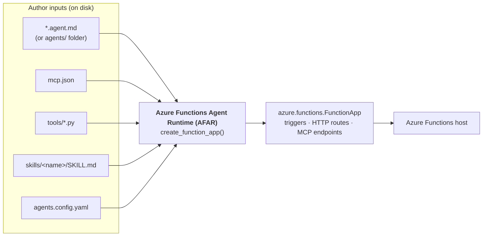
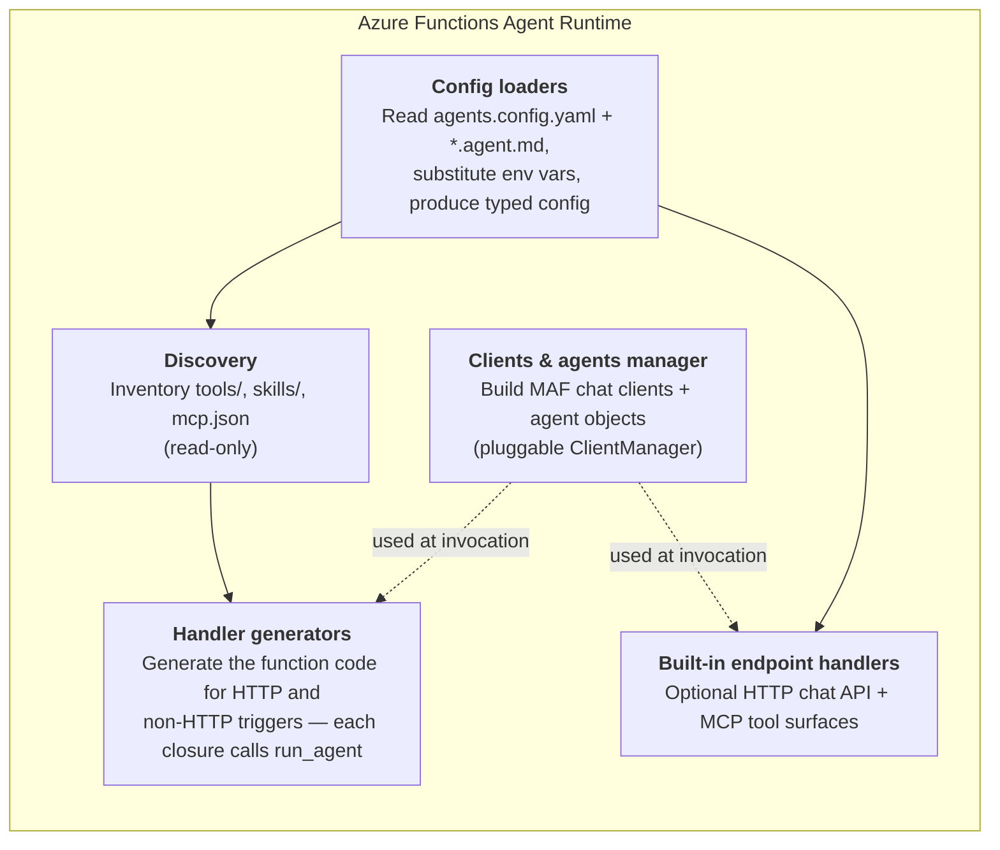
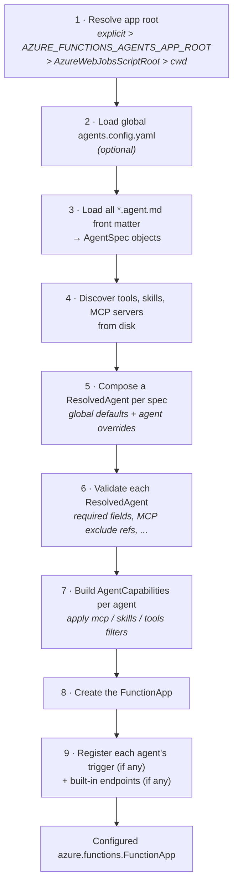
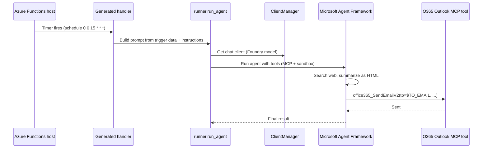

# Serverless Agents Runtime — Architecture overview

> A high-level, presentation-friendly tour of the **Serverless Agents Runtime**,
> the experience powered by the **Azure Functions Agent Runtime (AFAR)**. It is
> meant as an on-ramp: read this first, then dive into
> [`docs/architecture.md`](architecture.md) for the authoritative module map and
> the full startup pipeline.

## 1. The one-liner

You **write markdown**, and the runtime gives you **a running Azure Functions app**.

Serverless Agents Runtime lets you build event-driven and scheduled AI agents by
authoring `*.agent.md` files plus a little configuration. The **Azure Functions
Agent Runtime (AFAR)** — the `azurefunctions-agents-runtime` package — reads
those files at startup and translates them into Azure Functions triggers, HTTP
routes, and MCP surfaces. Every agent runs on the [Microsoft Agent Framework
(MAF)](https://github.com/microsoft/agent-framework).

- **Markdown-first** — instructions, trigger, and tool bindings live in `.agent.md`.
- **Any Azure Functions trigger** — timer, queue, blob, HTTP, Event Hub, Service Bus, Cosmos DB, connectors, and more.
- **Serverless** — scales to zero; multi-turn sessions persist in Azure Blob Storage.
- **One line of Python** — `app = create_function_app()`.

## 2. What the author provides → AFAR → what runs

A project is a folder of authoring inputs. AFAR consumes them and emits a single
`azure.functions.FunctionApp` that the Azure Functions host can run.



| Input | What it declares |
| --- | --- |
| `*.agent.md` | One agent: its instructions (markdown body) + trigger and options (front matter). |
| `agents.config.yaml` | Shared defaults for every agent (model, timeout, system tools). |
| `mcp.json` | Remote HTTP / connector-backed **MCP servers** the agents may call. |
| `tools/*.py` | Custom Python tools (`@tool`) auto-discovered and offered to agents. |
| `skills/<name>/SKILL.md` | Progressive-disclosure prompt modules loaded on demand. |

## 3. What's inside AFAR

AFAR is small and layered. At startup it does four jobs, then hands a finished
Function App back to the host.



| Responsibility | What it does | Where it lives |
| --- | --- | --- |
| **Config loaders** | Load configuration from the agent files; resolve env vars; build `AgentSpec`, `GlobalConfig`, `ResolvedAgent`. | `config/` |
| **Clients & agents manager** | Manage MAF chat clients and agent objects; swappable via `set_client_manager()`. | `client_manager.py`, `runner.py` |
| **Handler generators** | Generate the callable that turns trigger data / HTTP bodies into a prompt — internally calls `run_agent`. | `registration/_handlers.py`, `registration/triggers.py` |
| **Built-in endpoint creation** | Register optional debug chat UI, REST chat, SSE stream, and **MCP** tool. | `registration/endpoints.py` |

> Discovery is **read-only** (it only inventories what exists). Registration is the
> **only** Azure-aware stage. Execution is **deferred** — handlers call the runner
> lazily, only when a trigger or route actually fires.

## 4. The startup pipeline (9 steps)

When the host imports your `function_app.py` and calls `create_function_app()`,
AFAR runs these steps once. Left of the divider is **translation** (author input →
typed objects); right of it is **registration** (typed objects → Azure bindings).



Each step feeds the next: later stages trust that earlier ones already reduced
free-form author input into typed, validated objects. Registration never
re-parses YAML or front matter — it consumes `ResolvedAgent` and
`AgentCapabilities`. The passport objects that flow through are:

`Path` → `GlobalConfig` + `list[AgentSpec]` → `ResolvedAgent` → `AgentCapabilities` → `FunctionApp`

## 5. Behind the scenes — the Daily Tech News agent

Here is what AFAR does for a real agent. This is the sample Nick demos
([`samples/daily-tech-news-email`](../samples/daily-tech-news-email)).

**The author writes three small files:**

`daily_tech_news.agent.md`
```markdown
---
name: Daily Tech News Email
description: Fetches top tech news and emails a summary daily.
trigger:
  type: timer_trigger
  args:
    schedule: "0 0 15 * * *"
---

You are a news assistant. When triggered:
1. Find today's top tech headlines from reputable sources, with links.
2. Summarize them as a concise HTML email.
3. Email it to $TO_EMAIL with the subject "Daily Tech News Summary".
```

`mcp.json` (the Office 365 Outlook send-email tool, via a connector-backed MCP server)
```json
{
  "servers": {
    "office365-outlook": {
      "type": "http",
      "url": "$O365_MCP_SERVER_URL",
      "tools": ["office365_SendEmailV2"],
      "auth": { "scope": "https://apihub.azure.com/.default", "client_id": "$O365_MCP_CLIENT_ID" }
    }
  }
}
```

`agents.config.yaml` (shared defaults) + `function_app.py` (`app = create_function_app()`).

**What AFAR does with them at startup:**

1. Loads the front matter → an `AgentSpec` (name, description, `timer_trigger` at `0 0 15 * * *`, instructions body).
2. Discovers the `office365-outlook` MCP server from `mcp.json` and any `tools/` and `skills/`.
3. Composes a `ResolvedAgent`: applies the shared model (`$FOUNDRY_MODEL`) and `timeout: 900` from `agents.config.yaml`, resolves `$TO_EMAIL` in the instructions.
4. Validates it (has a trigger ✓, MCP references resolve ✓) and builds `AgentCapabilities` (the `office365_SendEmailV2` tool + code-interpreter sandbox).
5. Registers **one timer-triggered Azure Function** on the Function App, wiring a generated handler to it.

**What happens when the timer fires (15:00 UTC daily):**



The author never wrote a trigger binding, an HTTP handler, an MCP client, or
session-management code. AFAR generated all of it from the three files.

## 6. Where to go next

- [`docs/architecture.md`](architecture.md) — authoritative module map, data flow, and the full pipeline with implementing functions.
- [`docs/front-matter-spec.md`](front-matter-spec.md) — the `.agent.md` authoring format, field by field.
- [`docs/triggers.md`](triggers.md) — supported trigger types and their arguments.
- [`README.md`](../README.md) — install, quickstart, and model-provider configuration.
