# Azure Functions Agent Runtime architecture

## 1. Overview

`azure-functions-agents-runtime` turns a markdown-first agent project into an `azure.functions.FunctionApp`. The design goal is that you write `.agent.md` files plus a small amount of supporting configuration, and the runtime translates that authoring format into Azure Functions triggers, HTTP routes, MCP surfaces, and tool wiring. At startup, the runtime follows a three-stage pipeline: **discover** project files and inventories, **translate** them into typed runtime objects, and **register** the resulting agents on a Function App. The authoritative implementation of that pipeline lives in `src/azure_functions_agents/app.py:create_function_app()`.

One agent can also declare a `subagents:` list so its own model can call other agents as `delegate_<slug>` tools during a normal `agent.run()` — chat-time multi-agent delegation (FRD 0006). That feature layers a small amount of extra structure onto the same pipeline (an app-wide identity index and an immutable, slug-keyed catalog built before any `FunctionApp` mutation) rather than introducing a new one; see Section 5, "Multi-agent delegation (subagents)".

## 2. High-level data flow

```mermaid
flowchart LR
    A["Agent project inputs<br/>*.agent.md<br/>agents.config.yaml<br/>mcp.json<br/>skills/<br/>tools/"] -->|"Path"| B["config/paths.py"]
    B -->|"app_root: Path"| C["config/loader.py<br/>load_global_config<br/>load_agent_specs"]
    A -->|"Path"| D["discovery/*<br/>skills + tools + MCP"]
    C -->|"GlobalConfig + list of AgentSpec"| E["config/merge.py<br/>compose"]
    D -->|"discovered inventories"| E
    E -->|"list of ResolvedAgent"| E2["app.py<br/>identity index<br/>fail-fast on duplicate slugs"]
    E2 -->|"ResolvedAgent + known_slugs"| F["config/validation.py<br/>validate_resolved_agent<br/>validate_subagent_references"]
    F -->|"ResolvedAgent"| G["registration/capabilities.py<br/>build_capabilities"]
    G -->|"AgentCapabilities"| G2["registration/catalog.py<br/>build_catalog (immutable)"]
    G2 -->|"AgentCatalog"| H["registration/triggers.py<br/>registration/endpoints.py"]
    H -->|"Decorators applied"| I["azure.functions.FunctionApp"]
    J["client_manager.py<br/>ClientManager"] -.->|"chat client"| K["runner.py<br/>run_agent<br/>run_agent_stream<br/>build_subagent_tools"]
    H -.->|"handler closures + AgentCatalog"| K
    K -.->|"prompt + tools + session"| L["Microsoft Agent Framework"]
```



Read left to right: files on disk become typed config, typed config becomes a `ResolvedAgent`, and each resolved agent is registered as Azure Functions bindings plus optional built-in endpoints. The two extra nodes in the middle (`app.py`'s identity index and `registration/catalog.py`'s `build_catalog`) exist for multi-agent delegation (FRD 0006, Section 5 below): every agent's slug and capabilities are indexed and frozen *before* `H` mutates the `FunctionApp`, so a coordinator's `delegate_<slug>` tools can resolve any specialist regardless of file order.

A few boundaries are worth calling out explicitly:

- **Discovery is read-only.** These modules inspect the project tree and return inventories; they do not decide what any one agent is allowed to use.
- **Translation is type-driven.** The loader and merge layers convert loose YAML/markdown input into `AgentSpec`, `GlobalConfig`, and then `ResolvedAgent`.
- **Composition is two-pass and side-effect-free until pass 2.** `app.py`'s composition root builds the app-wide identity-slug index, fails fast on collisions, validates every `subagents:` reference, and freezes each agent's `ResolvedAgent` + `AgentCapabilities` into an immutable `AgentCatalog` — none of this touches the `FunctionApp` object. Only pass 2 (trigger/endpoint registration) mutates it (FRD 0006 §4.2).
- **Registration is Azure-specific.** This is the first stage that knows about `azure.functions.FunctionApp`, decorators, routes, and trigger bindings.
- **Execution is deferred.** The runner is not part of startup registration; it is called later by handler closures when an HTTP route or trigger actually fires.

## 3. Module map

| Package/module | Role | Key entry points |
| --- | --- | --- |
| `azure_functions_agents/app.py` | Top-level orchestrator that runs the startup pipeline and returns the configured app; owns the two-pass composition root (FRD 0006 §4.2) — builds the app-wide identity-slug index, fails fast on duplicate slugs, and freezes every agent's validated `ResolvedAgent` + `AgentCapabilities` into an immutable `AgentCatalog` before any `FunctionApp` mutation. | `create_function_app()`, `_fail_on_duplicate_slugs()` |
| `azure_functions_agents/config/paths.py` | Resolves the app root and the optional config/history directory. | `set_app_root()`, `get_app_root()`, `resolve_config_dir()` |
| `azure_functions_agents/config/env.py` | Performs env-var substitution and bool coercion across config string values in YAML, JSON, front matter, and markdown body content. | `substitute_env_vars_in_value()`, `resolve_env_vars_in_data()`, `substitute_env_vars_in_text()`, `_to_bool()` |
| `azure_functions_agents/config/schema.py` | Defines the Pydantic models for raw, global, and merged config, including the object-only `subagents:` reference shape. | `AgentSpec`, `GlobalConfig`, `ResolvedAgent`, `TriggerSpec`, `BuiltinEndpointsConfig`, `SubagentRef` |
| `azure_functions_agents/config/loader.py` | Loads YAML front matter and `agents.config.yaml` into typed models. | `load_agent_specs()`, `load_global_config()` |
| `azure_functions_agents/config/merge.py` | Applies defaults, overrides, and per-agent filters to produce runtime config, including each agent's identity `slug` (via `_slug.py`) and its normalized `subagents` list. | `compose()` |
| `azure_functions_agents/_slug.py` | Derives an agent's identity slug from its `.agent.md` filename (and the `delegate_<slug>` tool-name convention) in one shared place, so naming, config composition, and delegation can never compute a slug differently. | `_function_name_from_source()`, `delegate_tool_name()` |
| `azure_functions_agents/config/validation.py` | Post-merge sanity checks for resolved agents, including rejecting unknown/duplicate/self `subagents:` references against the app-wide slug index. | `validate_resolved_agent()`, `validate_subagent_references()` |
| `azure_functions_agents/discovery/skills.py` | Walks `skills/<name>/SKILL.md` files, validates frontmatter, and caches the name→directory map for MAF's `SkillsProvider`. | `discover_skills()`, `clear_skills_cache()` |
| `azure_functions_agents/discovery/tools.py` | Imports `tools/*.py`, finds normal `FunctionTool`/plain-function tools, discovers `@workflow_tool` Activity targets, and caches both inventories. | `discover_project_tools()`, `discover_user_tools()` |
| `azure_functions_agents/discovery/mcp.py` | Loads `mcp.json`, applies `resolve_env_vars_in_data()`, and translates remote HTTP server definitions into MAF MCP tool wrappers. | `discover_mcp_servers()` |
| `azure_functions_agents/registration/capabilities.py` | Applies per-agent MCP/skills/tools filters and packages the final runtime inventory; also fails fast when an auto-derived `delegate_<slug>` tool name collides with another tool already on the same agent. | `AgentCapabilities`, `build_capabilities()`, `validate_subagent_tool_names()` |
| `azure_functions_agents/registration/catalog.py` | Freezes every agent's `ResolvedAgent` + `AgentCapabilities` into one immutable, slug-keyed `AgentCatalog`, built once at startup and threaded read-only into request handlers (FRD 0006). | `AgentCatalog`, `CatalogEntry`, `build_catalog()` |
| `azure_functions_agents/registration/_naming.py` | Fails fast via `allocate_unique_function_name()` / `allocate_unique_builtin_slug()` when two `.agent.md` files sanitize to the same identity slug — a **breaking change** (FRD 0006 §5 Decision #17) replacing the previous silent auto-suffix behavior; re-exports the `_slug.py` helpers for backward compatibility. | `allocate_unique_function_name()`, `allocate_unique_builtin_slug()` |
| `azure_functions_agents/registration/_handlers.py` | Builds the callable closures that turn incoming trigger data or HTTP bodies into runner prompts, threading the `AgentCatalog` through to the runner and combining tool-error heuristics with explicit delegate-error accounting; delegates non-HTTP binding payloads to the trigger serializer. `make_http_agent_handler()` applies the shared `_auth` Entra guard to the request before any processing when the trigger's `auth` policy is `entra`. | `make_agent_handler()`, `make_http_agent_handler()`, `build_sandbox_tools_for_session()`, `_total_tool_error_count()` |
| `azure_functions_agents/registration/_trigger_serialization.py` | Uses native data contracts and public Azure Functions binding adapters to produce JSON-safe non-HTTP trigger payloads. | `serialize_trigger_data()`, `TriggerBindingSerializer` |
| `azure_functions_agents/registration/triggers.py` | Registers each agent trigger, dispatching between the runtime HTTP adapter and Azure Functions trigger decorators. Resolves an `http_trigger`'s inbound auth (nested `auth`, deprecated flat `auth_level`) into the shared `EndpointAuthConfig` and applies the `_auth` route `AuthLevel`. | `register_agent()` |
| `azure_functions_agents/registration/endpoints.py` | Registers debug chat UI, REST chat, SSE streaming, and MCP tools for agents with built-in endpoints. | `register_builtin_endpoints()` |
| `azure_functions_agents/registration/_auth.py` | Enforces inbound endpoint auth: maps the configured `auth.mode` to a Functions `AuthLevel` (API key / anonymous) and enforces Entra ID identity by trusting the platform-validated Easy Auth `x-ms-client-principal` header (never validating tokens in-app), with optional tenant/audience/client-id allowlists. Because `entra` routes are anonymous, the header is trusted only with non-spoofable evidence Easy Auth is enforced (`WEBSITE_AUTH_ENABLED` / `AZURE_FUNCTIONS_AGENTS_ENTRA_EASY_AUTH`); fails closed (401) otherwise. | `resolve_endpoint_auth_level()`, `authorize_entra_request()` |
| `azure_functions_agents/system_tools/sandbox.py` | Builds the ACA Dynamic Sessions-backed `execute_python` tool for a resolved agent/session, using a fresh GUID when no explicit session id is provided. | `create_sandbox_tools()` |
| `azure_functions_agents/system_tools/web_request.py` | Builds the default-on, SSRF-guarded `web_request` outbound HTTP tool, built once per agent at registration (no Azure resource required). | `create_web_request_tools()` |
| `azure_functions_agents/runner.py` | Executes prompts through the Microsoft Agent Framework, managing sessions, tools, and streaming; builds per-request `delegate_<slug>` tools from the `AgentCatalog` for agents that declare `subagents` (FRD 0006). | `run_agent()`, `run_agent_stream()`, `build_subagent_tools()` |
| `azure_functions_agents/client_manager.py` | Defines the pluggable inference-client abstraction and the default MAF-backed implementation. | `ClientManager`, `get_client_manager()`, `set_client_manager()` |
| `azure_functions_agents/workflows/*` | Experimental Dynamic Workflow runtime: Durable orchestration registration, workflow tool registry, plan validation/schema, session ownership, and workflow-management tools. | `register_workflows()`, `build_workflow_integration()` |
| `azure_functions_agents/_function_tool.py` | Thin local shim around MAF `FunctionTool` creation so project tools can use `@tool`, plus `@workflow_tool` metadata for Dynamic Workflow Activity targets. | `tool()`, `workflow_tool()` |
| `azure_functions_agents/_logger.py` | Shared package logger used across discovery, registration, and runtime code. | `logger` |
| `azure_functions_agents/_observability.py` | Cross-cutting OpenTelemetry bootstrap and conventions: enables MAF `gen_ai` instrumentation and, when the optional `[monitor]` extra is installed, the Azure Monitor exporter, provides the `af.*` span/attribute helpers (fault domain, lifecycle stage), the resolved sensitive-data flag from `ENABLE_SENSITIVE_DATA`, minimal dynamic-session and delegate-call metrics, and third-party log-noise control. | `configure_observability()`, `start_span()`, `current_span()`, `FaultDomain`, `LifecycleStage`, `record_delegate_call()` |

### How the packages line up

- `config/` answers **"what did the author write?"**
- `discovery/` answers **"what is available in this project folder?"**
- `app.py`'s composition root answers **"is this configuration internally consistent app-wide?"** (unique slugs, valid `subagents:` references) — the one cross-agent question no single `ResolvedAgent` can answer by itself.
- `registration/` answers **"which Azure Functions surfaces should exist for this agent?"**
- `system_tools/` answers **"which runtime-provided tools can be attached on demand?"**
- `runner.py` and `client_manager.py` answer **"once invoked, how does an agent call the model and its tools — including any specialist it delegates to?"**
- `_observability.py` (cross-cutting) answers **"what did the run do, and is a failure the app's, runtime's, platform's, or a delegated specialist's fault?"**

### Typical startup trace

When the host imports your app module and calls `create_function_app()`, control usually moves through the codebase in this order:

1. `app.py` resolves the project root.
2. `config/loader.py` reads `agents.config.yaml`.
3. `app.py` calls `_observability.configure_observability()`: when an Application Insights connection string is present, this bootstraps OpenTelemetry export + instrumentation once if the optional `[monitor]` exporter is available and no provider is already active; otherwise the runtime uses an already-active provider or no-ops.
4. `config/loader.py` reads every `*.agent.md` file and creates `AgentSpec` values.
5. `discovery/tools.py`, `discovery/mcp.py`, and `discovery/skills.py` build the shared inventories for the project.
6. `config/merge.py` turns each `AgentSpec` plus `GlobalConfig` into one `ResolvedAgent`, computing its identity `slug` via `_slug.py`.
7. `app.py`'s `_fail_on_duplicate_slugs()` builds the app-wide slug index and fails fast on collisions; `config/validation.py:validate_subagent_references()` then rejects unknown/duplicate/self `subagents:` references against that index.
8. `config/validation.py:validate_resolved_agent()` checks each merged object for missing triggers, bad MCP references, and similar config mistakes (an agent referenced only as a `subagents:` target is exempt from the trigger-or-`builtin_endpoints` requirement).
9. `registration/capabilities.py` converts name-based filters into concrete tool lists and skill paths, and fails fast on any `delegate_<slug>` tool-name collision.
10. `registration/catalog.py:build_catalog()` freezes every agent's `ResolvedAgent` + `AgentCapabilities` into one immutable `AgentCatalog` — this is the last step before anything touches the `FunctionApp`.
11. `registration/triggers.py` and `registration/endpoints.py` mutate one `FunctionApp` instance until all agents are registered, threading the frozen `AgentCatalog` through so handler closures can build `delegate_<slug>` tools later, at request time.

That ordering matters because later modules assume earlier stages have already reduced free-form author input into typed, validated objects. For example, registration code does not re-parse YAML or front matter; it trusts `ResolvedAgent` and `AgentCapabilities`. Steps 6-10 are FRD 0006's "two-pass composition" (§4.2): everything through step 10 is pure/side-effect-free (no `FunctionApp` mutation), and only step 11 is pass 2.

## 4. Pipeline stages

The `create_function_app()` docstring in `src/azure_functions_agents/app.py:create_function_app()` is the source of truth. The steps below restate it in module terms.

1. **Resolve app root**
   - **Implemented by:** `src/azure_functions_agents/app.py:create_function_app()`, `src/azure_functions_agents/config/paths.py`
   - **Input:** optional `app_root: Path | None` plus environment variables such as `AZURE_FUNCTIONS_AGENTS_APP_ROOT` and `AzureWebJobsScriptRoot`
   - **Output:** `resolved_root: Path`
   - **Notes:** this is the root path handed to every later loader/discovery function. `app.py` also calls `_allow_skill_reads()` immediately afterwards so built-in file readers can safely access the project's `skills/` directory.

2. **Load global `agents.config.yaml`**
   - **Implemented by:** `src/azure_functions_agents/config/loader.py:load_global_config()`
   - **Input:** `app_root: Path`
   - **Output:** `GlobalConfig`
   - **Notes:** missing config is valid and becomes `GlobalConfig()`. String values in `agents.config.yaml` are normalized through `config/env.py` via `resolve_env_vars_in_data()`, so env-var references are resolved before the Pydantic model is materialized.

3. **Load all agent markdown files**
   - **Implemented by:** `src/azure_functions_agents/config/loader.py:_load_agent_spec()`, `src/azure_functions_agents/config/loader.py:load_agent_specs()`
   - **Input:** `app_root: Path`
   - **Output:** `list[AgentSpec]`
   - **Notes:** the loader searches for `*.agent.md` files in two locations: the app root (`{app_root}/*.agent.md`) and an optional `agents/` folder (`{app_root}/agents/*.agent.md`). The folder name is case-insensitive (`agents/` or `Agents/`). Files from both locations are combined and sorted by path for deterministic ordering. Each file is parsed as YAML front matter plus markdown body. When substitution is enabled, front matter string values are normalized through `resolve_env_vars_in_data()` and the markdown body through `substitute_env_vars_in_text()`. The loader stamps `source_file`, sets `is_main` when the filename is `main.agent.md` (regardless of location), and stores the markdown body in `AgentSpec.instructions`.

4. **Discover runtime inventories from disk**
   - **Implemented by:** `src/azure_functions_agents/app.py:create_function_app()`, `src/azure_functions_agents/discovery/tools.py:discover_project_tools()`, `src/azure_functions_agents/discovery/mcp.py:discover_mcp_servers()`, `src/azure_functions_agents/discovery/skills.py:discover_skills()`
   - **Input:** `app_root: Path`
   - **Output:** project tools as normal user tools (`list[FunctionTool]`) plus workflow tools (`list[WorkflowTool]`), MCP servers as `dict[str, MCPTool]`, skills as `dict[str, Path]` (skill name → skill directory)
   - **Notes:** all three discovery modules cache by resolved app root, so startup pays the disk/import cost once per process. Tools discovery remains read-only policy-wise: it records what `tools/` exposes as normal tools and what callables explicitly opt into workflow Activity execution via `@workflow_tool`, but per-agent filtering happens later. MCP discovery applies the same env-var substitution helper (`resolve_env_vars_in_data()`) to parsed `mcp.json` data that the global-config loader applies to `agents.config.yaml`. MCP discovery is a translation step too: entries are built into ready-to-use MAF MCP tool objects when they carry a `url`; `type` is optional, but if present must be `"http"` or `"streamable-http"`. Other transport shapes (`stdio`, `sse`, etc.) and entries missing `url` are skipped with warnings. Skill discovery validates each `SKILL.md` frontmatter `name` against MAF's regex and fails fast on duplicates.

5. **Compose a per-agent runtime view**
   - **Implemented by:** `src/azure_functions_agents/config/merge.py:compose()`
   - **Input:** `AgentSpec`, `GlobalConfig`, `discovered_mcp_names: list[str]`, `discovered_skill_names: list[str]`
   - **Output:** `ResolvedAgent`
   - **Notes:** this is where startup-level precedence rules are applied. Timeout resolves from agent front matter, global config, `AZURE_FUNCTIONS_AGENTS_TIMEOUT_SECONDS`, and then the 900-second default. Model resolves from agent front matter, global config, or `AZURE_FUNCTIONS_AGENTS_MODEL`; if registration does not request a model, the active `ClientManager` later falls back to provider-specific env (`AZURE_OPENAI_DEPLOYMENT` for Azure OpenAI, `FOUNDRY_MODEL` for Microsoft Foundry) and then the provider default. Capability filters turn the global/shared inventories into per-agent allow/deny decisions. `ResolvedAgent.slug` (the agent's identity, derived from its source filename via `_slug.py`) and `ResolvedAgent.subagents` (its normalized `list[SubagentRef]`) are also produced here — both are load-bearing for the multi-agent delegation stages below (FRD 0006).

6. **Build the app-wide identity index; validate `subagents:` references**
   - **Implemented by:** `src/azure_functions_agents/app.py:_fail_on_duplicate_slugs()`, `src/azure_functions_agents/config/validation.py:validate_subagent_references()`
   - **Input:** `list[ResolvedAgent]`
   - **Output:** `known_slugs: set[str]` (every agent's identity slug, verified collision-free) and, per agent, a validated `subagents` list
   - **Notes:** this is FRD 0006 §4.2's "two-pass composition" pass 1a — the first cross-agent check, and it must run before any other per-agent validation. A slug doubles as the registered Azure Function name, the `/agents/<slug>/` built-in endpoint route, and the `delegate_<slug>` tool name other agents use to reach it, so two source files that sanitize to the same slug now **fail startup** with an actionable rename error instead of silently registering under an auto-suffixed name (a **breaking change** — see FRD 0006 §5 Decision #17 and the callout in `docs/front-matter-spec.md`, "File Naming Conventions"). `validate_subagent_references()` then rejects unknown, duplicate, and self references in each agent's `subagents:` list against `known_slugs`, and this stage also collects the app-wide set of slugs referenced by *any* agent's `subagents:` (consumed by the next stage).

7. **Validate the merged configuration**
   - **Implemented by:** `src/azure_functions_agents/config/validation.py:validate_resolved_agent()`
   - **Input:** each `ResolvedAgent`, discovered MCP server names as `list[str]`, discovered skill names as `list[str]`, and whether the agent is referenced as a subagent (from stage 6)
   - **Output:** the same validated `ResolvedAgent` (or an exception that skips registration for that agent)
   - **Notes:** validation checks that each agent defines a trigger or enables at least one built-in endpoint, rejects trigger decorator names that the agent runtime does not support, and ensures per-agent `mcp.exclude` entries match MCP servers discovered from `mcp.json`. Unknown skill and tool excludes are logged as warnings during the same pass. An agent referenced only as an internal specialist (present in stage 6's referenced-slug set) is exempt from the trigger-or-`builtin_endpoints` requirement — an endpoint-less agent is valid as long as some coordinator's `subagents:` reaches it.

8. **Build per-agent capabilities**
   - **Implemented by:** `src/azure_functions_agents/registration/capabilities.py:build_capabilities()`, `validate_subagent_tool_names()`
   - **Input:** `ResolvedAgent`, discovered user tools, discovered workflow tools, discovered MCP tools, discovered skills (`dict[str, Path]`)
   - **Output:** `AgentCapabilities`
   - **Notes:** this stage converts name-based filters into actual runtime objects. `tools.exclude` applies only to normal MAF tools; `workflows.exclude` applies only to workflow Activity targets and is honored only for `main.agent.md` in v1. Immediately afterward, `validate_subagent_tool_names()` fails fast if any auto-derived `delegate_<slug>` name would collide with another tool already on the same agent (user, MCP, sandbox, workflow-management, or another specialist's tool). After this point, the registration and runner layers do not need to reason about `exclude` lists; they only consume concrete tool lists and the final list of enabled skill directories.

9. **Freeze the per-agent results into an immutable `AgentCatalog`**
   - **Implemented by:** `src/azure_functions_agents/registration/catalog.py:build_catalog()`
   - **Input:** `dict[str, CatalogEntry]` — one entry per agent slug, pairing its validated `ResolvedAgent` and `AgentCapabilities`
   - **Output:** `AgentCatalog` (a read-only `MappingProxyType`, keyed by identity slug)
   - **Notes:** this closes FRD 0006 §4.2 pass 1 — everything through this stage is pure and side-effect-free; no `FunctionApp` exists yet and nothing has been mutated. Because the catalog holds every agent (not only the ones registered so far), a coordinator's `delegate_<slug>` tools can resolve *any* specialist by slug at request time, regardless of file or registration order.

10. **Create the Azure Functions app container**
    - **Implemented by:** `src/azure_functions_agents/app.py:create_function_app()`
    - **Input:** startup defaults such as `http_auth_level=func.AuthLevel.FUNCTION`
    - **Output:** `azure.functions.FunctionApp` (a Durable Functions `DFApp` when the main agent opts into `workflows.enabled`, otherwise a plain `FunctionApp`)
    - **Notes:** only one app object is created per startup pass. Every subsequent registration call mutates this object by attaching decorators and handlers.

11. **Register triggers and built-in endpoints (pass 2)**
    - **Implemented by:** `src/azure_functions_agents/app.py:create_function_app()`, `src/azure_functions_agents/registration/triggers.py:register_agent()`, `src/azure_functions_agents/registration/endpoints.py:register_builtin_endpoints()`, `src/azure_functions_agents/registration/_handlers.py`
    - **Input:** `FunctionApp`, `ResolvedAgent`, `AgentCapabilities`, and the frozen `AgentCatalog`
    - **Output:** the same `FunctionApp`, now decorated with trigger bindings, HTTP routes, SSE streaming routes, and/or MCP endpoints
    - **Notes:** agents go through `register_agent()` when they have a `trigger`. Any agent with built-in endpoints enabled also goes through `register_builtin_endpoints()`, which can add debug chat UI, `/agents/{slug}/chat`, `/agents/{slug}/chatstream`, and MCP tool surfaces. Each agent's identity slug (already guaranteed globally unique by stage 6) is used directly as its function name / built-in endpoint route — there is no allocator or de-duplication pass here anymore. Both registration calls also thread the frozen `AgentCatalog` through to the handler closures they build, so a coordinator's `delegate_<slug>` tools can be built later, at request time (see "Multi-agent delegation" below).

### Where the registration stage hands off to execution

Registration does not run the agent itself. Instead, `registration/_handlers.py` builds closures that call `runner.run_agent()` or `runner.run_agent_stream()`, passing the `ResolvedAgent` instructions plus the already-filtered `AgentCapabilities` — and, when the agent declares `subagents`, its `ResolvedAgent.subagents` list plus the frozen `AgentCatalog`. For non-HTTP triggers, the closure delegates payload construction to `registration/_trigger_serialization.py`: native `to_dict()`/`model_dump()` contracts are used first, then public Azure Functions binding adapters, batch recursion, and byte encoding produce JSON-safe prompt data. HTTP handlers build their request-body JSON separately and do not use this serializer. The runner then asks the active `ClientManager` to build a chat client, builds any `delegate_<slug>` tools fresh for this request, and executes through the Microsoft Agent Framework (`src/azure_functions_agents/runner.py`, `src/azure_functions_agents/client_manager.py`).

### Registration paths in practice

- **Endpoint-only agent (no trigger):** `create_function_app()` skips `register_agent()` whenever an agent has no `trigger`. If built-in endpoints are enabled, `register_builtin_endpoints()` can still expose the chat UI, REST, SSE, and MCP surfaces for interactive use. An agent with *neither* a trigger *nor* built-in endpoints is only valid when another agent's `subagents:` references it (stage 7's relaxation) — it is then reachable solely as a `delegate_<slug>` tool.
- **HTTP agent:** `registration/triggers.py` routes `http_trigger` to `make_http_agent_handler()`, which enforces the trigger's inbound `auth` policy (via the shared `_auth` module, identical to built-in endpoints — the route `AuthLevel` for key/anonymous modes and the in-app Easy Auth `x-ms-client-principal` check for `entra`), validates JSON input, and optionally validates the model's JSON-shaped response before replying. The registered function name is the agent's identity slug, already guaranteed unique at stage 6 — a colliding sanitized stem is a startup error, not an auto-suffixed name.
- **Built-in trigger:** `registration/triggers.py` calls `make_agent_handler()`, which uses the native-contract-first, adapter-based trigger serializer (`registration/_trigger_serialization.py`) to turn public binding data into JSON before sending the prompt to `runner.run_agent()`.
- **Connector trigger:** `connector_trigger` uses the Azure Functions Python `app.connector_trigger(...)` decorator when available, falling back to the equivalent generic `connectorTrigger` binding on older Azure Functions packages. It then reuses the same `make_agent_handler()` closure pattern as the built-in trigger path.

### Where MCP, sandbox, and web_request tools enter

- MCP server definitions are read from `mcp.json`, translated into MAF MCP tool wrappers by `discover_mcp_servers()`, and filtered per agent through capability settings.
- Connector actions are surfaced through connector-backed MCP servers. This keeps connector integration on the standard MCP discovery path and lets each server define its own transport, auth, and allowed tool set.
- Code interpreter configuration is read from `GlobalConfig.system_tools.dynamic_sessions_code_interpreter`, carried into `ResolvedAgent.sandbox_config`, and turned into per-session `execute_python` tool closures by `build_sandbox_tools_for_session()` right before a request is executed.
- Sandbox tools are intentionally later-bound: startup computes whether an agent may use them, but the actual tool objects are created as close as possible to runtime invocation.
- `web_request` configuration is resolved by `config/merge.py:_resolve_web_request()` into `ResolvedAgent.web_request_config` — **default-on** (enabled unless explicitly disabled globally or per agent), unlike the opt-in sandbox. `registration/capabilities.py:build_capabilities()` builds the tool **once per agent** at registration time (it needs no Azure resource, so there is no reason to defer it to invocation time like the sandbox) and carries it on `AgentCapabilities.web_request_tools`. It flows to the runner through a dedicated `web_request_tools` parameter parallel to (not merged with) `sandbox_tools`.

### What the runner receives from registration

By the time a handler calls `runner.run_agent()` or `runner.run_agent_stream()`, the registration layer has already done most of the policy work:

- `ResolvedAgent.instructions` becomes the per-agent instruction block.
- `ResolvedAgent.timeout` and `ResolvedAgent.model` become execution settings.
- `AgentCapabilities.filtered_user_tools` becomes the concrete user-tool list.
- `AgentCapabilities.filtered_workflow_tools` becomes the workflow Activity target inventory used by `build_workflow_integration()` for the main agent when workflows are enabled.
- `AgentCapabilities.filtered_mcp_tools` becomes the concrete MCP-tool list.
- `AgentCapabilities.enabled_skill_paths` becomes the list of skill directories handed to MAF's `SkillsProvider`.
- `AgentCapabilities.web_request_tools` becomes the concrete `web_request` tool list, passed to the runner via its own `web_request_tools` parameter.
- `build_sandbox_tools_for_session()` optionally adds per-session ACA dynamic session tools just before the call.
- `ResolvedAgent.subagents` (when non-empty) plus the frozen `AgentCatalog` are passed through so `runner.build_subagent_tools()` can build one `delegate_<slug>` tool per reference for this request; each tool's handler builds its own fresh specialist `Agent` per call (see "Multi-agent delegation" below).

The runner therefore focuses on execution concerns: session history, lock management, final tool assembly order, delegated-specialist construction, and streaming/non-streaming response handling.

## 5. Multi-agent delegation (subagents)

An agent's front matter may declare `subagents:` — a list of other agents in the same project it can call as tools while it runs (FRD 0006). This is **chat-time delegation**, not a new orchestration engine: a coordinator gets one `delegate_<slug>` function tool per declared specialist, and the model decides whether and when to call each one during its normal `agent.run()` tool-calling loop. There is no new dependency — the tool is hand-written (the same `@tool(schema=...)` pattern as the `web_request`/`execute_python` system tools), and its handler calls the specialist's plain, non-streaming `agent_framework.Agent.run(task)`, both already available in the pinned `agent-framework-core` version.

```yaml
---
subagents:
  - agent: billing        # references billing.agent.md's identity slug
    when: "Route billing, invoicing, and refund questions here."
  - agent: tech            # 'when' is optional; falls back to the specialist's own description
---
```

### Execution roles: `direct` vs `delegated`

Every `ResolvedAgent` can be built into a MAF `Agent` in one of two execution roles, chosen by the caller of `runner`'s internal agent builder — never by mutating the agent itself:

| Role | Used for | Tool set | Context |
| --- | --- | --- | --- |
| `direct` | An agent invoked through its own trigger or built-in endpoint | Its full `AgentCapabilities` tool set: user + MCP + skills, plus sandbox/`web_request`/workflow-management tools if applicable, plus its own `delegate_<slug>` tools if it declares `subagents` | The caller's session (history provider attached when applicable) |
| `delegated` | A specialist being invoked *as a sub-agent* by a coordinator | Only its static, per-agent tools: user + MCP + skills (`AgentCapabilities.filtered_user_tools` / `filtered_mcp_tools` / `enabled_skill_paths`) | Isolated — the handler's `agent.run(task)` call passes no `session=` argument at all; no coordinator history leaks in or out |

A specialist built in the `delegated` role "runs as itself" (FRD 0006 §5 Decisions #13/#15): its own instructions, model, and static tools are unchanged from how it would run directly. What differs is everything tied to being invoked *as a sub-agent rather than the top-level agent for this request*:

- **Per-request sandbox tools and main-only Dynamic-Workflow tools are naturally absent, not stripped** — `_build_delegated_agent()` simply never passes `sandbox_tools`/`workflow_enabled=True` when building a specialist, because those capabilities are scoped to the top-level request in the first place.
- **No `delegate_*` tools of its own.** `_build_delegated_agent()` deliberately never reads `resolved.subagents` for a specialist it is building — delegation is single-level (FRD 0006 §5 Decision #6). This is enforced *structurally*, by what the delegated-role builder never wires up, not by a runtime recursion-depth counter. A delegated specialist cannot itself delegate further, even if its own front matter declares `subagents:` for when it runs directly.
- **Isolated context.** The handler's `agent.run(task)` call passes no `session=` argument at all, so the specialist gets a private, empty conversation rather than the coordinator's history — the FRD's guidance is that a `task` argument should be a self-contained instruction, not "continue the conversation above."

Any independently runnable agent (has a trigger or built-in endpoints) may declare `subagents:` (FRD 0006 §5 Decision #18) — coordinators are not a distinct authoring concept, just agents that happen to reference others.

### Building `delegate_<slug>` tools

`runner.build_subagent_tools(subagents, catalog)` is called once per request, right before the coordinator's own `Agent` is constructed:

1. For each `SubagentRef` in `resolved.subagents`, look up the specialist's `CatalogEntry` in the immutable `AgentCatalog` by slug and build one hand-written `delegate_<slug>` function tool — the same `@tool(schema=...)` pattern this repo already uses for the `web_request`/`execute_python` system tools, not MAF's `BaseAgent.as_tool()`. The tool's schema is a single required `task: str` field; its name is always `delegate_<slug>` — never user-configurable (no `tool_name` field in the schema) — computed once, centrally, by `_slug.py:delegate_tool_name()` so the earlier tool-name-collision check and the tool actually built at request time can never drift apart. Only this cheap wrapper (schema + closure) is built here; append it to the coordinator's resolved tool list.
2. The tool's handler builds a **fresh** specialist `Agent` in the `delegated` role on every individual call — not once when the tool above is built. Specialists are rebuilt per call (never cached) because MAF's `Agent.run()` self-mutates state on the instance, and building one is cheap; the process-wide `ClientManager` is still reused for the underlying chat client. Building the specialist and awaiting its plain, non-streaming `agent.run(task)` directly (never `stream=True` — a delegate only ever needs the final text back) both happen inside the same `try`/`except`, so a failure constructing the specialist is just as recoverable as a failure running it — see "Failure and cancellation" below.

All declared specialists get their `delegate_<slug>` tool built **eagerly** (every tool exists on the coordinator up front); a given specialist's `Agent` is only actually built and *run* if the model chooses to call its tool.

**Failure and cancellation (FRD 0006 §5 Decision #12).** The handler distinguishes two very different situations:

- A **specialist failure** — an exception raised while *building* the specialist `Agent` (e.g. a misconfigured specialist model), an exception raised inside the specialist's own run, or the specialist exceeding its own timeout — is *recoverable*: the handler catches it, records full detail to telemetry, and returns a short, sanitized error string as the tool's `tool_end` result. The coordinator sees a normal (if unsuccessful) tool result and can retry, try another specialist, or explain the failure to the user; the coordinator's own run is not aborted. The specialist-facing timeout is `min(specialist's own configured timeout, coordinator's remaining time)`, computed from the coordinator's `run_agent()`-level deadline so a slow specialist cannot silently outlive its parent request.
- A **parent/request cancellation** (`asyncio.CancelledError`) IS caught by the handler, but only to annotate telemetry (the span outcome and, since it was genuinely dispatched, the delegate call metric — not counted as an error) before immediately re-raising, unhandled — it is never turned into a recoverable "tool error" result, so cancelling the coordinator's run (client disconnect, host shutdown, coordinator-level timeout) still propagates into any in-flight specialist call and aborts it too. Because the specialist runs through a plain, non-streaming `agent.run()` call, MAF's own OTel spans for that call close deterministically on cancellation too — no explicit finalize step is needed (see FRD 0006 §5 Decision #20).

**Concurrency (FRD 0006 §5 Decision #14, revised by #20).** There is no hard cap on how many specialists a coordinator may declare or call. Different specialists run fully in parallel when the model issues concurrent tool calls (e.g. via function-calling parallelism or an explicit `asyncio.gather` in the model's tool-call batch). Concurrent calls **to the same specialist** also run fully in parallel: because each call builds its own specialist `Agent` instance rather than sharing one, there is no live agent for two overlapping calls to contend over, so no lock is needed either.

### Observability

Delegation needs very little new plumbing because the runtime already enables MAF's OpenTelemetry (`gen_ai`) instrumentation, and MAF's own `FunctionTool.invoke()` auto-nests a delegate's `execute_tool delegate_<slug>` span and the specialist's `invoke_agent {specialist}` span under the coordinator's run — all under one Application Insights `OperationId`, including when several specialists run concurrently under `asyncio.gather`. FRD 0006 §4.12 (Decision #19) adds a small, deliberate layer on top, for parity with the sandbox and `web_request` tools:

- **`af.delegate.*` span attributes** set on the current span by the adapter: `af.delegate.specialist` (the slug), `af.delegate.task`/`af.delegate.task_bytes` (sanitized per the sensitive-data flag), `af.delegate.outcome` (`success` / `timeout` / `error`), and `af.delegate.response_bytes`/`af.delegate.result` on success.
- **A dedicated `FaultDomain` value** for delegation, so a failure inside a specialist call is attributed to the delegate boundary rather than misread as a generic tool or model fault.
- **`record_delegate_call(error=...)`** — a minimal metric emitted by `_observability.py` for every delegate invocation, mirroring the existing dynamic-session metrics.
- **Explicit delegated-error accounting.** The pre-existing `_looks_like_tool_error()` heuristic in `registration/_handlers.py` only recognizes sandbox-style JSON `{"error": ...}` / non-empty `stderr` tool results — it does not (and must not) try to pattern-match a specialist's sanitized free-text failure string. Instead, `build_subagent_tools()` returns a small `_DelegateErrorTracker` alongside the tools; every recoverable specialist failure increments it, and `_total_tool_error_count()` adds that count to the heuristic-based count before `_set_run_result_attributes()` sets `af.agent.tool_error_count` — so a delegated failure is always counted, without ever being misclassified by the sandbox heuristic.

### Multi-agent delegation vs. Dynamic Workflows

`subagents:` and Dynamic Workflows ([FRD 0004](frds/0004-dynamic-workflows.md)) solve different problems and can coexist on the same agent:

| | Multi-agent delegation (`subagents:`, this FRD) | Dynamic Workflows (`workflows:`) |
| --- | --- | --- |
| Who decides the plan | The model, turn by turn, inside one `agent.run()` call | The model authors an explicit multi-step plan up front, executed by a Durable Functions orchestration |
| Execution model | Synchronous function-tool calls nested in the coordinator's own run | Durable orchestrator + Activities, potentially long-running and independently retryable |
| Scope in v1 | Any agent may declare `subagents`; single-level only (a delegated specialist cannot itself delegate) | Only `main.agent.md` in v1 |
| Relationship | Orthogonal — a workflow Activity could itself be an agent with `subagents`, and a delegated specialist can be a normal agent that also has a trigger of its own | N/A |

Using a delegated specialist as a Dynamic-Workflow node ("subagents as Dynamic-Workflow nodes") is an explicit **v2 idea** and out of scope for this FRD — see the FRD's Future Work section.

## 6. Key types

These are the main "passport" objects that move through the pipeline:

- `AgentSpec` — raw parsed front matter plus markdown body for one `.agent.md` file. Defined in `src/azure_functions_agents/config/schema.py` as `AgentSpec`.
  - **Created by:** `config/loader.py:_load_agent_spec()`
  - **Consumed by:** `config/merge.py:compose()`
- `GlobalConfig` — parsed `agents.config.yaml`, including system-tool, model, timeout, and tool-filter defaults. Defined in `src/azure_functions_agents/config/schema.py` as `GlobalConfig`.
  - **Created by:** `config/loader.py:load_global_config()`
  - **Consumed by:** `config/merge.py:compose()`
- `ResolvedAgent` — post-merge per-agent runtime config after defaults, overrides, and filters are applied. Defined in `src/azure_functions_agents/config/schema.py` as `ResolvedAgent`.
  - **Created by:** `config/merge.py:compose()`
  - **Consumed by:** validation, capability building, trigger registration, endpoint registration, and sandbox/web_request-tool assembly
- `AgentCapabilities` — final filtered bundle of user tools, MCP tools, and skill directories. Defined in `src/azure_functions_agents/registration/capabilities.py` as `AgentCapabilities`.
  - **Created by:** `registration/capabilities.py:build_capabilities()`
  - **Consumed by:** `registration/triggers.py`, `registration/endpoints.py`, and the handler closures they create
- `SubagentRef` — one object-only entry from an agent's `subagents:` list (`agent: <slug>`, optional `when: <hint>`); `extra="forbid"`, no string shorthand, no `id`/`tool_name` fields. Defined in `src/azure_functions_agents/config/schema.py` as `SubagentRef`.
  - **Created by:** `config/loader.py:_load_agent_spec()` (parsed from front matter), normalized onto `ResolvedAgent.subagents` by `config/merge.py:compose()`
  - **Consumed by:** `config/validation.py:validate_subagent_references()`, `registration/capabilities.py:validate_subagent_tool_names()`, `runner.py:build_subagent_tools()`
- `CatalogEntry` / `AgentCatalog` — the pairing of one agent's `ResolvedAgent` and `AgentCapabilities`, and the immutable, slug-keyed `MappingProxyType` collecting every such pairing app-wide. Defined in `src/azure_functions_agents/registration/catalog.py` as `CatalogEntry` and `AgentCatalog`.
  - **Created by:** `registration/catalog.py:build_catalog()`, once per startup, after pass 1 validation completes for every agent
  - **Consumed by:** `registration/triggers.py`, `registration/endpoints.py` (threaded into handler closures), and `runner.py:build_subagent_tools()` (resolves a `SubagentRef.agent` slug to a specialist's identity + capabilities at request time)
- `azure.functions.FunctionApp` — the final Azure Functions app object created in `src/azure_functions_agents/app.py:create_function_app()` and returned to the host after registration completes.
  - **Created by:** `app.py:create_function_app()`
  - **Consumed by:** Azure Functions itself after the host imports the module and inspects the registered bindings

### Type hand-off summary

In shorthand, the runtime's startup path is:

`Path` --load--> `GlobalConfig` + `list[AgentSpec]` --compose--> `ResolvedAgent` (incl. `slug`, `subagents`) --validate+filter--> `AgentCapabilities` --freeze--> `AgentCatalog` --register--> `FunctionApp`

At invocation time, the runtime continues with:

`ResolvedAgent` + `AgentCapabilities` + `AgentCatalog` + request/trigger payload --handler--> `runner.run_agent()` / `run_agent_stream()` --builds `delegate_<slug>` tools from the catalog, then--> `client manager` --> model response (possibly nesting one or more specialist `agent.run()` calls)

### Why the types are split this way

- `AgentSpec` stays close to the author's source file, including optional fields and front-matter shape.
- `GlobalConfig` stays close to the shared YAML file and does not pretend to be agent-specific.
- `ResolvedAgent` is the "translation boundary" type: after this point the code stops asking where a value came from.
- `AgentCapabilities` is intentionally narrower than `ResolvedAgent`; it contains only execution-ready capability objects and flags.
- `AgentCatalog` is deliberately immutable and app-wide (not built incrementally per agent) — it is the one type whose whole purpose is to let a coordinator reach *any* other agent by slug, regardless of registration order, without ever letting a handler mutate another agent's resolved config.
- `FunctionApp` is external to the package, which is why the runtime creates it late and mutates it only after config translation is complete.

This split keeps parsing, policy, Azure binding registration, and runtime execution loosely coupled. It also makes it easier to extend one layer—such as client selection, connector tooling, or delegation—without changing the others.

## 7. Extension points

### Custom inference client

To plug in a different chat backend, implement the `ClientManager` interface and register it once with `set_client_manager(...)`; after that, `runner.run_agent()` and `runner.run_agent_stream()` use your implementation for every call. See `src/azure_functions_agents/client_manager.py` and the README section [Plugging in a custom client manager](../README.md#plugging-in-a-custom-client-manager).

This extension point is deliberately below the registration layer: no trigger or endpoint code needs to change when you swap providers. The `ResolvedAgent.model` value is still the hand-off contract, but your manager decides how to interpret it. Delegated specialists resolve their model through the same `ClientManager`, so a custom implementation applies uniformly to coordinators and specialists alike.

### Custom tools

To add project-specific tools, drop a `.py` file into `tools/` and expose either `@tool`-decorated functions or plain functions that can be auto-wrapped into `FunctionTool` objects. Discovery lives in `src/azure_functions_agents/discovery/tools.py:discover_project_tools()` (with `discover_user_tools()` kept as the normal-tool compatibility API), and the local decorator shim is in `src/azure_functions_agents/_function_tool.py:tool()`.

These tools enter the pipeline during discovery, are filtered in `build_capabilities()`, and are finally passed into `runner.run_agent()` alongside sandbox tools, the `web_request` tool, MCP tools, and (when declared) `delegate_<slug>` tools. In other words, adding a file under `tools/` affects discovery only; the rest of the pipeline remains unchanged.

Dynamic Workflow Activity targets use the same folder but require explicit `@workflow_tool` opt-in. A function decorated only with `@workflow_tool` is workflow-only; a plain public function or `@tool` value is normal-tool-only; using both decorators exposes the same callable in both places. This keeps Durable Activity execution explicit while preserving the existing plain-function normal-tool UX.

### Per-agent capability filtering

Each agent can narrow the shared inventory with front-matter `mcp`, `tools`, and `skills` settings; the runtime applies those filters when it builds `AgentCapabilities`. See `src/azure_functions_agents/registration/capabilities.py:build_capabilities()` and the detailed field reference in [`docs/front-matter-spec.md`](front-matter-spec.md).

This design keeps global config declarative: shared config says what exists, while agent front matter says what to exclude or opt out of. That separation is the reason the runtime has both a discovery stage and a capability-filtering stage instead of folding them together.

### Other notable boundaries

- **Skills:** discovered as `SKILL.md` directories and handed to MAF's `SkillsProvider`. The provider exposes `load_skill` / `read_skill_resource` tools to the agent and scopes file access to the skill directory by design — no runtime-wide file tools required.
- **Connectors:** connector actions are exposed to agents through MCP servers in `mcp.json`; connector-triggered agents use `trigger.type: connector_trigger`.
- **Built-in endpoints:** endpoint registration is a separate module so the trigger-registration path stays focused on Azure Function bindings rather than UI and chat surface concerns.
- **Multi-agent delegation:** `subagents:` is itself an extension point of sorts — it lets an agent's own front matter opt other, already-registered agents into its tool set without any code changes. See Section 5.
- **Observability:** telemetry is a cross-cutting concern rather than a pipeline stage. `_observability.py` is bootstrapped once from `create_function_app()`, and spans are emitted where the work happens — `registration/_handlers.py` (the `agent.run` parent span), `system_tools/sandbox.py` (the `dynamic_session.execute` span), `system_tools/web_request.py` (the `web_request` span, attributed by host only — never the full URL with query string or secrets), and `runner.py`'s delegate adapter (the `af.delegate.*` attributes layered onto MAF's own nested `execute_tool delegate_<slug>` / `invoke_agent` spans). It intentionally holds the only Azure-Monitor/ACA-aware calls outside registration, because exporting telemetry and correlating an execution are *observing* the pipeline, not wiring agents into it. Attributes use the `af.` prefix, and content is gated behind `ENABLE_SENSITIVE_DATA` (default off).

## 8. Related docs

- **This document intentionally stays at the architecture level.** It explains how modules fit together and what objects move between them, but it does not restate every front-matter field or every supported trigger binding.
- For authoring syntax, defaults, and field-by-field schema details, use the front-matter reference.
- For trigger names, arguments, and examples, use the trigger reference.
- Read those two docs alongside this one: this file explains the runtime's internal translation pipeline, while the others explain the external configuration contract.
- If you are tracing a startup issue, start with this document; if you are writing a new agent file, start with the front-matter spec.
- If you are debugging a missing tool, read Sections 3-7 here first, then check the front-matter spec for filters or opt-outs.
- If you are debugging a missing route or binding, compare Section 4 here with `docs/triggers.md`.
- If you are debugging delegation specifically — a missing `delegate_<slug>` tool, an unexpected duplicate-slug startup failure, or a specialist error that is not showing up where you expect — read Section 5 here, then [FRD 0006](frds/0006-multi-agent-delegation.md) for the full decision rationale, and `docs/observability.md`'s delegate conventions for the exact span attributes and metrics involved.

- [`docs/front-matter-spec.md`](front-matter-spec.md) — agent file format and configuration reference, including the `subagents:` field
- [`docs/triggers.md`](triggers.md) — supported trigger types and examples
- [`docs/observability.md`](observability.md) — OpenTelemetry enablement, the `af.*` span/attribute reference, sensitive-data gating, and cost control
- [`docs/frds/0006-multi-agent-delegation.md`](frds/0006-multi-agent-delegation.md) — the FRD behind Section 5, including the full Decisions log
