# Azure Functions Agent Runtime architecture

## 1. Overview

`azure-functions-agents-runtime` turns a markdown-first agent project into an `azure.functions.FunctionApp`. The design goal is that you write `.agent.md` files plus a small amount of supporting configuration, and the runtime translates that authoring format into Azure Functions triggers, HTTP routes, MCP surfaces, and tool wiring. At startup, the runtime follows a three-stage pipeline: **discover** project files and inventories, **translate** them into typed runtime objects, and **register** the resulting agents on a Function App. The authoritative implementation of that pipeline lives in `src/azure_functions_agents/app.py:create_function_app()`.

## 2. High-level data flow

```mermaid
flowchart LR
    A["Agent project inputs<br/>*.agent.md<br/>agents.config.yaml<br/>mcp.json<br/>skills/<br/>tools/"] -->|"Path"| B["config/paths.py"]
    B -->|"app_root: Path"| C["config/loader.py<br/>load_global_config<br/>load_agent_specs"]
    A -->|"Path"| D["discovery/*<br/>skills + tools + MCP"]
    C -->|"GlobalConfig + list of AgentSpec"| E["config/merge.py<br/>compose"]
    D -->|"discovered inventories"| E
    E -->|"ResolvedAgent"| F["config/validation.py<br/>validate_resolved_agent"]
    F -->|"ResolvedAgent"| G["registration/capabilities.py<br/>build_capabilities"]
    G -->|"AgentCapabilities"| H["registration/triggers.py<br/>registration/endpoints.py"]
    H -->|"Decorators applied"| I["azure.functions.FunctionApp"]
    J["client_manager.py<br/>ClientManager"] -.->|"chat client"| K["runner.py<br/>run_agent<br/>run_agent_stream"]
    H -.->|"handler closures + ResolvedAgent + AgentCapabilities"| K
    K -.->|"prompt + tools + session"| L["Microsoft Agent Framework"]
```

Read left to right: files on disk become typed config, typed config becomes a `ResolvedAgent`, and each resolved agent is registered as Azure Functions bindings plus optional built-in endpoints.

A few boundaries are worth calling out explicitly:

- **Discovery is read-only.** These modules inspect the project tree and return inventories; they do not decide what any one agent is allowed to use.
- **Translation is type-driven.** The loader and merge layers convert loose YAML/markdown input into `AgentSpec`, `GlobalConfig`, and then `ResolvedAgent`.
- **Registration is Azure-specific.** This is the first stage that knows about `azure.functions.FunctionApp`, decorators, routes, and trigger bindings.
- **Execution is deferred.** The runner is not part of startup registration; it is called later by handler closures when an HTTP route or trigger actually fires.

## 3. Module map

| Package/module | Role | Key entry points |
| --- | --- | --- |
| `azure_functions_agents/app.py` | Top-level orchestrator that runs the startup pipeline and returns the configured app. | `create_function_app()` |
| `azure_functions_agents/config/paths.py` | Resolves the app root and the optional config/history directory. | `set_app_root()`, `get_app_root()`, `resolve_config_dir()` |
| `azure_functions_agents/config/env.py` | Performs env-var substitution and bool coercion across config string values in YAML, JSON, front matter, and markdown body content. | `substitute_env_vars_in_value()`, `resolve_env_vars_in_data()`, `substitute_env_vars_in_text()`, `_to_bool()` |
| `azure_functions_agents/config/schema.py` | Defines the Pydantic models for raw, global, and merged config. | `AgentSpec`, `GlobalConfig`, `ResolvedAgent`, `TriggerSpec`, `BuiltinEndpointsConfig` |
| `azure_functions_agents/config/loader.py` | Loads YAML front matter and `agents.config.yaml` into typed models. | `load_agent_specs()`, `load_global_config()` |
| `azure_functions_agents/config/merge.py` | Applies defaults, overrides, and per-agent filters to produce runtime config. | `compose()` |
| `azure_functions_agents/config/validation.py` | Post-merge sanity checks for resolved agents. | `validate_resolved_agent()` |
| `azure_functions_agents/discovery/skills.py` | Walks `skills/<name>/SKILL.md` files, validates frontmatter, resolves markdown link includes (e.g., `[file](./path)`), and caches the resolved name→directory map for MAF's `SkillsProvider`. Skills with includes are copied to a temp directory with resolved content. | `discover_skills()`, `prepare_resolved_skills()`, `clear_skills_cache()` |
| `azure_functions_agents/discovery/tools.py` | Imports `tools/*.py`, finds `FunctionTool` values or wraps plain functions, and caches the result. | `discover_user_tools()` |
| `azure_functions_agents/discovery/mcp.py` | Loads `mcp.json`, applies `resolve_env_vars_in_data()`, and translates remote HTTP server definitions into MAF MCP tool wrappers. | `discover_mcp_servers()` |
| `azure_functions_agents/registration/capabilities.py` | Applies per-agent MCP/skills/tools filters and packages the final runtime inventory. | `AgentCapabilities`, `build_capabilities()` |
| `azure_functions_agents/registration/_naming.py` | Derives Azure-safe function names and built-in endpoint slugs from `.agent.md` filenames; allocates unique function names via `allocate_unique_function_name()` when sanitized stems collide. | `_safe_function_name()`, `_function_name_from_source()` |
| `azure_functions_agents/registration/_handlers.py` | Builds the callable closures that turn incoming trigger data or HTTP bodies into runner prompts. | `make_agent_handler()`, `make_http_agent_handler()`, `build_sandbox_tools_for_session()` |
| `azure_functions_agents/registration/triggers.py` | Registers each agent trigger, dispatching between the runtime HTTP adapter and Azure Functions trigger decorators. | `register_agent()` |
| `azure_functions_agents/registration/endpoints.py` | Registers debug chat UI, REST chat, SSE streaming, and MCP tools for agents with built-in endpoints. | `register_builtin_endpoints()` |
| `azure_functions_agents/system_tools/sandbox.py` | Builds the ACA Dynamic Sessions-backed `execute_python` tool for a resolved agent/session, using a fresh GUID when no explicit session id is provided. | `create_sandbox_tools()` |
| `azure_functions_agents/runner.py` | Executes prompts through the Microsoft Agent Framework, managing sessions, tools, and streaming. | `run_agent()`, `run_agent_stream()` |
| `azure_functions_agents/client_manager.py` | Defines the pluggable inference-client abstraction and the default MAF-backed implementation. | `ClientManager`, `get_client_manager()`, `set_client_manager()` |
| `azure_functions_agents/_function_tool.py` | Thin local shim around MAF `FunctionTool` creation so project tools can use `@tool`. | `tool()` |
| `azure_functions_agents/_logger.py` | Shared package logger used across discovery, registration, and runtime code. | `logger` |

### How the packages line up

- `config/` answers **"what did the author write?"**
- `discovery/` answers **"what is available in this project folder?"**
- `registration/` answers **"which Azure Functions surfaces should exist for this agent?"**
- `system_tools/` answers **"which runtime-provided tools can be attached on demand?"**
- `runner.py` and `client_manager.py` answer **"once invoked, how does an agent call the model and its tools?"**

### Typical startup trace

When the host imports your app module and calls `create_function_app()`, control usually moves through the codebase in this order:

1. `app.py` resolves the project root.
2. `config/loader.py` reads `agents.config.yaml`.
3. `config/loader.py` reads every `*.agent.md` file and creates `AgentSpec` values.
4. `discovery/tools.py`, `discovery/mcp.py`, and `discovery/skills.py` build the shared inventories for the project.
5. `config/merge.py` turns each `AgentSpec` plus `GlobalConfig` into one `ResolvedAgent`.
6. `config/validation.py` checks each merged object for missing triggers, bad MCP references, and similar config mistakes.
7. `registration/capabilities.py` converts name-based filters into concrete tool lists and skill paths.
8. `registration/triggers.py` and `registration/endpoints.py` mutate one `FunctionApp` instance until all agents are registered.

That ordering matters because later modules assume earlier stages have already reduced free-form author input into typed, validated objects. For example, registration code does not re-parse YAML or front matter; it trusts `ResolvedAgent` and `AgentCapabilities`.

## 4. Pipeline stages

The `create_function_app()` docstring in `src/azure_functions_agents/app.py:create_function_app()` is the source of truth. The steps below restate it in module terms.

1. **Resolve app root**
   - **Implemented by:** `src/azure_functions_agents/app.py:create_function_app()`, `src/azure_functions_agents/config/paths.py`
   - **Input:** optional `app_root: Path | None` plus environment variables such as `AZURE_FUNCTIONS_AGENTS_APP_ROOT` and `AzureWebJobsScriptRoot`
   - **Output:** `resolved_root: Path`
   - **Notes:** this is the root path handed to every later loader/discovery function. `app.py` also calls `_allow_skill_reads()` immediately afterwards so built-in file readers can safely access the project's `skills/` directory.

2. **Load global `agents.config.yaml`**
   - **Implemented by:** `src/azure_functions_agents/config/loader.py:load_global_config()`
   - **Input:** `app_root: Path`
   - **Output:** `GlobalConfig`
   - **Notes:** missing config is valid and becomes `GlobalConfig()`. String values in `agents.config.yaml` are normalized through `config/env.py` via `resolve_env_vars_in_data()`, so env-var references are resolved before the Pydantic model is materialized.

3. **Load all agent markdown files**
   - **Implemented by:** `src/azure_functions_agents/config/loader.py:_load_agent_spec()`, `src/azure_functions_agents/config/loader.py:load_agent_specs()`
   - **Input:** `app_root: Path`
   - **Output:** `list[AgentSpec]`
   - **Notes:** the loader searches for `*.agent.md` files in two locations: the app root (`{app_root}/*.agent.md`) and an optional `agents/` folder (`{app_root}/agents/*.agent.md`). The folder name is case-insensitive (`agents/` or `Agents/`). Files from both locations are combined and sorted by path for deterministic ordering. Each file is parsed as YAML front matter plus markdown body. When substitution is enabled, front matter string values are normalized through `resolve_env_vars_in_data()` and the markdown body through `substitute_env_vars_in_text()`. The loader stamps `source_file`, sets `is_main` when the filename is `main.agent.md` (regardless of location), and stores the markdown body in `AgentSpec.instructions`.

4. **Discover runtime inventories from disk**
   - **Implemented by:** `src/azure_functions_agents/app.py:create_function_app()`, `src/azure_functions_agents/discovery/tools.py:discover_user_tools()`, `src/azure_functions_agents/discovery/mcp.py:discover_mcp_servers()`, `src/azure_functions_agents/discovery/skills.py:discover_skills()`
   - **Input:** `app_root: Path`
   - **Output:** user tools as `list[FunctionTool]`, MCP servers as `dict[str, MCPTool]`, skills as `dict[str, Path]` (skill name → skill directory)
   - **Notes:** all three discovery modules cache by resolved app root, so startup pays the disk/import cost once per process. MCP discovery applies the same env-var substitution helper (`resolve_env_vars_in_data()`) to parsed `mcp.json` data that the global-config loader applies to `agents.config.yaml`. MCP discovery is a translation step too: entries are built into ready-to-use MAF MCP tool objects when they carry a `url`; `type` is optional, but if present must be `"http"` or `"streamable-http"`. Other transport shapes (`stdio`, `sse`, etc.) and entries missing `url` are skipped with warnings. Skill discovery validates each `SKILL.md` frontmatter `name` against MAF's regex and fails fast on duplicates.

5. **Compose a per-agent runtime view**
   - **Implemented by:** `src/azure_functions_agents/config/merge.py:compose()`
   - **Input:** `AgentSpec`, `GlobalConfig`, `discovered_mcp_names: list[str]`, `discovered_skill_names: list[str]`
   - **Output:** `ResolvedAgent`
   - **Notes:** this is where startup-level precedence rules are applied. Timeout resolves from agent front matter, global config, `AZURE_FUNCTIONS_AGENTS_TIMEOUT_SECONDS`, and then the 900-second default. Model resolves from agent front matter, global config, or `AZURE_FUNCTIONS_AGENTS_MODEL`; if registration does not request a model, the active `ClientManager` later falls back to provider-specific env (`AZURE_OPENAI_DEPLOYMENT` for Azure OpenAI, `FOUNDRY_MODEL` for Microsoft Foundry) and then the provider default. Capability filters turn the global/shared inventories into per-agent allow/deny decisions.

6. **Validate the merged configuration**
   - **Implemented by:** `src/azure_functions_agents/config/validation.py:validate_resolved_agent()`
   - **Input:** each `ResolvedAgent`, discovered MCP server names as `list[str]`, and discovered skill names as `list[str]`
   - **Output:** the same validated `ResolvedAgent` (or an exception that skips registration for that agent)
   - **Notes:** validation checks that each agent defines a trigger or enables at least one built-in endpoint, rejects trigger decorator names that the agent runtime does not support, and ensures per-agent `mcp.exclude` entries match MCP servers discovered from `mcp.json`. Unknown skill and tool excludes are logged as warnings during the same pass.

7. **Build per-agent capabilities**
   - **Implemented by:** `src/azure_functions_agents/registration/capabilities.py:build_capabilities()`
   - **Input:** `ResolvedAgent`, discovered user tools, discovered MCP tools, discovered skills (`dict[str, Path]`)
   - **Output:** `AgentCapabilities`
   - **Notes:** this stage converts name-based filters into actual runtime objects. After this point, the registration and runner layers do not need to reason about `exclude` lists; they only consume concrete tool lists and the final list of enabled skill directories.

8. **Create the Azure Functions app container**
   - **Implemented by:** `src/azure_functions_agents/app.py:create_function_app()`
   - **Input:** startup defaults such as `http_auth_level=func.AuthLevel.FUNCTION`
   - **Output:** `azure.functions.FunctionApp`
   - **Notes:** only one `FunctionApp` is created per startup pass. Every subsequent registration call mutates this object by attaching decorators and handlers.

9. **Register triggers and built-in endpoints**
   - **Implemented by:** `src/azure_functions_agents/app.py:create_function_app()`, `src/azure_functions_agents/registration/triggers.py:register_agent()`, `src/azure_functions_agents/registration/endpoints.py:register_builtin_endpoints()`, `src/azure_functions_agents/registration/_handlers.py`
   - **Input:** `FunctionApp`, `ResolvedAgent`, `AgentCapabilities`
   - **Output:** the same `FunctionApp`, now decorated with trigger bindings, HTTP routes, SSE streaming routes, and/or MCP endpoints
   - **Notes:** agents go through `register_agent()` when they have a `trigger`. Any agent with built-in endpoints enabled also goes through `register_builtin_endpoints()`, which can add debug chat UI, `/agents/{slug}/chat`, `/agents/{slug}/chatstream`, and MCP tool surfaces. During this step, `create_function_app()` threads a shared `registered_names` set through trigger and endpoint registration so duplicate sanitized function-name stems are auto-suffixed instead of colliding during Azure Functions host indexing.

### Where the registration stage hands off to execution

Registration does not run the agent itself. Instead, `registration/_handlers.py` builds closures that call `runner.run_agent()` or `runner.run_agent_stream()`, passing the `ResolvedAgent` instructions plus the already-filtered `AgentCapabilities`; the runner then asks the active `ClientManager` to build a chat client and executes through the Microsoft Agent Framework (`src/azure_functions_agents/runner.py`, `src/azure_functions_agents/client_manager.py`).

### Registration paths in practice

- **Endpoint-only agent (no trigger):** `create_function_app()` skips `register_agent()` whenever an agent has no `trigger`. If built-in endpoints are enabled, `register_builtin_endpoints()` can still expose the chat UI, REST, SSE, and MCP surfaces for interactive use.
- **HTTP agent:** `registration/triggers.py` routes `http_trigger` to `make_http_agent_handler()`, which validates JSON input and optionally validates the model's JSON-shaped response before replying. Before the decorator is applied, `create_function_app()` and `register_agent()` coordinate through a shared `registered_names` set so duplicate sanitized stems become `name`, `name_2`, `name_3`, and so on.
- **Built-in trigger:** `registration/triggers.py` calls `make_agent_handler()`, which serializes the trigger payload to JSON, turns it into a prompt, and sends it to `runner.run_agent()`. The same shared `registered_names` tracking means host-level Azure Function names auto-suffix on collision rather than failing registration.
- **Connector trigger:** `connector_trigger` uses the Azure Functions Python `app.connector_trigger(...)` decorator when available, falling back to the equivalent generic `connectorTrigger` binding on older Azure Functions packages. It then reuses the same `make_agent_handler()` closure pattern as the built-in trigger path. Connector-triggered agents participate in the same per-app `registered_names` allocation flow.

### Where MCP and sandbox tools enter

- MCP server definitions are read from `mcp.json`, translated into MAF MCP tool wrappers by `discover_mcp_servers()`, and filtered per agent through capability settings.
- Connector actions are surfaced through connector-backed MCP servers. This keeps connector integration on the standard MCP discovery path and lets each server define its own transport, auth, and allowed tool set.
- Code interpreter configuration is read from `GlobalConfig.system_tools.dynamic_sessions_code_interpreter`, carried into `ResolvedAgent.sandbox_config`, and turned into per-session `execute_python` tool closures by `build_sandbox_tools_for_session()` right before a request is executed.
- Sandbox tools are intentionally later-bound: startup computes whether an agent may use them, but the actual tool objects are created as close as possible to runtime invocation.

### What the runner receives from registration

By the time a handler calls `runner.run_agent()` or `runner.run_agent_stream()`, the registration layer has already done most of the policy work:

- `ResolvedAgent.instructions` becomes the per-agent instruction block.
- `ResolvedAgent.timeout` and `ResolvedAgent.model` become execution settings.
- `AgentCapabilities.filtered_user_tools` becomes the concrete user-tool list.
- `AgentCapabilities.filtered_mcp_tools` becomes the concrete MCP-tool list.
- `AgentCapabilities.enabled_skill_paths` becomes the list of skill directories handed to MAF's `SkillsProvider`.
- `build_sandbox_tools_for_session()` optionally adds per-session ACA dynamic session tools just before the call.

The runner therefore focuses on execution concerns: session history, lock management, final tool assembly order, and streaming/non-streaming response handling.

## 5. Key types

These are the main "passport" objects that move through the pipeline:

- `AgentSpec` — raw parsed front matter plus markdown body for one `.agent.md` file. Defined in `src/azure_functions_agents/config/schema.py` as `AgentSpec`.
  - **Created by:** `config/loader.py:_load_agent_spec()`
  - **Consumed by:** `config/merge.py:compose()`
- `GlobalConfig` — parsed `agents.config.yaml`, including system-tool, model, timeout, and tool-filter defaults. Defined in `src/azure_functions_agents/config/schema.py` as `GlobalConfig`.
  - **Created by:** `config/loader.py:load_global_config()`
  - **Consumed by:** `config/merge.py:compose()`
- `ResolvedAgent` — post-merge per-agent runtime config after defaults, overrides, and filters are applied. Defined in `src/azure_functions_agents/config/schema.py` as `ResolvedAgent`.
  - **Created by:** `config/merge.py:compose()`
  - **Consumed by:** validation, capability building, trigger registration, endpoint registration, and sandbox-tool assembly
- `AgentCapabilities` — final filtered bundle of user tools, MCP tools, and skill directories. Defined in `src/azure_functions_agents/registration/capabilities.py` as `AgentCapabilities`.
  - **Created by:** `registration/capabilities.py:build_capabilities()`
  - **Consumed by:** `registration/triggers.py`, `registration/endpoints.py`, and the handler closures they create
- `azure.functions.FunctionApp` — the final Azure Functions app object created in `src/azure_functions_agents/app.py:create_function_app()` and returned to the host after registration completes.
  - **Created by:** `app.py:create_function_app()`
  - **Consumed by:** Azure Functions itself after the host imports the module and inspects the registered bindings

### Type hand-off summary

In shorthand, the runtime's startup path is:

`Path` --load--> `GlobalConfig` + `list[AgentSpec]` --compose--> `ResolvedAgent` --filter--> `AgentCapabilities` --register--> `FunctionApp`

At invocation time, the runtime continues with:

`ResolvedAgent` + `AgentCapabilities` + request/trigger payload --handler--> `runner.run_agent()` / `run_agent_stream()` --client manager--> model response

### Why the types are split this way

- `AgentSpec` stays close to the author's source file, including optional fields and front-matter shape.
- `GlobalConfig` stays close to the shared YAML file and does not pretend to be agent-specific.
- `ResolvedAgent` is the "translation boundary" type: after this point the code stops asking where a value came from.
- `AgentCapabilities` is intentionally narrower than `ResolvedAgent`; it contains only execution-ready capability objects and flags.
- `FunctionApp` is external to the package, which is why the runtime creates it late and mutates it only after config translation is complete.

This split keeps parsing, policy, Azure binding registration, and runtime execution loosely coupled. It also makes it easier to extend one layer—such as client selection or connector tooling—without changing the others.

## 6. Extension points

### Custom inference client

To plug in a different chat backend, implement the `ClientManager` interface and register it once with `set_client_manager(...)`; after that, `runner.run_agent()` and `runner.run_agent_stream()` use your implementation for every call. See `src/azure_functions_agents/client_manager.py` and the README section [Plugging in a custom client manager](../README.md#plugging-in-a-custom-client-manager).

This extension point is deliberately below the registration layer: no trigger or endpoint code needs to change when you swap providers. The `ResolvedAgent.model` value is still the hand-off contract, but your manager decides how to interpret it.

### Custom tools

To add project-specific tools, drop a `.py` file into `tools/` and expose either `@tool`-decorated functions or plain functions that can be auto-wrapped into `FunctionTool` objects. Discovery lives in `src/azure_functions_agents/discovery/tools.py:discover_user_tools()`, and the local decorator shim is in `src/azure_functions_agents/_function_tool.py:tool()`.

These tools enter the pipeline during discovery, are filtered in `build_capabilities()`, and are finally passed into `runner.run_agent()` alongside sandbox tools and MCP tools. In other words, adding a file under `tools/` affects discovery only; the rest of the pipeline remains unchanged.

### Per-agent capability filtering

Each agent can narrow the shared inventory with front-matter `mcp`, `tools`, and `skills` settings; the runtime applies those filters when it builds `AgentCapabilities`. See `src/azure_functions_agents/registration/capabilities.py:build_capabilities()` and the detailed field reference in [`docs/front-matter-spec.md`](front-matter-spec.md).

This design keeps global config declarative: shared config says what exists, while agent front matter says what to exclude or opt out of. That separation is the reason the runtime has both a discovery stage and a capability-filtering stage instead of folding them together.

### Other notable boundaries

- **Skills:** discovered as `SKILL.md` directories and handed to MAF's `SkillsProvider`. The provider exposes `load_skill` / `read_skill_resource` tools to the agent and scopes file access to the skill directory by design — no runtime-wide file tools required.
- **Connectors:** connector actions are exposed to agents through MCP servers in `mcp.json`; connector-triggered agents use `trigger.type: connector_trigger`.
- **Built-in endpoints:** endpoint registration is a separate module so the trigger-registration path stays focused on Azure Function bindings rather than UI and chat surface concerns.

## 7. Related docs

- **This document intentionally stays at the architecture level.** It explains how modules fit together and what objects move between them, but it does not restate every front-matter field or every supported trigger binding.
- For authoring syntax, defaults, and field-by-field schema details, use the front-matter reference.
- For trigger names, arguments, and examples, use the trigger reference.
- Read those two docs alongside this one: this file explains the runtime's internal translation pipeline, while the others explain the external configuration contract.
- If you are tracing a startup issue, start with this document; if you are writing a new agent file, start with the front-matter spec.
- If you are debugging a missing tool, read Sections 3-6 here first, then check the front-matter spec for filters or opt-outs.
- If you are debugging a missing route or binding, compare Section 4 here with `docs/triggers.md`.

- [`docs/front-matter-spec.md`](front-matter-spec.md) — agent file format and configuration reference
- [`docs/triggers.md`](triggers.md) — supported trigger types and examples
