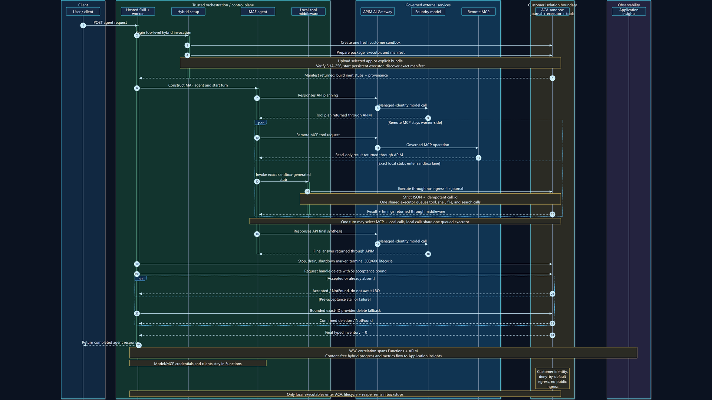

# Hybrid ACA Sandbox/APIM leadership demo

This package demonstrates one real Hosted Skills request flowing through Azure
Functions, API Management, Microsoft Learn MCP, and invocation-scoped ACA
Sandbox execution before returning a governed result and zero sandbox inventory.
The primary cut is a 2:34 narrated, live-first walkthrough built around the
recorded request, expanded tool details, active sandbox inventory, returned
result, and native Application Insights Agent Trace.

## Primary assets

| Asset | Purpose |
| --- | --- |
| `storyboard.md` | Timestamped 2:34 scene plan and narration |
| `record_live_flow.py` | Bounded live recorder with pre/post inventory gates |
| `record_agent_trace.py` | Redacted native Agent Trace recorder for a dedicated authenticated profile |
| `demo.html` | Supporting topology, lifecycle, trace, APIM, and result scenes |
| `record_scenes.py` | Reproducible supporting-scene recorder |
| `narration.json` | Narration source |
| `manifest.json` | Correlation window, claims, provenance, integrity, and paths |
| `request-flow.mmd` | Authoritative editable Mermaid sequence diagram |
| `evidence/hybrid-request-flow.svg` | Vector request-flow export for docs and inspection |
| `evidence/hybrid-request-flow.png` | 1920×1080 request-flow export used by the deck |
| `evidence/live-chat-tool-calls.png` | Expanded three-tool details plus one running sandbox |
| `evidence/live-chat-final-v4.png` | Returned MCP takeaway plus `ALPHA_COMPLETE` and `BETA_COMPLETE` |
| `evidence/live-sandbox-active.png` | Synchronized read-only ACA inventory during execution |
| `evidence/appinsights-agent-trace-portal.png` | Native Agents (Preview) trace with identifiers redacted |
| `evidence/appinsights-agent-trace.png` | Telemetry-derived trace visualization retained as analysis |
| `evidence/apim-foundry-mcp.png` | Live APIM policy configuration for model and MCP lanes |

## Detailed request flow

[](evidence/hybrid-request-flow.svg)

The [Mermaid source](request-flow.mmd) is authoritative because the diagram
describes a temporal request lifecycle rather than a static component map. The
[SVG export](evidence/hybrid-request-flow.svg) preserves crisp text and lines
for documentation and inspection; the
[1920×1080 PNG](evidence/hybrid-request-flow.png) is the predictable,
portable asset embedded in the PowerPoint appendix. The grouped colors mark
client, trusted Functions control plane, governed external services, customer
isolation, and observability trust zones.

The exports were generated locally with Mermaid CLI 11.12.0 and FFmpeg, without
adding a repository dependency or contacting Azure. From the repository root
in PowerShell, with `mmdc` 11.12.0, `ffmpeg`, and Chrome on `PATH`:

```powershell
$root = "docs\demo\hybrid-sandbox-leadership"
$source = "$root\request-flow.mmd"
$mermaidConfig = "$root\request-flow-mermaid-config.json"
$puppeteerConfig = "$root\request-flow-puppeteer-config.json"
$svg = "$root\evidence\hybrid-request-flow.svg"
$naturalPng = Join-Path $env:TEMP "hybrid-request-flow-natural.png"
$png = "$root\evidence\hybrid-request-flow.png"
$env:PUPPETEER_EXECUTABLE_PATH = (Get-Command chrome -ErrorAction Stop).Source

mmdc -i $source -o $svg `
  -c $mermaidConfig -p $puppeteerConfig `
  -b "#0B1220" -w 1920 -H 1080
mmdc -i $source -o $naturalPng `
  -c $mermaidConfig -p $puppeteerConfig `
  -b "#0B1220" -w 1920 -H 1080 -s 2
ffmpeg -y -v error -i $naturalPng `
  -vf "scale=1920:1080:force_original_aspect_ratio=decrease:flags=lanczos,pad=1920:1080:(ow-iw)/2:(oh-ih)/2:color=0x0B1220" `
  -frames:v 1 $png
```

The Mermaid render is intentionally padded rather than cropped so the PNG
retains every numbered interaction and note at a fixed 16:9 deck resolution.

The final MP4, silent master, contact sheet, raw Playwright recording, and
redacted telemetry exports are intentionally kept outside git. The external
artifact filenames and integrity hashes are recorded in `manifest.json`
without publishing a workstation path.

## Correlated live run

The bounded retained capture completed with HTTP 200. Exact live timestamps,
operation identifiers, resource names, and endpoints are intentionally omitted
from the public package.

- Function duration: 68.888 seconds
- Runtime span duration: 68.810 seconds
- Tool results: one Microsoft Learn MCP takeaway, `ALPHA_COMPLETE`, and
  `BETA_COMPLETE`
- Expanded details: `microsoft_docs_search`, `run_shell`, and `run_shell`
  surfaced during the active request
- Active inventory: one `Running` sandbox
- Final typed inventory: zero; no operator cleanup was used

The model surfaced three tool calls in one plan. The two local calls shared one
invocation sandbox and were safely queued by the same-sandbox file journal.
This is **parallel model fan-out with safe same-sandbox queuing**, not a claim
that local commands executed simultaneously. Both shell commands deliberately
held for 25 seconds so the recorder could observe the active sandbox. The
68.888-second capture duration is therefore not a service benchmark.

## Claim-to-evidence map

| Claim | Evidence |
| --- | --- |
| A real Hosted Skills request completed | Raw Playwright recording, Function request operation, and `live-chat-final-v4.png` |
| The agent used MCP plus two local tools | Expanded live details, returned markers, and same-run dependency spans |
| A sandbox was visible while tools were running | `live-sandbox-active.png` and the typed `Running: 1` observation |
| Foundry model and MCP traffic crossed APIM | Same-window APIM-role dependencies and `apim-foundry-mcp.png` |
| Only executable local tools entered ACA Sandbox | Same-run sandbox, file-journal, and shell spans; model and MCP remain outside the sandbox lane |
| One fresh sandbox was cleaned up | Same-run create/delete spans and final typed inventory of zero |
| The product exposes an Agent Trace view | `appinsights-agent-trace-portal.png`, captured from an earlier retained live agent run |
| The new capture is inspectable as one runtime lifecycle | `appinsights-agent-trace.png` plus the separately correlated runtime trace |
| The latest complete fallback-qualified path reduced measured runtime by 35.5% | The exact-source `fd6589e` qualification in `docs/decisions/0009-hybrid-sandbox-tool-execution-results.json` and the demo-results scene |

The capture window contains successful model and MCP traffic through APIM,
including two successful model `POST` requests. Expected MCP close/teardown
probes are not treated as request failures. No request or response bodies were
queried or recorded.

The demo's performance headline now uses the exact-source, quiet-boundary
qualification. An earlier streaming rerun was aborted after an inventory
safety-gate failure and is recorded as operational evidence, not as a
replacement benchmark.

The corrected nonstream retry also stopped after its single cold canary when
the ACA invocation-handle delete endpoint again failed to return response
headers within the five-second bound. No c1 or c10 request was admitted, and
the existing scoped reaper returned typed inventory to zero. This second
attempt motivated the exact-ID provider fallback. A subsequent 21-request run
crossed an overlapping deployment and is also excluded. The authoritative run
redeployed exact `fd6589e`, restarted the app, proved five quiet minutes, then
completed exactly 21 nonstream requests with zero inventory at every boundary.

The repository scene source, narration, and deck carry the new measurement.
The external v4 final video is not regenerated because its live-capture workflow
would send prohibited additional Function requests; it retains the historical
qualification and is labeled accordingly in the manifest.

## Recording provenance and limitations

- The Hosted Skills interaction is an actual 1920×1080 Playwright recording
  against the retained hybrid Functions app; it is not a mock or reconstructed
  animation.
- The recorder expanded the exact `3 tool calls` bubble and synchronized the
  typed ACA inventory observation with that UI state.
- The Function key was held only in process memory and injected after page
  load. Credential entry, key values, session identifiers, and detail payloads
  are absent from the recording.
- `appinsights-agent-trace-portal.png` and its raw WebM are native portal
  captures from a dedicated authenticated Edge profile. Account, operation,
  subscription, resource-path, tool-definition, and sandbox identifiers are
  redacted before capture.
- The native portal trace is an earlier retained live agent run. The
  68.8-second capture run did not appear as an `invoke_agent` row in the
  Agents (Preview) index, so the video explicitly separates the native product
  surface from the new run's telemetry-derived analysis.
- The dedicated browser profile is outside git. It contains sensitive
  authenticated state and must not be copied or committed.

## Safe rerun

Prerequisites:

1. Azure CLI authenticated to the subscription containing the retained resource
   group.
2. Python environment with this repository installed with development extras,
   Playwright, and an installed Chromium or Chrome executable.
3. Read access to the existing Function App and ACA Sandbox Group.
4. Empty sandbox inventory before starting. The recorder refuses to run
   otherwise and fails if final inventory is not zero.

From the repository root in PowerShell, use an artifact directory outside git.
The command below reads the existing resource IDs and key without printing the
key or placing it on the command line:

```powershell
$rg = "<resource-group>"
$functionApp = "<function-app>"
$sandboxGroup = "<sandbox-group>"
$output = Join-Path $env:TEMP "hybrid-sandbox-live-flow"
$chrome = "C:\Program Files\Google\Chrome\Application\chrome.exe"
$groupId = az resource show `
  --resource-group $rg `
  --resource-type "Microsoft.App/sandboxGroups" `
  --name $sandboxGroup `
  --query id -o tsv
$env:HYBRID_SPIKE_FUNCTION_KEY = az functionapp keys list `
  --resource-group $rg `
  --name $functionApp `
  --query "functionKeys.default" -o tsv

try {
  python docs\demo\hybrid-sandbox-leadership\record_live_flow.py `
    --output-root $output `
    --chrome $chrome `
    --sandbox-group $groupId `
    --region <azure-region>
} finally {
  Remove-Item Env:\HYBRID_SPIKE_FUNCTION_KEY -ErrorAction SilentlyContinue
  Remove-Variable groupId -ErrorAction SilentlyContinue
}
```

This sends exactly one request and requires explicit authorization. Do not
enable body logging, change resource settings, reprovision, or clean up
resources manually. If either inventory gate fails, stop and investigate rather
than sending another request.

Supporting scenes can be regenerated without Azure access:

```powershell
python docs\demo\hybrid-sandbox-leadership\record_scenes.py `
  --output-root "$env:TEMP\hybrid-sandbox-support" `
  --chrome $chrome
```

For a native Agent Trace capture, first authenticate interactively with the
skill's `open_persistent_browser.py`, verify the Microsoft directory in the
portal, and close that browser normally. Pass the selected trace's deep URL only
through process memory:

```powershell
$env:AGENT_TRACE_URL = "<selected redacted-capture source URL>"
try {
  uv run --with playwright python `
    docs\demo\hybrid-sandbox-leadership\record_agent_trace.py `
    --profile-dir "<authenticated-profile-outside-repository>" `
    --trace-url $env:AGENT_TRACE_URL `
    --output-root "$env:TEMP\hybrid-sandbox-agent-trace"
} finally {
  Remove-Item Env:\AGENT_TRACE_URL -ErrorAction SilentlyContinue
}
```

Use the supplied `playwright-demo-video.skill` scripts to trim the raw browser
recording, stitch the scene manifest, synthesize narration, mix overlays and
audio, create the contact sheet, and inspect the final media. Exact output
hashes and codecs are recorded in `manifest.json`.
