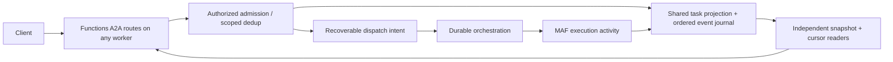

# Proposed A2A server architecture

> Design for [FRD 0009](../frds/0009-a2a-server.md), not current functionality.
> Delivery and acceptance gates: [implementation plan](a2a-implementation-plan.md).
> Baseline: `08b9d762d95f451ce926b89c166a14a2d345d433` (2026-09-08).

## 1. Existing behavior and dependency evidence

| Baseline surface | Evidence / consequence |
| --- | --- |
| App composition | [`app.py`](https://github.com/Azure/azure-functions-agents-runtime/blob/08b9d762d95f451ce926b89c166a14a2d345d433/src/azure_functions_agents/app.py#L208-L227) freezes catalogs, creates `DFApp` only for workflow agents, otherwise `FunctionApp`. Importing the module still eagerly imports Durable. |
| Chat SSE | [`endpoints.py`](https://github.com/Azure/azure-functions-agents-runtime/blob/08b9d762d95f451ce926b89c166a14a2d345d433/src/azure_functions_agents/registration/endpoints.py#L379-L459) returns HTTP Streams `StreamingResponse` on POST. No separate subscribe GET or A2A task lifecycle exists. |
| Model stream | [`runner.py`](https://github.com/Azure/azure-functions-agents-runtime/blob/08b9d762d95f451ce926b89c166a14a2d345d433/src/azure_functions_agents/runner.py#L1325-L1400) consumes `agent.run(stream=True)` and formats chat SSE strings directly. |
| Lifetime | The stream creates/closes its own `DurableFunctionsClient` because injected invocation-scoped clients close before the response generator finishes. Preserve this in the dependency refactor. |
| Concurrency/history | Runner `_SESSION_LOCKS` is process-local; `BlobHistoryProvider` stores transcripts, not durable A2A tasks, execution ownership, or event cursors. Atomic blob append does not serialize whole turns across workers. |
| Dependencies | [`pyproject.toml`](https://github.com/Azure/azure-functions-agents-runtime/blob/08b9d762d95f451ce926b89c166a14a2d345d433/pyproject.toml#L12-L39) already requires `azure-functions-durable==2.0.0b2`. Optionalizing is removal of an existing requirement, not avoidance of a new one. |
| Locked MAF graph | [`uv.lock`](https://github.com/Azure/azure-functions-agents-runtime/blob/08b9d762d95f451ce926b89c166a14a2d345d433/uv.lock#L12-L55): core `1.13.0`, openai `1.10.2`, foundry `1.10.3`. Traversing their locked dependency edges yields closures of 11, 24, and 48 packages respectively, none named Durable. The runtime is the only direct parent of `azure-functions-durable`; Durable brings `durabletask[opentelemetry]`. This is locked-graph evidence, not a fresh-wheel installation result. |

### Eager-import blockers

`__init__.py -> app.py -> workflows.integration` and
`__init__.py -> workflows.context` both reach Durable. Importing any workflow
submodule first executes `workflows/__init__.py`, which imports `context`,
`engine`, and `integration`. Additional edges:

| Module | Required separation |
| --- | --- |
| `app.py` | Move `azure.durable_functions` construction behind an enabled-feature gate, after config validation. |
| `registration/endpoints.py` | Remove unconditional `DurableFunctionsClient` import while keeping real binding annotations on enabled workflow handlers. |
| `workflows/__init__.py` | Make lightweight schema/metadata imports safe; preserve existing public exports without eagerly loading the engine. |
| `workflows/integration.py` | Separate pure catalog/policy work from imports of `engine` and `tools`. |
| `workflows/context.py`, `workflows/tools.py` | Context types must not drag the client SDK into ordinary package import; client construction/use remains on the enabled path. |
| `workflows/engine.py`, `workflows/native_retry.py` | Keep Durable and `durabletask.task` dependencies feature-local. |
| Root `__init__.py`, `_function_tool.py`, discovery | Keep public `workflow_tool` metadata and pure workflow exception/context exports usable without registering or importing the Durable engine. |

Type-checking imports alone are insufficient when Functions or tests use runtime
`get_type_hints()`: enabled binding wrappers must retain resolvable SDK types.
Do not solve this with `Any` annotations everywhere, missing SDK stubs, or broad
`ImportError` suppression. Catch only the absent optional dependency at the
feature boundary; dependency-internal import failures must remain visible.

## 2. Library and protocol compatibility gate

The requested integration is **MAF's A2A library** with an app-owned hosting
boundary. Source review distinguishes two server-capable choices:

| MAF option | Verified behavior | Decision |
| --- | --- | --- |
| `agent-framework-a2a==1.0.0b260821`, `A2AExecutor` | Creates/updates Task, creates a MAF session from task context, directly calls its agent, forbids `session`/`stream` in run kwargs, and its cancel method updates task status rather than implementing this design's distributed cancellation. Requires core >=1.15,<2. | Not a drop-in for direct Message MVP, existing runtime policy, or durable ownership. Do not confuse its name with `A2AAgentExecutor`. |
| `agent-framework-hosting-a2a==1.0.0a260730` | Alpha public `AgentA2AAdapter`, `a2a_to_run`, `a2a_from_run`, and workflow converters. Deliberately supplies no executor, task lifecycle/store, queues, HTTP routes, sessions, auth, or deployment. Requires core >=1.13,<2, SDK >=1,<2 and hosting `1.0.0a260730`. | Recommended: use its actual conversions while the runtime owns policy and the SDK handles protocol dispatch/models. Alpha adoption needs explicit approval. |

The published candidate tuple is hosting-a2a `1.0.0a260730`, hosting
`1.0.0a260730`, SDK `1.1.2`, and the existing core/openai/foundry pins. Hosting
helpers are metadata-compatible with core `1.13.0`; this is not proof of runtime
compatibility. The MAF source release train `python-1.17.0` is **not** the version
to substitute into all distribution requirements. No need to install both MAF
A2A options or upgrade the base core merely to use the hosting helpers.

Source and publication evidence, verified 2026-09-08:

- [MAF hosting-a2a README](https://github.com/microsoft/agent-framework/blob/4507512f95effaae4518d658e86e9afc0ccb4514/python/packages/hosting-a2a/README.md)
  defines application ownership, flat Parts, card construction, and conversion modes.
- [Conversion helpers](https://github.com/microsoft/agent-framework/blob/4507512f95effaae4518d658e86e9afc0ccb4514/python/packages/hosting-a2a/agent_framework_hosting_a2a/_conversion.py#L168-L190):
  `a2a_to_run` returns `AgentRunArgs` without creating sessions;
  [`a2a_from_run`](https://github.com/microsoft/agent-framework/blob/4507512f95effaae4518d658e86e9afc0ccb4514/python/packages/hosting-a2a/agent_framework_hosting_a2a/_conversion.py#L258-L318)
  accepts `AgentResponse | Message | AgentResponseUpdate` and returns `list[Part]`.
- [Opinionated executor](https://github.com/microsoft/agent-framework/blob/4507512f95effaae4518d658e86e9afc0ccb4514/python/packages/a2a/agent_framework_a2a/_a2a_executor.py#L94-L176)
  is the alternative above, not the selected lifecycle implementation.
- [Hosting-a2a manifest](https://github.com/microsoft/agent-framework/blob/4507512f95effaae4518d658e86e9afc0ccb4514/python/packages/hosting-a2a/pyproject.toml),
  [published hosting-a2a metadata](https://pypi.org/pypi/agent-framework-hosting-a2a/1.0.0a260730/json),
  [hosting metadata](https://pypi.org/pypi/agent-framework-hosting/1.0.0a260730/json),
  and [SDK 1.1.2 metadata](https://pypi.org/pypi/a2a-sdk/1.1.2/json)
  distinguish available distributions from source-only research.
- [Official MAF A2A guidance](https://learn.microsoft.com/en-us/agent-framework/integrations/a2a)
  describes the opinionated versus application-owned integration choices.

No Durable dependency appears in the selected helper/SDK manifests. Prove the
resolved wheel closure separately. Use SDK `[http-server]` only if reusing its
HTTP dispatcher needs Starlette/SSE dependencies; `[fastapi]` adds FastAPI too.
Do not default to `[all]`. GitHub SDK tag `v1.1.3` existed during research but its
public PyPI version endpoint returned 404; **1.1.2 is the published candidate**,
not an unverified promise to install 1.1.3.

The protocol target is [A2A v1.0.1](https://github.com/a2aproject/A2A/tree/3303592588e388e62e0f69f701af531d2f4e3991),
whose wire version is `1.0`. These are three independent values: normative spec
tag, wire version, and Python distribution version.

Pinned normative references for the contracts below:

| Contract | Specification v1.0.1 |
| --- | --- |
| Task-first or single-Message streaming | [Streaming responses](https://github.com/a2aproject/A2A/blob/3303592588e388e62e0f69f701af531d2f4e3991/docs/specification.md#L182-L212) |
| Current Task snapshot first | [SubscribeToTask](https://github.com/a2aproject/A2A/blob/3303592588e388e62e0f69f701af531d2f4e3991/docs/specification.md#L287-L311) |
| Execution mode / no-effect `returnImmediately` | [SendMessageConfiguration](https://github.com/a2aproject/A2A/blob/3303592588e388e62e0f69f701af531d2f4e3991/docs/specification.md#L431-L456) |
| Stream lifecycle, ordering, and replay scope | [Multiple streams](https://github.com/a2aproject/A2A/blob/3303592588e388e62e0f69f701af531d2f4e3991/docs/specification.md#L679-L694); [no complete-replay guarantee](https://github.com/a2aproject/A2A/blob/3303592588e388e62e0f69f701af531d2f4e3991/docs/specification.md#L747-L764) |

| Semantic operation | 1.0 JSON-RPC method | 0.3 compatibility name |
| --- | --- | --- |
| Send / stream | `SendMessage` / `SendStreamingMessage` | `message/send` / `message/stream` |
| Inspect | `GetTask` / `ListTasks` | `tasks/get` / not assumed equivalent |
| Cancel | `CancelTask` | `tasks/cancel` |
| Subscribe | `SubscribeToTask` | `tasks/resubscribe` |

An absent `A2A-Version` means 0.3; a 1.0-only service rejects it rather than
guessing. AgentCard interfaces declare the actual version. Do not mix 0.3 fields
such as status-event `final` into 1.0. Set push notifications false unless shipped.
Keep REST out of the first chain, including the spec/proto disagreement over
subscribe's verb, until a separate binding-conformance decision.

**Gate:** approve the Alpha tuple and resolve its optional dependencies; exercise
actual public native-1.0 models, handler interfaces, serialization, and card output.
If the package only supports 0.3, either approve a separately labeled 0.3 first
release or upgrade/extend through supported upstream APIs for 1.0. A hand-written
version field cannot make incompatible models compliant. The Functions HTTP
Streams bridge must preserve SDK status codes, headers, streaming iteration, and
error envelopes without mounting an ASGI application that replaces unrelated
Functions routes. Validate this bridge in P3's first working sample before
exposing the interface, and discuss the evidence before P4/P5. If it fails, stop
for a design decision; do not silently substitute a different library. Durable
import/package isolation is not a prerequisite for this executable validation.

## 3. Composition and execution seams

Discovery remains read-only. Translation produces typed A2A config and
capabilities. Registration receives `ResolvedAgent`/`AgentCapabilities` plus the
immutable `AgentCatalog`, and owns Functions decorators, inbound auth, and HTTP
request/response adaptation. It must not parse YAML again.

The app-owned SDK `RequestHandler` uses MAF conversion helpers and invokes the existing runtime execution policy, including
client selection, tools, skills, harness configuration, delegation restrictions,
and session/history management. Replacing it with a minimally constructed MAF
agent would bypass runtime behavior. Conversely, parsing the existing chat SSE
strings back into A2A events would couple two independent wire protocols.

For the simple text-only profile, `a2a_to_run` performs protocol-to-MAF conversion;
the adapter then validates the supported text subset and supplies the existing
runner prompt. Reject unsupported structured/file input instead of silently
flattening it. The runner's public `AgentResult` is not a MAF `AgentResponse`:
adapt its final content into a supported MAF assistant Message for `a2a_from_run`,
then group returned Parts into one A2A Message. Do not pass `AgentResult` to the
converter as if the types matched.

Introduce a **private typed execution-event seam** consumed by existing chat
formatting and the A2A adapter. Events distinguish text output, tool lifecycle,
completion, and execution failure without HTTP encoding. Keep reasoning and raw
tool arguments/results private by default on A2A; they are not automatically
public artifacts. The seam preserves deadlines, usage accounting, nested MAF
stream finalization, session cleanup, and exception propagation. Preserve
allowlisted native MAF updates at this boundary for the existing
`a2a_from_run(AgentResponseUpdate)` converter; do not invent a new token converter
or leak arbitrary update metadata. Group Parts into task artifacts/status events
in the app adapter; the helper deliberately does not own that lifecycle.

The initial simple adapter can reuse non-streaming execution; the event seam is
introduced only with a real chat consumer and characterization coverage, not as
unused public scaffolding. Card conversion through `AgentA2AAdapter` is async;
validate how it fits synchronous app composition (for example lazy async card
materialization from frozen config), without calling `asyncio.run` in a running
worker loop. Card capabilities are supplied explicitly from shipped behavior,
not inferred from model streaming support. The library gate covers this bridge.
The FRD's per-agent card route requires an explicitly configured card URL or SDK
`card_path`; it is not domain-root well-known auto-discovery. A root singleton or
agent-selection convention is deferred.

## 4. Capability profiles and protocol mapping

| Profile | Behavior | Honest boundary |
| --- | --- | --- |
| `simple` | Authorized text -> runtime result -> one direct Message. Streaming false. | No Task backend, async admission, subscribe, or cancel. Reject supplied task continuation; `returnImmediately` has no effect for direct Message. |
| `basic` | Task-first SSE, bounded process-local task projection and ordered local events. | P5b must reject deployed/multi-worker startup; if that cannot be reliably enforced, test-only. No restart/cross-worker or production claim. |
| `durable` | Task admission/execution independent of HTTP; shared projection/journal and per-subscriber cursors. | Internal/experimental through P9b; public config/cards only after P10. No exactly-once model/tool execution or unlimited stream duration. |

Basic SSE is not permission to equate disconnect with CancelTask. A local
supervisor owns execution independently of each response generator; local
subscriptions, get/cancel support, and bounded retention must work within that
process. P5a implements that private lifecycle with real contract tests; P5b adds
the SSE adapter and enforced deployment guard. A host restart loses state.
Without a reliable local-only startup guard this stays internal/test-only, not a
public configuration choice or `streaming: true` capability.

For task-producing 1.0 `SendMessage`, omitted/false
`configuration.returnImmediately` waits for a terminal or interrupted result.
Specification section 3.2.2 says that flag has **no effect** for a direct Message
or streaming. Simple mode returns its Message normally even if the flag is true;
it must not promise asynchronous Task scheduling. Durable non-streaming mode may
acknowledge a non-final Task early only when the request permits it and admission
is durably recorded.

Incremental output uses a Task first, then `TaskStatusUpdateEvent` and
`TaskArtifactUpdateEvent`; stable `artifactId`, `append`, and `lastChunk` describe
artifact assembly. Coalesce text into bounded batches, not one storage write or
Durable history item per token. Finish artifact output before terminal status.
A message-only streaming response is exactly **one Message**, not token Messages.
Use SDK domain errors and JSON-RPC envelopes, not chat `{"type":"error"}` events.

Terminal `completed`, `failed`, `canceled`, and `rejected` tasks cannot accept more
messages or new subscriptions. `INPUT_REQUIRED` and `AUTH_REQUIRED` are
interrupted, retain resumable state, and are not generic terminal failures.
Do not universally close every interrupted stream: apply the spec's
authentication-required keep-stream recommendation in the selected profile.

### Identity, mapping, and authorization

The server generates opaque `taskId`; `contextId` groups related tasks. Persist
the mapping from authenticated owner scope + agent slug + context to a safe
runtime session ID. Do not accept arbitrary task/context IDs as runner filenames.
A supplied task must belong to the same principal/agent/context; reject mismatches
before model execution. For an initial request **without contextId**, deduplicate
by authenticated owner + agent + client message ID before generating context/task
IDs; retries without context return the original mapping. For existing contexts,
include context in the dedup scope. Store canonical payload hashes and reject
conflicting reuse in either case; generating a fresh context before dedup would
incorrectly create a new task on each retry.

Reuse `_auth.py` for inbound authentication, but add task-level authorization:
get/list/subscribe/cancel/continuation and artifact reads must all enforce owner
scope. Function keys identify an application access boundary, not individual
users; shared-key/anonymous modes must be explicitly single-trust-domain profiles
or denied for multi-user durable tasks. Tenant equality and ID possession are
not sufficient. Listing filters scope before pagination; use non-enumerating
not-found responses for unauthorized task IDs. Never trust arbitrary principal
headers without the existing Easy Auth enforcement checks.

## 5. Durable distributed architecture

No frontend, .NET host, or Python worker affinity is required. The executor may
run elsewhere; each HTTP stream is only a reader of shared state. Durable owns
durable scheduling and coarse lifecycle, while LLM calls and tools run in
activities, never deterministic orchestrator code.

### State, admission, and consistency

Persist a task projection containing identity scope, context mapping, status,
artifacts/references, last sequence, execution attempt/owner epoch, cancellation
intent, expiry, and orchestration linkage. Keep internal sequence/ownership
metadata out of standard protocol fields unless a negotiated extension uses it.
Events are append-only per task with a unique increasing sequence.

P6a implements/tests atomic state transition and event append (or log-derived
snapshots), before admission or streaming wiring. P8 adds readers, not publication
correctness: a reader obtains the current Task and watermark N
consistently, emits that Task first, and then reads N+1 onward. Do not perform an
uncoordinated snapshot read followed by a new live-only listener.

Admission atomically records deduplication, initial Task, and recoverable dispatch
intent. An outbox dispatcher retries scheduling with stable orchestration identity
and verifies duplicate/start outcomes. Specify reconciliation for both "accepted
but unscheduled" and "scheduled but acknowledgement lost"; never use best-effort
dual writes that can orphan tasks. Storage Queue may wake the dispatcher, but is
not the source of accepted-task truth.

The tentative first store is Azure Table for compact metadata/events plus Blob
for large artifacts. It is **not finalized**: the implementation gate must define
partition keys and prove the actual atomic transaction boundaries for admission,
deduplication, projection, and publication. Table transactions cannot span
partitions and have operation/payload limits; a cross-partition list index is a
rebuildable projection, not an authorization or admission authority. Choose
another transactional store if these invariants cannot be met cleanly.
Durable's `host.json` backend selection and the A2A journal store are separate
concerns; DTS does not automatically supply a token-event journal.

### Execution, ownership, and retry

Use conditional writes (ETag/CAS) and owner epochs/fencing for each execution
attempt. Reject stale activity publications after cancellation, takeover, or
terminal transition. Lease renewal alone is insufficient: every write validates
the current epoch. Apply equivalent distributed coordination to shared context
turns; the existing process-local chat lock cannot protect them.

Do not replay live LLM calls inside orchestrators or put each token in orchestration
history. Activity retries may rerun the model or tools. Reuse stable per-logical
tool-operation idempotency keys where supported; document non-idempotent side
effects and do not enable indiscriminate retries. Define whether a retry resumes
from a checkpoint or supersedes a partial artifact; never append a regenerated
answer blindly onto output from a failed attempt.

Separate cancellation intent from confirmed `canceled` state. `CancelTask` records
a distributed request, wakes/signals the executor, and returns the actual current
state according to protocol rules. The executor checks cancellation at safe
boundaries, closes MAF/client resources, and publishes the terminal transition.
Orchestration termination does not kill an already running activity or undo tools
([Durable instance management](https://learn.microsoft.com/en-us/azure/azure-functions/durable/durable-functions-instance-management#terminate-instances)).
Race completion against cancellation through the same fenced state transition.

### Subscriptions, retention, and operations

Subscribers use independent cursors over the same journal: they must not consume
each other's events. Neither a competing-consumer Storage Queue nor a Redis
consumer group implements broadcast delivery by itself. One subscriber's
disconnect releases that reader, not execution or other readers.

Full historic replay and `Last-Event-ID` are not required by the chosen baseline
contract. The protocol allows missed transient statuses; current Task state plus
ordered continuation is the supported default. A journal enables durable
continuation, not an unlimited replay promise. Define event and artifact retention,
task expiry, authorization after expiry, pagination limits, and behavior when a
slow reader falls behind retained data. Never silently skip gaps. Reconnect with
a fresh snapshot or return an explicit expiry/resync error as appropriate.

Bound active tasks, stream count, per-subscriber memory, output size, batching
latency, and idle periods when each surface first ships (P3, P5a/b, P6a/b/c, P8).
Retention, artifact authorization, and cursor-gap handling are not deferred to
P10; that gate aggregates/tunes existing safeguards. Heartbeats are SSE comments,
not A2A domain events.
Model deadlines, function execution timeouts, proxy idle limits, and total HTTP
connection limits are distinct; neither an exact universal 230-second SSE cap
nor "heartbeats make streams unlimited" is a valid guarantee. Document measured
hosting-plan behavior only after a separate deployment acceptance exercise.
Emit sanitized task/cursor/retry/cancel metrics without prompts, tokens, secrets,
or raw principal/session IDs.

## 6. Dependency profiles and release gates

Delivery prioritizes the working P3 simple server/sample and P4/P5 basic SSE
before P1/P2 dependency isolation. The table describes the **post-P2 target**,
not the initial P3/P5 installation: until P2, the existing mandatory Durable
dependency remains, and until P1 its eager imports may remain. With workflows
disabled, those samples use no Durable execution/bindings; P1/P2 later prove
Durable-free imports/installations while preserving the same working samples.

| Proposed install | Durable installed? | Startup with no workflows | Enabled capability |
| --- | --- | --- | --- |
| Base | No | Plain `FunctionApp`, no Durable imports/bindings | Existing non-workflow runtime |
| `[monitor]` | No | Same, plus optional exporter | Monitoring only |
| `[a2a]` | No | Plain `FunctionApp`; MAF A2A imported only when configured | Simple; basic only after its gate |
| `[workflows]` | Yes | Plain app if workflows disabled | Existing workflows when enabled |
| `[a2a-durable]` | Yes | Plain app unless durable A2A/workflows enabled | Durable A2A after its gates |
| `[workflows,a2a]` | Yes | Workflow-driven `DFApp` only when workflows enabled | Workflows plus simple/basic A2A |
| `[workflows,a2a-durable]` | Yes | One `DFApp` when either durable feature enabled | Both engines without duplicate registration |

Test actual built wheels in fresh environments, not only a development checkout
that already has Durable installed. Check resolved `Requires-Dist` closure, package
import, direct runner import, app creation, generated binding metadata, and plain
chat execution with a fake inference client. Add an import blocker test to detect
accidental `azure.durable_functions`/`durabletask` imports even in fully provisioned
developer environments. Test missing extras and broken installed dependencies
separately. The selected MAF hosting distribution's transitive closure must also
pass: moving only the runtime's direct dependency is not sufficient.

## 7. Rationale and remaining decisions

MCP legacy SSE's owner backplane forwards **inbound** JSON-RPC arriving at a
different .NET host to a queue named `mcp-backplane-{instanceId}`; matching local
sessions bypass it. It is not a token-output journal, and MCP Streamable HTTP's
stateless path is a separate design. Do not infer fixed latency or constant-cost
advantages when the traffic differs. If owner routing were chosen, a random
process-unique Python owner ID would suffice; mandatory host-plus-PID routing is
not an inherent requirement. This design instead needs recoverable execution and
any-worker reads, so it chooses shared state and events.

A shared SDK `TaskStore` is not a distributed executor, ordered event bus, or
exact-replay engine. SDK 1.1.2's
[`DefaultRequestHandlerV2`](https://github.com/a2aproject/a2a-python/blob/3e6fa6a41d64f0581202df214a0515a0b0194832/src/a2a/server/request_handlers/default_request_handler_v2.py#L79-L113)
creates a local `ActiveTaskRegistry`; its `queue_manager` argument is retained
for compatibility, not distributed execution. Use the SDK's public
`RequestHandler` boundary with the MAF hosting helpers instead of patching this
registry. SDK 1.1.2 also registers
[both GET and POST REST subscribe](https://github.com/a2aproject/a2a-python/blob/3e6fa6a41d64f0581202df214a0515a0b0194832/src/a2a/server/routes/rest_routes.py#L76-L81);
this is evidence of a binding compatibility choice, not a reason to broaden the
initial JSON-RPC scope.

Before human finalization: settle the library/wire tuple, supported local SSE
operations and deployment guard, trusted principal scope and card URL policy,
storage atomicity/partition design, retry-artifact policy, and concrete resource
limits. These decisions constrain implementation; they are not reasons to change
dependencies or advertise capabilities in this documentation-only work.
