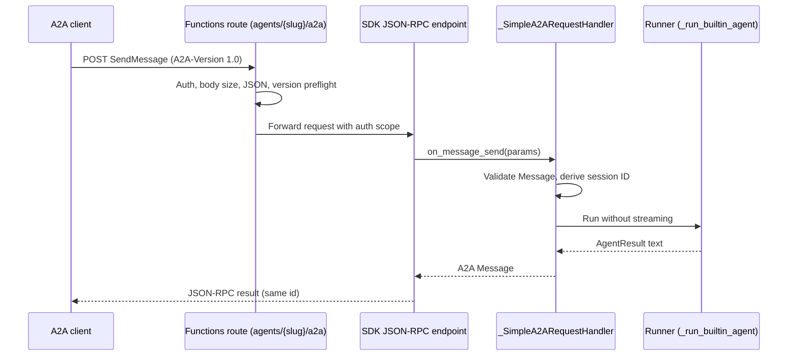

# A2A server architecture (simple profile)

> Design for [FRD 0009](../frds/0009-a2a-server.md). This document describes the
> implemented `simple` profile. The status is experimental.

## 1. Overview

An agent that declares `builtin_endpoints.a2a` gets two HTTP routes:

| Route | Method | Handler |
| --- | --- | --- |
| `agents/{slug}/.well-known/agent-card.json` | GET | Builds the Agent Card through the MAF `AgentA2AAdapter`. |
| `agents/{slug}/a2a` | POST | Dispatches A2A 1.0 JSON-RPC through the SDK `create_jsonrpc_routes` endpoint. |

## 2. Library choice

| Package | Use |
| --- | --- |
| `a2a-sdk[http-server]==1.1.2` | Native A2A 1.0 models, `RequestHandler`, `create_jsonrpc_routes`, and JSON-RPC error envelopes. The `http-server` extra supplies Starlette for the route hook. |
| `agent-framework-hosting-a2a==1.0.0a260730` | `AgentA2AAdapter`: builds the Agent Card and converts between A2A Parts and MAF Messages (`a2a_to_run`, `a2a_from_run`). |
| `agent-framework-hosting==1.0.0a260730` | Dependency of hosting-a2a. |

The runtime does not use the MAF `A2AExecutor`. That executor creates Tasks and
calls a MAF agent directly, so it would bypass runtime policy. The app-owned
`RequestHandler` calls the existing runner instead.

These packages are in the optional `[a2a]` extra. `registration/endpoints.py`
imports `registration/a2a.py` only when an agent declares `a2a`. If the extra is
missing, startup fails with an installation message.

## 3. Pipeline placement

- **Discover:** no change.
- **Translate:** `config/schema.py` defines `A2AConfig` (`mode`, `url`).
  `config/validation.py` checks the URL: absolute, HTTPS or loopback HTTP, no
  credentials, query, or fragment, and a path that ends with
  `/agents/{slug}/a2a`.
- **Register:** `registration/a2a.py` registers the routes and contains the
  `RequestHandler`. Registration does not parse YAML again.
- **Execute:** the handler calls `_run_builtin_agent()`, the same non-streaming
  path as the chat API. Tools, skills, timeouts, sessions, policies, and
  workflow integration behave the same.

When workflows are enabled, the JSON-RPC route receives a Durable client input
binding and shares the existing `DFApp`. Otherwise, the app stays a plain
`FunctionApp`.

## 4. Request handling

### Preflight (before the SDK)

1. Auth: `resolve_authorized_request_scope()` applies `http_auth` and returns the
   trust scope.
2. Body size: more than 256 KiB returns HTTP 413.
3. JSON: invalid UTF-8 JSON returns HTTP 400.
4. Version: if `A2A-Version` is not `1.0`, return a JSON-RPC
   `VersionNotSupportedError` with the request ID.

### `on_message_send`

1. Validate the Message: role user, text Parts only, at most 16 Parts, at most
   32 KiB for each Part, and at most 64 KiB in total. Reject `taskId`,
   `referenceTaskIds`, extensions, push configuration, and output modes that do
   not include `text/plain`.
2. Use the `contextId`, or generate one.
3. Derive the runner session ID: `a2a-` + SHA-256(auth scope, slug, `contextId`).
4. Convert the Message to a prompt with `a2a_to_run`.
5. Enter the in-flight limiter (32 for each agent). If it is full, return an
   error at once. The limiter does not queue requests.
6. Run the agent. If the response text is more than 256 KiB, return
   `InvalidAgentResponseError`.
7. Convert the text with `a2a_from_run`, remove Part metadata, and return a
   Message with a new `messageId` and the same `contextId`.

All other `RequestHandler` methods (Task, streaming, push, extended card) raise
`UnsupportedOperationError`. The SDK route has 0.3 compatibility disabled.

## 5. Agent Card

The card is built on each GET request from frozen configuration:

- `supportedInterfaces`: the configured `url`, `JSONRPC`, version `1.0`.
- One skill from the agent slug, name, and description.
- `text/plain` input and output modes.
- `streaming: false`, `pushNotifications: false`, `extendedAgentCard: false`.
- Security: `x-functions-key` API key for `function` and `admin` modes, HTTP
  bearer (JWT) for `entra`, none for `anonymous`.

The card route uses the same `http_auth` as the JSON-RPC route.

## 6. Identity and trust

`function`, `admin`, and `anonymous` modes share one app trust scope. The
Functions host does not give a stable caller identity for each key. `entra`
uses the Easy Auth principal: tenant ID plus object ID (or app ID or azp). A
`contextId` continues a session only inside the same scope.

## 7. Error mapping

| Condition | Response |
| --- | --- |
| Body too large | HTTP 413 |
| Invalid JSON | HTTP 400 |
| Wrong or missing `A2A-Version` | JSON-RPC `VersionNotSupportedError` |
| Invalid Message or Parts | JSON-RPC `InvalidParamsError` |
| Unsupported method or field | JSON-RPC `UnsupportedOperationError` |
| Limiter full | JSON-RPC `UnsupportedOperationError` |
| Agent failure | JSON-RPC `InternalError` (details are only in logs) |
| Response too large | JSON-RPC `InvalidAgentResponseError` |

## 8. Local development

Use Azure Functions Core Tools 4.14.0 or later. On Windows with Python 3.13,
Core Tools 4.10.0 stops with `0xC0000005` during indexing because of a Protobuf
conflict with the worker (#211).

The sample client uses MAF `A2AAgent` (core 1.15+) in a separate virtual
environment. The server keeps the runtime's MAF core 1.13 pins. The two
processes communicate only over HTTP.

## 9. Planned work

These items are planned. They are not designed or implemented here:

- Streaming (`SendStreamingMessage`, SSE).
- A2A Task lifecycle (get, list, cancel, subscribe).
- Durable and distributed Task execution.
- Optional Durable dependency.
- REST and gRPC bindings, and push notifications.
