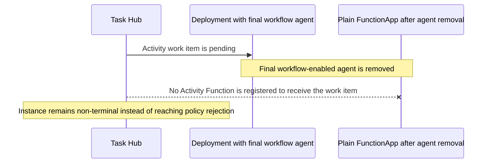

# FRD 0004 — Dynamic workflows

## 1. Summary

Add experimental Dynamic Workflows support to the markdown-first Azure Functions
Agents Runtime. Any workflow-enabled agent can ask the runtime to launch a
Durable Functions-backed DAG of tool and wait tasks, observe progress through
built-in endpoints/UI, and receive final workflow notifications in the chat
session. Workflow task tools are authored under the existing `tools/` directory
but opt into Durable Activity execution explicitly with a new `@workflow_tool`
decorator; normal plain-function tool discovery remains backward compatible.
Workflow-enabled agents can also start the same Durable workflows from any
supported Markdown-declared trigger; the trigger starts the workflow
asynchronously and does not wait for it to finish.

## Evolution

This FRD evolves with the experimental Dynamic Workflows surface. The initial
design assumed one workflow-enabled `main.agent.md` and session-only workflow
identity. PR #112 added Markdown-declared trigger starters, PR #117 added
Workflow Sub Agents, and PR #151 extends the same feature to every
workflow-enabled agent with agent/session isolation. The
[multi-agent addendum](#multi-agent-workflow-isolation-addendum-pr-151)
records only that extension's behavioral and architectural delta instead of
repeating the base workflow design.

## 2. Motivation / problem

Today agents can call tools directly through the Microsoft Agent Framework (MAF)
during a chat turn. That works well for short, latency-sensitive work, but it is
awkward for work that:

- needs multiple dependent tool calls that would otherwise require repeated model
  round-trips;
- can fan out independent evidence gathering in parallel;
- needs a durable wait without holding a worker or client connection open;
- produces large intermediate results that should stay out of the model context;
- should survive host restarts or a user reconnecting later.

Dynamic Workflows introduces a new authoring surface, so the first release needs
to make workflow tools easy to place, hard to register accidentally, and
consistent with the runtime's existing capability-filtering model. The agreed
model uses the existing `tools/` directory as the single placement surface,
preserves normal plain-function tool discovery, and requires `@workflow_tool` to
explicitly opt a function into the Durable Activity execution path.

## 3. Goals / Non-goals

**Goals**

- Enable `workflows.enabled: true` for any agent to register Durable
  workflow management tools and a Durable orchestrator/activity engine.
- Add `workflows.exclude` so workflow filtering matches existing exclude-style
  capability UX (`tools.exclude`, `mcp.exclude`, `skills.exclude`).
- Keep sample `function_app.py` minimal so workflow authoring is expressed
  through agent markdown plus `tools/`.
- Add `@workflow_tool` as an explicit workflow authoring decorator for functions
  placed in `tools/`.
- Preserve existing normal `tools/` behavior: public plain functions and `@tool`
  values continue to become normal MAF tools.
- Support four clear authoring cases:
  - workflow-only: `@workflow_tool`;
  - normal-only: public plain function or `@tool`;
  - both: `@tool` plus `@workflow_tool`, or separate adapters sharing internal
    business logic;
  - neither: `_`-prefixed helper.
- Skip workflow-incompatible functions during workflow registration with a clear
  warning rather than failing startup when safe to do so.
- Keep discovery read-only and keep Azure Functions/Durable registration in the
  registration/integration stage.
- Enable every supported Markdown-declared trigger on a workflow-enabled agent
  to start Dynamic Workflows through the existing runner.
- Document the workflow authoring surface in `docs/workflows.md`,
  `docs/front-matter-spec.md`, and `docs/architecture.md`.

**Non-goals**

- Hand-authored workflow YAML/markdown templates; workflow plans remain
  LLM-authored through `start_workflow`.
- Per-task retry/timeout/concurrency settings in v1, beyond reserving
  `@workflow_tool(...)` as the future metadata surface.
- Sub-orchestrations, nested/stateful Sub Agent tasks, MCP Tasks integration,
  or cross-app workflow coordination. Stateless leaf Sub Agent tasks are in v1.
- Changing normal MAF tool execution semantics.
- Automatically promoting every compatible plain function into a workflow tool.

## 4. Proposed design

| Pipeline stage | Module(s) | Change |
| --- | --- | --- |
| discover | `discovery/tools.py`, `_function_tool.py` | Load `tools/*.py` once, preserving normal `FunctionTool` discovery while also discovering explicit workflow tool declarations. Add a public `workflow_tool` decorator that records workflow metadata without making the function a normal MAF tool by itself. |
| translate | `config/schema.py`, `config/merge.py`, `registration/capabilities.py` | Parse and validate the public workflow config shape (`enabled`, optional `exclude`, and independent `subagents`) and compute concrete capabilities without hard-coding the v1 workflow agent. Unknown workflow excludes warn, mirroring `tools.exclude`. |
| register | `app.py`, `workflows/integration.py`, `workflows/registry.py`, `workflows/engine.py`, `registration/endpoints.py`, `registration/triggers.py` | The app composition root freezes one immutable policy per workflow-enabled agent, registers one app-wide Durable blueprint and complete execution catalogs, then threads the matching policy and Durable client through each agent's endpoints and declared triggers. |
| execute | `workflows/tools.py`, `workflows/engine.py`, `runner.py`, `registration/_handlers.py`, `public/index.html` | MAF invokes workflow management tools (`start_workflow`, status/list/cancel/terminate). Runtime validation uses the same agent policy that generated prompt guidance. Durable Activities reauthorize against the currently deployed policy before invoking registered workflow tools or fresh stateless leaf specialists. UI polls workflow status and injects terminal notifications. |

### Authoring / API surface

#### Frontmatter

Workflow enablement remains explicit on each participating agent:

```yaml
---
name: Incident Triage Assistant
description: Investigates incidents by gathering evidence in parallel.
builtin_endpoints: true
workflows:
  enabled: true
  exclude:
    - expensive_diagnostic_tool
---
```

- `workflows.enabled`: `bool`; `true` enables Dynamic Workflows for that agent.
- `workflows.exclude`: optional `list[str]`; filters discovered workflow tool
  names out of the effective workflow tool set.
- Durable backend and task hub configuration stay in `host.json` and app
  settings, not frontmatter.
- No separate workflow-agent, role, or starter field is required. Invocation remains
  controlled independently by the agent's trigger and built-in endpoints.

#### Markdown-declared trigger starters

When a supported Markdown-declared trigger belongs to a workflow-enabled agent,
registration adds a Durable client input to that generated Function. The handler
passes the bound client, workflow enablement, the agent identity slug, and
trigger-specific system guidance to the existing runner. Workflow-disabled
handlers retain their original signatures.

`start_workflow` schedules the orchestration and returns a `workflow_id` to the
agent. The initial trigger Function ends after that agent turn instead of
polling for terminal workflow status. An HTTP caller receives the immediate
agent response; non-HTTP triggers have no response channel, so applications can
provide a workflow tool that delivers the eventual result to an appropriate
destination. This evolution adds no new frontmatter fields.

#### Tool decorators

Normal tool behavior stays unchanged:

```python
def web_fetch(url: str) -> str:
    """Fetch a URL and return text."""
    return "..."
```

The public plain function above remains a normal MAF tool only. It does not
become a workflow Activity target.

Workflow-only tools opt in with `@workflow_tool`. The decorator attaches
workflow metadata and returns the original callable/object so it does not make a
function a normal MAF tool by itself:

```python
from azure_functions_agents import workflow_tool


@workflow_tool(description="Fetch recent log lines for a service.")
def fetch_logs(args: dict[str, object]) -> dict[str, object]:
    service = str(args["service"])
    return {"service": service, "errors": 12}
```

Both direct MAF tools and workflow tools can be expressed by applying both
decorators when the callable contract is intentionally shared. Decorator order
should not affect discovery: `@workflow_tool` attaches metadata to a plain
callable or to a `FunctionTool`, and discovery also checks the wrapped
`FunctionTool.func` for workflow metadata.

```python
from azure_functions_agents import tool, workflow_tool


@tool
@workflow_tool(description="Get current service health.")
def get_service_health(args: dict[str, object]) -> dict[str, object]:
    return {"service": args["service"], "status": "healthy"}
```

The reverse order is also valid:

```python
@workflow_tool(description="Get current service health.")
@tool
def get_service_health(args: dict[str, object]) -> dict[str, object]:
    return {"service": args["service"], "status": "healthy"}
```

The single-callable "both" pattern is only viable for synchronous callables that
can satisfy both the MAF and workflow Activity contracts. Async normal tools must
use the separate-adapter pattern below for workflow support.

When normal tools use a Pydantic model but workflow Activities use `dict`
arguments, authors should share internal business logic and expose separate
adapters:

```python
from pydantic import BaseModel

from azure_functions_agents import tool, workflow_tool


class HealthParams(BaseModel):
    service: str


def _get_health(service: str) -> dict[str, object]:
    return {"service": service, "status": "healthy"}


@tool
def get_service_health(params: HealthParams) -> str:
    return str(_get_health(params.service))


@workflow_tool(name="get_service_health")
def get_service_health_workflow(args: dict[str, object]) -> dict[str, object]:
    return _get_health(str(args["service"]))
```

Helpers remain `_`-prefixed:

```python
def _require_service(args: dict[str, object]) -> str:
    service = args.get("service")
    if not isinstance(service, str) or not service:
        raise ValueError("service is required")
    return service
```

#### Workflow tool execution contract

For v1, a workflow tool handler must:

- be synchronous;
- accept one `dict[str, Any]` argument;
- return a JSON-serializable value;
- avoid relying on chat-turn-local runtime state;
- be appropriate for Durable Activity execution, including background and
  parallel execution.

The runtime should warn and skip functions that are clearly incompatible, such
as async handlers, declaration-only tools, reserved names, duplicate names, or
handlers whose signature cannot accept the workflow `dict` argument.

Reserved workflow tool names are the workflow management tools injected by the
runtime: `start_workflow`, `get_workflow_status`, `list_workflows`,
`cancel_workflow`, and `terminate_workflow`.

Duplicate detection is scoped to the workflow registry only. It is valid for a
normal MAF tool and a workflow tool to share the same name intentionally; that is
the expected shape for tools that support both direct chat use and workflow DAG
execution.

### Compatibility

- Existing normal tools remain backward compatible:
  - public plain functions continue to be auto-wrapped as normal `FunctionTool`
    instances;
  - existing `@tool` usage remains a normal MAF tool.
- `@workflow_tool` alone must not accidentally enter the normal plain-function
  fallback path.
- Sample `function_app.py` stays minimal; samples use the same `tools/` plus
  `@workflow_tool` authoring model expected of users.
- `@workflow_tool` accepts only supported v1 metadata (`name`, `description`,
  `public`) until retry/timeout metadata is implemented. Unknown keyword
  arguments fail fast at startup so authors do not think unsupported policy knobs
  are active.

### Workflow Sub Agents

> [!IMPORTANT]
> This extension is part of the Dynamic Workflows v1 surface. PR #151 applies
> the same contract to every workflow-enabled agent. The
> `samples/workflow-subagents-preview/` directory is the runnable single-agent
> Workflow Sub Agent sample.

The extension lets a workflow-enabled agent authorize existing Markdown agents
as DAG nodes:

```yaml
---
name: Support Coordinator
workflows:
  enabled: true
  subagents:
    - agent: pr_status_analyst
      when: Review one pull request and summarize its current status
    - agent: actionable_report_writer
      when: Combine pull-request summaries into an actionable portfolio report
---
```

`workflows.subagents` and the top-level chat-time `subagents:` list are
independent capability grants. Both are deny-by-default when omitted.
`workflows.subagents` may reference a specialist used only by Workflows.
Unknown, duplicate, and self references fail during app composition. As with a
top-level `subagents:` reference, an authorized Workflow-only specialist does
not need its own trigger or built-in endpoint. `when` is the routing hint shown
to the coordinator's plan-authoring model; when omitted, the specialist's
`description` is used. The `subagents` items are translated into typed
configuration during app composition rather than re-parsed by registration or
execution code.

The static grant and every runtime plan are enforced independently. Before a
plan starts, each `sub_agent.agent` must be present in the owning agent's
`workflows.subagents` grant. An unauthorized or unknown slug rejects the plan;
the Activity also fails closed if its catalog lookup cannot resolve the
already-authorized slug. The immutable agent-specific policy used for prompt
guidance is the same policy used for plan validation. Composition constructs one
independent immutable policy per workflow-enabled agent without changing the
node or Activity contract.

The Workflow plan uses a `sub_agent` task:

```json
{
  "id": "analyze_pr_42",
  "type": "sub_agent",
  "agent": "pr_status_analyst",
  "task": "Review pull request https://github.com/owner/repo/pull/42 and summarize its current status."
}
```

The reduce node uses the same task type and depends on every map result:

```json
{
  "id": "write_report",
  "type": "sub_agent",
  "agent": "actionable_report_writer",
  "task": "Create an actionable report from PR 42: ${analyze_pr_42.result.text}; PR 43: ${analyze_pr_43.result.text}.",
  "depends_on": ["analyze_pr_42", "analyze_pr_43"]
}
```

`task` must be a self-contained string and may template upstream results. A
successful v1 node returns
`{"agent": "pr_status_analyst", "text": "..."}`;
downstream tasks can reference `${analyze_pr_42.result.text}`. Independent Sub
Agent tasks can fan out without dependencies, and another authorized Sub Agent
can depend on all of them to reduce their summaries. Status and lineage remain
owned by the parent Workflow and identify the execution by parent Workflow id,
node id, and specialist slug. Leaf-only means that the specialist cannot start
another Workflow or delegate again. A Sub Agent Activity is not an independently
queryable workflow instance: built-in status surfaces report it only as a parent
node, including the currently scheduled node ids while a wave is running.

The specialist runs as itself with a fresh context and its own instructions,
model, timeout, normal tools, MCP servers, skills, and `web_request` setting. It
does not inherit the parent's tools or conversation history. In v1 it also
receives no request-scoped sandbox, Workflow management tools, or `delegate_*`
tools.

The specialist's configured timeout is enforced inside the async Agent Activity
around `Agent.run(task)`. The Functions host's activity/function timeout remains
an outer limit, so the observable upper bound is the shorter of the specialist
timeout and the host limit. A timeout raises from the Activity and fails the
parent Workflow; it is never returned as a success-shaped result.

| Concern | Proposed v1 | Deferred to v2 |
| --- | --- | --- |
| Execution | One stateless Agent Activity per leaf node; no child orchestration | Stateful or bounded multi-level execution |
| Result | Fixed `{agent, text}` envelope | `response_schema`-validated output |
| Failure | Activity failure or timeout fails the parent Workflow | Retry and continue-on-error policy |
| Retry | No automatic retry; use the specialist's timeout | Idempotent retry with attempts/backoff |
| Cancellation | Parent stops scheduling; an already-dispatched model call is best-effort | Stronger activity interruption where supported |
| Context | Self-contained `task` only | Explicit context-sharing policy, if justified |

The v1 runtime does not configure automatic Durable retries. The task and result
authoring contract should remain unchanged if a runtime-managed Durable retry
policy is added later. Before enabling it, the implementation must define
idempotency, retryable failure kinds, maximum attempts/backoff, and how repeated
model or tool side effects are surfaced.

Even without configured retry options, Durable Activity delivery is
at-least-once. A worker failure can therefore repeat a model call or specialist
tool side effect. v1 does not claim exactly-once Agent execution: specialist
tools used from a Workflow should tolerate re-execution, and terminal publishers
should use stable destination identities or equivalent idempotent writes. The
PR-status sample overwrites the request's specified Blob path so repeated
publication converges on the same report instead of creating duplicate outputs.

#### Reviewer note: positive capability allowlists

Today specialist `tools`, `skills`, and `mcp` capabilities inherit the
project-wide inventory and can only be narrowed with `exclude` (or disabled
entirely). The proposal preserves that existing behavior, but durable background
execution makes the lack of a positive allowlist a least-privilege concern:
adding a new project capability can make it available to existing specialists
without editing their definitions.

A future capability proposal could add an explicit form such as:

```yaml
tools:
  allow: [lookup_invoice]
skills:
  allow: [billing-policy]
mcp:
  allow: [billing-api]
```

This syntax is illustrative only and is not accepted as part of the Workflow Sub
Agent contract in this draft. Review should decide whether positive allowlists
are a prerequisite, a parallel feature, or a later hardening step.

### Multi-agent workflow isolation addendum (PR #151)

This addendum supersedes the original `main.agent.md`-only assumption. It does
not introduce new frontmatter or DAG syntax: every agent with
`workflows.enabled: true` receives the existing workflow tools and may start
workflows through whichever triggers or built-in endpoints it independently
exposes.

The implementation calls such an agent a *workflow-enabled agent*. Its
`workflow_agent_slug` defines the authorization namespace but is not an
authoring keyword.

#### App-wide execution and per-agent authorization

One Function App registers one Durable orchestrator, one copy of each Activity,
one complete workflow-handler catalog, and the existing immutable
`AgentCatalog`. Registering that engine once prevents duplicate Azure Functions
when several agents enable workflows. Complete catalogs answer what exists; they
do not grant access.

Composition separately freezes one `WorkflowPlanPolicy` per workflow-enabled
agent. That policy contains only the agent's workflow tools after
`workflows.exclude` and its deny-by-default `workflows.subagents` grants. The
same value drives prompt guidance, start-time plan validation, and
defense-in-depth Activity authorization. One agent's exclusions cannot
unregister a handler another agent may use.

#### Agent and session isolation

`ResolvedAgent.slug` is the stable agent identity on chat, MCP, HTTP-trigger, and
non-HTTP-trigger paths. Workflow management is scoped by
`(workflow_agent_slug, session_id)` internally. Durable instance IDs begin with a
32-hex-character (128-bit) truncated SHA-256 digest over an unambiguous
length-delimited encoding of both values, followed by the existing random UUID
suffix. Raw slugs and session IDs are not exposed in instance IDs.

Active-workflow limits, list, status, cancel, terminate, and HTTP polling all
require both components. A mismatched agent or session returns the same
not-found/empty result as an unknown workflow, so two agents remain isolated even
when a caller deliberately reuses one session ID.

This intentionally changes the experimental workflow-ID prefix from the legacy
session-only 48-bit digest. New application tools and routes do not manage
pre-upgrade IDs. Operators must drain or terminate legacy instances through
Durable Functions or DTS tooling before upgrading.

#### Activity-time reauthorization

Capability-bearing Activities carry `workflow_agent_slug` and check the currently
deployed policy immediately before shared-catalog dispatch:

- tool Activities require the task tool in `policy.allowed_tools`;
- Workflow Sub Agent Activities require the specialist in
  `policy.allowed_subagents`; and
- a missing policy, handler, or Agent catalog entry fails closed with a
  non-sensitive error and correlated logs.

Persisting the start-time policy as indefinitely authoritative would defeat
revocation. Removing a workflow-enabled agent while another remains, or
tightening its grants, therefore makes a pending disallowed Activity fail rather
than continue with stale authorization. Durable orchestrator replay performs no
mutable policy lookup.

#### Final-agent removal and drain mode

The last workflow-enabled agent is a special deployment edge case. With no agent
policy, normal composition intentionally returns to a plain `FunctionApp` to
avoid Durable overhead in apps that do not use workflows. A plain
`FunctionApp`, however, has no registered workflow orchestrator or Activities.

Consider an instance whose next Activity has been scheduled but has not yet
executed:



This differs from ordinary policy revocation: the work item cannot reach
`require_workflow_agent_policy()` and fail because the Function that executes that check
is absent. `AZURE_FUNCTIONS_AGENTS_WORKFLOW_DRAIN_MODE=true` retains the
`DFApp`, orchestrator, and Activities while allowing the current policy catalog
to be empty. It also omits `start_workflow` from agent tool sets and defensively
rejects direct application-level starts.

The safe transition is:

1. Enable drain mode while the final workflow-enabled agent is still deployed,
   and quiesce external starters.
2. Prefer to let existing instances reach terminal states. If the agent must be
   removed first, keep drain mode enabled: retained Activities then execute and
   fail explicitly against the missing policy instead of remaining queued
   indefinitely.
3. Use Task Hub management tooling—not the session-scoped application list—to
   confirm there are no `Pending`, `Running`, `Suspended`, or `ContinuedAsNew`
   instances. Terminate any remainder when completion is no longer possible;
   termination does not undo already-dispatched Activity side effects.
4. Only after confirmation, disable drain mode. An app with no workflow-enabled
   agents then returns to a plain `FunctionApp`.

Task Hub name, Storage or DTS connection, `host.json` Durable settings, and
extension bundle must continue to identify the same backend throughout the
drain. If the hub cannot be queried or termination cannot be confirmed, the
retained runtime must remain deployed. Direct Durable control-plane starts are
privileged operations outside the application-level start guard.

#### Runnable proof

`samples/per-agent-workflows/` contains two non-main workflow-enabled agents with
different workflow-tool exclusions and Workflow Sub Agent grants. Repository E2E
automation starts both with the same session ID against Azure Storage and DTS,
proves each reaches a terminal state using only its own capabilities, and checks
that cross-agent status access returns 404.

## 5. Decisions log

| # | Decision | Options considered | Choice | Decided by | Date |
| - | -------- | ------------------ | ------ | ---------- | ---- |
| 1 | Workflow execution backend | Direct chat tool loop / in-process scheduler / Durable Functions | Durable Functions orchestrator + Activity engine | Human + Agent | 2026-07-01 |
| 2 | Workflow enablement surface | Always on / agent frontmatter flag / global config only | `workflows.enabled: true` on `main.agent.md` | Human + Agent | 2026-07-01 |
| 3 | Workflow tool placement | Dedicated `workflow_tools/` / existing `tools/` | Existing `tools/` directory | Human | 2026-07-06 |
| 4 | Workflow tool opt-in | Auto-promote compatible plain functions / `@tool(workflow=True)` / explicit `@workflow_tool` | Explicit `@workflow_tool` decorator | Human | 2026-07-06 |
| 5 | Normal plain function behavior | Stop auto-wrapping / keep existing normal tool discovery | Keep existing plain-function discovery for normal MAF tools | Human | 2026-07-06 |
| 6 | Workflow filter style | `exclude` list / no filtering | Use `workflows.exclude` to match existing capability filtering | Human | 2026-07-06 |
| 7 | Workflow-only functions | Require duplicate wrappers / `@workflow_tool` only / config-only exclusion | `@workflow_tool` only means workflow-only and must not become normal MAF tool | Human + Agent | 2026-07-06 |
| 8 | Future workflow metadata | Separate config maps / decorator kwargs / postpone with no surface | Reserve `@workflow_tool(...)` for future retry/timeout/etc. metadata | Human + Agent | 2026-07-06 |
| 9 | Incompatible workflow candidates | Fail all startup / silently skip / warn and skip where safe | Warn and skip incompatible workflow tool declarations where safe | Human | 2026-07-06 |
| 10 | Workflow filtering stage | Apply `workflows.exclude` in integration/register / compute concrete workflow tools in capabilities | Compute the concrete workflow tool set before registration so registration consumes objects, not exclude policy | Agent | 2026-07-06 |
| 11 | Dual decorator order | Require one order / support both orders | Support both orders by attaching workflow metadata to both callables and `FunctionTool` objects | Agent | 2026-07-06 |
| 12 | Record trigger support | Create a second Dynamic Workflows FRD / evolve this FRD | Update FRD 0004 because Markdown-declared trigger support extends the existing feature without redesigning it | Human | 2026-07-23 |
| 13 | Declared-trigger scope | Add named trigger types individually / use generic trigger registration | Add the Durable client binding generically to every supported Markdown-declared trigger for the workflow-enabled main agent | Human + Agent | 2026-07-17 |
| 14 | Trigger lifetime | Wait for terminal status / start asynchronously | End the initial trigger Function after the agent starts the workflow; Durable execution continues independently | Human + Agent | 2026-07-17 |
| 15 | Workflow Sub Agent authorization | Reuse the top-level list / add a mode flag / use a Workflow-owned grant | Add independent, deny-by-default `workflows.subagents` | Human | 2026-07-23 |
| 16 | First execution boundary | Recursive delegation / bounded nesting / leaf-only | v1 is leaf-only; bounded multi-level execution is v2 | Human | 2026-07-23 |
| 17 | Specialist context | Copy parent state / share history / self-contained task | Run with the specialist's own static capabilities and a self-contained task only | Human | 2026-07-23 |
| 18 | Failure and retry | Recoverable result / automatic retry / fail parent without retry | Sub Agent failure fails the parent Workflow; v1 has no automatic retry | Human | 2026-07-23 |
| 19 | Successful result | Plain text / schema-dependent result / fixed envelope | Return `{agent, text}`; defer `response_schema` to v2 | Human | 2026-07-24 |
| 20 | Sub Agent runtime boundary | Direct Activity / one child orchestrator per node / shared child orchestrator | Invoke each stateless Sub Agent directly as an Activity; retain status and lineage on the parent node | Human + Chris Gillum | 2026-07-24 |
| 21 | Dependency on per-agent Workflows (#109) | Wait for #109 / ship main-only then extend | Ship the existing `main.agent.md` owner scope now, while keeping engine and policy boundaries reusable by #109 | Human | 2026-07-24 |
| 22 | Documentation audiences | Explain internals in every document / separate maintainer and customer surfaces | Keep decisions and Durable internals in the FRD/architecture; make samples and authoring docs independently understandable to customers | Human + Chris Gillum | 2026-07-24 |
| 23 | Sub Agent failure diagnostics | Expose provider errors / one generic message / bounded error code plus correlated logs | Keep provider details out of Durable history, expose a stable non-sensitive error code, and correlate detailed logs by Workflow ID, node ID, and specialist slug | Human + Laveesh Rohra | 2026-08-03 |
| 24 | Record multi-agent support | Create FRD 0009 / evolve this FRD | Keep the change as an addendum to FRD 0004 because it extends the existing experimental feature without adding a new authoring contract | Human + Laveesh Rohra | 2026-08-12 |
| 25 | Workflow agent identity | Display name / source path / endpoint-specific name / canonical slug | Use app-wide unique `ResolvedAgent.slug` on every channel as `workflow_agent_slug` inside the authorization implementation | Agent | 2026-08-10 |
| 26 | Workflow isolation scope | Session only / agent only / agent plus session | Scope application management by `(workflow_agent_slug, session_id)` so equal session IDs across agents remain isolated | Human | 2026-08-10 |
| 27 | Existing workflow IDs | Dual-format fallback / migration map / no application fallback | Accept the experimental ID change, preserve Durable/DTS operator access, and require upgrade drain guidance | Human | 2026-08-10 |
| 28 | Durable registration lifetime | Once per agent / once per app | Register the Durable engine and complete execution catalogs exactly once per app | Agent | 2026-08-10 |
| 29 | Per-agent policy | Mutable process global / request-time reconstruction / immutable slug-keyed catalog | Freeze one independent `WorkflowPlanPolicy` per workflow-enabled agent during composition | Agent | 2026-08-10 |
| 30 | Activity authorization | Trust start-time validation / persist start-time policy / reauthorize deployed policy | Reauthorize tool and Sub Agent Activities against the currently deployed agent policy so restrictive changes fail closed | Human | 2026-08-10 |
| 31 | Non-HTTP trigger management | Add an app-wide index / share one synthetic session / generated invocation session | Keep generated sessions and no new application index; use Durable/DTS tooling for app-wide operations | Human | 2026-08-10 |
| 32 | Authoring schema | Add owner/config fields / reuse current workflow config | Reuse existing fields; derive identity from the canonical agent slug | Agent | 2026-08-10 |
| 33 | Ownership digest width | Keep 48 bits / store literal identity / increase digest | Use a 128-bit truncated SHA-256 prefix over length-delimited agent/session input | Human | 2026-08-10 |
| 34 | Workflow agent eligibility | Require a dedicated starter and fail composition / allow every enabled agent | Treat every agent with `workflows.enabled: true` as workflow-enabled; invocation surfaces remain independent. This supersedes the earlier provisional fail-composition rule. | Human | 2026-08-11 |
| 35 | Customer sample boundary | Put sender/verifier helpers in the sample / separate internal automation | Keep the sample documentation-led and directly runnable; keep E2E automation under `eng/scripts` | Human | 2026-08-11 |
| 36 | Final-agent removal | Always register Durable / documentation-only drain / explicit runtime retention | Add opt-in drain mode that blocks application starts and retains Durable registration until Task Hub tooling confirms no non-terminal instances; ordinary non-workflow apps remain plain `FunctionApp` | Human | 2026-08-12 |
| 37 | Exported compatibility helpers | Remove production-dead helpers / retain shared state / isolate compatibility state | Retain exported registry and one-shot integration helpers without an unrelated breaking change, but keep their registration token out of production `WorkflowSessionContext` and never authorize production execution from the singleton fallback | Agent | 2026-08-11 |
| 38 | Trigger decorator resolution | Add a shared resolver / duplicate capability validation / retain registration-local fallback | Keep the registration-local `connector_trigger` to `generic_trigger` fallback and avoid an unrelated hard failure for non-workflow agents | Agent | 2026-08-11 |
| 39 | Activity-wave failure propagation | Rely on Durable wrapper behavior / explicitly rethrow the failed wave result | Explicitly rethrow failed `task_all` results so policy denials retain their actionable error instead of degrading to a secondary `TypeError` | Agent | 2026-08-11 |
| 40 | Internal workflow-agent terminology | `owner_slug` / `agent_slug` / `workflow_agent_slug` | Use `workflow_agent_slug` throughout workflow plumbing and persisted payloads: it identifies the top-level agent that starts, authorizes, and namespaces the workflow without colliding conceptually with a delegated Sub Agent | Human | 2026-08-12 |

## 6. Test plan

- [ ] Unit: `tests/test_discovery_tools.py`
  - plain public functions still become normal tools;
  - `@tool` values still become normal tools;
  - `@workflow_tool`-only functions do not become normal tools;
  - modules can expose multiple workflow tools;
  - `_`-prefixed helpers are ignored.
- [ ] Unit: dual-decorator behavior
  - `@tool` over `@workflow_tool` is both a normal tool and a workflow tool;
  - `@workflow_tool` over `@tool` is both a normal tool and a workflow tool;
  - duplicate names are rejected only within the workflow registry, not across
    normal and workflow tool inventories.
- [ ] Unit: workflow discovery/registry tests
  - compatible `@workflow_tool` handlers register automatically;
  - async/incompatible handlers are skipped with warning logs;
  - duplicate/reserved names are handled with clear warnings/errors;
  - `@workflow_tool` using a reserved runtime management name such as
    `start_workflow` is rejected;
  - effective workflow tool set respects `workflows.exclude`.
- [ ] Unit: `tests/test_workflow_integration_validation.py`
  - `workflows.exclude` shape validation;
  - unknown workflow keys fail with actionable messages.
- [ ] Unit: `tests/test_app_routes.py`
  - workflow-enabled app startup discovers sample workflow tools from `tools/`;
  - workflow addendum lists discovered non-excluded workflow tools.
- [ ] Fixture scenario:
  `tests/fixtures/config_scenarios/<next>_dynamic_workflow_tools/`
  - `tools/` contains normal-only, workflow-only, both, and helper functions.
- [ ] Sample tests: update `tests/test_incident_tools.py` for the decorator-based
  sample layout.
- [ ] E2E: run the `workflow-incident-triage` sample locally with Azurite/Durable
  storage and confirm a workflow can start, execute sample tools, and complete.
- [x] Evolution #112: workflow-enabled HTTP and non-HTTP handlers receive the
  Durable client and trigger addendum while workflow-disabled handlers keep
  their existing signatures.
- [x] Evolution #112: timer and queue samples index their trigger, Durable
  client, orchestrator, and Activity bindings and complete model-backed local
  runs.
- [x] Evolution #117: Workflow Sub Agents
  - validate the independent, deny-by-default `workflows.subagents` grant;
  - reject a runtime `sub_agent` node whose slug is not authorized by that
    grant, and fail closed on an impossible catalog miss;
  - validate `sub_agent` node shape, authorization, DAG templates, and results;
  - execute map nodes as parallel Agent Activities and reduce their `{agent,
    text}` results;
  - verify specialist capability isolation, timeout, failure, and cancellation;
  - make `samples/workflow-subagents-preview/` runnable and execute it end to
    end through Queue, Durable execution, fake PR tools, HTML reduction, and
    Blob publication, including convergence on the same Blob after repeated
    publication.
- [x] Evolution #151: multi-agent workflows and final-agent drain
  - compose every workflow-enabled agent with an independent immutable policy;
  - register one app-wide Durable engine and complete execution catalogs;
  - isolate IDs and management by agent plus session and return non-existence
    semantics for cross-agent access;
  - reauthorize capability-bearing Activities against the deployed policy;
  - retain the Durable runtime with an empty policy catalog in drain mode and
    reject new application-level starts;
  - fail startup for invalid drain-mode values;
  - keep an ordinary app with no workflow-enabled agents on plain
    `FunctionApp`;
  - treat legacy session-only IDs as not-found without deleting or mutating
    their Durable instances;
  - prove independent agents and same-session isolation against Azure Storage
    and DTS.

## 7. Docs impact

- [ ] `docs/architecture.md` — add workflows to the data flow, module map, and
  pipeline-stage descriptions.
- [ ] `docs/front-matter-spec.md` — document `workflows.enabled` and
  `workflows.exclude`.
- [ ] `docs/workflows.md` — document `@workflow_tool` authoring and
  auto-registration from `tools/`.
- [ ] `README.md` — ensure experimental workflows mention points to the sample
  and docs.
- [ ] `samples/workflow-incident-triage/README.md` — update authoring and local
  run instructions for auto-registration.
- [ ] `docs/frds/README.md` — add FRD 0004 to the index.
- [x] Evolution #112: update `docs/triggers.md`, `docs/workflows.md`, and
  `docs/architecture.md` for trigger-started workflows.
- [x] Evolution #117: document `workflows.subagents` and the `sub_agent` task in
  `docs/front-matter-spec.md`, `docs/workflows.md`, and `docs/architecture.md`;
  keep the sample customer-facing and free of FRD/Durable implementation
  details.
- [x] Evolution #151: document multi-agent policy isolation, workflow-ID
  migration, final-agent drain operations, and the runnable
  `samples/per-agent-workflows/` app.
- [x] Evolution #151: update `samples/README.md` with the multi-agent runnable
  sample while keeping internal verifier details outside the customer app.

## 8. Status & sign-off

- **Architecture review (phase 2):** Completed by `frd-reviewer`
  (rubber-duck), 2026-07-06. Initial findings around pipeline boundaries,
  dual-decorator semantics, duplicate-name scope, non-main behavior, reserved
  names, and unknown decorator kwargs were addressed. Re-review found no
  remaining blocking issues and deemed the FRD ready for human sign-off.
- **Human sign-off:** TsuyoshiUshio, 2026-07-06 → `status: Finalized`.
- **Evolution review:** Markdown-declared trigger support reviewed by
  TsuyoshiUshio and Chris Gillum in PR #112, 2026-07-23.
- **Workflow Sub Agent architecture review:** External contract reviewed in PR
  #117. Chris Gillum recommended direct Activity execution because current
  Serverless Agent invocations are stateless; the plan was revised to remove
  child orchestration and child ids. A dedicated pre-implementation review on
  2026-07-24 additionally required an executable E2E sample, runtime
  authorization enforcement, explicit at-least-once semantics, and an
  Activity-owned timeout boundary; those findings are incorporated above.
- **Workflow Sub Agent human sign-off:** TsuyoshiUshio, 2026-07-24. Approved
  Activity-only execution, `{agent, text}` results, main-only v1 scope, and
  implementation using TDD followed by sample E2E validation.
- **Multi-agent workflow sign-off:** TsuyoshiUshio, 2026-08-10. Approved
  app-wide Durable registration, immutable per-agent policies, agent/session
  isolation, deployed-policy Activity reauthorization, the experimental
  workflow-ID migration, and Storage/DTS E2E validation.
- **Multi-agent architecture review:** An independent rubber-duck review on
  2026-08-10 evaluated the extension against `main`,
  `docs/architecture.md`, FRDs 0004 and 0007, issues #1274/#1275, and the
  existing trigger and Workflow Sub Agent implementation. Findings on digest
  strength, provisional decisions, legacy-ID behavior, and verifier
  prerequisites were incorporated with no remaining blockers. The human
  sign-off ratified the resulting authorization, non-HTTP management, and
  digest decisions before implementation.
- **Final-agent drain sign-off:** TsuyoshiUshio, 2026-08-12. Approved explicit
  runtime retention so pending work reaches Activity reauthorization instead of
  being stranded after the last workflow-enabled agent is removed.
