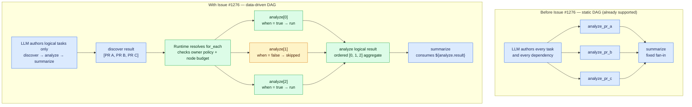

# FRD 0004 — Dynamic workflows

## 1. Summary

Add experimental Dynamic Workflows support to the markdown-first Azure Functions
Agents Runtime. A workflow-enabled main agent can ask the runtime to launch a
Durable Functions-backed DAG of tool and wait tasks, observe progress through
built-in endpoints/UI, and receive final workflow notifications in the chat
session. Workflow task tools are authored under the existing `tools/` directory
but opt into Durable Activity execution explicitly with a new `@workflow_tool`
decorator; normal plain-function tool discovery remains backward compatible.
Workflow-enabled main agents can also start the same Durable workflows from any
supported Markdown-declared trigger; the trigger starts the workflow
asynchronously and does not wait for it to finish.
The next evolution adds deterministic, data-driven control flow: a task can be
skipped by a constrained `when` predicate or expanded over a bounded JSON array
with `for_each`, while preserving Durable replay safety, owner authorization,
resource limits, deterministic fan-in, and observable node state.

## 2. Motivation / problem

Today agents can call tools directly through the Microsoft Agent Framework (MAF)
during a chat turn. That works well for short, latency-sensitive work, but it is
awkward for work that:

- needs multiple dependent tool calls that would otherwise require repeated model
  round-trips;
- can fan out independent evidence gathering in parallel;
- needs a durable wait without holding a worker or client connection open;
- produces large intermediate results that should stay out of the model context;
- should survive host restarts or a user reconnecting later.

Dynamic Workflows introduces a new authoring surface, so the first release needs
to make workflow tools easy to place, hard to register accidentally, and
consistent with the runtime's existing capability-filtering model. The agreed
model uses the existing `tools/` directory as the single placement surface,
preserves normal plain-function tool discovery, and requires `@workflow_tool` to
explicitly opt a function into the Durable Activity execution path.

## 3. Goals / Non-goals

**Goals**

- Enable `workflows.enabled: true` for `main.agent.md` to register Durable
  workflow management tools and a Durable orchestrator/activity engine.
- Add `workflows.exclude` so workflow filtering matches existing exclude-style
  capability UX (`tools.exclude`, `mcp.exclude`, `skills.exclude`).
- Keep sample `function_app.py` minimal so workflow authoring is expressed
  through `main.agent.md` plus `tools/`.
- Add `@workflow_tool` as an explicit workflow authoring decorator for functions
  placed in `tools/`.
- Preserve existing normal `tools/` behavior: public plain functions and `@tool`
  values continue to become normal MAF tools.
- Support four clear authoring cases:
  - workflow-only: `@workflow_tool`;
  - normal-only: public plain function or `@tool`;
  - both: `@tool` plus `@workflow_tool`, or separate adapters sharing internal
    business logic;
  - neither: `_`-prefixed helper.
- Skip workflow-incompatible functions during workflow registration with a clear
  warning rather than failing startup when safe to do so.
- Keep discovery read-only and keep Azure Functions/Durable registration in the
  registration/integration stage.
- Enable every supported Markdown-declared trigger on a workflow-enabled
  `main.agent.md` to start Dynamic Workflows through the existing runner.
- Document the workflow authoring surface in `docs/workflows.md`,
  `docs/front-matter-spec.md`, and `docs/architecture.md`.
- Add constrained conditional execution without embedding a general-purpose
  expression language in workflow plans.
- Add bounded runtime fan-out over JSON arrays and deterministic fan-in over the
  expanded results.
- Apply the existing workflow owner policy and runtime ceilings to every
  materialized task instance.
- Expose skipped, expanded, running, and aggregated states through the shared
  workflow status contract.

**Non-goals**

- Enabling workflows for non-main agents in v1.
- Hand-authored workflow YAML/markdown templates; workflow plans remain
  LLM-authored through `start_workflow`.
- Per-task retry/timeout/concurrency settings in v1, beyond reserving
  `@workflow_tool(...)` as the future metadata surface.
- Sub-orchestrations, nested/stateful Sub Agent tasks, MCP Tasks integration,
  or cross-app workflow coordination. Stateless leaf Sub Agent tasks are in v1.
- Changing normal MAF tool execution semantics.
- Automatically promoting every compatible plain function into a workflow tool.
- General-purpose expressions, arbitrary code evaluation, loops other than bounded
  array iteration, or a visual workflow designer.
- Retry, timeout, backoff, or continue-on-error policy; those are tracked by
  planning issue #1278.
- Configurable resource ceilings and large-result offload; those are tracked by
  planning issue #1279.

## 4. Proposed design

| Pipeline stage | Module(s) | Change |
| --- | --- | --- |
| discover | `discovery/tools.py`, `_function_tool.py` | Load `tools/*.py` once, preserving normal `FunctionTool` discovery while also discovering explicit workflow tool declarations. Add a public `workflow_tool` decorator that records workflow metadata without making the function a normal MAF tool by itself. |
| translate | `config/schema.py`, `config/merge.py`, `registration/capabilities.py` | Parse and validate the public workflow config shape (`enabled`, optional `exclude`, and independent `subagents`) and compute concrete capabilities without hard-coding the v1 owner. Unknown workflow excludes warn, mirroring `tools.exclude`. |
| register | `app.py`, `workflows/integration.py`, `workflows/registry.py`, `workflows/engine.py`, `registration/endpoints.py`, `registration/triggers.py` | The app composition root selects `main.agent.md` as the v1 owner. Integration consumes its filtered workflow tools and Sub Agent grants, builds one immutable owner policy, registers the Durable blueprint and catalog-backed Sub Agent Activity, and threads the policy plus Durable client through endpoints and declared triggers. |
| execute | `workflows/tools.py`, `workflows/engine.py`, `runner.py`, `registration/_handlers.py`, `public/index.html` | MAF invokes workflow management tools (`start_workflow`, status/list/cancel/terminate). Runtime validation uses the same policy that generated prompt guidance. Durable Activities invoke registered workflow tools or fresh stateless leaf specialists. Trigger handlers pass the bound Durable client and trigger-specific workflow guidance to the runner. UI polls workflow status and injects terminal notifications. |

### Authoring / API surface

#### Frontmatter

Workflow enablement remains explicit on the main agent:

```yaml
---
name: Incident Triage Assistant
description: Investigates incidents by gathering evidence in parallel.
builtin_endpoints: true
workflows:
  enabled: true
  exclude:
    - expensive_diagnostic_tool
---
```

- `workflows.enabled`: `bool`; `true` enables Dynamic Workflows for
  `main.agent.md`.
- `workflows.exclude`: optional `list[str]`; filters discovered workflow tool
  names out of the effective workflow tool set.
- Durable backend and task hub configuration stay in `host.json` and app
  settings, not frontmatter.
- If `workflows.enabled: true` is set on a non-main agent in v1, the runtime
  logs a startup warning and ignores the workflows block for that agent. This
  matches the current v1 constraint without failing unrelated agents.

#### Markdown-declared trigger starters

When a supported Markdown-declared trigger belongs to a workflow-enabled
`main.agent.md`, registration adds a Durable client input to that generated
Function. The handler passes the bound client, workflow enablement, the agent
identity slug, and trigger-specific system guidance to the existing runner.
Workflow-disabled and non-main handlers retain their original signatures.

`start_workflow` schedules the orchestration and returns a `workflow_id` to the
agent. The initial trigger Function ends after that agent turn instead of
polling for terminal workflow status. An HTTP caller receives the immediate
agent response; non-HTTP triggers have no response channel, so applications can
provide a workflow tool that delivers the eventual result to an appropriate
destination. This evolution adds no new frontmatter fields.

#### Tool decorators

Normal tool behavior stays unchanged:

```python
def web_fetch(url: str) -> str:
    """Fetch a URL and return text."""
    return "..."
```

The public plain function above remains a normal MAF tool only. It does not
become a workflow Activity target.

Workflow-only tools opt in with `@workflow_tool`. The decorator attaches
workflow metadata and returns the original callable/object so it does not make a
function a normal MAF tool by itself:

```python
from azure_functions_agents import workflow_tool


@workflow_tool(description="Fetch recent log lines for a service.")
def fetch_logs(args: dict[str, object]) -> dict[str, object]:
    service = str(args["service"])
    return {"service": service, "errors": 12}
```

Both direct MAF tools and workflow tools can be expressed by applying both
decorators when the callable contract is intentionally shared. Decorator order
should not affect discovery: `@workflow_tool` attaches metadata to a plain
callable or to a `FunctionTool`, and discovery also checks the wrapped
`FunctionTool.func` for workflow metadata.

```python
from azure_functions_agents import tool, workflow_tool


@tool
@workflow_tool(description="Get current service health.")
def get_service_health(args: dict[str, object]) -> dict[str, object]:
    return {"service": args["service"], "status": "healthy"}
```

The reverse order is also valid:

```python
@workflow_tool(description="Get current service health.")
@tool
def get_service_health(args: dict[str, object]) -> dict[str, object]:
    return {"service": args["service"], "status": "healthy"}
```

The single-callable "both" pattern is only viable for synchronous callables that
can satisfy both the MAF and workflow Activity contracts. Async normal tools must
use the separate-adapter pattern below for workflow support.

When normal tools use a Pydantic model but workflow Activities use `dict`
arguments, authors should share internal business logic and expose separate
adapters:

```python
from pydantic import BaseModel

from azure_functions_agents import tool, workflow_tool


class HealthParams(BaseModel):
    service: str


def _get_health(service: str) -> dict[str, object]:
    return {"service": service, "status": "healthy"}


@tool
def get_service_health(params: HealthParams) -> str:
    return str(_get_health(params.service))


@workflow_tool(name="get_service_health")
def get_service_health_workflow(args: dict[str, object]) -> dict[str, object]:
    return _get_health(str(args["service"]))
```

Helpers remain `_`-prefixed:

```python
def _require_service(args: dict[str, object]) -> str:
    service = args.get("service")
    if not isinstance(service, str) or not service:
        raise ValueError("service is required")
    return service
```

#### Workflow tool execution contract

For v1, a workflow tool handler must:

- be synchronous;
- accept one `dict[str, Any]` argument;
- return a JSON-serializable value;
- avoid relying on chat-turn-local runtime state;
- be appropriate for Durable Activity execution, including background and
  parallel execution.

The runtime should warn and skip functions that are clearly incompatible, such
as async handlers, declaration-only tools, reserved names, duplicate names, or
handlers whose signature cannot accept the workflow `dict` argument.

Reserved workflow tool names are the workflow management tools injected by the
runtime: `start_workflow`, `get_workflow_status`, `list_workflows`,
`cancel_workflow`, and `terminate_workflow`.

Duplicate detection is scoped to the workflow registry only. It is valid for a
normal MAF tool and a workflow tool to share the same name intentionally; that is
the expected shape for tools that support both direct chat use and workflow DAG
execution.

### Compatibility

- Existing normal tools remain backward compatible:
  - public plain functions continue to be auto-wrapped as normal `FunctionTool`
    instances;
  - existing `@tool` usage remains a normal MAF tool.
- `@workflow_tool` alone must not accidentally enter the normal plain-function
  fallback path.
- Sample `function_app.py` stays minimal; samples use the same `tools/` plus
  `@workflow_tool` authoring model expected of users.
- `@workflow_tool` accepts only supported v1 metadata (`name`, `description`,
  `public`) until retry/timeout metadata is implemented. Unknown keyword
  arguments fail fast at startup so authors do not think unsupported policy knobs
  are active.

### Workflow Sub Agents

> [!IMPORTANT]
> This extension is approved for the Dynamic Workflows v1 surface. Its first
> implementation is limited to the workflow-enabled `main.agent.md`; issue #109
> will apply the same contract to non-main workflow owners. The
> `samples/workflow-subagents-preview/` directory becomes a runnable sample as
> part of this implementation.

The extension lets the workflow-enabled main agent authorize existing Markdown
agents as DAG nodes:

```yaml
---
name: Support Coordinator
workflows:
  enabled: true
  subagents:
    - agent: pr_status_analyst
      when: Review one pull request and summarize its current status
    - agent: actionable_report_writer
      when: Combine pull-request summaries into an actionable portfolio report
---
```

`workflows.subagents` and the top-level chat-time `subagents:` list are
independent capability grants. Both are deny-by-default when omitted.
`workflows.subagents` may reference a specialist used only by Workflows.
Unknown, duplicate, and self references fail during app composition. As with a
top-level `subagents:` reference, an authorized Workflow-only specialist does
not need its own trigger or built-in endpoint. `when` is the routing hint shown
to the coordinator's plan-authoring model; when omitted, the specialist's
`description` is used. The `subagents` items are translated into typed
configuration during app composition rather than re-parsed by registration or
execution code.

The static grant and every runtime plan are enforced independently. Before a
plan starts, each `sub_agent.agent` must be present in the owning agent's
`workflows.subagents` grant. An unauthorized or unknown slug rejects the plan;
the Activity also fails closed if its catalog lookup cannot resolve the
already-authorized slug. The immutable owner-specific policy used for prompt
guidance is the same policy used for plan validation. v1 constructs that policy
only for `main.agent.md`; issue #109 can construct the same value per owner
without changing the node or Activity contract.

The Workflow plan uses a `sub_agent` task:

```json
{
  "id": "analyze_pr_42",
  "type": "sub_agent",
  "agent": "pr_status_analyst",
  "task": "Review pull request https://github.com/owner/repo/pull/42 and summarize its current status."
}
```

The reduce node uses the same task type and depends on every map result:

```json
{
  "id": "write_report",
  "type": "sub_agent",
  "agent": "actionable_report_writer",
  "task": "Create an actionable report from PR 42: ${analyze_pr_42.result.text}; PR 43: ${analyze_pr_43.result.text}.",
  "depends_on": ["analyze_pr_42", "analyze_pr_43"]
}
```

`task` must be a self-contained string and may template upstream results. A
successful v1 node returns
`{"agent": "pr_status_analyst", "text": "..."}`;
downstream tasks can reference `${analyze_pr_42.result.text}`. Independent Sub
Agent tasks can fan out without dependencies, and another authorized Sub Agent
can depend on all of them to reduce their summaries. Status and lineage remain
owned by the parent Workflow and identify the execution by parent Workflow id,
node id, and specialist slug. Leaf-only means that the specialist cannot start
another Workflow or delegate again. A Sub Agent Activity is not an independently
queryable workflow instance: built-in status surfaces report it only as a parent
node, including the currently scheduled node ids while a wave is running.

The specialist runs as itself with a fresh context and its own instructions,
model, timeout, normal tools, MCP servers, skills, and `web_request` setting. It
does not inherit the parent's tools or conversation history. In v1 it also
receives no request-scoped sandbox, Workflow management tools, or `delegate_*`
tools.

The specialist's configured timeout is enforced inside the async Agent Activity
around `Agent.run(task)`. The Functions host's activity/function timeout remains
an outer limit, so the observable upper bound is the shorter of the specialist
timeout and the host limit. A timeout raises from the Activity and fails the
parent Workflow; it is never returned as a success-shaped result.

| Concern | Proposed v1 | Deferred to v2 |
| --- | --- | --- |
| Execution | One stateless Agent Activity per leaf node; no child orchestration | Stateful or bounded multi-level execution |
| Result | Fixed `{agent, text}` envelope | `response_schema`-validated output |
| Failure | Activity failure or timeout fails the parent Workflow | Retry and continue-on-error policy |
| Retry | No automatic retry; use the specialist's timeout | Idempotent retry with attempts/backoff |
| Cancellation | Parent stops scheduling; an already-dispatched model call is best-effort | Stronger activity interruption where supported |
| Context | Self-contained `task` only | Explicit context-sharing policy, if justified |

The v1 runtime does not configure automatic Durable retries. The task and result
authoring contract should remain unchanged if a runtime-managed Durable retry
policy is added later. Before enabling it, the implementation must define
idempotency, retryable failure kinds, maximum attempts/backoff, and how repeated
model or tool side effects are surfaced.

Even without configured retry options, Durable Activity delivery is
at-least-once. A worker failure can therefore repeat a model call or specialist
tool side effect. v1 does not claim exactly-once Agent execution: specialist
tools used from a Workflow should tolerate re-execution, and terminal publishers
should use stable destination identities or equivalent idempotent writes. The
PR-status sample overwrites the request's specified Blob path so repeated
publication converges on the same report instead of creating duplicate outputs.

#### Reviewer note: positive capability allowlists

Today specialist `tools`, `skills`, and `mcp` capabilities inherit the
project-wide inventory and can only be narrowed with `exclude` (or disabled
entirely). The proposal preserves that existing behavior, but durable background
execution makes the lack of a positive allowlist a least-privilege concern:
adding a new project capability can make it available to existing specialists
without editing their definitions.

A future capability proposal could add an explicit form such as:

```yaml
tools:
  allow: [lookup_invoice]
skills:
  allow: [billing-policy]
mcp:
  allow: [billing-api]
```

This syntax is illustrative only and is not accepted as part of the Workflow Sub
Agent contract in this draft. Review should decide whether positive allowlists
are a prerequisite, a parallel feature, or a later hardening step.

### Data-driven control flow (Issue #1276; in review)

The current workflow contract is an arbitrary but static DAG: every task id and
dependency edge exists when `start_workflow` validates the plan. Static roots can
already fan out and a later task can fan in through `depends_on`, but the model
must enumerate every item before submission. That prevents a workflow from
adapting to a bounded collection returned by a tool or Sub Agent and forces
irrelevant branches to run even when an upstream result makes them unnecessary.

This extension keeps the LLM-authored DAG as the control plane and adds two
optional fields to each existing task type:

- `when`: a constrained predicate that decides whether the logical task or
  materialized task instance runs.
- `for_each`: a full-value reference to an upstream JSON array. The runtime
  materializes one instance of the task per array element.

No frontmatter field is added. Existing plans that omit both fields retain their
current validation, scheduling, result, and status behavior. The optional fields
are omitted with exclude-unset/exclude-none serialization when absent so static
plan model dumps and Durable wire payloads do not gain `null` fields.

#### Before and after

The diagram contrasts the static fan-out/fan-in already supported before this
extension with the data-driven flow proposed here. Blue nodes are existing
capabilities; green and amber nodes are new in Issue #1276.



| Before this extension | Added by Issue #1276 |
| --- | --- |
| The LLM enumerates every concrete task id before submission. | The LLM authors one logical `for_each` task; the runtime creates bounded `[index]` instances. |
| Parallel roots and fixed `depends_on` fan-in are supported. | Fan-out size comes from an upstream JSON array at runtime. |
| Every ready task runs. | Constrained `when` predicates can skip a logical task or individual instance. |
| Downstream templates reference separately authored task results. | The logical task exposes one source-ordered aggregate, including explicit skipped positions. |

#### Pipeline mapping

| Pipeline stage | Module(s) | Change |
| --- | --- | --- |
| discover | No change | Dynamic control flow does not discover new files or capabilities. |
| translate | `workflows/schema.py`, `workflows/tools.py` | Extend the agent-facing and runtime plan schemas with typed `when` and `for_each` fields. Validate syntax, upstream references, static tool/Sub Agent targets, and logical DAG structure before scheduling. |
| register | `workflows/integration.py` | Extend the runtime-owned prompt guidance and `start_workflow` tool schema. Durable blueprint registration and owner policy construction remain unchanged. |
| execute | `workflows/engine.py`, `workflows/tools.py`, `public/index.html` | Deterministically resolve collections and predicates, materialize bounded instances, schedule them under the existing parallelism cap, aggregate results in source order, publish structured progress, and normalize controlled failures into stable envelopes. |

#### Constrained `when` contract

`when` is an object rather than a string expression:

```json
{
  "id": "notify",
  "type": "tool",
  "tool": "send_notification",
  "args": {"incident": "${classify.result.incident}"},
  "depends_on": ["classify"],
  "when": {
    "ref": "${classify.result.should_notify}",
    "operator": "equals",
    "value": true
  }
}
```

The contract is intentionally small:

- `ref` must be one full reference to an upstream result or, inside `for_each`,
  the current `${item}` / `${item.path}` / `${index}` local.
- `operator` is exactly `equals` or `not_equals`.
- `value` must be a JSON scalar (`null`, boolean, number, or string).
- Comparison is type-sensitive JSON scalar equality. There is no coercion,
  truthiness, ordering, regex, boolean composition, function call, or access to
  environment/runtime state.
- A missing path, malformed reference, non-scalar resolved value, or unsupported
  operator is an error; it never silently evaluates to false.

For a normal task, the predicate is evaluated once after all dependencies
complete. For a `for_each` task, the collection is resolved first and the
predicate is evaluated independently for each bound item. Evaluation order is:
resolve dependencies, resolve `for_each` when present, bind `${item}` /
`${index}`, evaluate `when`, and only for a true predicate resolve executable
`args` or Sub Agent `task` templates. A false predicate therefore does not
resolve unused executable value fields; it marks the corresponding logical task
or instance `skipped`, schedules no Activity/timer, and produces `null` for that
result position. A skipped task still satisfies downstream `depends_on` edges.

Skip does not propagate automatically. A descendant that should be part of the
same conditional branch must declare its own `when`; this keeps branch behavior
visible in the authored plan and avoids an implicit dependency-reachability
language. A full `${skipped.result}` reference resolves to `null`. Traversing
below it, such as `${skipped.result.field}`, produces the controlled
`workflow_reference_unresolved` failure because `null` has no traversable path.

#### Bounded `for_each` contract

`for_each` is available on `tool` and `sub_agent` tasks and must be one full
upstream-result reference that resolves to a JSON array:

```json
{
  "id": "analyze",
  "type": "sub_agent",
  "agent": "pr_status_analyst",
  "task": "Analyze pull request ${item.url} at input index ${index}.",
  "depends_on": ["discover"],
  "for_each": "${discover.result.pull_requests}"
}
```

The task's target (`tool`, `agent`, or `wait`) remains static and is validated
against the owner's immutable policy before the workflow starts. Only value
fields (`args`, a Sub Agent's `task`, and `when.ref`) may use the fixed iteration
locals:

- `${item}` returns the current element with its native JSON type.
- `${item.path.to.field}` traverses the current element using the same
  deterministic dictionary/list path rules as upstream result templates.
- `${index}` returns the zero-based integer index.

Aliases, nested `for_each`, cross-instance references, item-dependent
`depends_on`, and templated tool or Sub Agent names are not supported. An array
element may be any JSON value, although a referenced item path must be valid for
that element. `wait` tasks may use `when` but cannot use `for_each`: repeated
identical timers add no data-driven behavior because wait deadlines cannot
reference iteration locals.

The template grammar, validation walker, and runtime resolver are extended to
recognize `${item}`, `${item.path}`, and `${index}`. Those forms are rejected
outside a `for_each` task, and the existing unmatched-token defense continues to
reject every other `${...}` shape.

Materialized instance ids are runtime-owned and use
`<logical-task-id>[<zero-based-index>]`, for example `analyze[0]`. They are
visible in status and diagnostics but cannot appear in authored `depends_on` or
template references. Authored task ids continue to allow letters, numbers,
underscore, and hyphen only; `[` and `]` are rejected, reserving the rendered
instance-id namespace for the runtime. Materialization and scheduling always use
the numeric `(logical_task_id, index)` tuple as the ordering key, with logical
task id as the outer key when multiple tasks become ready together. The scheduler
must not sort the rendered instance-id strings because `analyze[10]` sorts before
`analyze[2]` lexicographically and would violate source-index wave selection even
though that string order is itself replay-deterministic. These rules make the
same persisted inputs and upstream results produce the same instance ids and
Durable scheduling history on replay.

An empty array is valid: no instances run, the logical node immediately becomes
`aggregated`, and its result is `[]`.

#### Deterministic fan-in

A `for_each` logical node completes only after all of its materialized instances
have completed or been skipped. Its result is an array aligned with the source
collection:

```json
[
  {"index": 0, "status": "completed", "result": {"summary": "ready"}},
  {"index": 1, "status": "skipped", "result": null}
]
```

The array is always ordered by source index, never by Activity completion order.
A downstream task depends on the logical id (`"depends_on": ["analyze"]`) and
can consume the complete collection with `${analyze.result}` or traverse a known
position with the existing dotted/list-index syntax. It cannot depend on or
reference an individual runtime-owned instance id.

This is aggregation of already-completed instance results, not a new reducer
language. Domain-specific reduction remains an ordinary workflow tool or
authorized Sub Agent task.

#### Limits and authorization

The existing static plan cap still limits authored logical tasks. In addition,
the runtime maintains a materialized-node budget:

- each non-iterated task consumes one node;
- each `for_each` array element consumes one node, including an element later
  skipped by `when`;
- an empty expansion consumes no materialized nodes;
- before scheduling any instance from an expansion, the engine rejects the
  whole expansion if it would make the workflow exceed `MAX_NODES`;
- individual ready instances are scheduled under the existing
  `MAX_PARALLELISM` cap.

Counting skipped instances prevents a large collection from bypassing the node
limit through a predicate. Runtime-configurable ceilings remain out of scope for
this extension and belong to planning issue #1279.

Every materialized instance inherits the already-validated task type and static
target. Materialization re-applies the same immutable owner policy before
dispatch as defense in depth; collection data can change arguments or Sub Agent
instructions but cannot select a different tool or specialist. Dynamic control
flow therefore does not broaden the workflow's capability grant.

#### Stable failures

Submission and runtime-controlled failures use the same flat error fields.
`start_workflow` preserves the current top-level `"error": "<message>"` field
for compatibility and adds `error_code` plus bounded context such as `node_id`
and `path`. Runtime-controlled failures add `failed: true` and partial `results`
to the same shape; the shared status adapter exposes that terminal output as
`runtime_status: "Failed"`:

```json
{
  "failed": true,
  "error": "Task 'analyze' for_each did not resolve to an array.",
  "error_code": "workflow_iteration_not_array",
  "node_id": "analyze",
  "path": "${discover.result.pull_requests}",
  "results": {"discover": {"pull_requests": "omitted from this example"}}
}
```

The failure phase and status behavior are fixed:

| Code | Submission validation | Runtime resolution | Status behavior |
| --- | --- | --- | --- |
| `workflow_condition_invalid` | Malformed predicate, unsupported operator, invalid literal/reference shape | Resolved predicate value is not a JSON scalar | Submission returns the flat error directly; runtime output maps to `Failed` |
| `workflow_reference_unresolved` | Unknown/non-upstream task, iteration local outside `for_each`, malformed reference | Missing dict key, invalid/out-of-range list index, or traversal through a scalar/`null` | Submission returns the flat error directly; runtime output maps to `Failed` |
| `workflow_iteration_not_array` | N/A; result type is not knowable yet | `for_each` resolves to a non-array JSON value | Runtime output maps to `Failed` |
| `workflow_node_limit_exceeded` | Authored logical task count exceeds the static limit | A resolved expansion would exceed the materialized-node budget | Submission returns the flat error directly; runtime output maps to `Failed` |

Submission failures occur before a Durable instance is created and therefore
have no `runtime_status`. Runtime failures are observable through
`get_workflow_status`, `list_workflows`, and the HTTP status endpoint as a normal
status envelope whose `runtime_status` is `Failed` and whose `output` is the flat
failure object above. Messages may improve over time; callers key on
`error_code`. `results` contains every logical result committed before the
failure. A per-instance failure uses the runtime-owned instance id in `node_id`
(`analyze[3]`), while collection materialization and aggregation failures use the
logical id (`analyze`).
Provider, model, and tool failures remain governed by the existing sanitized
failure behavior and the separate reliable-execution work in issue #1278.

Runtime occurrences of the four controlled failures above are returned by the
orchestrator rather than raised. `status_envelope()` and `_is_active_status()`
map `output.failed is True` to `runtime_status: "Failed"`, mirroring the existing
cooperative-cancel mapping. Existing raise-based template-resolution paths are
migrated to this single returned envelope so an unresolved runtime reference has
one stable shape whether it occurs in normal args, a Sub Agent task, `when`, or
`for_each`. Unexpected engine invariants and Activity/provider failures continue
to raise and use native Durable failure behavior. Status consumers must check
`output.failed is True` before interpreting `output` as the controlled flat
schema; other `Failed` instances retain the native/opaque Durable failure output.

#### Structured status

The status envelope keeps its existing top-level fields, but `custom_status`
becomes a versioned JSON object for dynamically controlled workflows. The legacy
free-form string is status schema version 1; structured snapshots use version 2:

```json
{
  "schema_version": 2,
  "counts": {
    "logical_total": 3,
    "materialized_total": 4,
    "completed": 2,
    "skipped": 1,
    "running": 1
  },
  "nodes": {
    "discover": {"state": "completed"},
    "analyze": {
      "state": "running",
      "expanded_count": 3,
      "instances": {
        "analyze[0]": {"state": "completed"},
        "analyze[1]": {"state": "skipped"},
        "analyze[2]": {"state": "running"}
      }
    }
  }
}
```

Logical node states are `pending`, `running`, `skipped`, `expanded`,
`aggregated`, `completed`, or `failed`; instance states omit `expanded` and
`aggregated`. A `for_each` node is `expanded` after materialization, `running`
while any runnable instance is in flight, and `aggregated` after its ordered
result array is committed. The shared status tools and HTTP endpoint pass this
object through unchanged, and the built-in UI renders the states rather than
parsing progress text. Static v1 workflows may continue returning their current
string `custom_status`; clients must accept either shape during the experimental
compatibility window.

#### Sample

The Dynamic Workflow sample for this extension must demonstrate:

1. a discovery tool returning a bounded JSON array;
2. one `for_each` tool or Sub Agent node whose predicate skips at least one item;
3. a downstream task consuming the ordered aggregate via the logical node id;
4. status output showing expanded, running, skipped, and aggregated states; and
5. deterministic completion on both Azure Storage and DTS Durable backends.

## 5. Decisions log

| # | Decision | Options considered | Choice | Decided by | Date |
| - | -------- | ------------------ | ------ | ---------- | ---- |
| 1 | Workflow execution backend | Direct chat tool loop / in-process scheduler / Durable Functions | Durable Functions orchestrator + Activity engine | Human + Agent | 2026-07-01 |
| 2 | Workflow enablement surface | Always on / agent frontmatter flag / global config only | `workflows.enabled: true` on `main.agent.md` | Human + Agent | 2026-07-01 |
| 3 | Workflow tool placement | Dedicated `workflow_tools/` / existing `tools/` | Existing `tools/` directory | Human | 2026-07-06 |
| 4 | Workflow tool opt-in | Auto-promote compatible plain functions / `@tool(workflow=True)` / explicit `@workflow_tool` | Explicit `@workflow_tool` decorator | Human | 2026-07-06 |
| 5 | Normal plain function behavior | Stop auto-wrapping / keep existing normal tool discovery | Keep existing plain-function discovery for normal MAF tools | Human | 2026-07-06 |
| 6 | Workflow filter style | `exclude` list / no filtering | Use `workflows.exclude` to match existing capability filtering | Human | 2026-07-06 |
| 7 | Workflow-only functions | Require duplicate wrappers / `@workflow_tool` only / config-only exclusion | `@workflow_tool` only means workflow-only and must not become normal MAF tool | Human + Agent | 2026-07-06 |
| 8 | Future workflow metadata | Separate config maps / decorator kwargs / postpone with no surface | Reserve `@workflow_tool(...)` for future retry/timeout/etc. metadata | Human + Agent | 2026-07-06 |
| 9 | Incompatible workflow candidates | Fail all startup / silently skip / warn and skip where safe | Warn and skip incompatible workflow tool declarations where safe | Human | 2026-07-06 |
| 10 | Workflow filtering stage | Apply `workflows.exclude` in integration/register / compute concrete workflow tools in capabilities | Compute the concrete workflow tool set before registration so registration consumes objects, not exclude policy | Agent | 2026-07-06 |
| 11 | Dual decorator order | Require one order / support both orders | Support both orders by attaching workflow metadata to both callables and `FunctionTool` objects | Agent | 2026-07-06 |
| 12 | Record trigger support | Create a second Dynamic Workflows FRD / evolve this FRD | Update FRD 0004 because Markdown-declared trigger support extends the existing feature without redesigning it | Human | 2026-07-23 |
| 13 | Declared-trigger scope | Add named trigger types individually / use generic trigger registration | Add the Durable client binding generically to every supported Markdown-declared trigger for the workflow-enabled main agent | Human + Agent | 2026-07-17 |
| 14 | Trigger lifetime | Wait for terminal status / start asynchronously | End the initial trigger Function after the agent starts the workflow; Durable execution continues independently | Human + Agent | 2026-07-17 |
| 15 | Workflow Sub Agent authorization | Reuse the top-level list / add a mode flag / use a Workflow-owned grant | Add independent, deny-by-default `workflows.subagents` | Human | 2026-07-23 |
| 16 | First execution boundary | Recursive delegation / bounded nesting / leaf-only | v1 is leaf-only; bounded multi-level execution is v2 | Human | 2026-07-23 |
| 17 | Specialist context | Copy parent state / share history / self-contained task | Run with the specialist's own static capabilities and a self-contained task only | Human | 2026-07-23 |
| 18 | Failure and retry | Recoverable result / automatic retry / fail parent without retry | Sub Agent failure fails the parent Workflow; v1 has no automatic retry | Human | 2026-07-23 |
| 19 | Successful result | Plain text / schema-dependent result / fixed envelope | Return `{agent, text}`; defer `response_schema` to v2 | Human | 2026-07-24 |
| 20 | Sub Agent runtime boundary | Direct Activity / one child orchestrator per node / shared child orchestrator | Invoke each stateless Sub Agent directly as an Activity; retain status and lineage on the parent node | Human + Chris Gillum | 2026-07-24 |
| 21 | Dependency on per-agent Workflows (#109) | Wait for #109 / ship main-only then extend | Ship the existing `main.agent.md` owner scope now, while keeping engine and policy boundaries reusable by #109 | Human | 2026-07-24 |
| 22 | Documentation audiences | Explain internals in every document / separate maintainer and customer surfaces | Keep decisions and Durable internals in the FRD/architecture; make samples and authoring docs independently understandable to customers | Human + Chris Gillum | 2026-07-24 |
| 23 | Sub Agent failure diagnostics | Expose provider errors / one generic message / bounded error code plus correlated logs | Keep provider details out of Durable history, expose a stable non-sensitive error code, and correlate detailed logs by Workflow ID, node ID, and specialist slug | Human + Laveesh Rohra | 2026-08-03 |
| 24 | Record dynamic control flow | Create a separate FRD / evolve FRD 0004 | Evolve FRD 0004 because conditions and iteration extend the existing workflow plan and engine contract | Human | 2026-08-13 |
| 25 | Condition surface | General expression string / JSON predicate object / boolean-only reference | Use a constrained JSON predicate with scalar `equals` / `not_equals`; reject missing paths and type mismatches | Agent | 2026-08-13 |
| 26 | Iteration surface | Embedded loop expression / `for_each` full array reference / generated child plan | Use one `for_each` upstream-array reference with fixed `${item}` and `${index}` locals | Agent | 2026-08-13 |
| 27 | Dynamic instance identity | Value hash / random id / source index | Derive runtime-only `<logical-id>[<index>]` ids from source order | Agent | 2026-08-13 |
| 28 | Fan-in result | Completion-order list / keyed object / source-aligned envelopes | Aggregate source-ordered `{index, status, result}` envelopes under the logical node id | Agent | 2026-08-13 |
| 29 | Skipped dependency behavior | Auto-propagate / block descendants / explicit descendant conditions | Do not auto-propagate; satisfy dependencies with `null`, require each conditional descendant to declare `when`, and fail controlled dotted traversal below `null` | Agent | 2026-08-13 |
| 30 | Dynamic resource accounting | Count only executed Activities / count every materialized item / separate unlimited expansion | Count every materialized item, including skipped items, against `MAX_NODES`; retain `MAX_PARALLELISM` | Agent | 2026-08-13 |
| 31 | Dynamic status contract | Continue free-form strings / event log / versioned structured snapshot | Add a versioned `custom_status` object while accepting legacy strings for static plans | Agent | 2026-08-13 |
| 32 | Controlled error compatibility | Replace the error shape / messages only / stable code alongside existing shape | Preserve the existing error message field and add stable codes plus bounded context | Agent | 2026-08-13 |
| 33 | Iterated wait tasks | Permit identical timers / template deadlines / reject iteration | Reject `for_each` on `wait`; keep `when` available for conditional waits | Agent | 2026-08-13 |
| 34 | Controlled runtime failure provenance | Raise native Durable failure / return envelope and status-map / Activity wrapper | Return one stable envelope and map `output.failed` to `Failed`; reserve native raises for unexpected and Activity failures | Agent | 2026-08-13 |
| 35 | Dynamic instance namespace | Permit all authored ids / escape collisions / reserve bracket suffixes | Restrict authored ids to letters, numbers, underscore, and hyphen; reserve `[index]` suffixes for runtime instances | Agent | 2026-08-13 |
| 36 | Dynamic control-flow design approval | Revise individual Decisions 25-35 / approve the proposed set | Approve Decisions 25-35 as proposed and advance to implementation | Human (TsuyoshiUshio) | 2026-08-14 |

## 6. Test plan

- [ ] Unit: `tests/test_discovery_tools.py`
  - plain public functions still become normal tools;
  - `@tool` values still become normal tools;
  - `@workflow_tool`-only functions do not become normal tools;
  - modules can expose multiple workflow tools;
  - `_`-prefixed helpers are ignored.
- [ ] Unit: dual-decorator behavior
  - `@tool` over `@workflow_tool` is both a normal tool and a workflow tool;
  - `@workflow_tool` over `@tool` is both a normal tool and a workflow tool;
  - duplicate names are rejected only within the workflow registry, not across
    normal and workflow tool inventories.
- [ ] Unit: workflow discovery/registry tests
  - compatible `@workflow_tool` handlers register automatically;
  - async/incompatible handlers are skipped with warning logs;
  - duplicate/reserved names are handled with clear warnings/errors;
  - `@workflow_tool` using a reserved runtime management name such as
    `start_workflow` is rejected;
  - effective workflow tool set respects `workflows.exclude`.
- [ ] Unit: non-main workflow config
  - non-main `workflows.enabled: true` logs a warning and does not inject
    workflow tools.
- [ ] Unit: `tests/test_workflow_integration_validation.py`
  - `workflows.exclude` shape validation;
  - unknown workflow keys fail with actionable messages.
- [ ] Unit: `tests/test_app_routes.py`
  - workflow-enabled app startup discovers sample workflow tools from `tools/`;
  - workflow addendum lists discovered non-excluded workflow tools.
- [ ] Fixture scenario:
  `tests/fixtures/config_scenarios/<next>_dynamic_workflow_tools/`
  - `tools/` contains normal-only, workflow-only, both, and helper functions.
- [ ] Sample tests: update `tests/test_incident_tools.py` for the decorator-based
  sample layout.
- [ ] E2E: run the `workflow-incident-triage` sample locally with Azurite/Durable
  storage and confirm a workflow can start, execute sample tools, and complete.
- [x] Evolution #112: workflow-enabled HTTP and non-HTTP handlers receive the
  Durable client and trigger addendum while disabled/non-main handlers keep
  their existing signatures.
- [x] Evolution #112: timer and queue samples index their trigger, Durable
  client, orchestrator, and Activity bindings and complete model-backed local
  runs.
- [x] Evolution #117: Workflow Sub Agents
  - validate the independent, deny-by-default `workflows.subagents` grant;
  - reject a runtime `sub_agent` node whose slug is not authorized by that
    grant, and fail closed on an impossible catalog miss;
  - validate `sub_agent` node shape, authorization, DAG templates, and results;
  - execute map nodes as parallel Agent Activities and reduce their `{agent,
    text}` results;
  - verify specialist capability isolation, timeout, failure, and cancellation;
  - make `samples/workflow-subagents-preview/` runnable and execute it end to
    end through Queue, Durable execution, fake PR tools, HTML reduction, and
    Blob publication, including convergence on the same Blob after repeated
    publication.
- [ ] Evolution #1276: schema and validation
  - accept optional `when` on every task type and `for_each` on tool/Sub Agent
    tasks;
  - reject unsupported operators, malformed/local references outside iteration,
    non-upstream references, templated targets, nested iteration, and iterated
    waits;
  - reject authored task ids outside letters, numbers, underscore, and hyphen so
    they cannot collide with runtime `[index]` instance ids;
  - preserve unchanged model dumps and wire payloads for static v1 plans.
- [ ] Evolution #1276: deterministic execution
  - replay produces identical instance ids, ordering, scheduling waves, skip
    decisions, and aggregate results;
  - numeric scheduling order remains source-aligned across index 9/10 and later
    parallelism waves;
  - empty, singleton, duplicate-value, mixed-type, and maximum-size arrays behave
    deterministically;
  - skip does not propagate, full skipped-result references resolve to `null`,
    and dotted traversal below a skipped result fails with a stable code;
  - `when` is evaluated before executable args/task templates, so invalid unused
    fields on a skipped instance are not resolved;
  - collection/type/path failures produce one returned controlled-failure
    envelope and status-map to `Failed`.
- [ ] Evolution #1276: stable failure phases
  - submission validation and runtime-controlled failures use the same flat
    `error` / `error_code` / bounded-context fields;
  - each stable code is exercised in every applicable phase, and no Durable
    instance is created for submission failures;
  - runtime-controlled failures are returned, mapped to `Failed`, and exposed
    unchanged by tool and HTTP status surfaces;
  - per-instance failures report the runtime instance id, preserve completed
    logical results, and remain distinguishable from opaque native Durable
    failures.
- [ ] Evolution #1276: limits and authorization
  - expansion is rejected atomically before dispatch when the materialized node
    budget would exceed `MAX_NODES`;
  - skipped instances count against the node budget and runnable instances obey
    `MAX_PARALLELISM`;
  - every expanded tool and Sub Agent instance reuses the immutable owner policy
    and cannot template its target.
- [ ] Evolution #1276: status and UI
  - status snapshots expose skipped, expanded, running, aggregated, and failed
    nodes/instances;
  - tools, HTTP status routes, and the built-in UI accept both legacy string and
    versioned object `custom_status` values.
- [ ] Evolution #1276: sample/E2E
  - a sample discovers a collection, dynamically fans out, skips one item, and
    aggregates results;
  - the scenario completes with deterministic output on Azure Storage and DTS.

## 7. Docs impact

- [ ] `docs/architecture.md` — add workflows to the data flow, module map, and
  pipeline-stage descriptions.
- [ ] `docs/front-matter-spec.md` — document `workflows.enabled` and
  `workflows.exclude`.
- [ ] `docs/workflows.md` — document `@workflow_tool` authoring and
  auto-registration from `tools/`.
- [ ] `README.md` — ensure experimental workflows mention points to the sample
  and docs.
- [ ] `samples/workflow-incident-triage/README.md` — update authoring and local
  run instructions for auto-registration.
- [ ] `docs/frds/README.md` — add FRD 0004 to the index.
- [x] Evolution #112: update `docs/triggers.md`, `docs/workflows.md`, and
  `docs/architecture.md` for trigger-started workflows.
- [x] Evolution #117: document `workflows.subagents` and the `sub_agent` task in
  `docs/front-matter-spec.md`, `docs/workflows.md`, and `docs/architecture.md`;
  keep the sample customer-facing and free of FRD/Durable implementation
  details.
- [ ] Evolution #1276: update `docs/workflows.md` with `when`, `for_each`,
  iteration locals, fan-in, limits, stable failures, and status examples.
- [ ] Evolution #1276: update `docs/architecture.md` for runtime materialization,
  deterministic scheduling, and structured status hand-off.
- [ ] Evolution #1276: update the selected workflow sample and its README with a
  collection-driven fan-out/fan-in scenario.

## 8. Status & sign-off

- **Architecture review (phase 2):** Completed by `frd-reviewer`
  (rubber-duck), 2026-07-06. Initial findings around pipeline boundaries,
  dual-decorator semantics, duplicate-name scope, non-main behavior, reserved
  names, and unknown decorator kwargs were addressed. Re-review found no
  remaining blocking issues and deemed the FRD ready for human sign-off.
- **Human sign-off:** TsuyoshiUshio, 2026-07-06 → `status: Finalized`.
- **Evolution review:** Markdown-declared trigger support reviewed by
  TsuyoshiUshio and Chris Gillum in PR #112, 2026-07-23.
- **Workflow Sub Agent architecture review:** External contract reviewed in PR
  #117. Chris Gillum recommended direct Activity execution because current
  Serverless Agent invocations are stateless; the plan was revised to remove
  child orchestration and child ids. A dedicated pre-implementation review on
  2026-07-24 additionally required an executable E2E sample, runtime
  authorization enforcement, explicit at-least-once semantics, and an
  Activity-owned timeout boundary; those findings are incorporated above.
- **Workflow Sub Agent human sign-off:** TsuyoshiUshio, 2026-07-24. Approved
  Activity-only execution, `{agent, text}` results, main-only v1 ownership, and
  implementation using TDD followed by sample E2E validation.
- **Dynamic control flow extension:** Drafted for planning issue #1276 on
  2026-08-13. An independent architecture review identified skip propagation,
  numeric instance ordering, and controlled-failure provenance as blocking
  ambiguities; this draft now defines each explicitly and also clarifies static
  serialization, iteration-local parsing, status schema versioning, and iterated
  waits. A final independent review found no blocking issues and deemed the
  extension ready for human review.
- **Dynamic control flow human sign-off:** TsuyoshiUshio, 2026-08-14. Approved
  Decisions 25-35 as proposed and authorized implementation and testing. FRD
  status returned to `Finalized`.
