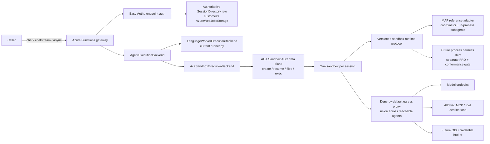

# FRD 0008 — ACA Sandbox session runtime

> **How to read this FRD.** This finalized record defines the ACA Sandbox
> session-runtime feature: its current contracts, state machines, status
> semantics, invariants, failure gates, and test obligations. The append-only
> Decisions log is the historical evidence for controlling amendments; the
> detailed requirements below state the current feature contract.
>
> **Status is `Finalized`.** ACA Sandbox compatibility with
> [FRD 0007](0007-multi-agent-delegation.md) and the non-HTTP fast follow in
> FRD 0009 are represented here only where they affect this feature.

## 1. Summary

Add an opt-in, session-based execution backend that runs the complete agent
harness inside one **Azure Container Apps (ACA) Sandbox** for the lifetime of an
agent session. The Azure Functions app remains the authenticated control-plane
**controller**: it resolves the authored agent, validates session ownership,
creates or resumes the sandbox, and routes a run to it. Existing chat calls stay
synchronous or streaming by default; a caller explicitly requests an asynchronous
run when work should outlive the HTTP request. A customer-owned, owner-scoped
state store maps opaque runtime session IDs to ACA sandbox resources. **In v1,
durability is best-effort via same-sandbox disk auto-suspend/resume; normal
suspension does not expose an explicit snapshot resource.** Mirroring completed
conversation checkpoints to external customer storage — so losing a sandbox does
*not* lose the session — is the **v2 target**, deferred here (Decisions 53–54).
**Durable Functions is not required for v1.** A coordinator's **subagents**
(multi-agent delegation, FRD 0007) run in-process inside that *same* session
sandbox — no per-specialist sandbox (see §3 and 0008.13).

## 2. The big picture, in plain language

Today the agent's "thinking loop" runs *inside* the Azure Functions Python worker,
and ACA Dynamic Sessions is only a later-bound `execute_python` *tool*. That splits
one logical turn across two compute boundaries, so a worker timeout or client
disconnect can kill an agent loop that could have kept running. This FRD proposes a
different shape: run the **whole harness** (the engine that calls the model, uses
tools/skills/MCP, and keeps memory — today that engine is the **Microsoft Agent
Framework, MAF**) inside a single isolated container (an **ACA Sandbox**) that
belongs to one authenticated session.

End to end, a request flows like this:

1. **Caller → Functions controller.** A `chat`/`chatstream` (or async) request
   arrives at the Functions app.
2. **Authenticate & authorize.** Easy Auth / endpoint auth validates the caller;
   the controller derives the session **owner** via the adaptive `OwnerContext` —
   the Easy Auth user when one is resolved, otherwise the function-app identity
   (Decision 55).
3. **Authoritative state-row lookup.** The controller reads a state-row store in
   the Function App's own `AzureWebJobsStorage` (Decision #86 — no separate
   dedicated account, in any environment). Routing is validated by a monotonic
   generation on the row plus a live sandbox manifest cross-check — the row,
   the live ACA resource, and the live manifest must agree.
4. **Create or resume the sandbox.** If none exists, create it with
   `SandboxCreateProfile` on the public `python-3.13`/`python-3.14` disk selected
   by the Function interpreter (or a customer-pinned disk) and deliver the
   bootstrap plus **controller-captured script-root content** over the file plane.
   The epoch digest covers code and vendored `.python_packages`, not the
   Run-From-Package deploy artifact; there is no custom bootstrap image. The
   controller applies deny-by-default egress; if suspended, it resumes and
   re-verifies readiness.
5. **Run journal.** The controller submits a run over the authenticated ACA data
   plane and reads status/events/result from an on-disk journal (no anonymous
   port). If the coordinator delegates to **subagents**, those specialists run
   *in-process in this same sandbox* — delegation opens no new sandbox.
6. **Response.** Sync waits (capped at 180 s) and returns today's shape; async
   returns `202` with run-management URLs. **In v1, durability is best-effort via
   ACA disk auto-suspend/resume** — normal suspension retains the same
   sandbox/generation but is not an external durability guarantee. Mirroring
   completed turns to external customer storage is the **v2 target**, deferred
   here (Decisions 53–54).



Four assumptions are qualified up front and carried into the sub-FRDs: egress
policy reduces but does not remove data-classification needs (0008.9); a managed
identity is **not** user OBO (0008.9); in **v1** same-sandbox disk
auto-suspend/resume is only a best-effort durability boundary and does not
expose an explicit normal-path snapshot resource; external checkpoint mirroring
is the **v2 target** (0008.8, Decisions 53–54); and **ACA Sandboxes is a preview
dependency**, so the backend stays experimental and opt-in (0008.1, 0008.5).

## 3. Consolidated design areas

The detailed sections after the master Decisions log are organized by current
feature capabilities. The Decisions log retains historical provenance and
controlling amendments.

| Area | Scope | Decisions / source of authority |
| --- | --- | --- |
| Execution backend & controller | Provider-neutral seam, controller role, and in-lang-worker default | 1, 2, 12, 13 |
| Session identity, ownership & concurrency | Opaque sessions, standard Functions auth, one active run | 6, 15, 55 |
| State store & tamper-evident trust | Dedicated state account, authoritative controller row, generation/manifest checks | 5, 20, 31–33, 39, 51–52 |
| Resource residency & provisioning | Customer subscription, one group/app environment, customer IaC/runtime boundary | 30, 65 |
| Controller/sandbox transport & protocol | File journal, idempotency, no ingress, 100-concurrency gate | 7, 23, 26, 29 |
| Sandbox packaging, image & content | Script-root capture, generic bootstrap, content digest | 8, 17, 48, 68–69 |
| Harness compatibility & conformance | MAF-only, protocol/capability contract, golden traces | 34–37, 49–50 |
| Snapshot, suspend & durability | Best-effort suspend/resume, readiness, loss semantics | 9, 18, 27–28, 53–54 |
| Network egress & OBO | Default-deny egress, proxy credentials, group managed identity, broker seam | 10–11, 16, 56–57, 66 |
| Authoring surface & config | App-level configuration and fail-closed validation | Configuration contract |
| HTTP sync, async & streaming | 180-second sync cap, management routes, replayable SSE | 3, 19, 25 |
| Lifecycle, failure & reconciler | State machines, failure behavior, timer reaper and retention | 4, 21–22, 24, 58–64, 67, 70 |
| Subagent delegation compatibility | Co-location, captured catalog, egress union, capability gate | 42–46 |
| Dynamic Workflows compatibility | v1 hard failure and reserved controller-mediated bridge | Analysis / Decision 36 |

> **Related / not in scope here.**
> - **Multi-agent delegation** is its own merged feature, [FRD 0007](0007-multi-agent-delegation.md); this backend's *compatibility* with it is 0008.13.
> - Non-HTTP **trigger** sessions are a separate planned feature, **FRD 0009**
>   (Decision 38). FRD 0008 reserves the owner/session-key extension seams (see
>   0008.2) but does not implement trigger sessions.

## 4. Goals / Non-goals

**Goals**

- Run the complete agent harness inside an ACA Sandbox: model calls, reasoning
  loop, skills, MCP clients, user tools, code execution, and working files.
- Allocate one sandbox to one authenticated agent session and reuse it across
  turns until the retention policy expires.
- Expire sessions by **idle-based retention** (no absolute creation-time TTL):
  each sandbox receives an explicit lifecycle policy at creation and after terminal
  adoption (~5 min auto-suspend / ~24 h idle reclaim), using app-level
  `session_runtime.retention` configuration in v1; the customer group's policy is
  only the IaC fallback, and per-agent `.agent.md` override is deferred to v2
  (Decision 64).
- Keep Azure Functions as a lightweight but security-critical controller for
  endpoint auth, authorization, session ownership, lifecycle routing, and response
  projection.
- Preserve current synchronous `/chat` and `/chatstream` behavior by default; add
  an explicit async run mode with status/event/result/cancel.
- Make every sandbox-side run addressable by an opaque `run_id`, even for sync
  callers.
- Persist owner-scoped control metadata in the customer-owned
  `AzureWebJobsStorage` Table service; never require a runtime-team-owned
  cross-customer service.
- **(v2 goal)** Mirror completed conversation checkpoints to owner-scoped external
  customer storage so losing a sandbox does not lose the session. **v1 is
  best-effort durability via ACA auto-suspend/resume** and does not ship this
  mirror (Decisions 53–54).
- Treat every stored session-to-sandbox pointer as untrusted until the
  authoritative row (controller-written), live ACA resource, and live manifest
  agree.
- Enforce one active run per session in v1.
- Deliver agent content by having the **controller capture its local script root,
  zip code plus vendored `.python_packages`, and deliver the full closure over
  the file transport**. `SandboxCreateProfile` selects a public Python disk or a
  customer override; no custom image is built. An attached Sandbox Group managed
  identity is available only for the workload's own authorized calls. Ship only
  the MAF reference adapter in v1 and prove parity first.
- Host **FRD 0007 multi-agent delegation (subagents)** inside the single session
  sandbox without regressions: co-located specialists, catalog/package spanning all
  reachable agents, union egress, and delegation as a negotiated harness
  capability (see 0008.13).
- Apply deny-by-default egress before untrusted work starts; support proxy-side
  credential injection.
- Keep the in-lang-worker runner as the default backend.
- Govern persistent ACA session ownership with the **standard Azure Functions auth
  gate** (function keys **or** App Service Authentication / Easy Auth) — the
  controller adds no second identity layer; the **app is the trust boundary**
  (function-key callers can create/own persistent sessions), with per-user
  ownership when Easy Auth resolves a user (adaptive `OwnerContext`; see 0008.2).
- Bound synchronous HTTP waits below the Functions 230 s ceiling; longer work uses
  async.
- Reconcile terminal checkpoints and expired/abandoned sessions with a **minimal
  periodic reconciler/reaper** (plain timer, configurable ~1h default — not
  Durable) as the guaranteed backstop and only global reclamation authority.
  Request fast-paths and client polling repair only the current session/operation;
  on capacity failure they repair that target and retry once without scanning
  unrelated sessions, so capacity may remain exhausted. Cadence tightens to
  ~1/min in v2 solely for the checkpoint-mirror SLO (Decisions 22, 58, 59, 63,
  131, 183, 186, 188).
- Place one Sandbox Group per Function App/environment in the customer subscription;
  customer tooling creates ARM/RBAC, the runtime creates only session sandboxes.
- Reserve an extensible owner contract for the separate non-HTTP trigger-session
  fast follow (FRD 0009) without implementing it here.

**Non-goals**

- Making Durable Functions/Durable Task Scheduler mandatory for sandbox sessions.
- Modifying the Azure Functions Host or Python worker protocol.
- Treating an ACA Sandbox as a public client-facing endpoint, or using anonymous
  sandbox ingress as the controller channel.
- Moving non-HTTP trigger execution to persistent sandboxes in v1 (reserved for
  FRD 0009).
- Per-owner fairness quota in v1 — a single owner may consume the app's full ACA
  capacity. Request-time capacity handling repairs only the current
  session/operation and retries once; it does not reclaim unrelated resources.
  Global reclamation remains timer-owned, and per-owner fairness is a v2
  optimization (Decisions 61, 183, 186).
- Exactly-once execution of external side effects; automatic retry of a failed
  agent loop.
- Claiming native user OBO; only a credential-broker extension point is reserved.
- Shipping or licensing a non-MAF harness adapter in this FRD.
- Implementing multi-agent **handoff** (cross-turn control transfer with shared
  context); its durable-state needs are only *reserved* in the checkpoint schema
  (Decision 46, 0008.13).
- **External-storage durability mirroring in v1** (owner-scoped external
  transcript/checkpoint mirror) — deferred to v2 (Decision 54). v1 relies on
  ACA disk auto-suspend/resume as a best-effort durability boundary. The
  destructive real-Azure loss-to-`410` acceptance test/sign-off remains deferred
  for human resolution.
- Installing harness dependencies from the internet at session creation.
- Replacing Dynamic Workflows.

## 5. Master Decisions log

> **Append-only, preserved from the pre-decomposition FRD.** The **Owner** column
> maps each decision to the sub-FRD that now re-expresses it in detail.
> Meta/scope/review decisions (14, 38, 40, 41, 47) are owned by this parent
> overview. Rows 41–47 were added when `main` merged multi-agent delegation as FRD
> 0007 and this FRD was renumbered to 0008: 41 is the renumber, 42–46 the subagent
> compatibility (owned by 0008.13), and 47 the independent subagent-integration
> re-review milestone.

| # | Decision | Options considered | Choice | Decided by | Date | Owner |
| - | -------- | ------------------ | ------ | ---------- | ---- | ----- |
| 1 | Agent execution location | Functions brain+sandbox tools / sandbox harness / Host integration | Run the full harness in one ACA Sandbox per session. | Human | 2026-07-20 | 0008.1 |
| 2 | Functions role | Agent runtime / byte proxy / session controller | Functions is the authenticated controller for ownership, lifecycle, and routing. | Human + Agent | 2026-07-20 | 0008.1 |
| 3 | Public run behavior | Async-only / sync-only / sync with async opt-in | Preserve sync/streaming defaults; `Prefer: respond-async` selects long-running work. | Human | 2026-07-20 | 0008.11 |
| 4 | Durable Functions dependency | Required / future backend / never | Not required in v1; reconsider for cross-session orchestration or managed retries. | Human | 2026-07-20 | 0008.12 |
| 5 | Session directory ownership | Runtime SaaS / customer storage / sandbox-only | Use customer storage; default to `AzureWebJobsStorage`, with a dedicated account allowed. | Human | 2026-07-20 | 0008.3 |
| 6 | Per-session concurrency | Unlimited / queue / one active run | Permit one active run; concurrent submission returns `409`. | Human + Agent | 2026-07-20 | 0008.2 |
| 7 | Controller transport | Anonymous HTTP / ADC file+exec / private tunnel | Use the ADC file+exec journal in v1 behind a transport abstraction. | Agent | 2026-07-20 | 0008.5 |
| 8 | Runtime packaging | Start-time install / immutable disk / shared mutable volume | Use an immutable prebuilt disk with protocol and manifest verification. | Agent | 2026-07-20 | 0008.6 |
| 9 | Snapshot role | Sole state / cache / none | Use snapshot for resume and disk checkpoint, never as the sole ownership/correctness record. | Agent | 2026-07-20 | 0008.8 |
| 10 | Egress posture | Allow then tighten / deny after bootstrap / deny at create | Apply full-inspection, default-deny egress before harness execution. | Agent | 2026-07-20 | 0008.9 |
| 11 | OBO interpretation | MI is OBO / pass user token / external broker | Managed identity is not OBO; reserve a broker that keeps delegated tokens outside the sandbox. | Agent | 2026-07-20 | 0008.9 |
| 12 | Existing execution behavior | Replace runner / opt-in backend | Keep `in_process` default; ACA is explicit and experimental. | Agent | 2026-07-20 | 0008.1 |
| 13 | Direct Functions Host integration | P0 / parallel / defer | Defer until the runtime contract is proven and host investment justified. | Human + Agent | 2026-07-20 | 0008.1 |
| 14 | Architecture review | Approve / reject / decompose but block | Keep controller/backend split; block finalization on transport evidence, sync cap, owner durability, and cleanup ownership. | Agent reviewer | 2026-07-20 | 0008 (parent) |
| 15 | Persistent-session auth | Function-key trust / signed capability / Entra | Require Entra for v1 ACA persistence; function-key endpoints stay local. | Agent reviewer | 2026-07-20 | 0008.2 |
| 16 | OBO milestone | Claim MI / build broker / reserve seam | Reserve the external broker seam until base transport is proven. | Agent reviewer | 2026-07-20 | 0008.9 |
| 17 | Artifact delivery (revises #8) | Per-disk project / signed package / start-time install | Use generic immutable harness disk plus signed digest-addressed content and offline dependencies. | Agent reviewer | 2026-07-20 | 0008.6 |
| 18 | Conversation durability | Disk / snapshot / owner-scoped mirror | Mirror each completed transcript delta and bounded checkpoint to owner-scoped customer Blob Storage. | Agent reviewer | 2026-07-20 | 0008.8 |
| 19 | Synchronous HTTP budget | Authored up to 900s / platform max / controller cap | Cap sandbox-backed HTTP at 180s; longer work requires `respond-async`. | Agent reviewer | 2026-07-20 | 0008.11 |
| 20 | Control-state storage | Block blobs / Tables / Durable Entity | Use Tables for queryable ETag session/run records and Blob Storage for transcript/checkpoint archives. | Agent | 2026-07-20 | 0008.3 |
| 21 | Controller coordination (reaffirms #4) | Durable / minimal Tables / no run records | Keep a no-retry Table state machine because ADC owns the live process; revisit Durable before queues, retries, fan-out, or compensation. | Agent | 2026-07-20 | 0008.12 |
| 22 | Expired-session cleanup | Next request / Durable eternal / timer | Register a timer-triggered ACA reconciler/reaper. **Revised by #58/#59, then #131 and #183/#186/#188.** | Agent reviewer | 2026-07-20 | 0008.12 |
| 23 | File/exec confidence (qualifies #7) | Samples / live spike / public ingress | Samples establish detached exec and 300s SDK limit; require live spike before finalizing file/exec; forbid anonymous ingress. | Agent reviewer | 2026-07-20 | 0008.5 |
| 24 | Async mirror cadence | On-demand / continuous write / reconciliation | Reconcile each minute to mirror terminal checkpoints within two-minute p95; keep storage credentials outside sandbox. | Agent | 2026-07-20 | 0008.12 |
| 25 | v1 streaming guarantee | Token parity / replayable chunks / disable | Permit replayable chunks within two-second p95; preserve event semantics and improve token latency later. | Human | 2026-07-20 | 0008.11 |
| 26 | Live file/exec gate | Documentation / authenticated ingress / preview spike | `0.1.0b3` spike passed create, 4 MiB transfer, detached launch, events, idempotency, cancel, cleanup; retain file/exec. | Human + Agent | 2026-07-20 | 0008.5 |
| 27 | Active-run lifecycle | Idle timeout / heartbeat / disable suspend | Disable auto-suspend for a run; watchdog bounds it; controller or one-minute reconciler restores terminal policy. | Agent | 2026-07-20 | 0008.8 |
| 28 | Resume readiness | `get().state` / retry only / operation+manifest | Trust file/exec response and verify protocol/session manifest; state reads may lag data plane. | Agent | 2026-07-20 | 0008.8 |
| 29 | v1 concurrency target | 25 / 100 / 1,000 runs | Design and validate for 100 concurrent active runs. **Current qualification policy: #192; N=100 remains human-only.** | Human | 2026-07-20 | 0008.5 |
| 30 | Sandbox residency | Customer / Microsoft multi-tenant / delegated deployment | Use one Sandbox Group per Function App/environment in customer subscription; long-term automation deploys there. | Agent reviewers | 2026-07-20 | 0008.4 |
| 31 | Production state account (revises #5) | `AzureWebJobsStorage` / dedicated customer / runtime service | Require `AzureFunctionsAgentsStateStorage` in production; reuse `AzureWebJobsStorage` only local/dev/explicit preview. | Agent reviewers | 2026-07-20 | 0008.3 |
| 32 | Session-pointer tamper evidence | ETag+RBAC / manifest / signed binding+log+manifest | Sign routing bindings with non-exportable customer Key Vault key; require Table/log/manifest agreement. | Agent reviewers | 2026-07-20 | 0008.3 |
| 33 | State authorization | Shared Key / account role / table-container Entra roles | Disable Shared Key; scope Function MI Table/Blob contributor roles; sandbox has no state access. | Agent reviewers | 2026-07-20 | 0008.3 |
| 34 | V1 harness | Non-MAF now / arbitrary image / MAF first | Ship only MAF in ACA v1; relocation and replacement are separate changes. | Agent reviewers | 2026-07-20 | 0008.7 |
| 35 | Harness layers | Generic adapter / protocol+adapter+shim | Split harness-neutral protocol, library adapters, and process shims; negotiate capabilities independently. | Agent reviewers | 2026-07-20 | 0008.7 |
| 36 | Unsupported MAF on ACA v1 | Fallback / Dynamic Sessions+callbacks / fail startup | Fail startup for `workflows.enabled` or Dynamic Sessions code interpreter until compatibility designs exist. | Agent reviewers | 2026-07-20 | 0008.7 |
| 37 | Non-MAF harnesses | Custom-image implied / v1 / separate adapters | Require separate FRDs and conformance gates; FRD 0008 makes no support claim. | Agent reviewers | 2026-07-20 | 0008.7 |
| 38 | Non-HTTP sessions | Expand 0008 / permanent non-goal / fast-follow | Author FRD 0009; reserve extensible owner/session-key contracts in 0008. | Agent reviewers | 2026-07-20 | 0008 (parent) → FRD 0009 |
| 39 | Binding-log immutability | Mixed container / version policy / dedicated immutable container | Separate immutable binding log from deletable history/checkpoints to preserve deletion. | Agent reviewer | 2026-07-20 | 0008.3 |
| 40 | Final architecture review | Blocked / ready | READY: storage trust, residency, harness compatibility, non-HTTP reservations, immutability, and disclosure have no blocker. | Agent reviewer | 2026-07-20 | 0008 (parent) |
| 41 | Renumber after collision | Keep 0007 / renumber 0008 | As `main` used 0007 for delegation, this FRD becomes 0008 and non-HTTP fast-follow 0009. | Human + Agent | 2026-07-21 | 0008 (parent) |
| 42 | Subagent location | Per-specialist sandbox / shared sandbox | Delegated specialists run in the session's one sandbox; no specialist sandbox. | Agent | 2026-07-21 | 0008.13 |
| 43 | Delegation package/catalog | Entry agent / all reachable agents | Include coordinator and every referenced specialist in signed package and in-sandbox catalog. | Agent | 2026-07-21 | 0008.13 |
| 44 | Delegation egress | Per-agent / union | Deploy catalog allow-list union while preserving default deny. | Agent | 2026-07-21 | 0008.13 |
| 45 | Delegation capability | Assume support / negotiate and fail closed | Make delegation negotiated; MAF supports it; otherwise fail closed and require conformance trace. | Agent | 2026-07-21 | 0008.13 |
| 46 | Future handoff state | Ignore / reserve schema room | Reserve checkpoint/manifest active-participant and shared-context fields; exclude from v1. | Agent | 2026-07-21 | 0008.13 (xref 0008.8) |
| 47 | Delegation re-review | Pending / independent re-review | READY with no blockers; incorporate capability wording, shared-egress trust caveat, and group-wide policy scope in §4.5/§4.16. | Agent reviewer | 2026-07-21 | 0008 (parent) |
| 48 | Content packaging (refines #17, aka 17-R) | Bespoke package / Functions RFP / committed image | Reuse Functions Run-From-Package artifact in v1; document but defer committed image; preserve #17 intent/security. | Human | 2026-07-22 | 0008.6 |
| 49 | Harness protocol/capability versioning (refines #35) | Separate capability version / joint version | v1 `protocol_version` covers framing and capabilities; defer separate version. Total feature map fails unknown features closed; advertised support needs conformance trace (#45). | Human | 2026-07-22 | 0008.7 |
| 50 | `execute_python` rationale (refines #36) | Compatibility design / native execution | Native sandbox execution supersedes the nested Dynamic Sessions rationale; startup rejection/action remains unchanged. | Human | 2026-07-22 | 0008.7 |
| 51 | State-row trust (supersedes #32) | Key Vault signing / scoped-RBAC row | Drop binding signing. #33 makes controller MI sole writer; validate monotonic row generation plus live manifest. RBAC+manifest prevent confused deputy within subscription. | Human | 2026-07-22 | 0008.3 |
| 52 | Binding generation (supersedes #39) | WORM log / Table generation | No v1 WORM log; store monotonic generation on ETag-guarded Table row. WORM remains additive future option. | Human | 2026-07-22 | 0008.3 |
| 53 | Snapshot durability (refines #9) | Mirror-backed / best-effort snapshot / sync mirror | ACA snapshot is v1 best-effort source of truth; #9's never-correctness rule is v2 after mirror. Loss ends session; retain #27/#28 v1 recovery. | Human | 2026-07-22 | 0008.8 |
| 54 | External mirror (defers #18 to v2) | v1 Blob mirror / v2 mirror | Defer #18 transcript/checkpoint mirror to v2; restoring it also restores #9's never-correctness guarantee. | Human | 2026-07-22 | 0008.8 |
| 55 | Ownership auth (revises #15) | Entra-only / Functions auth | Reuse keys or Easy Auth; no second layer. Key callers can own app-bound sessions. `entra_user` is per-user, `function_app` not key-bound, `trigger_binding` reserved. Only versioned hashed owner label crosses boundary; no eager migration. | Human | 2026-07-22 | 0008.2 |
| 56 | Sandbox identity | Proxy MI / separate identity / same MI via HOBOv2 | Historical identity-proxy design. **Revised by #57, superseded by #66, then revised by #153; current contract is in §11.** MI is not user OBO. | Human | 2026-07-23 | 0008.9 |
| 57 | v1 sandbox identity (refines #56) | UAMI group / HOBOv2 delegation | v1 assigns app UAMI to group; Identity Proxy needs no 1P onboarding. Defer HOBOv2 for own Azure resource; decouple #56 from #13; #10/#11/#16 remain. **Superseded by #66, then revised by #153.** | Human | 2026-07-23 | 0008.9 |
| 58 | Cleanup reconciler (refines #22) | Durable / opportunistic / timer+fast paths | Use configurable adaptive plain timer (~1h) as backstop; fast paths/client poll handle common case; #4 no-Durable remains. **Current policy: #131 and #183/#186/#188.** | Human | 2026-07-24 | 0008.12 |
| 59 | Reconciler scale | Hot loop / opportunistic / low-frequency | Use low-frequency adaptive due-work query; no v1 hot loop. Refines #24: one-minute cadence is v2 mirror-only. **Current policy: #131 and #183/#186/#188.** | Agent | 2026-07-24 | 0008.12 |
| 60 | Automatic retry | Framework retry / caller resubmit | No auto-retry: caller resubmits with Idempotency-Key; active run is 409; cancel-then-submit only escape; no v1 queue/supersede. | Agent | 2026-07-24 | 0008.12 |
| 61 | Active-session quota | Per-owner / aggregate / no counter | v1 has no cap; ACA capacity and reap-on-failure bound aggregate use; per-owner fairness is v2. | Agent | 2026-07-24 | 0008.12 |
| 62 | Lost sandbox / 410 | v1 rebuild / status durability | Tables preserve status, sandbox content is best effort; lost sandbox returns 410; rebuild needs v2 mirror. | Agent | 2026-07-24 | 0008.12 |
| 63 | Suspend restore/reclaim | Self-restore / callback / TTL-disable / reconciler | Periodic reconciler is required for crash-before-signal; reject self-restore/callback. Optional self-suspend request; re-arm #27 idle policy (xref 0008.8; cd0f619 resolved). | Agent | 2026-07-24 | 0008.12 |
| 64 | Session retention | Fixed TTL / group-only / idle hybrid | Use group default < app `session_runtime.aca_sandbox.retention` (v1) < per-agent `.agent.md` (v2); no absolute creation TTL. | Human | 2026-07-24 | 0008.12 (xref 0008.10, 0008.4) |
| 65 | Residency/provisioning (refines #30) | Microsoft / cross-tenant / customer IaC | Customer Bicep/ARM under customer creds; no Microsoft/cross-tenant ID. One group/app-env/region; customer tears down IaC, runtime deletes sessions. Preview quota; #29 validates 100. Pinned image/sample IaC; quickstart later. | Human | 2026-07-22 | 0008.4 |
| 66 | Identity-less v1 sandbox (supersedes #56/#57) | App UAMI / sandbox UAMI / none | No MI or AAD token in sandbox. Egress proxy injects credentials; controller delivers content. Supersedes #56/#57 v1 mechanism; MI/HOBO deferred; sandbox cannot write state. **Revised by #153 for the attached Sandbox Group identity.** | Human | 2026-07-24 | 0008.9 (xref 0008.3, 0008.6) |
| 67 | Loss vs crash (refines #9/#62) | Reuse always / tombstone always / distinguish | Loss/snapshot tombstones (410/new session). Intact-disk crash abandons run but retains sandbox/session at atomic checkpoint. Only future state-preserving rebind changes generation. | Human | 2026-07-24 | 0008.12 (xref 0008.8, 0008.2, 0008.5) |
| 68 | Content capture (refines #48/#17) | Sandbox storage / plan Blob / local root | Controller captures local root plus `.python_packages`, hashes, and file-transfers; sandbox has no storage. Require Linux Python 3.13/3.14 ABI; #69 supersedes separate runtime environment. | Human | 2026-07-24 | 0008.6 (xref 0008.9) |
| 69 | Stdlib bootstrap (refines #68/#17; supersedes baked MAF) | Bake runtime/MAF / stdlib bootstrap | Functions Python base plus stdlib bootstrap; captured `.python_packages` is one pip env for runtime/MAF/tools via `site.addsitedir`. No isolation; base ensures ABI. | Human | 2026-07-27 | 0008.6 (xref 0008.7) |
| 70 | Deploy drain (supersedes epoch retention; defers continuity to v2) | Retain epochs / lifetime / drain+tombstone | Digest redeploy: grace then abandon run and tombstone mismatch (410); no restart/scale drain. No v1 schema/protocol window; idle-reap old sandboxes. Continuity is v2. | Human | 2026-07-27 | 0008.12 (xref 0008.7, 0008.3, 0008.9) |
| 71 | SDK lifecycle names | `suspend()` / `stop()` / custom resume | Use `stop()`/`begin_stop()` for suspend and `resume()`/`begin_resume()`; no `suspend()` or `resume_sandbox`. | SDK verification pass | 2026-07-28 | SDK verification |
| 72 | Journal transport | `exec` scripts / direct file APIs | Use `list_files`, `stat_file`, `read_file`, `write_file`, `delete_file`, `mkdir`; reserve `exec` for process control. | SDK verification pass | 2026-07-28 | SDK verification |
| 73 | Lifecycle policy scope | Group-only / per-sandbox | Set creation suspend fields and re-arm per-sandbox `LifecyclePolicy` with `set_lifecycle_policy`. | SDK verification pass | 2026-07-28 | SDK verification |
| 74 | Auto-delete backstop | Warn/clamp / always validate | `delete_interval_seconds` is readable; row 13 hard-fails when reclaim exceeds delete minus cadence/grace. | SDK verification pass | 2026-07-28 | SDK verification |
| 75 | Egress/resource observability | Controller equivalents / SDK signals | Use `get_egress_decisions()` for audit and `get_stats()` for resources. | SDK verification pass | 2026-07-28 | SDK verification |
| 76 | Egress model/injection | Generic list / host+full rules | `host_rules` permits Allow/Deny; ordered `rules` supports full matches and Allow/Deny/Transform/Rewrite. Proxy injects static, secret, or MI refs outside sandbox; group Secrets back refs. | SDK verification pass | 2026-07-28 | SDK verification |
| 77 | Reconciliation/snapshots | Table scan / platform reconciliation | Reconcile with `list_sandboxes(labels=...)`; persist and prune snapshots with `list_snapshots()`/`delete_snapshot()` because ACA does not GC them. | SDK verification pass | 2026-07-28 | SDK verification |
| 78 | Safe egress defaults | SDK defaults / explicit fail-closed | Set default Deny and explicit Full inspection only; never use `skip_egress_proxy=True`. | SDK verification pass | 2026-07-28 | SDK verification |
| 79 | Source/polling safety | Implicit Ubuntu/unbounded poll / explicit source+budget | Require one of disk, disk ID, snapshot ID, preset; pass remaining 30s setup budget, never 300s default. | SDK verification pass | 2026-07-28 | SDK verification |
| 80 | Disk supply chain | External base/MCR / OCI self-service | Build bootable disk from OCI with create methods; `commit()` returns `DiskImage`; no MCR dependency. | SDK verification pass | 2026-07-28 | SDK verification |
| 81 | Stateless recovery | Retain SDK client / reconstruct | Persist `sandbox_id`; construct `SandboxClient` after recycle; group helper is optional. | SDK verification pass | 2026-07-28 | SDK verification |
| 82 | Preview SDK containment | Distributed use / pinned adapter firewall | Pin `azure-containerapps-sandbox==0.1.0b4`, confine symbols to `transport/aca_sdk.py`, exclude production doubles, and smoke ACA from first adapter phase. | SDK verification pass | 2026-07-28 | SDK verification |
| 83 | Event-stream Protocol signature | Async Protocol method / non-async iterator method | Declare non-async `read_events` returning `AsyncIterator`; implementations may be async generators. A type-only conformance guard prevents coroutine-stub regression. | P0 type-check verification | 2026-07-28 | P0 contract correction |
| 84 | `session_runtime` selection | Keep provider / rename value / presence selection | Remove `provider`: `aca_sandbox` presence selects backend, absence default; nest retention under it. | Human | 2026-07-29 | 0008.10 |
| 85 | Internal backend rename (refines #12) | Keep / value only / class+value+files+tests | Rename to `LanguageWorkerExecutionBackend`/`in_lang_worker`; never expose it to config authors. | Human | 2026-07-29 | 0008.1 (xref 0008.10) |
| 86 | Shared session storage (revises #5/#31) | Dedicated required / optional / removed | Remove dedicated-account concept: always use `AzureWebJobsStorage`, in every environment, without configuration. | Human | 2026-07-29 | 0008.3 |
| 87 | Shared-Key storage check (narrows #33 after #86) | Require MI/RBAC / drop check | Drop row 6; accept Shared Key for `AzureWebJobsStorage`, matching core Functions' shared trust model. | Human | 2026-07-29 | 0008.3 |
| 88 | Schema-level `harness` | Runtime string check / `Literal["maf"]` | Make `harness: Literal["maf"]`; remove unreachable runtime validation. | Reviewer (PR #128) | 2026-07-29 | 0008.10 |
| 89 | P3a app/owner canonical bytes | Delimited / JSON / binary | Use 4-byte count/length NFC UTF-8 frames. `a1` is app tuple (see #93); discriminator-first `o1` app hash, agent, Entra/app owner. Normalize IDs/slots; strict claims fail closed; stored-version canonicalizers never migrate. | Agent (P3a implementation) | 2026-07-30 | 0008.2 / P3a |
| 90 | P3a IDs/Table keys | Ad-hoc IDs / typed bounded keys | Mint 32-char UUID4 hex IDs; retain safe public ID grammar. Partition is `o1:{app_hash}:{owner_kind}:{owner_hash}`; rows are session/run/idem with SHA-256 key digest. Admission rows share partition for EGT. | Agent (P3a implementation) | 2026-07-30 | 0008.2 / 0008.3 / P3a |
| 91 | P3a row schema/generation/snapshots | Loose / typed schema | Schema v1; UTC typed session/run/idem rows; optional strings empty; generation >=1, only future rebind increases. Ordered `snapshot_ids` <=64/8192 bytes or fail. P3a serializes; P3b I/O, P3c binding, P3d reconcile. | Agent (P3a implementation) | 2026-07-30 | 0008.3 / P3a |
| 92 | P3a precision review | Implicit `o1` / inline app fields / bind `o1` to `a1` | Bind `o1` to `app_hash`; define production slot and Entra failure, add key shapes, defer fingerprint bytes/region validation to P3c, and split P3a–P3d. | Agent reviewer | 2026-07-30 | P3a review |
| 93 | Portable app identity (revises #89) | Subscription+RG+site+slot / SKU adaptive / common tuple | `a1` uses subscription (`WEBSITE_OWNER_NAME`), site, slot; never hostname/RG/key. All SKUs supply them; Flex lacks RG. No SKU branch; keys select `function_app`, Easy Auth `entra_user`. | Human + Agent | 2026-07-30 | 0008.2 / P3a |
| 94 | Subject-less Easy Auth (revises 0008.2 fallback) | Fall back to app / 401 | Missing/invalid/non-unique Entra `tid`/immutable `oid` returns 401, never shared app ownership. Function/admin keys still select `function_app`. | Human + Agent reviewer | 2026-07-30 | 0008.2 / P3a |
| 95 | Rename migration | Automatic re-key / new identity space | No v1 migration: app-site or agent-slug rename changes hash/partition; old rows reclaim normally; callers start new session; alias tooling deferred. | Human + Agent reviewer | 2026-07-30 | 0008.2 / P3a |
| 96 | `active_run_id` invariant | Shape-only / status consistency | Require it for running/canceling; require `None` for creating, ready, suspend/resume, failed, quarantined, tombstoned, deleting, deleted. | Agent reviewer | 2026-07-30 | 0008.3 / P3a |
| 97 | P4a file/process split | File via exec / mixed port / six file verbs+process port | Keep six direct file verbs separate from process `exec`; journal I/O cannot shell out. Implements #72 without changing four-method seam. | Agent | 2026-07-30 | P4a (0008.5) |
| 98 | P4a live-manifest boundary | Derive values / handle only / opaque compare | Consume P3 owner/app/generation and P4b digest opaquely; strictly parse manifest and redact mismatches; do not mutate Tables/CAS or canonicalize. | Agent | 2026-07-30 | P4a (0008.3 / 0008.6) |
| 99 | P4a group/resume verification | ARM ID / SDK state / group+manifest | Bind the customer group; cross-check persisted group/region and sandbox. Resume: persisted ID, manifest read, strict binding; SDK state advisory. **Revised by #194:** group identity and region are authored and no ARM resolution occurs. | Agent | 2026-07-30 | P4a (0008.4 / 0008.8) |
| 100 | P4a safe create | Defaults / implicit disk+ingress / explicit safe create | Require explicit source, no ports, proxy enabled, Deny+Full egress, and <=30s polling; only opaque/versioned IDs label sandbox. Narrowed by #102: reject snapshot ID. | Agent | 2026-07-30 | P4a (0008.4 / 0008.9) |
| 101 | P4a preview gate | Simulate / live-first / doubles+held smoke | Keep 0.1.0b4 optional in one adapter, test via injected factories/import guards, and hold live create→file→exec→stop→resume→delete smoke for human-authorized group/credentials. | Agent | 2026-07-30 | P4a (0008.5) |
| 102 | Snapshot create boundary (narrows #100) | Forward snapshot / omit metadata / reject snapshot | Reject `snapshot_id`: 0.1.0b4 restore forbids labels/egress, so cannot prove owner binding and deny-inspected egress. Disk, disk ID, preset remain. | Agent review | 2026-07-30 | P4a (0008.4 / 0008.9) |
| 103 | Non-blocking `resume()` readiness | Immediate read / state poll / bounded retry+verify | `resume()`, retry transient manifest reads only to finite deadline, then strictly verify manifest/handle; state remains advisory. Stop/delete use bounded LRO timeouts. | Agent review | 2026-07-30 | P4a (0008.5 / 0008.8) |
| 104 | Accepted-create failure cleanup | Lose ID / private poller / label cleanup | Add random non-identity attempt label; on create failure list it, bounded-delete all matches, then propagate; fail explicitly if cleanup unconfirmed. | Agent review | 2026-07-30 | P4a (0008.4 / 0008.5) |
| 105 | P4a shared manifest ownership | Whole object / ambiguous duplicate / required subset | P4a owns required strict routing subset; reject duplicate/invalid routing and group ID; ignore valid later sections owned by later phases. | Agent review | 2026-07-30 | P4a (0008.3 / 0008.6 / 0008.8) |
| 106 | Canonical owner/app text (revises #55 hex wording) | 67-char hex / split labels / base32 everywhere | Encode existing SHA-256 as lower unpadded base32 `a1-`/`o1-` 55-char tokens everywhere. Preserve 256 bits/version; P3b updates vectors, P4a enforces 63-char label limit. | Human | 2026-07-30 | P3b / P4a (0008.2 / 0008.4) |
| 107 | `FileInfo.mode` bad annotation | Trust `str` / optional int+one cast / drop | 0.1.0b4 says `str` but live wire is int; model optional int, with `_sdk_file_mode()` the only cast past bad stub. | Agent | 2026-07-30 | P4a (0008.5) |
| 108 | Manifest path | Per-implementation / runtime path / generic path | Fix `SESSION_MANIFEST_PATH` at `/var/lib/azurefunctions-agents-runtime/session/manifest.json`; harness writes it as sole coordination path. | Human | 2026-07-30 | P4a / P4b (0008.5 / 0008.6) |
| 109 | Unique module names | Keep / rename all / convention+owned rename | Adopt globally unique intent names; rename `transport/models.py` to `transport_models.py`; defer `session_state/models.py` to its owning phase. | Human | 2026-07-30 | P4a (0008.5); `session_state` deferred |
| 110 | Typed vs untrusted parsing | Remove validation / hand-rolled / strict model | Trust typed SDK/our data; parse untrusted sandbox manifest with strict Pydantic rather than hand checks, preserving declared fail-closed boundary. | Agent + Human | 2026-07-30 | P4a (0008.5) |
| 111 | Lint vs written conventions | Enable all / review only / zero-violation lint | Enable TRY002/201/203/301/400 and D200/D210/D419; keep TRY003/004, ANN401, PLR1702, C901, D205/209/400/403/415 as AGENTS rules due existing violations. | Agent + Human | 2026-07-30 | P4a (0008.5) |
| 112 | Untrusted manifest parsing | Hand checks / `model_validate_json` / duplicate hook+strict model | `json.loads` duplicate-key hook then `strict=True`, `extra="ignore"` model; block coercion, permit later sections, and redact `ValidationError` values. | Human | 2026-07-31 | P4a (0008.5) |
| 113 | P3b base32 validation | Lenient base32 / strict canonical | For #106 use lower, unpadded RFC4648 `[a-z2-7]{52}` encoding of #89's 256-bit digest; `a1`/`o1` framing/version/migration behavior unchanged. No migration for unreleased state. | Agent (P3b implementation) | 2026-07-30 | 0008.2 / 0008.3 / P3b (implements #106) |
| 114 | P3b `s1-` fingerprint (moves #91 P3c work earlier) | Define in P3c / compute P3b | Hash framed normalized non-secret Table endpoint/account as base32 `s1-`; never connection string/key; fail userinfo and strip query/fragment. P3c binds live region/epoch. | Agent (P3b implementation) | 2026-07-30 | 0008.3 / P3b |
| 115 | Table connection/cache | Connection string / string+identity precedence | Non-empty `AzureWebJobsStorage` wins; else table URI with client ID, `AZURE_CLIENT_ID`, then default credential. Missing config fails; cache clients only by non-secret #114 `s1-` fingerprint. | Agent (P3b implementation) | 2026-07-30 | 0008.3 / P3b |
| 116 | P3b Table I/O/CAS/EGT | Sequential+lock / EGT+CAS | Use EGT+ETag/CAS; dedup before active check; one EGT admits slot/run/idem. Terminal adoption is idempotent or typed conflict; clear matching slot, validate generation, map errors; Azurite race-tested; P3c/P3d deferred. | Agent (P3b implementation) | 2026-07-30 | 0008.2 / 0008.3 / P3b |
| 117 | `session_state` module rename (fulfills #109 deferral) | Keep / mechanical P3b rename | Rename `session_state/models.py` to `session_models.py` by `git mv`, updating importers/test; package re-exports, public types, fields, schemas unchanged. | Human (relayed) + Agent (P3b implementation) | 2026-07-30 | P3b |
| 118 | Convention enforcement (narrows #109/#111) | AGENTS prose / lint, guards, scoped instructions | Keep mechanical rules in ruff/mypy and AST guards; put source-only judgment in scoped instructions. AGENTS stays process-focused; rename workflow modules to enforce unique basenames. | Human + Agent | 2026-07-31 | 0008 (parent) |
| Meta | Editorial normalization | Historical wording / concise flat table | Human-approved editorial compaction preserves every decision's meaning and revision relationships; the user selected this flat-table structure. | Human | 2026-07-31 | 0008 (parent) |
| 119 | Archive identity | custom writer / deterministic stdlib ZIP | Use `ZIP_STORED` with fixed metadata, no ZIP64, and a 256 MiB cap; verify identical bytes on Python 3.13/3.14. Capture the live script root, never a platform deploy ZIP. | Human + Agent | 2026-08-03 | 0008.6 |
| 120 | Secure capture scope | portable fallback / Linux-only fail closed | Require secure Linux traversal: one root fd spans scan, write, and rescan; only contained regular-file symlinks dereference. Other platforms, absolute targets, special files, and empty roots fail closed. | Human + Agent | 2026-08-03 | 0008.6 |
| 121 | Worker package lifecycle | capture per session / cache once per worker | Lazily capture once per worker process and reuse one immutable package for all sessions. Equivalent workers produce the same digest; redeploy creates new worker caches. First capture runs off-loop and failures are not cached. | Human + Agent | 2026-08-03 | 0008.6 |
| 122 | Delivery verification | full read-back / bounded verification | Verify archive size and harness digest; verify sidecar/seed exactly. Archive write failures propagate. Uncertain small writes may succeed only after exact read-back; operational read failures remain typed. | Human + Agent | 2026-08-03 | 0008.6 |
| 123 | Manifest binding | controller writes / harness-only live manifest | The harness alone publishes the live manifest; the controller seed is not readiness. `state_store_fingerprint` is an opaque caller-supplied 12th field. Only missing maps to not-ready. | Human + Agent | 2026-08-03 | 0008.6 |
| 124 | File transport errors | provider exceptions / runtime-owned errors | The ACA adapter maps not-found and operational SDK failures to runtime-owned types. Production smoke requires direct overwrite; no delete/rewrite fallback exists. | Agent | 2026-08-03 | 0008.6 |
| 125 | Memory and streaming | full file reads / bounded capture | Stream files into a temporary ZIP, then materialize one ≤256 MiB payload for the current transport. Per-worker caching prevents duplicate captures; chunked delivery is deferred. | Human + Agent | 2026-08-03 | 0008.6 |
| 126 | Runtime and CI platform | cross-platform / Linux only | Support Linux x86_64 Python 3.13/3.14 only. CI runs the full gate on Linux 3.13/3.14; unsupported platforms fail before filesystem access. | Human + Agent | 2026-08-03 | 0008.6 |
| 127 | Reconciler timer cadence | fixed hour / unrestricted cadence / bounded setting | Use one plain timer setting, default/max 3600 seconds; permit faster whole-minute values from 60. | Human | 2026-08-04 | U1 |
| 128 | Per-sandbox lifecycle policy | group readback / inherited default / explicit complete policy | Set suspend+delete immediately after create and before delivery; delete is reclaim + 3600 + 300. This supersedes row 74/group auto-delete validation. | Human | 2026-08-04 | U1 |
| 129 | ACA HTTP auth parity | separate policies / weaker management auth / exact equality | Built-in chat and custom HTTP both honor `respond-async`; if both exist, compare complete resolved auth policies before route mutation. | Human | 2026-08-04 | U1 |
| 130 | Lifecycle call ownership | U1 controller / U2 bootstrap / both | U1/P6 disables, restores, and reconciles per-sandbox lifecycle; U2 only makes its harness suspension-tolerant. | Human | 2026-08-04 | U1 |
| 131 | Reclaimer isolation and fencing | Timer-only scan / app scope with fence | Scope inventory and Table scans to the app, rotate a durable bounded cursor, and fence an active backing before destructive recovery so terminal adoption cannot reopen its slot. **Current request/timer ownership and bounds: #183/#186/#188.** | Agent | 2026-08-06 | U1 corrective |
| 132 | Durable session operations | Per-flow statuses / generic same-partition row / external coordinator | Use sequence-keyed operation rows plus a session pointer/token; EGT fences reclaim and lifecycle rearm, blocks admission, and resumes/prunes durably. | Human + Agent | 2026-08-06 | U1 corrective |
| 133 | Operation taxonomy (narrows #132) | Per-state flags / broad op set / three controller flows | Limit v1 operations to `provision_submit`, `submit_run`, and `reclaim_backing`; terminal rearm is the final submit phase, while reads, adoption, attach, quarantine, drain, and routine reconcile remain direct paths. | Human + Agent | 2026-08-06 | U1 corrective |
| 134 | Reservation and recovery (narrows #132) | Create-first compensation / external coordinator / owner-partition EGT | Reserve owner claim, session, accepted run, and provision op before create; bind a stable provider label and phase target. Resume by token/CAS and prune terminal ops. | Human + Agent | 2026-08-06 | U1 corrective |
| 135 | Durable terminal validator routing | Request-only validation / raw app-wide timer / persisted agent identity | Persist the non-secret agent slug on new runs and submit operations so management and app-wide reconciliation select the same resolved output validator. | Human + Agent | 2026-08-06 | U1 corrective |
| 136 | Provider labels and journal integrity | Variable labels / fixed digest labels; deferred journal errors / terminalize then quarantine | Hash transport IDs and operation correlations into fixed provider-safe labels. On invalid journal protocol, terminalize the affected run before quarantining its matching session and return only a typed redacted failure. | Human + Agent | 2026-08-07 | U1 corrective |
| 137 | ACA surface validation and preflight | Per-route validators / shared resolved validator; lazy SSE / status preflight | All ACA chat, stream, MCP, management, and timer paths use the resolved output validator. Management SSE verifies status before headers and touches only live session states; corrupt submit journals finalize their matching fence after quarantine. | Human + Agent | 2026-08-07 | U1 corrective |
| 138 | Cancel validation and touch contention | Raw cancel status / validated durable projection; fail reads / bounded retry | Cancel validates natural terminal success before adoption and returns its durable projection. Management activity touch retries one ETag conflict from a fresh row, then becomes a no-op without masking other store failures. | Human + Agent | 2026-08-07 | U1 corrective |
| 139 | Cancel and journal status contract | Raw activation exceptions / management mapping; permissive status shape / strict terminal invariants | Management cancel maps absent and retired sessions to typed 404/410 responses. Journal status requires consistent result/error fields; an advertised-but-missing result is a redacted integrity failure. | Human + Agent | 2026-08-07 | U1 corrective |
| 140 | Journal correction and deadline cleanup | Immutable terminal rows / integrity override; unbounded cleanup / reserved headroom | Journal integrity may narrowly replace even a prior terminal success with failed/no-result before quarantine, then finalize only its matching submit fence. Post-deadline status/cancel cleanup shares a 45-second platform-headroom deadline. | Human + Agent | 2026-08-07 | U1 corrective |
| 141 | Materialized result contract | Availability flag alone / require payload | A succeeded run with `result_available=true` but no materialized payload returns retryable 503 rather than false 200 or permanent 410; evicted/tombstoned results remain 410. | Human + Agent | 2026-08-07 | U1 corrective |
| 142 | Takeover and route safety | Preempt leases / expired-only takeover; opaque / validated IDs | Take over only expired leases via ETag; validate management IDs before backend work; close unreturned post-create handles on failure. | Human + Agent | 2026-08-07 | U1 corrective |
| 143 | Live provision replay ownership | Resume any matching provision / expired takeover or observe | A same-key replay never rotates a live provision lease or calls create; it returns the existing accepted run until the owner advances. Post-create reconciliation failures close the unreturned handle. | Human + Agent | 2026-08-07 | U1 corrective |
| 144 | Unreleased operation row shape | Interim-row support / fail closed and reset | The first released operation schema requires `active_operation_id` and nonnegative `operation_sequence`; unreleased interim rows are unsupported and must be reset. | Human | 2026-08-07 | U1 corrective |
| 145 | Canonical sandbox root | Dual roots / one root | Use only `/var/lib/azurefunctions-agents-runtime`; derive every child path centrally and never migrate or retain the former root. | Human | 2026-08-07 | U2 |
| 146 | Disk bootstrap and readiness | Custom image / public disk bootstrap | Use public `python-3.<minor>` or explicit disk override, one-shot entrypoint bootstrap, composite verified delivery, and protocol before manifest. | Human | 2026-08-07 | U2 |
| 147 | Harness durability | Host stream / private run journal | Use the shared structured runner stream, strict journal, bounded private cwd, history/checkpoint commit, watchdog, and process-group cancellation. | Human | 2026-08-07 | U2 |
| 148 | Harness capabilities | Bootstrap-only / exact map | Preserve base atomic-commit and watchdog capabilities; register bootstrap and delegation for one exact four-capability readiness map. | Human | 2026-08-07 | U2 |
| 149 | Sandbox environment | Whole host environment / positive provenance | Forward only the built-in non-secret profile and explicit `AZURE_FUNCTIONS_AGENTS_SANDBOXENV_*`; prefixed credentials are intentional guest exposure. | Human | 2026-08-07 | U2 |
| 150 | Identity and headers | No group identity / group identity | Guest credentials use the dedicated Sandbox Group identity; static proxy headers are default and optional `secretRef` remains customer-provisioned. | Human | 2026-08-07 | U2 |
| 151 | Egress lifecycle | Legacy inspection or mutable policy / Full create-time policy | Use explicit Deny plus Full inspection, ordered rules, capped policy, and drain/new session for policy or credential rotation. | Human | 2026-08-07 | U2 |
| 152 | ACA backend availability and create source | Unconditional unavailable gate / supported opt-in runtime | Remove the unconditional `aca_sandbox backend not available in this build` gate. On Linux x86_64 CPython 3.13/3.14, valid `aca_sandbox` configuration activates the real adapter and `SandboxCreateProfile`; the Function interpreter selects public `python-3.13`/`python-3.14` by default, or a customer can pin a private disk ID. Bootstrap, application, and complete dependency closure cross the file plane; no custom bootstrap image exists. Platform/configuration validation remains fail-closed and the in-language worker remains default. | Human + Agent | 2026-08-12 | U3 |
| 153 | U3 live turn, identity, and lifecycle evidence | Synthetic-only proof / lower-level and deployed proof | Record real adapter create, exact 80 MiB single-write delivery, full dependency closure, harness entrypoint, envelope/journal acceptance, and SDK-aware mypy from PR #152; a lower-level Luna turn and an Easy-Auth-protected deployed public turn passed (ADO 297517). Record lifecycle pass (ADO 297555): auto-suspend, same sandbox/generation resume, second suspend, then controller-only timer reclaim/tombstone with zero sandbox or snapshot leaks. This supersedes Decision #66's absolute identity-less wording: runtime attaches no identity and forwards no controller/token/storage credential, but a customer-attached, dedicated least-privileged Sandbox Group identity is guest-usable for egress-exempt token acquisition and has model inference only, never state-store rights. OBO remains inert. | Human + Agent | 2026-08-12 | U3 |
| 154 | U3 load acceptance | Declare Decision #29 passed / retain agent diagnostic policy | The committed public Easy-Auth load runner uses N=5 as its sole agent/CI diagnostic validation. N=100 remains human-only formal Decision #29 acceptance; do not mark Decision #29 or N=100 load acceptance passed until human-supplied N=100 evidence is available. **Current qualification matrix: #192.** | Human | 2026-08-12 | U3 |
| 155 | U3 local quality evidence | Omit / record current gate | Record current local gate: Ruff clean; strict mypy clean for 97 files; Python 3.13 pytest result 1792 passed, 61 skipped, 82 deselected. | Human + Agent | 2026-08-12 | U3 |
| 156 | Live ACA smoke promotion | Schedule/Manual nonblocking / PR signal / blocking pipeline / required check | Retain Schedule/Manual execution, `continueOnError`, and no required merge check. Reconsider promotion only after the U3 service connection is wired to the correct subscription, five scheduled low-level smoke runs pass with zero reaper leaks, and five manual N=5 diagnostics pass. N=100 remains human-only and is never an automated promotion prerequisite. **PR-smoke eligibility was revised by #163/#164 and superseded by #165; current deployed qualification policy is #190/#192.** | Human | 2026-08-12 | U3 |
| 157 | Dual Python deployed smoke matrix | One runtime / parallel Python 3.13 and 3.14 diagnostics / blocking promotion | Extend Decision #156 with a two-phase Python 3.13/3.14 matrix: selected cold-start legs complete before selected deployed/load legs, while legs within each phase run in parallel. The default target is `both`; queue-time selection may isolate either runtime. Keep Manual/Scheduled execution nonblocking and PR-excluded. N=100 remains human-only, requires an explicit single runtime target, and is never an automated promotion prerequisite. **Current deployed qualification matrix: #192.** | Human + Agent | 2026-08-12 | U3 |
| 158 | Dual-runtime provisioning bound | Serialize matrix / per-leg 2 / per-leg 1 | Keep parallel 3.13/3.14 diagnostics, but default and require `1` provisioning slot per leg when both share one Sandbox Group; single-runtime human N=100 may explicitly use up to 4. **Current deployed qualification matrix: #192.** | Human + Agent | 2026-08-12 | U3 |
| 159 | Sandbox Group authorization failure | Retry as setup timeout / fail fast and settle | Map provider `401`/`403` to a redacted `sandbox_group_authorization_failed` 503, atomically fail the reserved run and release its operation, and replay the same terminal outcome. Require controller `Container Apps SandboxGroup Data Owner`; Contributor is insufficient. **Revised by #187; current provider boundary: #195.** | Human + Agent | 2026-08-13 | U3 |
| 160 | Accepted-create authorization ambiguity | Fail every 401/403 / recover stable label / leave durable operation indeterminate | Fail fast only before acceptance. After `begin_create` returns, reconcile the stable label; if authorization prevents reconciliation, retain the active provision for safe replay/reaping rather than terminalizing a potentially created backing. | Agent | 2026-08-13 | U3 corrective |
| 161 | U3 setup deadline | 30s/60s / 90s/120s | Use a 90s setup budget, one renewable 120s lease for every durable operation, and 120s retry; retain the 180s sync cap. Supersedes timing in #79/#100. | Human | 2026-08-13 | U3 |
| 162 | Runtime recovery correctness | Terminalize ambiguity / reconcile and retain / stale fallback | After create or journal invocation, preserve durable retryability on timeout/cancellation; map targeted provider authorization to redacted 503; retain authorization deletion rationale so cleanup is not idle reclaim. | Human-approved scope + Agent | 2026-08-17 | U3 corrective |
| 163 | Predeployed PR smoke eligibility | Manual/Schedule only / PR nonblocking / PR attestation | Supersede #156/#157 only for eligibility: protected predeployed Python 3.13/3.14 smoke runs on PR, Manual, and Schedule, remains nonblocking, and attests neither the PR artifact nor formal capacity. **Revised by #164 and superseded by #165 for PR smoke.** | Human | 2026-08-17 | U3 CI |
| 164 | ACA pipeline placement (supersedes prior placement) | Required E2E stage / optional ACA pipeline | Run predeployed ACA smoke in a separate non-required pipeline with a dedicated protected ACA connection; do not claim artifact attestation or change required E2E. **Superseded by #165 for PR smoke.** | Human | 2026-08-17 | U3 CI |
| 165 | PR ACA signal (supersedes #163/#164) | Predeployed app / separate pipeline / current-checkout smoke | Trusted same-repository PRs run one nonblocking current-checkout ACA/model smoke with Azurite and a dedicated protected ACA connection. Pipeline policy excludes forks; the job guard is defense in depth. Normal E2E is unchanged; no Function is deployed. **Current PR-smoke policy; deployed main/manual qualification is separate under #189/#190.** | Human | 2026-08-17 | U3 CI amendment in review |
| 166 | Post-main qualification deferral | Implement in PR #160 / defer to #166 | Keep official `pr: none`; move deploy, attestation, predeployed cold/lifecycle/loss, and N=5 qualification to issue #166. Retain deployed tests as manual/test assets for that follow-up. **Implemented by #189–#193.** | Human | 2026-08-17 | U3 CI amendment in review |
| 167 | PR smoke identity evidence | All-scope RBAC audit / protected IaC + positive turn | Protected IaC/ops guarantees the sole guest UAMI has model-only, no-state/no-group RBAC. CI verifies only group identity shape, runtime egress, and positive model access because its controller connection cannot enumerate guest model-scope roles. | Human | 2026-08-17 | U3 CI corrective |
| 168 | Current-checkout smoke eligibility | PR-only / every protected E2E invocation | Run the nonblocking smoke on every trusted non-fork E2E invocation, including PR, main, manual, and scheduled runs. Pipeline authorization remains the security boundary; the fork guard is defense in depth. | Human | 2026-08-18 | U3 CI corrective |
| Meta | Implementation compaction | 30 event rows / 8 durable rows | Historical pre-merge editing compacted the then-unmerged rows 119-148; later merged and appended rows remain append-only. | Human | 2026-08-03 | 0008.6 |
| 169 | Setup admission outcome | Generic timeout / durable outcomes | Classify admission as `not_reserved`, `committed`, or `possibly_committed`; provider work waits for confirmation. | Human + Agent | 2026-08-14 | Setup-timeout amendment |
| 170 | Timeout response projection | Always 504 / async 202 + sync 504 | Confirmed async returns the LRO `202`; confirmed sync returns linked `504`; ambiguity returns linked `504`. | Human + Agent | 2026-08-14 | Setup-timeout amendment |
| 171 | Retry identity | Key only / request hash only / both | Keep key hash as attempt identity and canonical request hash as its mutation guard. | Human + Agent | 2026-08-14 | Setup-timeout amendment |
| 172 | Public progress phase | New run states / derived phase | Keep seven run states; derive `provisioning`, `executing`, `settling`, or `terminal` from durable evidence. | Human + Agent | 2026-08-14 | Setup-timeout amendment |
| 173 | Table-first management | Activate first / durable preflight | ACA status, result, events, and pre-launch cancel read Tables before activation through the existing four-method seam. | Human + Agent | 2026-08-14 | Setup-timeout amendment |
| 174 | Pre-launch cancel fence | Journal-only cancel / cancel EGT | Cancel and journal claim race on the operation ETag; only a narrow canceled-plus-active-slot rearm transient is legal. | Human + Agent | 2026-08-14 | Setup-timeout amendment |
| 175 | Rubber-duck review | Leave blockers / revise design | Resolve the four durable-transition, validator, seam, and ambiguous-commit blockers in the approved revision. | Agent reviewer | 2026-08-14 | Setup-timeout amendment |
| 176 | Architecture sign-off | In review / finalized design | Human approved the amendment on 2026-08-14. This change includes its implementation and deterministic tests; opt-in deployed and Azurite evidence remains separately gated. | Human | 2026-08-14 | Setup-timeout amendment |
| 177 | Ambiguous absence proof | Elapsed 404 / positive durable evidence | A deadline plus 404 cannot fence a late Table commit. Keep admission uncertain until matching rows appear or exact replay resolves it; independent fresh-session admission remains available. | Agent reviewer | 2026-08-14 | Setup-timeout corrective |
| 178 | Pre-launch cancel scope | New-session only / both submit paths | Fence both `provision_submit` and `submit_run` before launch. After launch claim, wait for a live journal and return retryable `202` while cancellation is unresolved. | Agent reviewer | 2026-08-14 | Setup-timeout corrective |
| 179 | Stale submit fence | Propagate / durable re-read | If cancel, takeover, or another launch claimant wins, re-read the durable run and return its linked projection; never leak the losing fence as a 500 or launch twice. | Agent reviewer | 2026-08-14 | Setup-timeout corrective |
| 180 | Terminal provision replay | Take over / return terminal | Exact replay of a terminal reserved run returns its durable outcome before operation takeover; canceled pre-pointer work never requires a sandbox pointer. | Agent reviewer | 2026-08-14 | Setup-timeout corrective |
| 181 | Complexity and domain vocabulary | Advisory / enforce PLR0912 and PLR0915; repeated strings / owned typed vocabulary | Human approved enforcing PLR0912/PLR0915 and declaring each finite domain once in its owning typed symbols for consumers to reuse. | Human | 2026-08-18 | Review guidance |
| 182 | Stream recovery metadata | Session-only / stable run recovery headers | Expose `x-ms-run-id` and `Location` on every successful synchronous stream so clients can follow terminal state without relying on a settling conflict. | Human | 2026-08-25 | Bug-fix correction |
| 183 | Reconciliation ownership | Global request fast path / targeted request repair plus timer sweep | Limit request-path reconciliation to the current session and operation; retain global stale-state, orphan, and expiry convergence in the timer with bounded inventory work. | Human + Agent | 2026-08-25 | Bug-fix correction |
| 184 | Provider transient handling | Opaque failure / classified bounded recovery | Preserve sanitized ARM status metadata, retry only transient ARM outcomes, and use lifecycle-aware bounded file readiness retries with `Retry-After`. **Revised by #194/#195: runtime ARM discovery is removed; the typed data-plane boundary and bounded transient policy remain current.** | Human + Agent | 2026-08-25 | Bug-fix correction |
| 185 | Built-in UI session reuse | Reuse after `done` / wait for durable terminal phase | Have the built-in chat UI capture stream run metadata and poll `Location` until `phase=terminal`, keeping same-session submission disabled during settling. | Human + Agent | 2026-08-26 | Bug-fix correction |
| 186 | Capacity-failure reconciliation ownership (narrows #58/#61) | Bounded app-wide request sweep / session-targeted repair / timer-only | Keep session-targeted repair and one retry; unrelated global reclamation stays timer-owned, so capacity may remain exhausted. | Human | 2026-08-27 | Bug-fix correction |
| 187 | Authorization replay and settlement origin (revises #159/#185) | Generic replay / status-preserving replay; any HTTPS / same origin | Preserve sanitized `401`/`403` across exact replay, while keeping the public reason generic; reject cross-origin status URLs before attaching Function credentials or session metadata. | Human + Agent | 2026-08-27 | Review correction |
| 188 | Bounded recovery closure (refines #183/#184) | Broad/implicit / targeted and explicit | Use session-filtered request repair; retain accepted-create lookup failures as indeterminate; report deferred timer work as partial; apply the declared ARM retry set and hard delay caps after jitter. **Revised by #194/#195: there is no runtime ARM discovery; equivalent bounds apply to the classified data-plane transient set.** | Human + Agent | 2026-08-27 | Review correction |
| 189 | Deployed qualification topology | Official build or separate stages / current E2E topology | Keep deployed qualification in `eng/ci/e2e-tests.yml`: `AcaSweep` plus one `AcaQualification` stage containing parallel Python 3.13 and 3.14 jobs. Each job deploys its runtime fixture and then runs one ordered suite. | Human | 2026-08-28 | #166 |
| 190 | Deployed qualification gating and status | Every E2E run / main plus manual; blocking / nonblocking | Run automatically only for `IndividualCI`/`BatchedCI` builds of `main`, and allow Manual runs from any branch; exclude PR and Schedule reasons. Keep sweep and qualification `continueOnError` and non-required until a separate human promotion decision. | Human | 2026-08-28 | #166 |
| 191 | Deployment package and provenance | Released package / deployed build artifact with in-test attestation | Assemble the committed qualification fixture with the built wheel and pinned requirements, deploy it through Flex remote build, and embed `BUILD_INFO.json`. The fixture owns the build-info route. Cold/fresh-session timing runs first; afterward the same test attests build ID, commit SHA, and Python version. Mismatch fails qualification and suppresses latency metrics. | Human | 2026-08-28 | #166 |
| 192 | Deployed qualification coverage and matrix | Split phases / one ordered per-runtime suite | In each parallel Python 3.13/3.14 job, run fresh-session acceptance first, then public turn, lifecycle, backing loss, and N=5 with provisioning concurrency 1. N=100 remains human-only. Latency evidence is observe-only and never gates. | Human | 2026-08-28 | #166; current N=5/N=100 policy |
| 193 | Qualification cleanup and rollback | Post-run cleanup and rollback / pre-run signal only | Run one nonfatal, age-scoped sweep before qualification and no post-run cleanup, so automatic idle-delete/reaping failures remain visible. Provide no retained-package rollback machinery; a later deployment corrects a bad deployment. | Human | 2026-08-28 | #166 |
| 194 | Required Sandbox Group region and endpoint | ARM discovery/equality check / authored direct endpoint | Require the normalized Sandbox Group `region` beside its resource ID. Construct the regional data-plane client directly, with no ARM lookup or fallback. Function App and Sandbox Group may be in the same or different regions; compare only configured, persisted, and live Sandbox Group identity and region, and fail closed on those mismatches. | Human | 2026-08-28 | Revises #99/#184/#188 |
| 195 | ACA provider error boundary | Raw SDK propagation / complete typed and redacted boundary | No Azure SDK exception crosses `aca_sdk.py`: group 401/403 is authorization, group 404 is binding, group 429/5xx/timeout is transient, and sandbox 404 is missing backing. Only an already-running resume 409 is idempotent; every other 409 is invalid state. Routes expose only typed, redacted projections. | Human | 2026-08-28 | Refines #159/#184/#187/#188 |

*Terminology note.* "Signed package" / "signed content package" phrasing in
earlier decision rows (e.g. #17, #43), and the historical
Run-From-Package framing in Decision 48, are superseded by Decisions 68–69:
the controller captures its local script root, hashes it, and delivers it through
the file plane; the sandbox reads neither a deploy artifact nor customer storage.
No bespoke signed package is used in v1. Capability-negotiation phrasing (e.g.
#45) follows Decision 49's single joint `protocol_version`.

*Reconciler-timer note.* The reconciler timer (Decisions 22, 58) and the v2
checkpoint-mirror cadence (Decision 24) are the **same** registered timer trigger
at two maturities — v1 = backstop-only at ~1 h (crash-detection,
submit-operation finalization, reclaim, Table cleanup); v2 tightens the same timer to ~1/min
and folds in the mirror job to hold the 2-min-p95 SLO. It is not a second timer.

The trade-offs accepted by Decisions #86 and #87 are that session state shares the host's `AzureWebJobsStorage` lifetime and throughput budget. ETag/CAS and live manifest cross-verification provide the durable routing controls. The controller managed identity is the sole Table writer. A Sandbox Group identity is separate; runtime attaches or forwards no identity or credentials. It must be dedicated and least-privileged, may receive explicitly required workload permissions including authenticated MCP access, and has no controller, Sandbox Group management, or state-store rights. The U3 qualification grants that identity model inference only, with no MCP or state-store permissions. The deeper state-row integrity story remains the authoritative row, monotonic generation, and live manifest cross-check.

*Label-safe encoding note.* Decisions #89–91's worked examples and prose that show a 64-character lower-case hex payload for `a1-`/`o1-`/`s1-` tokens (e.g. `o1:a1-<64hex>:function_app:o1-<64hex>`, `state_store_fingerprint` as `s1-<sha256>`) are **superseded by Decisions #106/#113/#114**: every such token uses the SAME canonical `<version>-<52 lower-case base32 characters>` shape (55 characters total) everywhere — Table partition keys, future manifests, paths, and ACA labels alike. The underlying SHA-256 digest bytes, the `frame_canonical_components` framing, the `a1`/`o1` version discriminators, and the canonicalizer-registry/no-eager-migration behavior are unchanged; only the digest's string encoding moved from hex to base32, because ACA rejects labels over 63 characters and a hex `a1-`/`o1-` token (67 characters) cannot satisfy that limit. Read every `<64hex>`-shaped example elsewhere in this FRD as illustrative superseded text, not the current wire format.

### 5.1 Controlling amendment — setup-timeout LRO recovery

**Authority and implementation status.** This approved 2026-08-14 amendment
controls over earlier statements that a setup timeout necessarily occurs before a
durable run exists or can return only an unlinked `504`. It is a finalized design
contract implemented by this change; opt-in deployed and Azurite validation
remains separately gated.

#### Defect and evidence
A new-session EGT can commit the owner claim, `creating` session, `accepted`
run, and `provision_submit` operation before provider, lifecycle, content,
manifest, or journal setup times out. Dropping those IDs—or requiring
`activate_session()` before reading them—turns a recoverable pre-launch run into
an unhelpful `504` or `500`. The crash-safe reservation already exists; its
recovery handle must survive the timeout.

#### Goals and non-goals
The amendment distinguishes admission outcomes; returns handles for committed
or uncertain admission; makes pre-launch management Table-readable and
cancelable; retains one-active-run, idempotency, fencing, and quarantine
guarantees; and proves the result with deterministic, Azurite, and one-shot
real-caller evidence.

It does not persist prompts or envelopes, add automatic retry, queueing,
supersede, silent sync-to-async conversion, a fifth backend method, or a fourth
operation kind; change `/history`, timer deadlines, or the opt-in/fail-closed
gate; or take ownership of the separate history work.

#### Durable admission and simple recovery flow
`begin_provision_submit()` (or the existing-session admission EGT) is the
commit point. Provider create and journal launch wait for confirmation.
`DurableAdmissionSetupTimeoutError` carries a `RunHandle` and one outcome:

| Outcome | Response and controller behavior | Caller recovery |
| --- | --- | --- |
| `not_reserved` | `504 setup_deadline_exceeded`, `admission=not_reserved`, and no IDs. | A new POST is safe. Same key plus a byte-equivalent request safely replays. |
| `committed` | Async returns the normal `202 Accepted` LRO ticket. Sync remains `504 setup_deadline_exceeded`, but includes the identical handle, `Location`, `Retry-After: 2`, `x-ms-session-id`, and `x-ms-retry-with: respond-async`. | Poll, read result/events, or cancel using the returned URLs; no prompt replay is required. |
| `possibly_committed` | `504 admission_outcome_unknown` with candidate IDs and URLs, `admission=possibly_committed`, and no provider work by that controller. | Poll the candidate status URL or exact-replay the same key and byte-equivalent request. |

Every handle has `session_id`, `run_id`, and status/result/events/cancel URLs.
A `200` status confirms reservation; a `404` never disproves it because emitted
Table bytes can commit later. Until confirmation, exact replay is safe. Without
it, create an independent new session with a fresh key and no session header;
do not reinterpret the uncertain key. Confirmation is a first-class
`ProvisionSubmitOutcome`, not a mapped storage error.

#### Idempotency key and request hash
Store only the idempotency-key and canonical-request hashes. The latter covers
agent slug, exact prompt, and timeout—not `Prefer`, which only changes response
projection. Same key plus a byte-equivalent request replays; changed input is
`422`; a different key is distinct and subject to the active-slot rule. Handles
remove the need to retain prompt or key after committed admission.

#### Table-first management and public phase
The seven durable states remain unchanged; `accepted` persists through journal
claim and never has a durable Table `accepted -> running` transition. Public
projection adds only:

| Durable evidence | Public status | Public phase |
| --- | --- | --- |
| Accepted run with active `provision_submit` or `submit_run` before its launching phase | `accepted` | `provisioning` |
| Accepted run at `provision_launching` or `submit_launching`, or live journal running | `accepted` or `running` | `executing` |
| Terminal run with active cleanup/rearm operation or retained active slot | Existing terminal status | `settling` (prompt terminal; fenced cleanup still holds the slot) |
| Terminal run with neither active operation nor slot | Existing terminal status | `terminal` |

ACA `get_run`, `read_events`, and `cancel_run` are Table-first, not controller
catches around activation. They validate owner/run/session/operation before
activation; result returns nonterminal projection as `200`, events heartbeat
without invented events until launch, and cancellation returns durable IDs on
any remaining typed timeout rather than a Functions `500`. The built-in UI
accepts only same-origin management locations before forwarding Function
credentials or session identifiers.

#### Pre-launch cancel, operation race, and retained-slot transient

Before launch, cancel's EGT marks the run canceled, retains its active slot,
rotates its token, and moves to the matching rearm phase while preserving any
sandbox/lifecycle metadata. Only this canceled-plus-active-slot transient is
legal. Cancel and `claim_operation_journal()` race on the same ETag: cancel
prevents launch; a winning claim reports `executing` and uses normal verified
process cancellation. An unavailable live journal yields retryable `202`, not
false success. Fence losers re-read and return the linked durable projection;
terminal replay returns before takeover. While cleanup retains the slot,
`settling` keeps same-session admission at linked `409`; the fenced rearm EGT
then produces `terminal`. A new independent session remains independent.

#### Preserved invariants

Deduplicate precedes active-run admission: changed claimed input is `422` and a
distinct key during an active slot is linked `409`. The owner/key claim, session,
run, slot, and operation remain one owner-partition EGT; provider labels recover
ambiguous create without duplicates. Phases are forward-only and takeover needs
expiry plus a fresh token and ETag. The controller is the sole writer; prompts,
credentials, claims, keys, and concrete ACA types stay outside durable state and
the backend seam. Corruption ordering remains terminalize/adopt, quarantine,
then security event; an active-slot cancellation cannot quarantine.

#### Required validation and documentation impact

Deterministic coverage spans all outcomes and provision timeouts, response
projections, Table-first management, phases, linked conflicts, idempotency
mutation, SSE behavior, and typed fallbacks. Azurite covers point-read
confirmation, stale fencing, cancel races, rearm/admission, ambiguous create,
and quarantine. The real-caller test delays one new-session POST, discards its
prompt/key without replaying, and uses only returned handles to observe
provisioning, events, cancel, and settlement; it also retains conflict and
exact-replay coverage.

`docs/architecture.md` covers admission, Table-first management, and
cancel/launch; the operator guide covers polling, phases, conflict, and cancel;
README shows returned handles. No schema or front-matter update is expected.

#### Independent rubber-duck architecture review and sign-off

Review resolved four blockers—an implied durable running transition, an
overbroad completion validator, implicit Table-first seam changes, and an
ambiguous acknowledgement without a store outcome—with derived phases, the
specialized cancel validator, explicit four-method behavior, and
`possibly_committed` confirmation. The human approved the design on
**2026-08-14**. A later review removed the false deadline-plus-`404` absence
proof: emitted Table bytes may still commit, so Decision 177 preserves the
candidate handle, exact replay, and independent-session recovery.

## 6. Validation, documentation, and rollout

The feature preserves the default in-language-worker path when
`session_runtime` is absent. ACA execution is explicit and experimental:
existing endpoint auth, request/response schemas, function names, session
headers, and SSE vocabulary remain compatible. The ACA backend is MAF-only in
v1; reachable subagents stay co-located in the same sandbox, with one content
package, one egress trust domain, and negotiated harness capability support.

Customer-operated infrastructure supplies the Sandbox Group, identity, RBAC,
and egress boundary. The runtime creates individual session sandboxes and
captures the local script-root content for delivery. Session state uses
`AzureWebJobsStorage`; the generic bootstrap is stdlib-only and does not bake
customer runtime dependencies.

Documentation must keep `docs/architecture.md` as the internal design source,
with `docs/aca-sandbox-session-runtime.md` as the operator guide. Related
authoring, trigger, observability, README, and infrastructure documentation
must describe the same supported-host/configuration validation behavior.

## 7. Status & sign-off

**Status: Finalized (formal N=100 load acceptance pending).** The current feature contract is an authenticated
Functions controller, one ACA Sandbox per session, a digest-verified captured
content package, direct file/process journal transport, and deny-by-default
egress. The public runtime surface includes synchronous chat, explicit async
run management, replayable events, idempotency, one active run per session,
controller-managed lifecycle repair, and the durable setup-timeout recovery
contract in §5.1.

v1 durability is best effort through same-sandbox ACA disk auto-suspend/resume:
normal suspension resumes the same sandbox/generation and does not imply an
explicit snapshot resource. External checkpoint mirroring and state-preserving
rebind are v2 work. The destructive real-Azure loss-to-`410` acceptance
test/sign-off remains unresolved/deferred for human decision; this record does
not mark it complete.
Persistent session ownership uses the standard Functions auth gate with adaptive
app/user ownership. The controller captures application content, uses
`AzureWebJobsStorage` for durable state, and maintains the per-sandbox lifecycle
policy rather than relying on a group default.

The runtime is MAF-only, preserves in-process subagent delegation in the same
sandbox, confines preview SDK usage to `transport/aca_sdk.py`, and has passed
the recorded real adapter, model, deployed Easy Auth, and lifecycle evidence.
The N=5 public load diagnostic validates orchestration and cleanup only; it does
not close Decision #29. N=100 remains human-only formal acceptance, pending
human-supplied evidence. On 2026-08-28 the human approved Decisions #189–#195
as the canonical deployed-qualification, required-region/no-ARM, and provider
error-boundary contract. The Decisions log records that sign-off, amendments,
and historical provenance for these controlling contracts. The setup-timeout
implementation includes deterministic regression/race coverage and a one-shot
deployed-host asset; opt-in deployed and Azurite execution remains separately
gated.

## 8. SDK-verified ACA platform contract

This section is controlling where an earlier historical decision or rationale
differs. It was verified against the published
preview wheel `azure-containerapps-sandbox==0.1.0b4`; the remaining external
risk is API churn, not the absence of the capabilities below.

### Sandbox lifecycle, recovery, and journal

- The suspension operation is `SandboxClient.stop()` / `begin_stop()`, and resume
  is `SandboxClient.resume()` / `begin_resume()`. The SDK has no `suspend()` and
  no `client.resume_sandbox(id)` operation.
- The controller persists `sandbox_id`; after a Functions recycle it can construct
  `SandboxClient` directly from that identifier. `SandboxGroupClient` lookup is a
  convenience, not a recovery dependency.
- `begin_create_sandbox(...)` sets per-sandbox
  `auto_suspend_seconds` and `auto_suspend_mode="Memory"|"Disk"`. The controller
  subsequently uses
  `set_lifecycle_policy(LifecyclePolicy(auto_suspend=AutoSuspendPolicy(...),
  auto_delete=AutoDeletePolicy(...)))` to disable suspend during a run and re-arm
  the exact per-session idle policy after terminal adoption.
- The journal uses direct `SandboxClient` file primitives:
  `write_file`, `read_file`, `list_files`, `stat_file`, `delete_file`, and `mkdir`.
  It does not use `exec` scripts for file transport. `exec` remains available for
  controlled harness process launch and process management only.
- `get_stats() -> SandboxStats` and
  `get_egress_decisions() -> EgressDecisions` are the first-class resource and
  egress audit signals. The controller must use them rather than inventing
  equivalents.

### Regional binding and provider exception boundary

The Sandbox Group resource ID and normalized authored `region` select the
regional ACA data-plane endpoint directly. The adapter performs no ARM lookup
or compatibility fallback. It compares the configured, persisted, and live
Sandbox Group identity and region and fails closed on mismatch. It does not
compare the Function App location with the Sandbox Group region; same-region
and cross-region placement are both supported.

`transport/aca_sdk.py` contains the complete preview-SDK exception boundary.
Group-scoped `401`/`403` becomes authorization, group-scoped `404` becomes a
permanent binding failure, and `429`/5xx/timeout or transport failure becomes
transient. Sandbox-scoped `404` means missing session backing. Resume treats
only the provider's already-running `409` as idempotent success; every other
`409` is invalid state. No raw SDK exception, provider payload, identifier, or
credential crosses into a controller route.

### Fail-closed creation and egress defaults

`begin_create_sandbox` must explicitly provide exactly one of `disk`, `disk_id`,
`snapshot_id`, or `preset`; its implicit `disk="ubuntu"` is forbidden. It must
never set `skip_egress_proxy=True`, and its `polling_timeout` must receive the
remaining setup budget rather than its SDK default of 300 seconds. This protects
the 90-second setup sub-budget and the 180-second total synchronous wait cap.

The egress compiler emits an explicit `EgressPolicy(default_action="Deny",
traffic_inspection="Full", ...)`. `default_action` otherwise defaults
to `"Allow"` and an unset/`None` `traffic_inspection` disables all rule
enforcement; both conditions are fail-closed configuration errors.

The SDK has two intentionally separate rule collections:

```python
EgressPolicy(
    host_rules=[EgressHostRule(..., action="Allow" | "Deny")],
    rules=[
        EgressRule(
            name=...,
            match=EgressRuleMatch(host=..., path=..., methods=...),
            action=EgressRuleAction(
                type="Allow" | "Deny" | "Transform" | "Rewrite",
                host=...,
                path=...,
                scheme=...,
                headers=[EgressHeader(...)],
            ),
        ),
    ],
)
```

`Transform` and `Rewrite` exist only on `rules`, never `host_rules`. Credential
injection remains outside the sandbox and uses:

```python
EgressHeader(
    operation="Set" | "Insert" | "Remove",
    name=...,
    value=...,
    value_ref=EgressHeaderValueRef(
        secret_ref=EgressSecretRef(secret_id=..., secret_key=..., format=...)
        | managed_identity_ref=EgressManagedIdentityRef(
            identity_type=..., resource=..., identity_resource_id=..., format=...
        ),
    ),
)
```

Static values and secret references are injected by the egress layer rather
than exposed to sandbox code. An attached Sandbox Group managed identity is
directly usable by guest code through the platform endpoint; use a dedicated,
least-privileged identity with only explicitly required workload permissions,
including authenticated MCP access where needed, and no controller, Sandbox
Group management, or state-store access. The U3 qualification grants only model
inference, with no MCP or state-store permissions. The sandbox-group Secrets store
(`upsert_secret`, `list_secret_keys`, and `peek_secret`) backs `EgressSecretRef`.

### Reconciliation, snapshots, and disk images

The reconciler uses `list_sandboxes(labels={...})` to compare platform truth with
Table records. Snapshots are not platform-garbage-collected, so the controller
records IDs and prunes them with `list_snapshots()` / `delete_snapshot()`.

The SDK supports self-service disk-image operations, but this runtime does not
build an OCI image or commit a disk. It defaults to the public
`python-3.<minor>` disk and permits only a customer-selected disk name or ID
override for reproducibility.

### Preview containment

The `[aca_sandbox]` optional dependency pins
`azure-containerapps-sandbox==0.1.0b4`. Every SDK symbol is confined to
`transport/aca_sdk.py`; production never reaches a test double; and a real ACA
smoke test starts with the first adapter integration. This adapter firewall makes preview
API change explicit and testable.

## 9. Consolidated detailed requirements

The following sections are the normative detailed feature record. Where a
historical decision differs from a current requirement, the controlling
amendment identified in the Decisions log applies.

---

### Execution backend, controller, identity, state, and provisioning

#### Scope and authority

This section defines the current execution, controller, identity, state, and
provisioning contract. `MUST`, `REQUIRED`, prohibitions, field names, literal
values, status codes, ownership boundaries, and supersessions are normative.

**Resolution rule.** The parent master Decisions log is append-only. A later row explicitly marked *revises*, *refines*, *supersedes*, or *defers* controls the prior row. The approved plan is explicitly reconciled and wheel-verified against `azure-containerapps-sandbox==0.1.0b4`; its SDK corrections override contrary implementation assumptions in the extracted FRDs. No source authorizes silently reviving superseded requirements.

**Product boundary.** v1 support for `aca_sandbox` is experimental and opt-in, selected by declaring the `aca_sandbox` block under `session_runtime`. The in-lang-worker backend remains the default and existing behavior must be byte-for-byte unaffected. The complete MAF harness executes in **one ACA Sandbox per session**; Functions is the authenticated controller, never the agent runtime or a dumb byte proxy. Discovery remains read-only; registration is the only Azure-aware pipeline stage; handlers depend on `AgentExecutionBackend`, not ACA SDK types. Direct Functions Host integration, non-MAF harnesses, external durable mirror, non-HTTP sessions, native user OBO, queues/fan-out/automatic retry, and per-owner quotas are not v1 scope.

#### Required execution-seam interface and exact data contract

```python
class AgentExecutionBackend(Protocol):
    async def start_run(self, request: StartRunRequest) -> RunHandle: ...
    async def get_run(self, context: RunContext) -> RunStatus: ...
    def read_events(self, context: RunContext, after_sequence: int) -> AsyncIterator[RunEvent]: ...
    async def cancel_run(self, context: RunContext) -> RunStatus: ...
```

* Implementations are `LanguageWorkerExecutionBackend` (thin `runner.py` wrapper) and `AcaSandboxExecutionBackend`. `start_run` **always creates a run resource**; sync is start + wait/poll, never a second path. There is no fifth result method at this public seam: terminal `RunStatus` carries the authoritative complete result.
* Only serializable per-turn data crosses this seam. Never cross live `ResolvedAgent`, tools, catalog, raw owner claims, sandbox id, owner hash, generation, epoch digest, group, protocol, or egress policy. Registration binds resolved/capabilities; ACA captures script-root content.
* `StartRunRequest`: `prompt: str`; `session_id: str | None = None` (ACA controller always supplies; local may mint ephemeral when `None`); `idempotency_key: str | None = None` (pass-through only); `timeout: float | None = None` (the one authored run-watchdog knob).
* `RunHandle`: `run_id`, `session_id`, `state`, `created_at`.
* `RunContext`: `run_id`, `session_id`.
* `RunStatus`: `run_id`, `session_id`, `state`, `last_sequence`, `result_available`, `result` only for succeeded+available, `error` only for `failed | timed_out | abandoned`.
* `RunEvent`: `sequence` monotonic per run; `type` exactly one of existing SSE vocabulary `session|delta|message|intermediate|tool_start|tool_end|done|error`; `data: dict`; `timestamp`.
* `RunState` is exactly lowercase `accepted | running | succeeded | failed | canceled | timed_out | abandoned`. `canceled`, `timed_out`, and `abandoned` must not collapse into `failed`.
* `RunResult`: `content`, `content_intermediate`, `tool_calls`, `reasoning`, `delegate_error_count`. `session_id` lives in handle/status; event list is promoted to `RunEvent` stream.
* `RunError`: stable sanitized `code`, human-safe `message`, optional `fault_domain` (e.g. `app | runtime | sandbox-provision | harness`).
* `run_id` is server-minted and only data-plane identity. An idempotency key is never routing identity; dedupe is lifecycle/HTTP concern.

##### Timing, cancellation, replay

* One authored `timeout`, no `max_run_seconds`. Backend watchdog expiration -> `timed_out`; local uses `asyncio.wait_for`, sandbox watchdog enforces it.
* HTTP controller owns sync wait, which is not an interface field. ACA unary effective wait is `min(timeout, 180s)`; an over-180 timeout is honored only async. `in_lang_worker` does not acquire the 180-second cap.
* Only explicit cancel or ACA sync-cap expiry invokes `cancel_run`; both terminalize `canceled`. A disconnect **never cancels**; run remains attachable. Unary cap -> HTTP 504; started SSE -> in-band terminal timeout frame then close.
* `read_events(..., after_sequence)` is sole replay API. It is exclusive lower bound: no header => 0; `Last-Event-ID: N` => N; if earliest retained is E, reconnect at `E-1`. It tails a live journal and stops after terminal event. Cursor >= last sequence waits/yields nothing, not error. If before retained range, raise typed `EventCursorExpiredError`, distinct from `RunError`, never silently skip; recovery is `get_run().result.content`.
* Harness capability negotiation, not backend capability descriptors, gates v1. No descriptor/versioned backend capability surface. Harness feature gaps (`workflows.enabled`, nested Dynamic Sessions) fail startup.

#### Identity, ownership, sessions, state, and invariants

##### Owner and admission

* `session_id` is server-generated, current safe-character/length compliant, opaque, stable lookup key—not authorization proof.
* Host auth precedes controller. Resolve `OwnerContext` from host principal; do not mint second identity. `entra_user` contains tenant ID, immutable subject, Function App identity, agent slug. `function_app` contains stable Function App identity/site resource ID + agent slug. `trigger_binding` reserved, unimplemented. If no owner resolves, fail closed.
* Function-key/app-level calls own persistent sessions as `function_app`, not individual key/name; key rotation cannot orphan. All valid key holders share app-owned sessions; end-user isolation behind shared key is application responsibility. Easy Auth path is per-user but uses platform-stable principal without bespoke B2B/MSA claim rules.
* Raw claims never in ids/labels. Use SHA-256 `o<version>-<52 lower-case base32 characters>` owner label/path (Decision #106), discriminator first, deterministic fixed/escaped/length-prefixed UTF-8 fields, lower-case Entra GUIDs. Persist `owner_hash_version`; retain historical canonicalizers; recompute under stored version; no eager migration.
* Controller authorizes owner before backend. Only hashed owner label leaves for provisioning.
* One top-level active run. Second submission is `409 Conflict` naming active `run_id`; no queue/supersede. Explicit cancel then submit is the sole v1 escape. Delegated in-process subagents do not count as separate top-level runs.
* Admission uses a short ETag-protected lease plus sandbox OS file lock. Lease is never liveness proof. Session row `active_run_id` is linearizable single-entity ETag CAS `null -> run_id`; clear only after terminal adoption. Inline resubmit, opportunistic cleanup, and mandatory timer all use same idempotent ETag terminal adoption; every terminal frees slot.

##### Table/blob schema and routing gate

* Table name: `AzureFunctionsAgentsSessions`.
* `PartitionKey = {owner_hash_version}:{app_hash}:{owner_kind}:{owner_hash}`; discriminator prevents app/user collision.
* `RowKey = session:{session_id}` or `run:{session_id}:{run_id}`. Public run locators must contain `session_id` (v1 session-scoped URLs) unless future explicit run index.
* Session row fields: sandbox pointer/`sandbox_id`, `generation`, `digest_kind`, `digest`, `owner_hash_version`, `protocol`, `status`, `last_activity_at`, `expires_at` (idle-reclaim deadline), `idle_policy_armed`, `active_run_id`, and plan-required `snapshot_ids` for pruning. Run row holds `status`, `expires_at` (run watchdog deadline), and lifecycle data. Run/session admission is an entity-group transaction.
* Blob container: `azure-functions-agents-state`; paths `sandbox-runtime/history/{owner_hash}/{session_id}.jsonl` and `sandbox-runtime/checkpoints/{owner_hash}/{session_id}/{generation}.json`. It is deletable. v1 provisions but does not populate external history/checkpoint mirror.
* Controller managed identity is the sole Table writer for the shared `AzureWebJobsStorage` account. An attached Sandbox Group identity is separate, dedicated, and least-privileged; it may receive explicitly required workload permissions, including authenticated MCP access, but has no controller, Sandbox Group management, or state-store role or credential.
* Every routing/submit does: (1) resolved authenticated owner, never request hash; (2) deterministic owner partition; (3) authoritative row; (4) ETag monotonic generation validation; (5) short lease and group-scoped sandbox resolution; (6) **live ACA data-plane** manifest match for owner/app/session/group/generation/`(digest_kind,digest)`/protocol; (7) real readiness operation then submit. Generation/manifest mismatch -> not-found semantics, security event, quarantine sandbox; do not delete state.
* Table-only reads are correct for authorization, status, result availability, tombstone/post-reap. Do not require manifest for these reads; terminal status remains readable after sandbox unavailable; result eviction is 410.

##### Generation, epochs, loss, and retention

* Generation identifies concrete sandbox backing (instance+disk), not content. It is forward-only, rollback barrier. Digest pair is written at creation and immutable for session lifetime.
* In v1 generation is effectively fixed: suspend/resume and intact-disk crash recovery retain it. State-preserving rebind to different backing advances generation only v2 with external mirror. Loss/unrecoverable state -> tombstone/410, **never** generation bump. A stale/divergent/lower generation is rollback, never recovery.
* Current controller digest mismatch (genuine redeploy) is an epoch drain, not generation change: grace active run then abandon, tombstone/410/new session. No drain on restart/scale with same digest.
* Harness crash with intact disk -> run `abandoned`, same session/backing/generation continues from atomically committed checkpoint. The v1 loss-handling contract tombstones unrecoverable backing and returns 410 while historical control-record status remains readable; only destructive real-Azure loss-to-410 acceptance test/sign-off remains deferred.
* Atomic per-turn commit includes conversation history + working files; a crash must never resume corrupted state. The contract requires staging -> rename -> fsync pointer and parent fault injection.
* Retention hierarchy: customer group default < app `session_runtime.retention` in v1 < per-agent override v2. `expires_at` is shared field name by row type; `last_activity_at`/`idle_policy_armed` session only. Reconciler scans single source table with bounded server filters/continuations; no due-work index. v1 timer approximately hourly; one-minute is v2 only. Runtime must enforce `reclaim_idle <= auto_delete - cadence - grace`.

#### Residency, packaging, security, and SDK-verified implementation gates

##### Residency/provisioning boundary

* One group per app/environment in the customer subscription is the hard v1 invariant. The customer authors that group's region independently; the runtime does not require or validate equality with the Function App or state-account region. Customer IaC/customer identity creates standing ARM/RBAC resources; customer owns standing-IaC teardown. Runtime has SandboxGroup Data Owner scoped to the one pre-provisioned group and creates/resumes/deletes session sandboxes only. Runtime never creates/updates group ARM resources, images, or role assignments.
* v1 uses preview default group quotas; 100 concurrency must be tested, not assumed. Multi-group regional failover/DR is deferred, while cross-region Function App-to-group placement is supported by #194. v1 ships composable documented sample IaC; customer-run composite quickstart is post-v1. Deploying scoped RBAC requires Owner or User Access Administrator.
* The runtime uses the public `python-3.<minor>` disk by default; a customer may supply a disk name or immutable ID override. The controller captures script root plus `.python_packages`, computes SHA-256 `digest_kind=funcs_zip`, and transfers content with the stdlib bootstrap; sandbox does not read storage. No custom OCI image is built by this runtime.

##### SDK corrections that are binding for consolidation

1. Exact lifecycle API is `stop()`/`begin_stop()` for suspend and `resume()`/`begin_resume()`—there is **no `suspend()`**. `get()` may lag, so readiness uses file/exec result plus manifest.
2. Direct recovery is supported: instantiate `SandboxClient(... sandbox_id=<stored sandbox_id>)`; group `get_sandbox_client(id)` is optional convenience. Stateless controller recovery must store/use `sandbox_id`.
3. Real journal file operations are `list_files`, `stat_file`, `read_file`, `write_file`, `delete_file`, `mkdir` on `SandboxClient`; do not emulate file transport through exec. Plan journal root is `/var/lib/azurefunctions-agents-runtime/`; inbox payload <=4 MiB; content delivery has a large-payload exception.
4. Lifecycle is **per sandbox**: `set_lifecycle_policy(LifecyclePolicy(auto_suspend=..., auto_delete=...))`; `AutoDeletePolicy.delete_interval_seconds` is readable. Therefore config validation row 13 is always hard failure; no warn/clamp fallback. Per-run disable/re-arm and per-session retention are supported.
5. `begin_create_sandbox` requires exactly one explicit source from `disk`, `disk_id`, `snapshot_id`, `preset`; specify CPU/memory, `auto_suspend_seconds`, mode, labels, environment, explicit egress policy, ports, entrypoint/cmd, and budgeted `polling_timeout`/interval. `polling_timeout` defaults 300; it must receive the current remainder of the 90-second setup budget. At the full 180-second wall cap this preserves a 90-second execution floor; shorter authored timeouts preserve `setup=min(90,T)` and `T - actual setup elapsed`. Do not use unsafe defaults.
6. No inbound sandbox ports: assert empty/no open port policy. Controller actions are outbound data-plane only; transport port is `submit/get_status/read_events/get_result/cancel/ensure_ready` beneath the four public backend methods.
7. Egress SDK defaults are unsafe: `default_action` defaults Allow and `traffic_inspection` may be unset/`None`. Set `default_action="Deny"` and `traffic_inspection="Full"` explicitly; never set `skip_egress_proxy=True`. Simple allow/deny belong in `host_rules`; Transform/Rewrite only in ordered `rules`; compiler must reject broad Allow shadowing narrow Deny. Credential transforms use static values or `EgressSecretRef`, injected outside sandbox.
8. All `azure.containerapps.sandbox` imports must be confined to `transport/aca_sdk.py`, pinned in `[aca_sandbox]` extra with `azure-data-tables`, `httpx`, `azure-identity`. Test double only in `tests/doubles`, never package; factory never returns double. This is the SDK adapter boundary.
9. ACA Sandboxes remains community-preview/beta and may change. Pin version, keep the one-module adapter firewall, and run real ACA smoke: create -> write/read -> exec -> stop -> resume -> delete. Full-system/load/payload acceptance remains required.

#### HTTP/status contract and validation gates

* Management routes are session-scoped: `GET .../sessions/{session_id}/runs/{run_id}`, `.../result`, `.../events`, `POST .../cancel`; headers are `Prefer: respond-async`, `x-ms-session-id`, `Idempotency-Key`, `Last-Event-ID`.
* Async accepted -> `202` + `Location` + `Retry-After: 2`. A failed async **status** read is `200`, never 5xx; a result URL is `410` when no result is available or its session is tombstoned. Active slot -> `409 active_run_exists`; same idempotency key/different payload -> `422 idempotency_key_conflict`; two typed setup/run cap breaches -> `504`. Deduplicate first, then active-run check: same key+payload replay; distinct key while active=409; retry after abandon rotates key.
* Config/startup: absence of `session_runtime` (or of the `aca_sandbox` block within it) means `in_lang_worker`. On supported Linux x86_64 CPython 3.13/3.14 hosts, valid `aca_sandbox` configuration selects the real ACA backend; no unconditional unavailable-backend gate remains. Unsupported ACA combinations—including `workflows.enabled` and Dynamic Sessions `execute_python`—fail startup. Require the Sandbox Group resource ID and normalized region; reject dropped `max_run_seconds`, `disk`, and `content_package`. `auto_suspend_idle` legal set is `{60,120,300,600,1800,3600}` mapping to `auto_suspend_seconds`; `reclaim_idle` positive and > suspend idle; 10 of the 13 matrix rows fail closed (rows 6 and 7 are superseded by Decisions #87/#86, row 11 is structurally unrepresentable — see the matrix).
* Config/startup and runtime gates fail closed on: group-not-pre-provisioned, configured/persisted/live Sandbox Group identity or region mismatch, ABI/protocol/digest mismatch, anonymous ingress, missing readiness, unsafe egress defaults, and snapshot-incompatible mutable entrypoint/cmd/environment. A Function App/Sandbox Group region difference is explicitly allowed and is not a binding mismatch. (The former Shared-Key/dedicated-account preflight on state storage no longer applies — Decisions #86/#87; session state always reuses `AzureWebJobsStorage`, with no auth-mode gate at this layer.)
* Required quality gates: ruff, strict mypy, pytest for every PR; full existing suite unchanged at the local seam; Azurite CAS/EGT/concurrency tests; no `src` import from tests/import graph test; typed seam conformance for local and ACA; journal/Table credential redaction; crash injection; golden traces every CI; real ACA smoke; and full e2e plus 100-concurrent and large-payload gates.

#### Source contradictions, stale assertions, and required consolidation edits

1. **Parent status conflict:** front matter says `Finalized`, while parent introduction says status stays `In review` and no implementation before sign-off. Consolidated status must follow finalization/master review record (and not preserve the stale in-review blocker).
2. **D5 vs D31 (further revised by #86):** original `AzureWebJobsStorage` default is invalid for production. Preserve only local/dev/explicit preview exception; production must use dedicated account. **Since superseded:** Decision #86 removed the dedicated-account concept entirely — session state always reuses `AzureWebJobsStorage`, in every environment, with no configurability.
3. **D9 vs D53/54:** “snapshot never correctness record” is not v1. v1 accepts snapshot/sandbox loss; external mirror and never-correctness guarantee are v2.
4. **D15 vs D55 (also stale 0008.2 cross-cutting note):** Entra-only persistent ownership is invalid. Function key is valid app-scoped ownership; controller adds no ACA identity layer.
5. **D17/D48 vs D68/69 (further revised by #152):** signed package, sandbox download of RFP artifact, and baked MAF/runtime are obsolete. Actual v1 content is controller-captured local script-root zip with vendored `.python_packages`; bootstrap and the full dependency closure cross the file plane on a public Python disk or customer disk override. The runtime attaches or forwards no identity or credentials, while a customer-attached group identity remains directly guest-usable with explicitly required, least-privileged workload permissions (including authenticated MCP where needed), never controller, Sandbox Group management, or state-store permissions. The U3 qualification grants model inference only. The parent’s later prose that still calls Path 1 “Run-From-Package deploy artifact” must be rewritten/qualified as historical provenance, not runtime source.
6. **D18/D24 vs D54/D58/D59:** v1 neither mirrors checkpoints nor runs one-minute reconciliation. Use mandatory approximately-hourly backstop; one-minute/2-minute SLO is v2 mirror-only.
7. **D32/D39 vs D51/D52 (further revised by #87):** KV per-binding signing and WORM binding log are removed. Do not provision KV signing key/WORM container; authoritative row + ETag generation + live manifest are the v1 trust design (Decision #87 dropped the scoped-RBAC/Shared-Key requirement from this list — `AzureWebJobsStorage` accepts either).
8. **D56/D57 vs D66:** the earlier no-identity model is superseded by §11. Guest code uses an attached Sandbox Group managed identity through native credentials; it is neither the controller identity nor user OBO.
9. **Group-lifecycle claims in 0008.4:** wording that treats the lifecycle behavior as group-only or says runtime cannot adjust it is invalidated by verified SDK: `set_lifecycle_policy` is per sandbox and auto-delete interval is readable. Retain group residency/IaC ownership, but express active-run disable/rearm and app retention as per-sandbox data-plane actions.
10. **Transport lifecycle/file assumptions:** all references to `suspend()` must become `stop()`/`resume()`; file journal is first-class SDK file APIs, not exec scripts. Store `sandbox_id` and construct `SandboxClient` directly for recovery.
11. **Unsafe defaults/polling:** no implementation may depend on SDK default Allow egress, unset traffic inspection, omitted disk source, `skip_egress_proxy`, 300s default create poll, or unobservable delete interval. Explicit safe fields and polling budget are gates.
12. **Preview assumption:** SDK availability is not a reason to drop preview containment. Keep the pinned extra, one adapter, and live adapter smoke. The only live external dependency risk is SDK churn.
13. **Minor source layering ambiguity:** the internal transport’s six verbs include
    `get_result`, whereas the public backend deliberately has four methods with
    result on terminal `RunStatus`. This is valid only as an internal transport
    layering; it must not leak a fifth public backend method.


---

### Transport, packaging, harness, durability, and egress

This section defines the current transport, packaging, harness, durability, and
egress contract. `azure-containerapps-sandbox==0.1.0b4` is preview/beta and
must be pinned; all SDK use is isolated in `transport/aca_sdk.py` and exercised
by real ACA smoke.

#### 1. Governing v1 contracts and boundaries

* Execution is seam-first and additive. `in_lang_worker` remains the default; declaring valid `aca_sandbox` configuration opts into the available backend on supported hosts, while unsupported/unsafe combinations fail startup without fallback. Discovery is read-only; registration is the only Azure-aware stage; execution is lazy.
* The controller (Functions app) owns identity/owner resolution, Azure Tables, sandbox binding/provisioning, package capture/delivery, budgets, HTTP/SSE, egress-policy compilation, and reconciliation. The sandbox/harness owns stdlib bootstrap, MAF adapter, journal writes, whole-turn atomic commit, watchdog, in-process delegation, and workload-scoped use of its attached Sandbox Group managed identity.
* Runtime sandbox groups are pre-provisioned customer IaC. Runtime never creates a group, never opens inbound ports, and only creates individual sandboxes in the authored bound region. Group absence or configured/persisted/live Sandbox Group identity or region mismatch fails closed; Function App-to-group cross-region placement is allowed.
* The deployment has a controller Functions process and a public or customer-selected sandbox disk, not a custom sandbox image. Harness code is importable for tests but guarded by `_ensure_sandbox()` and must raise outside a marked sandbox. Bootstrap, application, and dependency closure are delivered through the file plane; MAF is not baked.
* Production contains exactly one transport implementation. Test doubles are only `tests/doubles/`, never importable from `src`; `UnavailableBackend` is a typed capability error, never a simulated backend. CI guards: no `src`→`tests` import, SDK imported only in `transport/aca_sdk.py`, and factory cannot return a double.

#### 2. SDK-verified platform facts (controlling)

* Group client creates sandboxes; `SandboxClient` can be reconstructed directly from stored `sandbox_id` and has synchronous and `aio` mirrors. The SDK has `endpoint_for_region`, `region_from_endpoint`, data-plane scope, and API-version helpers.
* Create one disk source exactly: `disk`, `disk_id`, `snapshot_id`, or `preset`; pass explicit CPU/memory, labels, environment, `egress_policy`, `auto_suspend_seconds`/mode, ports, entrypoint/cmd, `skip_egress_proxy`, and budgeted polling timeout/interval. The unsafe default disk is `"ubuntu"`; therefore source must always be explicit.
* Exact lifecycle names are `stop()`/`begin_stop()` (the suspend operation) and `resume()`/`begin_resume()`, not `suspend()`. Other relevant operations: `get`, delete/begin_delete, `wait_for_running`, `ensure_running`, `exec`, snapshot create, stats, `set_lifecycle_policy`, commit, and volume mount. Group operations include label-filtered `list_sandboxes`, get, and delete.
* Lifecycle policy is **per sandbox**, set at create and mutably with `set_lifecycle_policy`; it is not group-only. `AutoDeletePolicy.delete_interval_seconds` is readable. Config backstop validation must therefore always hard-fail, never warn-and-clamp.
* Direct sandbox file primitives are `list_files`, `stat_file`, `read_file`, `write_file`, `delete_file`, and `mkdir`. They, not `exec` shell scripting, implement journal transport.
* Snapshot APIs are `create_snapshot`, `list_snapshots`, `get_snapshot`, and `delete_snapshot`/`begin_delete_snapshot`. Snapshots are region-pinned, immutable, and never auto-GCed; reconciler pruning is mandatory. A snapshot-sourced sandbox cannot set entrypoint/cmd/environment and inherits tier.
* `create_disk_image`/`begin_create_disk_image` build from any OCI ref; list/get/delete/public-list exist. Boot uses disk name or immutable disk ID. `commit()` returns a disk image. The runtime needs no Microsoft Container Registry/cross-team publishing pipeline.
* Egress has separate `host_rules` (host → Allow/Deny only) and `rules` (full match/action; Transform/Rewrite belong only here). `get_egress_decisions()` is the audit signal. Group secrets APIs are upsert/list/list-keys/peek/delete.
* `EgressPolicy` defaults are unsafe: `default_action="Allow"` and `traffic_inspection=None`; `skip_egress_proxy=True` bypasses all control. Emit `Deny`, explicit `Full`, and never set proxy skip true. `begin_create_sandbox` default `polling_timeout=300` cannot consume the 90-second setup budget.
* No ingress is asserted by supplying no ports; port API exists but is not used. SDK churn, not missing capabilities, is the live external platform risk.

#### 3. Execution seam, state, and HTTP semantics

##### Backend contract

`AgentExecutionBackend` has exactly four methods: `start_run(StartRunRequest)->RunHandle`, `get_run(RunContext)->RunStatus`, `read_events(RunContext, after_sequence)->AsyncIterator[RunEvent]`, and `cancel_run(RunContext)->RunStatus`. Contract dataclasses are `StartRunRequest`, `RunHandle`, `RunContext`, `RunStatus`, `RunEvent`, `RunResult`, and `RunError`. Run states are exactly `accepted`, `running`, `succeeded`, `failed`, `canceled`, `timed_out`, and `abandoned`; terminal categories are not folded into `failed`. `EventCursorExpiredError` is typed and distinct from `RunError`.

Cursor is an exclusive lower bound: zero begins history; after a restart at earliest event `E`, resume at `E-1`. A run watchdog uses the authored `ResolvedAgent.timeout`; synchronous wait is separately capped at `min(timeout, 180s)`, while `in_lang_worker` has no 180s cap. Explicit cancel or sync-cap expiry may cancel; client disconnect never cancels.

##### Transport port and journal

The controller-only six-verb transport is `submit`, `get_status`, `read_events`, `get_result`, `cancel`, `ensure_ready`. It is file/data-plane based, connectionless, has no sandbox ingress, and is replaceable only behind this port. All submissions use the same detached `setsid`/`nohup` entrypoint; acceptance returns only after the harness atomically journals `accepted`, avoiding the SDK exec read ceiling. Duplicate controller-generated `run_id` atomically returns existing status rather than launching a second process.

```text
submit(run_id, envelope)                 -> accepted     # idempotent on duplicate run_id
get_status(run_id)                       -> state         # v1: sandbox while alive, else Tables
read_events(run_id, since=Last-Event-ID) -> [events] | snapshot-restart
get_result(run_id)                       -> result | result-evicted
cancel(run_id)                           -> terminal     # forced-terminal on timeout
ensure_ready(sandbox)                    -> ok           # resume + manifest handshake
```

```
/var/lib/azurefunctions-agents-runtime/
  protocol.json
  session/
    manifest.json
    content/                       # captured package + digest; large-payload path
      app.zip
      app.sha256
    checkpoints/                   # committed turn state survives harness crash
  inbox/{run_id}.json              # <=4 MiB
  runs/{run_id}/
    status.json                    # non-rotating, authoritative while sandbox exists
    events.jsonl                   # 1 MiB segments, retain latest 16 / ~16 MiB
    result.json                    # non-rotating, <=4 MiB
    process.json
```

Each run has its own directory: a new run after terminal cannot overwrite an unretrieved older result. Events are append-only; compaction deletes oldest event segments, never archives them. Event retention bounds replay, not terminal durability. A cursor older than retained history returns typed `snapshot-restart` (`reason=last-event-id-evicted`, earliest event, authoritative `status.json`/`result.json`); client rereads authoritative files and resumes at `E-1`, never silently skips. `get_status`/`get_result` never emit that event.

`cancel` signals the recorded process and journals `canceled`. If terminal confirmation times out, escalate to verified process-group kill; only then force canceled. If death cannot be verified or sandbox is lost, reconciler uses `abandoned`. Never overwrite status while a process may still have external effects; OS lock/process group is liveness authority, not storage lease. Resume-race cancellation serializes behind `ensure_ready` so the current PID is signaled.

A controller recycle is survivable: a later instance resolves the current ETag/generation-verified binding, runs `ensure_ready`, and reattaches. Re-submit is safe through `run_id` idempotency. Future sandbox-initiated host calls/reverse RPC require a formal, versioned capability with request idempotency/cancel/death/load design; v1 adds no seventh verb.

##### HTTP, idempotency, and status

Management routes are GET run, GET result, GET events, and POST cancel. Headers: `Prefer: respond-async`, `x-ms-session-id`, `Idempotency-Key`, and `Last-Event-ID`. Async acceptance is `202` + `Location` + `Retry-After: 2`; completed failed async **status** reads are `200` with typed error, not 5xx. A result read is `410` after eviction, absence, or session tombstone. `409 active_run_exists`, `422 idempotency_key_conflict`, and typed `504` distinguish setup from run timeout. Dedupe happens before active-run admission: same key/same payload replays; same key/different payload is 422; distinct key while active is 409; post-eviction replay is 410; retry after abandonment rotates key. SSE adds named `snapshot-restart` and in-band terminal errors. Sync setup budget is 90s; only a full 180s wall budget guarantees a 90s execution floor, while shorter authored timeout `T` preserves `setup=min(90,T)` and `T - actual setup elapsed`. Provisioning threads the current remaining setup budget into `polling_timeout`.

Structured input validation remains controller-side pre-dispatch; output validation remains controller-side post-run. Invalid output creates typed validation `RunError` and terminal `failed` (async 200 typed body, sync 5xx), never succeeded with an invalid payload.

#### 4. Packaging, manifest, protocol, and harness

##### Active Path 1

At session creation, the first session on a worker process lazily captures its mounted Functions script root (`/home/site/wwwroot` or Flex equivalent): code plus vendored `.python_packages`, and every deployed file. It zips those bytes, hashes `SHA-256` (`sha256:<hex>`), persists `digest_kind=funcs_zip`, and every later session created by that same worker — including on resume — reuses the exact same cached package without recapturing. Delivery to `session/content/` through the file plane, sandbox unpack to `/app`, digest verification against the authoritative Table row and live manifest, and only then run acceptance are unchanged per session: deliver → unpack → verify → ready. Package transfer may be tens/hundreds of MiB and is exempt from inbox/result caps but must be measured in the transport load/latency gate. No sandbox storage access, package URL assumptions, package signing scheme, dependency install, or internet is allowed.

The mounted script root is immutable for the worker process's lifetime: modifying it in place after the first capture is unsupported and a customer error, since a later session on that worker would still receive the earlier cached package. Equivalent workers in one deployment independently capture the same deterministic bytes and digest by construction; a rolling deployment may run multiple worker epochs concurrently, and each session is stamped with the digest its own worker captured. Capture includes every deployed file with no filename-based allowlist or credential exclusion — an accidentally deployed secret file is captured like any other file, since filtering by name would silently diverge the captured content from the code tree the worker actually runs. Secrets belong in app settings, Key Vault, or egress-proxy-injected configuration, never in `wwwroot`.

No runtime-authored image is built. `SandboxCreateProfile` uses the Function interpreter's public `python-3.13`/`python-3.14` disk alias by default, or a customer-pinned disk ID for reproducibility. Bootstrap uses `site.addsitedir()` (not raw `sys.path.insert`) and ordering that prevents `/app` shadowing stdlib, then imports the harness from captured content. One delivered pip-resolved closure contains runtime, MAF, and tool dependencies. Supported ABI is Linux x86_64, CPython 3.13/3.14, matching base/glibc/manylinux; registration rejects mismatch up front.

Session content is immutable for its lifetime. A `(digest_kind,digest)` pair is compared together. Generation identifies backing only. A content digest change is a deployment epoch change: grace, abandon in-flight, drain/tombstone session, then `410` and new session; it is never an in-place content swap or generation bump. The `protocol_version` belongs to the captured per-session runtime epoch and `ensure_ready` is a session-scoped consistency check, not a fleet latest/version-window policy.

##### Deferred Path 2 and escapes

Committed-image priming is future only: it would require a separate deploy-time
design, image lifecycle, disk-id immutability verification, and conformance.
The runtime reaper has no image rights. This version neither builds nor commits
an OCI image; it uses the public Python disk or an explicit customer disk
override. No `content_package` or `disk` authoring field exists in v1.

##### Harness contract

v1 relocates **MAF only**. It has: (1) harness-neutral runtime file/event wire protocol, (2) Python library adapter, and (3) future process/CLI shim mapping stdout/events/exits/cancel. Manifest carries typed capabilities under a single joint `protocol_version`; the feature→capability map is total, unknown features fail closed, and a capability cannot advertise support without a golden trace.

Fail startup for `workflows.enabled` with ACA pending an explicit bridge; reject nested Dynamic Sessions `execute_python` permanently as superseded by sandbox native execution. Golden conformance is semantic (event types/order/key fields/terminal statuses) across roughly 8–12 scenarios: instructions/model selection, history, plain/MCP/skill tools, structures success/failure, timeout/cancel and error contracts. Exclude reasoning text, exact wording, timing, provider metadata. Capture baseline only deliberately or on protocol bump; verify every CI run. Delegation trace must prove tool presence/invocation, nested span, integrated result, recoverable specialist failure, and no second top-level run/binding.

#### 5. Durability, lifecycle, and recovery state machine

##### Whole-turn commit

For turn N: write all state and tool writes only into private staging/overlay; fsync files and directory; atomically rename/advance `current` pointer/manifest; fsync pointer and parent; only then acknowledge. Prior committed trees are immutable. On resume discard incomplete staging. Therefore before pointer commit current is N-1; after it N is complete—never partially visible. Crash-injection points are between writes, before rename, and after rename/before pointer fsync.

##### v1 state machine

* **Active:** before accepting a run disable auto-suspend; watchdog bounds authored timeout.
* **Terminal attached:** controller restores normal per-sandbox idle policy.
* **Terminal detached async:** periodic controller timer/reconciler pulls journal over data plane and restores policy. It is the correctness mechanism because callbacks and self-signals cannot cover crash. Default cadence ~1h/operator-tunable; polls re-arm sooner; v2 tightens ~1m. Sandbox never writes lifecycle policy or gets control-plane credentials.
* **Idle:** auto-suspend about 300s (allowed values are config constrained); resume is same backing/same generation. Recreate token providers, clients, MCP connections, and leases. `ensure_ready` must verify data-plane readiness, protocol, content digest, owner/app/session/group/sandbox identity, Table pointer + ETag/generation, and last-run journal; state reads are only hints.
* **Result hold:** terminal async permits suspend but defers destroy until `max(remaining idle retention, ~5m)`; under idle-from-terminal policy floor is normally inert. Fetch ends result hold and returns to normal idle retention, not immediate delete. After reaping, result is 410 but Table status remains available.
* **Harness crash with intact disk:** run becomes `abandoned`, slot frees after verified death, session remains on same sandbox/generation and resumes last committed turn.
* **Unrecoverable backing loss (v1):** the reconciler detects missing backing, marks an in-flight run `abandoned`, tombstones the session, retains durable status in Tables, and returns `410` for subsequent unavailable result/session behavior with no generation advance. Normal disk auto-suspend is not this case and does not imply a snapshot resource. Only destructive real-Azure loss-to-410 acceptance test/sign-off remains deferred.
* **v2 only:** external owner-scoped Blob mirror stores completed deltas/bounded checkpoints; recoverable backing loss is a state-preserving rebind/generation advance. True mirror-inclusive loss tombstones. Reaper adopts mirror terminal before marking abandoned and never reaps before mirror confirmation.

Reconciler is timer, not Durable Functions. It uses label-scoped `list_sandboxes` as platform truth, reconciles Table divergence with ETag/CAS, repairs disabled policy, handles stale liveness/verified kill/reclaim, tombstones rather than deletes rows, and prunes snapshots through list/delete. Reclaim constraint: `reclaim_idle <= auto_delete - cadence - grace`; planned active reaper semantics are idle-based, reset by request, including through suspend. Platform auto-delete is coarse backstop only; platform deletion is reconciled, and cannot touch active run because D27 leaves it running. Snapshot resource use is not v1 durability; explicit snapshot listing/deletion is needed for any snapshot created.

#### 6. Egress, identity, secrets, and OBO

At sandbox creation compile one per-sandbox, create-time-only policy from web-request allowed hosts, MCP URLs, model, telemetry, and reachable delegates. Emit explicit default Deny plus Full inspection; put exact host/path Transform/Deny rules before broad host allows, first-match-wins, and deploy-time lint against broad allow shadowing. Policy or credential changes do **not** reach live sessions: drain and replace the session. No mutable `set_egress_policy` path exists without a durable fence. The platform re-evaluates redirects and blocks IMDS/wireserver. Azure DNS UDP remains an uninspected platform gap.

An attached Sandbox Group managed identity is directly available through the platform identity endpoint. It is not user OBO or the controller identity; runtime attaches or forwards no identity or credentials, and platform token acquisition is egress-exempt while egress limits token-use destinations. Use a dedicated least-privileged group identity with only explicitly required workload permissions, including authenticated MCP access where needed; never grant controller, Sandbox Group management, or state-store access. The controller managed identity is the sole Table writer. The U3 qualification grants the group identity model inference only, with no MCP or state-store permissions. Static model/MCP headers are proxy transformations and never reach guest process/filesystem; optional group `secretRef` values remain customer-provisioned and runtime-referenced only.

Egress is a one-app trust-domain union across coordinator and reachable specialists; no per-specialist isolation in v1. Each sandbox receives its create-time policy, while content redeploy or credential rotation uses drain/new-session semantics. `get_egress_decisions` is a rolling sample rather than a complete audit. Never log URLs/query secrets, authorization/API-key headers, injected values, secret store values, request/response content unless sensitive data explicitly enabled—and secrets never, even then.

Managed identity/HOBO is not user OAuth OBO. Real OBO is deferred: reserve an external broker seam where Easy Auth validates user, proxy injects workload token to broker, broker exchanges/calls allowlisted downstream, and user assertion/refresh/confidential/delegated tokens never reach sandbox. OBO applies only to `entra_user`, not `function_app` owners.

#### 7. Persistent control records and invariants

`OwnerContext` kinds are `entra_user`, `function_app`, and reserved `trigger_binding`; unresolved owner fails closed. Canonical owner hash is discriminator-first `o1-<52 lower-case base32 characters>` with version retained (Decision #106). Table `AzureFunctionsAgentsSessions`: partition `{owner_hash_version}:{app_hash}:{owner_kind}:{owner_hash}`; session row `session:{id}`, run row `run:{session_id}:{run_id}`, and durable operation row `operation:{session_id}:{sequence}`. Every session row carries `active_operation_id` (empty string means none) and a nonnegative `operation_sequence`; missing fields fail typed parsing. An operation retains its flow kind/phase, immutable digest/session/run target, optional bound sandbox, fixed-size provider correlation label, token, lease/next-attempt timestamps, bounded attempts, a non-secret agent slug for terminal validator routing, and only sanitized error code metadata. New run rows carry the same slug so app-wide reconciliation uses the resolved agent validator before terminal adoption. A malformed journal terminalizes the matching active run as `failed` before its session is quarantined as `journal_corrupt`; status and SSE expose only the typed redacted failure. Controller is the intended writer via its Function App identity to the shared `AzureWebJobsStorage` account; Shared Key is an accepted connection method (Decision #87). ETag/CAS plus entity-group transaction admits one active run or begins/completes a same-partition operation; provision reservation also includes the owner-key row before provider create. Raw claims never enter labels/session IDs. Binding is Table-row authoritative, monotonic, rollback-proof, and live-manifest cross-checked; no per-binding Key Vault signature/WORM log.

Invariants: no anonymous ingress; no ingress ports; one active run; free slot only on terminal plus verified death; OS lock/journal—not lease—is liveness authority; controller does not mint owner identity; controller captures/delivers content before run; sandbox never accepts partial/digest-mismatched content; client disconnect cannot cancel; content changes drain rather than generation bump; loss always tombstones v1; status/content split after reaping; and redaction across journal, Tables, traces, and egress.

#### 8. Validation and acceptance gates

* Execution contracts require strict typed states, cursor behavior, cancellation,
  local-backend parity, and all idempotency/result-eviction outcomes.
* Configuration must reject unsupported runtime combinations, unsafe lifecycle
  values, unavailable ACA support, non-HTTP usage, and incompatible content ABI.
* Durable state requires Azurite coverage for owner vectors, ETag/EGT races,
  one-active-run admission, idempotency, generation, tombstones, and operation
  token takeover.
* Packaging and harness coverage requires deterministic Linux script-root
  capture, digest-gated delivery, live-manifest verification, bootstrap
  ABI/protocol failures, journal crash injection, watchdog behavior, and
  runtime-produced capability traces.
* Controller and reconciler coverage requires async management, replayable SSE,
  lifecycle rearm, Table/platform divergence, snapshot pruning, no-live-delete
  fencing, capacity recovery, and typed redaction.
* Egress and delegation coverage requires fail-closed defaults, ordered rules,
  credential-source isolation, identity boundaries, SSRF defenses, static
  single-level delegation, and whole-chain timeout behavior.
* Real ACA acceptance requires create/submit/result, stop/resume readiness,
  loss-to-`410`, egress audit, and large-payload validation. Current deployed
  qualification uses N=5 as an orchestration diagnostic; 100-concurrent
  acceptance remains human-only (Decision #192). Status/event visibility is
  observed against the documented target but does not gate; cancellation,
  lifecycle repair, cost, and throttling remain acceptance evidence. Anonymous
  ingress is never a fallback.

All changes run ruff, strict mypy, pytest, observability/redaction checks, and
the relevant documentation and real-ACA validation slices.

#### 9. Outdated or invalidated claims requiring removal/rewording

1. **`suspend()` lifecycle verb:** invalid. Use `stop`/`begin_stop` plus `resume`/`begin_resume`.
2. **Journal via `exec` scripts:** invalid. SDK direct file APIs are the journal primitive; exec remains for harness launch/control only.
3. **Group-only lifecycle policy / unreadable auto-delete interval:** invalid. Policy is per-sandbox and mutable; auto-delete interval is readable, so row-13 is always hard-fail, no warn/clamp.
4. **Synthetic egress types or Transform in host rules:** invalid. `host_rules` only host Allow/Deny; Transform/Rewrite are `rules`; use SDK `EgressPolicy`, `EgressRule`, headers and value refs.
5. **Invented egress audit signal:** invalid. Use `get_egress_decisions()` plus `get_stats()`.
6. **No snapshot list/delete or assumed platform snapshot GC:** invalid. Both list/delete APIs exist; snapshots are never GCed and reconciler must prune.
7. **Safe SDK defaults:** invalid. Default egress Allow, inspection None, `skip_egress_proxy=True`, implicit `disk="ubuntu"`, and 300s polling timeout are unsafe; all require explicit guards/values.
8. **Implicit disk source / multiple source tolerance:** invalid. Exactly one source is required; explicit disk/name/id/snapshot/preset is a provisioning contract.
9. **300-second provisioning wait under HTTP setup:** invalid. Thread the current remainder of the <=90-second setup budget to polling timeout.
10. **MCR/cross-team disk publishing prerequisite:** invalid. The SDK self-serves OCI-to-disk build; no separate image publishing pipeline is required.
11. **No adapter firewall / SDK imports distributed:** invalid. The pinned preview SDK stays only in `transport/aca_sdk.py`, with an import-graph guard and real adapter smoke.
12. **Sandbox reads Run-From-Package Blob with a storage grant:** invalid across Functions SKUs. Controller captures local script root and delivers file content; an attached group identity does not imply storage access.
13. **In-sandbox MAF or separate harness/customer dependency trees:** invalid. Generic image is stdlib only; captured `.python_packages` is one resolved environment; use `site.addsitedir` and avoid stdlib shadowing.
14. **Path 2 committed image is v1:** invalid. It is fully specified but deferred; v1 is Path 1 only. All commit GC/priming/version fan-out is future.
15. **Session content change is a generation bump / old schemas retained:** invalid. It drains/tombstones and returns 410; generation tracks backing, content epoch is immutable.
16. **Fleet latest/protocol supported window in v1:** invalid. Protocol is captured per-session epoch; no cross-epoch session survives redeploy. `ensure_ready` is consistency/backstop, not version-window enforcement.
17. **External checkpoint mirror in v1 / explicit snapshot resource as v1 durability:** invalid. v1 relies on same-sandbox auto-suspend disk, status Table durability only; Blob mirror and rebind are v2.
18. **Loss causes v1 generation bump or resume:** invalid. Backing loss tombstones v1; only intact-disk process crash resumes same generation; v2 mirror enables rebind.
19. **Harness/controller callback or sandbox policy self-write handles detached terminal:** invalid. Periodic controller pull reconciler is mandatory; no sandbox control-plane credentials, no in-sandbox data-plane suspend verb surfaced, no TTL disable.
20. **Runtime reaper owns committed-image deletion:** invalid. Deploy/customer identity owns Path-2 image deletion; runtime reaper is sandbox-tier only.
21. **Controller identity reuse or user OBO in sandbox:** invalid. Native credentials use the dedicated Sandbox Group identity; user OBO remains deferred.
22. **Default-allow/bootstrap-open egress and non-HTTP escape in v1:** invalid. Deny from creation with explicit Full inspection; full inspection blocks non-HTTP.
23. **Mutable live-session egress policy:** invalid. Policy is per sandbox at creation; changes drain and replace the session until a durable update fence exists.


---

### Authoring, HTTP, lifecycle, delegation, and workflow compatibility

#### Scope and authority

This is a consolidation extraction of source FRDs 0008.10–0008.14 and the SDK-verified approved implementation plan. The sub-FRDs are finalized, but 0008.14 remains analysis-only and does not enable Dynamic Workflows. The verified plan is authoritative where it explicitly corrects earlier FRD assumptions about the published `azure-containerapps-sandbox==0.1.0b4` SDK.

**Core v1 posture:** the in-lang-worker backend is unchanged and default. `aca_sandbox` is app-level, opt-in (selected purely by declaring the `aca_sandbox` block), fail-closed until implemented, and supports HTTP-triggered MAF agents only. The controller is Azure-aware and sole state writer; the sandbox has no inbound ports, never holds controller credentials, and uses only its dedicated attached group identity for authorized workload calls.

#### 1. Authoring surface and startup validation

##### Canonical YAML and ownership

```yaml
session_runtime:
  harness: maf                          # default and only v1 value
  aca_sandbox:                          # presence of this block selects the ACA backend
    sandbox_group_resource_id: $ACA_SANDBOX_GROUP_RESOURCE_ID
    region: $ACA_SANDBOX_REGION         # required Sandbox Group region
    retention:                          # optional; app-scoped only
      auto_suspend_idle: 300            # seconds; int
      reclaim_idle: 3600                # seconds; int, must exceed auto_suspend_idle
```

* Keys are locked: `session_runtime`, `harness`, `aca_sandbox`, `sandbox_group_resource_id`, `region`, and `retention` (nested under `aca_sandbox`).
* This is global application configuration in `agents.config.yaml`, never per-agent front matter. Per-agent harness/group/retention is deferred; future retention precedence is per-agent > app-level > group default.
* The resource ID and region are non-secret and use existing environment substitution. Both are authored; the runtime performs no ARM discovery or Function App placement-equality validation. The normalized region is forwarded as non-secret guest configuration because the delivered `agents.config.yaml` reconstructs the catalog; the Sandbox Group resource ID and controller credentials remain host-only.
* No `max_run_seconds`, `disk`, or `content_package` field exists; reject dropped fields. Existing per-agent `timeout` is the sole run-duration knob. For a shared session sandbox, the entry/coordinator timeout controls the whole run; subagents are bounded by `min(subagent timeout, coordinator remaining)`.
* The watchdog equals authored `timeout`; synchronous wait is `min(timeout, 180s)`. The in-lang-worker backend imposes no additional synchronous-wait cap of its own, but remains subject to the Azure Functions platform's own ~230-second HTTP timeout for synchronous responses regardless of backend ([service limits](https://learn.microsoft.com/azure/azure-functions/functions-scale#service-limits)); long-running work should use the existing async-accepted (`202`) pattern.
* Disk defaults to public `python-3.<minor>` with an optional customer disk
  name or immutable-ID override. Content is controller-captured from script
  root at session start and delivered over the transport; it is not a
  Run-From-Package or Blob artifact. This runtime does not build a custom OCI
  image.
* Egress is derived from existing MCP URLs, `web_request.allowed_hosts`, model endpoint, telemetry, and future broker—not a new field. Static and optional group-secret headers are injected by the egress proxy, while native `DefaultAzureCredential` in the sandbox uses the attached Sandbox Group identity. The runtime never attaches, removes, or strips that identity; the controller identity remains separate and is the sole state writer. Local in-lang-worker behavior remains unchanged.
* Deployment relies on the Function App's own `AzureWebJobsStorage` as the trust anchor, in every environment (Decision #86): Table + container. There is no Key Vault signing-key validation.
* Compatibility: the legacy `runtime:` frontmatter key remains ignored and is not
  reused for `aca_sandbox`.

##### Matrix: `aca_sandbox` startup/configuration behavior

| # | Condition | Required result | Owning rule |
|---|---|---|---|
| 1 | `harness` is set and not `maf` | Fail startup: only MAF is supported. Schema-enforced via `Literal["maf"]` (Decision #88); `validate_session_runtime` never sees an invalid value. | 0008.7 #34/#36 |
| 2 | `workflows.enabled: true` | Fail startup; Dynamic Workflows are incompatible in v1. | 0008.7 #36 |
| 3 | Dynamic Sessions code-interpreter configured | Fail startup; unsupported with ACA in v1. | 0008.7 #36 |
| 4 | Agent is bound to a non-HTTP trigger | Fail startup; ACA is HTTP-only in v1. | Parent / FRD 0009 |
| 5 | Missing/empty `sandbox_group_resource_id` or missing/invalid `region` | Fail startup. | 0008.10 + Decision #194 |
| 6 | ~~State account permits Shared Key or RBAC is not scoped~~ — **superseded** (Decision 87): the Shared-Key-disallowed check is dropped entirely, matching core Azure Functions' own `AzureWebJobsStorage` posture (Shared Key accepted by default). | N/A — condition is no longer checked; row retained for numbering stability. | 0008.3 (superseded by #87) |
| 7 | ~~Production uses `AzureWebJobsStorage` rather than dedicated `AzureFunctionsAgentsStateStorage`~~ — **superseded** (Decision 86): there is no dedicated state-storage account at all; `AzureWebJobsStorage` is always reused for session state, in every environment, so this condition is structurally unrepresentable. | N/A — condition cannot occur; row retained for numbering stability. | 0008.3 #31 (superseded by #86) |
| 8 | Neither function-key nor Easy Auth/Entra Functions authentication is configured | Fail startup; some valid Functions auth is mandatory, but Entra-only is not. | 0008.2 (method-agnostic) |
| 9 | `auto_suspend_idle` is not 60/120/300/600/1800/3600 seconds | Fail startup. | 0008.10 + 0008.12 |
| 10 | `reclaim_idle` is non-positive or not strictly greater than `auto_suspend_idle` | Fail startup. | 0008.10 + 0008.12 |
| 11 | ~~`retention` is set for a provider other than `aca_sandbox`~~ — **superseded** (Decision 84): `retention` now nests inside the `aca_sandbox` block itself, so this condition is structurally unrepresentable — `SessionRuntimeConfig`'s `extra="forbid"` rejects a sibling `retention` key outright at parse time. | N/A — condition cannot occur; row retained for numbering stability. | 0008.10 (superseded by #84) |
| 12 | Functions app is not Linux x86_64 Python 3.13/3.14 | Fail startup; no in-sandbox ABI rebuild/fallback. Flex Consumption, Premium Linux, or Dedicated Linux is required in practice; Linux Consumption tops out at 3.12. | 0008.7 (ABI) + 0008.10 (config) |
| 13 | ~~Group-policy auto-delete readback / configured inequality~~ — **superseded** (Decision 128). | The controller writes a complete per-sandbox policy after create: auto-delete is `reclaim_idle + 3600 + 300`; no group default is read or validated. | Per-sandbox lifecycle policy |

Row 1 (`harness`) is the one exception to the "conditioned on `aca_sandbox`" framing above: `harness` describes agent-execution semantics, not the physical execution backend, so it is checked whenever `session_runtime` is present at all, regardless of whether `aca_sandbox` is configured — and, since Decision #88, it is checked at the schema layer (`Literal["maf"]`) rather than inside `validate_session_runtime`. Absence of `session_runtime` entirely means no rows are checked and the in-lang-worker backend is selected with no behavior change. When `session_runtime` is present but the `aca_sandbox` block is absent, only row 1 applies. Rows 2–5, 8–10, and 12 remain fail-closed; rows 6, 7, 11, and 13 are superseded. Row 13 now uses the explicit per-sandbox lifecycle policy from Decision 128, not a Sandbox Group readback or runtime clamp.

#### 2. HTTP, status, async, and SSE contract

##### Public routes and authz

Existing default routes remain synchronous:

```text
POST /agents/{slug}/chat
POST /agents/{slug}/chatstream
```

Async management is session-scoped; a `run_id` by itself is neither a Table locator nor an authorization claim:

```text
GET  /agents/{slug}/sessions/{session_id}/runs/{run_id}
GET  /agents/{slug}/sessions/{session_id}/runs/{run_id}/result
GET  /agents/{slug}/sessions/{session_id}/runs/{run_id}/events
POST /agents/{slug}/sessions/{session_id}/runs/{run_id}/cancel
```

Every route reapplies normal Functions authentication (function keys or Easy Auth/Entra) and recomputes owner partition from authenticated `OwnerContext`. Ownership can be `function_app` or `entra_user`; a URL session ID and possession of a run ID never authorize access.

##### Sync and explicit async

* Without `Prefer`, `/chat` and `/chatstream` preserve existing success/error shape and `x-ms-session-id`.
* `Prefer: respond-async` returns immediately after acceptance:

```http
HTTP/1.1 202 Accepted
Location: /agents/{slug}/sessions/{session_id}/runs/{run_id}
Retry-After: 2
x-ms-session-id: <session_id>
```

```json
{
  "session_id": "...", "run_id": "...", "status": "accepted",
  "status_url": ".../runs/{run_id}",
  "result_url": ".../runs/{run_id}/result",
  "events_url": ".../runs/{run_id}/events",
  "cancel_url": ".../runs/{run_id}/cancel"
}
```

* Sync admission-to-response is capped at 180 seconds under the Functions ~230-second HTTP ceiling. It covers state lookup, create/resume, content transfer/verification, and execution. The remaining headroom is reserved for cancellation and response delivery.
* The default split is a 90-second setup sub-budget (lookup, create/resume, package verify/`ensure_ready`) under the 180-second synchronous wall cap. At that full cap the execution floor is 90 seconds. For authored timeout `T < 180`, setup is `min(90,T)` and execution receives `T - actual setup elapsed`; no separate floor or silent extension is promised. Readiness not reached in the bounded setup window returns typed `504` before a run is launched; partial provisioning remains durable for safe reconciliation.
* The actual SDK `begin_create_sandbox(polling_timeout=...)` must receive the remaining setup budget; its default 300 seconds cannot be allowed to consume the sync window. A run whose authored timeout exceeds 180 seconds is allowed only with explicit async.
* No sync request silently converts to async. A `504` body includes `error`, `reason` (`setup_deadline_exceeded` or `run_deadline_exceeded`), and `retry_with: respond-async`, plus `x-ms-retry-with: respond-async`. SDKs expose a typed error and opt-in—not automatic—async retry.
* Setup-timeout retry may reuse its Idempotency-Key because no run was launched. A run-deadline retry must await slot settlement, rotate to a fresh key, then resubmit async. An authored watchdog firing at `timeout <= 180s` produces terminal `timed_out`; exhaustion of the 180-second cap while a longer authored timeout remains produces controller cancellation and terminal `canceled`.

##### Status codes and state model

Canonical stored/wire run states: `accepted`, `running`, `succeeded`, `failed`, `canceled`, `timed_out`, `abandoned`. `canceling` is transient and never stored/surfaced.

| Path / situation | Contract |
|---|---|
| Sync unary success | `200`; response is result. |
| Sync caller/input fault | `4xx`. |
| Sync harness/app fault | `5xx` before response (or terminal in-band if stream already started). |
| Sync setup/run wait deadline | `504` with typed reason/retry hint. |
| Async submission | `202`, `Location`, `Retry-After: 2`, URLs. |
| Readable async status | `200`, even if run failed; failure is a body `state` + `error`, not a read-path `5xx`. |
| Unavailable async result | `410 Gone` after result eviction, missing result content, or session tombstone; status remains readable. |
| Unknown run | `404`. |
| Auth/authz | `401`/`403`. |
| Different submission while active run holds slot | Flat `409 active_run_exists`, naming active run. |
| Same Idempotency-Key, different payload | `422 idempotency_key_conflict`; never a bare ambiguous `409`. |
| Result evicted or session tombstoned | Result `410 Gone`; terminal status remains available until terminal row pruning, after which status also returns `410`. |

`failed` means harness-reported error or controller output validation failure. `timed_out` is only the authored watchdog. `canceled` is explicit client cancellation or 180-second sync-cap cancellation. `abandoned` means no terminal was reported after confirmed silent process death or genuine backing loss.

##### Idempotency and cancel

1. Deduplicate by `Idempotency-Key` before the active-run check. Same submission/key replays the same existing run—sync returns same in-flight/terminal result and async returns same `202`/URLs.
2. A genuinely distinct submission during an active run gets `409`; v1 escape hatch is cancel-then-submit, with no supersede, interrupt, or queue.
3. Same key/different payload gets typed `422`.
4. Existing-session key scope is `(session_id, key)`; new-session key scope is resolved owner + key; TTL is bounded. Sandbox-side dedupe boundary is controller-generated `run_id`.
5. If the keyed run’s sandbox is dead, fast-path reconcile first turns it terminal `abandoned`; replay returns that terminal result. A fresh retry after abandon must rotate the key.
6. Only explicit cancel or controller sync-cap cancellation cancels a run. Connection loss, SSE lease close, and closed sync socket do not cancel it.

##### SSE and connection behavior

* `/chatstream` preserves semantic event vocabulary, but the polled journal emits replayable chunks at <=2-second p95 rather than token-level timing. Conformance asserts event type/order/key fields/terminal status, not exact wording or token timing.
* The file transport is conditionally accepted only if it achieves <=2-second p95
  status/event visibility while polling <=1/s per active stream, reliable
  cancellation, failure-time lifecycle repair, and acceptable cost/throttling at
  100 concurrent runs. Any failed/regressed condition makes authenticated private
  ingress a v1 prerequisite; anonymous ingress is never a fallback. Default-preview
  quota shortfall is an acceptance finding that triggers private-ingress and/or
  load-shaping review rather than reopening the customer-residency decision.
* Before `200`/SSE headers flush, input/auth failures use normal HTTP codes. After start, failures and timeout are named in-band terminal `error` SSE frames containing the unary-equivalent `error`/`state`, then close.
* `/events` accepts `Last-Event-ID`; each frame has a monotonic `id`. Retention is last 16 × 1 MiB event segments per run. If the cursor predates that window, emit named `event: snapshot-restart` with reason `last-event-id-evicted`, `earliest_available_event_id`, and authoritative `status.json`/`result.json`. Client reconciles status/result, then reconnects with `Last-Event-ID: E-1` to avoid skipping E. This is the HTTP rendering of `EventCursorExpiredError` from `read_events`.
* SSE is a bounded connection lease: send heartbeat comments, flush available data, and close gracefully before the ~230-second host ceiling. Client reattaches using `Last-Event-ID`. Normal close is not cancellation.
* `get_status` is cursorless and normally never signals event eviction. `get_result` may be `410 result-evicted`; status can stay `succeeded` with `result_available=false`.

#### 3. Lifecycle, durability, reconciliation, and safety

##### State and durability invariants

* Session: `Creating -> Ready -> Running -> Ready`, `Running -> Canceling -> Ready`, `Ready -> Suspending -> Suspended -> Resuming -> Ready`; nonterminal failure can go to `Failed`; `Ready/Suspended/Failed -> Deleting -> Deleted`.
* The controller is the intended Table writer via its Function App identity to the shared `AzureWebJobsStorage` account; Shared Key is an accepted connection method (Decision #87 — no separate auth-mode gate). Admission is an ETag-CAS of session `active_run_id` (null -> run ID), in an entity-group transaction with the nonterminal run and idempotency record. Conditional run-row creation alone is insufficient.
* All mutations are idempotent ETag-CAS and generation-guarded. Monotonic transitions are nonterminal->terminal; generation only increases. Concurrent reconciles re-read and converge; a distributed leader lock is not correctness-critical (timer singleton lease is optional serialization only).
* Do not infer liveness from controller lease or platform state. OS lock/process group + journal + generation are the authority. Never free `active_run_id` while a process might retain the lock.
* V1 stores durable terminal status in Tables, but result/transcript content only in the live sandbox. `events.jsonl` rotation is replay bound, not durability; terminal adoption reads non-rotating `runs/{run_id}/status.json`/`result.json`.
* Terminal rows survive the result reaping interval, then are pruned/archived to bound working-set scans; after terminal-row pruning, status returns `410` too.
* Capture content digest is SHA-256 over script-root zip including vendored `.python_packages`; sessions are stamped with that digest. Same digest across worker restart/scale-out is not redeploy. On first request after a digest mismatch: short drain grace; otherwise abandon in-flight run; tombstone session; return `410`; client creates new current-epoch session. Old sandboxes are reclaimed by idle retention. V1 has no continuity across redeploy.

**Stage-1 durable operation fence (Decision 132).** A session owns a monotonic
`operation_sequence` and an optional `active_operation_id`; each operation is a
same-owner-partition row `operation:{session_id}:{sequence}` with a typed kind/phase,
immutable sandbox/generation/active-run target, opaque fencing token, timestamps,
bounded attempt count, and sanitized reason-code metadata. Beginning an operation
updates the session pointer and creates the row in one EGT. Resume rotates the token;
advance, complete, and abort reject stale tokens. Completion clears the pointer in the
same EGT as any terminal run/session transition. Admission rejects every active
operation, independently of `active_run_id`.

Stage 1 uses this primitive for destructive active-run reclaim and lifecycle rearm
only. Reclaim retains the active run until its fenced terminal/tombstone transaction,
so an adopted terminal cannot reopen the slot. Intact terminal reclaim and missing-run
recovery advance to their flow's final rearm phase, re-read the matching token and
target before calling `set_lifecycle_policy`, then clear the pointer and mark idle
policy armed in the completion or abort EGT. A policy failure leaves the operation
active and disarmed with retry evidence. A disarmed idle marker without its matching
durable operation is an invariant violation. A crash or a competing controller
therefore resumes the durable operation; no process-local lock is a correctness
mechanism. Completed and aborted operation rows are retention-pruned by the bounded
reconciler scan. The first released Table shape has no compatibility parser:
unreleased interim rows are unsupported and must be reset. Other lifecycle
integrations stay behind this extension point.

**Stage-2 correction (Decisions 133–134).** The initial `rearm_lifecycle` kind is
superseded. New-session work begins as `provision_submit`: its owner-key claim,
session reservation, accepted run, and operation row commit in one EGT before any
provider create. Existing work begins as `submit_run`: disarm, admission, journal
acceptance, terminal rearm, and completion are phases of one fence. Destructive
work uses `reclaim_backing` for active loss, idle teardown, and snapshots. Operation
targets retain the digest and optional run/sandbox binding,
an operation-label correlation value, and scheduling metadata. A lease timestamp is
observability/scheduling data only; only a fresh token/ETag takeover authorizes a
retry. Reads, result/status paths, terminal adoption, attach, quarantine, epoch
drain, ordinary reconcile, result eviction, and standalone orphan pruning do not
become operations.

The controller never stores raw prompt/envelope content in Tables. A crash before
journal acceptance therefore resumes provisioning/resource phases from the durable
operation, but launches a run only when a matching idempotent client retry supplies
the envelope again; once the inbox/status exists, the same `run_id` is checked before
any launch attempt. This is a deliberate privacy and duplicate-side-effect boundary,
not a second attach or background launch loop.

Journal launch itself is a token-fenced operation phase: a controller atomically
claims the phase and its short lease before writing/execing, while another retry
observes journal status or waits for takeover rather than launching a second process.
The reconciler never fabricates a prompt; it adopts visible terminal state, finalizes
rearm, or expires an unresolved no-retry submit operation. A missing durable run
aborts the operation and restores idle policy instead of leaving the session fenced.

Phase transitions are forward-only within each operation kind; retries may renew the
same phase but cannot reset provisioning to create or jump across flows. Owner-key
idempotency rows retain at least the session/run/operation recovery horizon and are
not pruned while their referenced run or operation remains active. A page-local
absence of run rows is never evidence that a ready session is reclaimable; only its
authoritative expiry and durable pointers control idle teardown.

Security quarantine is sticky across submit terminal/rearm phases: only ordinary
running/canceling sessions return ready, while quarantined sessions retain their
reason and remain non-admissible. Missing-backing cleanup is a reclaim operation so
referenced snapshots are verified against the recorded sandbox and deleted before
tombstone; transient deletion failure leaves the operation/session discoverable for
the next pass.

##### Required failure behavior

| Condition | v1 requirement |
|---|---|
| Tables unavailable | Fail closed; never create/use unowned sandbox. |
| Configured, persisted, and live Sandbox Group identity or region disagree | Fail closed as a binding mismatch; perform no ARM lookup or fallback. A different Function App region is allowed. |
| Group `401`/`403`; group `404`; group `429`/5xx/timeout | Project typed, redacted authorization; permanent binding; or transient failure, respectively. |
| Sandbox `404`; resume `409`; other `409` | Treat as missing backing; accept only already-running resume as idempotent; otherwise project typed invalid state. |
| Generation/live-manifest mismatch | Not-found semantics + security event; quarantine suspect sandbox. |
| Generation rollback | `409` + security event. |
| Functions recycle after async ack | Sandbox run continues; request or reconciler adopts terminal journal state into Tables. |
| Reachable sandbox has terminal journal | Adopt `succeeded`/`failed`/`timed_out`/`canceled` before considering abandon. |
| Crash/OOM with intact sandbox and no terminal | Stale heartbeat is only suspicion; verify OS lock/process death or verified kill. Then `abandoned`, clear slot, retain sandbox/session, re-arm idle policy; fresh run resumes same sandbox from committed checkpoint. If death cannot be verified, reclaim sandbox first to establish definitive death, then write terminal. |
| Genuine sandbox loss/disk unrecoverable | `abandoned`, clear slot, tombstone session, same ID -> `410`; no v1 generation bump/rebind. |
| Terminal/cancel race | Terminal success/failure wins. |
| Forced cancel cannot verify death | Attempt verified process-group kill; if still unverified reclaim sandbox before terminalizing (`canceled` if killed; `abandoned` if reclaimed). |
| Result fetched after reap | `410 result-evicted`; status remains from Tables while retained. |

V1 loss always tombstones. V2-only state-preserving rebind/rebuild from an external mirror may advance generation while retaining a session; it is not a v1 behavior. There is no v1 Blob external mirror or v1 mirror-before-reap duty.

##### Reconciler/reaper

* A plain Functions timer trigger—not Durable Functions—is mandatory as the guaranteed floor. Default cadence is about one hour, configurable/tunable up to several hours; v2 would tighten the same timer to about one minute for the deferred mirror SLO.
* Fast paths reconcile only the current session/operation before active-run checks on request/resubmit, during client `get_status`/`get_result`, after create, and on capacity failure before one retry. They never scan unrelated sessions. The periodic timer is the only global authority for crashed/no-poll/idle-app cases, orphan/expiry/backlog reclamation, and submit-operation finalization.
* Heartbeat default: emitted ~30 seconds; stale after ~3 missed emissions (~90 seconds). This merely triggers verification; it never authorizes abandon alone.
* Direct scan requirements: use the authoritative Tables rows and, per SDK correction, reconcile against `list_sandboxes(labels=...)` platform truth. Scan nonterminal `accepted` and `running` run rows with due `expires_at`; session rows with idle-reclaim `expires_at` only after CAS confirms no `active_run_id`; and terminal session rows where `idle_policy_armed=false`. Due fields are state-dependent: run timeout deadline vs session reclaim deadline; `last_activity_at` feeds idle expiry. Terminal/tombstone pruning keeps scan bounded.
* Reconciler only deletes runtime per-session resources: sandbox, snapshot, generated packages, and Table records/tombstones. It never deletes customer-owned Sandbox Group, state account, identity, egress policy, base disk/image, or RBAC.
* Snapshot correction: snapshots are immutable, region-pinned, and not platform-GC’d. Persist `snapshot_ids`; reconciler must list and delete/prune snapshots. Snapshot-sourced sandbox inherits resource tier and cannot change entrypoint/cmd/environment.
* No automatic run retries. Same-key retries replay. A crash with intact disk permits resubmit on same session; loss requires a new session; live conflict requires cancel-then-submit.
* No v1 runtime quota counter. ACA group capacity is the aggregate limit. On capacity failure, repair only the current session/operation and retry once; the retry may remain capacity-exhausted because unrelated reclamation is timer-only. Per-owner fairness is deferred to v2.

##### Retention and lifecycle policy

* Defaults: auto-suspend around 5 min; idle reclaim around 24 h. Both clocks start at terminal transition. Reclaim runs through suspend and any request—including polls—resets idle time. Thus active polling can retain a session indefinitely in v1; no absolute creation-time TTL.
* Auto-suspend is disabled while a run is active. On terminal it must be re-armed controller-side: inline for sync; poll adoption for async; timer for no-poll/crashed cases. Sandbox does not mutate lifecycle policy and receives no management credentials.
* Per-sandbox lifecycle is SDK-supported: set at create and via `set_lifecycle_policy`; persist the applied override so post-run re-arm restores that override, not group fallback. The group policy is only IaC fallback.
* The reaper is the authoritative v1 deleter after reclaim expiry, adopting terminal before delete and tombstoning via CAS. Group `auto_delete` is a far backstop for suspended sandboxes, never happy-path deletion. It cannot delete a live run.
* Backstop invariant: `reclaim_idle <= auto_delete - cadence - grace`, with grace ~300 s. Because auto-delete is readable in the verified SDK, validation is always hard fail. This protects the authored-retention promise; core safety still relies on reaper-first/no-live-delete.

#### 4. Subagent/delegation restrictions

* One session has one sandbox, one coordinator, and in-process specialists. Delegation never creates a second session, top-level run, sandbox, ownership record, or binding.
* Content/catalog must contain coordinator and every statically reachable specialist plus agent files, tools, skills, and MCP configuration. Controller captures content and sandbox rebuilds local catalog; no live MAF/catalog objects cross the wire.
* V1 delegation is single-level/static, task-string only, fresh specialist per call, immutable catalog, globally unique file-stem slugs. Delegated specialists receive no `delegate_*` tools. Multi-level/dynamic target selection is out of scope; arbitrary MCP/user HTTP remains subject to egress policy.
* The entry/coordinator timeout is one whole-run budget; nested specialists do not reset it. The 180-second synchronous cap covers setup, coordinator, and all delegates; long chains must use explicit async. No per-delegate attribution/preflight estimate in v1.
* Egress is one precomputed app-wide union across all reachable agents (web/MCP/model destinations). There is no per-specialist isolation. Any sandbox code can reach union destinations, but deny-by-default/full inspection still applies. In U3, guest code uses the dedicated Sandbox Group identity only for model inference; user OBO and controller-identity reuse are deferred.
* Delegation is a negotiated typed harness capability under one protocol version. If `subagents:` is declared and harness lacks in-process delegation, startup fails; unenumerated features fail as unrecognized. Capability can be advertised only after a conformance trace exercises it.
* Required delegation golden trace: coordinator exposes `delegate_<slug>`, calls it, emits nested `af.delegate.*` spans with target/role, integrates answer, returns a recoverable tool error for failing specialist, and proves no second top-level run/session/binding. No delegation-specific numeric catalog-size cap in v1; platform transfer/cold-start/100-concurrent load gates bound it.
* Handoff active-participant/shared-context only reserves checkpoint/manifest schema room; durable handoff is v2+ because v1 has no external durability substrate.

#### 5. Dynamic Workflows compatibility

* ACA + `workflows.enabled` must remain a hard startup failure. This is a binding 0008.7 gate; 0008.14 is finalized analysis, not enablement.
* Dynamic Workflows is this runtime’s Functions Host/Durable Functions feature, not MAF. It exposes five ordinary MAF tools: `start_workflow`, `get_workflow_status`, `list_workflows`, `cancel_workflow`, `terminate_workflow`. `@workflow_tool` inventory is separate from normal MAF tools; only main agents get workflow controls, delegated agents do not.
* The controller already builds a `DFApp`, registers Durable blueprint/activity/orchestrator, and has host-injected `durable_client_input`; host/task-hub configuration is deployment/`host.json`, not front matter. The controller-side orchestrator exists even for an ACA-configured project.
* ACA sandbox has no Functions Host, Durable extension/task hub, host binding injection, or credential/egress path to build one. It runs fixed-entry MAF harness logic after discovery/translation, not registration. A sandbox-local workflow client is therefore unavailable and would otherwise soft-fail (`durable_client=None`); fail-closed prevents this silent degradation.
* No nested execution substrate, direct controller callback ingress, or sandbox-to-Durable direct access is permitted in v1. Default-deny egress and the absence of controller/Durable credential forwarding reinforce this; a customer-attached group identity remains usable only for its authorized workload calls.
* Analysis-only leading future candidate: keep Durable orchestration/controller registration unchanged and give sandbox tools a controller-mediated proxy for the five control operations. Controller performs Durable calls under its identity; sandbox holds no Durable client/credentials/extra egress. Candidate (b), controller callbacks for workflow steps in a live sandbox, is not recommended; it needs ingress/liveness coupling and replay idempotency. Candidate (c), local shim/MCP, weakens Durable parity/durability. Candidate (d) is v1 status quo.
* If candidate (a) is implemented, it cannot be an unversioned journal convention. It requires a formally negotiated/versioned reverse-RPC capability through `protocol_version`/`ensure_ready`, e.g. `request_host_call(run_id, request_id, op, args)` and `deliver_host_call_result(run_id, request_id, payload)`, with idempotency, cancellation-while-pending, and reattach semantics. No seventh verb/bridge lands in v1.

**Historical analysis-only trace (superseded as a v1 design):** the original
compatibility analysis illustrated a proxy tool appending a typed
`workflow_tool_call_requested` event with a `request_id`, tool name, and args to
the run journal. The controller's existing event poll would recognize that type,
invoke its own `durable_client`, then write the result to
`runs/{run_id}/workflow_calls/{request_id}.json` through the established
controller-to-sandbox file plane. The sandbox would wait by reading that local file,
not by opening ingress or using egress. After a controller recycle, another
controller could reattach through the existing event cursor, observe an unresolved
request, and safely retry the Durable operation using `request_id` idempotency.
The measured journal visibility plus a small file round-trip suggested roughly
1–3 seconds of bridge overhead, excluding the Durable operation. This demonstrated
why a future bridge need not be a persistent gRPC-style channel, but it does **not**
approve an unversioned convention: the final rule above requires negotiated,
versioned reverse RPC and keeps every bridge out of v1.

The full Dynamic Workflows incompatibility analysis and candidate deep-dive remain
in git history at
`docs/frds/0008.14-dynamic-workflows-aca-compat.md` on branch
`larohra/frd-0008-aca-sandbox-session-runtime`; it is a historical reference, not
an enabled v1 surface.

#### 6. SDK-corrected contradictions / stale claims to remove

1. **Lifecycle is not group-only.** Verified SDK exposes per-sandbox lifecycle at creation and `set_lifecycle_policy(LifecyclePolicy)`. Any older wording that says retention is group-scoped or that per-session override/re-arm needs an unproven API is obsolete. The per-sandbox create/re-arm design stands.
2. **Backstop is readable; row 13 is always hard fail.** `AutoDeletePolicy.delete_interval_seconds` is readable. Delete the FRD fallback that warns when unreadable and clamps `min(reclaim_idle, auto_delete - cadence - grace)` at runtime. There is no unreadable-backstop path in the approved plan.
3. **Reconcile platform truth and prune snapshots.** Group client has `list_sandboxes(labels=...)`; reconciler must detect Table/platform divergence from label-scoped list results, not Table-only scans. Snapshot APIs include `list_snapshots`/`delete_snapshot`; snapshots are not auto-GC, so record IDs and prune them. The earlier group-only/lifecycle-risk framing is corrected to this actual risk.
4. **Safe defaults are unsafe unless explicit.** `EgressPolicy.default_action` defaults to `Allow`, `traffic_inspection` defaults to `None`, `skip_egress_proxy=True` bypasses control, and disk defaults to `ubuntu` unless exactly one source is explicitly supplied. Provisioning/compiler must emit explicit disk source, `default_action="Deny"`, `traffic_inspection="Full"`, and never set bypass. Transform/Rewrite rules belong in ordered `rules`, not `host_rules`; first match wins.
5. **Polling must obey HTTP budget.** SDK `begin_create_sandbox` default `polling_timeout=300` conflicts with the 90-second setup budget. Thread the current remaining setup budget to every initial/capacity-retry poller. Never claim the SDK default is safely aligned.
6. **Preview adapter constraint is real.** The published package is preview/beta. Pin `azure-containerapps-sandbox==0.1.0b4`, confine all SDK symbols to `transport/aca_sdk.py`, use only real adapter in production, retain test-only doubles under `tests/doubles`, enforce import-graph guard, and run real ACA smoke from first adapter PR. The risk is SDK churn, not missing lifecycle/egress/image APIs.
7. **Exact lifecycle verbs and file operations.** Use `stop`/`begin_stop` (not nonexistent `suspend`) and `resume`; journal transport uses direct file APIs (`write_file`, `read_file`, etc.), not `exec` scripting. Direct `SandboxClient` construction from persisted `sandbox_id` supports stateless controller recovery.

#### 7. Required test coverage / acceptance gates

* Config scenario fixture for every matrix row, absence/default, valid ACA config, required normalized region, dropped fields, supported-host and unsafe-configuration startup failures, HTTP-only restriction, ABI rule, and always-hard row 13. Adapter tests prove direct regional endpoint construction with no ARM lookup/fallback, permit Function App/group region differences, and reject configured/persisted/live group identity or region mismatch.
* Typed execution seam conformance against Local and ACA backend: all seven states, exclusive cursor semantics, typed cursor expiry, cancellation, result eviction, and default local parity.
* Azurite: owner vectors, ETag one-active-run race across two controllers, entity-group atomicity, idempotency, generation monotonicity, tombstone/410, loss-always-tombstones, redaction, and generic operation begin/resume/advance/complete/abort with stale-token races. Cover provision reservation's owner claim/run/operation EGT, submit admission's operation EGT, rearm-vs-admission, and terminal-vs-reclaim interactions.
* Stub transport plus real ACA adapter smoke: six verbs, direct file journal operations, `ensure_ready` authoritative under lag, idempotent cancel, no ingress ports, pre-provisioned group failure, SDK import firewall, and complete redacted provider translation for group `401`/`403`/`404`/`429`/5xx/timeout, sandbox `404`, already-running resume `409`, and other `409`.
* HTTP: async submit/poll/result; both typed 504 reasons; 180-second mid-tool cancellation cleanup; three idempotency cases; replay after abandon requires key rotation; resume after disk suspension; disconnect does not cancel; failed async status read is `200` while unavailable result reads are `410`.
* Crash injection: file-write/rename/pointer-fsync boundaries; disk-intact crash resumes same sandbox; lost sandbox tombstones; stopped/suspended redeploy digest mismatch; OOM/disk full fails cleanly; clock-skew grace; post-terminal lifecycle re-arm.
* Reconciler: stale heartbeat verification, no false abandon, label-scoped platform divergence, per-sandbox lifecycle writes, no-live-delete CAS, backstop inequality, terminal/tombstone and completed-operation pruning, snapshot pruning, capacity reap-and-retry, resumed incomplete operations, required operation fields, and fail-closed orphan idle markers. Fault injection covers each provider create/lifecycle/content/manifest/journal phase and stable-label recovery after ambiguous create or launch response loss.
* Security/egress: reject unsafe defaults/bypass, rule ordering lint, static and secret credential Transform sources, group-identity boundaries, redirect/DNS-rebind revalidation, block sandbox-to-control-plane SSRF, journal/Table redaction.
* Harness: bootstrap ABI/protocol/digest failure, no anonymous ingress, workflows/code-interpreter fail-closed, semantic golden traces every CI, advertise capability only after exercised trace.
* Delegation: static/single-level guard, cycle/depth guard, egress union, co-location/no second run, recoverable specialist failure, whole-chain sync timeout.
* Real ACA E2E/full-system: create-submit-result, stop-resume-ensure-ready, egress deny/transform audit, and large-payload gates are evidenced by U3. The committed deployed destructive backing-loss proof has passed; only formal human sign-off remains deferred. Under Decision #192, each Python 3.13/3.14 deployed job runs fresh-session acceptance, public turn, lifecycle, backing loss, and N=5 in order with provisioning concurrency 1. N=5 is diagnostic evidence for orchestration and cleanup, not capacity; Decision #29 remains human-only N=100 formal acceptance until human-supplied evidence exists. Observe status/event latency against the two-second p95 target at <=1 poll/s per active stream, but never gate on it; report reliable cancellation/lifecycle repair and acceptable cost/throttling. Failure is an explicit private-ingress/load-shaping review finding, never a reason to permit anonymous ingress. Every validation slice also requires `ruff`, strict `mypy`, and `pytest`, plus docs/observability/redaction gates.

## 11. Sandbox harness integration

The controller and harness operate through one durable operation fence and one
local run lock. The controller owns lifecycle and durable state; the harness
owns private execution, checkpointing, and journal publication.

It supersedes earlier contradictory prose: a managed identity attached to the
Sandbox Group is directly usable by guest code; egress constrains where its
tokens are used, not acquisition. Inspection is Full-only, and policy is
create-time-only rather than a mutable live-session surface. The controller
captures application content; no custom runtime image is built.

The append-only master log records the finalized create profile, bootstrap,
journal, capability, environment, identity, and egress choices.

All sandbox files share the canonical
`/var/lib/azurefunctions-agents-runtime` root. The content seed, archive,
bootstrap, sentinel, error report, live manifest, checkpoints, and `current`
pointer live below its `session/` child; protocol, inbox, run documents, and
heartbeats live below named root children. Bootstrap receives those canonical
child paths from the controller entrypoint and writes `protocol.json` before
publishing the live manifest.

The frozen capability map is exactly:

```text
atomic_commit -> atomic_commit_v1
watchdog      -> watchdog_v1
bootstrap     -> bootstrap_v1
delegation    -> delegation_v1
```

Every capability requires a runtime-produced semantic trace. Hand-authored
fixtures remain expectations rather than acceptance evidence. The startup
availability gate remains closed until the subsequent live service and load
acceptance work completes.

## 12. U3 setup deadline amendment — Finalized

**Status:** Finalized. The human selected the 90-second setup / flat 120-second
operation-lease policy, and the independent Phase 2 architecture review
approved the budget, fencing, telemetry, live-watchdog, and compatibility
contract below before implementation.

### Contract and constants

The implementation changes only these semantic constants:

| Contract | Current | Required |
|---|---:|---:|
| `execution.setup_budget.SETUP_BUDGET_SECONDS` | 30 | **90** |
| `execution.setup_budget.SYNCHRONOUS_RUN_CAP_SECONDS` | 180 | **180** (unchanged) |
| `execution.setup_budget.MINIMUM_EXECUTION_BUDGET_SECONDS` | 150 | **90** (= 180 - 90) |
| `session_state.store._OPERATION_LEASE_SECONDS` | kind-selected 60/120 | **120** for every durable operation |
| `controller.http.SETUP_TIMEOUT_RETRY_AFTER_SECONDS` (new) | inline 60 | **120** |

Every active durable-operation lease write is 120 seconds, including initial
begin, resume, takeover, journal claim, and phase advance. Each write renews
the sliding lease for `provision_submit`, `submit_run`, and `reclaim_backing`;
timer cadence, timer pass deadline, and reclaim arithmetic remain unchanged.
After a crash, `submit_run` and `reclaim_backing` recovery may begin up to 60
seconds later than before. A pre-reservation public `504` remains
`error=reason=setup_deadline_exceeded` plus `retry_with=respond-async`; it has
`Retry-After: 120` and retains `x-ms-retry-with: respond-async`. A linked
post-reservation ticket uses `Retry-After: 2` for management polling as defined
by §5.1.

Built-in MCP remains valid with ACA. Its invocation creates the same request
budget and controller submission used by built-in chat, passing the one
90-second setup budget into the ACA backend. A setup expiry is observed through
the same redacted timeout observer exactly once, then returned as the MCP
tool's typed JSON error body (`setup_deadline_exceeded` and
`retry_with=respond-async`). The MCP framework owns the outer response, so this
tool result is not represented as an HTTP 504 and cannot carry HTTP headers;
HTTP-facing pre-reservation setup failures retain `Retry-After: 120`, while
linked durable tickets use `Retry-After: 2`. The default in-language MCP path
is unchanged.

The journal portion of that same budget wraps journal ownership claim,
live-owner status observation, and run-control submission. Expiry leaves the
durable operation and admitted run active for fencing/resumption; it does not
launch, adopt, or retry a second run.

### Typed, redacted timeout contract

Add a closed `SetupPhase(StrEnum)` and frozen, SDK-neutral
`SetupTimeoutMetadata` in `execution/setup_budget.py`, carried by
`SetupBudgetExpiredError` and `SessionActivationSetupTimeoutError`, then
attached only to the internal `ControllerResponse` projection (never
serialized). `SetupPhase` has exactly the values below; metadata accepts the
enum rather than an open string:

| Field | Allowed values / rule |
|---|---|
| `stage` | `setup` |
| `phase` | `request_lock`, `state_store`, `package_capture`, `provider_bind`, `session_lookup`, `operation_state`, `idempotency_lookup`, `provision_create`, `provision_reconcile`, `capacity_reap`, `lifecycle`, `content`, `manifest`, `journal`, `submit_admission`, `pre_submit_validation`, `post_create_reconcile`, `session_attach`, `session_resume` |
| `reason` | `deadline_elapsed`, `operation_timeout`, `provision_lease_live`, `provision_indeterminate` |
| `exception_type` | `setup_budget_expired`, `session_activation_setup_timeout` |
| `configured_budget_seconds` | 90 for request-created budgets; `None` only for legacy/test-created absolute deadlines with no reliable origin |
| `elapsed_seconds`, `remaining_seconds` | rounded non-negative monotonic durations when the budget has an origin; otherwise `None`. Expiry reports remaining `0`, never a negative value. |
| `request_mode` | `synchronous` or `respond_async`, added only by `submit_run()` |
| `session_present` | boolean from `StartRunRequest.session_id is not None`; no session/run/owner/hash/label is emitted |

`SetupBudget` therefore stores optional monotonic origin and configured budget
alongside its absolute deadline. `start()` and `RequestBudget.start()` populate
them; compatibility `create(deadline=...)` may leave timing fields unknown.
`SetupDeadline.remaining_setup_seconds()` requires a keyword-only
`phase: SetupPhase` with no default, and `_within_setup_budget()` likewise
requires an explicit phase. Remove
`controller.readiness._remaining_setup_seconds()`; attach/resume, manifest
polling, create-request construction, session locking, and journal submission
call the typed API directly. Every direct budget read and bounded await in
`controller/readiness.py` and `execution/aca_sandbox.py` must migrate; mypy
rejects an unclassified call site. The session-lock timeout uses
`request_lock`; the live provision lease uses `provision_lease_live`; ambiguous
accepted create/reconcile uses `provision_indeterminate`. Messages remain
fixed, non-diagnostic text.

The source-to-metadata mapping is deterministic. Every call site supplies its
phase explicitly; implementations must never infer it from a raw exception
message, SDK type text, or provider response.

| Source | Explicit phase | Reason | Exception type |
|---|---|---|---|
| Shared setup-budget expiry | The required `SetupPhase` supplied by the caller | `deadline_elapsed` | `setup_budget_expired` |
| Session/request lock timeout | `request_lock` | `operation_timeout` | `session_activation_setup_timeout` |
| State/session/operation/idempotency Table I/O | `state_store`, `session_lookup`, `operation_state`, or `idempotency_lookup` | `operation_timeout` | `session_activation_setup_timeout` |
| Content package capture | `package_capture` | `operation_timeout` | `session_activation_setup_timeout` |
| Provider construction/binding or attach/resume | `provider_bind`, `session_attach`, or `session_resume` | `operation_timeout` | `session_activation_setup_timeout` |
| Provision create/reconcile or capacity reap | `provision_create`, `provision_reconcile`, or `capacity_reap` | `operation_timeout` | `session_activation_setup_timeout` |
| Lifecycle/content/manifest bounded work | `lifecycle`, `content`, or `manifest` | `operation_timeout` | `session_activation_setup_timeout` |
| Admission/pre-submit/journal/post-create work | `submit_admission`, `pre_submit_validation`, `journal`, or `post_create_reconcile` | `operation_timeout` | `session_activation_setup_timeout` |
| Live durable provision lease | `provision_reconcile` | `provision_lease_live` | `session_activation_setup_timeout` |
| Accepted-create reconciliation ambiguity | `provision_reconcile` | `provision_indeterminate` | `session_activation_setup_timeout` |
| Resumable content readiness | `content` | `deadline_elapsed` | `setup_budget_expired` |
| Resumable manifest readiness | `manifest` | `deadline_elapsed` | `setup_budget_expired` |

An AST convention guard enumerates `controller/readiness.py` and
`execution/aca_sandbox.py`. It fails when `_within_setup_budget(...)` or
`remaining_setup_seconds(...)` lacks `phase=`, when the removed
`_remaining_setup_seconds` helper reappears, or when direct
`asyncio.timeout(...)` does not consume typed
`remaining_setup_seconds(phase=...)` (the centralized wrapper receives its
required phase separately). Mutation tests cover every rejected form. A
mapping test enumerates `SetupPhase` and fails if any enum member lacks a
source/mapping assertion.

One registration-private timeout-response observer receives every internal
`ControllerResponse` before a response adapter serializes it. When metadata is
present, it emits **exactly one** `af.setup_deadline_exceeded` span event and
one redacted structured warning with only the allowlisted fields plus
`af.http.status_code=504` and `af.fault_domain=runtime`. It adds the same
allowlisted fields as `af.setup.*` span attributes. The observer is idempotent
per internal response and removes/consumes the metadata before serialization.
Do not call `record_exception`, `logger.exception`, or interpolate the caught
exception. Prompts, bodies, model output/results, idempotency keys,
owner/session/run/sandbox IDs, operation labels/tokens, provider
request/response bodies, raw exception messages, and metadata itself are
prohibited from this event, log, and every response serialization path, even
when sensitive-data capture is enabled.

### Propagation and HTTP behavior

The smallest path is:

`RequestBudget.start()` → its one `SetupBudget` → ACA backend/readiness
wrappers → typed setup exception → `submit_run()` → internal response metadata
→ the one registration-private timeout-response observer → response adapter.

No backend protocol method, durable row schema, provider port, or public
response schema changes. `AcaSandboxExecutionBackend` continues to pass the
one request budget to all setup work. `controller.http` converts only the two
typed setup exceptions, preserving the current 504 response. The registration
boundary must apply the observer to **every** `submit_run()` caller: trigger
handlers in `registration/_handlers.py`, standard endpoint submissions, and
the built-in chat and chatstream flows in `registration/endpoints.py`. It
consumes metadata before converting to FastAPI and must not add it to the
response. The in-language-worker/default path does not construct this metadata
or emit this setup-timeout event.

`AcaSandboxExecutionBackend.start_run()` anchors that one setup budget before
its first targeted `runtime.reconcile_session()` call. `TargetedReconciler`,
`SessionRuntimeBinding.reconcile_session()`, and the `app.py` closure accept the
optional deadline, while the closure invokes
`SessionReconciler.reconcile_session_targeted()` so request work lists only the
requested session. The backend bounds both the initial and conflict-retry calls
with `phase=provision_reconcile` and reuses the same budget in
`_start_run_once()`; reconciliation never starts a fresh clock. The targeted
reconciler retains its existing ETag-fenced/idempotent terminal adoption,
expired-operation takeover, and cleanup behavior; those mutations are
themselves recoverable
setup work and may occur before a later timeout. Cancellation/expiry must leave
their durable operation resumable. This path never calls provider create or
admits a new run. An initial or retry reconciliation timeout returns the typed
504, after which same-key retry observes the durable result of any completed
reconciliation work.

Both synchronous and `Prefer: respond-async` submissions have at most 90
seconds to reserve/activate/prepare a session; async changes post-admission
run observation, not setup admission. A synchronous request still has at most
`min(authored timeout, 180 seconds)` from the single request anchor for setup
plus execution. The 90-second execution floor therefore applies only when the
wall budget is the full 180 seconds. For a shorter authored timeout `T`, setup
remains `min(90, T)` and any remaining synchronous execution allowance is
`T - actual setup elapsed`; no separate execution floor is promised. This
preserves the existing authored-timeout contract, including very short values:
setup exhaustion returns the typed 504 rather than silently extending `T` or
converting to async. An authored run longer than 180 seconds still requires
explicit async; its watchdog is unchanged. At the full cap, the 90/90 split
trades 60 seconds of synchronous execution capacity for materially less
cold-start failure while staying below the Functions front-end limit and
preserving cleanup/response headroom.

### Durable provision safety

The first request owns a durable `provision_submit` lease for 120 seconds but
may stop waiting at its one anchored 90-second setup deadline, preserving a
30-second margin. Every subsequent active provision write (resume, takeover,
journal claim, and phase advance) renews the flat 120-second lease, so the
margin applies to the request's initial setup window,
not as a fixed cap on later recovery. During a live lease window, same-key
replay reads the durable reservation and returns the typed 504; it neither
rotates the lease nor calls create. Only after `lease_expires_at <= now` may
`takeover_expired_operation()` win its ETag/token fence. A winner first uses
the existing sequence's stable
`operation_correlation_label` in `reconcile_only` mode; exactly one matching
provider sandbox is adopted, more than one fails closed, and zero remains
indeterminate rather than authorizing an unchecked duplicate. Only the
existing controlled create/reconcile state machine may then proceed. Token
rotation never changes that label. A 120-second `Retry-After` is deliberately
conservative and does not reveal remaining lease time.

`session_state/store.py` owns one internal lease constant and applies it to
begin, resume, takeover, journal claim, and phase advance. Callers cannot
select a duration.

### Provider polling budget

`transport/transport_models.py` and `transport/aca_sdk.py` remove the fixed
30-second create-poll cap. The create request/provider polling API receives the
current remaining time from the one shared setup budget immediately before
each provider poller is created; it must not manufacture a second deadline.
On a capacity retry, recompute remaining time immediately before the retry's
new poller and fail with the typed timeout if none remains. A retry therefore
cannot reuse the first attempt's polling allowance, and control-plane cleanup
timeouts remain unrelated.

### Implementation, validation, and documentation plan

**Production files:** update `execution/setup_budget.py`, `controller/budget.py`,
`controller/readiness.py`, `execution/aca_sandbox.py`, `controller/http.py`,
`app.py`, `controller/reconciler.py`,
`registration/_handlers.py`, `registration/endpoints.py`, a shared
registration-private timeout-observation helper, `_observability.py`,
`transport/transport_models.py`, `transport/aca_sdk.py`, and
`session_state/store.py`. Preserve `session_state/session_models.py`'s
persisted operation kind and update `controller/reconciler.py` only where it
must exercise the flat store lease. The store owns stable-label
reconciliation, ETag takeover, and lease duration.

**Unit tests:** extend `test_execution_setup_budget.py`,
`test_controller_budget.py`, `test_controller_readiness.py`,
`test_execution_aca_sandbox.py`, `test_controller_http.py`,
`test_registration_handlers.py`, `test_registration_endpoints.py`,
`test_transport_models.py`, `test_transport_aca_sdk.py`,
`tests/test_controller_reconciler.py`, and `test_observability.py`. Add or
extend the operation-store tests in `test_session_state_store_errors.py` and
the Azurite operation tests in
`tests/endtoend/test_session_state_store_azurite.py` and
`tests/endtoend/test_controller_readiness_azurite.py`. Update the existing
live-helper contract tests in `test_aca_deployed_agent_turn.py`,
`test_aca_deployed_cold_start.py`, `test_aca_deployed_load.py`, and
`test_aca_deployed_loss.py`.

**Live helpers and CI:** update
`tests/live/aca_deployed_agent_support.py`,
`aca_deployed_cold_start_support.py`, `test_aca_deployed_cold_start.py`,
`test_aca_deployed_load.py`, `test_aca_deployed_loss.py`, and
`test_aca_deployed_lifecycle.py`; update
`eng/templates/official/jobs/aca-smoke-tests.yml`. Enforce a dedicated 105-second
per-request **admission watchdog** (90 setup + 15 network allowance) in the
helper, its unit contract, and CI. It starts at admission and expires
independently of any longer SSE stream or terminal-result window; neither
window may extend it. Cold-start uses two attempts:
`2 * 105 + 120 = 330` admission seconds and
`330 + 240 + 45 = 615` seconds/sample. Keep the default three samples and
set the CI maximum to three:
`3 * 615 + 60 + 3 * 240 = 2,625` seconds, leaving 975 seconds overhead.
Direct five-sample runs require a watchdog **greater than 75 minutes**. Load
provisioning uses the same two-attempt 330-second bound per session:
`ceil(N / provision_concurrency) * 330 + 60`; this is 1,710 seconds for CI
`N=5`, concurrency 1, and 8,310 seconds for human `N=100`, concurrency 4.
Keep its 360-minute job cap and update all assertions/mocks that encode 30,
45, 60, 180, 465, or the former retry count.

**Documentation:** on implementation, update this FRD,
`docs/architecture.md` (budget/lease/telemetry module-map text),
`docs/aca-sandbox-session-runtime.md`, `docs/observability.md`, and
`tests/live/README.md`. No config schema or front-matter changes are planned; do not run
`generate_config_reference.py` or `update-schema-docs`.

### Required test matrix

1. Default/in-language-worker request path remains behaviorally and
   observability unchanged; timer cadence remains unchanged.
2. One anchored 90-second setup budget reaches create polling and every
   readiness wrapper; provider polling receives the current remaining shared
   budget, including full, partially consumed, and capacity-retry cases; a
   180-second sync cap yields a 90-second execution floor, while authored
   timeouts below 180 preserve `setup=min(90,T)` and the remaining
   `T - actual setup elapsed` execution allowance without extension.
3. Expired setup, wrapper timeout, live provision lease, and indeterminate
   create each return the unchanged typed 504 body with `Retry-After: 120`;
   sync and async modes and both session-present and session-absent requests
   are covered.
4. Every metadata field accepts only its allowlist; known-clock elapsed and
   remaining values are correct, unknown legacy absolute deadlines are `None`,
   and each row in the source-to-phase/reason/exception-type table is covered
   in synchronous and asynchronous, session-present and session-absent paths.
5. Captured logs/span events contain the allowed attributes and no prompt,
   body, output, IDs, labels, tokens, idempotency key, provider object, or
   exception message, including with sensitive capture enabled. Every
   `submit_run()` caller—trigger, standard endpoint, built-in chat, and
   chatstream—emits exactly one event and one warning, and never serializes
   metadata.
6. A 90-second expiry leaves the 120-second provision lease live; every active
   begin/resume/takeover/journal/phase write for every durable operation renews
   it to 120 seconds. Replay cannot create or rotate a live lease; pre-expiry
   takeover fails; post-expiry ETag takeover uses the unchanged stable label
   and adopts/reconciles before any create.
7. Cold-start and load helper arithmetic, option bounds, retry parsing, cleanup,
   the independent 105-second admission watchdog, and CI's maximum of three
   samples match the equations above; direct five samples require a watchdog
   greater than 75 minutes, and lifecycle retry remains public-client-only.
8. Initial targeted reconciliation and conflict-retry reconciliation share the
   original setup clock and use `provision_reconcile`; either can time out to
   the typed 504 without provider create, new-run admission, or a second
   budget. Existing fenced adoption/takeover/cleanup may complete before
   timeout, and partial work remains durably resumable and idempotent.
9. AST mutation fixtures fail for missing `phase=`, a reintroduced
   `_remaining_setup_seconds`, an untyped direct `asyncio.timeout`, and an
   unmapped `SetupPhase` enum member.

### Risks, non-goals, rollback

The main risk is a longer pre-run wait masking provider latency or extending
paid live qualification. The bounded setup clock, 120-second durable fence,
conservative retry, and aggregate-only live reports contain that risk. This
amendment does not change provider retry policy, create labels, durable schema,
auth/ownership, authoring/configuration, timer behavior, or automatic
sync-to-async conversion. Roll back by restoring the lease policy and live
watchdog arithmetic as one change; retained operations remain safe because
their stable labels and ETag fences are unchanged.

---

## 13. U3 current-checkout ACA qualification amendment — Finalized

**Status: Finalized.** One parallel, nonblocking Linux Python 3.13 ACA/model
smoke runs on every trusted E2E pipeline invocation. Pipeline authorization
must exclude forks before static service-connection resolution; the job's fork
condition is defense in depth. The job has a 30-minute cap and unconditional
cleanup. Normal Foundry E2E remains unchanged.

The smoke materializes one Function-app root with current-checkout
`.python_packages`, then uses production package capture, create profile,
setup budget, manifest readiness, and registration-free ACA composition.
Low-level tests verify the harness entrypoint and journal. The model assertion
uses only the four-method `AcaSandboxExecutionBackend` contract.

Preflight requires protected group, disk, model endpoint, and deployment
inputs; exactly one guest UAMI; no system identity; and no explicit guest
`AZURE_CLIENT_ID`. Infrastructure guarantees model-only, no-state/no-group
RBAC. Production composition supplies deny-by-default egress with the model
host allowed, and the real turn proves positive model access.

BuildId-derived labels isolate concurrent runs. Fixture cleanup plus an
`always()` reaper delete current-run snapshots and sandboxes and fail if either
remains. The smoke deploys no Function and performs no artifact attestation.

ADO 298692 passed the low-level entrypoint, journal
acceptance, real model turn, and cleanup. Post-main deployment, external
attestation, and Python 3.13/3.14 lifecycle/loss/N=5 qualification are now
implemented by the §14 design. There is intentionally no rollback machinery.

## 14. Deployed ACA qualification — issue #166

**Status: Finalized and implemented in the current repository.** Decisions
#189–#193 are the canonical qualification contract approved by the human on
2026-08-28.

The deployed qualification lives in `eng/ci/e2e-tests.yml`. `AcaSweep` starts
without a dependency; one `AcaQualification` stage waits for both `Build` and
the sweep. Qualification contains two independent jobs, Python 3.13 and Python
3.14, which run in parallel. Each job assembles and deploys its own runtime
fixture and then invokes one ordered suite; there are no separate deploy,
cold-start, or qualify stages.

Each deployable fixture contains the wheel produced by `Build`, a pinned
`requirements.txt`, and an embedded `BUILD_INFO.json`, and is deployed through
the normal Flex Consumption remote-build path. The committed fixture owns the
build-info route; product endpoint registration is not involved. The
cold/fresh-session module runs first, before public turn, lifecycle, backing
loss, and N=5. Within that first module, fresh-session acceptance, first-event,
and terminal timing complete before the test reads the deployed marker and
compares build ID, commit SHA, and live Python version. A missing or mismatched
marker fails the test and suppresses latency metrics, preventing evidence from
the wrong deployment from being reported as trustworthy.

Automatic execution is limited to `IndividualCI` and `BatchedCI` builds of
`refs/heads/main`; Manual runs are allowed from any branch. PullRequest and
Schedule reasons do not run these stages. The sweep and both qualification jobs
remain `continueOnError` and non-required; promotion to a blocking gate requires
a separate human decision. Both runtime jobs pass provisioning concurrency 1.
Automated load remains N=5, while N=100 is a human-only formal acceptance run.
Client-side latency evidence is observe-only and never gates.

Cleanup is one nonfatal, six-hour age-scoped sweep before qualification and no
post-run reaper. ACA idle-delete and the controller's periodic reaper remain
responsible for current-run cleanup; deleting immediately after the suite would
mask failures in those mechanisms. There is no retained-package rollback or
automatic rollback machinery. A later deployment corrects a bad deployment.
