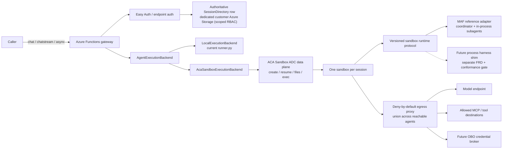

# FRD 0008 — ACA Sandbox session runtime (overview & index)

> **How to read this FRD.** This was originally a single large design for the ACA
> Sandbox session runtime. It has been **decomposed into 14 self-contained
> sub-FRDs** (`0008.1`–`0008.14`), each owning one decision area so it can be
> reviewed and iterated independently. This parent is now the **overview + index +
> master Decisions log**. Nothing was re-decided in the split.
>
> **Renumbered from 0007 → 0008.** `main` merged a separate feature —
> **multi-agent delegation** — as [FRD 0007](0007-multi-agent-delegation.md), so
> this ACA FRD moved to **0008** and the non-HTTP fast-follow moved to **FRD
> 0009** (Decision 41). §4.16 / Decisions 42–47 fold the subagent implications in;
> the subagent-compatibility decisions (42–46) are owned by sub-FRD
> [0008.13](0008.13-subagent-delegation-compat.md), while the renumber (41) and the
> subagent-integration re-review (47) are parent-owned meta decisions. The
> full pre-decomposition text remains in git history. **Status stays `In
> review`** — no product implementation may start until human sign-off is
> recorded.

## 1. Summary

Add an opt-in, session-based execution backend that runs the complete agent
harness inside one **Azure Container Apps (ACA) Sandbox** for the lifetime of an
agent session. The Azure Functions app remains the authenticated control-plane
**controller**: it resolves the authored agent, validates session ownership,
creates or resumes the sandbox, and routes a run to it. Existing chat calls stay
synchronous or streaming by default; a caller explicitly requests an asynchronous
run when work should outlive the HTTP request. A customer-owned, owner-scoped
state store maps opaque runtime session IDs to ACA sandbox resources. **In v1,
durability is best-effort via ACA auto-suspend/resume: losing the sandbox (or its
snapshot) loses the session** (accepted limitation). Mirroring completed
conversation checkpoints to external customer storage — so losing a sandbox does
*not* lose the session — is the **v2 target**, deferred here (Decisions 53–54).
**Durable Functions is not required for v1.** A coordinator's **subagents**
(multi-agent delegation, FRD 0007) run in-process inside that *same* session
sandbox — no per-specialist sandbox (see §3 and 0008.13).

## 2. The big picture, in plain language

Today the agent's "thinking loop" runs *inside* the Azure Functions Python worker,
and ACA Dynamic Sessions is only a later-bound `execute_python` *tool*. That splits
one logical turn across two compute boundaries, so a worker timeout or client
disconnect can kill an agent loop that could have kept running. This FRD proposes a
different shape: run the **whole harness** (the engine that calls the model, uses
tools/skills/MCP, and keeps memory — today that engine is the **Microsoft Agent
Framework, MAF**) inside a single isolated container (an **ACA Sandbox**) that
belongs to one authenticated session.

End to end, a request flows like this:

1. **Caller → Functions controller.** A `chat`/`chatstream` (or async) request
   arrives at the Functions app.
2. **Authenticate & authorize.** Easy Auth / endpoint auth validates the caller;
   the controller derives the session **owner** via the adaptive `OwnerContext` —
   the Easy Auth user when one is resolved, otherwise the function-app identity
   (Decision 55).
3. **Authoritative state-row lookup.** The controller reads a *customer-owned* state
   store whose row is written only by the controller managed identity (scoped RBAC,
   Shared Key disabled), so the row is authoritative by construction. Routing is
   validated by a monotonic generation on the row plus a live sandbox manifest
   cross-check — the row, the live ACA resource, and the live manifest must agree.
4. **Create or resume the sandbox.** If none exists, create one on the generic
   stdlib-only bootstrap harness image and deliver the **controller-captured
   script-root content** into it (the epoch digest is computed over that captured
   zip — code + vendored `.python_packages` — not the Run-From-Package deploy
   artifact; Decisions 68, 69) with deny-by-default egress; if suspended, resume
   and re-verify readiness.
5. **Run journal.** The controller submits a run over the authenticated ACA data
   plane and reads status/events/result from an on-disk journal (no anonymous
   port). If the coordinator delegates to **subagents**, those specialists run
   *in-process in this same sandbox* — delegation opens no new sandbox.
6. **Response.** Sync waits (capped at 180 s) and returns today's shape; async
   returns `202` with run-management URLs. **In v1, durability is best-effort via
   ACA auto-suspend/resume** — losing the sandbox/snapshot loses the session.
   Mirroring completed turns to external customer storage (so the session survives
   losing the sandbox) is the **v2 target**, deferred here (Decisions 53–54).

Four assumptions are qualified up front and carried into the sub-FRDs: egress
policy reduces but does not remove data-classification needs (0008.9); a managed
identity is **not** user OBO (0008.9); in **v1** the ACA auto-suspend/resume
snapshot is the *best-effort* durability boundary (losing it loses the session),
with "a snapshot is never the correctness record" reserved as the **v2 target**
once the external mirror lands (0008.8, Decisions 53–54); and **ACA Sandboxes is a
preview dependency**, so the backend stays experimental and opt-in (0008.1, 0008.5).

## 3. Sub-FRD index

Each sub-FRD is written for a reader with zero prior context: a plain-language
intro, the decisions it owns (restated simply), the alternatives considered and
why the choice won, an honest critique with reconsider-triggers, and an "open
questions / iterate here" section.

| Sub-FRD | Scope (one line) | Decisions owned |
| --- | --- | --- |
| [0008.1](0008.1-execution-backend-and-controller.md) — Execution backend & "Functions as controller" | The provider-neutral `AgentExecutionBackend` seam and the Functions-app-as-authenticated-controller model; `in_process` default vs `aca_sandbox`. | 1, 2, 12, 13 |
| [0008.2](0008.2-session-identity-ownership-concurrency.md) — Session identity, ownership & concurrency | Opaque `session_id` as a lookup key (not authz); ownership via the standard Functions auth gate (function keys or Easy Auth) with an adaptive `OwnerContext` (app is the trust boundary); one active run per session. | 6, 15, 55 |
| [0008.3](0008.3-state-store-and-tamper-evident-trust.md) — State store & tamper-evident trust | Dedicated customer state account; authoritative controller-written state row (scoped RBAC, Shared Key disabled); monotonic generation + live manifest cross-check; deletable history. | 5, 20, 31, 32, 33, 39, 51, 52 |
| [0008.4](0008.4-resource-residency-and-provisioning.md) — Resource residency & provisioning | Customer subscription; hard 1:1 one Sandbox Group per app/env (v1); customer picks the group's region and the runtime co-locates every session sandbox there (single-region v1); customer IaC vs runtime data-plane split (customer owns standing-IaC teardown; runtime deletes only session sandboxes); v1 sample IaC, post-v1 composite quickstart. | 30, 65 |
| [0008.5](0008.5-controller-sandbox-transport-and-protocol.md) — Controller↔sandbox transport & protocol | ADC file/exec journal (run/status/events/cancel), idempotency, live-spike evidence, 100-concurrent gate; no anonymous ingress. | 7, 23, 26, 29 |
| [0008.6](0008.6-sandbox-packaging-image-and-content.md) — Packaging | Packaging: reuse Functions deploy artifact (Run-From-Package) for v1; committed image deferred; no bespoke signed package; stdlib-only bootstrap image runs all deps from the customer's captured `.python_packages` (image does not bake MAF/runtime). | 8, 17, 48, 68, 69 |
| [0008.7](0008.7-harness-compatibility-and-conformance.md) — Harness compatibility & conformance | MAF-only v1; three contracts (wire protocol / library adapter / process shim); capability negotiation; golden-trace conformance. | 34, 35, 36, 37, 49, 50 |
| [0008.8](0008.8-snapshot-suspend-and-durability.md) — Snapshot, auto-suspend & durability | Auto-suspend/resume + snapshot; disable while active; resume-readiness handshake. **v1:** snapshot is the best-effort source of truth (sandbox/snapshot loss ⇒ session lost). **v2 target:** owner-scoped external mirror makes snapshots never the correctness record. | 9, 18, 27, 28, 53, 54 |
| [0008.9](0008.9-network-egress-and-obo.md) — Network, egress & credentials/OBO | Deny-by-default egress at create; proxy credential injection; managed identity ≠ user OBO; reserved external broker seam. v1 assigns the app's user-assigned MI to the Sandbox Group (Identity Proxy serves it in-sandbox; no 1P onboarding); HOBOv2 same-MI delegation is the advanced/deferred option (Decisions 56, 57). **Superseded for v1 by Decision 66: the sandbox is identity-less (egress-proxy credential injection; no MI/token inside).** | 10, 11, 16, 56, 57, 66 |
| [0008.10](0008.10-authoring-surface-and-config.md) — Authoring surface & config | Locked authoring surface: `provider` + `harness: maf` + `aca_sandbox.sandbox_group_resource_id` (non-secret identifiers); a startup validation matrix (8 fail-closed conditions); a three-class credential model. *(Owns no decision number.)* | — |
| [0008.11](0008.11-http-api-sync-async-streaming.md) — HTTP API: sync / async / streaming | Sync/stream default, explicit `Prefer: respond-async`, run-management routes, 180 s sync cap, chunked streaming. | 3, 19, 25 |
| [0008.12](0008.12-lifecycle-failure-and-reconciler.md) — Lifecycle, failure & reconciler | Session/run state machines, failure table, and the "no Durable Functions in v1" rationale; minimal periodic reconciler/reaper backstop + opportunistic fast-paths; v1 no per-owner quota; idle-based retention; lost sandbox ⇒ tombstone/410 in v1 (never a generation bump), while v2's external mirror may enable a state-preserving rebuild onto a new instance = a generation bump (not a tombstone; semantics deferred); sessions never span a content redeploy (drain-on-digest-change → 410; v1). | 4, 21, 22, 24, 58–64, 67, 70 |
| [0008.13](0008.13-subagent-delegation-compat.md) — Subagent (multi-agent delegation) compatibility | How FRD 0007 subagents run in the single session sandbox: co-location, catalog/package scope, egress union, negotiated capability, reserved handoff state. | 42, 43, 44, 45, 46 |
| [0008.14](0008.14-dynamic-workflows-aca-compat.md) — Dynamic Workflows compatibility | Analysis only (lands no binding decision): Dynamic Workflows' Durable-orchestrator mechanism is incompatible with the v1 single-sandbox model (no Functions Host / Durable substrate / egress path in-sandbox); recommends keeping 0008.7's Decision 36 fail-closed gate; leading future candidate = controller-side orchestration + sandbox-side proxy tools, deferred to a future implementation FRD. *(Finalized.)* | — (analysis) |

> **Related / not in scope here.**
> - **Multi-agent delegation** is its own merged feature, [FRD 0007](0007-multi-agent-delegation.md); this backend's *compatibility* with it is 0008.13.
> - Non-HTTP **trigger** sessions are a separate planned feature, **FRD 0009**
>   (Decision 38). FRD 0008 reserves the owner/session-key extension seams (see
>   0008.2) but does not implement trigger sessions.

## 4. Goals / Non-goals

**Goals**

- Run the complete agent harness inside an ACA Sandbox: model calls, reasoning
  loop, skills, MCP clients, user tools, code execution, and working files.
- Allocate one sandbox to one authenticated agent session and reuse it across
  turns until the retention policy expires.
- Expire sessions by **idle-based retention** (no absolute creation-time TTL): a
  group-level lifecycle policy sets the default (~5 min auto-suspend / ~24 h idle
  reclaim), overridable per-sandbox at create from the app-level
  `session_runtime.retention` config (live in v1; per-agent `.agent.md` override
  deferred to v2) (Decision 64).
- Keep Azure Functions as a lightweight but security-critical controller for
  endpoint auth, authorization, session ownership, lifecycle routing, and response
  projection.
- Preserve current synchronous `/chat` and `/chatstream` behavior by default; add
  an explicit async run mode with status/event/result/cancel.
- Make every sandbox-side run addressable by an opaque `run_id`, even for sync
  callers.
- Persist owner-scoped control metadata in customer-owned storage; never require a
  runtime-team-owned cross-customer service. Require a dedicated customer-owned
  state account in production; allow `AzureWebJobsStorage` only for local/preview.
- **(v2 goal)** Mirror completed conversation checkpoints to owner-scoped external
  customer storage so losing a sandbox does not lose the session. **v1 is
  best-effort durability via ACA auto-suspend/resume** and does not ship this
  mirror (Decisions 53–54).
- Treat every stored session-to-sandbox pointer as untrusted until the
  authoritative row (controller-written), live ACA resource, and live manifest
  agree.
- Enforce one active run per session in v1.
- Deliver agent content to the sandbox by having the **controller capture `/app`
  from its own local script root, zip it (code + vendored `.python_packages`), and
  deliver it over the file transport** — the sandbox is **identity-less** (no
  managed identity read inside; Decisions 66, 68); the committed ACA image
  (**Path 2**) is deferred (Decision 48). Ship
  only the MAF reference adapter in v1 and prove parity first.
- Host **FRD 0007 multi-agent delegation (subagents)** inside the single session
  sandbox without regressions: co-located specialists, catalog/package spanning all
  reachable agents, union egress, and delegation as a negotiated harness
  capability (see 0008.13).
- Apply deny-by-default egress before untrusted work starts; support proxy-side
  credential injection.
- Keep the in-process runner as the default backend.
- Govern persistent ACA session ownership with the **standard Azure Functions auth
  gate** (function keys **or** App Service Authentication / Easy Auth) — the
  controller adds no second identity layer; the **app is the trust boundary**
  (function-key callers can create/own persistent sessions), with per-user
  ownership when Easy Auth resolves a user (adaptive `OwnerContext`; see 0008.2).
- Bound synchronous HTTP waits below the Functions 230 s ceiling; longer work uses
  async.
- Reconcile terminal checkpoints and expired/abandoned sessions with a **minimal
  periodic reconciler/reaper** (plain timer, configurable ~1h default — not
  Durable) as a guaranteed backstop, augmented by opportunistic fast-paths
  (after-create, reap-on-capacity-failure, controller fast-path) and client
  polling, so crashed/idle sandboxes and snapshots do not leak. Cadence tightens to
  ~1/min in v2 solely for the checkpoint-mirror SLO (Decisions 22, 58, 59, 63).
- Place one Sandbox Group per Function App/environment in the customer subscription;
  customer tooling creates ARM/RBAC, the runtime creates only session sandboxes.
- Reserve an extensible owner contract for the separate non-HTTP trigger-session
  fast follow (FRD 0009) without implementing it here.

**Non-goals**

- Making Durable Functions/Durable Task Scheduler mandatory for sandbox sessions.
- Modifying the Azure Functions Host or Python worker protocol.
- Treating an ACA Sandbox as a public client-facing endpoint, or using anonymous
  sandbox ingress as the controller channel.
- Moving non-HTTP trigger execution to persistent sandboxes in v1 (reserved for
  FRD 0009).
- Per-owner fairness quota in v1 — a single owner may consume the app's full ACA
  capacity; aggregate capacity is bounded by ACA + reap-on-capacity-failure, and
  per-owner fairness is a v2 optimization (Decision 61).
- Exactly-once execution of external side effects; automatic retry of a failed
  agent loop.
- Claiming native user OBO; only a credential-broker extension point is reserved.
- Shipping or licensing a non-MAF harness adapter in this FRD.
- Implementing multi-agent **handoff** (cross-turn control transfer with shared
  context); its durable-state needs are only *reserved* in the checkpoint schema
  (Decision 46, 0008.13).
- **External-storage durability mirroring in v1** (owner-scoped external
  transcript/checkpoint mirror) — deferred to v2 (Decision 54). v1 relies on
  ACA auto-suspend/resume as a best-effort durability boundary and **accepts
  session loss on sandbox/snapshot loss** (Decision 53).
- Installing harness dependencies from the internet at session creation.
- Replacing Dynamic Workflows.

## 5. Master Decisions log

> **Append-only, preserved from the pre-decomposition FRD.** The **Owner** column
> maps each decision to the sub-FRD that now re-expresses it in detail.
> Meta/scope/review decisions (14, 38, 40, 41, 47) are owned by this parent
> overview. Rows 41–47 were added when `main` merged multi-agent delegation as FRD
> 0007 and this FRD was renumbered to 0008: 41 is the renumber, 42–46 the subagent
> compatibility (owned by 0008.13), and 47 the independent subagent-integration
> re-review milestone.

| # | Decision | Options considered | Choice | Decided by | Date | Owner |
| - | -------- | ------------------ | ------ | ---------- | ---- | ----- |
| 1 | Agent execution location | MAF brain in Functions + sandbox tools / full harness in sandbox / direct Function Host integration | Full harness in one ACA Sandbox per session | Human | 2026-07-20 | 0008.1 |
| 2 | Functions role | Agent runtime / dumb byte proxy / authenticated session controller | Authenticated session controller for ownership, lifecycle, and routing | Human + Agent | 2026-07-20 | 0008.1 |
| 3 | Public run behavior | Async-only / sync-only / sync by default with explicit async | Preserve sync/streaming defaults; `Prefer: respond-async` opts into long-running execution | Human | 2026-07-20 | 0008.11 |
| 4 | Durable Functions dependency | Required for every run / optional future backend / no durable execution ever | Not required for v1; reconsider for cross-session orchestration or managed retry needs | Human | 2026-07-20 | 0008.12 |
| 5 | Session directory ownership | Runtime-team SaaS store / customer storage / sandbox only | Customer-owned storage; default to `AzureWebJobsStorage`, allow a dedicated account | Human | 2026-07-20 | 0008.3 |
| 6 | Per-session concurrency | Unlimited / queue turns / one active run | One active run; concurrent submission returns `409` | Human + Agent | 2026-07-20 | 0008.2 |
| 7 | Controller transport | Anonymous sandbox HTTP port / ADC file+exec APIs / mandatory private network tunnel | ADC data-plane file+exec journal for v1; preserve a transport abstraction | Agent | 2026-07-20 | 0008.5 |
| 8 | Runtime packaging | Install/clone at session start / immutable prebuilt disk / mutable shared volume | Immutable prebuilt disk with protocol + manifest verification | Agent | 2026-07-20 | 0008.6 |
| 9 | Snapshot role | Sole session state / cache only / no snapshots | Resume optimization plus disk checkpoint; never the sole ownership/correctness record | Agent | 2026-07-20 | 0008.8 |
| 10 | Egress posture | Default allow then tighten / default deny after bootstrap / default deny from create | Full-inspection, default-deny policy active before harness execution | Agent | 2026-07-20 | 0008.9 |
| 11 | OBO interpretation | Managed identity equals OBO / pass user token into sandbox / external broker | Managed identity is not OBO; reserve an external broker that keeps delegated tokens outside sandbox | Agent | 2026-07-20 | 0008.9 |
| 12 | Existing execution behavior | Replace current runner / opt-in backend | `in_process` remains default; ACA backend is experimental and explicit | Agent | 2026-07-20 | 0008.1 |
| 13 | Direct Functions Host integration | P0 / parallel implementation / defer | Defer until runtime-level contract is proven and host-team investment is justified | Human + Agent | 2026-07-20 | 0008.1 |
| 14 | Independent architecture review | Approve as-is / reject direction / approve decomposition but block finalization | Keep the controller/backend decomposition; block finalization on transport evidence, sync cap, owner-scoped durability, and explicit cleanup ownership | Agent reviewer | 2026-07-20 | 0008 (parent) |
| 15 | Persistent-session authentication | Function-key app trust / signed session capability / Entra ownership | Require Entra for ACA persistent sessions in v1; keep function-key endpoints on the local backend | Agent reviewer | 2026-07-20 | 0008.2 |
| 16 | OBO milestone scope | Claim managed identity / build broker in v1 / reserve broker seam | Reserve the external broker seam and defer implementation until the base sandbox transport is proven | Agent reviewer | 2026-07-20 | 0008.9 |
| 17 | Artifact delivery (revises #8) | Bake project into every disk / signed content package on generic disk / install or clone at session start | Generic immutable harness disk plus signed, digest-addressed content package and offline dependencies | Agent reviewer | 2026-07-20 | 0008.6 |
| 18 | Conversation durability | Sandbox disk only / sandbox snapshot only / owner-scoped external mirror | Mirror each completed transcript delta and bounded checkpoint to owner-scoped customer Blob Storage | Agent reviewer | 2026-07-20 | 0008.8 |
| 19 | Synchronous HTTP budget | Use authored timeout up to 900s / platform maximum / bounded controller cap | Cap total sandbox-backed HTTP wait at 180s; longer work requires `respond-async` | Agent reviewer | 2026-07-20 | 0008.11 |
| 20 | Control-state storage | Block blobs / Azure Tables / Durable Entity | Azure Tables for queryable ETag-controlled session/run records; Blob Storage for transcript/checkpoint archives | Agent | 2026-07-20 | 0008.3 |
| 21 | Controller coordination (reaffirms #4) | Mandatory Durable / minimal Table state machine / no external run records | Keep a minimal no-retry Table state machine because ADC owns the live process; revisit Durable before adding queues, retries, fan-out, or compensation | Agent | 2026-07-20 | 0008.12 |
| 22 | Expired-session cleanup | Opportunistic next request / Durable eternal orchestration / timer reconciler | Register a timer-triggered reconciler/reaper with the ACA backend | Agent reviewer | 2026-07-20 | 0008.12 |
| 23 | File/exec transport confidence (qualifies #7) | Finalize from samples / live spike / switch immediately to public ingress | Official samples establish detached exec and the 300s SDK limit, but a live spike is required before finalizing file/exec; anonymous ingress is forbidden | Agent reviewer | 2026-07-20 | 0008.5 |
| 24 | Async checkpoint mirror cadence | On-demand only / continuous sandbox write / periodic controller reconciliation | Run reconciliation every minute with a two-minute p95 terminal-checkpoint mirror SLO; keep storage credentials out of the sandbox | Agent | 2026-07-20 | 0008.12 |
| 25 | Experimental v1 streaming guarantee | Token-level parity / replayable chunks / disable streaming | Accept replayable chunks with at most two-second p95 visibility; preserve event semantics and upgrade transport later for token-level latency | Human | 2026-07-20 | 0008.11 |
| 26 | Live file/exec functional gate | Approve from documentation / require authenticated ingress / execute a preview spike | Spike with SDK `0.1.0b3` passed create, 4 MiB file roundtrip, detached launch, 1.139s p95 events, idempotency, 1.299s cancel, and cleanup; retain file/exec for v1 | Human + Agent | 2026-07-20 | 0008.5 |
| 27 | Active-run lifecycle after spike | Rely on idle timeout / heartbeat / disable auto-suspend while active | Disable auto-suspend before accepting a run; watchdog bounds execution; controller or one-minute reconciler restores policy after terminal state | Agent | 2026-07-20 | 0008.8 |
| 28 | Resume readiness after spike | Trust `get().state` / retry operations only / operation + manifest handshake | Treat file/exec response as authoritative and verify protocol/session manifest after resume because state reads can lag the data plane | Agent | 2026-07-20 | 0008.8 |
| 29 | Experimental v1 concurrency target | 25 / 100 / 1,000 active runs per Function App/Sandbox Group | Design and validate for 100 concurrent active runs | Human | 2026-07-20 | 0008.5 |
| 30 | Sandbox resource residency | Customer subscription / Microsoft central multi-tenant subscription / delegated customer deployment | One Sandbox Group per Function App/environment in the customer subscription for v1; long-term automation still deploys there | Agent reviewers | 2026-07-20 | 0008.4 |
| 31 | Production state account (revises #5) | Reuse `AzureWebJobsStorage` / dedicated customer account / runtime-team service | Require dedicated `AzureFunctionsAgentsStateStorage` in production; reuse `AzureWebJobsStorage` only for local/dev and explicit preview trials | Agent reviewers | 2026-07-20 | 0008.3 |
| 32 | Session-pointer tamper evidence | Trust ETag+RBAC / live manifest only / signed binding + immutable transition log + live manifest | Sign routing-critical bindings with a non-exportable customer Key Vault key, verify locally, and require Table/log/manifest agreement | Agent reviewers | 2026-07-20 | 0008.3 |
| 33 | State-resource authorization | Shared key / account-wide data roles / Entra roles at table/container scope | Disable Shared Key; grant Function MI Table Data Contributor at the state table and Blob Data Contributor at the state container; sandbox identity gets no state access | Agent reviewers | 2026-07-20 | 0008.3 |
| 34 | V1 harness | Switch directly to a non-MAF harness / support arbitrary image adapter / MAF parity first | Ship only MAF inside ACA for v1; compute relocation and harness replacement are separate changes | Agent reviewers | 2026-07-20 | 0008.7 |
| 35 | Harness integration layers | One generic Python adapter / runtime wire protocol + library adapter + process shim | Split harness-neutral runtime protocol, library adapters, and CLI/process shims; negotiate capabilities independently of protocol version | Agent reviewers | 2026-07-20 | 0008.7 |
| 36 | Unsupported MAF capabilities on ACA v1 | Silent fallback / nested Dynamic Sessions and remote workflow callbacks / fail startup | Fail startup for `workflows.enabled` or Dynamic Sessions code-interpreter use with ACA until explicit compatibility designs land | Agent reviewers | 2026-07-20 | 0008.7 |
| 37 | Non-MAF harness support | Implied by custom image / included in v1 / separate reviewed adapters | Separate FRDs and conformance gates; no support claim from FRD 0008 | Agent reviewers | 2026-07-20 | 0008.7 |
| 38 | Non-HTTP trigger sessions | Expand FRD 0008 / permanent non-goal / separate fast-follow FRD | Author FRD 0009 and reserve extensible owner/session-key contracts in FRD 0008 | Agent reviewers | 2026-07-20 | 0008 (parent) → FRD 0009 |
| 39 | Binding-log immutability scope | One mixed container / version-level policy / dedicated immutable bindings container | Separate immutable binding-log and deletable history/checkpoint containers so tamper evidence does not block data deletion | Agent reviewer | 2026-07-20 | 0008.3 |
| 40 | Final deep-dive architecture review | Keep blocked / ready for human approval | READY with no remaining blocker after storage trust, residency, harness compatibility, non-HTTP reservations, immutability, and public-disclosure review | Agent reviewer | 2026-07-20 | 0008 (parent) |
| 41 | Renumber after main collision | Keep 0007 / renumber to 0008 | main merged multi-agent delegation as FRD 0007; this FRD becomes 0008 and the non-HTTP fast-follow becomes 0009 | Human + Agent | 2026-07-21 | 0008 (parent) |
| 42 | Subagent execution locus | Separate sandbox per specialist / shared session sandbox | All delegated specialists run in the session's single sandbox; delegation opens no per-specialist sandbox | Agent | 2026-07-21 | 0008.13 |
| 43 | Content-package / catalog scope for delegation | Entry agent only / all reachable agents | The signed package and in-sandbox AgentCatalog include the coordinator and every referenced specialist | Agent | 2026-07-21 | 0008.13 |
| 44 | Egress scope with delegation | Per-agent policy / union across coordinator + reachable specialists | Deploy the union of allow-list destinations from the catalog; deny-by-default preserved | Agent | 2026-07-21 | 0008.13 |
| 45 | Delegation as harness capability | Assume every harness supports it / negotiated capability with fail-closed | Treat subagent delegation as a negotiated harness capability; MAF supports it; fail closed otherwise; add a delegation conformance trace | Agent | 2026-07-21 | 0008.13 |
| 46 | Future handoff session state | Ignore now / reserve checkpoint-schema room | Reserve session checkpoint/manifest room for future handoff active-participant + shared context; out of v1 scope | Agent | 2026-07-21 | 0008.13 (xref 0008.8) |
| 47 | Subagent-integration re-review | Keep pending / independent re-review | READY, no blockers; folded three precision notes (capability-list wording, shared-egress trust-domain caveat, group-wide egress-policy scope) into §4.5/§4.16 | Agent reviewer | 2026-07-21 | 0008 (parent) |
| 48 | Content-layer packaging mechanics (refines #17, aka 17-R) | Bespoke signed content package / reuse Functions Run-From-Package / committed disk image | v1 = reuse the Functions Run-From-Package deploy artifact (Path 1); ACA committed image (Path 2) documented but deferred; intent/security of #17 unchanged | Human | 2026-07-22 | 0008.6 |
| 49 | Harness protocol/capability versioning (refines #35) | Separate capability version / single joint protocol_version for v1 | v1 uses ONE joint protocol_version covering wire framing AND the capability set; independent capability versioning deferred until a real need. Capability governance: a total feature->capability map so unknown features fail closed; no capability advertised "supported" without a conformance trace (consistent with #45) | Human | 2026-07-22 | 0008.7 |
| 50 | execute_python rejection rationale (refines #36) | Pending a compatibility design / superseded by native execution | The nested Dynamic Sessions execute_python rejection is now rationalized as SUPERSEDED by native sandbox code execution (the sandbox is the executor); the startup rejection/action is UNCHANGED | Human | 2026-07-22 | 0008.7 |
| 51 | State-row trust model (supersedes #32) | Per-binding Key Vault signing / scoped-RBAC-authoritative row | Drop per-binding Key Vault signing. The state row is authoritative-by-construction: Decision 33 scoped RBAC + disabled Shared Key make the controller managed identity the sole writer. Routing is validated by a monotonic generation on the row plus a live sandbox manifest cross-check (authenticity from ACA data-plane isolation). Rationale: a design that accepts Function Keys as authz need not also mandate non-exportable per-binding signatures; scoped RBAC + live manifest already give the anti-confused-deputy property within the customer's own subscription. | Human | 2026-07-22 | 0008.3 |
| 52 | Binding-generation store (supersedes #39) | Immutable WORM binding-log container / generation on the Table row | No immutable WORM log in v1; the monotonic generation lives on the ETag-guarded Table row. WORM reserved as an additive future option. | Human | 2026-07-22 | 0008.3 |
| 53 | Snapshot durability boundary (refines #9) | snapshot never correctness record (mirror-backed) / snapshot as v1 best-effort SoT / synchronous external mirror | v1 = ACA auto-suspend/resume snapshot is the best-effort source of truth; the '#9 snapshot is never the correctness record' principle reverts to a v2 TARGET (restored once the external mirror lands). v1 sandbox/snapshot loss ⇒ session lost (accepted limitation). Watchdog + ensure_ready + client/token recreation (Decisions 27/28) retained, scoped to v1. | Human | 2026-07-22 | 0008.8 |
| 54 | External durability mirror deferral (defers #18 to v2) | owner-scoped external Blob transcript/checkpoint mirror in v1 / defer mirror to v2 | Decision 18's external transcript/checkpoint mirror is DEFERRED to v2; v1 ships without it. Reintroducing the mirror in v2 restores the #9 'never the correctness record' guarantee. | Human | 2026-07-22 | 0008.8 |
| 55 | Ownership auth model (revises #15) | require Entra-authenticated ownership for persistent ACA sessions / reuse the standard Functions auth gate (function keys OR Easy Auth) | Reuse the standard Azure Functions auth gate — function keys OR App Service Authentication (Easy Auth); the controller adds no second identity layer. Adaptive discriminated OwnerContext: entra_user (per-user when Easy Auth resolves a user) \| function_app (app owns the session; binds to the FUNCTION APP IDENTITY, not a key/key-name) \| trigger_binding (reserved for 0009). Function-key callers CAN create/own persistent ACA sessions; the APP is the trust boundary (runtime does not separate end-users behind a shared key, as in Functions today). Ownership stays controller-side and never crosses the AgentExecutionBackend seam — only a hashed owner label reaches sandbox/storage at provisioning. Owner-hash = versioned canonicalization (owner_hash_version on the stored binding), recompute-under-stored-version, no eager migration. | Human | 2026-07-22 | 0008.2 |
| 56 | Sandbox identity model | prefer proxy-injected MI only / give the sandbox its own separate identity / delegate the SAME MI into the sandbox (HOBOv2) | Promote carrying the same managed identity into the sandbox via HOBOv2 (delegated MI + Identity Proxy) so it runs with the controller's auth context; proxy-injection (MI Transform, then static secret) is complementary/fallback; no MI (function-key/app-scoped) ⇒ identity-less sandbox bounded by egress. Reinforces Decisions 11/16 (still MI ≠ user OBO). CAVEAT: HOBOv2 is first-party-only and depends on ADC backing-resource-provider onboarding (coupled to Decision 13); if unavailable, v1 fallback = assign the same user-assigned MI to the Sandbox Group (same identity, no HOBOv2 delegation). | Human | 2026-07-23 | 0008.9 |
| 57 | Sandbox identity v1 mechanism (refines #56) | plain user-assigned-MI assignment to the Sandbox Group / HOBOv2 cross-resource delegation (delegatedResources + mixed-mode lifecycle none/main/all gating) | v1 = plain assignment of the app's user-assigned managed identity to the Sandbox Group; the ADC Identity Proxy serves it in-sandbox as usual when no cross-resource delegation is configured — NO first-party backing-resource-provider onboarding required for v1 (this is the v1 default, not a fallback). HOBOv2 (delegatedResources cross-resource delegation + mixed-mode lifecycle gating) is the ADVANCED, DEFERRED option, needed only if the agent is modeled as its own Azure resource (which would require 1P onboarding). This DECOUPLES Decision 56 from Decision 13 (Direct Host, deferred) — v1 identity no longer depends on HOBOv2 or 1P onboarding. Decisions 10/11/16 unchanged (MI ≠ user OBO). | Human | 2026-07-23 | 0008.9 |
| 58 | Expired-session cleanup — reconciler shape (refines #22) | Durable eternal orchestration / opportunistic-only (no timer) / minimal periodic reconciler + fast-paths | Minimal periodic reconciler/reaper (plain timer, ~1h configurable, adaptive) as the guaranteed backstop; opportunistic fast-paths (after-create, reap-on-capacity-failure, controller fast-path) + client poll handle the common case; Decision 4 (no Durable) intact | Human | 2026-07-24 | 0008.12 |
| 59 | Reconciler scale/backlog (Q1) | periodic hot loop / opportunistic-only / low-frequency backstop | Low-frequency adaptive backstop — cheap due-work query, no hot loop in v1; the tight ~1/min cadence is v2 mirror-only (refines #24: its "run reconciliation every minute" SLO is v2-only) | Agent | 2026-07-24 | 0008.12 |
| 60 | No automatic run retry (Q3) | framework auto-retry / caller resubmit | No auto-retry; caller resubmits with Idempotency-Key; concurrent run = flat 409, cancel-then-submit escape; no supersede/queue in v1 | Agent | 2026-07-24 | 0008.12 |
| 61 | Active-session quota (Q4) | per-owner cap / aggregate-only / no runtime counter | v1 = no caps (aggregate bounded by ACA live capacity + reap-on-capacity-failure); per-owner fairness = v2 | Agent | 2026-07-24 | 0008.12 |
| 62 | Lost-sandbox recovery / 410 (Q5) | rebuild-from-checkpoint in v1 / status-only durability | v1 = status durable (Tables), content best-effort (sandbox-only), sandbox gone → 410; rebuild-from-checkpoint = v2 (with the external mirror) | Agent | 2026-07-24 | 0008.12 |
| 63 | Auto-suspend restore & reclaim mechanism | harness self-restore / sandbox→controller callback / ACA TTL-disable / periodic reconciler | Periodic reconciler is the irreducible floor (crash-before-signal); self-restore + callback rejected (privilege escalation / pull-only transport / cannot catch a crash); self-suspend-request + long interval = future/optional; carries the idle-policy-repair re-arm duty that 0008.8 D27 leans on (xref 0008.8, dependency RESOLVED cd0f619) | Agent | 2026-07-24 | 0008.12 |
| 64 | Session retention model | fixed TTL / group-only / idle-based hybrid | Idle-based hybrid: group default (~5 min suspend / ~24 h reclaim) < app-level session_runtime.retention (live v1) < per-agent .agent.md (v2); no absolute creation-time TTL | Human | 2026-07-24 | 0008.12 (xref 0008.10, 0008.4) |
| 65 | Resource residency & provisioning boundary (refines #30) | Microsoft-operated provisioning service / always-on cross-tenant identity / customer-run IaC under the customer's own credentials | Customer-run Bicep/ARM via `az deployment` under the customer's own credentials (interactive az login or their CI/CD federated identity / service principal) — no Microsoft-operated identity, nothing cross-tenant. Four #30 scope clarifications: (1) group capacity uses ACA Sandboxes preview DEFAULT quotas (the 100-concurrent target is validated by 0008.5's live-spike gate, not residency); (2) hard 1:1 — one Sandbox Group per Function App/environment for v1 (revisitable later); (3) the customer picks the group's region and the runtime co-locates every session sandbox in that region (single-region v1; DR is a customer IaC concern); (4) the customer owns standing-IaC teardown (symmetric with creation), and the runtime deletes only individual session sandboxes. The generic harness image is authored/built/published by the runtime project and only referenced (digest-pinned) by customer IaC. v1 ships documented, composable SAMPLE IaC; the one-command composite "quickstart" module is the post-v1 DX target. | Human | 2026-07-22 | 0008.4 |
| 66 | Sandbox identity — v1 identity-less (supersedes #56/#57 v1 mechanism) | carry app UAMI into the sandbox (#56/#57) / dedicated sandbox workload UAMI / identity-less sandbox | v1 sandbox is IDENTITY-LESS — no managed identity or AAD token inside, ever. Outbound auth is via ADC egress-proxy credential injection (primary mechanism). The controller delivers the content package into the sandbox, so the sandbox needs no storage access. Supersedes the v1 mechanism of #56/#57 (carrying the app UAMI into the sandbox); MI-carry and HOBOv2 are deferred to a future version. Reinforces 0008.3 (identity-less ⇒ the sandbox cannot write state; the controller MI stays the sole writer) and fixes the function-key package-download gap. | Human | 2026-07-24 | 0008.9 (xref 0008.3, 0008.6) |
| 67 | Sandbox-loss vs harness-crash recovery (refines #9/#62; v1 durability) | continue/reuse the session on any interruption / tombstone on any interruption / distinguish loss vs crash | Distinguish two cases. (a) Sandbox/snapshot LOST ⇒ session TOMBSTONED; the same session_id returns 410 Gone; the client creates a new session (v1 accepted limitation — no external mirror, context is gone). (b) Harness CRASH with the sandbox/disk INTACT ⇒ the run is terminal Abandoned but the session CONTINUES; a resubmit starts a fresh run on the SAME sandbox, resuming from the last COMMITTED checkpoint. Adds a v1 requirement: atomic per-turn commit of conversation history + working files (a crash never yields corrupted-state resume). Case (b) reuses the SAME sandbox instance and SAME generation; the generation advances ONLY on a state-preserving rebind to a DIFFERENT instance (a v2 capability, not a tombstone), never on a crash, and a true loss (case a) tombstones without ever bumping the generation. The self-heal (0008.12) language applies to case (b); the new-generation/rebind path (0008.2) is v2-only. | Human | 2026-07-24 | 0008.12 (xref 0008.8, 0008.2, 0008.5) |
| 68 | Content-layer capture from the controller's disk (refines #48/#17) | sandbox reads the RFP zip from customer storage via MI / controller locates the per-plan Blob artifact / controller captures its own local script root | The controller captures the customer app content from ITS OWN local script root (wwwroot / Flex equivalent — where the Functions worker already runs it, on every SKU), zips it (code + the vendored .python_packages), computes SHA-256, and delivers it into the sandbox via the file transport (folds with #66). This dissolves the per-plan artifact-location matrix, the customer-Blob assumption, and any sandbox storage access. ABI is guaranteed by construction: the runtime-authored harness image is Linux + Python 3.13/3.14, and v1 requires the Functions app to be Linux Python 3.13/3.14. The customer /app/.python_packages is authoritative for the agent. (Superseded by Decision 69: the harness runtime is NOT a separate outside-/app environment — the runtime + MAF are ordinary entries in that same captured `.python_packages`, a single pip-resolved env, and the image bakes no MAF/runtime.) Redeploy applies to new sessions; live sessions keep their pinned captured digest. | Human | 2026-07-24 | 0008.6 (xref 0008.9) |
| 69 | Sandbox harness image = stdlib-only bootstrap; run from captured .python_packages (refines #68/#17; supersedes the bake-MAF framing) | bake MAF + the runtime into the generic image / stdlib-only bootstrap image that runs all deps from the customer's captured .python_packages | The generic harness image does NOT bake MAF or our runtime — it carries only the Azure Functions Python base + a STDLIB-ONLY bootstrap/entrypoint. ALL Python deps (`azurefunctions-agents-runtime` + MAF + the customer's tool deps) come from the customer's captured `.python_packages`, a SINGLE pip-resolved env produced by the customer's Functions build (the runtime is itself a customer requirements.txt dependency that pulls MAF transitively). The bootstrap adds the captured tree to sys.path (via `site.addsitedir`, deliberate ordering) and runs the runtime's sandbox-harness entrypoint from that env. Consequence: harness-vs-customer dependency isolation is DROPPED as a non-issue (pip already co-resolved everything; there is exactly ONE MAF — the customer's pinned version); no MCP/A2A/venv isolation machinery in v1. Empirically validated: a stdlib-only process imported agent-framework-core 1.3 + pydantic 2.13 + jmespath and ran a trivial MAF Agent fully offline from a `pip install --target` tree (~2.2s copy + 0.35–0.70s first MAF import). ABI still guaranteed by building the image FROM the Functions Python base (compiled extensions match). | Human | 2026-07-27 | 0008.6 (xref 0008.7) |
| 70 | Sessions never span a content redeploy — drain-on-deploy (v1); supersedes per-epoch schema retention / cross-epoch compat (deferred to v2) | (a) retain per-epoch schemas + supported-version window + additive protocol for cross-deploy continuity / (b) bounded absolute session lifetime / (c) drain in-flight on a content-digest change and tombstone | Choice (c): v1 drains on a content-DIGEST change (a genuine redeploy). A request to a session whose captured content digest ≠ the controller's CURRENT content digest drains it — the in-flight run gets a short grace to finish, else is abandoned; the session is tombstoned (410 → client creates a new session); new sessions run the current epoch. Triggers on a content-digest change ONLY (NOT worker restarts/scale events that keep the same digest). Consequence: a session's controller and sandbox are ALWAYS the same epoch, so v1 needs NO per-epoch schema retention (SUPERSEDES the earlier deployment-epoch "retain old schemas / pin-and-retain" approach) and NO cross-epoch protocol-version compat/supported-window — validation is always against the current epoch; a digest-mismatch session is drained, not validated. Orphaned old sandboxes are idle-reaped (bounded by the idle-retention window). Durable session continuity ACROSS a redeploy (persist-epoch schemas + additive protocol + supported-version window) is DEFERRED to v2. Accepted v1 limitation: a genuine redeploy ends live sessions. | Human | 2026-07-27 | 0008.12 (xref 0008.7, 0008.3, 0008.9) |

*Terminology note.* "Signed package" / "signed content package" phrasing in
earlier decision rows (e.g. #17, #43) is superseded by the Run-From-Package /
digest-addressed content model (Decision 48, aka 17-R); no bespoke signed package
is used in v1. Capability-negotiation phrasing (e.g. #45) follows Decision 49's
single joint `protocol_version`.

*Reconciler-timer note.* The reconciler timer (Decisions 22, 58) and the v2
checkpoint-mirror cadence (Decision 24) are the **same** registered timer trigger
at two maturities — v1 = backstop-only at ~1 h (crash-detection,
idle-policy-repair, reclaim, Table cleanup); v2 tightens the same timer to ~1/min
and folds in the mirror job to hold the 2-min-p95 SLO. It is not a second timer.

## 6. Test plan, docs impact & rollout (cross-cutting)

The detailed test plan, docs-impact checklist, failure-behavior table, lifecycle
state machines, and rollout/compatibility notes from the pre-decomposition FRD are
preserved in git history and are being re-homed into the sub-FRD that owns each
area (e.g. failure table + state machines → 0008.12; conformance/golden traces →
0008.7; storage/security tests → 0008.3/0008.2; API tests → 0008.11; config
fixtures → 0008.10; subagent co-location/egress-union/delegation-trace → 0008.13).
Consolidated highlights:

- **Compatibility.** No `session_runtime` block ⇒ today's in-process MAF execution.
  Existing endpoint auth, request/response schemas, function names, session
  headers, and SSE event names remain compatible. ACA `/chatstream` preserves event
  semantics but allows ≤ 2 s chunk visibility in experimental v1. Persistent ACA
  session ownership is governed by the **standard Functions auth gate** (function
  keys or Easy Auth); **function-key callers can own persistent ACA sessions** and
  ownership is app-scoped — function-key surfaces are *not* restricted to the
  in-process backend (Decision 55, revises #15).
  The ACA backend is MAF-only in v1. **Multi-agent delegation (FRD 0007) is
  preserved**: a coordinator's specialists run in the same session sandbox, the
  content package/catalog spans all reachable agents, egress is the union across
  them, and delegation is a negotiated harness capability (0008.13).
- **Rollout.** The backend launches experimental and requires an explicit config
  block, ACA preview enablement, a compatible disk image, customer storage, and
  sandbox-group data-plane RBAC. Infrastructure templates (customer subscription)
  create the sandbox group, identity/RBAC, egress policy,
  production state storage (scoped RBAC, Shared Key disabled), and identities, and
  reference the runtime-authored generic **stdlib-only bootstrap** harness image
  (digest-pinned; it bakes no MAF/runtime — Decisions 65, 69). At run time the
  controller captures the customer app content from its own local script root and
  delivers it into the sandbox over the file transport (Decision 68); product code
  creates only individual sandboxes. Direct Functions Host integration is deferred.
- **Naming.** Code, docs, and telemetry keep **ACA Dynamic Sessions** (today's
  `execute_python` tool) and **ACA Sandboxes** (this session runtime) distinct, and
  add separate sandbox-provision/runtime/harness fault domains. Delegation
  telemetry (`af.delegate.*`) nests inside the sandbox and correlates to the
  controller run span.

Docs to update alongside implementation: `docs/architecture.md`,
`docs/front-matter-reference.md` (regenerated), `docs/front-matter-spec.md`,
`docs/triggers.md` (HTTP-only v1 boundary + link to FRD 0009), a new
`docs/aca-sandbox-session-runtime.md`, `docs/observability.md`, `README.md`, and
infrastructure samples.

## 7. Status & sign-off

- **Architecture review (phase 2):** Independent review approved the high-level
  controller/backend decomposition but found the original draft not finalizable.
  The revision resolved the 180-second sync cap, Entra ownership, packaging (reuse
  of the Functions Run-From-Package deploy artifact; 17-R/Decision 48),
  owner-scoped external history, idempotency indexing, cleanup owner,
  Durable-vs-Table rationale, and chunked streaming guarantee. The live ADC
  functional transport gate passed (recorded in 0008.5), and the pilot target is
  bounded at 100 concurrent active runs. A second deep-dive pass added
  customer-subscription residency, a tamper-evident customer-owned state-row trust
  model (scoped RBAC + monotonic generation + live manifest cross-check),
  dedicated production state storage, MAF-only conformance, and non-HTTP
  fast-follow reservations. Those revisions passed the final independent
  consistency/security review with no remaining blocker (Decision 40).
- **Multi-agent delegation merge (2026-07-21):** `main` merged multi-agent
  delegation as **FRD 0007**, so this FRD was renumbered **0007 → 0008** (and the
  non-HTTP fast-follow to **0009**; Decision 41). §4.16 and Decisions 41–47 fold
  the subagent implications in, owned by **0008.13**: specialists co-locate in the
  one session sandbox, the content package/catalog and egress union span all
  reachable agents, delegation is a negotiated harness capability, and future
  handoff state is reserved in the checkpoint schema. A targeted independent
  re-review of the subagent integration returned **READY** with no blockers
  (Decision 47); its three precision notes — adding "subagent delegation" to the
  §4.5 capability list, an explicit shared-egress-proxy trust-domain caveat, and
  pinning egress as one group-wide policy — are folded into §4.5/§4.16.
- **Decomposition (2026-07-21):** The finalized-for-review design was split into 14
  sub-FRDs (`0008.1`–`0008.14`) for independent iteration. No decision was changed;
  see §5 for the owner mapping. All 14 sub-FRDs and this parent are now **Finalized**
  (larohra whole-FRD sign-off, 2026-07-27); no In-review set remains — see the Final
  consolidation bullet below.
- **v1 durability re-scope (2026-07-22):** The 0008.8 deep-dive (Human sign-off)
  re-scoped v1 durability to **best-effort via ACA auto-suspend/resume**: the
  owner-scoped external transcript/checkpoint mirror (Decision 18) is **deferred to
  v2**, and the "snapshot is never the correctness record" principle (Decision 9)
  reverts to a v2 target restored once that mirror lands. v1 accepts **session loss
  on sandbox/snapshot loss** (Decisions 53–54). Earlier phase-2 review items that
  named owner-scoped external history therefore describe the v2 target, not v1.
- **Ownership auth revision (2026-07-22):** The 0008.2 deep-dive (Human sign-off)
  **revised Decision 15**: persistent ACA sessions no longer require Entra auth.
  Ownership now reuses the **standard Functions auth gate** (function keys or Easy
  Auth) with an adaptive `OwnerContext` (`entra_user` / `function_app` /
  reserved `trigger_binding`); **function-key callers can own persistent ACA
  sessions** and the **app is the trust boundary** (Decision 55). The phase-2
  "Entra ownership" item above is superseded by Decision 55.
- **Final consolidation (2026-07-24) & whole-FRD sign-off (2026-07-27):** All 14 sub-FRDs (0008.1–0008.13 plus the 0008.14 Dynamic Workflows compatibility analysis, which lands no binding decision) and this parent overview are **Finalized** as of larohra's whole-FRD human sign-off (2026-07-27), following a consolidated 5-round rubber-duck validation (gpt-5.6-sol) that came back clean across all 15 docs. Incremental reconciliation folded every sub-FRD's resolved/refined decisions into this overview — master Decisions log **47 → 70 rows** (Decisions 48–70): packaging & content delivery (17-R/48, 68, 69), harness versioning (49–50), state-row trust (51–52), durability v1/v2 split (53–54), ownership-auth reversal (55), sandbox identity (56–57, 66), lifecycle/reconciler & deployment-epoch (58–64, 67, 70), and residency/provisioning boundary (65). The transport-triad cursor-eviction naming is reconciled across 0008.1/0008.5/0008.11 (`EventCursorExpiredError` at the read_events seam ↔ `snapshot-restart`/`last-event-id-evicted` on the streaming wire). Earlier phase-2 items naming "Entra ownership" and "owner-scoped external history" are **superseded** by Decisions 55 and 53–54 respectively (see the two bullets above).
- **Human sign-off:** **Recorded — larohra, 2026-07-27.** Status is **Finalized**; the whole-FRD 5-round rubber-duck validation is complete and clean, and no further design changes are pending. Implementation may proceed per the finalized decisions.
