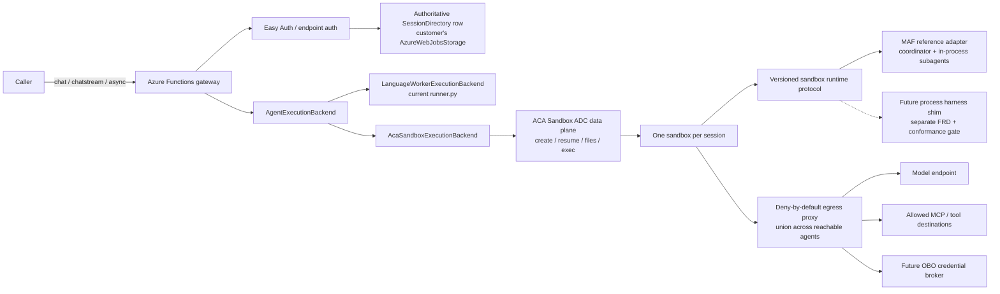

# FRD 0008 — ACA Sandbox session runtime

> **How to read this FRD.** This single, finalized record absorbs the former
> parent overview and all fourteen former 0008 sub-FRD design areas. It is the
> authoritative implementation record for the ACA Sandbox session runtime; the
> former sub-FRDs are not part of this repository tree. The detailed consolidated
> requirements later in this document preserve their contracts, state machines,
> status semantics, invariants, failure gates, and test obligations.
>
> **Renumbered from 0007 → 0008.** `main` merged a separate feature —
> **multi-agent delegation** — as [FRD 0007](0007-multi-agent-delegation.md), so
> this ACA FRD moved to **0008** and the non-HTTP fast-follow moved to **FRD
> 0009** (Decision 41). Decisions 42–47 fold the subagent implications into this
> document. **Status is `Finalized`** following the recorded whole-FRD human
> sign-off; implementation proceeds only through its approved phase plan.

## 1. Summary

Add an opt-in, session-based execution backend that runs the complete agent
harness inside one **Azure Container Apps (ACA) Sandbox** for the lifetime of an
agent session. The Azure Functions app remains the authenticated control-plane
**controller**: it resolves the authored agent, validates session ownership,
creates or resumes the sandbox, and routes a run to it. Existing chat calls stay
synchronous or streaming by default; a caller explicitly requests an asynchronous
run when work should outlive the HTTP request. A customer-owned, owner-scoped
state store maps opaque runtime session IDs to ACA sandbox resources. **In v1,
durability is best-effort via ACA auto-suspend/resume: losing the sandbox (or its
snapshot) loses the session** (accepted limitation). Mirroring completed
conversation checkpoints to external customer storage — so losing a sandbox does
*not* lose the session — is the **v2 target**, deferred here (Decisions 53–54).
**Durable Functions is not required for v1.** A coordinator's **subagents**
(multi-agent delegation, FRD 0007) run in-process inside that *same* session
sandbox — no per-specialist sandbox (see §3 and 0008.13).

## 2. The big picture, in plain language

Today the agent's "thinking loop" runs *inside* the Azure Functions Python worker,
and ACA Dynamic Sessions is only a later-bound `execute_python` *tool*. That splits
one logical turn across two compute boundaries, so a worker timeout or client
disconnect can kill an agent loop that could have kept running. This FRD proposes a
different shape: run the **whole harness** (the engine that calls the model, uses
tools/skills/MCP, and keeps memory — today that engine is the **Microsoft Agent
Framework, MAF**) inside a single isolated container (an **ACA Sandbox**) that
belongs to one authenticated session.

End to end, a request flows like this:

1. **Caller → Functions controller.** A `chat`/`chatstream` (or async) request
   arrives at the Functions app.
2. **Authenticate & authorize.** Easy Auth / endpoint auth validates the caller;
   the controller derives the session **owner** via the adaptive `OwnerContext` —
   the Easy Auth user when one is resolved, otherwise the function-app identity
   (Decision 55).
3. **Authoritative state-row lookup.** The controller reads a state-row store in
   the Function App's own `AzureWebJobsStorage` (Decision #86 — no separate
   dedicated account, in any environment). Routing is validated by a monotonic
   generation on the row plus a live sandbox manifest cross-check — the row,
   the live ACA resource, and the live manifest must agree.
4. **Create or resume the sandbox.** If none exists, create one on the generic
   stdlib-only bootstrap harness image and deliver the **controller-captured
   script-root content** into it (the epoch digest is computed over that captured
   zip — code + vendored `.python_packages` — not the Run-From-Package deploy
   artifact; Decisions 68, 69) with deny-by-default egress; if suspended, resume
   and re-verify readiness.
5. **Run journal.** The controller submits a run over the authenticated ACA data
   plane and reads status/events/result from an on-disk journal (no anonymous
   port). If the coordinator delegates to **subagents**, those specialists run
   *in-process in this same sandbox* — delegation opens no new sandbox.
6. **Response.** Sync waits (capped at 180 s) and returns today's shape; async
   returns `202` with run-management URLs. **In v1, durability is best-effort via
   ACA auto-suspend/resume** — losing the sandbox/snapshot loses the session.
   Mirroring completed turns to external customer storage (so the session survives
   losing the sandbox) is the **v2 target**, deferred here (Decisions 53–54).



Four assumptions are qualified up front and carried into the sub-FRDs: egress
policy reduces but does not remove data-classification needs (0008.9); a managed
identity is **not** user OBO (0008.9); in **v1** the ACA auto-suspend/resume
snapshot is the *best-effort* durability boundary (losing it loses the session),
with "a snapshot is never the correctness record" reserved as the **v2 target**
once the external mirror lands (0008.8, Decisions 53–54); and **ACA Sandboxes is a
preview dependency**, so the backend stays experimental and opt-in (0008.1, 0008.5).

## 3. Consolidated design areas

The detailed sections after the master Decisions log are organized by the former
design areas; their former numeric labels are retained only as historical
provenance.

| Area | Scope | Decisions / source of authority |
| --- | --- | --- |
| Execution backend & controller | Provider-neutral seam, controller role, and in-lang-worker default | 1, 2, 12, 13 |
| Session identity, ownership & concurrency | Opaque sessions, standard Functions auth, one active run | 6, 15, 55 |
| State store & tamper-evident trust | Dedicated state account, authoritative controller row, generation/manifest checks | 5, 20, 31–33, 39, 51–52 |
| Resource residency & provisioning | Customer subscription, one group/app environment, customer IaC/runtime boundary | 30, 65 |
| Controller/sandbox transport & protocol | File journal, idempotency, no ingress, 100-concurrency gate | 7, 23, 26, 29 |
| Sandbox packaging, image & content | Script-root capture, generic bootstrap, content digest | 8, 17, 48, 68–69 |
| Harness compatibility & conformance | MAF-only, protocol/capability contract, golden traces | 34–37, 49–50 |
| Snapshot, suspend & durability | Best-effort suspend/resume, readiness, loss semantics | 9, 18, 27–28, 53–54 |
| Network egress & OBO | Default-deny egress, proxy credentials, identity-less sandbox, broker seam | 10–11, 16, 56–57, 66 |
| Authoring surface & config | App-level configuration and fail-closed validation | Configuration contract |
| HTTP sync, async & streaming | 180-second sync cap, management routes, replayable SSE | 3, 19, 25 |
| Lifecycle, failure & reconciler | State machines, failure behavior, timer reaper and retention | 4, 21–22, 24, 58–64, 67, 70 |
| Subagent delegation compatibility | Co-location, captured catalog, egress union, capability gate | 42–46 |
| Dynamic Workflows compatibility | v1 hard failure and reserved controller-mediated bridge | Analysis / Decision 36 |

> **Related / not in scope here.**
> - **Multi-agent delegation** is its own merged feature, [FRD 0007](0007-multi-agent-delegation.md); this backend's *compatibility* with it is 0008.13.
> - Non-HTTP **trigger** sessions are a separate planned feature, **FRD 0009**
>   (Decision 38). FRD 0008 reserves the owner/session-key extension seams (see
>   0008.2) but does not implement trigger sessions.

## 4. Goals / Non-goals

**Goals**

- Run the complete agent harness inside an ACA Sandbox: model calls, reasoning
  loop, skills, MCP clients, user tools, code execution, and working files.
- Allocate one sandbox to one authenticated agent session and reuse it across
  turns until the retention policy expires.
- Expire sessions by **idle-based retention** (no absolute creation-time TTL):
  each sandbox receives an explicit lifecycle policy at creation and after terminal
  adoption (~5 min auto-suspend / ~24 h idle reclaim), using app-level
  `session_runtime.retention` configuration in v1; the customer group's policy is
  only the IaC fallback, and per-agent `.agent.md` override is deferred to v2
  (Decision 64).
- Keep Azure Functions as a lightweight but security-critical controller for
  endpoint auth, authorization, session ownership, lifecycle routing, and response
  projection.
- Preserve current synchronous `/chat` and `/chatstream` behavior by default; add
  an explicit async run mode with status/event/result/cancel.
- Make every sandbox-side run addressable by an opaque `run_id`, even for sync
  callers.
- Persist owner-scoped control metadata in customer-owned storage; never require a
  runtime-team-owned cross-customer service. Require a dedicated customer-owned
  state account in production; allow `AzureWebJobsStorage` only for local/preview.
- **(v2 goal)** Mirror completed conversation checkpoints to owner-scoped external
  customer storage so losing a sandbox does not lose the session. **v1 is
  best-effort durability via ACA auto-suspend/resume** and does not ship this
  mirror (Decisions 53–54).
- Treat every stored session-to-sandbox pointer as untrusted until the
  authoritative row (controller-written), live ACA resource, and live manifest
  agree.
- Enforce one active run per session in v1.
- Deliver agent content to the sandbox by having the **controller capture `/app`
  from its own local script root, zip it (code + vendored `.python_packages`), and
  deliver it over the file transport** — the sandbox is **identity-less** (no
  managed identity read inside; Decisions 66, 68); the committed ACA image
  (**Path 2**) is deferred (Decision 48). Ship
  only the MAF reference adapter in v1 and prove parity first.
- Host **FRD 0007 multi-agent delegation (subagents)** inside the single session
  sandbox without regressions: co-located specialists, catalog/package spanning all
  reachable agents, union egress, and delegation as a negotiated harness
  capability (see 0008.13).
- Apply deny-by-default egress before untrusted work starts; support proxy-side
  credential injection.
- Keep the in-lang-worker runner as the default backend.
- Govern persistent ACA session ownership with the **standard Azure Functions auth
  gate** (function keys **or** App Service Authentication / Easy Auth) — the
  controller adds no second identity layer; the **app is the trust boundary**
  (function-key callers can create/own persistent sessions), with per-user
  ownership when Easy Auth resolves a user (adaptive `OwnerContext`; see 0008.2).
- Bound synchronous HTTP waits below the Functions 230 s ceiling; longer work uses
  async.
- Reconcile terminal checkpoints and expired/abandoned sessions with a **minimal
  periodic reconciler/reaper** (plain timer, configurable ~1h default — not
  Durable) as a guaranteed backstop, augmented by opportunistic fast-paths
  (after-create, reap-on-capacity-failure, controller fast-path) and client
  polling, so crashed/idle sandboxes and snapshots do not leak. Cadence tightens to
  ~1/min in v2 solely for the checkpoint-mirror SLO (Decisions 22, 58, 59, 63).
- Place one Sandbox Group per Function App/environment in the customer subscription;
  customer tooling creates ARM/RBAC, the runtime creates only session sandboxes.
- Reserve an extensible owner contract for the separate non-HTTP trigger-session
  fast follow (FRD 0009) without implementing it here.

**Non-goals**

- Making Durable Functions/Durable Task Scheduler mandatory for sandbox sessions.
- Modifying the Azure Functions Host or Python worker protocol.
- Treating an ACA Sandbox as a public client-facing endpoint, or using anonymous
  sandbox ingress as the controller channel.
- Moving non-HTTP trigger execution to persistent sandboxes in v1 (reserved for
  FRD 0009).
- Per-owner fairness quota in v1 — a single owner may consume the app's full ACA
  capacity; aggregate capacity is bounded by ACA + reap-on-capacity-failure, and
  per-owner fairness is a v2 optimization (Decision 61).
- Exactly-once execution of external side effects; automatic retry of a failed
  agent loop.
- Claiming native user OBO; only a credential-broker extension point is reserved.
- Shipping or licensing a non-MAF harness adapter in this FRD.
- Implementing multi-agent **handoff** (cross-turn control transfer with shared
  context); its durable-state needs are only *reserved* in the checkpoint schema
  (Decision 46, 0008.13).
- **External-storage durability mirroring in v1** (owner-scoped external
  transcript/checkpoint mirror) — deferred to v2 (Decision 54). v1 relies on
  ACA auto-suspend/resume as a best-effort durability boundary and **accepts
  session loss on sandbox/snapshot loss** (Decision 53).
- Installing harness dependencies from the internet at session creation.
- Replacing Dynamic Workflows.

## 5. Master Decisions log

> **Append-only, preserved from the pre-decomposition FRD.** The **Owner** column
> maps each decision to the sub-FRD that now re-expresses it in detail.
> Meta/scope/review decisions (14, 38, 40, 41, 47) are owned by this parent
> overview. Rows 41–47 were added when `main` merged multi-agent delegation as FRD
> 0007 and this FRD was renumbered to 0008: 41 is the renumber, 42–46 the subagent
> compatibility (owned by 0008.13), and 47 the independent subagent-integration
> re-review milestone.

| # | Decision | Options considered | Choice | Decided by | Date | Owner |
| - | -------- | ------------------ | ------ | ---------- | ---- | ----- |
| 1 | Agent execution location | Functions brain+sandbox tools / sandbox harness / Host integration | Run the full harness in one ACA Sandbox per session. | Human | 2026-07-20 | 0008.1 |
| 2 | Functions role | Agent runtime / byte proxy / session controller | Functions is the authenticated controller for ownership, lifecycle, and routing. | Human + Agent | 2026-07-20 | 0008.1 |
| 3 | Public run behavior | Async-only / sync-only / sync with async opt-in | Preserve sync/streaming defaults; `Prefer: respond-async` selects long-running work. | Human | 2026-07-20 | 0008.11 |
| 4 | Durable Functions dependency | Required / future backend / never | Not required in v1; reconsider for cross-session orchestration or managed retries. | Human | 2026-07-20 | 0008.12 |
| 5 | Session directory ownership | Runtime SaaS / customer storage / sandbox-only | Use customer storage; default to `AzureWebJobsStorage`, with a dedicated account allowed. | Human | 2026-07-20 | 0008.3 |
| 6 | Per-session concurrency | Unlimited / queue / one active run | Permit one active run; concurrent submission returns `409`. | Human + Agent | 2026-07-20 | 0008.2 |
| 7 | Controller transport | Anonymous HTTP / ADC file+exec / private tunnel | Use the ADC file+exec journal in v1 behind a transport abstraction. | Agent | 2026-07-20 | 0008.5 |
| 8 | Runtime packaging | Start-time install / immutable disk / shared mutable volume | Use an immutable prebuilt disk with protocol and manifest verification. | Agent | 2026-07-20 | 0008.6 |
| 9 | Snapshot role | Sole state / cache / none | Use snapshot for resume and disk checkpoint, never as the sole ownership/correctness record. | Agent | 2026-07-20 | 0008.8 |
| 10 | Egress posture | Allow then tighten / deny after bootstrap / deny at create | Apply full-inspection, default-deny egress before harness execution. | Agent | 2026-07-20 | 0008.9 |
| 11 | OBO interpretation | MI is OBO / pass user token / external broker | Managed identity is not OBO; reserve a broker that keeps delegated tokens outside the sandbox. | Agent | 2026-07-20 | 0008.9 |
| 12 | Existing execution behavior | Replace runner / opt-in backend | Keep `in_process` default; ACA is explicit and experimental. | Agent | 2026-07-20 | 0008.1 |
| 13 | Direct Functions Host integration | P0 / parallel / defer | Defer until the runtime contract is proven and host investment justified. | Human + Agent | 2026-07-20 | 0008.1 |
| 14 | Architecture review | Approve / reject / decompose but block | Keep controller/backend split; block finalization on transport evidence, sync cap, owner durability, and cleanup ownership. | Agent reviewer | 2026-07-20 | 0008 (parent) |
| 15 | Persistent-session auth | Function-key trust / signed capability / Entra | Require Entra for v1 ACA persistence; function-key endpoints stay local. | Agent reviewer | 2026-07-20 | 0008.2 |
| 16 | OBO milestone | Claim MI / build broker / reserve seam | Reserve the external broker seam until base transport is proven. | Agent reviewer | 2026-07-20 | 0008.9 |
| 17 | Artifact delivery (revises #8) | Per-disk project / signed package / start-time install | Use generic immutable harness disk plus signed digest-addressed content and offline dependencies. | Agent reviewer | 2026-07-20 | 0008.6 |
| 18 | Conversation durability | Disk / snapshot / owner-scoped mirror | Mirror each completed transcript delta and bounded checkpoint to owner-scoped customer Blob Storage. | Agent reviewer | 2026-07-20 | 0008.8 |
| 19 | Synchronous HTTP budget | Authored up to 900s / platform max / controller cap | Cap sandbox-backed HTTP at 180s; longer work requires `respond-async`. | Agent reviewer | 2026-07-20 | 0008.11 |
| 20 | Control-state storage | Block blobs / Tables / Durable Entity | Use Tables for queryable ETag session/run records and Blob Storage for transcript/checkpoint archives. | Agent | 2026-07-20 | 0008.3 |
| 21 | Controller coordination (reaffirms #4) | Durable / minimal Tables / no run records | Keep a no-retry Table state machine because ADC owns the live process; revisit Durable before queues, retries, fan-out, or compensation. | Agent | 2026-07-20 | 0008.12 |
| 22 | Expired-session cleanup | Next request / Durable eternal / timer | Register a timer-triggered ACA reconciler/reaper. | Agent reviewer | 2026-07-20 | 0008.12 |
| 23 | File/exec confidence (qualifies #7) | Samples / live spike / public ingress | Samples establish detached exec and 300s SDK limit; require live spike before finalizing file/exec; forbid anonymous ingress. | Agent reviewer | 2026-07-20 | 0008.5 |
| 24 | Async mirror cadence | On-demand / continuous write / reconciliation | Reconcile each minute to mirror terminal checkpoints within two-minute p95; keep storage credentials outside sandbox. | Agent | 2026-07-20 | 0008.12 |
| 25 | v1 streaming guarantee | Token parity / replayable chunks / disable | Permit replayable chunks within two-second p95; preserve event semantics and improve token latency later. | Human | 2026-07-20 | 0008.11 |
| 26 | Live file/exec gate | Documentation / authenticated ingress / preview spike | `0.1.0b3` spike passed create, 4 MiB transfer, detached launch, events, idempotency, cancel, cleanup; retain file/exec. | Human + Agent | 2026-07-20 | 0008.5 |
| 27 | Active-run lifecycle | Idle timeout / heartbeat / disable suspend | Disable auto-suspend for a run; watchdog bounds it; controller or one-minute reconciler restores terminal policy. | Agent | 2026-07-20 | 0008.8 |
| 28 | Resume readiness | `get().state` / retry only / operation+manifest | Trust file/exec response and verify protocol/session manifest; state reads may lag data plane. | Agent | 2026-07-20 | 0008.8 |
| 29 | v1 concurrency target | 25 / 100 / 1,000 runs | Design and validate for 100 concurrent active runs. | Human | 2026-07-20 | 0008.5 |
| 30 | Sandbox residency | Customer / Microsoft multi-tenant / delegated deployment | Use one Sandbox Group per Function App/environment in customer subscription; long-term automation deploys there. | Agent reviewers | 2026-07-20 | 0008.4 |
| 31 | Production state account (revises #5) | `AzureWebJobsStorage` / dedicated customer / runtime service | Require `AzureFunctionsAgentsStateStorage` in production; reuse `AzureWebJobsStorage` only local/dev/explicit preview. | Agent reviewers | 2026-07-20 | 0008.3 |
| 32 | Session-pointer tamper evidence | ETag+RBAC / manifest / signed binding+log+manifest | Sign routing bindings with non-exportable customer Key Vault key; require Table/log/manifest agreement. | Agent reviewers | 2026-07-20 | 0008.3 |
| 33 | State authorization | Shared Key / account role / table-container Entra roles | Disable Shared Key; scope Function MI Table/Blob contributor roles; sandbox has no state access. | Agent reviewers | 2026-07-20 | 0008.3 |
| 34 | V1 harness | Non-MAF now / arbitrary image / MAF first | Ship only MAF in ACA v1; relocation and replacement are separate changes. | Agent reviewers | 2026-07-20 | 0008.7 |
| 35 | Harness layers | Generic adapter / protocol+adapter+shim | Split harness-neutral protocol, library adapters, and process shims; negotiate capabilities independently. | Agent reviewers | 2026-07-20 | 0008.7 |
| 36 | Unsupported MAF on ACA v1 | Fallback / Dynamic Sessions+callbacks / fail startup | Fail startup for `workflows.enabled` or Dynamic Sessions code interpreter until compatibility designs exist. | Agent reviewers | 2026-07-20 | 0008.7 |
| 37 | Non-MAF harnesses | Custom-image implied / v1 / separate adapters | Require separate FRDs and conformance gates; FRD 0008 makes no support claim. | Agent reviewers | 2026-07-20 | 0008.7 |
| 38 | Non-HTTP sessions | Expand 0008 / permanent non-goal / fast-follow | Author FRD 0009; reserve extensible owner/session-key contracts in 0008. | Agent reviewers | 2026-07-20 | 0008 (parent) → FRD 0009 |
| 39 | Binding-log immutability | Mixed container / version policy / dedicated immutable container | Separate immutable binding log from deletable history/checkpoints to preserve deletion. | Agent reviewer | 2026-07-20 | 0008.3 |
| 40 | Final architecture review | Blocked / ready | READY: storage trust, residency, harness compatibility, non-HTTP reservations, immutability, and disclosure have no blocker. | Agent reviewer | 2026-07-20 | 0008 (parent) |
| 41 | Renumber after collision | Keep 0007 / renumber 0008 | As `main` used 0007 for delegation, this FRD becomes 0008 and non-HTTP fast-follow 0009. | Human + Agent | 2026-07-21 | 0008 (parent) |
| 42 | Subagent location | Per-specialist sandbox / shared sandbox | Delegated specialists run in the session's one sandbox; no specialist sandbox. | Agent | 2026-07-21 | 0008.13 |
| 43 | Delegation package/catalog | Entry agent / all reachable agents | Include coordinator and every referenced specialist in signed package and in-sandbox catalog. | Agent | 2026-07-21 | 0008.13 |
| 44 | Delegation egress | Per-agent / union | Deploy catalog allow-list union while preserving default deny. | Agent | 2026-07-21 | 0008.13 |
| 45 | Delegation capability | Assume support / negotiate and fail closed | Make delegation negotiated; MAF supports it; otherwise fail closed and require conformance trace. | Agent | 2026-07-21 | 0008.13 |
| 46 | Future handoff state | Ignore / reserve schema room | Reserve checkpoint/manifest active-participant and shared-context fields; exclude from v1. | Agent | 2026-07-21 | 0008.13 (xref 0008.8) |
| 47 | Delegation re-review | Pending / independent re-review | READY with no blockers; incorporate capability wording, shared-egress trust caveat, and group-wide policy scope in §4.5/§4.16. | Agent reviewer | 2026-07-21 | 0008 (parent) |
| 48 | Content packaging (refines #17, aka 17-R) | Bespoke package / Functions RFP / committed image | Reuse Functions Run-From-Package artifact in v1; document but defer committed image; preserve #17 intent/security. | Human | 2026-07-22 | 0008.6 |
| 49 | Harness protocol/capability versioning (refines #35) | Separate capability version / joint version | v1 `protocol_version` covers framing and capabilities; defer separate version. Total feature map fails unknown features closed; advertised support needs conformance trace (#45). | Human | 2026-07-22 | 0008.7 |
| 50 | `execute_python` rationale (refines #36) | Compatibility design / native execution | Native sandbox execution supersedes the nested Dynamic Sessions rationale; startup rejection/action remains unchanged. | Human | 2026-07-22 | 0008.7 |
| 51 | State-row trust (supersedes #32) | Key Vault signing / scoped-RBAC row | Drop binding signing. #33 makes controller MI sole writer; validate monotonic row generation plus live manifest. RBAC+manifest prevent confused deputy within subscription. | Human | 2026-07-22 | 0008.3 |
| 52 | Binding generation (supersedes #39) | WORM log / Table generation | No v1 WORM log; store monotonic generation on ETag-guarded Table row. WORM remains additive future option. | Human | 2026-07-22 | 0008.3 |
| 53 | Snapshot durability (refines #9) | Mirror-backed / best-effort snapshot / sync mirror | ACA snapshot is v1 best-effort source of truth; #9's never-correctness rule is v2 after mirror. Loss ends session; retain #27/#28 v1 recovery. | Human | 2026-07-22 | 0008.8 |
| 54 | External mirror (defers #18 to v2) | v1 Blob mirror / v2 mirror | Defer #18 transcript/checkpoint mirror to v2; restoring it also restores #9's never-correctness guarantee. | Human | 2026-07-22 | 0008.8 |
| 55 | Ownership auth (revises #15) | Entra-only / Functions auth | Reuse keys or Easy Auth; no second layer. Key callers can own app-bound sessions. `entra_user` is per-user, `function_app` not key-bound, `trigger_binding` reserved. Only versioned hashed owner label crosses boundary; no eager migration. | Human | 2026-07-22 | 0008.2 |
| 56 | Sandbox identity | Proxy MI / separate identity / same MI via HOBOv2 | Prefer same MI via HOBOv2+Identity Proxy; proxy injection fallback; no MI means identity-less. MI is not user OBO; 1P onboarding required, else UAMI-group fallback. | Human | 2026-07-23 | 0008.9 |
| 57 | v1 sandbox identity (refines #56) | UAMI group / HOBOv2 delegation | v1 assigns app UAMI to group; Identity Proxy needs no 1P onboarding. Defer HOBOv2 for own Azure resource; decouple #56 from #13; #10/#11/#16 remain. | Human | 2026-07-23 | 0008.9 |
| 58 | Cleanup reconciler (refines #22) | Durable / opportunistic / timer+fast paths | Use configurable adaptive plain timer (~1h) as backstop; fast paths/client poll handle common case; #4 no-Durable remains. | Human | 2026-07-24 | 0008.12 |
| 59 | Reconciler scale | Hot loop / opportunistic / low-frequency | Use low-frequency adaptive due-work query; no v1 hot loop. Refines #24: one-minute cadence is v2 mirror-only. | Agent | 2026-07-24 | 0008.12 |
| 60 | Automatic retry | Framework retry / caller resubmit | No auto-retry: caller resubmits with Idempotency-Key; active run is 409; cancel-then-submit only escape; no v1 queue/supersede. | Agent | 2026-07-24 | 0008.12 |
| 61 | Active-session quota | Per-owner / aggregate / no counter | v1 has no cap; ACA capacity and reap-on-failure bound aggregate use; per-owner fairness is v2. | Agent | 2026-07-24 | 0008.12 |
| 62 | Lost sandbox / 410 | v1 rebuild / status durability | Tables preserve status, sandbox content is best effort; lost sandbox returns 410; rebuild needs v2 mirror. | Agent | 2026-07-24 | 0008.12 |
| 63 | Suspend restore/reclaim | Self-restore / callback / TTL-disable / reconciler | Periodic reconciler is required for crash-before-signal; reject self-restore/callback. Optional self-suspend request; re-arm #27 idle policy (xref 0008.8; cd0f619 resolved). | Agent | 2026-07-24 | 0008.12 |
| 64 | Session retention | Fixed TTL / group-only / idle hybrid | Use group default < app `session_runtime.aca_sandbox.retention` (v1) < per-agent `.agent.md` (v2); no absolute creation TTL. | Human | 2026-07-24 | 0008.12 (xref 0008.10, 0008.4) |
| 65 | Residency/provisioning (refines #30) | Microsoft / cross-tenant / customer IaC | Customer Bicep/ARM under customer creds; no Microsoft/cross-tenant ID. One group/app-env/region; customer tears down IaC, runtime deletes sessions. Preview quota; #29 validates 100. Pinned image/sample IaC; quickstart later. | Human | 2026-07-22 | 0008.4 |
| 66 | Identity-less v1 sandbox (supersedes #56/#57) | App UAMI / sandbox UAMI / none | No MI or AAD token in sandbox. Egress proxy injects credentials; controller delivers content. Supersedes #56/#57 v1 mechanism; MI/HOBO deferred; sandbox cannot write state. | Human | 2026-07-24 | 0008.9 (xref 0008.3, 0008.6) |
| 67 | Loss vs crash (refines #9/#62) | Reuse always / tombstone always / distinguish | Loss/snapshot tombstones (410/new session). Intact-disk crash abandons run but retains sandbox/session at atomic checkpoint. Only future state-preserving rebind changes generation. | Human | 2026-07-24 | 0008.12 (xref 0008.8, 0008.2, 0008.5) |
| 68 | Content capture (refines #48/#17) | Sandbox storage / plan Blob / local root | Controller captures local root plus `.python_packages`, hashes, and file-transfers; sandbox has no storage. Require Linux Python 3.13/3.14 ABI; #69 supersedes separate runtime environment. | Human | 2026-07-24 | 0008.6 (xref 0008.9) |
| 69 | Stdlib bootstrap (refines #68/#17; supersedes baked MAF) | Bake runtime/MAF / stdlib bootstrap | Functions Python base plus stdlib bootstrap; captured `.python_packages` is one pip env for runtime/MAF/tools via `site.addsitedir`. No isolation; base ensures ABI. | Human | 2026-07-27 | 0008.6 (xref 0008.7) |
| 70 | Deploy drain (supersedes epoch retention; defers continuity to v2) | Retain epochs / lifetime / drain+tombstone | Digest redeploy: grace then abandon run and tombstone mismatch (410); no restart/scale drain. No v1 schema/protocol window; idle-reap old sandboxes. Continuity is v2. | Human | 2026-07-27 | 0008.12 (xref 0008.7, 0008.3, 0008.9) |
| 71 | SDK lifecycle names | `suspend()` / `stop()` / custom resume | Use `stop()`/`begin_stop()` for suspend and `resume()`/`begin_resume()`; no `suspend()` or `resume_sandbox`. | SDK verification pass | 2026-07-28 | SDK verification |
| 72 | Journal transport | `exec` scripts / direct file APIs | Use `list_files`, `stat_file`, `read_file`, `write_file`, `delete_file`, `mkdir`; reserve `exec` for process control. | SDK verification pass | 2026-07-28 | SDK verification |
| 73 | Lifecycle policy scope | Group-only / per-sandbox | Set creation suspend fields and re-arm per-sandbox `LifecyclePolicy` with `set_lifecycle_policy`. | SDK verification pass | 2026-07-28 | SDK verification |
| 74 | Auto-delete backstop | Warn/clamp / always validate | `delete_interval_seconds` is readable; row 13 hard-fails when reclaim exceeds delete minus cadence/grace. | SDK verification pass | 2026-07-28 | SDK verification |
| 75 | Egress/resource observability | Controller equivalents / SDK signals | Use `get_egress_decisions()` for audit and `get_stats()` for resources. | SDK verification pass | 2026-07-28 | SDK verification |
| 76 | Egress model/injection | Generic list / host+full rules | `host_rules` permits Allow/Deny; ordered `rules` supports full matches and Allow/Deny/Transform/Rewrite. Proxy injects static, secret, or MI refs outside sandbox; group Secrets back refs. | SDK verification pass | 2026-07-28 | SDK verification |
| 77 | Reconciliation/snapshots | Table scan / platform reconciliation | Reconcile with `list_sandboxes(labels=...)`; persist and prune snapshots with `list_snapshots()`/`delete_snapshot()` because ACA does not GC them. | SDK verification pass | 2026-07-28 | SDK verification |
| 78 | Safe egress defaults | SDK defaults / explicit fail-closed | Set default Deny and explicit Full/Partial inspection; never use `skip_egress_proxy=True`. | SDK verification pass | 2026-07-28 | SDK verification |
| 79 | Source/polling safety | Implicit Ubuntu/unbounded poll / explicit source+budget | Require one of disk, disk ID, snapshot ID, preset; pass remaining 30s setup budget, never 300s default. | SDK verification pass | 2026-07-28 | SDK verification |
| 80 | Disk supply chain | External base/MCR / OCI self-service | Build bootable disk from OCI with create methods; `commit()` returns `DiskImage`; no MCR dependency. | SDK verification pass | 2026-07-28 | SDK verification |
| 81 | Stateless recovery | Retain SDK client / reconstruct | Persist `sandbox_id`; construct `SandboxClient` after recycle; group helper is optional. | SDK verification pass | 2026-07-28 | SDK verification |
| 82 | Preview SDK containment | Distributed use / pinned adapter firewall | Pin `azure-containerapps-sandbox==0.1.0b4`, confine symbols to `transport/aca_sdk.py`, exclude production doubles, and smoke ACA from first adapter phase. | SDK verification pass | 2026-07-28 | SDK verification |
| 83 | Event-stream Protocol signature | Async Protocol method / non-async iterator method | Declare non-async `read_events` returning `AsyncIterator`; implementations may be async generators. A type-only conformance guard prevents coroutine-stub regression. | P0 type-check verification | 2026-07-28 | P0 contract correction |
| 84 | `session_runtime` selection | Keep provider / rename value / presence selection | Remove `provider`: `aca_sandbox` presence selects backend, absence default; nest retention under it. | Human | 2026-07-29 | 0008.10 |
| 85 | Internal backend rename (refines #12) | Keep / value only / class+value+files+tests | Rename to `LanguageWorkerExecutionBackend`/`in_lang_worker`; never expose it to config authors. | Human | 2026-07-29 | 0008.1 (xref 0008.10) |
| 86 | Shared session storage (revises #5/#31) | Dedicated required / optional / removed | Remove dedicated-account concept: always use `AzureWebJobsStorage`, in every environment, without configuration. | Human | 2026-07-29 | 0008.3 |
| 87 | Shared-Key storage check (narrows #33 after #86) | Require MI/RBAC / drop check | Drop row 6; accept Shared Key for `AzureWebJobsStorage`, matching core Functions' shared trust model. | Human | 2026-07-29 | 0008.3 |
| 88 | Schema-level `harness` | Runtime string check / `Literal["maf"]` | Make `harness: Literal["maf"]`; remove unreachable runtime validation. | Reviewer (PR #128) | 2026-07-29 | 0008.10 |
| 89 | P3a app/owner canonical bytes | Delimited / JSON / binary | Use 4-byte count/length NFC UTF-8 frames. `a1` is app tuple (see #93); discriminator-first `o1` app hash, agent, Entra/app owner. Normalize IDs/slots; strict claims fail closed; stored-version canonicalizers never migrate. | Agent (P3a implementation) | 2026-07-30 | 0008.2 / P3a |
| 90 | P3a IDs/Table keys | Ad-hoc IDs / typed bounded keys | Mint 32-char UUID4 hex IDs; retain safe public ID grammar. Partition is `o1:{app_hash}:{owner_kind}:{owner_hash}`; rows are session/run/idem with SHA-256 key digest. Admission rows share partition for EGT. | Agent (P3a implementation) | 2026-07-30 | 0008.2 / 0008.3 / P3a |
| 91 | P3a row schema/generation/snapshots | Loose / typed schema | Schema v1; UTC typed session/run/idem rows; optional strings empty; generation >=1, only future rebind increases. Ordered `snapshot_ids` <=64/8192 bytes or fail. P3a serializes; P3b I/O, P3c binding, P3d reconcile. | Agent (P3a implementation) | 2026-07-30 | 0008.3 / P3a |
| 92 | P3a precision review | Implicit `o1` / inline app fields / bind `o1` to `a1` | Bind `o1` to `app_hash`; define production slot and Entra failure, add key shapes, defer fingerprint bytes/region validation to P3c, and split P3a–P3d. | Agent reviewer | 2026-07-30 | P3a review |
| 93 | Portable app identity (revises #89) | Subscription+RG+site+slot / SKU adaptive / common tuple | `a1` uses subscription (`WEBSITE_OWNER_NAME`), site, slot; never hostname/RG/key. All SKUs supply them; Flex lacks RG. No SKU branch; keys select `function_app`, Easy Auth `entra_user`. | Human + Agent | 2026-07-30 | 0008.2 / P3a |
| 94 | Subject-less Easy Auth (revises 0008.2 fallback) | Fall back to app / 401 | Missing/invalid/non-unique Entra `tid`/immutable `oid` returns 401, never shared app ownership. Function/admin keys still select `function_app`. | Human + Agent reviewer | 2026-07-30 | 0008.2 / P3a |
| 95 | Rename migration | Automatic re-key / new identity space | No v1 migration: app-site or agent-slug rename changes hash/partition; old rows reclaim normally; callers start new session; alias tooling deferred. | Human + Agent reviewer | 2026-07-30 | 0008.2 / P3a |
| 96 | `active_run_id` invariant | Shape-only / status consistency | Require it for running/canceling; require `None` for creating, ready, suspend/resume, failed, quarantined, tombstoned, deleting, deleted. | Agent reviewer | 2026-07-30 | 0008.3 / P3a |
| 97 | P4a file/process split | File via exec / mixed port / six file verbs+process port | Keep six direct file verbs separate from process `exec`; journal I/O cannot shell out. Implements #72 without changing four-method seam. | Agent | 2026-07-30 | P4a (0008.5) |
| 98 | P4a live-manifest boundary | Derive values / handle only / opaque compare | Consume P3 owner/app/generation and P4b digest opaquely; strictly parse manifest and redact mismatches; do not mutate Tables/CAS or canonicalize. | Agent | 2026-07-30 | P4a (0008.3 / 0008.6) |
| 99 | P4a group/resume verification | ARM ID / SDK state / group+manifest | Bind ARM-resolved customer group; cross-check persisted group/region and sandbox. Resume: persisted ID, manifest read, strict binding; SDK state advisory. | Agent | 2026-07-30 | P4a (0008.4 / 0008.8) |
| 100 | P4a safe create | Defaults / implicit disk+ingress / explicit safe create | Require explicit source, no ports, proxy enabled, Deny+Full/Partial egress, and <=30s polling; only opaque/versioned IDs label sandbox; no Azure/state credential. Narrowed by #102: reject snapshot ID. | Agent | 2026-07-30 | P4a (0008.4 / 0008.9) |
| 101 | P4a preview gate | Simulate / live-first / doubles+held smoke | Keep 0.1.0b4 optional in one adapter, test via injected factories/import guards, and hold live create→file→exec→stop→resume→delete smoke for human-authorized group/credentials. | Agent | 2026-07-30 | P4a (0008.5) |
| 102 | Snapshot create boundary (narrows #100) | Forward snapshot / omit metadata / reject snapshot | Reject `snapshot_id`: 0.1.0b4 restore forbids labels/egress, so cannot prove owner binding and deny-inspected egress. Disk, disk ID, preset remain. | Agent review | 2026-07-30 | P4a (0008.4 / 0008.9) |
| 103 | Non-blocking `resume()` readiness | Immediate read / state poll / bounded retry+verify | `resume()`, retry transient manifest reads only to finite deadline, then strictly verify manifest/handle; state remains advisory. Stop/delete use bounded LRO timeouts. | Agent review | 2026-07-30 | P4a (0008.5 / 0008.8) |
| 104 | Accepted-create failure cleanup | Lose ID / private poller / label cleanup | Add random non-identity attempt label; on create failure list it, bounded-delete all matches, then propagate; fail explicitly if cleanup unconfirmed. | Agent review | 2026-07-30 | P4a (0008.4 / 0008.5) |
| 105 | P4a shared manifest ownership | Whole object / ambiguous duplicate / required subset | P4a owns required strict routing subset; reject duplicate/invalid routing and group ID; ignore valid later sections owned by later phases. | Agent review | 2026-07-30 | P4a (0008.3 / 0008.6 / 0008.8) |
| 106 | Canonical owner/app text (revises #55 hex wording) | 67-char hex / split labels / base32 everywhere | Encode existing SHA-256 as lower unpadded base32 `a1-`/`o1-` 55-char tokens everywhere. Preserve 256 bits/version; P3b updates vectors, P4a enforces 63-char label limit. | Human | 2026-07-30 | P3b / P4a (0008.2 / 0008.4) |
| 107 | `FileInfo.mode` bad annotation | Trust `str` / optional int+one cast / drop | 0.1.0b4 says `str` but live wire is int; model optional int, with `_sdk_file_mode()` the only cast past bad stub. | Agent | 2026-07-30 | P4a (0008.5) |
| 108 | Manifest path | Per-implementation / runtime path / generic path | Fix `SESSION_MANIFEST_PATH` at `/var/lib/azurefunctions-agents-runtime/session/manifest.json`; harness writes it as sole coordination path. | Human | 2026-07-30 | P4a / P4b (0008.5 / 0008.6) |
| 109 | Unique module names | Keep / rename all / convention+owned rename | Adopt globally unique intent names; rename `transport/models.py` to `transport_models.py`; defer `session_state/models.py` to its owning phase. | Human | 2026-07-30 | P4a (0008.5); `session_state` deferred |
| 110 | Typed vs untrusted parsing | Remove validation / hand-rolled / strict model | Trust typed SDK/our data; parse untrusted sandbox manifest with strict Pydantic rather than hand checks, preserving declared fail-closed boundary. | Agent + Human | 2026-07-30 | P4a (0008.5) |
| 111 | Lint vs written conventions | Enable all / review only / zero-violation lint | Enable TRY002/201/203/301/400 and D200/D210/D419; keep TRY003/004, ANN401, PLR1702, C901, D205/209/400/403/415 as AGENTS rules due existing violations. | Agent + Human | 2026-07-30 | P4a (0008.5) |
| 112 | Untrusted manifest parsing | Hand checks / `model_validate_json` / duplicate hook+strict model | `json.loads` duplicate-key hook then `strict=True`, `extra="ignore"` model; block coercion, permit later sections, and redact `ValidationError` values. | Human | 2026-07-31 | P4a (0008.5) |
| 113 | P3b base32 validation | Lenient base32 / strict canonical | For #106 use lower, unpadded RFC4648 `[a-z2-7]{52}` encoding of #89's 256-bit digest; `a1`/`o1` framing/version/migration behavior unchanged. No migration for unreleased state. | Agent (P3b implementation) | 2026-07-30 | 0008.2 / 0008.3 / P3b (implements #106) |
| 114 | P3b `s1-` fingerprint (moves #91 P3c work earlier) | Define in P3c / compute P3b | Hash framed normalized non-secret Table endpoint/account as base32 `s1-`; never connection string/key; fail userinfo and strip query/fragment. P3c binds live region/epoch. | Agent (P3b implementation) | 2026-07-30 | 0008.3 / P3b |
| 115 | Table connection/cache | Connection string / string+identity precedence | Non-empty `AzureWebJobsStorage` wins; else table URI with client ID, `AZURE_CLIENT_ID`, then default credential. Missing config fails; cache clients only by non-secret #114 `s1-` fingerprint. | Agent (P3b implementation) | 2026-07-30 | 0008.3 / P3b |
| 116 | P3b Table I/O/CAS/EGT | Sequential+lock / EGT+CAS | Use EGT+ETag/CAS; dedup before active check; one EGT admits slot/run/idem. Terminal adoption is idempotent or typed conflict; clear matching slot, validate generation, map errors; Azurite race-tested; P3c/P3d deferred. | Agent (P3b implementation) | 2026-07-30 | 0008.2 / 0008.3 / P3b |
| 117 | `session_state` module rename (fulfills #109 deferral) | Keep / mechanical P3b rename | Rename `session_state/models.py` to `session_models.py` by `git mv`, updating importers/test; package re-exports, public types, fields, schemas unchanged. | Human (relayed) + Agent (P3b implementation) | 2026-07-30 | P3b |
| 118 | Convention enforcement (narrows #109/#111) | AGENTS prose / lint, guards, scoped instructions | Keep mechanical rules in ruff/mypy and AST guards; put source-only judgment in scoped instructions. AGENTS stays process-focused; rename workflow modules to enforce unique basenames. | Human + Agent | 2026-07-31 | 0008 (parent) |
| Meta | Editorial normalization | Historical wording / concise flat table | Human-approved editorial compaction preserves every decision's meaning and revision relationships; the user selected this flat-table structure. | Human | 2026-07-31 | 0008 (parent) |
| 119 | P4b archive determinism | host-metadata ZIP / canonical deflate / canonical stored ZIP | Canonical `ZIP_STORED` with fully pinned metadata (fixed DOS epoch, Unix creator, UTF-8 flag, no ZIP64); verified byte-identical on 3.13.7/3.14.0rc3 before committing the golden vector. | Human | 2026-07-31 | P4b (0008.6) |
| 120 | P4b ZIP64 boundary | unbounded ZIP64 / fail closed / custom ZIP64 writer | `allowZip64=False`; entry-count/size preflight fails closed before any sandbox write; v1 payload stays tens/hundreds of MiB, proven with a >4 MiB delivery test. | Human | 2026-07-31 | P4b (0008.6) |
| 121 | P4b symlink policy | reject all / preserve links / dereference contained regular files | Dereference contained regular-file symlinks at the link's own archive path; reject escaping, broken, directory, and cyclic links, and special files. | Human | 2026-07-31 | P4b (0008.6) |
| 122 | P4b delivery verification | full controller read-back / size+sidecar/seed read-back | Verify the large archive by size only; verify the small sidecar/seed byte-for-byte and by strict re-parse; the harness's own hash remains the large-content digest gate. | Human | 2026-07-31 | P4b (0008.6) |
| 123 | P4b retry and live-manifest publication | always overwrite / never retry / same-digest retry + harness-local atomic publish | Retry only same-digest incomplete content/sidecar/seed; the controller never writes the live manifest, which the harness alone publishes via temp+fsync+`os.replace` (P7). | Human | 2026-07-31 | P4b (0008.6) |
| 124 | P4b storage-epoch stamping | derive fingerprint here / accept as opaque caller input | `state_store_fingerprint` is the manifest's 12th field, supplied by the caller and never derived or freshness-checked in `controller/package.py`; P4b enforces expected=observed equality only. | Human | 2026-07-31 | P4b (0008.6) |
| 125 | Content-artifact deployment shortcut | reuse platform Run-From-Package ZIP / always capture script root | Script-root capture remains the only v1 path; the platform ZIP's raw bytes are not a stable content identity, so reusing them is rejected (deep dive in the design checkpoint). | Human | 2026-07-31 | P4b (0008.6) |
| 126 | Deterministic ZIP implementation | hand-rolled binary writer / stdlib zipfile with pinned ZipInfo fields | Used stdlib `zipfile` with every version/platform-sensitive field pinned explicitly; verified byte-identical across 3.13.7 and 3.14.0rc3 before adopting it over a custom writer. | Agent (P4b implementation) | 2026-07-31 | P4b (0008.6) |
| 127 | P4b digest sidecar format | sha256sum-style hex+name / bare canonical digest string | `app.sha256` holds exactly `{digest}\n` (the manifest's own `sha256:<hex>` string), not a `sha256sum -c`-compatible format. | Agent (P4b implementation) | 2026-07-31 | P4b (0008.6) |
| 128 | P4b uncertain-write classification | ignore ambiguous outcomes / bounded read-back reclassification | A write that raises is reclassified by one bounded read-back (stat-only for the archive; byte/parse compare for the sidecar/seed) before treating it as failed. | Agent (P4b implementation) | 2026-07-31 | P4b (0008.6) |
| 129 | P4b symlink/special-file test portability | POSIX-only / monkeypatch-only / both | Tests attempt real symlinks/FIFOs with a skip fallback plus a portable monkeypatched special-file supplement, so Windows dev and Linux CI both exercise the rejection paths. | Agent (P4b implementation) | 2026-07-31 | P4b (0008.6) |
| 130 | Secure script-root traversal | portable path-only / `dir_fd`+`O_NOFOLLOW` anchored-root with portable fallback | Linux traversal opens one anchored root fd; every hop (list, symlink resolve, final read) is a fresh `dir_fd`-relative `O_NOFOLLOW` open, so a validated path is never reopened by name. Windows uses a capability-gated identity-checked fallback. | Agent (P4b implementation) | 2026-07-31 | P4b (0008.6) |
| 131 | Absolute symlink target handling | reinterpret as root-relative / reject outright | Reject any absolute symlink target outright, even one that would resolve inside the root; reinterpreting it as root-relative would blur escaping and contained cases an attacker could exploit. | Agent (P4b implementation) | 2026-07-31 | P4b (0008.6) |
| 132 | Runtime file-transport exception contract | keep catching `FileNotFoundError`/`OSError` / add a narrow `SandboxFileNotFoundError`+`SandboxFileOperationError` pair | Added the narrow pair; `aca_sdk.py` alone translates the pinned SDK's `ResourceNotFoundError`/`HttpResponseError`/`ServiceRequestError`, since it never raises `FileNotFoundError`. | Agent (P4b implementation) | 2026-07-31 | P4b (0008.6) |
| 133 | Aggregate archive size bound | rely on per-entry/count limits only / add an operational aggregate cap | Added a 1 GiB deterministic aggregate-size preflight from ZIP header/central-directory overhead, computed before any content read, since `write_file()` takes only `bytes` so the archive exists in controller memory regardless of streaming. | Agent (P4b implementation) | 2026-07-31 | P4b (0008.6) |
| 134 | Archive streaming strategy | `read_bytes()`+`writestr()` / chunked streaming into a temp-file-backed archive | Stream each validated file descriptor in chunks into a tempfile-backed `ZipFile` via `.open(mode="w")`, verified byte-identical to `writestr()` output, bounding peak memory to the chunk size. | Agent (P4b implementation) | 2026-07-31 | P4b (0008.6) |
| 135 | Empty script root behavior | produce a valid empty archive / fail closed | `capture_script_root()` now raises `ScriptRootUnavailableError` for zero captured entries instead of silently archiving nothing. | Agent (P4b implementation) | 2026-07-31 | P4b (0008.6) |
| 136 | Content-archive write-failure reclassification | keep the same-size reclassification used for the sidecar/seed / remove it for the archive | Removed for the archive: a `write_file()` exception for `app.zip` always propagates unmodified, since a same-sized stale file at that path could otherwise be misclassified as landed. | Agent (P4b implementation) | 2026-07-31 | P4b (0008.6) |
| 137 | Error message value-freedom | allow filesystem paths/symlink targets in messages / static strings only with `from None` | Every capture-path exception message is a fixed string with no interpolated path or target; every re-raise from a caught `OSError`/`RuntimeError` uses `from None` so the original exception never carries a path into `__cause__`. | Agent (P4b implementation) | 2026-07-31 | P4b (0008.6) |
| 138 | Archive operational size bound (narrows #133) | keep the 1 GiB placeholder / set an exact v1 bound | Sets the aggregate deterministic-archive bound to exactly 256 MiB for v1; chunked/streaming delivery that would remove the single in-memory cap is deferred past v1. | Human | 2026-08-03 | P4b (0008.6) |
| 139 | Persistent root anchor across capture (extends #130) | reopen the root per phase / hold one root fd through scan, write, and rescan | One `O_NOFOLLOW`-opened root fd now spans the initial scan, the archive write, and a closing rescan; every entry also records device/inode/ctime, and the rescan rejects any entry added, removed, or retyped since the scan. | Agent (P4b implementation) | 2026-08-03 | P4b (0008.6) |
| 140 | mypy portability for POSIX-only flags | repo-wide `platform = "linux"` mypy override / module-level `getattr` constants | Removed the repo-wide mypy platform pin; `package.py` reads `os.O_NOFOLLOW`/`O_DIRECTORY`/`O_NONBLOCK` via `getattr` with an inert `0` fallback, since every use site is already gated by a runtime capability check. | Agent (P4b implementation) | 2026-08-03 | P4b (0008.6) |
| 141 | Live-manifest not-ready mapping | treat every file-operation failure as not-ready / map only "missing" | `read_live_manifest_binding()` maps only `SandboxFileNotFoundError` to `LiveManifestNotReadyError`; `SandboxFileOperationError` (auth, throttling, transient) now propagates unchanged for the caller to classify. | Agent (P4b implementation) | 2026-08-03 | P4b (0008.6) |
| 142 | Live ACA smoke overwrite proof | allow a delete+write fallback when direct overwrite is unconfirmed / require a direct second write | The overwrite step now requires a second direct `write_file()` to replace prior content in place; the delete+write fallback was removed, since production has no such fallback and a real gap must fail the smoke rather than be masked. | Agent (P4b implementation) | 2026-08-03 | P4b (0008.6) |
| 143 | Decision 128 scope correction | leave the archive/sidecar reclassification scope implicit / state the supersession explicitly | Decision 136 supersedes Decision 128 specifically for `app.zip`: the content archive's write is never reclassified via read-back. Decision 128's bounded reclassification continues to apply only to the small sidecar/seed. | Agent (P4b implementation) | 2026-08-03 | P4b (0008.6) |
| 144 | Decision 134 memory-bound scope correction | leave the streaming-memory prose as written / narrow it to per-file capture-time memory | Decision 134's chunked streaming bounds memory only while each file is being read during capture; the finished (<=256 MiB) archive is still materialized once as a single `bytes` object for `write_file()`'s bytes-only transport contract. | Agent (P4b implementation) | 2026-08-03 | P4b (0008.6) |
| 145 | UTF-8 filename flag correction (corrects overclaim in #119) | keep forcing `flag_bits` UTF-8 bit / let stdlib derive it per name | `zipfile`'s own write path already derives the UTF-8 flag deterministically per filename (clear for ASCII, set otherwise) and silently overrides any value set beforehand, so forcing it was dead code and has been removed. | Agent (P4b implementation) | 2026-08-03 | P4b (0008.6) |
| 146 | Fallback type-predicate value safety (extends #137) | leave `is_dir`/`is_file`/`is_symlink` unwrapped / wrap every fallback type-check call | `Path.is_dir`/`is_file`/`is_symlink` do not swallow every `OSError` (e.g. `EACCES`) the way they swallow simple absence; every fallback-path type-check call, including script-root validation and `Path.resolve()` itself, now translates a stat failure to the same value-free error as every other fallback filesystem call. | Agent (P4b implementation) | 2026-08-03 | P4b (0008.6) |
| 147 | Linux unit-test CI (corrects #129) | Windows-only / add Linux matrix | #129's Linux-CI claim was premature. Add Linux 3.13/3.14 jobs on `1es-ubuntu-22.04`, using each caller's pool, and run the full unit gate so POSIX traversal is exercised automatically. | Agent review | 2026-08-03 | P4b (0008.6) |
| 148 | Verification-read failures | treat as mismatch / preserve typed failure | Landed checks treat only not-found/malformed data as absent or mismatched. Operational read/stat failures propagate; after an uncertain sidecar/seed write, the original write error still wins when read-back is inconclusive. | Agent review | 2026-08-03 | P4b (0008.6) |

*Terminology note.* "Signed package" / "signed content package" phrasing in
earlier decision rows (e.g. #17, #43), and the historical
Run-From-Package framing in Decision 48, are superseded by Decisions 68–69:
the controller captures its local script root, hashes it, and delivers it through
the file plane; the sandbox reads neither a deploy artifact nor customer storage.
No bespoke signed package is used in v1. Capability-negotiation phrasing (e.g.
#45) follows Decision 49's single joint `protocol_version`.

*Reconciler-timer note.* The reconciler timer (Decisions 22, 58) and the v2
checkpoint-mirror cadence (Decision 24) are the **same** registered timer trigger
at two maturities — v1 = backstop-only at ~1 h (crash-detection,
idle-policy-repair, reclaim, Table cleanup); v2 tightens the same timer to ~1/min
and folds in the mirror job to hold the 2-min-p95 SLO. It is not a second timer.

The trade-offs accepted by Decisions #86 and #87, stated explicitly rather than left implicit: (1) session state's storage account now shares its *lifetime* with the host's own `AzureWebJobsStorage` app setting — rotating, repointing, or redeploying to a different storage account affects live session-state rows, which a dedicated account would have decoupled; (2) session-state Table/Blob operations now share one account's throughput/scalability budget with the host's own queue/blob/lease traffic, rather than an isolated budget — likely fine at v1 scale, worth reassessing if Decision #29's concurrent-run load target is ever stress-tested; (3) dropping row 6 narrows, not eliminates, what the state row's ETag-guarded, forward-only `generation` field protects against: it still prevents racing controllers from stepping on each other, but no longer assumes a single RBAC-scoped writer, since Shared Key is now an accepted connection method for the shared account. None of this changes the sandbox's own identity-less posture (Decision #66): the sandbox itself never holds a storage credential and cannot reach session state regardless of how `AzureWebJobsStorage` is secured. The deeper state-row integrity story for `aca_sandbox` (live sandbox-manifest cross-verification alongside the Table row) remains the FRD's already-decided future design (Decisions #51/#52); this phase (P2) is config-only and does not implement that live check yet. A future, purely additive option if a stronger infrastructure-level integrity guarantee is ever wanted back without reintroducing an RBAC mandate: an HMAC row-integrity tag computed over the row's material fields, with the key held outside the storage account and verified with local compute only (no per-write Key Vault call) — not a revert of Decisions #51/#52, just a possible opt-in hardening layer, undesigned and unimplemented as of this writing.

*Label-safe encoding note.* Decisions #89–91's worked examples and prose that show a 64-character lower-case hex payload for `a1-`/`o1-`/`s1-` tokens (e.g. `o1:a1-<64hex>:function_app:o1-<64hex>`, `state_store_fingerprint` as `s1-<sha256>`) are **superseded by Decisions #106/#113/#114**: every such token uses the SAME canonical `<version>-<52 lower-case base32 characters>` shape (55 characters total) everywhere — Table partition keys, future manifests, paths, and ACA labels alike. The underlying SHA-256 digest bytes, the `frame_canonical_components` framing, the `a1`/`o1` version discriminators, and the canonicalizer-registry/no-eager-migration behavior are unchanged; only the digest's string encoding moved from hex to base32, because ACA rejects labels over 63 characters and a hex `a1-`/`o1-` token (67 characters) cannot satisfy that limit. Read every `<64hex>`-shaped example elsewhere in this FRD as illustrative pre-P3b text, not the current wire format.

## 6. Test plan, docs impact & rollout (cross-cutting)


The detailed test plan, docs-impact checklist, failure-behavior table, lifecycle
state machines, and rollout/compatibility notes from the pre-decomposition FRD are
preserved in git history and are being re-homed into the sub-FRD that owns each
area (e.g. failure table + state machines → 0008.12; conformance/golden traces →
0008.7; storage/security tests → 0008.3/0008.2; API tests → 0008.11; config
fixtures → 0008.10; subagent co-location/egress-union/delegation-trace → 0008.13).
Consolidated highlights:

- **Compatibility.** No `session_runtime` block ⇒ today's in-lang-worker MAF execution.
  Existing endpoint auth, request/response schemas, function names, session
  headers, and SSE event names remain compatible. ACA `/chatstream` preserves event
  semantics but allows ≤ 2 s chunk visibility in experimental v1. Persistent ACA
  session ownership is governed by the **standard Functions auth gate** (function
  keys or Easy Auth); **function-key callers can own persistent ACA sessions** and
  ownership is app-scoped — function-key surfaces are *not* restricted to the
  in-lang-worker backend (Decision 55, revises #15).
  The ACA backend is MAF-only in v1. **Multi-agent delegation (FRD 0007) is
  preserved**: a coordinator's specialists run in the same session sandbox, the
  content package/catalog spans all reachable agents, egress is the union across
  them, and delegation is a negotiated harness capability (0008.13).
- **Rollout.** The backend launches experimental and requires an explicit config
  block, ACA preview enablement, a compatible disk image, and
  sandbox-group data-plane RBAC. Infrastructure templates (customer subscription)
  create the sandbox group, identity/RBAC, egress policy, and identities (session
  state reuses the Function App's own `AzureWebJobsStorage`, Decision #86 — no
  separate state-storage resource to provision), and
  reference the runtime-authored generic **stdlib-only bootstrap** harness image
  (digest-pinned; it bakes no MAF/runtime — Decisions 65, 69). At run time the
  controller captures the customer app content from its own local script root and
  delivers it into the sandbox over the file transport (Decision 68); product code
  creates only individual sandboxes. Direct Functions Host integration is deferred.
- **Naming.** Code, docs, and telemetry keep **ACA Dynamic Sessions** (today's
  `execute_python` tool) and **ACA Sandboxes** (this session runtime) distinct, and
  add separate sandbox-provision/runtime/harness fault domains. Delegation
  telemetry (`af.delegate.*`) nests inside the sandbox and correlates to the
  controller run span.

Docs to update alongside implementation: `docs/architecture.md`,
`docs/front-matter-reference.md` (regenerated), `docs/front-matter-spec.md`,
`docs/triggers.md` (HTTP-only v1 boundary + link to FRD 0009), a new
`docs/aca-sandbox-session-runtime.md`, `docs/observability.md`, `README.md`, and
infrastructure samples.

## 7. Status & sign-off

- **Architecture review (phase 2):** Independent review approved the high-level
  controller/backend decomposition but found the original draft not finalizable.
  The revision resolved the 180-second sync cap, Entra ownership, and the
  packaging path. Its interim Run-From-Package framing (17-R/Decision 48) was
  superseded by Decisions 68–69: the controller captures its local script root,
  delivers the digest-verified content through the file plane, and the generic
  image remains stdlib-only.
  The revision also resolved
  owner-scoped external history, idempotency indexing, cleanup owner,
  Durable-vs-Table rationale, and chunked streaming guarantee. The live ADC
  functional transport gate passed (recorded in 0008.5), and the pilot target is
  bounded at 100 concurrent active runs. A second deep-dive pass added
  customer-subscription residency, a tamper-evident customer-owned state-row trust
  model (monotonic generation + live manifest cross-check; that pass's original
  scoped-RBAC/Shared-Key-disabled requirement was later dropped by Decision #87),
  dedicated production state storage (later dropped by Decision #86 — session
  state now always reuses `AzureWebJobsStorage`), MAF-only conformance, and
  non-HTTP fast-follow reservations. Those revisions passed the final independent
  consistency/security review with no remaining blocker (Decision 40).
- **Multi-agent delegation merge (2026-07-21):** `main` merged multi-agent
  delegation as **FRD 0007**, so this FRD was renumbered **0007 → 0008** (and the
  non-HTTP fast-follow to **0009**; Decision 41). §4.16 and Decisions 41–47 fold
  the subagent implications in, owned by **0008.13**: specialists co-locate in the
  one session sandbox, the content package/catalog and egress union span all
  reachable agents, delegation is a negotiated harness capability, and future
  handoff state is reserved in the checkpoint schema. A targeted independent
  re-review of the subagent integration returned **READY** with no blockers
  (Decision 47); its three precision notes — adding "subagent delegation" to the
  §4.5 capability list, an explicit shared-egress-proxy trust-domain caveat, and
  pinning egress as one group-wide policy — are folded into §4.5/§4.16.
- **Decomposition (2026-07-21):** The finalized-for-review design was split into 14
  sub-FRDs (`0008.1`–`0008.14`) for independent iteration. No decision was changed;
  see §5 for the owner mapping. All 14 sub-FRDs and this parent are now **Finalized**
  (larohra whole-FRD sign-off, 2026-07-27); no In-review set remains — see the Final
  consolidation bullet below.
- **v1 durability re-scope (2026-07-22):** The 0008.8 deep-dive (Human sign-off)
  re-scoped v1 durability to **best-effort via ACA auto-suspend/resume**: the
  owner-scoped external transcript/checkpoint mirror (Decision 18) is **deferred to
  v2**, and the "snapshot is never the correctness record" principle (Decision 9)
  reverts to a v2 target restored once that mirror lands. v1 accepts **session loss
  on sandbox/snapshot loss** (Decisions 53–54). Earlier phase-2 review items that
  named owner-scoped external history therefore describe the v2 target, not v1.
- **Ownership auth revision (2026-07-22):** The 0008.2 deep-dive (Human sign-off)
  **revised Decision 15**: persistent ACA sessions no longer require Entra auth.
  Ownership now reuses the **standard Functions auth gate** (function keys or Easy
  Auth) with an adaptive `OwnerContext` (`entra_user` / `function_app` /
  reserved `trigger_binding`); **function-key callers can own persistent ACA
  sessions** and the **app is the trust boundary** (Decision 55). The phase-2
  "Entra ownership" item above is superseded by Decision 55.
- **Final consolidation (2026-07-24) & whole-FRD sign-off (2026-07-27):** All 14 sub-FRDs (0008.1–0008.13 plus the 0008.14 Dynamic Workflows compatibility analysis, which lands no binding decision) and this parent overview are **Finalized** as of larohra's whole-FRD human sign-off (2026-07-27), following a consolidated 5-round rubber-duck validation (gpt-5.6-sol) that came back clean across all 15 docs. Incremental reconciliation folded every sub-FRD's resolved/refined decisions into this overview — master Decisions log **47 → 70 rows** (Decisions 48–70): packaging & content delivery (17-R/48, 68, 69), harness versioning (49–50), state-row trust (51–52), durability v1/v2 split (53–54), ownership-auth reversal (55), sandbox identity (56–57, 66), lifecycle/reconciler & deployment-epoch (58–64, 67, 70), and residency/provisioning boundary (65). The transport-triad cursor-eviction naming is reconciled across 0008.1/0008.5/0008.11 (`EventCursorExpiredError` at the read_events seam ↔ `snapshot-restart`/`last-event-id-evicted` on the streaming wire). Earlier phase-2 items naming "Entra ownership" and "owner-scoped external history" are **superseded** by Decisions 55 and 53–54 respectively (see the two bullets above).
- **SDK verification consolidation (2026-07-28):** The published
  `azure-containerapps-sandbox==0.1.0b4` surface was verified and incorporated as
  Decisions 71–82: exact lifecycle/file APIs, per-sandbox lifecycle validation,
  SDK observability, egress models, reconciliation, fail-closed defaults,
  self-service disk images, stateless recovery, and preview containment. These
  corrections supersede contrary older implementation assumptions without changing
  the finalized product scope.
- **P3a implementation (2026-07-30):** Owner/app identity, canonical hashes,
  durable Table row schemas, generation contract, and snapshot encoding shipped
  as pure, storage-free contracts (Decisions 89–96; see `session_state/identity.py`
  and `session_state/session_models.py`).
- **P3b implementation (2026-07-30):** Following live P4a ACA smoke testing,
  a human approved replacing the 64-character hex `a1-`/`o1-` encoding with one
  canonical 52-character base32 payload used everywhere (Table partition keys,
  manifests, paths, and ACA labels alike), since ACA rejects labels over 63
  characters (Decision 106, precision in Decision 113). The non-secret `s1-`
  state-store fingerprint was defined and computed in this phase, ahead of its
  original placeholder framing (Decision 114). `AzureWebJobsStorage` Table
  connection resolution/caching (Decision 115) and the full Table-backed
  store — CRUD, ETag/CAS, one-active-run admission EGT, idempotency dedup,
  idempotent terminal adoption, and tombstoning (Decision 116) — were
  implemented and verified against a real Azurite Table service (not a fake)
  for every CAS/EGT/race claim, including concurrent two-controller admission
  and terminal-adoption races. P3 now ends here for owner/Table/CAS/EGT
  correctness; live sandbox-manifest verification and region/epoch binding
  are P4b/P5a, and reaper reconciliation is P6.
  `session_state/models.py` was also mechanically renamed to
  `session_state/session_models.py` (history-preserving `git mv`, Decision
  117), fulfilling Decision #109's deferred rename and aligning with the
  parallel P4a `transport/transport_models.py` rename; every importer and
  the mirroring test module were updated in the same change with no
  behavior or public-type change.
- **P4b implementation (2026-07-31):** `controller/package.py` added
  deterministic script-root capture — byte-exact `funcs_zip` `ZIP_STORED`
  archives with fully pinned metadata, standard non-ZIP64 preflight, pre/post
  metadata-snapshot mutation detection, and contained-regular-file symlink
  dereferencing — verified with a Python 3.13.7/3.14.0rc3 byte-exact golden
  vector (Decisions 119–121, 126). It also added digest-gated delivery of that
  archive plus a strict manifest seed through `SandboxFileTransport`, verifying
  the large archive by size only and the small sidecar/seed byte-for-byte and
  by strict re-parse, with same-digest incomplete retries and one bounded
  read-back reclassification for a write that raises after possibly committing
  (Decisions 122–123, 127–128). `transport/manifest.py` gained the twelfth
  `state_store_fingerprint` field, opaque and caller-supplied per Decision 124,
  plus one canonical JSON renderer shared by the controller-authored seed and
  the harness-authored live manifest so the two cannot independently drift.
  This phase reads back and verifies that live manifest against the
  Table-stored digest and live ACA identity, completing the live-manifest half
  of the P4b/P5a split noted above; live region, current-storage-epoch
  freshness, and generation interpretation before serving remain P5a. The
  controller still never writes `SESSION_MANIFEST_PATH` (Decision 108); the
  harness-local atomic publication contract is specified here and implemented
  in P7. A deployment-artifact deep dive confirmed script-root capture remains
  the only v1 content path — the platform Run-From-Package ZIP's raw bytes are
  not a stable content identity (Decision 125). An import-graph guard now also
  confines `controller/**` from importing `transport.aca_sdk`, alongside the
  existing raw-SDK confinement.
- **Human sign-off:** **Recorded — larohra, 2026-07-27; SDK verification
  consolidated 2026-07-28.** Status remains **Finalized**. Implementation may
  proceed per the finalized decisions, including Decisions 71–82.

## 8. SDK-verified ACA platform contract

This section is controlling where an earlier historical decision, rationale, or
former design-area statement differs. It was verified against the published
preview wheel `azure-containerapps-sandbox==0.1.0b4`; the remaining external
risk is API churn, not the absence of the capabilities below.

### Sandbox lifecycle, recovery, and journal

- The suspension operation is `SandboxClient.stop()` / `begin_stop()`, and resume
  is `SandboxClient.resume()` / `begin_resume()`. The SDK has no `suspend()` and
  no `client.resume_sandbox(id)` operation.
- The controller persists `sandbox_id`; after a Functions recycle it can construct
  `SandboxClient` directly from that identifier. `SandboxGroupClient` lookup is a
  convenience, not a recovery dependency.
- `begin_create_sandbox(...)` sets per-sandbox
  `auto_suspend_seconds` and `auto_suspend_mode="Memory"|"Disk"`. The controller
  subsequently uses
  `set_lifecycle_policy(LifecyclePolicy(auto_suspend=AutoSuspendPolicy(...),
  auto_delete=AutoDeletePolicy(...)))` to disable suspend during a run and re-arm
  the exact per-session idle policy after terminal adoption.
- The journal uses direct `SandboxClient` file primitives:
  `write_file`, `read_file`, `list_files`, `stat_file`, `delete_file`, and `mkdir`.
  It does not use `exec` scripts for file transport. `exec` remains available for
  controlled harness process launch and process management only.
- `get_stats() -> SandboxStats` and
  `get_egress_decisions() -> EgressDecisions` are the first-class resource and
  egress audit signals. The controller must use them rather than inventing
  equivalents.

### Fail-closed creation and egress defaults

`begin_create_sandbox` must explicitly provide exactly one of `disk`, `disk_id`,
`snapshot_id`, or `preset`; its implicit `disk="ubuntu"` is forbidden. It must
never set `skip_egress_proxy=True`, and its `polling_timeout` must receive the
remaining setup budget rather than its SDK default of 300 seconds. This protects
the 30-second synchronous setup sub-budget and the 180-second total synchronous
wait cap.

The egress compiler emits an explicit `EgressPolicy(default_action="Deny",
traffic_inspection="Full"|"Partial", ...)`. `default_action` otherwise defaults
to `"Allow"` and an unset/`None` `traffic_inspection` disables all rule
enforcement; both conditions are fail-closed configuration errors.

The SDK has two intentionally separate rule collections:

```python
EgressPolicy(
    host_rules=[EgressHostRule(..., action="Allow" | "Deny")],
    rules=[
        EgressRule(
            name=...,
            match=EgressRuleMatch(host=..., path=..., methods=...),
            action=EgressRuleAction(
                type="Allow" | "Deny" | "Transform" | "Rewrite",
                host=...,
                path=...,
                scheme=...,
                headers=[EgressHeader(...)],
            ),
        ),
    ],
)
```

`Transform` and `Rewrite` exist only on `rules`, never `host_rules`. Credential
injection remains outside the sandbox and uses:

```python
EgressHeader(
    operation="Set" | "Insert" | "Remove",
    name=...,
    value=...,
    value_ref=EgressHeaderValueRef(
        secret_ref=EgressSecretRef(secret_id=..., secret_key=..., format=...)
        | managed_identity_ref=EgressManagedIdentityRef(
            identity_type=..., resource=..., identity_resource_id=..., format=...
        ),
    ),
)
```

This confirms the identity-less model: static values, secret references, and
managed-identity references are injected by the egress layer rather than exposed
to sandbox code. The sandbox-group Secrets store (`upsert_secret`,
`list_secret_keys`, and `peek_secret`) backs `EgressSecretRef`.

### Reconciliation, snapshots, and disk images

The reconciler uses `list_sandboxes(labels={...})` to compare platform truth with
Table records. Snapshots are not platform-garbage-collected, so the controller
records IDs and prunes them with `list_snapshots()` / `delete_snapshot()`.

Disk images are self-serve: `create_disk_image(base_image, name=)` /
`begin_create_disk_image(...)` build bootable disks from any OCI image reference,
and `SandboxClient.commit()` returns `DiskImage`. No MCR or cross-team base-image
publishing dependency blocks P7.

### Preview containment

The `[aca_sandbox]` optional dependency pins
`azure-containerapps-sandbox==0.1.0b4`. Every SDK symbol is confined to
`transport/aca_sdk.py`; production never reaches a test double; and a real ACA
smoke test starts with the first adapter phase. This adapter firewall makes preview
API change explicit and testable.

## 9. Consolidated detailed requirements

The following formerly separate area specifications are retained here as the
normative detailed record. Historical terms within the master decision table are
superseded by the controlling SDK contract and Decisions 71–82 above.

---

### Execution backend, controller, identity, state, and provisioning

#### Scope and authority

**Read in full:** parent `0008-aca-sandbox-session-runtime.md`; sub-FRDs `0008.1` through `0008.4`; and the approved SDK-verified plan. This is a lossless consolidation-oriented extraction of normative material from those sources, not an implementation proposal. `MUST`, `REQUIRED`, prohibitions, field names, literal values, status codes, ownership boundaries, and supersessions are retained.

**Resolution rule.** The parent master Decisions log is append-only. A later row explicitly marked *revises*, *refines*, *supersedes*, or *defers* controls the prior row. The approved plan is explicitly reconciled and wheel-verified against `azure-containerapps-sandbox==0.1.0b4`; its SDK corrections override contrary implementation assumptions in the extracted FRDs. No source authorizes silently reviving superseded requirements.

**Product boundary.** v1 support for `aca_sandbox` is experimental and opt-in, selected by declaring the `aca_sandbox` block under `session_runtime`. The in-lang-worker backend remains the default and existing behavior must be byte-for-byte unaffected. The complete MAF harness executes in **one ACA Sandbox per session**; Functions is the authenticated controller, never the agent runtime or a dumb byte proxy. Discovery remains read-only; registration is the only Azure-aware pipeline stage; handlers depend on `AgentExecutionBackend`, not ACA SDK types. Direct Functions Host integration, non-MAF harnesses, external durable mirror, non-HTTP sessions, native user OBO, queues/fan-out/automatic retry, and per-owner quotas are not v1 scope.

#### Required execution-seam interface and exact data contract

```python
class AgentExecutionBackend(Protocol):
    async def start_run(self, request: StartRunRequest) -> RunHandle: ...
    async def get_run(self, context: RunContext) -> RunStatus: ...
    def read_events(self, context: RunContext, after_sequence: int) -> AsyncIterator[RunEvent]: ...
    async def cancel_run(self, context: RunContext) -> RunStatus: ...
```

* Implementations are `LanguageWorkerExecutionBackend` (thin `runner.py` wrapper) and `AcaSandboxExecutionBackend`. `start_run` **always creates a run resource**; sync is start + wait/poll, never a second path. There is no fifth result method at this public seam: terminal `RunStatus` carries the authoritative complete result.
* Only serializable per-turn data crosses this seam. Never cross live `ResolvedAgent`, tools, catalog, raw owner claims, sandbox id, owner hash, generation, epoch digest, group, protocol, or egress policy. Registration binds resolved/capabilities; ACA captures script-root content.
* `StartRunRequest`: `prompt: str`; `session_id: str | None = None` (ACA controller always supplies; local may mint ephemeral when `None`); `idempotency_key: str | None = None` (pass-through only); `timeout: float | None = None` (the one authored run-watchdog knob).
* `RunHandle`: `run_id`, `session_id`, `state`, `created_at`.
* `RunContext`: `run_id`, `session_id`.
* `RunStatus`: `run_id`, `session_id`, `state`, `last_sequence`, `result_available`, `result` only for succeeded+available, `error` only for `failed | timed_out | abandoned`.
* `RunEvent`: `sequence` monotonic per run; `type` exactly one of existing SSE vocabulary `session|delta|message|intermediate|tool_start|tool_end|done|error`; `data: dict`; `timestamp`.
* `RunState` is exactly lowercase `accepted | running | succeeded | failed | canceled | timed_out | abandoned`. `canceled`, `timed_out`, and `abandoned` must not collapse into `failed`.
* `RunResult`: `content`, `content_intermediate`, `tool_calls`, `reasoning`, `delegate_error_count`. `session_id` lives in handle/status; event list is promoted to `RunEvent` stream.
* `RunError`: stable sanitized `code`, human-safe `message`, optional `fault_domain` (e.g. `app | runtime | sandbox-provision | harness`).
* `run_id` is server-minted and only data-plane identity. An idempotency key is never routing identity; dedupe is lifecycle/HTTP concern.

##### Timing, cancellation, replay

* One authored `timeout`, no `max_run_seconds`. Backend watchdog expiration -> `timed_out`; local uses `asyncio.wait_for`, sandbox watchdog enforces it.
* HTTP controller owns sync wait, which is not an interface field. ACA unary effective wait is `min(timeout, 180s)`; an over-180 timeout is honored only async. `in_lang_worker` does not acquire the 180-second cap.
* Only explicit cancel or ACA sync-cap expiry invokes `cancel_run`; both terminalize `canceled`. A disconnect **never cancels**; run remains attachable. Unary cap -> HTTP 504; started SSE -> in-band terminal timeout frame then close.
* `read_events(..., after_sequence)` is sole replay API. It is exclusive lower bound: no header => 0; `Last-Event-ID: N` => N; if earliest retained is E, reconnect at `E-1`. It tails a live journal and stops after terminal event. Cursor >= last sequence waits/yields nothing, not error. If before retained range, raise typed `EventCursorExpiredError`, distinct from `RunError`, never silently skip; recovery is `get_run().result.content`.
* Harness capability negotiation, not backend capability descriptors, gates v1. No descriptor/versioned backend capability surface. Harness feature gaps (`workflows.enabled`, nested Dynamic Sessions) fail startup.

#### Identity, ownership, sessions, state, and invariants

##### Owner and admission

* `session_id` is server-generated, current safe-character/length compliant, opaque, stable lookup key—not authorization proof.
* Host auth precedes controller. Resolve `OwnerContext` from host principal; do not mint second identity. `entra_user` contains tenant ID, immutable subject, Function App identity, agent slug. `function_app` contains stable Function App identity/site resource ID + agent slug. `trigger_binding` reserved, unimplemented. If no owner resolves, fail closed.
* Function-key/app-level calls own persistent sessions as `function_app`, not individual key/name; key rotation cannot orphan. All valid key holders share app-owned sessions; end-user isolation behind shared key is application responsibility. Easy Auth path is per-user but uses platform-stable principal without bespoke B2B/MSA claim rules.
* Raw claims never in ids/labels. Use SHA-256 `o<version>-<52 lower-case base32 characters>` owner label/path (Decision #106), discriminator first, deterministic fixed/escaped/length-prefixed UTF-8 fields, lower-case Entra GUIDs. Persist `owner_hash_version`; retain historical canonicalizers; recompute under stored version; no eager migration.
* Controller authorizes owner before backend. Only hashed owner label leaves for provisioning.
* One top-level active run. Second submission is `409 Conflict` naming active `run_id`; no queue/supersede. Explicit cancel then submit is the sole v1 escape. Delegated in-process subagents do not count as separate top-level runs.
* Admission uses a short ETag-protected lease plus sandbox OS file lock. Lease is never liveness proof. Session row `active_run_id` is linearizable single-entity ETag CAS `null -> run_id`; clear only after terminal adoption. Inline resubmit, opportunistic cleanup, and mandatory timer all use same idempotent ETag terminal adoption; every terminal frees slot.

##### Table/blob schema and routing gate

* Table name: `AzureFunctionsAgentsSessions`.
* `PartitionKey = {owner_hash_version}:{app_hash}:{owner_kind}:{owner_hash}`; discriminator prevents app/user collision.
* `RowKey = session:{session_id}` or `run:{session_id}:{run_id}`. Public run locators must contain `session_id` (v1 session-scoped URLs) unless future explicit run index.
* Session row fields: sandbox pointer/`sandbox_id`, `generation`, `digest_kind`, `digest`, `owner_hash_version`, `protocol`, `status`, `last_activity_at`, `expires_at` (idle-reclaim deadline), `idle_policy_armed`, `active_run_id`, and plan-required `snapshot_ids` for pruning. Run row holds `status`, `expires_at` (run watchdog deadline), and lifecycle data. Run/session admission is an entity-group transaction.
* Blob container: `azure-functions-agents-state`; paths `sandbox-runtime/history/{owner_hash}/{session_id}.jsonl` and `sandbox-runtime/checkpoints/{owner_hash}/{session_id}/{generation}.json`. It is deletable. v1 provisions but does not populate external history/checkpoint mirror.
* Controller writes via its Function App identity to the shared `AzureWebJobsStorage` account (Decision #86: no dedicated account; Decision #87: no Shared-Key gate — RBAC or Shared Key both accepted, matching core Functions' own posture); identity-less sandbox has no state access regardless.
* Every routing/submit does: (1) resolved authenticated owner, never request hash; (2) deterministic owner partition; (3) authoritative row; (4) ETag monotonic generation validation; (5) short lease and group-scoped sandbox resolution; (6) **live ACA data-plane** manifest match for owner/app/session/group/generation/`(digest_kind,digest)`/protocol; (7) real readiness operation then submit. Generation/manifest mismatch -> not-found semantics, security event, quarantine sandbox; do not delete state.
* Table-only reads are correct for authorization, status, result availability, tombstone/post-reap. Do not require manifest for these reads; terminal status remains readable after sandbox unavailable; result eviction is 410.

##### Generation, epochs, loss, and retention

* Generation identifies concrete sandbox backing (instance+disk), not content. It is forward-only, rollback barrier. Digest pair is written at creation and immutable for session lifetime.
* In v1 generation is effectively fixed: suspend/resume and intact-disk crash recovery retain it. State-preserving rebind to different backing advances generation only v2 with external mirror. Loss/unrecoverable state -> tombstone/410, **never** generation bump. A stale/divergent/lower generation is rollback, never recovery.
* Current controller digest mismatch (genuine redeploy) is an epoch drain, not generation change: grace active run then abandon, tombstone/410/new session. No drain on restart/scale with same digest.
* Harness crash with intact disk -> run `abandoned`, same session/backing/generation continues from atomically committed checkpoint. Sandbox/snapshot loss -> session tombstone and same session id returns 410; historical control-record status remains readable.
* Atomic per-turn commit includes conversation history + working files; a crash must never resume corrupted state. P6 plan requires staging -> rename -> fsync pointer and parent fault injection.
* Retention hierarchy: customer group default < app `session_runtime.retention` in v1 < per-agent override v2. `expires_at` is shared field name by row type; `last_activity_at`/`idle_policy_armed` session only. Reconciler scans single source table with bounded server filters/continuations; no due-work index. v1 timer approximately hourly; one-minute is v2 only. Runtime must enforce `reclaim_idle <= auto_delete - cadence - grace`.

#### Residency, packaging, security, and SDK-verified implementation gates

##### Residency/provisioning boundary

* One group per app/environment in customer subscription is hard v1 invariant; customer chooses one region and state account must be co-regional. Customer IaC/customer identity creates standing ARM/RBAC resources; customer owns standing-IaC teardown. Runtime has SandboxGroup Data Owner scoped to the one pre-provisioned group and creates/resumes/deletes session sandboxes only. Runtime never creates/updates group ARM resources, images, or role assignments.
* v1 uses preview default group quotas; 100 concurrency must be tested, not assumed. Multi-region/DR/multiple groups are deferred. v1 ships composable documented sample IaC; customer-run composite quickstart is post-v1. Deploying scoped RBAC requires Owner or User Access Administrator.
* Runtime project authors/publishes digest-pinned generic stdlib bootstrap. Customer IaC references/pins it. Controller captures script root plus `.python_packages`, computes SHA-256 `digest_kind=funcs_zip`, and transfers content; sandbox does not read storage. Standard image contains neither MAF nor runtime. Captured tree is one pip-resolved environment; require Functions Linux Python 3.13/3.14 and ABI-compatible image.

##### SDK corrections that are binding for consolidation

1. Exact lifecycle API is `stop()`/`begin_stop()` for suspend and `resume()`/`begin_resume()`—there is **no `suspend()`**. `get()` may lag, so readiness uses file/exec result plus manifest.
2. Direct recovery is supported: instantiate `SandboxClient(... sandbox_id=<stored sandbox_id>)`; group `get_sandbox_client(id)` is optional convenience. Stateless controller recovery must store/use `sandbox_id`.
3. Real journal file operations are `list_files`, `stat_file`, `read_file`, `write_file`, `delete_file`, `mkdir` on `SandboxClient`; do not emulate file transport through exec. Plan journal root is `/var/lib/azure-functions-agents/`; inbox payload <=4 MiB; content delivery has a large-payload exception.
4. Lifecycle is **per sandbox**: `set_lifecycle_policy(LifecyclePolicy(auto_suspend=..., auto_delete=...))`; `AutoDeletePolicy.delete_interval_seconds` is readable. Therefore config validation row 13 is always hard failure; no warn/clamp fallback. Per-run disable/re-arm and per-session retention are supported.
5. `begin_create_sandbox` requires exactly one explicit source from `disk`, `disk_id`, `snapshot_id`, `preset`; specify CPU/memory, `auto_suspend_seconds`, mode, labels, environment, explicit egress policy, ports, entrypoint/cmd, and budgeted `polling_timeout`/interval. `polling_timeout` defaults 300; it must receive the 30-second setup budget, preserving >=150 seconds of 180-second sync budget. Do not use unsafe defaults.
6. No inbound sandbox ports: assert empty/no open port policy. Controller actions are outbound data-plane only; transport port is `submit/get_status/read_events/get_result/cancel/ensure_ready` beneath the four public backend methods.
7. Egress SDK defaults are unsafe: `default_action` defaults Allow and `traffic_inspection` may be unset/`None`. Set `default_action="Deny"` and `traffic_inspection="Full"` or `"Partial"` explicitly; never set `skip_egress_proxy=True`. Simple allow/deny belong in `host_rules`; Transform/Rewrite only in ordered `rules`; compiler must reject broad Allow shadowing narrow Deny. Credential transforms use static value, `EgressSecretRef`, or `EgressManagedIdentityRef`, injected outside sandbox.
8. All `azure.containerapps.sandbox` imports must be confined to `transport/aca_sdk.py`, pinned in `[aca_sandbox]` extra with `azure-data-tables`, `httpx`, `azure-identity`. Test double only in `tests/doubles`, never package; factory never returns double. This is the SDK adapter boundary.
9. ACA Sandboxes remains community-preview/beta and may change. Pin version, keep the one-module adapter firewall, and run real ACA e2e smoke from P4a onward: create -> write/read -> exec -> stop -> resume -> delete. Full-system/load/payload gate remains P9.

#### HTTP/status contract and validation gates

* Management routes are session-scoped: `GET .../sessions/{session_id}/runs/{run_id}`, `.../result`, `.../events`, `POST .../cancel`; headers are `Prefer: respond-async`, `x-ms-session-id`, `Idempotency-Key`, `Last-Event-ID`.
* Async accepted -> `202` + `Location` + `Retry-After: 2`. A failed async run is `200`, never 5xx. Active slot -> `409 active_run_exists`; result evicted/tombstoned -> `410`; same idempotency key/different payload -> `422 idempotency_key_conflict`; two typed setup/run cap breaches -> `504`. Deduplicate first, then active-run check: same key+payload replay; distinct key while active=409; retry after abandon rotates key.
* Config/startup: absence of `session_runtime` (or of the `aca_sandbox` block within it) means `in_lang_worker`. Before ACA implementation exists, declaring `aca_sandbox` fails startup (`aca_sandbox backend not available in this build`). Unsupported ACA combinations—including `workflows.enabled` and Dynamic Sessions `execute_python`—fail startup. Reject dropped `max_run_seconds`, `region`, `disk`, `content_package`. `auto_suspend_idle` legal set is `{60,120,300,600,1800,3600}` mapping to `auto_suspend_seconds`; `reclaim_idle` positive and > suspend idle; 10 of the 13 matrix rows fail closed (rows 6 and 7 are superseded by Decisions #87/#86, row 11 is structurally unrepresentable — see the matrix).
* Config/startup and runtime gates fail closed on: group-not-pre-provisioned, cross-region binding, ABI/protocol/digest mismatch, anonymous ingress, missing readiness, unsafe egress defaults, and snapshot-incompatible mutable entrypoint/cmd/environment. (The former Shared-Key/dedicated-account preflight on state storage no longer applies — Decisions #86/#87; session state always reuses `AzureWebJobsStorage`, with no auth-mode gate at this layer.)
* Required quality gates: ruff, strict mypy, pytest for every PR; full existing suite unchanged at local seam refactor; Azurite CAS/EGT/concurrency tests; no `src` import from tests/import graph test; typed seam conformance for local and ACA; journal/Table credential redaction; crash injection; golden traces every CI; real ACA smoke P4a onward; P9 full e2e plus 100-concurrent and large-payload gates.

#### Source contradictions, stale assertions, and required consolidation edits

1. **Parent status conflict:** front matter says `Finalized`, while parent introduction says status stays `In review` and no implementation before sign-off. Consolidated status must follow finalization/master review record (and not preserve the stale in-review blocker).
2. **D5 vs D31 (further revised by #86):** original `AzureWebJobsStorage` default is invalid for production. Preserve only local/dev/explicit preview exception; production must use dedicated account. **Since superseded:** Decision #86 removed the dedicated-account concept entirely — session state always reuses `AzureWebJobsStorage`, in every environment, with no configurability.
3. **D9 vs D53/54:** “snapshot never correctness record” is not v1. v1 accepts snapshot/sandbox loss; external mirror and never-correctness guarantee are v2.
4. **D15 vs D55 (also stale 0008.2 cross-cutting note):** Entra-only persistent ownership is invalid. Function key is valid app-scoped ownership; controller adds no ACA identity layer.
5. **D17/D48 vs D68/69:** signed package, sandbox download of RFP artifact, and baked MAF/runtime are obsolete. Actual v1 content is controller-captured local script-root zip with vendored `.python_packages`; bootstrap is stdlib-only and sandbox has no storage identity. The parent’s later prose that still calls Path 1 “Run-From-Package deploy artifact” must be rewritten/qualified as historical provenance, not runtime source.
6. **D18/D24 vs D54/D58/D59:** v1 neither mirrors checkpoints nor runs one-minute reconciliation. Use mandatory approximately-hourly backstop; one-minute/2-minute SLO is v2 mirror-only.
7. **D32/D39 vs D51/D52 (further revised by #87):** KV per-binding signing and WORM binding log are removed. Do not provision KV signing key/WORM container; authoritative row + ETag generation + live manifest are the v1 trust design (Decision #87 dropped the scoped-RBAC/Shared-Key requirement from this list — `AzureWebJobsStorage` accepts either).
8. **D56/D57 vs D66:** any sandbox UAMI, Identity Proxy token, MI carry, or HOBOv2 as v1 requirement is invalid. v1 is identity-less; proxy credential injection only. HOBO/MI carry are future.
9. **Group-lifecycle claims in 0008.4:** wording that treats the lifecycle behavior as group-only or says runtime cannot adjust it is invalidated by verified SDK: `set_lifecycle_policy` is per sandbox and auto-delete interval is readable. Retain group residency/IaC ownership, but express active-run disable/rearm and app retention as per-sandbox data-plane actions.
10. **Transport lifecycle/file assumptions:** all references to `suspend()` must become `stop()`/`resume()`; file journal is first-class SDK file APIs, not exec scripts. Store `sandbox_id` and construct `SandboxClient` directly for recovery.
11. **Unsafe defaults/polling:** no implementation may depend on SDK default Allow egress, unset traffic inspection, omitted disk source, `skip_egress_proxy`, 300s default create poll, or unobservable delete interval. Explicit safe fields and polling budget are gates.
12. **Preview assumption:** SDK availability is not a reason to drop preview containment. Keep pinned extra, one adapter, and live smoke from P4a. The only live external dependency risk is SDK churn.
13. **Minor source layering ambiguity:** the internal transport’s six verbs include
    `get_result`, whereas the public backend deliberately has four methods with
    result on terminal `RunStatus`. This is valid only as an internal transport
    layering; it must not leak a fifth public backend method.


---

### Transport, packaging, harness, durability, and egress

**Inputs read in full:** 0008.5, .6, .7, .8, .9 (all finalized) and the SDK-verified consolidated plan.  The consolidated plan is the controlling correction where it conflicts with older sub-FRD prose.  `azure-containerapps-sandbox==0.1.0b4` is preview/beta and must be pinned; all SDK use is isolated in `transport/aca_sdk.py` and exercised by real-ACA smoke from P4a.

#### 1. Governing v1 contracts and boundaries

* Execution is seam-first and additive. `in_lang_worker` remains the default; declaring `aca_sandbox` opts in and hard-fails application startup until the required phase is present. Discovery is read-only; registration is the only Azure-aware stage; execution is lazy.
* The controller (Functions app) owns identity/owner resolution, Azure Tables, sandbox binding/provisioning, package capture/delivery, budgets, HTTP/SSE, egress-policy compilation, and reconciliation. The sandbox/harness owns only stdlib bootstrap, MAF adapter, journal writes, whole-turn atomic commit, watchdog, and in-process delegation. It is identity-less in v1.
* Runtime sandbox groups are pre-provisioned customer IaC. Runtime never creates a group, never opens inbound ports, and only creates individual sandboxes in the bound region. Group absence or cross-region binding fails closed.
* The deployment has two targets: controller Functions process and sandbox image. Harness code is importable for tests but guarded by `_ensure_sandbox()` and must raise outside a marked sandbox. The bootstrap image is stdlib-only; MAF is not baked.
* Production contains exactly one transport implementation. Test doubles are only `tests/doubles/`, never importable from `src`; `UnavailableBackend` is a typed capability error, never a simulated backend. CI guards: no `src`→`tests` import, SDK imported only in `transport/aca_sdk.py`, and factory cannot return a double.

#### 2. SDK-verified platform facts (controlling)

* Group client creates sandboxes; `SandboxClient` can be reconstructed directly from stored `sandbox_id` and has synchronous and `aio` mirrors. The SDK has `endpoint_for_region`, `region_from_endpoint`, data-plane scope, and API-version helpers.
* Create one disk source exactly: `disk`, `disk_id`, `snapshot_id`, or `preset`; pass explicit CPU/memory, labels, environment, `egress_policy`, `auto_suspend_seconds`/mode, ports, entrypoint/cmd, `skip_egress_proxy`, and budgeted polling timeout/interval. The unsafe default disk is `"ubuntu"`; therefore source must always be explicit.
* Exact lifecycle names are `stop()`/`begin_stop()` (the suspend operation) and `resume()`/`begin_resume()`, not `suspend()`. Other relevant operations: `get`, delete/begin_delete, `wait_for_running`, `ensure_running`, `exec`, snapshot create, stats, `set_lifecycle_policy`, commit, and volume mount. Group operations include label-filtered `list_sandboxes`, get, and delete.
* Lifecycle policy is **per sandbox**, set at create and mutably with `set_lifecycle_policy`; it is not group-only. `AutoDeletePolicy.delete_interval_seconds` is readable. Config backstop validation must therefore always hard-fail, never warn-and-clamp.
* Direct sandbox file primitives are `list_files`, `stat_file`, `read_file`, `write_file`, `delete_file`, and `mkdir`. They, not `exec` shell scripting, implement journal transport.
* Snapshot APIs are `create_snapshot`, `list_snapshots`, `get_snapshot`, and `delete_snapshot`/`begin_delete_snapshot`. Snapshots are region-pinned, immutable, and never auto-GCed; reconciler pruning is mandatory. A snapshot-sourced sandbox cannot set entrypoint/cmd/environment and inherits tier.
* `create_disk_image`/`begin_create_disk_image` build from any OCI ref; list/get/delete/public-list exist. Boot uses disk name or immutable disk ID. `commit()` returns a disk image. Thus P7 needs no Microsoft Container Registry/cross-team publishing pipeline.
* Egress has separate `host_rules` (host → Allow/Deny only) and `rules` (full match/action; Transform/Rewrite belong only here). `get_egress_decisions()` is the audit signal. Group secrets APIs are upsert/list/list-keys/peek/delete.
* `EgressPolicy` defaults are unsafe: `default_action="Allow"` and `traffic_inspection=None`; `skip_egress_proxy=True` bypasses all control. Emit `Deny`, explicit `Full` or `Partial`, and never set proxy skip true. `begin_create_sandbox` default `polling_timeout=300` cannot consume the 30-second setup budget.
* No ingress is asserted by supplying no ports; port API exists but is not used. SDK churn, not missing capabilities, is the live external platform risk.

#### 3. Execution seam, state, and HTTP semantics

##### Backend contract

`AgentExecutionBackend` has exactly four methods: `start_run(StartRunRequest)->RunHandle`, `get_run(RunContext)->RunStatus`, `read_events(RunContext, after_sequence)->AsyncIterator[RunEvent]`, and `cancel_run(RunContext)->RunStatus`. Contract dataclasses are `StartRunRequest`, `RunHandle`, `RunContext`, `RunStatus`, `RunEvent`, `RunResult`, and `RunError`. Run states are exactly `accepted`, `running`, `succeeded`, `failed`, `canceled`, `timed_out`, and `abandoned`; terminal categories are not folded into `failed`. `EventCursorExpiredError` is typed and distinct from `RunError`.

Cursor is an exclusive lower bound: zero begins history; after a restart at earliest event `E`, resume at `E-1`. A run watchdog uses the authored `ResolvedAgent.timeout`; synchronous wait is separately capped at `min(timeout, 180s)`, while `in_lang_worker` has no 180s cap. Explicit cancel or sync-cap expiry may cancel; client disconnect never cancels.

##### Transport port and journal

The controller-only six-verb transport is `submit`, `get_status`, `read_events`, `get_result`, `cancel`, `ensure_ready`. It is file/data-plane based, connectionless, has no sandbox ingress, and is replaceable only behind this port. All submissions use the same detached `setsid`/`nohup` entrypoint; acceptance returns only after the harness atomically journals `accepted`, avoiding the SDK exec read ceiling. Duplicate controller-generated `run_id` atomically returns existing status rather than launching a second process.

```text
submit(run_id, envelope)                 -> accepted     # idempotent on duplicate run_id
get_status(run_id)                       -> state         # v1: sandbox while alive, else Tables
read_events(run_id, since=Last-Event-ID) -> [events] | snapshot-restart
get_result(run_id)                       -> result | result-evicted
cancel(run_id)                           -> terminal     # forced-terminal on timeout
ensure_ready(sandbox)                    -> ok           # resume + manifest handshake
```

```
/var/lib/azure-functions-agents/
  protocol.json
  session/
    manifest.json
    content/                       # captured package + digest; large-payload path
      app.zip
      app.sha256
    checkpoints/                   # committed turn state survives harness crash
  inbox/{run_id}.json              # <=4 MiB
  runs/{run_id}/
    status.json                    # non-rotating, authoritative while sandbox exists
    events.jsonl                   # 1 MiB segments, retain latest 16 / ~16 MiB
    result.json                    # non-rotating, <=4 MiB
    process.json
```

Each run has its own directory: a new run after terminal cannot overwrite an unretrieved older result. Events are append-only; compaction deletes oldest event segments, never archives them. Event retention bounds replay, not terminal durability. A cursor older than retained history returns typed `snapshot-restart` (`reason=last-event-id-evicted`, earliest event, authoritative `status.json`/`result.json`); client rereads authoritative files and resumes at `E-1`, never silently skips. `get_status`/`get_result` never emit that event.

`cancel` signals the recorded process and journals `canceled`. If terminal confirmation times out, escalate to verified process-group kill; only then force canceled. If death cannot be verified or sandbox is lost, reconciler uses `abandoned`. Never overwrite status while a process may still have external effects; OS lock/process group is liveness authority, not storage lease. Resume-race cancellation serializes behind `ensure_ready` so the current PID is signaled.

A controller recycle is survivable: a later instance resolves the current ETag/generation-verified binding, runs `ensure_ready`, and reattaches. Re-submit is safe through `run_id` idempotency. Future sandbox-initiated host calls/reverse RPC require a formal, versioned capability with request idempotency/cancel/death/load design; v1 adds no seventh verb.

##### HTTP, idempotency, and status

Management routes are GET run, GET result, GET events, and POST cancel. Headers: `Prefer: respond-async`, `x-ms-session-id`, `Idempotency-Key`, and `Last-Event-ID`. Async acceptance is `202` + `Location` + `Retry-After: 2`; completed failed async reads are `200` with typed error, not 5xx. `409 active_run_exists`, `410` for tombstone or result eviction, `422 idempotency_key_conflict`, and typed `504` distinguishes setup from run timeout. Dedupe happens before active-run admission: same key/same payload replays; same key/different payload is 422; distinct key while active is 409; post-eviction replay is 410; retry after abandonment rotates key. SSE adds named `snapshot-restart` and in-band terminal errors. Sync setup budget is 30s with >=150s execution floor, so provisioning threads remaining setup budget into `polling_timeout` or goes async.

Structured input validation remains controller-side pre-dispatch; output validation remains controller-side post-run. Invalid output creates typed validation `RunError` and terminal `failed` (async 200 typed body, sync 5xx), never succeeded with an invalid payload.

#### 4. Packaging, manifest, protocol, and harness

##### Active Path 1

At session creation the controller captures its mounted Functions script root (`/home/site/wwwroot` or Flex equivalent): code plus vendored `.python_packages`. It zips those bytes, hashes `SHA-256` (`sha256:<hex>`), persists `digest_kind=funcs_zip`, delivers to `session/content/` through the file plane, then sandbox unpacks to `/app`, verifies digest against the authoritative Table row and live manifest, and only then accepts a run. This is deliver → unpack → verify → ready; package transfer may be tens/hundreds of MiB and is exempt from inbox/result caps but must be measured in the transport load/latency gate. No sandbox storage access, package URL assumptions, package signing scheme, dependency install, or internet is allowed.

The generic runtime-authored image is byte-identical per customer, pinned by IaC digest, built **FROM** the Azure Functions Linux Python base. It contains only a stdlib bootstrap; MAF/runtime are in the captured tree. Bootstrap uses `site.addsitedir()` (not raw `sys.path.insert`) and ordering that prevents `/app` shadowing stdlib, then imports the harness from captured content. There is one pip-resolved environment: runtime, MAF, and tool dependencies. Supported ABI is Linux x86_64, CPython 3.13/3.14, matching base/glibc/manylinux; registration rejects mismatch up front.

Session content is immutable for its lifetime. A `(digest_kind,digest)` pair is compared together. Generation identifies backing only. A content digest change is a deployment epoch change: grace, abandon in-flight, drain/tombstone session, then `410` and new session; it is never an in-place content swap or generation bump. The `protocol_version` belongs to the captured per-session runtime epoch and `ensure_ready` is a session-scoped consistency check, not a fleet latest/version-window policy.

##### Deferred Path 2 and escapes

Committed-image priming is future only: at deploy time, controlled-egress priming sandbox extracts/installs, then commits an image; sessions boot its immutable disk ID with deny egress. It requires deploy identity create/exec/commit, image lifecycle/pruning, disk-id immutability verification, and base/protocol re-commit/conformance. Image deletion is deploy/customer-side (creator owns teardown); runtime reaper has no image rights. Platform child-before-parent prevents deletion while pinned. A custom image is rare IaC escape hatch, still MAF-conformant; non-MAF is a separate FRD. No `content_package` or `disk` authoring field exists in v1.

##### Harness contract

v1 relocates **MAF only**. It has: (1) harness-neutral runtime file/event wire protocol, (2) Python library adapter, and (3) future process/CLI shim mapping stdout/events/exits/cancel. Manifest carries typed capabilities under a single joint `protocol_version`; the feature→capability map is total, unknown features fail closed, and a capability cannot advertise support without a golden trace.

Fail startup for `workflows.enabled` with ACA pending an explicit bridge; reject nested Dynamic Sessions `execute_python` permanently as superseded by sandbox native execution. Golden conformance is semantic (event types/order/key fields/terminal statuses) across roughly 8–12 scenarios: instructions/model selection, history, plain/MCP/skill tools, structures success/failure, timeout/cancel and error contracts. Exclude reasoning text, exact wording, timing, provider metadata. Capture baseline only deliberately or on protocol bump; verify every CI run. Delegation trace must prove tool presence/invocation, nested span, integrated result, recoverable specialist failure, and no second top-level run/binding.

#### 5. Durability, lifecycle, and recovery state machine

##### Whole-turn commit

For turn N: write all state and tool writes only into private staging/overlay; fsync files and directory; atomically rename/advance `current` pointer/manifest; fsync pointer and parent; only then acknowledge. Prior committed trees are immutable. On resume discard incomplete staging. Therefore before pointer commit current is N-1; after it N is complete—never partially visible. Crash-injection points are between writes, before rename, and after rename/before pointer fsync.

##### v1 state machine

* **Active:** before accepting a run disable auto-suspend; watchdog bounds authored timeout.
* **Terminal attached:** controller restores normal per-sandbox idle policy.
* **Terminal detached async:** periodic controller timer/reconciler pulls journal over data plane and restores policy. It is the correctness mechanism because callbacks and self-signals cannot cover crash. Default cadence ~1h/operator-tunable; polls re-arm sooner; v2 tightens ~1m. Sandbox never writes lifecycle policy or gets control-plane credentials.
* **Idle:** auto-suspend about 300s (allowed values are config constrained); resume is same backing/same generation. Recreate token providers, clients, MCP connections, and leases. `ensure_ready` must verify data-plane readiness, protocol, content digest, owner/app/session/group/sandbox identity, Table pointer + ETag/generation, and last-run journal; state reads are only hints.
* **Result hold:** terminal async permits suspend but defers destroy until `max(remaining idle retention, ~5m)`; under idle-from-terminal policy floor is normally inert. Fetch ends result hold and returns to normal idle retention, not immediate delete. After reaping, result is 410 but Table status remains available.
* **Harness crash with intact disk:** run becomes `abandoned`, slot frees after verified death, session remains on same sandbox/generation and resumes last committed turn.
* **Sandbox/snapshot/backing loss (v1):** in-flight run `abandoned`; session tombstones, later calls 410; status survives in Tables, content does not. No v1 generation advance.
* **v2 only:** external owner-scoped Blob mirror stores completed deltas/bounded checkpoints; recoverable backing loss is a state-preserving rebind/generation advance. True mirror-inclusive loss tombstones. Reaper adopts mirror terminal before marking abandoned and never reaps before mirror confirmation.

Reconciler is timer, not Durable Functions. It uses label-scoped `list_sandboxes` as platform truth, reconciles Table divergence with ETag/CAS, repairs disabled policy, handles stale liveness/verified kill/reclaim, tombstones rather than deletes rows, and prunes snapshots through list/delete. Reclaim constraint: `reclaim_idle <= auto_delete - cadence - grace`; planned active reaper semantics are idle-based, reset by request, including through suspend. Platform auto-delete is coarse backstop only; platform deletion is reconciled, and cannot touch active run because D27 leaves it running. Snapshot resource use is not v1 durability; explicit snapshot listing/deletion is needed for any snapshot created.

#### 6. Egress, identity, secrets, and OBO

At sandbox creation compile one group-wide mutable policy from web-request allowed hosts, MCP URLs, model, telemetry, and future broker. Emit explicit default Deny plus Full/Partial inspection; put exact host/path Transform/Deny rules before broad host allows, first-match-wins, and deploy-time lint against broad allow shadowing. Apply at create, then reapply through `set_egress_policy`. Full inspection blocks all non-HTTP egress in v1; native DB/non-HTTP is deferred. Redirect/DNS rebinding must be revalidated and sandbox→control-plane SSRF blocked.

The v1 sandbox has no MI, no AAD token, no IMDS/DefaultAzureCredential/identity-proxy path, no storage/state write access. The proxy injects allowed credentials after workload egress: preferred managed-identity `Transform` scoped by host/path/method/resource; fallback static secret via group secret store, preferably Key Vault reference. `env` profiles work only locally; sandbox env/static declarations compile to proxy secret-ref or MI. Proxy injection identity is least privilege and must have no state-write permissions. Secrets/tokens never enter sandbox, journal, Table, config roundtrip, or logs.

Egress is a one-app trust-domain union across coordinator and reachable specialists; no per-specialist isolation in v1. It is group-wide mutable, not content-epoch-pinned: operator egress-only narrowing takes effect for existing sessions and may deny mid-session; in-flight requests are not re-evaluated. Content redeploy remains drain/tombstone, not egress policy versioning. `get_egress_decisions` provides denied-count/audit telemetry; use host/method/time/byte/decision metadata only. Never log URLs/query secrets, authorization/API-key headers, injected values, secret store values, request/response content unless sensitive data explicitly enabled—and secrets never, even then.

Managed identity/HOBO is not user OAuth OBO. Real OBO is deferred: reserve an external broker seam where Easy Auth validates user, proxy injects workload token to broker, broker exchanges/calls allowlisted downstream, and user assertion/refresh/confidential/delegated tokens never reach sandbox. OBO applies only to `entra_user`, not `function_app` owners.

#### 7. Persistent control records and invariants

`OwnerContext` kinds are `entra_user`, `function_app`, and reserved `trigger_binding`; unresolved owner fails closed. Canonical owner hash is discriminator-first `o1-<52 lower-case base32 characters>` with version retained (Decision #106). Table `AzureFunctionsAgentsSessions`: partition `{owner_hash_version}:{app_hash}:{owner_kind}:{owner_hash}`; session row `session:{id}`, run row `run:{session_id}:{run_id}`. Session record stores sandbox_id, forward-only generation, digest kind/digest, protocol, status, activity/expiry, idle policy armed, active_run_id, snapshot IDs, region, and the label-safe `s1-<52 base32>` state-store fingerprint (Decision #114). Controller is the intended writer via its Function App identity to the shared `AzureWebJobsStorage` account; Shared Key is an accepted connection method (Decision #87). ETag/CAS plus entity-group transaction admits one active run; second returns 409 (implemented in P3b -- Decision #116 -- against a real Azure Table service). Raw claims never enter labels/session IDs. Binding is Table-row authoritative, monotonic, rollback-proof, and live-manifest cross-checked; no per-binding Key Vault signature/WORM log.

Invariants: no anonymous ingress; no ingress ports; one active run; free slot only on terminal plus verified death; OS lock/journal—not lease—is liveness authority; controller does not mint owner identity; controller captures/delivers content before run; sandbox never accepts partial/digest-mismatched content; client disconnect cannot cancel; content changes drain rather than generation bump; loss always tombstones v1; status/content split after reaping; and redaction across journal, Tables, traces, and egress.

#### 8. Phase ownership, gates, and tests

* **P0:** execution dataclasses/states/cursor error; strict typing and fake cursor math.
* **P1:** verbatim local backend seam swap plus guarded harness; entire existing suite unchanged; local sync/stream parity.
* **P2:** config + 13-row validation, unavailable hard startup gate, workflows gate, reject dropped `max_run_seconds`, `region`, `disk`, `content_package`; validate auto-suspend and reclaim relation; all unsupported rows startup fail; regenerate/schema docs.
* **P3a:** pure owner/app identity, canonical hashes, durable Table keys/row schemas, generation contract, snapshot encoding, and golden/negative vectors; no live storage or ACA calls. **Complete** — see Decisions #89–96.
* **P3b:** Azure Table I/O plus Azurite CAS race/409, admission EGT, idempotency, and tombstone/410 behavior. **Complete** — see Decisions #106, #113–117: label-safe base32 `a1`/`o1` re-encoding (ACA's 63-character label limit), the `s1` state-store fingerprint (computed here, ahead of its original placeholder framing), `AzureWebJobsStorage` Table connection resolution/caching, and the full Table store (`connection.py`/`errors.py`/`store.py`) verified against real Azurite for every CAS/EGT/race claim. P3 ends here for owner/Table/CAS/EGT correctness. Live sandbox-manifest, region, generation, and state-store-fingerprint/epoch binding (i.e., cross-checking the stored fingerprint/generation against the sandbox's live view — the fingerprint VALUE itself is already defined and computed by P3b/Decision #114) is owned by **P4b/P5a** below; reaper reconciliation over Table/platform truth and lifecycle repair is owned by **P6** below.
* **P4a:** six-verb port, only real adapter, group binding, no ports, direct journal file ops, safe defaults, test-only double; double conformance plus real ACA create→file ops→exec→stop→resume→delete smoke.
* **P4b:** controller capture/zip/digest/delivery; deterministic digest, large package exemption, partial-delivery digest gate/retry; also owns live sandbox-manifest capture and verification against the Table-stored digest. **Complete** — see Decisions #119–148: `controller/package.py`'s deterministic capture/delivery, the manifest's twelfth `state_store_fingerprint` field and canonical renderer in `transport/manifest.py`, live-manifest capture/verification, two security-hardening passes (Decisions #130–137, then #138–146) adding race-closed `dir_fd`/`O_NOFOLLOW` secure traversal that holds one root anchor across scan, archive write, and a closing rescan with device/inode/ctime tracking, a narrow runtime file-transport exception contract translated in `aca_sdk.py` whose not-ready mapping is limited to genuinely missing files, an exact 256 MiB aggregate archive-size bound enforced both at capture and at manual `CapturedContentPackage` construction, fail-closed empty-root behavior, and value-free error messages, and a post-review correction pass (Decisions #147–148) adding a Linux CI job so POSIX-only tests actually run automated, plus narrowing the delivery verification reads to propagate operational failures instead of misclassifying them as mismatches. Live region, current-storage-epoch freshness, and generation interpretation before serving remain **P5a** below.
* **P5a/P5b:** ACA backend then sync/async/SSE/budgets/idempotency; seven states, cursor error, 504 reason, all idempotency cases, disconnect safety, snapshot-restart, async failure 200; P5a also owns live region/generation/state-store-fingerprint/epoch cross-verification against the Table row before serving a request.
* **P6:** atomic commit, readiness, watchdog, reconciler, crash injection, result retention, Table/platform divergence, snapshot pruning, disk/OOM, clock skew, drain while stopped.
* **P7:** image build/register/boot; stdlib bootstrap/ABI and golden conformance every CI; fail-closed capability/ABI/protocol/digest/workflow/execute-python/ingress cases.
* **P8:** egress compiler and delegation; ordering, unsafe defaults, three credential sources, identity-less negatives, redirect/SSRF, union/depth/cycle/failure behavior.
* **P9:** pre-provisioned-group full E2E, egress decisions, reserved OBO seam only,
  100-concurrent/load and payload gates. File transport is accepted only if p95
  status/event visibility is <=2 seconds while polling is <=1/s per active stream,
  cancellation/lifecycle repair work reliably, and cost/throttling is acceptable at
  100 concurrent runs. A failed or regressed condition, or a default-quota shortfall,
  is an acceptance finding requiring authenticated private-ingress and/or
  load-shaping review; anonymous ingress is never a fallback.

Every phase also runs ruff, strict mypy, pytest, observability/redaction and docs slice. Tests include contract and golden traces, scenario fixtures, Azurite races, stub transport eviction/lag, architecture guard, crash injection, security negatives, and real ACA e2e (thin P4a onward; full/load P9).

#### 9. Outdated or invalidated claims requiring removal/rewording

1. **`suspend()` lifecycle verb:** invalid. Use `stop`/`begin_stop` plus `resume`/`begin_resume`.
2. **Journal via `exec` scripts:** invalid. SDK direct file APIs are the journal primitive; exec remains for harness launch/control only.
3. **Group-only lifecycle policy / unreadable auto-delete interval:** invalid. Policy is per-sandbox and mutable; auto-delete interval is readable, so row-13 is always hard-fail, no warn/clamp.
4. **Synthetic egress types or Transform in host rules:** invalid. `host_rules` only host Allow/Deny; Transform/Rewrite are `rules`; use SDK `EgressPolicy`, `EgressRule`, headers and value refs.
5. **Invented egress audit signal:** invalid. Use `get_egress_decisions()` plus `get_stats()`.
6. **No snapshot list/delete or assumed platform snapshot GC:** invalid. Both list/delete APIs exist; snapshots are never GCed and reconciler must prune.
7. **Safe SDK defaults:** invalid. Default egress Allow, inspection None, `skip_egress_proxy=True`, implicit `disk="ubuntu"`, and 300s polling timeout are unsafe; all require explicit guards/values.
8. **Implicit disk source / multiple source tolerance:** invalid. Exactly one source is required; explicit disk/name/id/snapshot/preset is a provisioning contract.
9. **300-second provisioning wait under HTTP setup:** invalid. Thread <=30-second setup budget to polling timeout or choose async.
10. **MCR/cross-team disk publishing prerequisite:** invalid. SDK self-serves OCI-to-disk build; P7 owns image build/register/boot.
11. **No adapter firewall / SDK imports distributed:** invalid. Pinned preview SDK only in `transport/aca_sdk.py`, CI import-graph guard, P4a smoke.
12. **Sandbox reads Run-From-Package Blob with MI / storage grant:** invalid across Functions SKUs and violates v1 identity-less model. Controller captures local script root and delivers file content; no sandbox identity/storage access.
13. **In-sandbox MAF or separate harness/customer dependency trees:** invalid. Generic image is stdlib only; captured `.python_packages` is one resolved environment; use `site.addsitedir` and avoid stdlib shadowing.
14. **Path 2 committed image is v1:** invalid. It is fully specified but deferred; v1 is Path 1 only. All commit GC/priming/version fan-out is future.
15. **Session content change is a generation bump / old schemas retained:** invalid. It drains/tombstones and returns 410; generation tracks backing, content epoch is immutable.
16. **Fleet latest/protocol supported window in v1:** invalid. Protocol is captured per-session epoch; no cross-epoch session survives redeploy. `ensure_ready` is consistency/backstop, not version-window enforcement.
17. **External checkpoint mirror in v1 / explicit snapshot resource as v1 durability:** invalid. v1 relies on same-sandbox auto-suspend disk, status Table durability only; Blob mirror and rebind are v2.
18. **Loss causes v1 generation bump or resume:** invalid. Backing loss tombstones v1; only intact-disk process crash resumes same generation; v2 mirror enables rebind.
19. **Harness/controller callback or sandbox policy self-write handles detached terminal:** invalid. Periodic controller pull reconciler is mandatory; no sandbox control-plane credentials, no in-sandbox data-plane suspend verb surfaced, no TTL disable.
20. **Runtime reaper owns committed-image deletion:** invalid. Deploy/customer identity owns Path-2 image deletion; runtime reaper is sandbox-tier only.
21. **Sandbox MI / DefaultAzureCredential / direct IMDS / HOBOv2 in v1:** invalid. Identity-less sandbox; proxy injection primary; user OBO broker reserved/deferred.
22. **Default-allow/bootstrap-open egress and non-HTTP escape in v1:** invalid. Deny from creation with explicit Full/Partial inspection; full inspection blocks non-HTTP.
23. **Per-session/per-specialist frozen egress policy in v1:** invalid. One mutable group-wide union; changes affect live sessions; isolation/epoch pinning are future.


---

### Authoring, HTTP, lifecycle, delegation, and workflow compatibility

#### Scope and authority

This is a consolidation extraction of source FRDs 0008.10–0008.14 and the SDK-verified approved implementation plan. The sub-FRDs are finalized, but 0008.14 remains analysis-only and does not enable Dynamic Workflows. The verified plan is authoritative where it explicitly corrects earlier FRD assumptions about the published `azure-containerapps-sandbox==0.1.0b4` SDK.

**Core v1 posture:** the in-lang-worker backend is unchanged and default. `aca_sandbox` is app-level, opt-in (selected purely by declaring the `aca_sandbox` block), fail-closed until implemented, and supports HTTP-triggered MAF agents only. The controller is Azure-aware and sole state writer; the sandbox is identity-less, has no inbound ports, and never holds controller/state credentials.

#### 1. Authoring surface and startup validation

##### Canonical YAML and ownership

```yaml
session_runtime:
  harness: maf                          # default and only v1 value
  aca_sandbox:                          # presence of this block selects the ACA backend
    sandbox_group_resource_id: $ACA_SANDBOX_GROUP_RESOURCE_ID
    retention:                          # optional; app-scoped only
      auto_suspend_idle: 300            # seconds; int
      reclaim_idle: 3600                # seconds; int, must exceed auto_suspend_idle
```

* Keys are locked: `session_runtime`, `harness`, `aca_sandbox`, `sandbox_group_resource_id`, and `retention` (nested under `aca_sandbox`). The remaining SDK spike is only the accepted identifier value format and its Pydantic validation.
* This is global application configuration in `agents.config.yaml`, never per-agent front matter. Per-agent harness/group/retention is deferred; future retention precedence is per-agent > app-level > group default.
* The resource ID is non-secret and uses existing environment substitution. Its region is derived from the resolved group; it is not authored.
* No `max_run_seconds`, `region`, `disk`, or `content_package` field exists; reject dropped fields. Existing per-agent `timeout` is the sole run-duration knob. For a shared session sandbox, the entry/coordinator timeout controls the whole run; subagents are bounded by `min(subagent timeout, coordinator remaining)`.
* The watchdog equals authored `timeout`; synchronous wait is `min(timeout, 180s)`. The in-lang-worker backend imposes no additional synchronous-wait cap of its own, but remains subject to the Azure Functions platform's own ~230-second HTTP timeout for synchronous responses regardless of backend ([service limits](https://learn.microsoft.com/azure/azure-functions/functions-scale#service-limits)); long-running work should use the existing async-accepted (`202`) pattern.
* Disk is a customer-IaC-pinned generic MAF-conformant harness image. Content is controller-captured from script root at session start and delivered over the transport; it is not a Run-From-Package or Blob artifact. A custom image is IaC-plane only and must remain MAF-conformant.
* Egress is derived from existing MCP URLs, `web_request.allowed_hosts`, model endpoint, telemetry, and future broker—not a new field. The sandbox’s outbound auth is injected by the external egress proxy (managed-identity Transform preferred; group Secrets/Key Vault/static-secret fallback); it must not use `DefaultAzureCredential`/IMDS. Local in-lang-worker behavior remains unchanged.
* Deployment relies on the Function App's own `AzureWebJobsStorage` as the trust anchor, in every environment (Decision #86): Table + container. There is no Key Vault signing-key validation.
* Compatibility: the legacy `runtime:` frontmatter key remains ignored and is not
  reused for `aca_sandbox`.

##### Matrix: `aca_sandbox` startup/configuration behavior

| # | Condition | Required result | Owning rule |
|---|---|---|---|
| 1 | `harness` is set and not `maf` | Fail startup: only MAF is supported. Schema-enforced via `Literal["maf"]` (Decision #88); `validate_session_runtime` never sees an invalid value. | 0008.7 #34/#36 |
| 2 | `workflows.enabled: true` | Fail startup; Dynamic Workflows are incompatible in v1. | 0008.7 #36 |
| 3 | Dynamic Sessions code-interpreter configured | Fail startup; unsupported with ACA in v1. | 0008.7 #36 |
| 4 | Agent is bound to a non-HTTP trigger | Fail startup; ACA is HTTP-only in v1. | Parent / FRD 0009 |
| 5 | Missing/empty `sandbox_group_resource_id` | Fail startup. | 0008.10 |
| 6 | ~~State account permits Shared Key or RBAC is not scoped~~ — **superseded** (Decision 87): the Shared-Key-disallowed check is dropped entirely, matching core Azure Functions' own `AzureWebJobsStorage` posture (Shared Key accepted by default). | N/A — condition is no longer checked; row retained for numbering stability. | 0008.3 (superseded by #87) |
| 7 | ~~Production uses `AzureWebJobsStorage` rather than dedicated `AzureFunctionsAgentsStateStorage`~~ — **superseded** (Decision 86): there is no dedicated state-storage account at all; `AzureWebJobsStorage` is always reused for session state, in every environment, so this condition is structurally unrepresentable. | N/A — condition cannot occur; row retained for numbering stability. | 0008.3 #31 (superseded by #86) |
| 8 | Neither function-key nor Easy Auth/Entra Functions authentication is configured | Fail startup; some valid Functions auth is mandatory, but Entra-only is not. | 0008.2 (method-agnostic) |
| 9 | `auto_suspend_idle` is not 60/120/300/600/1800/3600 seconds | Fail startup. | 0008.10 + 0008.12 |
| 10 | `reclaim_idle` is non-positive or not strictly greater than `auto_suspend_idle` | Fail startup. | 0008.10 + 0008.12 |
| 11 | ~~`retention` is set for a provider other than `aca_sandbox`~~ — **superseded** (Decision 84): `retention` now nests inside the `aca_sandbox` block itself, so this condition is structurally unrepresentable — `SessionRuntimeConfig`'s `extra="forbid"` rejects a sibling `retention` key outright at parse time. | N/A — condition cannot occur; row retained for numbering stability. | 0008.10 (superseded by #84) |
| 12 | Functions app is not Linux x86_64 Python 3.13/3.14 | Fail startup; no in-sandbox ABI rebuild/fallback. Flex Consumption, Premium Linux, or Dedicated Linux is required in practice; Linux Consumption tops out at 3.12. | 0008.7 (ABI) + 0008.10 (config) |
| 13 | `reclaim_idle > auto_delete - cadence - grace` | **Always fail startup/configuration** because SDK `AutoDeletePolicy.delete_interval_seconds` is readable. Use seconds; comparison is inclusive, so fail only on strict `>`. `cadence` is configured v1 reaper cadence (~1 h default), and `grace` defaults to ~300 s. | 0008.12 (inequality + terms) + 0008.10 (config) |

Row 1 (`harness`) is the one exception to the "conditioned on `aca_sandbox`" framing above: `harness` describes agent-execution semantics, not the physical execution backend, so it is checked whenever `session_runtime` is present at all, regardless of whether `aca_sandbox` is configured — and, since Decision #88, it is checked at the schema layer (`Literal["maf"]`) rather than inside `validate_session_runtime`. Absence of `session_runtime` entirely means no rows are checked and the in-lang-worker backend is selected with no behavior change. When `session_runtime` is present but the `aca_sandbox` block is absent, only row 1 applies (now at parse time, before `validate_session_runtime` runs); rows 2–13 are conditioned on `aca_sandbox` being present and do not apply. Rows 2–5, 8–10, and 12 are fail-closed inside `validate_session_runtime` (8 rows), row 1 is schema-enforced (1 row), and row 13 is the always-fail backstop (1 row), for 10 active rows; rows 6 and 7 are superseded (Decisions #87 and #86) and row 11 is superseded and structurally unrepresentable (Decision 84), for 3 superseded rows — numbering gaps are kept via strikethrough rather than renumbering, since rows are cross-referenced by number in the FRD, code comments, and fixture folder names. The old row-13 “cannot read backstop => warn and runtime clamp” fallback is invalidated by SDK verification and must not be implemented.

#### 2. HTTP, status, async, and SSE contract

##### Public routes and authz

Existing default routes remain synchronous:

```text
POST /agents/{slug}/chat
POST /agents/{slug}/chatstream
```

Async management is session-scoped; a `run_id` by itself is neither a Table locator nor an authorization claim:

```text
GET  /agents/{slug}/sessions/{session_id}/runs/{run_id}
GET  /agents/{slug}/sessions/{session_id}/runs/{run_id}/result
GET  /agents/{slug}/sessions/{session_id}/runs/{run_id}/events
POST /agents/{slug}/sessions/{session_id}/runs/{run_id}/cancel
```

Every route reapplies normal Functions authentication (function keys or Easy Auth/Entra) and recomputes owner partition from authenticated `OwnerContext`. Ownership can be `function_app` or `entra_user`; a URL session ID and possession of a run ID never authorize access.

##### Sync and explicit async

* Without `Prefer`, `/chat` and `/chatstream` preserve existing success/error shape and `x-ms-session-id`.
* `Prefer: respond-async` returns immediately after acceptance:

```http
HTTP/1.1 202 Accepted
Location: /agents/{slug}/sessions/{session_id}/runs/{run_id}
Retry-After: 2
x-ms-session-id: <session_id>
```

```json
{
  "session_id": "...", "run_id": "...", "status": "accepted",
  "status_url": ".../runs/{run_id}",
  "result_url": ".../runs/{run_id}/result",
  "events_url": ".../runs/{run_id}/events",
  "cancel_url": ".../runs/{run_id}/cancel"
}
```

* Sync admission-to-response is capped at 180 seconds under the Functions ~230-second HTTP ceiling. It covers state lookup, create/resume, content transfer/verification, and execution. The remaining headroom is reserved for cancellation and response delivery.
* The default split is a 30-second setup sub-budget (lookup, create/resume, package verify/`ensure_ready`) and a >=150-second execution floor. Readiness not reached in 30 seconds returns `504` before a run is launched; partial provisioning is cleaned by the reconciler. The split is tunable, but setup fast-fail and distinct reasons are contractual.
* The actual SDK `begin_create_sandbox(polling_timeout=...)` must receive the remaining setup budget; its default 300 seconds cannot be allowed to consume the sync window. A run whose authored timeout exceeds 180 seconds is allowed only with explicit async.
* No sync request silently converts to async. A `504` body includes `error`, `reason` (`setup_deadline_exceeded` or `run_deadline_exceeded`), and `retry_with: respond-async`, plus `x-ms-retry-with: respond-async`. SDKs expose a typed error and opt-in—not automatic—async retry.
* Setup-timeout retry may reuse its Idempotency-Key because no run was launched. A run-deadline retry must await slot settlement, rotate to a fresh key, then resubmit async. An authored watchdog firing at `timeout <= 180s` produces terminal `timed_out`; exhaustion of the 180-second cap while a longer authored timeout remains produces controller cancellation and terminal `canceled`.

##### Status codes and state model

Canonical stored/wire run states: `accepted`, `running`, `succeeded`, `failed`, `canceled`, `timed_out`, `abandoned`. `canceling` is transient and never stored/surfaced.

| Path / situation | Contract |
|---|---|
| Sync unary success | `200`; response is result. |
| Sync caller/input fault | `4xx`. |
| Sync harness/app fault | `5xx` before response (or terminal in-band if stream already started). |
| Sync setup/run wait deadline | `504` with typed reason/retry hint. |
| Async submission | `202`, `Location`, `Retry-After: 2`, URLs. |
| Readable async status/result | `200`, even if run failed; failure is a body `state` + `error`, not read-path `5xx`. |
| Unknown run | `404`. |
| Auth/authz | `401`/`403`. |
| Different submission while active run holds slot | Flat `409 active_run_exists`, naming active run. |
| Same Idempotency-Key, different payload | `422 idempotency_key_conflict`; never a bare ambiguous `409`. |
| Result evicted or session tombstoned | Result `410 Gone`; terminal status remains available until terminal row pruning, after which status also returns `410`. |

`failed` means harness-reported error or controller output validation failure. `timed_out` is only the authored watchdog. `canceled` is explicit client cancellation or 180-second sync-cap cancellation. `abandoned` means no terminal was reported after confirmed silent process death or genuine backing loss.

##### Idempotency and cancel

1. Deduplicate by `Idempotency-Key` before the active-run check. Same submission/key replays the same existing run—sync returns same in-flight/terminal result and async returns same `202`/URLs.
2. A genuinely distinct submission during an active run gets `409`; v1 escape hatch is cancel-then-submit, with no supersede, interrupt, or queue.
3. Same key/different payload gets typed `422`.
4. Existing-session key scope is `(session_id, key)`; new-session key scope is resolved owner + key; TTL is bounded. Sandbox-side dedupe boundary is controller-generated `run_id`.
5. If the keyed run’s sandbox is dead, fast-path reconcile first turns it terminal `abandoned`; replay returns that terminal result. A fresh retry after abandon must rotate the key.
6. Only explicit cancel or controller sync-cap cancellation cancels a run. Connection loss, SSE lease close, and closed sync socket do not cancel it.

##### SSE and connection behavior

* `/chatstream` preserves semantic event vocabulary, but the polled journal emits replayable chunks at <=2-second p95 rather than token-level timing. Conformance asserts event type/order/key fields/terminal status, not exact wording or token timing.
* The file transport is conditionally accepted only if it achieves <=2-second p95
  status/event visibility while polling <=1/s per active stream, reliable
  cancellation, failure-time lifecycle repair, and acceptable cost/throttling at
  100 concurrent runs. Any failed/regressed condition makes authenticated private
  ingress a v1 prerequisite; anonymous ingress is never a fallback. Default-preview
  quota shortfall is an acceptance finding that triggers private-ingress and/or
  load-shaping review rather than reopening the customer-residency decision.
* Before `200`/SSE headers flush, input/auth failures use normal HTTP codes. After start, failures and timeout are named in-band terminal `error` SSE frames containing the unary-equivalent `error`/`state`, then close.
* `/events` accepts `Last-Event-ID`; each frame has a monotonic `id`. Retention is last 16 × 1 MiB event segments per run. If the cursor predates that window, emit named `event: snapshot-restart` with reason `last-event-id-evicted`, `earliest_available_event_id`, and authoritative `status.json`/`result.json`. Client reconciles status/result, then reconnects with `Last-Event-ID: E-1` to avoid skipping E. This is the HTTP rendering of `EventCursorExpiredError` from `read_events`.
* SSE is a bounded connection lease: send heartbeat comments, flush available data, and close gracefully before the ~230-second host ceiling. Client reattaches using `Last-Event-ID`. Normal close is not cancellation.
* `get_status` is cursorless and normally never signals event eviction. `get_result` may be `410 result-evicted`; status can stay `succeeded` with `result_available=false`.

#### 3. Lifecycle, durability, reconciliation, and safety

##### State and durability invariants

* Session: `Creating -> Ready -> Running -> Ready`, `Running -> Canceling -> Ready`, `Ready -> Suspending -> Suspended -> Resuming -> Ready`; nonterminal failure can go to `Failed`; `Ready/Suspended/Failed -> Deleting -> Deleted`.
* The controller is the intended Table writer via its Function App identity to the shared `AzureWebJobsStorage` account; Shared Key is an accepted connection method (Decision #87 — no separate auth-mode gate). Admission is an ETag-CAS of session `active_run_id` (null -> run ID), in an entity-group transaction with the nonterminal run and idempotency record. Conditional run-row creation alone is insufficient.
* All mutations are idempotent ETag-CAS and generation-guarded. Monotonic transitions are nonterminal->terminal; generation only increases. Concurrent reconciles re-read and converge; a distributed leader lock is not correctness-critical (timer singleton lease is optional serialization only).
* Do not infer liveness from controller lease or platform state. OS lock/process group + journal + generation are the authority. Never free `active_run_id` while a process might retain the lock.
* V1 stores durable terminal status in Tables, but result/transcript content only in the live sandbox. `events.jsonl` rotation is replay bound, not durability; terminal adoption reads non-rotating `runs/{run_id}/status.json`/`result.json`.
* Terminal rows survive the result reaping interval, then are pruned/archived to bound working-set scans; after terminal-row pruning, status returns `410` too.
* Capture content digest is SHA-256 over script-root zip including vendored `.python_packages`; sessions are stamped with that digest. Same digest across worker restart/scale-out is not redeploy. On first request after a digest mismatch: short drain grace; otherwise abandon in-flight run; tombstone session; return `410`; client creates new current-epoch session. Old sandboxes are reclaimed by idle retention. V1 has no continuity across redeploy.

##### Required failure behavior

| Condition | v1 requirement |
|---|---|
| Tables unavailable | Fail closed; never create/use unowned sandbox. |
| Generation/live-manifest mismatch | Not-found semantics + security event; quarantine suspect sandbox. |
| Generation rollback | `409` + security event. |
| Functions recycle after async ack | Sandbox run continues; request or reconciler adopts terminal journal state into Tables. |
| Reachable sandbox has terminal journal | Adopt `succeeded`/`failed`/`timed_out`/`canceled` before considering abandon. |
| Crash/OOM with intact sandbox and no terminal | Stale heartbeat is only suspicion; verify OS lock/process death or verified kill. Then `abandoned`, clear slot, retain sandbox/session, re-arm idle policy; fresh run resumes same sandbox from committed checkpoint. If death cannot be verified, reclaim sandbox first to establish definitive death, then write terminal. |
| Genuine sandbox loss/disk unrecoverable | `abandoned`, clear slot, tombstone session, same ID -> `410`; no v1 generation bump/rebind. |
| Terminal/cancel race | Terminal success/failure wins. |
| Forced cancel cannot verify death | Attempt verified process-group kill; if still unverified reclaim sandbox before terminalizing (`canceled` if killed; `abandoned` if reclaimed). |
| Result fetched after reap | `410 result-evicted`; status remains from Tables while retained. |

V1 loss always tombstones. V2-only state-preserving rebind/rebuild from an external mirror may advance generation while retaining a session; it is not a v1 behavior. There is no v1 Blob external mirror or v1 mirror-before-reap duty.

##### Reconciler/reaper

* A plain Functions timer trigger—not Durable Functions—is mandatory as the guaranteed floor. Default cadence is about one hour, configurable/tunable up to several hours; v2 would tighten the same timer to about one minute for the deferred mirror SLO.
* Fast paths: inline reconcile before active-run check on request/resubmit, client `get_status`/`get_result`, fire-and-forget sweep after create, and synchronous reap-on-capacity-failure then retry once. Periodic pass covers crashed/no-poll/idle-app cases and idle-policy repair.
* Heartbeat default: emitted ~30 seconds; stale after ~3 missed emissions (~90 seconds). This merely triggers verification; it never authorizes abandon alone.
* Direct scan requirements: use the authoritative Tables rows and, per SDK correction, reconcile against `list_sandboxes(labels=...)` platform truth. Scan nonterminal `accepted` and `running` run rows with due `expires_at`; session rows with idle-reclaim `expires_at` only after CAS confirms no `active_run_id`; and terminal session rows where `idle_policy_armed=false`. Due fields are state-dependent: run timeout deadline vs session reclaim deadline; `last_activity_at` feeds idle expiry. Terminal/tombstone pruning keeps scan bounded.
* Reconciler only deletes runtime per-session resources: sandbox, snapshot, generated packages, and Table records/tombstones. It never deletes customer-owned Sandbox Group, state account, identity, egress policy, base disk/image, or RBAC.
* Snapshot correction: snapshots are immutable, region-pinned, and not platform-GC’d. Persist `snapshot_ids`; reconciler must list and delete/prune snapshots. Snapshot-sourced sandbox inherits resource tier and cannot change entrypoint/cmd/environment.
* No automatic run retries. Same-key retries replay. A crash with intact disk permits resubmit on same session; loss requires a new session; live conflict requires cancel-then-submit.
* No v1 runtime quota counter. ACA group capacity is aggregate limit. On capacity failure reap/reconcile and retry once. Per-owner fairness is deferred to v2.

##### Retention and lifecycle policy

* Defaults: auto-suspend around 5 min; idle reclaim around 24 h. Both clocks start at terminal transition. Reclaim runs through suspend and any request—including polls—resets idle time. Thus active polling can retain a session indefinitely in v1; no absolute creation-time TTL.
* Auto-suspend is disabled while a run is active. On terminal it must be re-armed controller-side: inline for sync; poll adoption for async; timer for no-poll/crashed cases. Sandbox does not mutate lifecycle policy and receives no management credentials.
* Per-sandbox lifecycle is SDK-supported: set at create and via `set_lifecycle_policy`; persist the applied override so post-run re-arm restores that override, not group fallback. The group policy is only IaC fallback.
* The reaper is the authoritative v1 deleter after reclaim expiry, adopting terminal before delete and tombstoning via CAS. Group `auto_delete` is a far backstop for suspended sandboxes, never happy-path deletion. It cannot delete a live run.
* Backstop invariant: `reclaim_idle <= auto_delete - cadence - grace`, with grace ~300 s. Because auto-delete is readable in the verified SDK, validation is always hard fail. This protects the authored-retention promise; core safety still relies on reaper-first/no-live-delete.

#### 4. Subagent/delegation restrictions

* One session has one sandbox, one coordinator, and in-process specialists. Delegation never creates a second session, top-level run, sandbox, ownership record, or binding.
* Content/catalog must contain coordinator and every statically reachable specialist plus agent files, tools, skills, and MCP configuration. Controller captures content and sandbox rebuilds local catalog; no live MAF/catalog objects cross the wire.
* V1 delegation is single-level/static, task-string only, fresh specialist per call, immutable catalog, globally unique file-stem slugs. Delegated specialists receive no `delegate_*` tools. Multi-level/dynamic target selection is out of scope; arbitrary MCP/user HTTP remains subject to egress policy.
* The entry/coordinator timeout is one whole-run budget; nested specialists do not reset it. The 180-second synchronous cap covers setup, coordinator, and all delegates; long chains must use explicit async. No per-delegate attribution/preflight estimate in v1.
* Egress is one precomputed app/group-wide union across all reachable agents (web/MCP/model destinations). There is no per-specialist isolation. Any sandbox code can reach union destinations, but deny-by-default/full inspection still applies. Specialists remain identity-less; shared egress proxy injects auth. User OBO, carried app MI, and HOBOv2 are deferred.
* Delegation is a negotiated typed harness capability under one protocol version. If `subagents:` is declared and harness lacks in-process delegation, startup fails; unenumerated features fail as unrecognized. Capability can be advertised only after a conformance trace exercises it.
* Required delegation golden trace: coordinator exposes `delegate_<slug>`, calls it, emits nested `af.delegate.*` spans with target/role, integrates answer, returns a recoverable tool error for failing specialist, and proves no second top-level run/session/binding. No delegation-specific numeric catalog-size cap in v1; platform transfer/cold-start/100-concurrent load gates bound it.
* Handoff active-participant/shared-context only reserves checkpoint/manifest schema room; durable handoff is v2+ because v1 has no external durability substrate.

#### 5. Dynamic Workflows compatibility

* ACA + `workflows.enabled` must remain a hard startup failure. This is a binding 0008.7 gate; 0008.14 is finalized analysis, not enablement.
* Dynamic Workflows is this runtime’s Functions Host/Durable Functions feature, not MAF. It exposes five ordinary MAF tools: `start_workflow`, `get_workflow_status`, `list_workflows`, `cancel_workflow`, `terminate_workflow`. `@workflow_tool` inventory is separate from normal MAF tools; only main agents get workflow controls, delegated agents do not.
* The controller already builds a `DFApp`, registers Durable blueprint/activity/orchestrator, and has host-injected `durable_client_input`; host/task-hub configuration is deployment/`host.json`, not front matter. The controller-side orchestrator exists even for an ACA-configured project.
* ACA sandbox has no Functions Host, Durable extension/task hub, host binding injection, or credential/egress path to build one. It runs fixed-entry MAF harness logic after discovery/translation, not registration. A sandbox-local workflow client is therefore unavailable and would otherwise soft-fail (`durable_client=None`); fail-closed prevents this silent degradation.
* No nested execution substrate, direct controller callback ingress, or sandbox-to-Durable direct access is permitted in v1. Default-deny egress and no sandbox credentials reinforce this.
* Analysis-only leading future candidate: keep Durable orchestration/controller registration unchanged and give sandbox tools a controller-mediated proxy for the five control operations. Controller performs Durable calls under its identity; sandbox holds no Durable client/credentials/extra egress. Candidate (b), controller callbacks for workflow steps in a live sandbox, is not recommended; it needs ingress/liveness coupling and replay idempotency. Candidate (c), local shim/MCP, weakens Durable parity/durability. Candidate (d) is v1 status quo.
* If candidate (a) is implemented, it cannot be an unversioned journal convention. It requires a formally negotiated/versioned reverse-RPC capability through `protocol_version`/`ensure_ready`, e.g. `request_host_call(run_id, request_id, op, args)` and `deliver_host_call_result(run_id, request_id, payload)`, with idempotency, cancellation-while-pending, and reattach semantics. No seventh verb/bridge lands in v1.

**Historical analysis-only trace (superseded as a v1 design):** the original
compatibility analysis illustrated a proxy tool appending a typed
`workflow_tool_call_requested` event with a `request_id`, tool name, and args to
the run journal. The controller's existing event poll would recognize that type,
invoke its own `durable_client`, then write the result to
`runs/{run_id}/workflow_calls/{request_id}.json` through the established
controller-to-sandbox file plane. The sandbox would wait by reading that local file,
not by opening ingress or using egress. After a controller recycle, another
controller could reattach through the existing event cursor, observe an unresolved
request, and safely retry the Durable operation using `request_id` idempotency.
The measured journal visibility plus a small file round-trip suggested roughly
1–3 seconds of bridge overhead, excluding the Durable operation. This demonstrated
why a future bridge need not be a persistent gRPC-style channel, but it does **not**
approve an unversioned convention: the final rule above requires negotiated,
versioned reverse RPC and keeps every bridge out of v1.

The full Dynamic Workflows incompatibility analysis and candidate deep-dive remain
in git history at
`docs/frds/0008.14-dynamic-workflows-aca-compat.md` on branch
`larohra/frd-0008-aca-sandbox-session-runtime`; it is a historical reference, not
an enabled v1 surface.

#### 6. SDK-corrected contradictions / stale claims to remove

1. **Lifecycle is not group-only.** Verified SDK exposes per-sandbox lifecycle at creation and `set_lifecycle_policy(LifecyclePolicy)`. Any older wording that says retention is group-scoped or that per-session override/re-arm needs an unproven API is obsolete. The per-sandbox create/re-arm design stands.
2. **Backstop is readable; row 13 is always hard fail.** `AutoDeletePolicy.delete_interval_seconds` is readable. Delete the FRD fallback that warns when unreadable and clamps `min(reclaim_idle, auto_delete - cadence - grace)` at runtime. There is no unreadable-backstop path in the approved plan.
3. **Reconcile platform truth and prune snapshots.** Group client has `list_sandboxes(labels=...)`; reconciler must detect Table/platform divergence from label-scoped list results, not Table-only scans. Snapshot APIs include `list_snapshots`/`delete_snapshot`; snapshots are not auto-GC, so record IDs and prune them. The earlier group-only/lifecycle-risk framing is corrected to this actual risk.
4. **Safe defaults are unsafe unless explicit.** `EgressPolicy.default_action` defaults to `Allow`, `traffic_inspection` defaults to `None`, `skip_egress_proxy=True` bypasses control, and disk defaults to `ubuntu` unless exactly one source is explicitly supplied. Provisioning/compiler must emit explicit disk source, `default_action="Deny"`, `traffic_inspection="Full"`/`"Partial"`, and never set bypass. Transform/Rewrite rules belong in ordered `rules`, not `host_rules`; first match wins.
5. **Polling must obey HTTP budget.** SDK `begin_create_sandbox` default `polling_timeout=300` conflicts with the 30-second sync setup budget. Thread remaining setup budget to it or make operation async. Never claim the SDK default is safely aligned.
6. **Preview adapter constraint is real.** The published package is preview/beta. Pin `azure-containerapps-sandbox==0.1.0b4`, confine all SDK symbols to `transport/aca_sdk.py`, use only real adapter in production, retain test-only doubles under `tests/doubles`, enforce import-graph guard, and run real ACA smoke from first adapter PR. The risk is SDK churn, not missing lifecycle/egress/image APIs.
7. **Exact lifecycle verbs and file operations.** Use `stop`/`begin_stop` (not nonexistent `suspend`) and `resume`; journal transport uses direct file APIs (`write_file`, `read_file`, etc.), not `exec` scripting. Direct `SandboxClient` construction from persisted `sandbox_id` supports stateless controller recovery.

#### 7. Required test coverage / acceptance gates

* Config scenario fixture for every matrix row, absence/default, valid ACA config, dropped fields, hard unavailable-backend startup gate, HTTP-only restriction, ABI rule, and always-hard row 13.
* Typed execution seam conformance against Local and ACA backend: all seven states, exclusive cursor semantics, typed cursor expiry, cancellation, result eviction, and default local parity.
* Azurite: owner vectors, ETag one-active-run race across two controllers, entity-group atomicity, idempotency, generation monotonicity, tombstone/410, loss-always-tombstones, redaction.
* Stub transport plus real ACA smoke from adapter phase: six verbs, direct file journal operations, `ensure_ready` authoritative under lag, idempotent cancel, no ingress ports, pre-provisioned group failure, SDK import firewall.
* HTTP: async submit/poll/result; both typed 504 reasons; 180-second mid-tool cancellation cleanup; three idempotency cases; replay after abandon requires key rotation; snapshot restart; disconnect does not cancel; failed async read is `200`.
* Crash injection: file-write/rename/pointer-fsync boundaries; disk-intact crash resumes same sandbox; lost sandbox tombstones; stopped/suspended redeploy digest mismatch; OOM/disk full fails cleanly; clock-skew grace; post-terminal lifecycle re-arm.
* Reconciler: stale heartbeat verification, no false abandon, label-scoped platform divergence, per-sandbox lifecycle writes, no-live-delete CAS, backstop inequality, terminal/tombstone pruning, snapshot pruning, capacity reap-and-retry.
* Security/egress: reject unsafe defaults/bypass, rule ordering lint, all credential Transform sources, identity-less negative tests, redirect/DNS-rebind revalidation, block sandbox-to-control-plane SSRF, journal/Table redaction.
* Harness: bootstrap ABI/protocol/digest failure, no anonymous ingress, workflows/code-interpreter fail-closed, semantic golden traces every CI, advertise capability only after exercised trace.
* Delegation: static/single-level guard, cycle/depth guard, egress union, co-location/no second run, recoverable specialist failure, whole-chain sync timeout.
* Real ACA E2E/full-system: create-submit-result, stop-resume-ensure-ready, sandbox loss->410, egress deny/transform audit, and 100-concurrent/load and large-payload gates. At default preview quota, assert <=2-second p95 status/event visibility at <=1 poll/s per active stream, reliable cancellation/lifecycle repair, and acceptable cost/throttling; failure is an explicit private-ingress/load-shaping review finding, never a reason to permit anonymous ingress. Every phase also requires `ruff`, strict `mypy`, and `pytest`, plus docs/observability/redaction gates.
