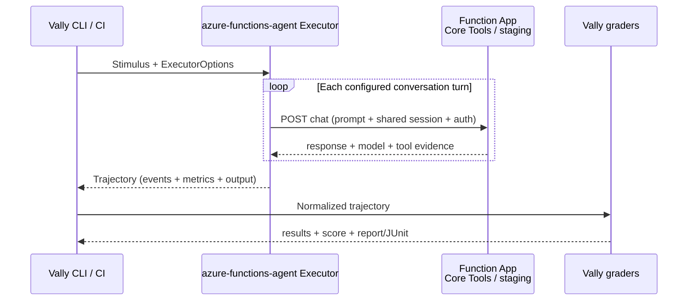

# FRD 0009 — Vally-first agent evaluations

## 1. Summary

Hosted Skills will support repeatable evaluation of customer-authored agents without creating a
second evaluation framework. [Vally](https://microsoft.github.io/vally/) owns evaluation discovery,
stimuli, graders, repeated trials, scoring, reports, and CI verdicts. The runtime integration is a
Vally custom `Executor`, packaged as a private/path-loadable TypeScript package in this repository,
that invokes the runtime's existing synchronous built-in chat endpoint under local Azure Functions
Core Tools or on a deployed staging Function App and converts generic runtime evidence into a Vally
`Trajectory`.

The Python runtime will make only additive, framework-neutral evidence changes: report the resolved
model, identify the model-response batch that issued each tool call, and state whether a returned
tool result succeeded. It will not emit Vally types, add an evaluation endpoint, or implement a
grader. This design replaces the unmerged MAF evaluation API adapter previously described by this
FRD; Microsoft Agent Framework remains the runtime's agent execution engine.

## 2. Motivation / problem

A prompt, model, tool, skill, or runtime change can alter an agent's answer or tool path even when
ordinary application tests pass. Customers need source-controlled behavioral tests that run against
the same hosted agent locally and in staging, detect missing or incorrect tool behavior, support
quality rubrics, and produce CI-friendly reports.

The earlier implementation bridged the chat endpoint to MAF's experimental evaluation API. The
product direction has changed to Vally. Vally already supplies the complete evaluation pipeline:

```text
Stimulus → Executor → Trajectory → Graders → Score
```

The missing primitive is therefore not another evaluation abstraction. It is an executor that calls
the Function App and faithfully translates its response into Vally's normalized event model. The
existing endpoint already returns the final response, observed tool calls/results, and session ID.
Small generic evidence additions close the remaining fidelity gaps without coupling runtime server
behavior to Vally.

“Local evaluation” and “production evaluation” are otherwise ambiguous. This FRD treats evaluation
as independent choices:

| Axis | MVP choices |
| --- | --- |
| Agent target | Local Core Tools host; deployed staging Function App |
| Orchestrator | Vally CLI on a developer machine or in CI |
| Grading | Vally deterministic graders; optional Vally prompt/panel LLM judges |

Passive evaluation of production traces is a separate product problem with different privacy,
sampling, retention, RBAC, and trace-schema requirements and remains deferred.

## 3. Goals / non-goals

### Goals

- Evaluate authored agent behavior: final output, transcript, completed tool calls, tool arguments,
  tool results, multi-turn memory, consistency across trials, and client-observed latency.
- Run one Vally `eval.yaml` unchanged against local Core Tools and a deployed staging Function App
  by changing executor configuration or environment variables.
- Use Vally's public executor, trajectory, grader, scoring, report, and CLI contracts rather than
  defining Hosted Skills equivalents.
- Support single-turn and ordered multi-turn stimuli on one runtime session.
- Support anonymous, Functions-key, and Microsoft Entra authentication without placing secrets in
  eval specifications or persisted trajectories.
- Preserve case isolation: each independent Vally trial gets a distinct generated session unless
  the host supplies `ExecutorOptions.sessionID`.
- Keep existing chat clients compatible through additive response fields.
- Make unavailable evidence explicit instead of synthesizing misleading token, cost, skill,
  reasoning, subagent, or workspace data.
- Use Vally's `--require-pass` and JUnit output for CI gates.

### Non-goals

- Testing Azure Functions trigger delivery, scaling, availability, or other platform reliability.
- Defining custom Hosted Skills graders, scoring, datasets, result models, baseline storage, or a
  separate evaluation CLI.
- Adding evaluation settings to `.agent.md` or `agents.config.yaml`.
- Automatically exposing an agent. The agent must opt into the existing
  `builtin_endpoints.chat_api` surface.
- Adding a Vally-shaped server response or an asynchronous run/status API.
- Supporting remote workspace mutation, Vally file/diff graders, attachments, prepared workspaces,
  tool simulation, or per-turn workspace-diff capture.
- Applying Vally `agent_environment` skills, MCP servers, environment variables, model overrides, or
  reasoning-effort overrides to an already composed Function App.
- Streaming evaluation, arbitrary non-HTTP triggers, or waiting for Durable workflow completion.
- Reporting token usage/cost, reasoning, runtime skill activation, or complete subagent trajectories
  until generic runtime evidence exists for them.
- Supporting `max_agent_duration` partial-success semantics; the MVP supports only the hard per-trial
  timeout.
- Sending synthetic traffic to the live production application.
- Passive production-trace evaluation or inline grading of production requests.
- Publishing the executor to npm in the initial implementation.

## 4. Proposed design

Evaluation remains external to the runtime's discover → translate → register → execute pipeline.
The Function host composes and executes the authored project exactly as it does for any other chat
request. Vally loads the executor plug-in, passes it a stimulus, and grades the returned normalized
trajectory.



| Runtime pipeline area | Module(s) | Change |
| --- | --- | --- |
| discover | none | Existing project discovery remains unchanged. |
| translate | none | Existing schema/composition remains unchanged; eval config belongs to Vally. |
| register | `registration/endpoints.py` | Add the resolved model to the existing chat response. No new route. |
| execute | `runner.py` | Enrich generic tool evidence with batch identity and result success. |
| external development tooling | `integrations/vally-executor-azure-functions/` | Add the TypeScript executor package. |

### 4.1 Validated Vally compatibility boundary

A 2026-09-18 package and documentation spike established:

- The evaluated published packages are `@microsoft/vally==0.16.0` and
  `@microsoft/vally-cli==0.16.0`; both declare Node.js `>=22.12.0`.
- A plug-in exports `registerExecutors(registry)` and registers an object implementing Vally's
  public `Executor` interface.
- The executor's required behavior is `name`, `execute(stimulus, options)`, and `shutdown()`.
  `validateConfig(config)` is required by this integration because Vally fails closed when executor
  config is supplied without a validation hook.
- `supportsMultiTurn = true` opts into `Stimulus.turns`; `stimulusPrompts()` provides the ordered
  prompts.
- `execute()` returns a `Trajectory` with normalized `TrajectoryEvent` values. `computeMetrics()`
  derives standard metrics from those events.
- The CLI loads external executors through `--executor-plugin`, supports `--require-pass` for a
  failing-verdict exit code, and can emit JUnit.
- Vally does not currently load executor plug-ins during standalone `vally lint`; executor-name and
  executor-config validation must therefore be tested through planning in `vally eval`.
- Vally is pre-1.0. The package, lockfile, compiler tests, and CLI smoke tests will pin exact `0.16.0`
  compatibility. Any upgrade requires re-running the compatibility suite and reviewing trajectory
  semantics.

### 4.2 Generic runtime evidence contract

The synchronous chat endpoint retains its existing fields and adds optional fields:

```json
{
  "session_id": "trial-session",
  "response": "The receipt total is 42.18 USD.",
  "model": "gpt-4.1",
  "tool_calls": [
    {
      "type": "tool_start",
      "tool_call_id": "call-1",
      "tool_name": "read_receipt",
      "arguments": {"currency": "USD"},
      "turn_id": "response-0",
      "result": {"total": 42.18, "currency": "USD"},
      "success": true
    }
  ]
}
```

Contract rules:

- `session_id`, `response`, and `tool_calls` remain required and retain their meanings.
- `model` is the resolved runtime model/deployment identity. It is additive so older clients ignore
  it and newer executors can label evidence accurately. The endpoint always serializes a string;
  if the runtime cannot determine the effective model, it emits `"unknown"` rather than `null`.
- `turn_id` identifies the MAF assistant/model-response message that issued a call. Calls found in
  the same response message share an ID; calls from later response messages receive different IDs.
  It is not the Vally configured conversation-turn index. Concretely, the runner enumerates
  assistant-role messages in `response.messages` in encounter order and assigns
  `"response-<assistant-index>"`; all function-call content in one such message receives that value.
  The function-call ID correlates a call with its result but does not define batching.
- `success` is present only when `result` is present and is derived through the runtime's existing
  sanitized tool-error classification used by `af.agent.tool_error_count`. It does not expose an
  exception or secret. This classification recognizes the runtime's JSON `error`/`stderr`
  envelopes; semantically failed plain-text results can still be classified as successful, so
  evaluations that care about result meaning must also assert the result value.
- Tool-call array order follows runtime observation order. Each call keeps its original ID where
  available. The executor synthesizes a local stable ID only for legacy/malformed records that omit
  an ID.
- `arguments` and `result` remain JSON-compatible values when the underlying MAF content exposes
  them. If arguments are a JSON string, the executor parses them to the represented JSON root;
  otherwise it preserves the string.
- These fields describe observed execution, not Vally. No Python module imports Vally contracts.

The batch identifier is required for sound Vally `tool-calls.parallel` grading. Without it, Vally
falls back to coarse turn boundaries and sequential model calls made during one configured
conversation turn could be reported as parallel. An absent identifier on a legacy server is omitted
from the Vally event rather than guessed.

The runtime preserves its existing session contract: when `x-ms-session-id` is supplied, both the
JSON `session_id` and `x-ms-session-id` response header contain that validated value; when omitted,
both contain the same generated value. The executor verifies both response values against the value
used for the request. A missing or mismatched value is an execution/contract failure, and diagnostics
identify the expected and returned non-secret session IDs without including auth material.

### 4.3 Executor package and configuration

The initial private package lives at `integrations/vally-executor-azure-functions/`, uses strict ESM
TypeScript, and exports:

- `AzureFunctionsAgentExecutor`;
- its validated public configuration types;
- `registerExecutors()`.

The registered executor name is `azure-functions-agent`. Its Vally dependency and development CLI
are pinned to `0.16.0`; its package metadata requires Node.js `>=22.12.0`. Publication naming and
semantic-version policy are deferred until the integration proves stable.

A Vally eval selects it with opaque executor config:

```yaml
defaults:
  executor:
    name: azure-functions-agent
    config:
      endpointUrlEnv: AGENT_EVAL_TARGET_URL
      auth:
        type: function-key
        keyEnv: AGENT_EVAL_FUNCTION_KEY
```

Configuration validation is fail-closed:

- Specify exactly one of `endpointUrl` or `endpointUrlEnv`.
- A resolved endpoint must be absolute HTTP(S), with a host and without user information, a query,
  or a fragment. This prevents literal Functions keys from being embedded as `?code=...`.
- Authentication is exactly one of:
  - `anonymous` (the default);
  - `function-key`, with `keyEnv` naming an ambient process environment variable;
  - `entra`, with a non-empty `scope` or `scopeEnv`, using `DefaultAzureCredential`.
- Literal function keys, bearer tokens, and arbitrary header dictionaries are rejected.
- Environment-variable names may be persisted; resolved secret values may not appear in errors,
  config output, trajectories, or logs.

Credentials and endpoint environment variables come from the Vally process environment, not
`agent_environment.env`. The executor does not advertise `supportsEnvVars`, because it does not
spawn or reconfigure the Function App process.

### 4.4 Execution and sessions

`execute()` is stateless for independent trials and safe for concurrent invocation:

1. Resolve and validate config and ambient credentials for the current trial.
2. Use `options.sessionID` when present; otherwise generate a runtime-valid session ID.
3. Resolve prompts with `stimulusPrompts(stimulus)`.
4. Send each prompt sequentially to the non-streaming built-in chat route
  (`POST /agents/{slug}/chat`) with the same `x-ms-session-id`.
5. Apply one hard `options.timeout` deadline across all configured turns. Abort the active HTTP
   request when the deadline expires.
6. Verify every response is successful JSON, matches the generic contract, and echoes the requested
   session ID.
7. Reject transport, authentication, non-2xx, malformed-response, timeout, and session-mismatch
   failures as execution failures. They are not low quality scores.
8. Return one complete trajectory. `shutdown()` is idempotent and releases owned resources.

The executor does not consume the SSE `chatstream` route. Streaming remains an interactive runtime
surface and is outside this Vally contract; its event payload therefore does not need the new batch
or result-success fields.

The executor advertises `supportsMultiTurn` only. It does not advertise attachments, environment
variables, prepared workspaces, simulation, or turn-completion support. It rejects non-empty
executor options for skills/MCP and server-side-inapplicable model or reasoning overrides instead of
silently ignoring them. Stimuli requiring unsupported capabilities fail before or during execution
with an actionable message.

### 4.5 Trajectory mapping

For each configured conversation turn, the executor emits events in this order:

1. `turn_start` with the configured-turn identity;
2. `user_message` with the prompt;
3. zero or more `tool_call` and matching `tool_result` pairs in observed order;
4. `assistant_message` with the final response for that turn;
5. `turn_end`.

Each event receives the configured Vally turn index. A `tool_call.data.turnId` uses the server's
model-response batch ID when supplied, allowing Vally to distinguish parallel and sequential model
batches. Tool results preserve the server's `success` and result value. Calls without results remain
uncompleted and therefore do not satisfy graders that require a completed call.

`computeMetrics(events)` derives tool, turn, skill, token, and error aggregates. The executor replaces
`metrics.wallTimeMs` with client-observed elapsed time across HTTP execution while excluding Vally's
host-side `onTurnComplete` time. The top-level output is the final assistant response. Metadata uses
the server model, executor name, start/end time, and runtime session ID.

The executor does not emit token, cost, reasoning, skill-activation, subagent, workspace-diff, or
error events unless the runtime supplies evidence with the required semantics. Consequently their
metrics remain zero/absent rather than becoming estimates.

Legacy endpoint responses remain usable:

- missing `model` becomes `"unknown"`;
- missing `turn_id` leaves `tool_call.data.turnId` absent;
- a present result without `success` is treated as successful only as a documented compatibility
  fallback;
- missing tool-call IDs receive deterministic executor-local IDs scoped to the turn.

### 4.6 Eval specifications, grading, and CI

The sample replaces its custom JSONL/pytest harness with native `eval.yaml`. It demonstrates:

- `output-contains` for deterministic output assertions;
- `tool-calls` for required names, string argument patterns, and result patterns;
- repeated trials through `defaults.runs`;
- an ordered multi-turn memory case;
- optional `prompt` or `panel` grading configured through Vally's separate judge provider.

The sample must account for Vally's argument matcher semantics: `args` matches only string-valued
arguments and uses regex patterns. Nested, numeric, boolean, and array arguments require the
`pattern` matcher against JSON serialization or a separately reviewed custom grader. No custom
grader is needed for the receipt sample.

CI uses `vally eval --executor-plugin <built-package> --require-pass --junit`. Without
`--require-pass`, a valid failing grader verdict exits zero by Vally design; execution,
configuration, and tooling errors still exit nonzero. The CI template adds a separate Node job for
installation, formatting/linting, strict compilation, unit tests, package build, CLI smoke tests, and
package-content inspection. Existing Python 3.13/3.14 gates remain unchanged.

### 4.7 Privacy, telemetry, and evidence limits

Persisted Vally results can contain prompts, assistant responses, tool arguments/results, endpoint
host metadata, and session IDs. Function keys and Entra tokens must never be persisted. Optional LLM
judges can send selected trajectory evidence to the configured provider; users must review region,
retention, access control, and privacy requirements before enabling them.

The MVP does not claim trace correlation between a Vally trial and Application Insights. Vally's
`ExecutorOptions.traceContext` and `--otlp-endpoint` integration require a separate end-to-end study
before the executor advertises telemetry configuration or forwards incoming trace context.

## 5. Compatibility and migration

This feature is not yet merged, so the MAF evaluation adapter has no released compatibility promise.
The pivot removes `azure_functions_agents.evaluation`, its pytest harness, and MAF-evaluation-specific
tests. It does not remove the repository's MAF packages because the runtime itself executes agents
through MAF. It also does not remove shared `aiohttp` or Azure Identity dependencies used elsewhere.

Existing Function Apps and chat clients remain compatible. Server changes are additive fields on a
previously existing response/tool record. Existing authoring, discovery, validation, registration,
and route behavior remain unchanged.

## 6. Decisions log

The log is append-only. Decisions 1–12 document the superseded MAF-first design; decisions 13 onward
document the Vally pivot.

| # | Decision | Options considered | Choice | Decided by | Date |
| - | -------- | ------------------ | ------ | ---------- | ---- |
| 1 | What customers evaluate | Whole AFAR platform / authored behavior / both | Authored agent behavior only | Human | 2026-09-02 |
| 2 | Initial deployed target | Production / staging or ephemeral / both | Staging or ephemeral only | Human | 2026-09-02 |
| 3 | Original product ownership | AFAR framework / MAF bridge / docs only | Thin bridge to MAF | Human | 2026-09-02 |
| 4 | Original evaluator abstraction | AFAR plug-ins / MAF `Evaluator` / Foundry only | Reuse MAF `Evaluator` | Human + Agent | 2026-09-02 |
| 5 | Original runner/reports | Functions CLI / pytest+CI / Foundry portal | pytest/JUnit with optional Foundry URL | Human + Agent | 2026-09-15 |
| 6 | Hosted target | Direct composition / Core Tools HTTP / both | Reuse HTTP under Core Tools first | Human + Agent | 2026-09-15 |
| 7 | Original runtime change | New eval endpoint / MAF client / sample copy | Versioned preview MAF client only | Human + Agent | 2026-09-15 |
| 8 | Production evaluation | Synthetic production / passive traces / defer | Defer; no production traffic | Human + Agent | 2026-09-15 |
| 9 | Usage/cost | Parse logs / structured usage / defer | Defer until generic evidence exists | Human + Agent | 2026-09-15 |
| 10 | Experimental MAF API | Stable export / preview module / copy | Isolated preview module | Human + Agent | 2026-09-15 |
| 11 | Endpoint address | Construct `/api` / require complete URL | Require complete URL | Agent review | 2026-09-15 |
| 12 | Trace links | Guarantee / validate later / omit | Validate separately before claiming | Agent review | 2026-09-15 |
| 13 | Evaluation system pivot | Keep MAF eval / replace with Vally / support both | Replace unmerged MAF evaluation integration with Vally | Human | 2026-09-18 |
| 14 | Vally extension point | Custom grader / custom executor / Vally-shaped endpoint | Custom executor using built-in Vally graders | Human + Agent | 2026-09-18 |
| 15 | Executor ownership | Runtime repo / Vally repo / sample only | Private/path-loadable package in this repository | Human | 2026-09-18 |
| 16 | MVP invocation | Single-turn local / single+multi all auth | Single+multi-turn; anonymous, key, and Entra | Human | 2026-09-18 |
| 17 | Workspace semantics | None / read-only / full mutation | Chat behavior only; no workspace/file semantics | Human | 2026-09-18 |
| 18 | Server coupling | Emit Vally trajectory / generic additive evidence / no change | Generic additive model, batch, and success evidence | Agent | 2026-09-18 |
| 19 | Vally compatibility | Floating range / exact pin / vendored types | Exact `0.16.0` packages with compile+CLI gates | Agent | 2026-09-18 |
| 20 | Package publication | Publish now / private first | Private/path-loadable first; publication deferred | Agent | 2026-09-18 |
| 21 | Evaluation transport | SSE chatstream / non-streaming chat | One non-streaming chat request per configured turn | Agent review | 2026-09-18 |
| 22 | Model-response batch identity | Call ID / assistant-message index / configured turn | Deterministic assistant-message index (`response-<n>`) | Agent review | 2026-09-18 |
| 23 | Session contract checking | Trust body / compare body only / compare body and response header | Executor compares requested ID with body and response header | Agent review | 2026-09-18 |
| 24 | Vally-first FRD approval | Request changes / approve finalized design | Approve and continue to implementation | Human | 2026-09-18 |

## 7. Test plan

### Runtime evidence

- [x] Calls in one MAF assistant response share a batch ID; calls in later responses do not.
- [x] Successful and sanitized error results set `success` correctly.
- [x] Missing results do not acquire `success`.
- [x] Endpoint response adds the resolved model without changing prior fields/headers.
- [x] A missing effective model is serialized as `"unknown"`, never JSON `null`.
- [x] Existing endpoint and runner tests remain green.

### Executor unit and compatibility tests

- [x] Exact Vally `0.16.0` public contracts compile under strict TypeScript on Node `>=22.12.0`.
- [x] Plug-in registration and fail-closed config validation work through Vally planning.
- [x] URL, environment-variable, session, and all authentication modes are validated.
- [x] Secret values do not appear in errors, trajectories, logs, or snapshots.
- [x] Request method, body, auth headers, session header, and timeout are correct.
- [x] Non-2xx, 401/403, transport, timeout, invalid JSON, malformed fields, and session mismatch fail
  as execution errors.
- [x] New and legacy response shapes map correctly.
- [x] Events preserve configured-turn order, call/result order, JSON argument roots, result success,
  model, batch identity, output, metadata, and wall time.
- [x] Independent trials use independent sessions; multi-turn prompts share one session.
- [x] Concurrent executions share no mutable trial state; shutdown is idempotent.

### False-pass and CLI tests

- [x] Missing or uncompleted required calls fail Vally's real `tool-calls` grader.
- [x] Wrong tool name, string argument, or result fails.
- [x] Sequential model batches do not satisfy `parallel`; calls sharing a server batch do.
- [x] Turn-scoped output grading selects the correct multi-turn response.
- [x] Missing token/skill evidence remains zero and is not fabricated.
- [x] Full CLI smoke covers plug-in load → plan → invoke → trajectory → grade → report/JUnit.
- [x] Full CLI smoke uses the sample receipt app and native `eval.yaml`, and asserts a passing
  output/tool result plus generated report and JUnit artifacts.
- [x] `--require-pass` returns nonzero for a valid failed verdict; execution errors always fail.
- [x] Environment-gated Core Tools E2E runs the sample `eval.yaml`; staging auth remains opt-in.
- [x] Independent testing review assesses evidence fidelity, negative controls, privacy, timeout,
  concurrency, and failure classification.

No config-scenario fixture is required because the runtime authoring schema does not change.

## 8. Documentation impact

- [x] `docs/architecture.md` — keep evaluation external/cross-cutting; document executor boundary.
- [x] `docs/evaluation.md` — replace MAF/pytest guidance with Vally setup, config, grading, CI,
  limitations, and privacy.
- [x] `samples/agent-evaluation/` — retain the receipt Function App; replace JSONL/pytest with
  `eval.yaml` and the local Vally plug-in workflow.
- [x] `README.md`, `docs/index.md`, and `samples/README.md` — replace MAF wording and links.
- [x] `docs/frds/README.md` — update FRD 0009 title/status.
- [x] `docs/front-matter-spec.md` and `docs/triggers.md` — no changes expected.

## 9. Status and sign-off

- **Original MAF architecture/testing reviews:** completed 2026-09-15 for the superseded design.
- **Vally compatibility review:** documentation and published-package metadata reviewed 2026-09-18
  against Vally `0.16.0`; strict plug-in compile and end-to-end CLI smoke are green.
- **Vally architecture review:** independent read-only review completed 2026-09-18 with a
  conditional pass. Findings on deterministic batch IDs, response-session checking,
  non-streaming transport, unknown-model handling, and heuristic success limits are resolved in
  this revision.
- **Human sign-off:** approved 2026-09-18 after the independent Vally architecture review and its
  amendments; status is `Finalized`.
- **Testing review:** independent read-only review completed 2026-09-18. Findings on missing result
  payloads, unknown-role batch inheritance, malformed success values, URL query secrets, failure
  classification, negative grader controls, concurrency, lock portability, and npm audit policy were
  addressed before closing the testing gate.
- **Implementation:** product code, sample migration, CI, tests, and documentation complete; the
  live Core Tools/Vally E2E is opt-in because it requires a configured model provider and Azurite.
