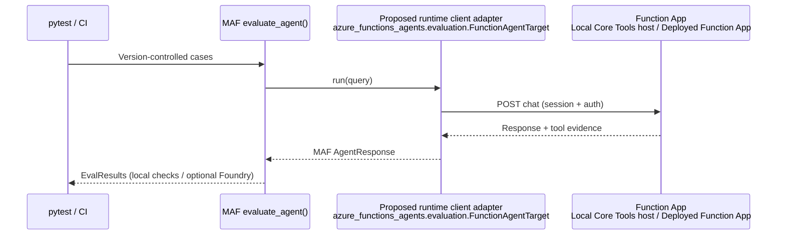

# FRD 0009 — MAF-first agent evaluations

## 1. Summary

Serverless Agents will support repeatable evaluation of customer-authored agents without creating a
second evaluation framework. Microsoft Agent Framework (MAF) remains the source of truth for
evaluation items, deterministic checks, repetitions, evaluator providers, results, and optional
Microsoft Foundry grading. The initial Serverless Agents experience is a thin, preview
MAF-compatible target adapter in `azure_functions_agents.evaluation` that invokes the runtime's
existing synchronous built-in chat endpoint under local Azure Functions Core Tools or on a deployed
staging Function App. `pytest` and the customer's CI system own execution, reports, and release
gates. No runtime server behavior, authoring schema, asynchronous run API, baseline service, or
grader plug-in system is added in the MVP.

## 2. Motivation / problem

A prompt, model, tool, skill, or runtime change can alter an agent's answer or tool path even when
ordinary application tests still pass. Today a Serverless Agents customer must independently script
test-case loading, Function invocation, tool-call inspection, grading, CI failure, and trace lookup.
That creates inconsistent local and deployment checks and encourages every application to invent its
own result and evaluator contracts.

The missing Serverless Agents primitive is not an evaluator. MAF 1.13.0 already provides
`EvalItem`, `ExpectedToolCall`, `LocalEvaluator`, `evaluate_agent()`, repetitions, the `Evaluator`
protocol, and `EvalResults`; `agent-framework-foundry` 1.10.3 provides `FoundryEvals`. The runtime
already exposes a synchronous HTTP target that returns the final response, observed tool calls and
tool results, and a session ID. The product gap is therefore a small, supported bridge between that
HTTP contract and MAF's agent/evaluation contracts, plus guidance for local, CI, and staging use.

“Local evaluation” and “production evaluation” are otherwise ambiguous. This FRD treats evaluation
as three independent choices:

| Axis | Initial choices |
| --- | --- |
| Agent target | Local Core Tools host; deployed staging Function App |
| Orchestrator | Developer machine; pull-request CI; scheduled/release CI |
| Evaluator | MAF deterministic/custom checks; optional Foundry managed evaluators |

Passive evaluation of sampled production traces is a different product problem from synthetic tests
against a deployment. It has additional privacy, trace-schema, sampling, retention, RBAC, region, and
service-maturity requirements and is explicitly deferred.

## 3. Goals / Non-goals

**Goals**
- Evaluate the behavior of an agent authored for this runtime: final answer, required tool calls and
  argument subsets, grounding/safety/quality when a configured evaluator supports them, consistency,
  and client-observed latency.
- Run one source-controlled suite unchanged against a local Core Tools host and a deployed staging
  Function App.
- Reuse MAF's public evaluation contracts and `Evaluator` implementations rather than defining SAF
  equivalents.
- Support a useful deterministic-only workflow with no Foundry project and make managed grading an
  explicit opt-in.
- Use ordinary `pytest` exit codes and JUnit output for CI gates, preserving a Foundry report URL when
  one is returned.
- Preserve case isolation by using a fresh agent session for each independent attempt.
- State exactly which case inputs, responses, context, and tool evidence are sent to an external
  evaluator.
- Validate standard W3C trace correlation before promising links from failed cases to Application
  Insights transactions.

**Non-goals**
- Testing Azure Functions trigger delivery, scaling, availability, or other platform reliability;
  these remain product validation and Azure SLO concerns.
- Defining SAF-specific evaluator, provider, result, rubric, report, or baseline abstractions.
- Adding evaluation configuration to `.agent.md` front matter or `agents.config.yaml`.
- Automatically exposing an agent for evaluation. Local-hosted and staging evaluation require the
  agent to opt into the existing `builtin_endpoints.chat_api` surface.
- Adding a `func agents eval` command in the MVP.
- Adding an asynchronous run-ID/status/result API solely for evaluations.
- Exercising arbitrary non-HTTP triggers or Durable workflow completion in the MVP.
- Sending synthetic evaluation traffic to the live production application in the MVP.
- Inline grading of production requests.
- Token/cost gates until structured usage is available in the invocation evidence contract.
- Passive production-trace evaluation; that requires a separate FRD after a compatibility study.

## 4. Proposed design

Evaluation remains external to the runtime's discover → translate → register → execute pipeline. The
Function host composes and runs the agent exactly as it does today. MAF calls the development-time
target adapter, which invokes the existing built-in chat route. After the Function App responds, the
adapter converts the returned evidence into a public MAF `AgentResponse`. MAF's existing
`evaluate_agent()` then builds evaluation items and executes deterministic checks or, when explicitly
configured, sends the normalized evidence to `FoundryEvals`.



The proposed adapter is **runtime-owned client code** packaged in
`azure_functions_agents.evaluation`, but it runs in the `pytest`/CI evaluation process—not inside
the Function App. The Function App remains unchanged and exposes only its existing opt-in chat API.

| Pipeline stage | Module(s) | Change |
| --- | --- | --- |
| discover | none | Existing project discovery remains unchanged. |
| translate | none | Existing schema and composition remain unchanged. Evaluation settings are external. |
| register | `registration/endpoints.py` | No MVP behavior change; reuse the opt-in synchronous built-in chat endpoint. |
| execute | `runner.py` | No MVP behavior change; continue returning response text, observed tool calls/results, and session ID. |
| external development tooling | new `azure_functions_agents/evaluation/` | Add a thin preview target adapter; MAF performs evaluation. |

### 4.1 Validated MAF compatibility

A 2026-09-15 throwaway spike against the versions pinned by this repository established:

- `agent-framework-core==1.13.0`, `agent-framework-foundry==1.10.3`, and
  `agent-framework-openai==1.10.2` are the evaluated versions.
- A duck-typed target implementing MAF's public `SupportsAgentRun` members (`id`, `name`,
  `description`, `run()`, `create_session()`, and `get_session()`) is accepted by
  `evaluate_agent()`.
- Public `AgentResponse`, `Message`, `Content.from_function_call()`, and
  `Content.from_function_result()` can represent the runtime chat response without defining a SAF
  evaluation item.
- `LocalEvaluator(tool_calls_present, tool_call_args_match)` correctly passes matching observed calls
  and fails missing/wrong calls with per-check details.
- `num_repetitions=2` produces two independently evaluated items.
- In the pinned MAF version, `evaluate_agent()` calls `run()` once per query/repetition with
  `session=None`; it does not call `create_session()` or `get_session()`. The adapter must therefore
  create a fresh HTTP session inside every `run()` that receives no explicit session.
- `FoundryEvals`, `evaluate_foundry_target()`, `evaluate_traces()`, and `EvalResults` threshold/gate
  methods are present in the pinned packages. A live Foundry run was not performed by this local
  spike and remains an explicit integration validation item.
- MAF marks these evaluation APIs experimental and emits `ExperimentalWarning`; the customer
  experience must be labelled preview and isolated from runtime server internals.

### 4.2 Target adapter

The initial adapter is intentionally small:

- It is published as the preview public module `azure_functions_agents.evaluation`, but is not
  re-exported from the package root while the MAF dependency remains experimental. Its principal
  public type is provisionally named `FunctionAgentTarget`; names are finalized during API review.
- It accepts the complete chat endpoint URL, agent identity metadata, authentication strategy, and
  request timeout. Requiring the complete URL avoids assuming the Functions host's configurable
  route prefix. With the default prefix, the URL is
  `http://localhost:7071/api/agents/{slug}/chat`; the registered route itself is
  `agents/{slug}/chat`.
- It targets only agents that already set `builtin_endpoints.chat_api: true`. A trigger-only agent
  has no generic chat surface and is not remotely evaluable by this MVP without that authoring
  change. The adapter never enables or deploys an endpoint.
- It implements MAF's public `SupportsAgentRun` contract for non-streaming calls.
- Each `run()` posts `{"prompt": ...}` and supplies an `x-ms-session-id`. The response must contain
  `session_id`, `response`, and `tool_calls` in the existing endpoint format.
- When MAF calls `run(..., session=None)`, the adapter mints a fresh session ID. This is how queries
  and `num_repetitions` attempts remain independent in the pinned MAF version. When an explicit MAF
  `AgentSession` is supplied, its session ID is forwarded for ordered multi-turn use.
- `create_session()` creates local MAF session metadata; `get_session()` maps a caller-supplied
  service session ID into that metadata. Neither method reads runtime Blob/File history. The
  compatibility suite detects if a future MAF `evaluate_agent()` begins using these methods or
  changes their contract.
- Authentication strategies are explicit and mutually exclusive: anonymous sends no credential;
  Functions-key authentication sends `x-functions-key`; Entra authentication obtains a bearer token
  from an Azure `TokenCredential` for the configured Function App audience/scope and sends
  `Authorization: Bearer ...`. Secrets and token values are never accepted from or written to the
  dataset or result artifacts.
- It maps each returned tool-call record to MAF function-call and function-result content, then adds
  the final assistant response.
- Transport, authentication, timeout, malformed-response, and cancellation failures remain distinct
  failures; the adapter does not turn them into low quality scores.
- It measures end-to-end client elapsed time as metadata. Latency is report-only in the MVP.
- It does not compute cost or query Application Insights to complete a result.

The module is explicitly preview because MAF evaluation contracts remain experimental. It is
versioned with the runtime and covered by compatibility tests, which makes the bridge supportable
without copying it into each customer project. The accompanying `samples/agent-evaluation/` project
demonstrates JSONL mapping, `pytest`, deterministic checks, and optional Foundry grading. No
experimental MAF symbol is re-exported from the runtime's stable package root.

### 4.3 Dataset and checks

The sample uses JSON Lines because MAF/Foundry evaluation workflows already use row-oriented data.
A record maps directly to MAF concepts rather than defining grader/provider policy:

```json
{"id":"receipt-total","query":"Read the receipt","expected_output":"42.18","expected_tool_calls":[{"name":"read_receipt","arguments":{"currency":"USD"}}],"tags":["smoke"]}
```

Supported sample fields are stable case ID, query (or an explicitly ordered conversation in a future
iteration), optional context, optional expected output, optional expected tool calls, tags, and
repetitions. Evaluators and credentials are configured in test code/environment.

Deterministic tool-name and argument-subset checks are the required fast gate. Managed quality,
groundedness, and safety grading is optional. Foundry tool-aware evaluators may require the complete
available tool definitions, while the current HTTP response contains observed calls but not every
tool schema. Managed tool grading is therefore not promised until a live integration study proves
that the available evidence is sufficient or defines a safe metadata contract that exposes schemas
without credentials or connection configuration.

### 4.4 CI and quality gates

- Pull-request smoke suites run deterministic MAF checks against a local Core Tools host or an
  ephemeral staging target and publish pytest/JUnit results.
- Scheduled or release suites may enable pinned Foundry evaluators, rubric versions, and judge model;
  the report URL is retained as a CI artifact when available.
- Missing required tools or mismatched required arguments fail immediately.
- AI-assisted metrics use explicit per-metric thresholds, a minimum suite pass rate, and repetitions
  for critical cases.
- Evaluator-service errors fail release suites closed; deterministic local workflows can explicitly
  omit the managed evaluator.
- Latency is reported but does not gate until environment-specific budgets and a flake policy are
  validated.

### 4.5 Trace correlation and evidence limits

The adapter may create a W3C `traceparent` per attempt and retain its trace ID with the case result,
but a direct Application Insights trace link is not an MVP capability. End-to-end propagation through
Core Tools/Azure Functions and lookup of the matching `agent.run` span must be proven in an opt-in
Azure integration test before documentation claims correlation or links. A server-side runtime
change is justified only if standard incoming trace context is not preserved or cannot be associated
with the run.

The current invocation contract does not return structured token usage or cost. Token usage is logged
separately by the runtime, and prices are external/versioned data. Token and cost gates are deferred
rather than reconstructed by log polling. A future optional `AgentResult`/HTTP usage field requires a
separate compatibility and privacy decision.

### 4.6 Passive production evaluation

After the MVP, a time-boxed study will run MAF/Foundry `evaluate_traces()` against actual runtime
`af.*` and MAF `gen_ai.*` spans. It must verify response/tool reconstruction, agent identity,
sensitive-content behavior, sampling, retention/deletion, RBAC, tenant/region boundaries, and
service preview/SLA. If viable, scheduled passive evaluation of explicitly sampled production traces
will be proposed in a separate FRD. It will remain observational and never block a live request.

### Authoring / API surface

- No `.agent.md`, `agents.config.yaml`, `mcp.json`, trigger, or endpoint schema changes.
- The evaluated agent must opt into the existing built-in chat API for hosted execution.
- `azure_functions_agents.evaluation` is a preview public module; it is not imported into the stable
  runtime package root.
- The JSONL loader remains sample code rather than a runtime-owned dataset schema.

### Compatibility

The MVP adds an external client module plus documentation/sample code and does not alter startup,
registration, execution, or existing HTTP payloads. Existing applications are unaffected. Evaluation
requires the exact MAF versions supported by the runtime; compatibility tests will fail clearly when
those experimental APIs change. Foundry remains optional, so a missing Foundry project does not
prevent deterministic local/CI evaluation.

## 5. Decisions log

| # | Decision | Options considered | Choice | Decided by | Date |
| - | -------- | ------------------ | ------ | ---------- | ---- |
| 1 | What customers evaluate | Whole SAF platform / authored agent behavior / both | Authored agent behavior only; platform reliability remains product CI/SLO scope | Human | 2026-09-02 |
| 2 | Initial deployed target | Live production / staging or ephemeral deployment / both | Staging or ephemeral deployment only | Human | 2026-09-02 |
| 3 | Product ownership | SAF evaluation framework / thin SAF bridge to MAF / docs only | Thin bridge and templates; MAF owns evaluation contracts and checks | Human | 2026-09-02 |
| 4 | Evaluator abstraction | New SAF `provider` plug-ins / MAF `Evaluator` / Foundry-only | Reuse MAF `Evaluator`; Foundry is optional | Human + Agent | 2026-09-02 |
| 5 | Initial runner and reports | Dedicated Functions CLI / pytest and CI / Foundry portal only | Use pytest exit codes and JUnit; preserve optional Foundry report URL | Human + Agent | 2026-09-15 |
| 6 | Local target | Direct runtime composition / Core Tools HTTP endpoint / both in MVP | Reuse the HTTP contract under Core Tools first; avoid a second composition/execution path | Human + Agent | 2026-09-15 |
| 7 | Runtime changes | New eval endpoint/run API / preview client adapter / sample copy only | Add a versioned preview client adapter, but no server-side behavior or payload changes | Human + Agent | 2026-09-15 |
| 8 | Production evaluation | Synthetic production traffic / passive traces / defer | Defer passive trace evaluation to a separate FRD; no production synthetic traffic in MVP | Human + Agent | 2026-09-15 |
| 9 | Usage and cost | Parse logs / return structured usage now / defer | Defer token/cost gates until structured evidence has a separately reviewed contract | Human + Agent | 2026-09-15 |
| 10 | Experimental MAF APIs | Stable root export / isolated preview module / copy contracts | Isolated preview module; never copy MAF contracts | Human + Agent | 2026-09-15 |
| 11 | Endpoint address | Construct from base URL and fixed `/api` / require complete URL | Require the complete chat URL because the Functions route prefix is configurable | Agent (architecture review) | 2026-09-15 |
| 12 | Trace links | MVP guarantee / validation-only / omit permanently | Exclude direct links from MVP; validate standard propagation before making a later claim | Agent (architecture review) | 2026-09-15 |

## 6. Test plan

- [x] Compatibility: pin and assert the supported MAF evaluation API surface; verify the target
  structurally satisfies `SupportsAgentRun`.
- [x] Unit: HTTP request construction, loopback/key/Entra auth, timeout, cancellation, malformed
  response handling, and session isolation.
- [x] Unit: response/tool-call conversion to public MAF messages, including missing results and
  malformed arguments.
- [x] Unit: matching expected tool name/argument checks pass; wrong tool and argument cases fail.
- [x] Unit: wrong argument types and missing required argument subsets fail rather than producing a
  false pass; extra actual arguments remain allowed according to MAF's documented subset semantics.
- [x] Unit: repetitions create independent sessions and preserve per-attempt evidence.
- [ ] E2E: boot a sample app with Core Tools and evaluate success, wrong-tool/argument, and transport
  failure cases.
- [ ] Integration (scheduled/opt-in): invoke an authenticated staging app, run configured Foundry
  evaluators, preserve the report URL, and verify evaluator failures fail closed.
- [ ] Integration (scheduled/opt-in, not an MVP claim): verify W3C trace propagation and locate the
  corresponding Application Insights transaction before documenting trace links.
- [x] Testing review: independently assess evidence fidelity, false-pass cases, privacy boundaries,
  and failure classification before release.
- Fixture scenario: not required because the MVP changes no authoring/config interpretation.

## 7. Docs impact

- [x] `docs/architecture.md` — describe evaluation as external/cross-cutting and document the reused
  chat/evidence boundary; do not add a pipeline stage.
- [x] `docs/evaluation.md` — explain the three axes, local Core Tools and staging workflows, CI
  patterns, supported evidence, data egress, and experimental status.
- [x] `samples/agent-evaluation/README.md` — document JSONL cases, deterministic checks, optional
  Foundry grading, and JUnit output.
- [x] `README.md` — link to the evaluation guide after the preview sample is validated.
- [x] `docs/front-matter-spec.md` — no change; evaluation adds no authoring fields.
- [x] `docs/triggers.md` — no change; evaluation adds no trigger type.
- [x] `docs/frds/README.md` — add FRD 0009 to the index.

## 8. Status & sign-off

- **Compatibility spike:** local public-API spike completed 2026-09-15 against the repository's
  pinned MAF package versions; deterministic tool checks and repetitions passed. Live Foundry,
  staging authentication, and trace propagation remain explicit integration work.
- **Architecture review (phase 2):** independent review completed 2026-09-15. It identified the
  opt-in endpoint prerequisite, unspecified session/auth contracts, configurable `/api` route
  prefix, trace-propagation assumption, sample-only support ambiguity, and tool false-pass coverage.
  Resolved by making the endpoint prerequisite prominent; specifying full-URL, auth, and session
  behavior; publishing a versioned preview adapter module; excluding trace links from MVP; and
  extending the test plan. The independent re-review returned **PASS** on 2026-09-15 with no
  remaining technical blockers to human sign-off.
- **Human sign-off:** approved 2026-09-15. Decisions 5, 6, 7, 9, and 10 were approved and the FRD
  advanced to `Finalized` before product implementation began.
- **Implementation:** preview target adapter, unit/compatibility tests, opt-in Core Tools E2E test,
  sample, and documentation completed 2026-09-15. Live Foundry, staging authentication, trace
  propagation, and the Core Tools E2E remain environment-gated validation items.
- **Testing review (phase 4):** independent re-review returned **PASS** on 2026-09-15 after
  confirming evidence fidelity, session isolation, auth/privacy boundaries, failure classification,
  deterministic false-pass coverage, and removal of redundant production assertions.
