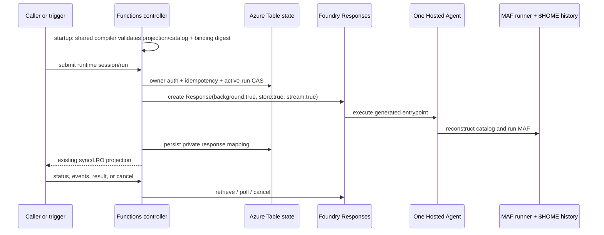

# FRD 0009 — Foundry Hosted Agent Responses session runtime spike

> **Status is `Finalized`.** This is a narrowly scoped, live-service spike
> design, not a production service contract. “Observed” statements below are
> measurements from the retained test project on 2026-08-14. They must be
> revalidated against the installed SDK and target service before becoming
> implementation assumptions. A stored background Response alone does not
> guarantee hosted-handler recovery: the generated server must opt into
> resilient background processing and make checkpoint/re-run boundaries safe.

## 1. Summary

Add an experimental session execution backend that submits agent turns to one
Microsoft Foundry Hosted Agent (FHA) per deployed Azure Functions
application/environment in a customer-owned Foundry project. The Functions app
remains the authenticated controller and retains the existing Azure Table
session/run/idempotency authority. It invokes the FHA through stored,
background Responses; the FHA runs the existing markdown-first catalog and MAF
runner from a generated source-deployed Responses entrypoint. Deployment
publishes a complete non-secret environment binding; it does not add a public
`agents.config.yaml` schema for this spike. The staged artifact carries the
same canonical non-secret FHA projection/catalog consumed by Function startup
and the hosted entrypoint.

This 4–5 engineer-day spike supports FHA V0 HTTP built-in/custom routes plus
one Azure Service Bus queue trigger, with ordinary custom Python tools, Agent
Skills, remote HTTP MCP, and one-level subagents/delegation through the current
MAF behavior. Existing Functions deployment remains unchanged; an out-of-band
bootstrap script enables FHA only after a successful deployment. Tool, MCP, and
subagent effects are at-least-once if a hosted-handler crash replays an
uncheckpointed turn; this is an explicit V0 trade-off, not a journaling design.

## 2. Motivation / problem

The current runtime executes a session turn in the Functions language worker or
uses the ACA Sandbox path described by [FRD 0008](0008-aca-sandbox-session-runtime.md).
For a Foundry-hosted execution option, the runtime needs a durable way to
submit long-running work, later recover its result from a fresh Functions
process, replay events, cancel safely, and preserve the runtime's existing
authorization and idempotency rules.

Creating a hosted agent per request or per runtime session would make cold
requests depend on deployment/control-plane latency, multiply customer
resources, and blur lifetime ownership. Conversely, treating Foundry
Responses IDs or conversation state as the runtime's session authority would
bypass the durable owner/session/run records already used by the controller.

The spike therefore tests this bounded shape:

1. Customer deployment configuration identifies an existing Foundry project.
2. After the existing Functions deployment, a standalone bootstrap script
   creates or updates exactly one FHA for the application/environment, waits
   until it is active, smoke-tests it, and only then enables FHA settings.
3. The Functions managed identity submits a stored background Response for each
   admitted runtime run.
4. The Hosted Agent reconstructs the existing MAF catalog/runner and keeps
   per-runtime-session MAF history under persistent `$HOME`.
5. The Functions controller reads, replays, or cancels that Response while its
   Azure Table records remain the sole authority for runtime ownership and
   admission.

FRD 0008 reserved a non-HTTP session fast-follow under this FRD number. This
FRD covers that extension only for the Foundry Responses spike; it does not
change ACA Sandbox behavior.

## 3. Goals / Non-goals

**Goals**

- Use one FHA for each deployed Functions application/environment inside the
  customer-provided Foundry project; one FHA serves many runtime sessions.
- Keep the existing Functions deployment flow unchanged; use a standalone
  post-deployment bootstrap script to create/update, wait, smoke-test, and
  configure the FHA, never on startup or on a first request.
- Enable FHA only from a complete deployment-published, non-secret environment
  binding, including an exact application-content digest; fail FHA selection on
  partial/stale binding or coexistence with ACA.
- Recompute the deterministic application-content digest at startup after
  catalog resolution; a configured stale binding fails closed rather than
  silently using a stale FHA or falling back to in-language-worker execution.
- Generate a canonical non-secret FHA projection from raw authoring before
  environment substitution, include the validated Foundry project endpoint and
  model/deployment in staging/binding integrity, and reject every placeholder,
  secret-bearing substitution, or non-allowlisted static header.
- Use one versioned project composition/catalog compiler in bootstrap, Function
  startup, and generated host, with injected private FHA history.
- Submit attached chatstream Responses with `background: true`, `store: true`,
  and `stream: true`; retain both the created Response ID and initial reader.
  Sync JSON/async paths remain stored background Responses without a retained
  reader. Replay, retrieve, poll, and cancel stay behind the existing
  `AgentExecutionBackend` seam.
- Generate a hosted Responses entrypoint that opts into resilient background
  task recovery and checkpoints only durable, replay-safe MAF stages.
- Keep Azure Table owner/session/run/idempotency records authoritative for
  authorization, one-active-run admission, idempotency, and runtime-to-provider
  mapping.
- Keep MAF history in the Hosted Agent's persistent `$HOME`; do not use a
  Foundry `conversation` or `previous_response_id` as runtime context.
- Reuse existing HTTP long-running-operation (LRO) and SSE routes. Public
  runtime session/run IDs remain authoritative; authenticated built-in debug
  responses may additionally expose the opaque FHA provider session ID for
  correlation only.
- Support only Azure Service Bus `service_bus_queue_trigger` as the
  representative non-HTTP path, using broker-assigned `sequence_number` and
  poll-to-terminal invocation behavior.
- Support an FHA V0 capability profile matching current MAF behavior for
  custom Python tools, Agent Skills, remote HTTP MCP, and one-level
  subagents/delegation.
- Accept at-least-once tool/MCP/subagent effects when recovery re-runs an
  uncheckpointed MAF turn; callers may rerun after a terminal failure.
- Configure the two live-proven hosted-observability role layers after the FHA
  identities exist: `Reader` on the Foundry account and `Monitoring Metrics
  Publisher` on the shared Application Insights resource for both the agent
  instance and blueprint identities.
- Use the Function App's Application Insights resource as the Foundry project's
  default `ProjectManagedIdentity` AppInsights connection for FHA mode.
- Propagate the active Functions worker W3C `traceparent`/`tracestate` on the
  initial Responses create call so AgentServer/MAF/model spans share the worker
  trace ID; Functions-host correlation remains optional.
- Return that worker/FHA trace ID from built-in chat endpoints and display it in
  the debug chat UI.
- Prove the design against the retained customer project and record
  quantitative, reproducible spike gates.

**Non-goals**

- Automated Foundry project creation or general customer onboarding. The spike
  automates only the two deployment-owned hosted-observability role assignments
  when authorized and otherwise emits an admin handoff.
- One FHA per session, per request, agent markdown file, or caller.
- Customer-supplied hosted-agent images; this spike uses source-code deployment
  and a generated hosted Responses entrypoint.
- A `schema.py`, front-matter, or generated configuration-reference change for
  FHA selection.
- Changes to current `azure.yaml`, Bicep, normal Functions deployment flow, or
  sample infrastructure; post-spike deployment-hook/azd/CI integration is
  future work.
- Automatic FHA re-bootstrap after a normal Functions content deployment.
- Custom secret injection, per-session secret references, or ACA-like egress
  proxy parity.
- Private networking, customer network topology, or production network
  isolation design.
- Exactly-once provider submission across the crash interval after the service
  accepts a create request but before its Response ID is durably recorded.
- A production-scale reconciler, queue/lease topology, or fleet management
  design; deadline logic runs only in opportunistic HTTP and Service Bus
  get/poll/cancel paths.
- Any non-HTTP trigger other than Azure Service Bus
  `service_bus_queue_trigger`.
- Session migration or guaranteed history continuity across hosted-agent source
  updates.
- Full provider tool-event and non-text-event parity with the current runner
  stream.
- Per-tool journaling, tool-result idempotency, or exactly-once guarantees for
  a hosted-handler crash replay.
- Every system tool: `web_request`, Dynamic Sessions/code interpreter, and
  sandbox tools.
- Dynamic/Durable workflows; local stdio or any non-HTTP MCP transport; and
  literal secrets staged in `mcp.json`.
- Any change to product source, tests, generated schema reference, or
  user-facing documentation in this drafting phase.
- Production RBAC reconciliation/cleanup, arbitrary connection replacement,
  dashboards/workbooks, trace-ingestion deployment gates, crash-recovery trace
  unification, or complete LRO/Service Bus tracing.

## 4. Proposed design

### 4.1 Pipeline placement

The implementation is proposed to preserve the architecture boundary in
`docs/architecture.md`: discovery is read-only, typed configuration is
translated before Function App mutation, registration is Azure-specific, and
execution is deferred to a request or trigger invocation. Names below identify
the intended integration points; no new module is created by this FRD draft.

| Pipeline stage | Existing / proposed module(s) | Proposed responsibility |
| --- | --- | --- |
| discover | `config/paths.py`, `discovery/*`, existing catalog construction | Keep reading the markdown-first project, skills, tools, and MCP inventory locally. Do not contact Foundry, create an FHA, or inspect provider sessions during discovery. |
| translate | proposed `project_composition.py`, FHA profile, `execution/foundry_responses_binding.py` | Compile raw authoring into the canonical non-secret projection/catalog, compute its manifest digest, and validate the complete deployment binding. Do not add `schema.py` or front-matter surface. |
| register | `app.py`, `registration/catalog.py`, `registration/capabilities.py`, `registration/endpoints.py`, `registration/triggers.py` | Reuse the authoritative FHA V0 compiler/profile, select ACA or digest-matched Foundry runtime data, and register provider-neutral LRO/status/result/events/cancel routes against `AgentExecutionBackend`. |
| execute | proposed `execution/foundry_responses.py`, `execution/factory.py`, generated entrypoint, existing `execution/backend.py`, `controller/http.py`, `controller/streaming.py`, `session_state/*` | Consume the shared compiled catalog with injected history; map background Response create/retrieve/replay/cancel and persist private provider mapping rows in the existing Table authority. |

FHA provisioning is intentionally **outside** the in-process startup pipeline.
It is a deployment lifecycle step because it mutates customer Foundry
resources, has a distinct setup identity, and must complete before runtime
configuration is enabled.

### 4.2 Deployment-published binding and public surface

This spike has no `session_runtime.foundry_hosted_agent` YAML block and makes
no `schema.py` or front-matter change. A deployment script/sample publishes
the following non-secret environment binding atomically:

| Required environment value | Meaning |
| --- | --- |
| `AZURE_FUNCTIONS_AGENTS_FHA_PROJECT_ENDPOINT` | Customer Foundry project endpoint. |
| `AZURE_FUNCTIONS_AGENTS_FHA_PROJECT_RESOURCE_ID` | Customer Foundry project ARM resource ID. |
| `AZURE_FUNCTIONS_AGENTS_FHA_MANAGED_AGENT_NAME` | Deployment-owned FHA name. |
| `AZURE_FUNCTIONS_AGENTS_FHA_MANAGED_AGENT_VERSION` | Deployed FHA/wrapper version; it is distinct from application content. |
| `AZURE_FUNCTIONS_AGENTS_FHA_APPLICATION_CONTENT_MANIFEST` | Bounded canonical manifest of every Functions application/catalog input staged for FHA. |
| `AZURE_FUNCTIONS_AGENTS_FHA_APPLICATION_CONTENT_DIGEST` | Exact platform-neutral digest of the manifest-selected Functions application/catalog inputs. |
| `AZURE_FUNCTIONS_AGENTS_FHA_WRAPPER_DIGEST` | Digest of the generated FHA-only entrypoint/runtime wrapper, separate from application content. |
| `AZURE_FUNCTIONS_AGENTS_FHA_BINDING_FINGERPRINT` | Deployment-generated non-secret fingerprint over canonical binding, application/environment provenance, projection/manifest/content/wrapper digests. |

`FoundryResponsesRuntimeBinding` is a distinct immutable value object; it
owns parsing and validation of all eight values and is not
`controller.readiness.SessionRuntimeBinding` (the ACA binding). All eight
values present selects FHA. All eight absent preserves the current
in-language-worker default. Any partial set, invalid fingerprint, or a
complete FHA binding together with `session_runtime.aca_sandbox` is a startup
failure.

### 4.2.1 Platform-neutral application content digest

`execution/foundry_application_content.py` is the proposed pure shared helper
for `build_application_content_manifest()` and
`compute_application_content_digest()`. Standalone bootstrap and Function
startup import this exact helper/package code; they must never implement
separate archive algorithms. This is a **new FHA platform-neutral contract**:
it does not read, reuse, or compare ACA `funcs_zip` bytes/digests. ACA
packaging remains unchanged and separate.

The input root is the resolved Functions app root. The helper selects only the
semantic, deployment-stable application/runtime inputs required by the hosted
catalog:

- agent markdown variants recognized by the loader at the root and directly in
  `agents/`;
- `agents.config.yaml`, `mcp.json`, and `requirements.txt` (remote HTTP MCP
  only after V0 profile validation);
- recursive `tools/` and `skills/` source;
- root-local Python modules imported by tool source and statically referenced
  `Path(__file__)` assets.
- the generated versioned non-secret FHA runtime configuration projection.

Bootstrap writes a bounded canonical staging manifest tagged
`fha_application_content_v2` that lists every included normalized POSIX
relative path, entry kind, and byte length. The same manifest document carries
the canonical runtime-projection JSON as a bounded derived field, so Function
startup can compile against the exact hosted projection without a ninth app
setting or ambient model environment value. The content digest frames that
projection in addition to the selected files. The complete binding publishes
the manifest and its application-content digest; if the
manifest exceeds the defined binding limit, bootstrap fails closed rather than
publishing an incomplete selection. Startup validates the deployment-published
manifest against the resolved root, then recomputes the digest from that same
manifest before FHA selection. Deployment-only and build artifacts do not
participate in selection: `.python_packages/`, `wheels/`, `.funcignore`,
`host.json`, and local settings templates are ignored unless a tool explicitly
selects an asset. This makes the source root and the transformed Functions
deployment root produce the same binding.

The canonical hash stream uses version tag
`fha_application_content_v2` and exact length-prefixed framing: frame that tag
and sorted entry count, then each normalized POSIX path, entry kind, byte
length, and raw file bytes. SHA-256 of this stream produces
`application_content_digest`. Filesystem metadata (mtime, permissions,
ownership, archive layout) is ignored. Empty directories are omitted unless a
future semantic requirement introduces an explicit `directory` marker into the
same stream.

Before staging or hashing, reject absolute/parent-traversal paths, duplicate
normalized paths, symlinks, junctions/reparse points, sockets/devices, path
case collisions, and anything outside the root; never follow links. Apply an
explicit denylist for `.env*`, `local.settings.json`, `.azure/`, VCS
directories, caches, virtual environments, and credential/certificate
patterns (including `*.pem`, `*.key`, `*.pfx`, and `*.p12`).

The same fixture tree must produce the same digest on Windows and Linux. The
generated FHA entrypoint/runtime wrapper has its own version/digest, included
in the binding fingerprint but excluded from
`application_content_digest`.

At Function startup, after app-root and catalog resolution but before
`create_execution_backend()` selects FHA, validate the manifest and recompute
the application content digest. A missing manifest/file or mismatched digest is
a configured stale-binding error: do not invoke a stale FHA and do not fall
back to in-language-worker execution. Only a completely absent FHA binding
retains the existing backend default.

### 4.2.2 Canonical non-secret FHA runtime projection

The eight binding settings remain the only Function App FHA binding surface.
They do not carry authoring configuration. Instead, bootstrap generates a
versioned canonical **FHA runtime configuration projection** from raw
authoring/configuration *before* environment substitution and stages its bytes
with the application artifact. The projection bytes/digest are entries in the
canonical staging manifest and binding fingerprint; the generated host consumes
that projection rather than independently re-parsing/resolving authoring data.

For V0, the projection may contain only non-secret stage-safe values:

- customer Foundry project endpoint sourced from the validated bootstrap
  argument/complete Function binding, plus model/deployment name;
- remote MCP URL, allowed tool names, and auth scope;
- optional managed-identity `client_id`;
- non-sensitive static headers only when their header name appears in the
  explicit FHA static-header allowlist.

The projection rejects literal credential, token, key, password, secret, cookie,
or authorization-header material. It also rejects unknown static header names
and unresolved secret-bearing substitutions. If a raw authoring value would
need a secret environment substitution, FHA profile validation fails rather
than copying the resolved secret into the projection, manifest, generated
source, or hosted configuration.

V0 applies one deterministic placeholder rule: **all** environment placeholders
or substitutions are rejected in projection-governed model/deployment, MCP URL,
allowed-tool, auth-scope, `client_id`, and allowlisted-header fields. Bootstrap,
Function, and hosted-process environments never resolve those fields; values
must already be literal non-secret configuration.

The same substitution-free rule applies to every staged catalog-relevant
authoring input, not only projection fields. Before invoking the ordinary
loader, the shared FHA compiler scans raw agent markdown variants (front matter
and instructions), `agents.config.yaml`, and `mcp.json` and rejects every
recognized environment-placeholder syntax. FHA V0 has no placeholder
allowlist: resolved metadata, instructions, models, filters, triggers, MCP,
Skills, and delegation must derive only from literal staged source. Normal
non-FHA loading and substitution behavior is unchanged.

Bootstrap, Function startup, and the generated host require the same validated
projection and fail closed when it is absent, non-canonical, digest-mismatched,
or the raw catalog authoring contains any placeholder/substitution. Bootstrap
may materialize projection values as hosted-agent non-secret environment
variables only as an implementation adapter; the canonical projection remains
authoritative and is parity-checked.

### 4.2.3 Shared FHA V0 composition and catalog compiler

`project_composition.py` plus the FHA profile module is the proposed single,
versioned authoritative compiler/validator. Standalone bootstrap, Function
startup, and the generated host call the same compiler with the same resolved
app root and raw authoring inputs. It performs ordinary discovery, compose,
validation, and `build_capabilities()` for custom Python tools, Agent Skills,
remote HTTP MCP, and one-level delegation; then FHA V0 profile validation
fails closed for system tools, workflow tools/configuration, local/non-HTTP
MCP, nested/cyclic delegation, unsupported triggers, and unsafe MCP
configuration.

The generated entrypoint first sets its app root to the staged source directory
and then invokes this compiler. It consumes the resulting catalog with injected
private FHA history; it must not manually construct a `tools=[]` runner or
recreate a divergent tool catalog. Excluded capabilities are structurally
omitted, not merely ignored at execution time.

`execution.factory.create_execution_backend()` must dispatch explicitly among
the in-language-worker, ACA, and Foundry bindings after validation. It must not
infer a backend from a model endpoint. Registration must extract a
provider-neutral session-management registration path from the current
sandbox-named route helper so management routes depend only on
`AgentExecutionBackend`; Foundry-specific identifiers stay in private mapping
rows.

The binding is deployment-owned and not caller-configurable. It intentionally
contains no secret, raw owner claim, provider Response ID, or per-session
setting. Requests never create an FHA as a fallback.

Existing public session/run routes remain the public protocol. In particular,
the opaque runtime URLs produced by `controller.http.management_urls()` remain
the status, result, events, and cancel URLs. A client never receives an FHA
resource ID, hosted-agent ID, Response ID, conversation ID, or provider event
cursor.

### 4.3 Generated hosted Responses entrypoint and recovery

The source-deployed entrypoint must use the official Responses resilient-host
pattern, not merely submit a background response. During host bootstrap it must
set the app root to the staged source directory, load the canonical projection
through the shared compiler, then
construct `ResponsesServerOptions(resilient_background=True)` and call
`set_resilient_tasks_enabled(True)` before accepting work. Deployment must
pin/validate an Agent Server Responses/Core combination that exposes those
APIs and fail rather than silently deploy an unresilient fallback.

Before catalog construction, the generated host configures the existing Foundry
MAF client from the projection's exact project endpoint and model/deployment
values (the `FOUNDRY_PROJECT_ENDPOINT`-equivalent). It must not independently
read unspecified environment substitutions to derive model or endpoint
configuration.

The generated entrypoint validates the **FHA V0 capability profile** before
deployment/runtime enablement. It preserves ordinary current-MAF behavior for
the allowed catalog elements and rejects only the explicitly excluded surface:

| Capability | FHA V0 policy | Staging/recovery rule |
| --- | --- | --- |
| Custom Python tools | Allowed from project `tools/`. | Stage the callable source/imported application dependencies and run it through current MAF tool behavior. |
| Agent Skills | Allowed. | Stage skill context, resources, and scripts as current MAF does. |
| MCP | Remote HTTP/streamable-HTTP only. | Use hosted-agent identity or safe deployment-provided non-literal config; literal secrets in staged `mcp.json` fail validation. |
| Subagents/delegation | Allowed one level. | Use the current slug/catalog and structural guard; nested delegation remains rejected. |
| System tools | Rejected. | Reject `web_request`, Dynamic Sessions/code interpreter, and sandbox tools. |
| Workflows and local MCP | Rejected. | Reject Dynamic/Durable workflows and stdio/other non-HTTP MCP transports. |

No per-tool journal or idempotency layer is added. This profile is the V0
capability boundary, not a guarantee that a successful tool/MCP/subagent effect
will be executed exactly once.

The generated handler must be safe for framework re-entry:

1. On `context.is_recovery` with `context.persisted_response`, seed
   `ResponseEventStream` from that persisted snapshot; otherwise construct a
   new stream from the request.
2. On a fresh response, emit exactly one `response.created`, then its initial
   `response.in_progress`. On recovery, preserve the original `created` and
   every persisted pre-crash event; never emit another `created`. Append a new
   snapshot-reset `in_progress` only after those persisted events.
3. Run one ordinary MAF turn with the FHA V0 capability profile. Commit its
   private MAF history before closing the completed output item and calling
   `yield stream.checkpoint()`.
4. Resume after a checkpointed turn. A hosted-handler crash before that
   checkpoint may re-run the entire MAF turn, including custom tools, Skill
   scripts, remote HTTP MCP, and one-level delegation. Their effects are
   explicitly at-least-once; callers may rerun after failure.

`store: true` plus `background: true` persists a response for later retrieval,
but it does not guarantee a replayable event stream. The Responses API rejects
stream retrieval for a response created without `stream=true`, and a created
stream expires. FHA V0 therefore creates stored background responses without a
stream and polls retrieve; it emits deterministic snapshot events (`session`,
then terminal `message`/`done` or `error`) from the current stored response.
The server option, resilient-task opt-in, and checkpoint/re-run logic are
separate requirements.

The observed early-disconnect response that remained `in_progress` for more
than ten minutes is therefore a plausible missing-resilient-handler hypothesis,
not a confirmed root cause. The live recovery gate must prove or disprove it
against the deployed generated entrypoint and retained FHA.

### 4.4 Private history, state, and ID mapping

`session_state.session_models` and `session_state.store` already own
owner-partitioning, durable run status, active-run fencing, idempotency rows,
and ETag/transactional admission. The Foundry backend extends those records
with private provider references; it does not introduce a second session
directory, an FHA-side controller journal, or a public provider identifier.

| Runtime-owned value / authority | Private Foundry mapping | Requirement |
| --- | --- | --- |
| Application/environment binding | One managed FHA resource plus name/version/projection/manifest/application-content/wrapper digests/fingerprint | The complete binding identifies one FHA only when startup validates the canonical projection/staged manifest and recomputes matching application content. |
| Opaque runtime `session_id` | Durable private provider-session ID and provider-managed version indicator | New runtime sessions use the active binding version. Existing rows resolve the same private session through the current managed-agent endpoint instead of deriving a replacement ID. Foundry may advance the effective version on the next Response while preserving the session; missing provider state returns `409 session_binding_unavailable`. |
| Owner partition and opaque `session_id` | Private `$HOME/.azure-functions-agents-runtime/history/<opaque-owner>/<runtime-session>` MAF history | `FhaHistoryFactory` forces this path instead of Blob or configured history. `<opaque-owner>` is non-reversible and no raw owner claim crosses the provider boundary. |
| Opaque runtime `run_id` | One stored Responses `response_id` | The run row records the mapping only after admission. Public status/result/event payloads expose the runtime ID only. |
| Runtime idempotency record | The admitted `run_id` and, when known, its private `response_id` | Existing owner/session idempotency fences decide replay. If create was accepted but the ID was lost before binding, mark indeterminate/quarantine; no provider lookup is supported. |
| Runtime `RunEvent.sequence` / `Last-Event-ID` | Provider 0-based event ordinal and `starting_after` | The exact mapping is defined in §4.5; raw provider cursors never become public IDs. |
| Service Bus delivery | Non-secret versioned entity fingerprint plus broker `sequence_number` | The fingerprint scopes broker-unique sequence numbers across namespaces/entities; neither credentials nor a raw connection string is persisted. |
| Generated-handler checkpoint | `ResponseContext.persisted_response` and a framework-persisted output snapshot | It remains provider-private. It follows a completed FHA V0 MAF turn/history commit and never replaces the Table run authority. |
| Durable run state (`accepted`, `running`, terminal states) | Response lifecycle and terminal output | `get_run` is the authority for projection after it reconciles the provider retrieve with the durable run row. |
| `active_run_id` / session status | No provider equivalent | The Table compare-and-swap is mandatory before every create because same-session provider calls can proceed concurrently. |

`FhaHistoryFactory` is private to the entrypoint and is forced for this
backend. The identity/routing part of its request envelope carries only
opaque runtime `session_id`, `run_id`, and agent slug. The factory derives its
path-safe `<opaque-owner>` scope from server-minted opaque session identity;
it never receives raw Easy Auth claims, function keys, or an owner field.
Blob history and any configured history provider are ignored for FHA runs.

On a normal FHA V0 MAF turn, the entrypoint commits MAF history to that path
before checkpointing completed output. On recovery, the persisted Response
snapshot identifies a completed checkpointed turn, so the entrypoint reloads
that history and skips it. A crash before the history commit/checkpoint may
re-run the whole tool-enabled turn. The history commit is idempotent by runtime
`run_id`: a crash after history commit but before checkpoint may re-run the
turn without appending the same history record twice, but external tool/MCP/
subagent effects remain at-least-once. That ordering is an explicit test case.

### 4.5 Cursor contract

Provider event sequence `p` is 0-based. The backend exposes runtime sequence
`p + 1`. On a fresh response, `created` is provider `p=0` / runtime ID `1`,
and the initial `in_progress` is `p=1` / runtime ID `2`. Recovery preserves
that one original `created` and every persisted event. If their highest
provider sequence is `p_last`, recovery appends the snapshot-reset
`in_progress` at `p_last + 1` / runtime ID `p_last + 2`: strictly after and
contiguous with all persisted pre-crash events. Recovery must never emit a
second `created`.

| Runtime read request | Provider request / projection |
| --- | --- |
| `after_sequence = 0` | Omit `starting_after`; read all retained provider events. |
| `after_sequence = r > 0` | Send exclusive `starting_after = r - 1`. |
| Provider earliest retained event is `p_min` | Report runtime earliest sequence `p_min + 1`; retain existing cursor-expired semantics in runtime sequence space. |

Tests must assert exactly one `created`, fresh IDs 1/2, recovery's later reset
`in_progress`, monotonic contiguous replay, and the omitted-versus-present
`starting_after` behavior. `Last-Event-ID` remains a runtime sequence and
never exposes a provider cursor.

### 4.6 Deployment lifecycle

The user first deploys the existing Functions application unchanged. This
spike does not modify `azure.yaml`, Bicep, or the normal Functions deployment
flow. With all eight FHA binding settings absent, the backend remains disabled
and the application uses the existing in-language-worker path.

A later normal Functions deployment that changes the deterministic application
content digest makes an old configured FHA binding stale. Startup then fails
FHA selection closed until the user reruns bootstrap; it never silently invokes
the stale FHA.

After that deployment, the user manually runs a proposed standalone script
(for example, `eng/scripts/bootstrap_foundry_responses_fha.py`) with the
customer Foundry project reference and deployed Function App/application/
environment identity. The customer pre-grants setup and runtime roles; the
script verifies them before mutation. Hosted-observability roles are different:
the agent instance and blueprint identities exist only after the first FHA
deployment, so bootstrap resolves and configures those roles post-create.

The standalone script must do the following in order:

1. **Preflight.** Validate project reference, deployed Function App identity,
   shared FHA V0 composition/profile, setup/runtime access, safe remote-MCP
   configuration, canonical non-secret projection, and the deterministic
   application-content manifest/digest.
2. **Stage and find.** Stage generated source selected by that manifest and
   matching digest for the hosted Responses entrypoint, including the exact
   projection, allowed custom-tool imports, Skill resources/scripts, and
   runtime dependencies. Reject literal secrets in `mcp.json`, then find the
   one deployment-owned FHA by Functions application/environment provenance,
   not display name alone.
3. **Create and activate immutable version.** Create/update that app-scoped FHA
   and its immutable source version, wait until that exact version is active,
   then resolve its instance and blueprint identities. Re-running the script
   targets the same FHA rather than creating one per session/request. Delayed or
   missing identity resolution fails before RBAC or binding publication.
4. **Configure hosted observability.** Read-only validate that the Foundry
   project's default
   AppInsights connection uses `ProjectManagedIdentity` and targets the same
   Application Insights resource as the Function App. Resolve the active
   version's instance and blueprint identities, then ensure both have `Reader`
   on the Foundry account and `Monitoring Metrics Publisher` on Application
   Insights. When authorized, bootstrap creates only those missing assignments.
   Otherwise it emits a deterministic non-secret admin handoff and stops before
   enabling FHA; rerun after the customer admin applies it. AppKey is rejected
   because live probes showed hosted export still authenticates with managed
   identity.
5. **Smoke-test.** Read back the assignments, verify the pre-granted Functions
   managed-identity access, and smoke-test the generated entrypoint. This is a
   functional deployment smoke only; bootstrap does not poll Application
   Insights or gate on telemetry ingestion.
6. **Publish last.** Calculate all eight non-secret
   `AZURE_FUNCTIONS_AGENTS_FHA_*` values, update them together through the
   Function App management plane, and restart the Function App.
7. **Fail safely.** If any step fails, leave the binding absent or retain the
   prior complete binding; never let a first request deploy or repair FHA.

The spike does not migrate session history or claim in-flight continuity across
an FHA source update. Customer images, deployment hooks, azd/service
integration, and CI automation are future work. Runtime handlers only consume
a verified binding; they do not own resource creation or binding publication.

```mermaid
sequenceDiagram
    participant U as User
    participant F as Existing Functions deploy
    participant B as Standalone bootstrap
    participant H as App-scoped FHA
    participant A as Function App settings

    U->>F: deploy application unchanged
    F->>F: shared compiler validates projection/catalog + manifest digest
    Note over F,A: no binding => existing backend; stale binding => fail closed
    U->>B: project reference + deployed app/environment
    B->>B: shared compiler builds projection + manifest/digest; stage source
    B->>H: find/create FHA + immutable wrapper version; wait active + resolve identities
    B->>H: verify/apply exact account + App Insights roles, or emit admin handoff
    B->>H: functional smoke test
    B->>A: atomically publish manifest + digests/fingerprint; restart
```

### 4.7 Execution protocol



The proposed `FoundryResponsesExecutionBackend` implements exactly the current
four-method `AgentExecutionBackend` protocol:

| Backend method | Responses behavior | Runtime rule |
| --- | --- | --- |
| `start_run` | Resolve or create the private provider session, then create one stored background Response. For an attached chatstream, retain its `stream: true` reader after `response.created`; other paths use non-streaming create. | Admit with the existing owner/session/idempotency transaction first. New sessions pin to the active version; existing sessions reuse their validated private ID without Functions-side history migration. Foundry owns any effective-version advance. Then bind the returned private Response ID. A lost ID is immediately indeterminate/quarantined, not retried. |
| `get_run` | Retrieve the stored Response and project its current/terminal state and output. | Read the durable run row first; update/adopt a terminal state through the existing fenced state path. |
| `read_events` | Consume the retained live reader when attached; otherwise replay/retrieve/poll the same stored Response. | Map provider `p` to runtime `p+1` and emit live output-text `delta`/`message` plus terminal events. Reconnect/async readers preserve stable terminal snapshots but do not promise replay of earlier text deltas. Existing SSE rendering owns `Last-Event-ID`, heartbeats, and lease bounds. |
| `cancel_run` | Request cancellation, then retrieve and short-poll for a provable terminal state. | Persist a terminal projection only after proof; otherwise use the indeterminate/quarantine rules below. |

Every provider submission is backgrounded. A normal attached chatstream keeps
the create stream open after the durable `response.created` frame and bridges
that same reader to the caller. Closing or losing it does not cancel the stored
background Response. Sync JSON and `Prefer: respond-async` paths do not retain
that reader. Subsequent readers reattach to the already-created Response for
durable status/terminal output and never own provider execution.

The client flags persist the Response; they do not make a hosted handler
crash-safe or guarantee an event stream after its TTL. Hosted-agent restart
recovery is supplied by the generated entrypoint contract in §4.3. The
controller must never compensate for a missing handler recovery checkpoint by
submitting a second Response.

The execution stream must be reader-only. A reader may disconnect, expire, or
be canceled without canceling the Response or closing the task that drives it.
Subsequent readers access the same private Response from their translated
cursor, but live testing showed the hosted path returns lifecycle/terminal
snapshots rather than the earlier output-text deltas. If replay is unavailable
or ends before terminal, they retrieve/poll the same Response and reconstruct
stable terminal events; this does not by itself recover a hosted-handler/
container crash. The final implementation creates the background Response
first and uses the checkpointed resilient-host contract for restart recovery.

No custom FHA journal is introduced. The durable runtime controller state is
the existing Table state; the durable MAF context is persistent `$HOME`;
provider storage is used only to replay, retrieve, and poll the submitted
Response.

### 4.7.1 Minimal worker-to-FHA tracing

The spike requires the Function worker controller and hosted MAF/model work to
share one W3C trace ID. The existing runtime `agent.run <slug>` span remains the
worker-side parent. Immediately around the first Responses create call, the
backend creates one client/dependency span and injects only its W3C
`traceparent` and `tracestate` through the OpenAI client's `extra_headers`.
Baggage, prompt content, owner claims, credentials, and trace fields in the
private request envelope are forbidden.

AgentServer 2.1.0b1 installs trace-context middleware before the Responses
handler. A live probe on 2026-08-18 proved that a sampled caller trace ID
survives the public Foundry Responses front door and becomes the native parent
of hosted `invoke_agent` and model `chat` spans. The handler therefore relies
on the already-attached context and does not extract or re-parent it manually.

The Function App and Foundry project must export to the same Application
Insights resource so the shared trace ID produces one queryable transaction.
The Functions host request may remain a separate trace in this spike; enabling
host-to-worker OpenTelemetry correlation is additive and not required.

The generated FHA version explicitly sets
`APPLICATIONINSIGHTS_AUTH_MODE=entra`,
`AZURE_EXPERIMENTAL_ENABLE_GENAI_TRACING=true`, and
`OTEL_INSTRUMENTATION_GENAI_CAPTURE_MESSAGE_CONTENT=false`. The first makes
AgentServer use the deployed identity for the `ProjectManagedIdentity`
connection; the last keeps prompts, tool arguments/results, and model output
out of telemetry by default. Key-based ingestion and sensitive-content capture
are not spike fallback paths.

Both built-in chat surfaces establish a worker `agent.run <slug>` span before
submitting FHA work. For chatstream, submission happens while that span is
current; the returned SSE generator may outlive it, but the trace ID is captured
before the `StreamingResponse` is returned. The single Responses client span is
therefore a child of `agent.run` for sync and SSE paths.

Built-in chat and chatstream responses expose the non-secret shared trace ID in
`x-ms-trace-id`, and the debug chat UI displays it as a copyable run detail.
The spike does not persist trace IDs across every LRO surface or attempt to
reuse the original trace after crash recovery.

### 4.8 Azure Service Bus queue trigger

`service_bus_queue_trigger` is the only non-HTTP FHA trigger in this spike.
All other non-HTTP bindings fail FHA validation. Its canonical delivery
identity is `service_bus_entity_fingerprint + broker sequence_number`, further
namespaced by Function App identity and agent slug. It never uses `message_id`
as authority because clients may omit or define that value.

Microsoft Learn's [Service Bus message sequencing and
timestamps](https://learn.microsoft.com/azure/service-bus-messaging/message-sequencing)
defines `SequenceNumber` as a broker-assigned unique 64-bit message identifier
and explains that partitioned entities carry partition bits in the top 16
bits. The current `registration._trigger_serialization.py` Service Bus
serializer already preserves `sequence_number`, `delivery_count`, `message_id`,
and related broker metadata (lines 213–241).

`service_bus_entity_fingerprint` is non-secret and versioned. Resolve its
namespace from the configured Service Bus connection name by preferring the
identity-based `<connection>__fullyQualifiedNamespace`. If only a connection
string exists, parse only its `Endpoint` hostname and immediately discard the
remaining connection-string components. Lowercase and strip a trailing dot
from the namespace host, NFC-normalize the configured queue name, frame
`("service_bus_entity", "sb1", host, queue)` with the repository's
length-prefixed component algorithm, SHA-256 it, and encode
the digest with the repository's versioned label-safe form as `sb1-...`.
Persist/log only that fingerprint, never the connection string or raw
credentials. A missing/unresolvable namespace or a missing/non-unsigned-64-bit
`sequence_number` fails before provider submission.
Repointing a trigger to another namespace or queue produces a different
fingerprint and cannot reattach an earlier entity's runtime run.

This is a stable idempotency input, not an exactly-once guarantee: lock loss
or redelivery can cause another Function invocation, but the Table
admission/mapping fence reattaches the same sequence identity to the known
runtime run/Response rather than submitting another one.

For one Service Bus queue delivery:

1. Resolve `service_bus_entity_fingerprint`, derive the app-owned
   `trigger_binding` owner and delivery key from it plus `sequence_number`,
   then atomically admit/replay the runtime run before calling Responses.
2. On first admission, submit one stored background Response and persist its
   private `response_id`.
3. Poll/retrieve that Response to terminal **within the Function invocation**.
   A successful return completes the Service Bus message through normal trigger
   handling.
4. On lock loss or redelivery, the same `sequence_number` reattaches to the
   existing runtime run and known Response, then continues polling. It never
   creates another Response.
5. Failure, timeout, explicit cancel, lost create outcome, or quarantine
   raises so normal Service Bus retry/DLQ behavior applies.

The spike must bound the model run and polling deadline to the configured
Service Bus lock-renewal/host budget, or record lock-renewal behavior as a
live validation gate. This path is intentionally completion-polling, unlike
HTTP LRO, and has no background timer/reconciler. Redelivery never repairs a
missing provider `response_id`.

### 4.9 Failure semantics and opportunistic deadlines

| Condition | Required behavior |
| --- | --- |
| Table read, admission transaction, or owner authorization fails | Do not call Foundry. Return/raise the existing sanitized controller failure. |
| Configured FHA binding has missing/invalid manifest, missing file, or mismatched application content digest | Fail FHA selection closed before provider submission; only an entirely absent binding permits the existing backend default. |
| Service Bus namespace cannot resolve or `sequence_number` is missing/invalid | Fail before provider submission; never derive a delivery key from `message_id` or a connection string. |
| A second run reaches the same session | Reject it through the Table active-run CAS (`ActiveRunConflictError`/existing conflict projection); do not rely on provider serialization. |
| Existing runtime session was created under an older deployment binding | Resolve and reuse its durable private provider session through the current managed-agent endpoint. Do not derive a replacement session from the new fingerprint. The platform may advance that session's effective agent version on the next Response. |
| Stored provider session was deleted, expired, or no longer resolves | Terminalize the admitted attempt before submission and return `409 session_binding_unavailable` with guidance to start a new session. Never recreate the private ID or claim history continuity. |
| Response create fails before acceptance is known | Abort/restore the durable admission according to the fenced operation and allow the caller's normal idempotent retry. |
| Provider accepted create but `response_id` was lost before Table bind | Immediately record sanitized `provider_submission_indeterminate` evidence, mark the run abandoned/indeterminate, quarantine the session, and require manual orphan handling. There is no supported provider lookup, retrieve, cancel, watchdog, or retry without the ID. |
| Provider retrieve returns a terminal output | Validate and adopt the terminal runtime result/error through the existing state transition rules. |
| Client reader/SSE disconnects | Close only that reader. The Response continues and its stored events can be replayed; no reader cancellation is treated as provider cancellation. |
| Hosted handler/container crashes after a checkpoint | Let the resilient Responses host re-invoke the handler from `context.persisted_response`; it resumes only after completed checkpointed stages. |
| Hosted handler/container crashes before a checkpoint | Re-run the whole uncheckpointed FHA V0 MAF turn. Custom tool/MCP/Skill/subagent effects may occur at least once; no per-tool journal is added, and callers may rerun after failure. Do not resubmit from the controller. |
| Entrypoint lacks resilient options or supported dependencies | Deployment/smoke validation fails closed; do not treat `background: true` as equivalent resilience. |
| Explicit cancel or opportunistic deadline for a known `response_id` | Final retrieve, issue cancel if still active, then short-poll retrieve from HTTP get/poll/cancel or Service Bus polling. Persist a terminal result only when proven. |
| Provider termination cannot be proven for a known `response_id` | Set run state to `abandoned` with a sanitized indeterminate failure classification, set the session to `quarantined`, and reject further work. Never blind retry. |
| Deployment verifies no active FHA / failed smoke test | Do not enable the Foundry backend. Requests fail closed rather than creating an FHA. |

The short-poll interval/count and deadline budget must be explicit constants
tested with a controllable clock. This spike has no generic timer/watchdog or
reconciler. HTTP get/poll/cancel and Service Bus polling enforce deadlines
opportunistically; each either proves a terminal result or makes the session
non-admissible. That distinction prevents unbounded `in_progress` runs from
becoming silent duplicates.

The existing outer Response create, runtime idempotency, owner authorization,
and one-active-run controls remain authoritative. They prevent duplicate
provider submissions where an admitted `response_id` is known; they do not
turn an inner pre-checkpoint tool/MCP/subagent execution into exactly-once work.

### 4.10 Identity, security, secrets, and network boundary

Three identities are distinct and must remain distinct in configuration,
telemetry, and authorization:

| Identity | Role in this design | Required boundary |
| --- | --- | --- |
| Deployment setup principal | Stages source, creates/updates FHA, configures the exact deployment-owned observability roles, waits, and smoke-tests during standalone bootstrap. | Customer grants setup access plus role-assignment write permission at the Foundry account and shared Application Insights scopes for automatic mode. Without that permission, bootstrap emits an admin handoff and stops before enabling FHA. |
| Functions managed identity | Invokes the managed FHA/Responses data plane. | Customer grants **Foundry Agent Consumer** only for this deployment-owned managed agent. Its token/credential is never copied into the hosted agent. |
| Hosted-agent instance + blueprint identities | Run MAF code inside FHA and resolve/export hosted telemetry. | They use `DefaultAzureCredential`, need explicit model/MCP access, `Reader` on the Foundry account to resolve the AppInsights connection, and `Monitoring Metrics Publisher` on the shared Application Insights resource. |

The current `MAFClientManager._build_foundry()` already constructs a
`FoundryChatClient` from `FOUNDRY_PROJECT_ENDPOINT` and
`build_async_credential()`. The generated entrypoint should reuse that plumbing
inside the hosted agent rather than add custom model secrets.

No custom secrets are introduced for the spike. The Foundry project endpoint
and ARM reference are non-secret configuration; role-based
`DefaultAzureCredential` authentication supplies identity. Logs, Table-facing diagnostics, and SSE event bodies must redact/private-map
FHA resource IDs, Response IDs, event cursors, identity tokens, and raw owner
claims. The sole debug exception is the authenticated built-in response header
`x-ms-fha-session-id`, which exposes the opaque provider session ID for
correlation but never accepts it as runtime session authority.

Remote HTTP MCP authentication must use the hosted-agent identity or safe
deployment-provided non-literal configuration. Literal credentials, tokens, or
secret headers in staged `mcp.json` are forbidden and fail capability/staging
validation. This does not add `secretRef`, secret injection, or a credentials
broker. Functions managed-identity credentials are never copied into the
hosted process or used as MCP credentials.

Direct public/user invocation of the FHA is unsupported. Callers authenticate
only to Functions; the Functions managed identity is the sole provider
invoker. The FHA request envelope carries opaque runtime session/run IDs and
agent slug, never caller identity or raw owner claims.

The Function controller never receives role-assignment permissions and never
repairs RBAC at request time. Hosted-observability assignments happen only
after the agent identities are known during explicit bootstrap. Re-running
bootstrap verifies the current version identities and is idempotent for
existing assignments; assignment cleanup and drift reconciliation are outside
the spike.

The spike has no ACA-equivalent per-session egress proxy or `secretRef`
mechanism in the Foundry Hosted Agent environment. It allows only the explicit
remote HTTP MCP surface above; it does not claim egress parity, injected
secrets, private networking, local stdio MCP, or any system-tool access. This
is a documented capability gap and non-goal, not evidence that a future
Foundry network/security design is impossible.

### 4.11 Compatibility

- With all FHA environment binding values absent, the current
  `LanguageWorkerExecutionBackend` remains the default with no behavior
  change.
- A partial FHA binding, invalid fingerprint/content digest, or FHA plus ACA
  selection fails startup. FHA selection is deployment-published and app-wide;
  it does not alter individual `.agent.md` files or discovery semantics.
- Existing owner authorization, opaque session/run IDs, `Idempotency-Key`
  handling, management URLs, LRO status/result routes, and SSE route shape
  remain the caller contract.
- The spike reuses the current MAF runner/catalog and Foundry chat client
  plumbing, but its generated entrypoint is a source-deployment artifact
  owned by the FHA deployment lifecycle.
- Runtime history is only the persistent `$HOME` MAF history. Existing
  sessions are not migrated to an FHA, and FHA source updates make no
  continuity guarantee.
- The generated entrypoint adds framework checkpoint recovery around the MAF
  runner. It does not turn provider `conversation` or
  `previous_response_id` into runtime context. FHA V0 preserves current MAF
  behavior for custom Python tools, Agent Skills, remote HTTP MCP, and
  one-level delegation, while retaining the explicit exclusions in §4.3.
- A pre-checkpoint hosted-handler replay may repeat an entire V0 MAF turn and
  its effects at least once. This is compatible with caller retry after
  failure, not a per-tool exactly-once guarantee.
- Provider lifecycle labels and event types are translated behind
  `AgentExecutionBackend`; incomplete tool-event parity must not change the
  public runtime event schema.

## 5. Decisions log

| # | Decision | Options considered | Choice | Decided by | Date |
| - | -------- | ------------------ | ------ | ---------- | ---- |
| 1 | Hosted-agent tenancy | Per request / per session / per app environment | One FHA per deployed Functions application/environment; it serves many runtime sessions and is deployment-owned. | Human | 2026-08-14 |
| 2 | Provider protocol | Foreground / background-only / custom journal | Use stored background Responses; independent readers replay events and never drive execution. | Human | 2026-08-14 |
| 3 | Runtime authority | Provider conversations / FHA journal / Azure Table state | Existing Table owner/session/run/idempotency state remains authoritative; provider IDs stay private mappings. | Human | 2026-08-14 |
| 4 | Conversation context | `conversation` / `previous_response_id` / MAF history | Use persistent `$HOME` MAF history only; `store: true` supports provider recovery and events. | Human | 2026-08-14 |
| 5 | Deployment path | First request / source deployment / customer image | Create/update, wait, smoke-test, then configure one FHA during Functions deployment; customer image is deferred. | Human | 2026-08-14 |
| 6 | Identity separation | Shared identity / Functions-only / distinct identities | Deployment, Functions, and hosted-agent identities stay distinct; Functions invokes with Foundry Agent Consumer. | Human | 2026-08-14 |
| 7 | Same-session admission | Provider serialization / queue / Table CAS | Require the existing one-active-run guard before create because live calls showed provider concurrency. | Human | 2026-08-14 |
| 8 | Indeterminate termination | Blind retry / ignore / quarantine | Final retrieve, cancel, short poll; if terminal proof is absent, abandon/mark indeterminate and quarantine the session. | Human | 2026-08-14 |
| 9 | Non-HTTP redelivery | Poll-to-complete / resubmit / durable reattach | Use stable delivery identity and bounded submit/recovery; redelivery reattaches, never blindly submits a second known Response. | Human | 2026-08-14 |
| 10 | Spike boundary | Production rollout / focused validation / ACA extension | Limit to a 4–5 engineer-day spike; defer onboarding, images, secrets, egress parity, private networking, migration, and production reconciliation. | Human | 2026-08-14 |
| 11 | Hosted-handler recovery | Plain background / controller retry / resilient checkpoints | Require resilient server opt-in and checkpoint/re-run-safe handler recovery; request flags alone are insufficient. | Human | 2026-08-14 |
| 12 | FHA binding selection | YAML schema / environment binding / endpoint inference | Use a complete deployment-published non-secret environment binding and distinct `FoundryResponsesRuntimeBinding`; partial/ACA coexistence fails startup. | Human | 2026-08-14 |
| 13 | Event cursor translation | Provider IDs / shifted runtime IDs / opaque stream | Map provider `p` to runtime `p+1`; omit cursor at runtime zero and send `r-1` for runtime `r>0`. | Human | 2026-08-14 |
| 14 | Catalog safety | Generic tools / tool idempotency / model-only | Permit only model-only tool-free catalogs; pre-checkpoint model rerun/cost reset is accepted and measured. | Human | 2026-08-14 |
| 15 | FHA history and caller boundary | Blob/configured history / provider conversation / private `$HOME` | Force private `$HOME` history by opaque owner/session; only Functions MI invokes the managed FHA. | Human | 2026-08-14 |
| 16 | Lost Response ID | Lookup/retry / cancel blindly / quarantine | If create was accepted but the ID is lost before Table bind, mark indeterminate, quarantine, retain evidence, and require manual handling. | Human | 2026-08-14 |
| 17 | Non-HTTP scope | All bindings / async submit / Queue poll-to-terminal | Support Azure Storage Queue only, keyed by `QueueMessage.id`; redelivery reattaches and polls within the invocation. | Human | 2026-08-14 |
| 18 | Operational scope | Timer reconciler / production azd / opportunistic paths | Use one manual deployment script and opportunistic HTTP/Queue deadline logic; no generic timer/reconciler. | Human | 2026-08-14 |
| 19 | Recovery lifecycle | New created / preserve stream / reset response | Preserve exactly one original `created`; append a later contiguous `in_progress` snapshot reset on recovery. | Human | 2026-08-14 |
| 20 | Non-HTTP proof (narrows #17) | Storage Queue / Service Bus queue / none | Use Service Bus queue `sequence_number` plus configured queue identity; the Storage Queue approach is superseded. | Human | 2026-08-14 |
| 21 | Bootstrap integration (narrows #5 and #18) | Deployment hook / azd / standalone script | Keep normal Functions deployment unchanged; an out-of-band script creates FHA and atomically publishes binding settings. | Human | 2026-08-14 |
| 22 | Application content binding | Agent version only / app digest / no startup gate | Share the deterministic application-content digest; a configured stale binding fails closed until bootstrap republishes it. | Human | 2026-08-14 |
| 23 | Service Bus entity identity | `message_id` / raw connection / fingerprint + sequence | Use non-secret versioned entity fingerprint plus broker `sequence_number`; resolve namespace without retaining credentials. | Human | 2026-08-14 |
| 24 | Platform-neutral app digest (narrows #22) | ACA archive / canonical manifest / no gate | Use a versioned canonical manifest digest; never reuse ACA `funcs_zip` bytes or digest. | Human | 2026-08-14 |
| 25 | Fenced version-pinned sessions | Implicit active version / create then bind / deterministic fenced session | Derive a private provider session, create/verify it at the published agent version, and persist `pending` → `submitting` before create; indeterminate work quarantines. | Agent | 2026-08-14 |
| 26 | Bootstrap deployment hardening | Mutable source / unverified agent / loose dependencies | Seal a snapshot, stage local runtime source, merge exact pins, verify provenance and exact `READY` smoke output, then publish settings. | Agent | 2026-08-14 |
| 27 | Private history and cancellation | Shared/provider history / owner-scoped run history | Force opaque owner/session `$HOME` history with run markers; only adopt a cancellation after terminal proof, otherwise quarantine. | Agent | 2026-08-14 |
| 28 | Service Bus stable prompt and deadline | Raw broker metadata / split timeouts / full lock deadline | Exclude volatile fields, reattach by stable identity, and use one explicit lock deadline with cleanup reserve before retry/DLQ. | Agent | 2026-08-14 |
| 29 | FHA V0 capabilities (narrows #14) | Model-only / current MAF parity / custom journal | Allow custom Python tools, Skills, remote HTTP MCP, and one-level delegation under the current MAF behavior. | Human | 2026-08-17 |
| 30 | Capability replay effects | Exactly-once journal / fail / at-least-once | Accept at-least-once tool/MCP/subagent effects on pre-checkpoint replay; callers may rerun after failure. | Human | 2026-08-17 |
| 31 | V0 exclusions | Broad runtime / system/workflow exclusions | Retain exclusions for every system tool, Dynamic/Durable workflows, non-HTTP MCP, and literal MCP secrets. | Human | 2026-08-17 |
| 32 | Hosted config projection | Resolved env / raw safe projection / copy config | Stage a versioned non-secret raw-authoring projection; reject secret substitutions and unsafe headers. | Human | 2026-08-17 |
| 33 | Shared FHA composition | Three compilers / manual tools / one compiler | Use one versioned compiler/catalog in bootstrap, Function startup, and host with injected private history. | Human | 2026-08-17 |
| 34 | Projection endpoint/placeholders (narrows #32) | Env substitution / raw safe literals / host defaults | Bind project endpoint/model into projection; reject all V0 placeholders and configure the host from it. | Human | 2026-08-17 |
| 35 | Substitution-free authoring (narrows #34) | Partial projection guard / no-substitution loader / raw rejection | Reject placeholders across all staged catalog authoring before ordinary composition; non-FHA loading is unchanged. | Human | 2026-08-17 |
| 36 | Deployment-stable application manifest | Whole tree / semantic catalog inputs / deployed archive | Select only hosted-catalog inputs and local dependencies; exclude build artifacts so local and Functions deployment roots hash identically. | Agent | 2026-08-17 |
| 37 | Stored Response event delivery (narrows #2/#13) | Provider event replay / snapshot polling / custom journal | Poll stored Responses and emit bounded terminal snapshots because replay requires a stream-created response and expires by TTL. | Agent | 2026-08-17 |
| 38 | Hosted trace RBAC ownership | Runtime grant / pre-created identity / post-deploy bootstrap | After FHA creation, bootstrap assigns exact account/AppInsights roles when authorized or emits an admin handoff before binding publication. | Human | 2026-08-18 |
| 39 | Worker-to-FHA trace propagation | Separate roots / private-envelope context / W3C header | Inject the active worker span's `traceparent`/`tracestate` on Responses create; AgentServer natively parents hosted MAF/model spans. | Human | 2026-08-18 |
| 40 | Trace resource and UX | Separate resources / shared App Insights / custom dashboard | Require one App Insights resource; return `x-ms-trace-id` on built-in chat/chatstream and show it in debug UI. Host correlation is optional. | Human | 2026-08-18 |
| 41 | Hosted trace auth and content | AppKey/content on / Entra/content off | Require Entra exporter auth and disable GenAI message-content capture by default; tracing must not expand prompt/tool/output exposure. | Agent | 2026-08-18 |
| 42 | Session continuity across FHA updates | Derive replacement / reject old / reuse stored | Reuse the stored provider session ID; fresh sessions use the active version, Foundry may advance resumed sessions, and missing provider state returns a typed 409. | Agent | 2026-08-20 |
| 43 | Stored Response streaming (narrows #37) | Snapshot polling / retained live reader / replayed deltas | Retain the attached background reader and map live text deltas by `p+1`; reconnects recover terminal snapshots because hosted replay did not reproduce prior deltas. | Human | 2026-08-20 |
| 44 | Hosted MAF delta adapter | Collect final / per-delta tasks / one producer task | Stream structured MAF text updates into AgentServer from one task; commit history/output only after completion, then checkpoint. | Agent | 2026-08-20 |
| 45 | Demo timing UX | Telemetry query / server headers / browser timing | Show and copy client-observed total, first-output, streaming-window, delta-count, and new/continued-turn metrics beside session and trace IDs. | Human | 2026-08-21 |
| 46 | FHA session correlation | Keep private / hash / authenticated raw ID | Return the opaque `fhs1-...` ID only on authenticated built-in debug responses; display/copy it separately while runtime Session ID remains authoritative. | Human | 2026-08-21 |

## 6. Test plan

### 6.1 Unit and controller coverage

- [x] Binding/factory: all eight FHA environment values absent defaults to
  in-language-worker; all present builds `FoundryResponsesRuntimeBinding`;
  partial/invalid fingerprint/ACA coexistence fails startup; unchanged source
  restart passes, stale agent/config content fails closed, and matching
  re-bootstrap passes. Projection, wrapper, manifest, and content digests
  affect binding fingerprint; factory dispatch is explicit and management route
  registration stays provider-neutral.
- [x] Application content helper: bootstrap and startup import the same pure
  helper. Checked-in fixture trees yield identical Windows/Linux digest vectors;
  file byte/path/length mutations, missing manifest files, and manifest/hash
  mismatches fail closed, including canonical projection bytes.
- [x] Manifest safety: reject absolute/parent paths, duplicate normalized paths,
  case collisions, links/junctions/reparse points, sockets/devices, out-of-root
  files, and denylisted secrets/caches/virtualenvs. Verify metadata-only
  changes do not change the digest, empty directories are omitted unless a
  defined marker is enabled, and wrapper bytes do not enter it.
- [x] Deployment script: test deterministic Functions
  application/environment provenance, exactly-one create/update behavior,
  immutable source version, pre-granted-role verification, active-wait/smoke
  ordering, atomic app-setting publication/restart, and no runtime enablement
  after failure. Verify normal `azure.yaml`/Bicep/Functions deployment remains
  untouched, allowed capability dependencies stage correctly, and missing
  binding remains disabled.
- [x] FHA V0 capability profile: allow custom Python tools, Agent Skills,
  remote HTTP/streamable-HTTP MCP, and one-level delegation through the current
  MAF catalog; reject every system tool, workflows, stdio/non-HTTP MCP, nested
  delegation, and literal `mcp.json` secrets.
- [x] Capability staging/auth: test Skill resources/scripts and tool imports,
  hosted-identity/safe non-literal remote-MCP auth configuration, and secret
  scanning of staged `mcp.json`.
- [x] Projection safety: compile raw authoring before environment substitution;
  permit only the V0 non-secret projection fields including the binding-sourced
  project endpoint/model, allow only named static headers, reject all
  placeholders/substitutions and credential material, and prove projection
  bytes/digest enter the manifest and binding fingerprint.
- [x] Substitution-free authoring: reject recognized placeholders before
  composition in agent markdown front matter/instructions,
  `agents.config.yaml`, `mcp.json`, and Skill authoring; prove bootstrap,
  Function startup, and hosted composition reject the same fixtures while
  normal non-FHA loading is unchanged.
- [x] Shared compiler parity: use checked fixtures across standalone bootstrap,
  Function startup, and generated host to assert the same resolved catalog,
  capabilities, projection, endpoint/model client configuration, and
  exclusions. Execute real custom-tool, Skill, remote-HTTP-MCP, and
  one-level-delegation paths through the hosted catalog.
- [x] Backend/state: use SDK-shaped test doubles for
  `background: true`/`store: true`, private mapping rows, admission-before-
  create, same-session conflict, terminal adoption, stored-session reuse
  across binding updates, typed unavailable-binding conflict, fresh-session
  active-version selection, and no provider call after Table/owner failure.
- [x] Lost create outcome: simulate accepted create with no durable
  `response_id`; assert immediate sanitized indeterminate evidence,
  abandonment/quarantine, no retrieve/cancel/retry, and manual-orphan marker.
- [x] Cursor/lifecycle: assert provider `p` → runtime `p+1`; fresh
  `created`/initial `in_progress` IDs 1/2; recovery keeps exactly one original
  `created` and appends reset `in_progress` at `p_last+1`/runtime
  `p_last+2`; no gaps/duplicates; omitted `starting_after` at runtime zero,
  `r-1` thereafter, and earliest-cursor translation.
- [x] Built-in streaming: assert adjacent identical text deltas remain distinct
  in the browser, the attached provider reader is closed without canceling the
  Response, reconnect/partial replay completes through stable snapshot IDs,
  `Last-Event-ID` resumes without resubmission, schema-invalid completion emits
  a sanitized error, and per-token deltas do not require a Table write.
- [x] Entrypoint resilience: require
  `ResponsesServerOptions(resilient_background=True)` and
  `set_resilient_tasks_enabled(True)` before work. Test
  `context.persisted_response` recovery, output-item resume, and checkpoint
  only after a completed FHA V0 MAF turn, without a second `created`.
- [ ] Capability replay: inject a crash after an allowed tool/MCP/subagent
  effect but before checkpoint; assert the whole turn may re-run at least once,
  no per-tool journal is expected, outer run controls stay singular, and the
  caller may rerun after failure.
- [x] History ordering: assert `FhaHistoryFactory` forces the `$HOME` path and
  ignores Blob/configured history; crash before history commit re-runs the V0
  turn, while crash after commit/before checkpoint does not append the same
  history record twice.
- [x] Service Bus trigger: retain the current serializer's
  `sequence_number`, namespace it by app/agent/entity fingerprint, ignore
  `message_id` as authority, and assert first submit-and-poll-to-terminal.
  Test identity-based namespace preference, Endpoint-host-only connection
  parsing, entity repointing, missing/invalid fields, and no-secret-leak
  logging/storage; missing namespace/sequence makes no provider call.
  Lock-loss/redelivery reattaches without a second create;
  timeout/cancel/quarantine raises for retry/DLQ.
- [x] Lock renewal: record the entity lock and host renewal budget, then prove
  the spike timeout plus cleanup fits it or mark the Service Bus path
  unsupported.
- [x] Opportunistic deadlines: test HTTP get/poll/cancel and Service Bus
  polling final retrieve → cancel → short poll with no timer/watchdog/
  reconciler.
- [ ] Security: assert public status/result/event payloads and sanitized logs
  omit raw FHA resource, Response, provider-event, credential, and owner
  identifiers; allow only the explicit authenticated `x-ms-fha-session-id`
  debug header,
  direct provider/user invocation is not registered; staged `mcp.json` never
  contains a literal secret; Function-vs-host catalog/projection diagnostics
  are redacted and hosted-agent MCP RBAC is explicitly validated.
- [x] Hosted observability bootstrap: assert same-resource
  `ProjectManagedIdentity` connection validation, exact instance/blueprint
  principals and role scopes after exact-version activation, delayed identity
  availability, idempotent automatic assignment, authorization fallback to
  deterministic admin handoff, AppKey rejection, Entra auth mode, read-back,
  and no binding publication before roles are present.
- [x] W3C propagation: assert one client span surrounds Responses create,
  `traceparent`/`tracestate` reach OpenAI `extra_headers`, baggage never crosses,
  missing telemetry safely no-ops, and retries preserve one request contract.
- [x] Trace UX: assert built-in chat/chatstream return `x-ms-trace-id` and the
  debug UI replaces/displays a copyable value for each submission. Assert both
  surfaces submit under `agent.run`, including normal SSE and async-acceptance
  stream paths.
- [x] Hosted trace privacy: assert generated configuration enables Entra
  exporter auth and GenAI tracing while disabling message-content capture; no
  prompt, tool argument/result, or model output attributes are exported by
  default.

### 6.2 Official-sample resilience evidence and acceptance gates

At `microsoft-foundry/foundry-samples` commit
`4e6d9e2117ecc53249f3cb0974d8138987f05b03`, the
`resilient-streaming` and `resilient-steering` Responses hosted-agent samples
opt into `ResponsesServerOptions(resilient_background=True)` and
`set_resilient_tasks_enabled(True)`. The streaming sample demonstrates the
framework-checkpoint pattern: seed from `context.persisted_response` on
`context.is_recovery`, emit `in_progress`, resume after completed output
items, and `yield stream.checkpoint()` after a completed stage.

This is official sample evidence for the Agent Server pattern, not proof that
the runtime's MAF adapter is automatically replay-safe. The implementation
must validate the installed package/API version and the generated entrypoint's
behavior in the target project.

| Scenario | Official-sample evidence | Spike acceptance gate |
| --- | --- | --- |
| Server opt-in | Both Responses samples configure resilient background and explicitly enable resilient tasks. | The generated entrypoint initializes those two settings before registering/accepting a handler; deployment fails if the supported APIs are unavailable. |
| Post-checkpoint crash | The streaming sample seeds from `persisted_response`, preserves prior output, emits a recovery `in_progress`, and resumes at the first uncheckpointed stage. | Hard-crash after one checkpoint, restart, and verify one original `created`, a later contiguous reset `in_progress`, no duplicated checkpointed item, and no second Response. |
| Pre-checkpoint crash | The sample re-runs the unfinished stage rather than inventing a completion watermark. | Inject a crash before a checkpoint and prove the whole FHA V0 MAF turn may replay, with at-least-once tool/MCP/subagent effects and no per-tool journal. |
| Client reconnect | A stored background Response remains retrievable after a reader disconnect. | Drop and reconnect a reader to the same private Response mapping; polling reaches a terminal/result snapshot without a new submission or raw provider cursor. |

### 6.3 Live evidence and quantitative spike gates

The following observations were recorded in the retained project on
2026-08-14. They are a baseline for spike gates, **not** a Foundry service
SLO, SDK contract, or production capacity claim. Before implementation is
accepted, repeat the relevant scenario with the deployed generated entrypoint,
record sample counts/environment, and clean up test responses.

The retained-project probe also completed an explicit-version hosted-agent
session and a stored background Response. The project and its existing
Responses/comparison agents remain retained for this evidence (§6.4). No live
Function App managed-identity data-plane invocation has been recorded yet, so
the Functions managed-identity role and invoke path remain a live gate rather
than a claimed result.

| Scenario | Live observation | Spike acceptance gate |
| --- | --- | --- |
| Explicit-version session + background Response | Completed in the retained project. | Reproduce through the generated entrypoint with the published version binding. |
| New synchronous Response | Completed in **6.522 s** | A first smoke response completes within **10 s** in the same retained environment. |
| Warm synchronous Response | **2.404–3.703 s** | At least 10 warm samples have p95 completion at or below **5 s**. |
| Background submission | Returned `in_progress` in **4.230 s** | At least 10 submits are durably accepted/projected within p95 **8 s** through a complete validated FHA binding and without an execution stream. |
| Fresh-process recovery | GET recovered completed output in **0.943 s** | A fresh Functions process retrieves a completed stored Response within p95 **3 s** across at least five recovery trials. |
| Cancel | Terminal cancellation in **1.164 s** | Explicit cancel reaches a proven terminal state within p95 **5 s** across at least five trials, or an opportunistic path records quarantine by its configured bound. |
| Late event replay | Replay attached in **0.946 s** | A late reader receives replay/terminal evidence within p95 **3 s** across at least five trials and exposes no raw provider cursor. |
| Attached chatstream | FHA v10 emitted **77 deltas**; first delta **10.015 s**, done **11.655 s**, visible stream window **1.639 s**. | An attached built-in chatstream emits at least two deltas before `done`, retains the runtime session, and completes without a provider error. |
| Same-session concurrency | Provider calls were concurrently accepted | Two competing runtime submissions produce one Table-admitted provider create; the loser gets the existing active-run conflict/replay projection. |
| Early stream disconnect | Existing handler left a Response `in_progress` for **>10 min** before output | Deliberately disconnect a reader before output with the resilient entrypoint enabled. The submitted Response remains independently retrievable/replayable, and within **60 s** of the next opportunistic deadline check it is terminally proven or quarantined; it is never retried by opening another Response. |

The live suite must additionally prove:

- Existing Functions deployment leaves FHA disabled without a binding; the
  standalone bootstrap script stages source, creates one immutable app-scoped
  FHA version, publishes one complete private binding with matching canonical
  manifest/content digest, and never creates FHA on a first request.
- An unchanged normal restart accepts that binding; changed agent/config
  content fails stale FHA selection closed until bootstrap stages the matching
  manifest/version and publishes its new digest.
- Agent instance and blueprint identities have `Reader` on the Foundry account
  plus `Monitoring Metrics Publisher` on the shared Application Insights
  resource; a fresh hosted session reports `appinsights_configured=True`.
- One Function chat response returns `x-ms-trace-id`, and Application Insights
  contains the worker Responses client span, Foundry `invoke_agent`, hosted MAF
  span, and model `chat` under that exact trace ID. The Functions-host request
  may remain a separate operation.

The 2026-08-19 live gate passed on FHA version 7. Chatstream returned trace ID
`cd17001253ed4dde5ff26a1aac4b3dd9`; Application Insights showed
`agent.run main` → `fha.responses.create` → Foundry `invoke_agent` → hosted
`invoke_agent main` → `chat gpt-5.4-nano` under that operation ID, with the
hosted request parent equal to the worker client span ID. A second request
reused the displayed runtime session and produced the same required topology
under a fresh trace ID. Content capture remained structure-only with no prompt,
tool, or model-output text and no baggage attributes.

The 2026-08-20 streaming gate passed on FHA version 10. Runtime session
`3f58b039ff104799ad539c9bddda7a41` emitted 77 output-text deltas, then
`message`/`done`; a follow-up reused the same session, emitted seven deltas, and
recalled `V10_CONTINUITY_MARKER`. Trace
`4c6a80b47832fe2fc8df4fd3a8330ff6` retained the native
`agent.run main` → `fha.responses.create` → Foundry `invoke_agent` → hosted
`invoke_agent main` → `chat gpt-5.4-nano` parent chain with zero exceptions.
The original continuity session `6959f5b2dd3e4b56b1049b994c7a899d` also
streamed and recalled `CONTINUITY_FIX_OK_20260820` after the v10 update.
- The smoke test runs only after the FHA is active and uses the expected
  Functions runtime identity.
- The Functions managed identity can invoke with Foundry Agent Consumer while
  the hosted-agent identity independently calls the model through
  `FoundryChatClient` and `DefaultAzureCredential`.
- `$HOME` history survives the required same-FHA response sequence and is
  partitioned by opaque owner/session; Blob/configured history is not used.
- A hard hosted-handler/container crash after a checkpoint recovers the same
  Response through `context.persisted_response`; a crash before a checkpoint
  may replay the whole FHA V0 MAF turn with at-least-once capability effects
  and measured duplicate cost/output reset.
- Crashes before history commit and after history commit/before checkpoint
  preserve the required idempotent history ordering.
- Custom Python tools, Skills, remote HTTP MCP, and one-level delegation match
  current MAF behavior in the hosted runtime; system tools, workflows,
  stdio/non-HTTP MCP, and literal MCP secrets fail validation.
- Bootstrap, Function startup, and generated host consume identical canonical
  projection bytes and configure the same Foundry project endpoint/model;
  placeholders anywhere in staged catalog authoring fail before FHA selection.
- A client disconnect/reconnect replays stored events independently of
  execution; this reader behavior is not used as evidence that plain
  `background: true` recovers a hosted-handler crash.
- A Service Bus queue lock loss/redelivery with the same broker
  `sequence_number` and entity fingerprint reattaches to a known Response and
  polls it to terminal; namespace/entity repointing cannot reattach old work,
  and timeout/cancel/quarantine raises for normal retry/DLQ.
- Record Service Bus entity lock duration and host lock-renewal behavior, and
  prove the bounded run/poll budget fits or mark the trigger proof unsupported.

### 6.4 Retained test resources

The following customer resources are retained strictly for the spike evidence
and comparison runs. They are not defaults, public examples, or evidence of a
supported production configuration.

| Resource | Purpose |
| --- | --- |
| Customer project `larohra-openai-project` | Live project for deployment and Responses validation. |
| Existing Responses agent `foundry-hosted-agent` | Baseline Responses behavior and generated-entrypoint target. |
| Retained Invocations comparison agent `functions-agents-session-probe-20260814-1859` | Comparison evidence only; it is not the selected Responses protocol. |

## 7. Docs impact

The 2026-08-18 observability revision reopens the directly affected
documentation while retaining the spike boundary.

- [x] `docs/architecture.md` — update the FHA V0 capability profile, whole-turn
  at-least-once replay, canonical projection/shared compiler, staging/dependency
  behavior, substitution-free authoring, project-endpoint projection, remote
  HTTP MCP auth/RBAC boundary, and retained exclusions.
- [x] No `docs/front-matter-reference.md` or `docs/front-matter-spec.md`
  change — this decision adds no schema/front-matter surface.
- [x] `docs/triggers.md` — retain Service Bus queue semantics and clarify that
  FHA V0 capability replay is at-least-once.
- [x] `README.md` — update the bootstrap quickstart with FHA V0 supported
  capabilities, substitution-free authoring and projection rules, remote MCP
  identity/RBAC needs, exclusions, and replay caveat.
- [x] `docs/observability.md` — document worker-vs-host telemetry, the shared
  Application Insights requirement, W3C worker-to-FHA propagation, RBAC layers,
  `x-ms-trace-id`, and App Insights-vs-workspace KQL table names.
- [x] `README.md` — add the minimal automatic/admin-handoff observability RBAC
  behavior and trace-ID discovery.
- [x] `docs/frds/README.md` — the FRD keeps its existing index entry.

## 8. Status & sign-off

- **Architecture review (phase 2): Approved.** The 2026-08-17 human P0 decision
  replaces model-only FHA with the V0 capability profile: current-MAF custom
  Python tools, Skills, remote HTTP MCP, and one-level delegation; whole-turn
  pre-checkpoint replay is explicitly at-least-once. Independent re-review
  approved the
  retained system-tool/workflow/local-MCP/secret exclusions, canonical
  endpoint projection, substitution-free authoring, and shared catalog
  compiler. Independent re-review approved the minimal 2026-08-18
  RBAC/W3C/trace-UX/privacy revision in Decisions 38–41.
- **Human sign-off:** The 2026-08-18 minimal spike plan and Decisions 38–40 were
  approved; implementation may proceed.
- **Service Bus evidence:** §4.8 records the broker-assigned unique
  `sequence_number`, entity-fingerprint boundary, and current serializer
  preservation evidence; this remains an at-least-once design.
- **Testing checkpoint (phase 4): Approved.** Independent review approved the
  substitution-free Skill fix and the executable bootstrap/Function/host
  parity harness. Local MAF execution covers custom tools, Skill resources,
  remote MCP wiring, and one-level delegation; live managed-identity MCP and
  hard-crash effects remain explicit service gates. The minimal RBAC, W3C, and
  trace-UX coverage plus the version-7 trace and version-10 streaming live gates
  are complete.
- **Documentation (phase 5): Complete.** Architecture, trigger, and bootstrap
  guidance describe the V0 profile, substitution-free authoring, remote-MCP
  identity boundary, and at-least-once replay caveat. No schema/reference
  regeneration was needed; observability guidance and bootstrap trace/RBAC
  documentation are current.

### Open validation gates / questions

1. Verify the target Foundry management and data-plane SDK/API shapes for
   source deployment, active-state waiting, smoke invocation, `starting_after`
   replay, cancellation, terminal-output retrieval, and the resilient-task
   APIs. The observations in this FRD do not substitute for those contracts.
2. Validate bootstrap's exact automatic/admin-handoff behavior for the
   live-proven agent instance/blueprint `Reader` and `Monitoring Metrics
   Publisher` assignments without granting role-management access to the
   Function controller.
3. Verify persistent `$HOME` lifetime, isolation, and deployment-update
   behavior for the forced private history factory and its run-idempotent
   commit marker before claiming session continuity.
4. Validate FHA V0 pre-/post-history-commit crash ordering, exact cursor IDs,
   at-least-once tool/MCP/subagent replay, and caller rerun behavior; no
   per-tool journal is planned.
5. Validate the new platform-neutral manifest/digest helper across bootstrap
   and runtime with Windows/Linux vectors, mutations, denylist/link rejection,
   and stale normal-deployment settings.
6. Record the Service Bus queue lock/host lock-renewal budget and prove it
   covers the resolved model run plus cleanup; also validate namespace
   resolution/fingerprinting without credential leakage, or mark the trigger
   proof unsupported.
7. Prove the shared compiler produces Function/bootstrap/host catalog and
   capability parity for custom tools, Skills, remote HTTP MCP, and one-level
   delegation; prove excluded system tools/workflows/local MCP and literal
   `mcp.json` secrets fail closed.
8. Validate the canonical non-secret projection before substitution, its
   binding-sourced project endpoint/model, allowlisted headers/fields and
   redaction, manifest/fingerprint inclusion, substitution-free raw catalog
   authoring, and explicit hosted-agent MCP destination RBAC.
