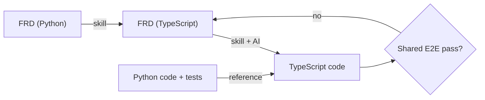

# FRD 0009 — TypeScript runtime (Copilot SDK)

## 1. Summary

We make a TypeScript version of the Hosted Skills runtime. It uses the same
authoring format as the Python runtime. It runs on the latest Copilot SDK. We
port the Python runtime one feature at a time, with AI help. The existing FRDs
and E2E tests are the specification. As with Swagger, one definition (the FRD)
generates more than one language: a skill converts each Python FRD into a
TypeScript FRD and then into TypeScript code.

## 2. Why

| Need | Reason |
| --- | --- |
| TypeScript support | Users ask for it. TypeScript users want an npm + Node app, not a Python app. |
| Latest Copilot SDK | We move from MAF to the Copilot SDK. The TypeScript SDK is the most advanced implementation. It gets new features first. |
| Dynamic Workflows | Workflow code cannot run in the sandbox. It must run in the host runtime. Thus TypeScript workflows need a TypeScript host runtime. |

### Options that we examined

| Option | Good | Bad | Result |
| --- | --- | --- | --- |
| A. Keep the Python runtime. Run only tools in TypeScript. | Small change. | The user must deploy a Python app. Two language stacks in one app. Dynamic Workflows cannot use TypeScript. The Python SDK is behind the TypeScript SDK. | Rejected |
| **B. Make a TypeScript runtime.** | Native npm/Node experience. Latest Copilot SDK. Supports Dynamic Workflows. The Copilot SDK does much of the runtime work, so the port is small. | Two runtimes to keep aligned. | **Selected** |

## 3. Design overview

- **Same specification.** The TypeScript runtime reads the same project:
  `*.agent.md`, `agents.config.yaml`, `mcp.json`, `skills/`. The behavior is the
  same as the Python runtime.
- **Convert only what is language-specific.** Keep everything else identical.

| Area | Python | TypeScript | Change |
| --- | --- | --- | --- |
| Authoring files (`*.agent.md`, `agents.config.yaml`, `mcp.json`, `skills/`) | Same | Same | None |
| User tools (`tools/`) | `tools/*.py`, `@tool` | `tools/*.ts`, `tool()` | Convert |
| Config schema | Pydantic | Zod (or equal) | Convert |
| Agent execution | MAF → Copilot SDK | Copilot SDK | Convert |
| Functions registration | `azure-functions` (Python) | `@azure/functions` v4 | Convert |
| Dynamic Workflows | `azure-functions-durable` | `durable-functions` (JS) | Convert |
| Entry point | `create_function_app()` | `createFunctionApp()` | Convert |

## 4. Migration plan

**Approach:** iterative and incremental.

1. Make a small core that works end to end first.
2. Port one feature at a time from the Python code. Use AI and the existing FRD
   for each feature.
3. Each feature is done when its E2E test passes against the TypeScript runtime.
4. Release early. Get feedback fast. Adjust.

We do not use formal approval gates until the migration is complete. A short PR
review is sufficient for each step.

### Spec-driven porting (Swagger-style)

The FRD is the language-neutral definition. The Python runtime is the reference
implementation. A skill (`port-to-typescript`) generates the TypeScript side.

| Step | Input | Output | Who |
| --- | --- | --- | --- |
| 1. Convert FRD | Python FRD | TypeScript FRD (only language-specific parts change, per §3 table) | Skill |
| 2. Generate code | TypeScript FRD + Python code | TypeScript code + tests | Skill + AI |
| 3. Verify | Shared E2E suite | Pass / fail | CI |
| 4. Review | PR | Fixes to FRD or code | Human |

For new features after the migration, the same flow applies: write the FRD once,
then generate each language.

### Priority

| Priority | Feature | Source FRD | Done when |
| --- | --- | --- | --- |
| **P0 — Core** | Project skeleton, npm package, `createFunctionApp()` | — | App starts in Functions host |
| P0 | Load `*.agent.md` + `agents.config.yaml`, merge, env substitution | — | Config scenario tests pass |
| P0 | Run agent with the Copilot SDK | — | Chat reply returns |
| P0 | HTTP trigger + built-in chat endpoints (REST, SSE) | — | E2E chat test passes |
| P0 | Shared E2E test harness for both runtimes | — | Same tests run on Python and TypeScript |
| P0 | `port-to-typescript` skill (FRD → TypeScript FRD → code) | — | Skill ports one P1 feature |
| **P1 — Capabilities** | Skills (`skills/`) + skill includes | 0002 | Skill E2E passes |
| P1 | User tools (`tools/*.ts`) | — | Tool E2E passes |
| P1 | MCP servers (`mcp.json`) | — | MCP E2E passes |
| P1 | Conversation history (file, blob) | — | Session resume E2E passes |
| P1 | `agents/` folder indexing | 0001 | Discovery tests pass |
| **P2 — Production** | Dynamic Workflows | 0004 | Workflow E2E passes |
| P2 | Endpoint authentication (API key, Entra ID) | 0006 | Auth E2E passes |
| P2 | Non-HTTP triggers | — | Trigger E2E passes |
| P2 | Observability (OpenTelemetry) | 0003 | Spans visible |
| **P3 — Advanced** | Multi-agent delegation | 0007 | Delegation E2E passes |
| P3 | `web_request` system tool | 0005 | Tool E2E passes |
| P3 | Harness-only agent configuration | 0008 | Config tests pass |
| P3 | Sandbox (`execute_python` and equal) | — | Sandbox E2E passes |

## 5. Decisions log

| # | Decision | Options considered | Choice | Decided by | Date |
| - | -------- | ------------------ | ------ | ---------- | ---- |
| 1 | How to support TypeScript | A. Python runtime + TypeScript tools / B. TypeScript runtime | B | Human | 2026-09-27 |
| 2 | Agent engine | MAF / Copilot SDK | Copilot SDK | Human | 2026-09-27 |
| 3 | Specification | New spec / Same spec as Python | Same spec; convert only language-specific parts | Human | 2026-09-27 |
| 4 | Migration method | Big rewrite / Incremental port with AI, FRD + E2E driven | Incremental port | Human | 2026-09-27 |
| 5 | Approval gates during migration | Formal gates / Light PR review | Light PR review until migration is complete | Human | 2026-09-27 |
| 6 | How to generate TypeScript | Manual port / Spec-driven (Swagger-style): skill converts FRD (Python) → FRD (TypeScript) → code | Spec-driven with a skill | Human | 2026-09-27 |

### Open questions

| # | Question |
| - | -------- |
| 1 | Repository layout: same repo (for example `typescript/`) or a new repo? |
| 2 | npm package name. |
| 3 | How to install the Copilot CLI in the Functions host, and its cold start cost. |
| 4 | Authentication and billing model for the Copilot SDK in a hosted app. |

## 6. Test plan

- [ ] One shared E2E suite runs against both runtimes.
- [ ] Reuse `tests/fixtures/config_scenarios/` as conformance fixtures.
- [ ] Each ported feature adds or reuses an E2E test before it is done.

## 7. Docs impact

- [ ] `README.md` — TypeScript quickstart
- [ ] `docs/getting-started.md` — TypeScript path
- [ ] `docs/architecture.md` — TypeScript module map (after P0)
- [ ] `.github/skills/port-to-typescript/SKILL.md` — new skill
- [ ] `docs/frds/README.md` — naming rule for TypeScript FRDs

## 8. Status & sign-off

- **Architecture review:** not started.
- **Human sign-off:** pending.
