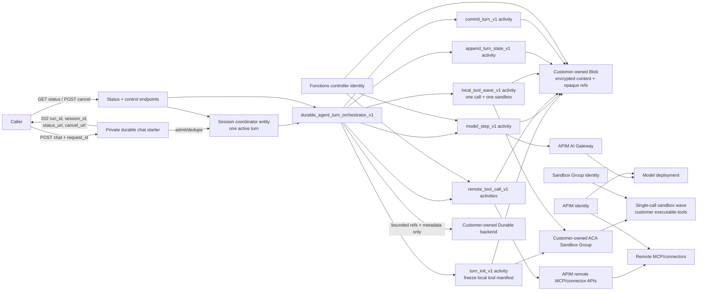

# FRD 0010 - Durable agent loop spike

## 1. Summary

**Feasibility verdict:** a normal agent turn can be made durable as an
experimental **step-level runner**, provided a Durable orchestrator owns the
model/tool loop. It is not feasible to make the existing `agent.run()` inner
loop step-durable by asking MAF `ChatMiddleware` or `FunctionMiddleware` to
schedule Durable activities. Middleware runs inside the current MAF call stack;
only an orchestrator can schedule an activity, yield, replay, and rehydrate
after the activity result is checkpointed.

The recommended spike disables MAF's automatic function invocation for the
step client, performs exactly one APIM-backed model call per model activity,
classifies the returned function-call contents in deterministic orchestrator
code, and schedules one Durable activity per remote tool call or one
single-call sandbox-wave activity per local tool call. Local filesystem
continuity crosses activities only through immutable workspace artifact refs,
not a live sandbox. Session coordination, turn journals, and final history
commit are durable. Raw prompt, argument, and result content is stored by
reference in customer-owned Blob storage rather than copied into Durable
history. The execution split and tool transport build on
[FRD 0009](0009-hybrid-sandbox-tool-execution-spike.md): model and privileged
remote MCP/connector calls remain worker-side through APIM, while local
customer executable tools run in customer-owned ACA Sandboxes.

This FRD prepares an architecture review only. It adds no product code, public
schema, deployment, Azure resource, or Azure call.

## 2. Motivation / problem

Today `runner.py` wraps one complete `agent.run()` for non-streaming execution
and one complete streaming `agent.run()` for SSE. MAF owns every inner model
and tool iteration. If the Functions worker fails after a tool side effect but
before the full turn returns, the platform can retry the turn only from its
outer boundary. The model can choose and execute already-completed work again.
The in-process session lock also does not serialize turns across worker
instances.

The existing Dynamic Workflows engine solves a different problem: an agent
authors an explicit coarse-grained DAG and Durable Functions executes its tool,
wait, and leaf-agent nodes in deterministic waves. A user should not need to
author a DAG to make an otherwise normal model/tool turn survive worker
restarts. The spike asks whether the runtime can retain the normal agent
experience while moving the inner loop boundary to Durable checkpoints.

### 2.1 Evidence and constraints

- [`runner.py`](../../src/azure_functions_agents/runner.py) currently awaits
  one full `agent.run()` at the non-streaming boundary and drives one full
  streaming `agent.run()` at the SSE boundary. The current lock is explicitly
  process-local.
- [`workflows/engine.py`](../../src/azure_functions_agents/workflows/engine.py)
  already demonstrates the required Durable rules: sort work deterministically,
  isolate I/O in activities, wait through yielded tasks, use external events
  for cancellation, and keep orchestrator code free of nondeterministic I/O.
- MAF's official
  [middleware documentation](https://learn.microsoft.com/en-us/agent-framework/concepts/agents/middleware/)
  says Python `ChatMiddleware` runs inside the function-invocation loop and
  executes once for **each model call**, including calls that send tool results
  back to the model. This makes it a useful policy, telemetry, or experimental
  replay-cache interception point. It does not turn middleware into a Durable
  scheduler or make the live Python call stack rehydratable.
- MAF's public chat-client
  [`FunctionInvocationConfiguration`](https://learn.microsoft.com/en-us/python/api/agent-framework-core/agent_framework.functioninvocationconfiguration?view=agent-framework-python-latest)
  exposes `enabled`, defaulting to `True`. The upstream implementation in
  [`agent_framework/_tools.py`](https://github.com/microsoft/agent-framework/blob/main/python/packages/core/agent_framework/_tools.py)
  bypasses the function invocation loop and directly returns the underlying
  chat response when that setting is false. Upstream tests assert that
  `client.function_invocation_configuration["enabled"] = False` executes no
  function. This is the viable public seam for receiving model-produced
  function-call contents without running the tools.
- The branch pins MAF `1.3.*`, while current upstream documentation and tests
  continue to evolve. Before product implementation, the contract simulator
  must prove the exact pinned client returns ordered function-call contents
  with auto-invocation disabled. Any MAF upgrade is a separate reviewed
  dependency decision.
- MAF's ordinary `Message` serialization excludes provider
  `raw_representation`. For the Responses API with `store=False`, later model
  steps can require provider-native response items, including encrypted
  reasoning content, function calls, and function results. The durable path
  must therefore persist and restore the provider-native item envelope rather
  than assume `Message.to_dict()` is a lossless checkpoint. The first slice is
  pinned to one qualified model/provider/API surface and fails closed when its
  encrypted-reasoning capability probe or item-equivalence test fails.
- The current MAF Durable Extension is turn-durable, not inner-loop durable.
  In
  [`AgentEntity.run()`](https://github.com/microsoft/agent-framework-durable-extension/blob/main/python/packages/durabletask/agent_framework_durabletask/_entities.py),
  the entity appends the request, invokes the complete `agent.run()` through
  `_invoke_agent`, and appends/persists the response only after the run returns.
  A crash mid-turn can therefore repeat completed tool work.
- MAF Workflow
  [checkpoints](https://learn.microsoft.com/en-us/agent-framework/workflows/checkpoints)
  are created at the end of a superstep, after every executor in that
  superstep completes. They are valuable at executor/workflow boundaries, but
  do not checkpoint the private model/tool iterations inside an executor's
  `agent.run()`.
- [FRD 0009](0009-hybrid-sandbox-tool-execution-spike.md) and
  [`experimental/hybrid_tools.py`](../../src/azure_functions_agents/experimental/hybrid_tools.py)
  establish the APIM/worker/ACA trust split and a sandbox file journal keyed by
  `call_id`. The existing `InvocationSandboxLease` is in-memory,
  create-new/delete-only, and scoped to one whole MAF invocation; it cannot be
  reused directly by Durable activities.
- The generic transport already supports typed `SandboxSessionProvider.attach`
  and `resume`, with `AcaSandboxAdapter._attach_handle` rebuilding a handle
  from persisted sandbox/group/region identity and
  `ExpectedSandboxManifestBinding` enforcing a live manifest handshake.
  Credentials are constructed by each adapter and must never be persisted.
- The current sandbox journal treats an existing result filename as a duplicate
  `call_id`, but does not bind that ID to a canonical request hash. Its
  `asyncio.Lock` serializes only one worker process. Dedupe survives only while
  the same sandbox disk and journal survive.
- This branch resolves `azure-functions-durable==1.6.0`. Its
  `continue_as_new(input_)` API has no pending-event preservation option.
  Approval and callback payloads must be committed as durable facts before an
  external event is raised; the event is only a wake-up hint. Durable Entity
  registration and cross-host behavior are also a Gate-0 proof on this exact
  package/backend combination, not an assumed contract.

## 3. Goals / Non-goals

**Goals**

- Prove that a private, non-streaming HTTP chat starter can run one ordinary
  model/tool turn as a sequence of Durable model and tool activities.
- Checkpoint after every model response and every tool result so recovery
  replays orchestrator code without normally redispatching completed
  activities.
- Serialize turns for one session across Functions instances and atomically
  promote only a completed turn into committed history.
- Preserve the FRD 0009 trust split: APIM-backed model and privileged remote
  MCP/connectors in the worker; local executable tools in customer-owned ACA.
- Use typed, versioned, bounded activity and storage contracts with immutable
  policy, catalog, deployment, and content-integrity bindings.
- Prove provider-native Responses item fidelity across every model checkpoint
  for one pinned model/provider/API surface.
- Make at-least-once activity semantics and external-side-effect ambiguity
  explicit. Prove supported idempotency paths; never claim exactly once.
- Keep sensitive content out of Durable history, status payloads, dashboard
  custom status, metrics, and default traces.
- Qualify recovery, cancellation, approval waits, deployment compatibility,
  sandbox cleanup, and bounded resource/cost behavior with fault injection.
- Define measurable go/no-go gates before any production design is considered.

**Non-goals**

- Finalizing this FRD or implementing before explicit human architecture
  sign-off.
- A public front-matter/config schema, compatibility promise, or production
  support level.
- Dynamically scheduling Durable activities from `ChatMiddleware`,
  `FunctionMiddleware`, or from inside an existing full `agent.run()`.
- Making arbitrary external tools exactly once. MCP has no universal
  idempotency contract.
- True replayable token streaming. Reliable Redis-backed streaming is a
  separate follow-up.
- Declared triggers, agent-as-MCP starters, subagents, or every connector in the
  first slice. Remote MCP remains in the end-to-end qualification.
- Replacing or merging Dynamic Workflows.
- Running model clients, model credentials, remote MCP clients, or connector
  credentials in the sandbox.
- Trusted ACA snapshot create/restore. The current runtime does not provide the
  required labeled, egress-bound, environment-bound restore contract.
- Unbounded autonomous or hours-long loops.

## 4. Proposed design

### 4.1 Feasibility verdict and alternatives

| Alternative | What it provides | Inner-loop verdict |
| --- | --- | --- |
| One activity wrapping full `agent.run()` | Minimal integration and turn-level retry | **Reject.** A completed activity is durable only after the whole turn returns; a mid-turn crash can repeat model calls and tool side effects. |
| MAF Durable Extension entity or MAF Workflow checkpoints | Useful session/orchestration concepts, entity state, executor/superstep recovery | **Reuse concepts, reject as the inner-loop solution.** `AgentEntity.run()` wraps the full run; Workflow checkpoints are superstep boundaries, not private inner model/tool boundaries. |
| Middleware replay cache | `ChatMiddleware` can observe every model call and `FunctionMiddleware` every tool call | **Fallback experiment only.** A retried full run starts at the beginning and correctness depends on the same middleware/tool sequence and deterministic lookup. Middleware cannot yield a Durable activity or rehydrate the MAF stack. |
| Custom step-level Durable orchestrator using the public MAF one-step seam | One checkpointable activity per model call and tool call, with explicit state and policy | **Recommend.** Set the step client's `function_invocation_configuration` to `{"enabled": False}` (or the equivalent mapping assignment), retain function schemas, and return model text/function-call contents without auto-invoking tools. |

The spike may call the chat client's `get_response` directly or use a
one-step `Agent.run()` wrapper, but the model activity must prove that exactly
one underlying model request occurs and no function implementation can run.
The direct client path is preferred because it makes the single-call invariant
easier to test. MAF middleware may remain around that one call for policy and
telemetry; it is not the scheduler.

### 4.2 Pipeline mapping and likely modules

The experimental gate is private and absent by default. No `schema.py`,
front-matter, `agents.config.yaml`, or discovery convention changes in the
spike.

| Pipeline stage | Module(s) | Change |
| --- | --- | --- |
| discover | Existing `discovery/tools.py`, `discovery/mcp.py`, FRD 0009 hybrid discovery path | No new authoring discovery. Reuse the immutable tool/MCP inventory and sandbox-discovered local manifest; do not import customer tools in the worker. |
| translate | New `experimental/durable_loop_protocol.py`; existing `registration/capabilities.py`, `registration/catalog.py`, `experimental/hybrid_protocol.py` | Freeze versioned run, model-decision, tool, error, content-ref, policy, and sandbox-wave contracts. Bind agent/catalog/deployment/package hashes before admission. |
| register | `app.py`, `registration/endpoints.py`, `registration/_handlers.py`, likely new `experimental/durable_loop_registration.py` | Under one private env gate, register the non-streaming starter, status/cancel routes, session coordinator/entity, `durable_agent_turn_orchestrator_v1`, and versioned activities. Registration remains the only Azure-aware startup stage. |
| execute | New `experimental/durable_loop.py`, `experimental/durable_loop_activities.py`; existing `client_manager.py`, `workflows/engine.py` patterns, `experimental/hybrid_*`, `transport/*` | The orchestrator owns the alternating model/tool loop. Activities read/write content refs, authorize against frozen policy, call APIM model/MCP routes or bounded ACA wave sandboxes, checkpoint results, and atomically commit final history. Existing `runner.py` remains the normal non-durable path. |

`experimental/durable_loop.py` contains deterministic orchestration and
classification only. `experimental/durable_loop_activities.py` owns I/O,
credentials, APIM clients, Blob access, policy revalidation, ACA transport, and
session-store operations. `experimental/durable_loop_protocol.py` contains no
Azure SDK types. Registration may later be folded into existing endpoint
helpers, but the spike should keep its private wiring visibly isolated.

### 4.3 Component architecture



The Durable backend, content Blob account/container, and ACA Sandbox Group are
customer-owned. The Function App controller, APIM, and Sandbox Group use
separate least-privileged identities. The sandbox receives no model, APIM,
Durable, Blob, MCP, or connector credential.

### 4.4 Turn sequence and recovery

```mermaid
sequenceDiagram
    autonumber
    participant C as Caller
    participant H as HTTP starter
    participant S as Session coordinator entity
    participant O as durable_agent_turn_orchestrator_v1
    participant I as turn_init_v1 activity
    participant M as model_step_v1 activity
    participant T as tool_call_v1 activity
    participant J as state_ref_v1 activities
    participant B as Blob refs
    participant A as APIM model/MCP
    participant X as ACA sandbox wave

    C->>H: POST message + request_id
    H->>S: Admit immutable run identity/request hash
    S-->>H: New run or existing deduped run
    H->>O: Start deterministic run_id
    H-->>C: 202 + run_id/session_id/status_url/cancel_url

    O->>I: Discover exact local tool manifest
    I->>X: Create, package, discover
    I->>B: Persist canonical manifest/package/catalog hash
    I->>X: Delete initialization sandbox
    I-->>O: Frozen manifest ref + hash

    loop Bounded model steps
        O->>M: Schedule model step with transcript/state refs
        M->>B: Read transcript refs
        M->>A: One model request, store=False, auto tools disabled
        M->>B: Persist decision content, args, integrity hashes
        M-->>O: Bounded ModelDecisionEnvelopeV1
        Note over O: Deterministically classify final text, approval, or ordered tool calls
        alt Local executable call
            O->>T: One single-call sandbox-wave activity
            T->>B: Read previous immutable workspace ref
            T->>X: Create, restore workspace, rediscover and verify manifest
            T->>X: Execute exactly one local call
            T->>B: Persist result + next immutable workspace ref
            T->>X: Delete sandbox
            T-->>O: ToolResultV1 + WorkspaceRefV1
        else Remote MCP/connector
            par Stable ordered safe read-only calls
                O->>T: One activity per call
                T->>A: APIM remote operation
                T->>B: Persist result ref
                T-->>O: ToolResultV1
            end
        end
        O->>J: Append model/tool refs to in-progress turn state
        J->>B: Compare-and-swap immutable state ref
        J-->>O: CheckpointStateRefV1
    end

    O->>S: Atomically commit final response/history ref; clear active turn
    S-->>O: Committed generation

    Note over O,T: On worker restart, orchestrator code replays from the beginning.
    Note over O,T: Completed activity results come from Durable history; semantic work resumes after the last checkpoint.
```

The orchestrator never reads Blob, APIM, ACA, random values, environment
settings, or wall-clock time directly. It uses only its immutable input,
Durable context time/IDs, prior yielded results, stable sorting, Durable timers,
and external events.

### 4.5 Typed/versioned contracts and storage

All contracts are JSON-safe, `extra="forbid"`, size-bounded, and carry an
explicit `schema_version`. Unknown versions fail closed.

| Contract | Required contents |
| --- | --- |
| `DurableRunIdentityV1` | Immutable `run_id`, `session_id`, hashed idempotency `request_id`, request hash, agent slug, agent/catalog/deployment/tool-package/policy hashes, orchestration version, created time, absolute deadlines, budget policy. |
| `ContentRefV1` | Opaque storage reference, SHA-256 integrity hash, byte length, media/content type, encryption/key version metadata, retention class. Never a SAS/token/credential. |
| `ProviderItemBundleV1` | Opaque ref to the lossless provider-native Responses item sequence, including function calls/results and encrypted reasoning content when required; API/model/version binding and canonical bundle hash. |
| `ToolManifestV1` | Canonical sandbox-discovered tool names, descriptions, parameter schemas, provenance, package/catalog hash, and manifest hash frozen by `turn_init_v1`. |
| `WorkspaceRefV1` | Immutable verified archive of the bounded local workspace after one call, with parent ref, package/manifest binding, integrity hash, byte/file caps, and no credential material. |
| `ModelDecisionEnvelopeV1` | Run/step identity, deterministic model call key, provider response/call ID when returned, model/deployment hash, provider-native item bundle ref, ordered tool-call summaries, usage/cost metadata, finish reason, retry attempt metadata. |
| `ToolRequestV1` | Run/step/call ordinal, provider call ID, runtime deterministic call key, tool name/provenance, canonical request hash, argument ref, policy/catalog/package hashes, deadline, approval ref if required, optional sandbox-wave lease ref. |
| `ToolResultV1` | Matching call key and request hash, status, bounded result/stdout/stderr/artifact refs, provider operation ID where safe, timing, dedupe/reconciliation disposition. |
| `ErrorEnvelopeV1` | Stable bounded error code/classification, retryability, ambiguity classification, failed phase/step/call, sanitized detail ref where allowed; no raw exception content in status/history. |
| `CheckpointStateRefV1` | External in-progress turn-state ref and integrity hash, completed step/call set, next deterministic step, committed session generation, continue-as-new generation. |
| `SandboxWaveLeaseV1` | Opaque lease ID plus persisted sandbox/group/region binding, manifest/package/policy hashes, fencing generation, expiry, selected artifact refs, lifecycle state. Stored outside metrics and never contains credentials. |

`run_id` is server-minted and immutable. A runtime call key is derived
deterministically from the version, run ID, committed model-step index,
call ordinal, committed model-decision hash, and normalized tool identity.
Provider call IDs are recorded separately because they are correlation values,
not stable idempotency keys. Each call key is bound to a canonical request hash
over tool identity, arguments, policy/catalog/package hashes, and relevant
workspace or lease generation. Reuse of a call key with a different request
hash is corruption and fails closed; it must never return the previous result.

Raw user prompts, assembled transcripts, provider-native model items, tool
arguments/results, stdout/stderr, approvals, and selected workspace artifacts
live in a dedicated customer-owned Blob account protected by service encryption
at rest, RBAC, network controls, and optional account-level CMK policy. Durable
history, entity state, dashboard custom status, and activity envelopes contain
only bounded refs, integrity hashes, byte counts, status, and low-cardinality
metadata. The commit-once substrate uses immutable block blobs with
`If-None-Match` and ETag compare-and-swap; the existing append-blob history
provider is not used for turn transactions. Content refs have caps, retention
categories, purge support, and no embedded authorization tokens. Integrity is
checked on every read before use.

### 4.6 Session management and final commit

One session coordinator entity serializes turn admission across Functions
instances. It holds only:

- the committed history `ContentRefV1` and generation;
- immutable session/owner/agent policy bindings;
- active `run_id`, request hash, status, deadline, and in-progress state ref;
- a bounded idempotency index from hashed request ID to run/result reference;
- a bounded cancellation/approval mailbox and retention metadata.

The detailed in-progress turn journal is separate from committed history.
Model and tool activities append immutable refs to that journal. Failed,
timed-out, or cancelled turns may retain a short-lived audit/error journal but
never mutate committed history.

Admission is idempotent. Repeating the same session/request ID and request hash
returns the existing run and URLs; the same ID with a different hash fails with
`409 idempotency_conflict`. A different request while a turn is active is
rejected with `409 session_busy` in the first spike rather than silently
queued. The entity/coordinator contract and deterministic orchestration
instance ID must reconcile the ambiguity between admitting and receiving the
start acknowledgement.

`commit_turn_v1` validates the active run, expected committed generation,
terminal final response ref, policy/catalog hashes, and complete call set. The
entity then atomically promotes the completed turn's history ref, increments
the committed generation, terminalizes the run, and clears the active slot.
Stale, failed, cancelled, or differently fenced runs cannot commit. The
committed response is authoritative if a provider response is later observed
for an uncommitted or ambiguous attempt.

### 4.7 Activities and tool routing

`turn_init_v1`:

- creates a disposable customer-owned ACA Sandbox without importing customer
  tool modules in the Functions worker;
- delivers the exact package, discovers the local tool schemas in ACA, and
  persists a canonical `ToolManifestV1` plus package/catalog hash;
- deletes the initialization sandbox; and
- freezes that manifest for the run. Every later local activity rediscovers
  its sandbox manifest and compares the exact hash before execution.

`model_step_v1`:

- rebuilds the APIM model client and credential per activity;
- reads and verifies the complete transcript from committed-history and current
  turn refs;
- authorizes the current immutable agent policy/catalog/deployment hashes;
- uses the same FRD 0009 APIM AI Gateway route with `store=False`, no APIM
  retry, no semantic cache, and no prompt/completion body logging;
- uses only the pinned, startup-probed model/provider/API surface, requests the
  provider-native encrypted reasoning representation when required, and
  restores prior provider-native items losslessly;
- presents tool schemas but disables automatic function invocation with
  `function_invocation_configuration={"enabled": False}` or the pinned
  client's equivalent mapping setting;
- performs one model request, persists the complete provider-native response
  item bundle and raw call arguments by ref, and returns a bounded decision
  envelope;
- may internally use a streaming provider call to measure TTFT, but publishes
  no client token stream and checkpoints only a complete response.

There is one Durable activity instance per model call and per remote tool call.
For local execution, one `local_tool_wave_v1` activity is a wave of exactly one
logical tool call and owns restore, sandbox create, manifest verification,
execution, workspace export, and deletion. The one-call cardinality preserves
the requested checkpoint after each local result. Multi-call waves are a later
latency optimization because their calls cannot be independently retried.

Every activity reauthorizes the request against the immutable run
agent/catalog/policy/deployment hashes and the activity's current registered
tool contract. Removed or changed tools, package drift, policy mismatch,
unexpected provenance, and authorization loss fail closed. The model cannot
grant itself capabilities through prompt output.

Tool routing is:

- **Local executable tool:** a customer-owned single-call ACA wave. The
  activity restores the prior immutable workspace ref, creates and verifies a
  fresh sandbox against the frozen manifest, binds `call_key` to
  `request_hash`, executes one call, exports the next workspace ref, and
  deletes the sandbox before returning.
- **Remote MCP or connector:** a privileged worker-side activity through its
  approved APIM API where applicable. Read-only calls may fan out; writes
  require provider idempotency/outbox policy.
- **Approval-gated tool:** no activity runs until an authenticated external
  approval event matches the run, call key, request hash, policy version,
  actor, expiry, and nonce.

"Read-only" and "safe to parallelize" are explicit operator-authored capability
metadata, not properties the runtime infers from a tool name or description.
Remote calls are serialized by default unless the frozen policy explicitly
allows parallel execution and the activity revalidates that classification.

### 4.8 ACA lifecycle alternatives and recommendation

| Scope | Benefits | Risks | Spike choice |
| --- | --- | --- | --- |
| One sandbox for the full Durable turn | Easiest filesystem continuity; journal survives all steps | Retains capacity/code/disk across model latency and approval waits; depends on long-lived executor readiness and fencing | Not the default. Optional short-turn optimization only after dedicated attach/resume/executor-readiness and durable-fencing qualification. |
| One sandbox per local tool call | Checkpoint granularity matches the tool-call boundary; bounds capacity, retention, credential lifetime, and cleanup | Pays create/restore/export/delete cost for every call; requires immutable workspace artifacts | **Default: one fresh single-call sandbox wave per local call.** |
| Multi-call live-sandbox wave | Lower latency and natural filesystem continuity | The wave, not each call, is the safe retry unit; a crash may redo completed sibling calls | Defer. It can be added only as one Durable wave activity with weaker checkpoint granularity, or with a separately proven durable fence. |
| Recreate from ACA snapshot | Could reduce package/start cost | No proven trusted restore path preserving required labels, egress, environment, manifest, and package bindings | Reject for v1. Use external selected-artifact checkpointing instead. |

The first slice sets local wave cardinality to one and serializes local calls
in stable order. Each `local_tool_wave_v1` activity rebuilds managed identity
credentials, restores the prior verified `WorkspaceRefV1`, creates one fresh
sandbox, rediscovers and compares the exact frozen manifest/package hash,
executes one request-hash-bound call, exports the next immutable workspace
archive, and requests deletion. Tokens and credential objects are never
persisted. Auto-delete and an app/run-labeled reaper are independent backstops.
The next local call restores the prior activity's workspace ref; arbitrary
process state is never carried forward.

The current `InvocationSandboxLease` cannot implement this lifecycle directly:
it always creates a new in-memory lease, owns a process-local queue lock, and
deletes/closes at invocation end. Its protocol, packaging, APIM split, executor,
and transport primitives can be factored or reused, but Durable wave ownership
requires a new persisted lease record, durable fence, request-hash binding, and
attach/resume path.

Attach/resume across workers is technically feasible in the generic transport,
but it is not required by the base single-call design. It remains an
end-to-end gate only for a later retained-sandbox optimization. If
cross-worker attach, strict manifest revalidation, executor readiness, or
fencing fails, that optimization stays disabled. The base fallback remains a
fresh one-call sandbox wave plus explicit external artifact transfer, not ACA
snapshot recreation.

### 4.9 Failure semantics and the exactly-once truth

- Durable replay runs orchestrator generator code from the beginning.
  Completed activity results are supplied from Durable history rather than
  normally redispatched, so semantic work resumes from the last yielded
  checkpoint.
- Durable activities are **at least once**. A worker can complete an external
  side effect and fail before the activity completion acknowledgement reaches
  the Durable backend. Retrying that activity creates an ambiguity window.
- Deterministic call keys plus request hashes and the sandbox journal dedupe
  local calls only while that same journal/disk survives. They do not prove an
  external effect exactly once. The existing result-file journal must be
  hardened to reject the same call ID with changed arguments.
- The existing in-memory queue lock does not coordinate concurrent workers.
  Initial local mutations are orchestrator-serialized. A local activity may
  commit the next workspace ref only when its expected parent ref/generation
  still matches through Blob/entity compare-and-swap.
- There remains a local ambiguity window if a tool makes a side effect after
  execution starts but before the result is durably renamed/checkpointed.
  Unsafe non-idempotent local tools require explicit policy classification,
  an application idempotency key/outbox, or rejection.
- Remote MCP/connectors require end-to-end idempotency keys, a transactional
  outbox with provider reconciliation, or a provider lookup keyed by the
  runtime call key. MCP itself has no universal idempotency guarantee.
- Production must fail closed for tools whose side effects cannot be
  classified/reconciled, or require explicit operator acceptance. It must
  never advertise exactly once.
- A model request may repeat if the provider produced a response but the model
  activity lost it before Durable acknowledgement. This can add cost and
  nondeterminism, but model calls do not directly execute local tools because
  auto-invocation is disabled. The checkpointed, committed response is
  authoritative.
- Cancellation is cooperative. It stops new work and schedules cleanup, but
  cannot undo a side effect already in progress. The reaper covers worker loss
  before cleanup scheduling/acknowledgement.

Retry policies are provenance-specific. Model calls and safe reads use bounded
exponential retries within the run budget. A write activity is retried only
when its idempotency/reconciliation contract permits it; otherwise ambiguity
is surfaced for operator decision. Broad catch-and-continue behavior is
forbidden.

### 4.10 Deterministic control flow, waits, cancellation, and versioning

- Model steps and tool calls receive monotonic integer indexes. Model-emitted
  calls retain response order; stable ordering uses `(step_index, call_ordinal,
  call_key)`, never unordered collection iteration.
- Parallel tool calls use stable fan-out and aligned fan-in. Initial local
  sandbox mutations are serialized. Independently authorized remote calls
  explicitly classified as read-only and parallel-safe may run in parallel up
  to the immutable parallelism cap; all others remain serialized.
- Approval and callback endpoints first persist authenticated, nonce-bound
  payloads as compare-and-swap durable facts. They then raise an external event
  only as a wake-up hint. Every orchestration generation rereads the durable
  mailbox before waiting, so a dropped event does not drop the approval.
- Each activity has a deadline, bounded attempts, retry classification, and
  remaining run budget. The orchestrator uses Durable context time only.
- Cancellation marks intent in the session coordinator, raises the external
  event, stops scheduling new model/tool work, waits boundedly for in-flight
  work, and schedules wave cleanup. Auto-delete/reaper remain mandatory because
  termination can interrupt cleanup itself.
- On the pinned Durable Functions 1.6.0 API, `continue_as_new` has no
  `save_events` option. It therefore occurs only at a quiescent checkpoint with
  no pending activity/timer task, after mailbox facts have been committed. The
  next generation rereads those facts and carries only
  `CheckpointStateRefV1`, immutable identity/policy hashes, counters, deadlines,
  and budgets; the full turn state remains in external customer-owned storage.
- Orchestrator/activity names, input/output contracts, and schema versions are
  versioned (`*_v1`). In-flight runs stay on compatible code. Deployment
  manifests retain required old handlers until no run references them.
- An immutable deployment/catalog/tool-package hash is checked in every
  activity. Removed or changed tools fail closed rather than dispatching to a
  new implementation. Nondeterministic changes to in-flight orchestrator code
  are prohibited; incompatible behavior ships under a new orchestrator name.

### 4.11 Security and privacy

- Customer ownership is required for the Durable backend/history, content Blob
  storage, and ACA Sandbox Group. Encryption at rest, RBAC, private endpoints,
  network isolation, backup policy, retention, legal hold/purge behavior, and
  customer-managed-key requirements are deployment decisions that must be
  threat-modeled before production.
- The Functions controller identity receives only the exact Durable, Blob,
  APIM, and Sandbox Group operations it needs. APIM has separate backend
  identities. The Sandbox Group identity is distinct and receives only
  approved sandbox workload grants.
- Sandbox egress is deny by default with Full inspection and explicit hosts.
  Model/APIM/Durable/Blob/MCP credentials are never put in the sandbox.
- Durable state is a new sensitive-data surface. Raw content is excluded from
  Durable input/output, entity state, custom status, dashboard, logs, metrics,
  and default traces. Content refs are opaque, bounded, integrity-checked, and
  purged with their session/run retention policy.
- Run, session, sandbox, group, provider call, and lease IDs are internal
  metadata rather than credentials, but they are high-cardinality and can aid
  correlation; redact them from metric dimensions and default user status.
- W3C trace correlation uses trace context and bounded phase/provenance
  dimensions. Sensitive-content telemetry stays off by default.
- Activity authorization treats model text, tool names/arguments, remote MCP
  output, connector output, and restored workspace artifacts as untrusted.
  Prompt/tool-output injection cannot alter immutable policy or select an
  unregistered tool.
- Package and restored-artifact hashes, strict archive/path handling, symlink
  rules, output caps, and manifest binding protect sandbox integrity.
- Cross-tenant owner/session/run bindings, replay authorization, approval actor
  authenticity, callback nonce/expiry, SSRF controls, inspected egress, and
  connector audience validation fail closed.

### 4.12 Private product/API shape

The spike registers only a built-in, non-streaming HTTP chat path behind a
private environment gate. A representative response is:

```http
HTTP/1.1 202 Accepted
Content-Type: application/json

{
  "run_id": "server-minted-id",
  "session_id": "server-minted-id",
  "status": "Pending",
  "status_url": "/api/experimental/durable-agent-runs/<run_id>",
  "cancel_url": "/api/experimental/durable-agent-runs/<run_id>/cancel"
}
```

The request requires a client `request_id`; duplicate IDs with the same
canonical request hash return the same `run_id`. Authentication/owner binding
matches the existing built-in endpoint policy and is rechecked for status,
cancel, approval, and callback operations.

The starter and management endpoints reuse the async run vocabulary already
defined by `docs/aca-sandbox-session-runtime.md`: `Idempotency-Key` plus body
hash, accepted/provisioning/settling/terminal phases, status/result/cancel
links, `possibly_committed`/`Ambiguous` handling for uncertain writes, and
`410 Gone` after retained state expires. This spike adds durable model/tool
phases without creating a third incompatible run-management state machine.

The status contract exposes only:

- `Pending`, `Running`, `Waiting`, `Completed`, `Failed`, or `Cancelled`;
- run/session IDs, created/updated times, current bounded phase and step index;
- completed model/tool counts and aggregate budget usage;
- approval/callback requirement metadata that contains no raw prompt,
  arguments, or result;
- final response ref retrieval through an authorized content endpoint, or a
  sanitized error code.

Initial clients poll status. Optional durable progress events can update a
bounded status projection, but partial tokens are not replayed as a true model
stream. Reliable Redis streaming is a separate design. Declared triggers and
agent-as-MCP starters are later slices; one read-only remote MCP tool through
APIM is mandatory in the first end-to-end qualification.

### 4.13 Resource and safety budgets

Every run snapshots a server-enforced budget. The initial candidate defaults
are intentionally conservative and may be tightened by measured evidence:

| Budget | Candidate spike cap |
| --- | --- |
| Model steps | 12 |
| Total tool calls | 32 |
| Parallel safe remote reads | 4 |
| Local sandbox mutations | 1 at a time |
| Autonomous active execution | 4 hours, still bounded by step/tool/token/cost caps |
| Approval-parked absolute lifetime | 24 hours, then fail/cancel and clean up |
| Model token budget | 200,000 aggregate input + output tokens |
| Cost budget | Explicit deployment-specific cap, default USD 5 equivalent |
| Durable activity attempts | 3 for model/safe reads; writes follow idempotency policy and may be 1 |
| Durable activity envelope | 32 KiB, refs/metadata only |
| Tool argument / result content | 256 KiB / 1 MiB per call |
| Run external content | 32 MiB |
| Transcript supplied to one model step | 4 MiB and the pinned model context/token limit; reject before O(n²) reread growth exceeds the run budget |
| Local-tool wave | Exactly 1 call and 5 minutes |
| Hosting / activity timeout | Flex Consumption spike with `functionTimeout` 10 minutes; every activity deadline <=8 minutes and every local tool deadline <=5 minutes |
| Sandbox lifecycle | Delete after wave; 10-minute auto-delete/reaper target |
| Continue-as-new | At most 20 checkpoints or 200 history events per generation |

Caps are checked before scheduling and after every activity. A cap breach
produces a typed terminal failure, stops new work, and still schedules cleanup.
The spike rejects unbounded model loops, tool loops, retries, payloads,
parallelism, spend, sandbox retention, and autonomous hours-long execution.

### 4.14 Observability and qualification metrics

W3C context links run -> model step -> tool call across Functions, Durable
activities, APIM, remote MCP, and the sandbox file protocol. Metrics use bounded
dimensions such as activity kind, tool provenance, outcome, retry class, and
deployment class; content and high-cardinality IDs are excluded by default.

Required measurements:

- total wall latency, active compute, parked/wait time, recovery/replay count,
  recovery catch-up time, checkpoint latency/bytes, continue-as-new count, and
  Durable history events/bytes;
- model/APIM latency, backend latency, TTFT, tokens, cost, attempts, 429s,
  timeouts, and response-loss ambiguity;
- MCP/APIM latency, backend latency, attempts, throttles, and failures;
- tool queue, execution, transfer, attempts, retries, dedupe hits, ambiguity,
  and artifact bytes;
- sandbox create, attach, resume, readiness, restore, snapshot-to-Blob,
  lifecycle policy, delete, reaper, retained capacity, and orphan age;
- run/session throughput, concurrent active runs, busy/idempotency conflicts,
  terminal outcomes, errors, and cost.

### 4.15 End-to-end and fault-injection qualification

The reference turn requires at least three model steps, two serialized local
ACA calls in sequential single-call waves that share logical workspace through
an immutable artifact ref, one read-only remote MCP call through APIM, and one
synthetic idempotent external write/counter. It must produce a deterministic
final answer from all four effects.

Faults are injected:

- after the model response is persisted but before activity acknowledgement;
- after a sandbox side effect but before sandbox result rename and separately
  after rename but before Durable activity acknowledgement;
- after the tool result checkpoint;
- during APIM 429 and timeout responses for model and MCP;
- during sandbox create, workspace restore/export, executor loss, and complete
  sandbox loss; the optional retained-sandbox gate separately injects
  auto-suspend and attach/resume failures;
- on duplicate HTTP requests, duplicate queue/event delivery, duplicate
  approvals, and conflicting request hashes;
- during host restart, worker replacement, scale-to-zero, cancellation, and a
  deployment-compatible restart;
- immediately before and after continue-as-new and final session commit.

For each planned seam, kill/restart the worker and assert:

- final output and committed history are correct;
- a completed activity is replayed from history rather than redispatched;
- the synthetic supported write has one committed logical effect;
- ambiguous unsafe writes are not silently reported as success;
- duplicate request IDs resolve to one run;
- failed/cancelled attempts do not change committed history;
- restored workspace artifact hashes match;
- no content appears in Durable/dashboard/status/metric leak scans; and
- final app-owned sandbox inventory reaches zero within the cleanup bound.

### 4.16 Measurable go/no-go gates

| Gate | Go | No-go consequence |
| --- | --- | --- |
| Public MAF one-step seam | Pinned dependency executes exactly one model request, exposes ordered function-call contents, and invokes zero tools with auto-invocation disabled in 100% of contract tests. | **Architecture no-go:** do not implement by middleware or private MAF internals. Revisit only with a supported public hook. |
| Provider-native transcript fidelity | One pinned model/provider/API passes its encrypted-reasoning capability probe and a >=3-step in-process-versus-durable comparison with item-equivalent function/reasoning/result transcripts. | **Architecture no-go:** ordinary MAF message serialization is not an acceptable fallback. |
| Session substrate | On resolved Durable Functions 1.6.0, entity trigger/call/signal and fencing survive host replacement on every claimed backend; otherwise the deterministic singleton-orchestration + block-Blob lease fallback passes the same tests. | **Architecture no-go** if neither substrate proves one active turn and one commit. |
| Frozen local tool catalog | `turn_init_v1` discovers without worker import; every later sandbox matches the canonical manifest/package/catalog hash or fails closed. | **Architecture no-go.** |
| Durable replay | Across every injected restart seam, all already-acknowledged model/tool activities show zero redispatches and recovery catch-up p95 is <=60 seconds excluding provider latency. | **Architecture no-go** if acknowledged work repeats; otherwise investigate performance before broader use. |
| Session correctness | Twenty-five concurrent cross-process submissions yield at most one active turn; duplicate IDs dedupe 100%; conflicting hashes fail; only the expected generation commits. | **Architecture no-go.** |
| Side-effect truth | Across at least 100 ambiguity-window trials, the synthetic idempotent write has one logical committed effect; unsafe/unreconciled writes fail closed or surface `Ambiguous`, never false success. | **Architecture no-go** for general tool enablement if classification cannot be enforced. |
| ACA single-call recovery | Two sequential create/restore/manifest-check/execute/export/delete activities preserve the exact workspace artifact chain and pass 20/20 live trials, including activity retry from the prior committed ref. | **Architecture no-go** for local tools until immutable artifact transfer is reliable. |
| Run-scoped ACA optimization | Dedicated short-turn attach/resume/executor-ready/fencing trials pass 100/100 with bounded retained capacity. | Disable the optimization; this does not block per-wave v1. |
| Privacy | Automated inspection finds zero raw prompts, args, outputs, credentials, tokens, sandbox IDs, Blob paths, SAS values, or authorization-bearing refs in Durable history/dashboard/metrics/default traces. Durable history may contain only opaque content IDs, hashes, sizes, and bounded classifications. | **Architecture no-go.** |
| Bounded history/content | Activity envelopes stay <=32 KiB; generation stays <=200 events; continue-as-new preserves output and budgets; integrity/cap violations fail closed. | **Architecture no-go.** |
| Approval continuation | A fact committed immediately before/after continue-as-new is observed exactly once despite lost/duplicate wake-up events; no continuation occurs with pending Durable tasks. | **Architecture no-go** for waits/approvals. |
| Hosting timeout | The pinned plan honors the configured 10-minute `functionTimeout`; all activity/tool deadlines terminate within their safety margins under host replacement. | **Architecture no-go** until retry ambiguity is bounded. |
| Cleanup | After normal, failure, cancellation, and worker-loss trials, final app-owned sandbox inventory is zero within 10 minutes in 100% of runs; reaper proves ownership filtering. | **Architecture no-go** until cleanup/capacity is bounded. |
| Cost/latency | Report p50/p95/p99 wall, active/parked, checkpoint, APIM, tool, sandbox, and recovery costs under the fixed workload with no unbounded growth. | No production recommendation; optimize or narrow scope before follow-up. |

Any architecture no-go gate stops the spike from advancing to a public or
production design. It must not be waived by documenting the failure.

### 4.17 Phased implementation plan after sign-off

1. **Gate-0 platform proof:** on the exact lock (`azure-functions-durable`
   1.6.0), prove entity registration/call/signal/fencing and host recovery on
   each claimed backend; prove the singleton-orchestration + block-Blob lease
   fallback before selecting the session substrate.
2. **Contract and loop simulator:** implement only pure versioned contracts,
   deterministic classification, fake content refs, the pinned MAF one-step
   contract, provider-native item equivalence, budgets, and replay simulations.
3. **Local Durable backend:** run the orchestrator, session coordinator/entity,
   activities, idempotent admission, cancellation, external events, and
   continue-as-new against Azurite or Durable Task Scheduler.
4. **APIM model:** connect one-step `store=False` model activities through the
   existing AI Gateway route; prove no tool auto-invocation and collect cost/
   latency/retry evidence.
5. **Remote MCP:** add one read-only worker-side MCP activity through APIM and
   its authorization/idempotency classification.
6. **ACA single-call recovery:** add `turn_init_v1`, request-hash-bound journal,
   immutable workspace restore/export, one-call create/verify/execute/delete,
   and reaper. Keep multi-call/run-scoped retention disabled unless its
   independent attach/fencing gate passes.
7. **Fault injection:** execute every response-loss, side-effect, restart,
   duplicate, cancel, approval, sandbox-loss, and compatible-deployment seam.
8. **Soak/load:** measure fixed workloads at bounded concurrency and validate
   budgets, continue-as-new, cleanup, throughput, latency, and cost.
9. **Security review:** threat-model storage, identity, egress, approvals,
   injection, SSRF, cross-tenant isolation, replay authorization, artifact
   integrity, retention/purge, and operator ambiguity handling.

Each phase produces evidence for the gates above. No implementation phase
starts until this FRD is finalized by a human.

### 4.18 Relationship to Dynamic Workflows

Dynamic Workflows remain explicit LLM-authored DAGs for coarse, long-running
plans with workflow-safe tools, waits, and leaf agents. The durable agent loop
makes one otherwise normal turn durable at model/tool step boundaries. The
spike does not merge the two engines, translate normal turns into Dynamic
Workflow plans, or recursively run one engine inside the other.

They may share registration patterns, deterministic Durable helpers,
observability conventions, typed content-ref/protocol utilities, and approved
activity authorization helpers. Their orchestrators, state machines, public
contracts, capability policies, and lifecycle semantics remain separate.

### Authoring / API surface

There is no public authoring surface. A private environment gate enables the
experimental registration path for one built-in non-streaming HTTP starter.
Its exact environment-variable name is chosen during implementation and must
clearly include `EXPERIMENTAL`; absence preserves all existing behavior.

### Compatibility

Normal HTTP chat, SSE streaming, declared triggers, agent-as-MCP, Dynamic
Workflows, session runtime, and FRD 0009 hybrid execution remain unchanged when
the gate is absent. The spike does not change `runner.py` semantics; it adds a
parallel private runner. The private route/contract can be removed or changed
without deprecation. Any future public surface requires a new finalized FRD,
schema/docs updates, migration policy, and security review.

While the private gate is enabled, durable and legacy in-process turns may not
use the same session ID. The legacy runner's process-local lock cannot
coordinate with a Durable session owner; mixed-mode admission fails closed.

## 5. Decisions log

| # | Decision | Options considered | Choice | Decided by | Date |
| - | -------- | ------------------ | ------ | ---------- | ---- |
| 1 | Durability boundary | Whole turn / middleware interception / model and tool steps | Checkpoint every model and tool step; whole-turn retry can repeat completed tool work. | Human | 2026-09-04 |
| 2 | Loop owner | MAF `agent.run()` / middleware / Durable orchestrator | The versioned Durable orchestrator owns the loop because only it can schedule, yield, replay, and resume activities. | Human | 2026-09-04 |
| 3 | MAF execution seam | Private internals / middleware cache / public one-step chat | Disable public chat-client function invocation and consume returned function-call contents; gate against the pinned package before implementation. | Human + Agent | 2026-09-04 |
| 4 | Experimental exposure | Public schema / private env gate / sample fork | Register a private non-streaming HTTP path under an explicit env gate; add no public schema. | Human | 2026-09-04 |
| 5 | Session and content state | MAF session / Durable content payloads / session entity plus Blob refs | Serialize turns with a session entity and keep committed/in-progress content in customer-owned Blob through bounded integrity refs. | Human | 2026-09-04 |
| 6 | Execution trust split | Everything in worker / everything in ACA / FRD 0009 APIM-ACA split | Keep model and privileged MCP/connectors worker-side through APIM; execute local customer code only in customer-owned ACA. | Human | 2026-09-04 |
| 7 | Side-effect guarantee | Claim exactly once / at-least-once plus idempotency / never retry | State at-least-once truth; require request-bound idempotency, outbox/reconciliation, or fail closed for unsafe writes. | Human | 2026-09-04 |
| 8 | Initial client contract | SSE token replay / 202 plus polling / hold HTTP open | Return 202 with run/session/status/cancel URLs; use polling and optional bounded progress, not replayable token streaming. | Human | 2026-09-04 |
| 9 | Sandbox lifetime | Full turn / multi-call live wave / single-call wave / snapshot recreation | Default to one fresh single-call sandbox-wave activity with an immutable workspace ref between calls. Live multi-call/full-turn retention is gated; snapshots are rejected. | Human + Agent | 2026-09-04 |
| 10 | Dynamic Workflows relationship | Merge engines / build on Dynamic Workflows / separate engines with shared helpers | Keep explicit coarse DAG workflows separate from the normal-turn durable loop; share only protocol, registration, and observability helpers. | Human | 2026-09-04 |
| 11 | Review status | Finalize now / In review pending sign-off | Keep `In review`; independent review may prepare the design, but only explicit human sign-off can finalize it. | Human | 2026-09-04 |
| 12 | Model checkpoint representation | MAF messages / provider-native items / service-side thread only | Pin one Responses surface and persist provider-native items, including encrypted reasoning when required; equivalence failure is no-go. | Agent review | 2026-09-04 |
| 13 | Local Durable retry unit | Per-call activities sharing live sandbox / multi-call wave activity / single-call sandbox wave | Use one fresh single-call sandbox-wave activity with immutable workspace refs; defer live multi-call waves. | Agent review | 2026-09-04 |
| 14 | Local tool catalog | Worker import / discover every model step / turn-init manifest pin | Discover once in a disposable ACA sandbox, freeze the manifest hash, and revalidate every execution sandbox. | Agent review | 2026-09-04 |
| 15 | Session substrate | Assume Durable Entity / prove entity with fallback / process lock | Gate exact Durable 1.6 entity behavior; fall back to singleton orchestration plus block-Blob lease/fencing. | Agent review | 2026-09-04 |
| 16 | Continuation events | Trust external event / preserve event history / durable fact plus wake-up | Persist approval/callback facts with CAS; events only wake; continue-as-new only when quiescent. | Agent review | 2026-09-04 |
| 17 | Async state API | New run vocabulary / synchronous response / reuse session-runtime vocabulary | Reuse idempotency, status/result/cancel, ambiguity, expiry, and terminal semantics from the ACA session runtime. | Agent review | 2026-09-04 |

## 6. Test plan

- [ ] Contract: pinned MAF one-step client exposes ordered function-call contents
  and invokes no tool.
- [ ] Contract: the pinned Responses surface preserves provider-native function,
  result, and encrypted-reasoning items across a three-step durable round trip
  with item equivalence to the in-process control.
- [ ] Unit: strict versioned contracts, unknown-version rejection, canonical
  request hashes, deterministic call keys/order, integrity refs, size/budget
  caps, error/ambiguity envelopes, and fail-closed policy drift.
- [ ] Unit: pure orchestrator replay, stable fan-out/fan-in, retry selection,
  approval/cancel event races, deadlines, continue-as-new, and cleanup
  scheduling.
- [ ] Unit/integration: cross-process session admission, duplicate/conflicting
  request IDs, one-active-turn invariant, generation fencing, failed/cancelled
  journal isolation, and atomic final commit.
- [ ] Local Durable integration: exact Durable Functions 1.6 entity/fallback
  substrate, Azurite or Durable Task Scheduler recovery at each checkpoint,
  quiescent continue-as-new with durable approval facts, and bounded
  history/status payloads.
- [ ] APIM/model integration: one `store=False` request per model activity, no
  APIM retry/body log, response-loss retry accounting, tokens/cost/TTFT.
- [ ] MCP integration: worker-side read-only MCP through APIM; idempotency/
  unsafe-write policy tests.
- [ ] ACA integration: `turn_init_v1` manifest pin plus sequential single-call
  create/restore/verify/execute/export/delete activities, request-hash
  validation, immutable workspace chain, no credential persistence,
  auto-delete, and reaper.
- [ ] Fault injection and E2E: the full matrix in sections 4.15-4.16, including
  three model steps, two local calls, one remote MCP read, one synthetic write,
  worker kills, cancellation, compatible deployment, final correctness, no
  duplicate committed effect, no acknowledged activity redispatch, no content
  leak, and zero final sandbox inventory.
- [ ] Soak/load/security: bounded concurrency, cost/latency/history/capacity
  measurements and a dedicated threat-model review.

## 7. Docs impact

- [ ] `docs/architecture.md` - after implementation, add the private durable
  runner, activity/content-ref boundaries, and its separation from Dynamic
  Workflows.
- [ ] `docs/observability.md` - after implementation, document content-free
  durable run/step/call telemetry and metric dimensions.
- [x] `docs/frds/README.md` - index FRD 0010.
- [ ] `docs/front-matter-spec.md` - no spike change; there is no public schema.
- [ ] `docs/triggers.md` - no first-slice change; declared triggers are later.
- [ ] `README.md` - no private-spike quickstart change.

## 8. Status & sign-off

- **Architecture review (phase 2):** Independent rubber-duck review verdict:
  **GO-WITH-CONDITIONS**. The draft now treats provider-native transcript
  fidelity and exact Durable 1.6 session behavior as no-go gates, uses
  single-call ACA waves with immutable workspace refs, freezes the sandbox tool
  manifest at turn initialization, makes approval events wake-up hints over
  durable facts, reuses the existing async run vocabulary, and bounds
  cancellation, continuation, timeout, privacy, and cleanup semantics.
- **Human sign-off:** Pending. This FRD remains `In review`; set
  `status: Finalized` only after explicit human approval. No product
  implementation may begin before that gate.
