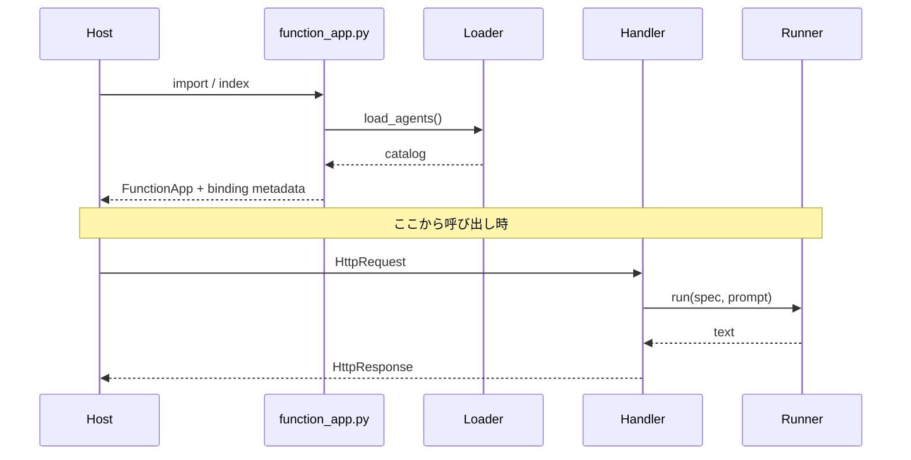

# 02 · FunctionApp に HTTP API を登録する

[目次](index.md) / 前: [Markdown](01-core.md) / 次: [チャット画面](03-chat-ui.md)

**今日のゴール:** `@app.route` の正体と、agent ごとの handler をどう作るかを理解します。
01 のファイルをそのまま使います。まだ Echo のままで構いません。

## ステップ 1 · Host の設定を用意する

新規: `host.json`

```json
{
  "version": "2.0",
  "extensions": {
    "http": {
      "routePrefix": ""
    }
  }
}
```

新規: `local.settings.json`

```json
{
  "IsEncrypted": false,
  "Values": {
    "FUNCTIONS_WORKER_RUNTIME": "python"
  }
}
```

新規: `requirements.txt`

```text
azure-functions>=2.1.0,<3
python-frontmatter>=1.1.0,<2
```

新規: `.gitignore`

```gitignore
.venv/
__pycache__/
local.settings.json
```

HTTP だけの段階では Storage を使いません。Host がストレージ設定を要求する環境では、
[05 の Storage 準備](05-triggers.md) を行います。

`azure-functions` は型とデコレーターを提供する **Python パッケージ**です。
それだけでは HTTP server は起動しません。別の **Functions Core Tools / Host** が必要です。

```powershell
func --version
```

v4 が見つからなければ [Core Tools のインストール](https://learn.microsoft.com/azure/azure-functions/functions-run-local)
を済ませます。

## ステップ 2 · HTTP と runner の変換部分を書く

新規: `http_adapter.py`

```python
import json
from collections.abc import Mapping

import azure.functions as func

from models import AgentSpec
from runner import Runner


def make_chat_handler(spec: AgentSpec, runner: Runner):
    async def chat(req: func.HttpRequest) -> func.HttpResponse:
        try:
            body = req.get_json()
        except ValueError:
            return func.HttpResponse("Invalid JSON", status_code=400)
        if not isinstance(body, dict):
            return func.HttpResponse("JSON object required", status_code=400)
        prompt = body.get("prompt")
        if not isinstance(prompt, str) or not prompt.strip():
            return func.HttpResponse("Non-empty prompt required", status_code=400)
        answer = await runner.run(spec, prompt)
        return func.HttpResponse(
            json.dumps({"response": answer}, ensure_ascii=False),
            mimetype="application/json",
        )

    return chat


def register_http(
    app: func.FunctionApp,
    catalog: Mapping[str, AgentSpec],
    runner: Runner,
) -> None:
    for slug, spec in catalog.items():
        handler = make_chat_handler(spec, runner)
        decorated = app.route(
            route=f"agents/{slug}/chat",
            methods=["POST"],
            auth_level=func.AuthLevel.ANONYMOUS,
        )(handler)
        app.function_name(name=f"chat_{slug}")(decorated)
```

**重要:** ループ内の値を handler factory に渡しています。
ループの変数 `spec` を一つの closure で直接参照すると、
すべての handler が最後の agent を使う late binding の問題が起こり得ます。

新規: `function_app.py`

```python
from pathlib import Path

import azure.functions as func

from bootstrap import build_runtime
from http_adapter import register_http

root = Path(__file__).parent
catalog, runner = build_runtime(root)
app = func.FunctionApp()
register_http(app, catalog, runner)
```

## ステップ 3 · 呼び出してみる

仮想環境を有効にしたターミナルで:

```powershell
func start --port 7071
```

別の PowerShell で:

```powershell
$body = @{ prompt = "hello" } | ConvertTo-Json
Invoke-RestMethod -Method Post `
  -Uri "http://localhost:7071/agents/greeter/chat" `
  -ContentType "application/json; charset=utf-8" -Body $body
```

期待する観察: `response` に 01 と同じ Echo が入っています。
`-Body '{}'` なら 400 です。モデルへの到達前に入力を拒否しています。
`Ctrl+C` で Host を止められます。

## デコレーターは何をしているか

次の二つは同じ構造です。教材へ追記する必要はありません。

```python
@app.route(route="example")
def handler(req):
    ...
```

```python
handler = app.route(route="example")(handler)
```

登録時には **handler を実行せず**、Host が後で呼ぶための binding 情報を作ります。
Host / Python worker が app を index し、リクエスト時に handler を呼びます。
`python function_app.py` だけでは待ち受け server になりません。

## 観察実験

`agents\helper.agent.md` を作り、別の `name` と本文を書きます。
Host を再起動すると `/agents/helper/chat` が増えます。
`greeter` と `helper` の二つを呼び、本文が混ざらないことを確かめます。



## 本体を読む

[registration/triggers.py](https://github.com/Azure/azure-functions-agents-runtime/blob/1351d6e7/src/azure_functions_agents/registration/triggers.py)
の `_register_http_agent()` と、
[registration/endpoints.py](https://github.com/Azure/azure-functions-agents-runtime/blob/1351d6e7/src/azure_functions_agents/registration/endpoints.py)
の `_register_http_chat()` を読みます。

本体には **frontmatter の `http_trigger`** と **built-in chat API** という別の入口があります。
どちらも runner に到達しますが、入力契約・セッション・認証処理は同一ではありません。
教材は後者に似せた一つの API のみです。本体の built-in HTTP は
FastAPI 拡張の Request / Response を使いますが、教材は通常の Functions HTTP binding です。

**確認:** 新しい入口を作るとき、Markdown の parser をコピーする必要がない理由を説明できますか。
