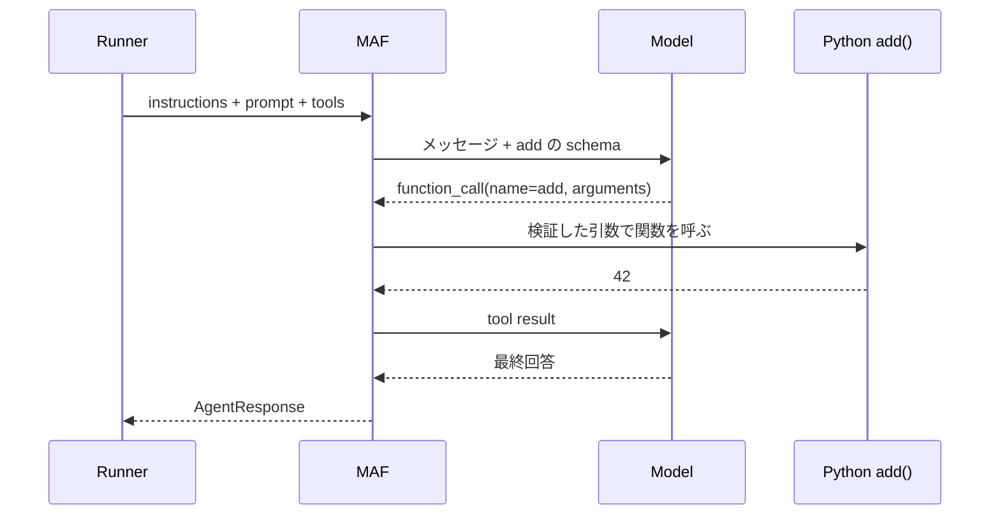

# 04 · Echo を MAF に置き換え、ツールを一つ渡す

[目次](index.md) / 前: [チャット画面](03-chat-ui.md) / 次: [非 HTTP トリガー](05-triggers.md)

**今回は 2 回に分けてください。** まずモデルとの往復だけ。別の回で足し算ツールを追加します。
利用可能なモデルの認証情報がなければ、この章は飛ばして Echo のまま 05・08・09 に進めます。

## ステップ 1 · 推論クライアントを作る

教材では本体と同じ SDK バージョンを使います。モデル名は手元で利用可能なものを指定します。

`requirements.txt` に追記してインストール:

```text
agent-framework-core==1.13.0
agent-framework-openai==1.10.2
```

```powershell
python -m pip install -r .\requirements.txt
$env:LAB_MODEL = "<利用可能なモデル名>"
$env:OPENAI_API_KEY = Read-Host "OpenAI API key" -MaskInput
```

`-MaskInput` は PowerShell 7 用です。Windows PowerShell 5.1 では、認証情報を安全な方法で
プロセス環境変数へ設定してください。キーをチャットや教材ファイルへ貼らないでください。
この設定はそのターミナルの子プロセスにだけ引き継がれます。

新規: `toolset.py`。最初は空です。

```python
from agent_framework import FunctionTool


def make_tools() -> list[FunctionTool]:
    return []
```

新規: `maf_backend.py`

```python
import os

from agent_framework import Agent
from agent_framework.openai import OpenAIChatClient
from openai import AsyncOpenAI

from models import AgentSpec
from toolset import make_tools


class MafBackend:
    async def reply(self, spec: AgentSpec, prompt: str) -> str:
        async with AsyncOpenAI(api_key=os.environ["OPENAI_API_KEY"]) as transport:
            client = OpenAIChatClient(
                model=os.environ["LAB_MODEL"], async_client=transport
            )
            async with Agent(
                client=client,
                name=spec.slug,
                instructions=spec.instructions,
                tools=make_tools(),
                context_providers=[],
            ) as agent:
                response = await agent.run(prompt)
                return response.text
```

`bootstrap.py` で `MafBackend` を import し、return 行だけ置換します。
`Runner` の import は残し、不要になる `EchoBackend` の import は削除します。

```python
from maf_backend import MafBackend
```

```python
    return catalog, Runner(MafBackend())
```

```powershell
python .\cli.py
```

期待する観察: Echo の `instructions=...` ではなく、本文に沿った日本語の返答になります。
`func start` も環境変数を設定した同じターミナルから再起動すると、API と UI も MAF 版になります。
認証失敗などは Echo にフォールバックせず、エラーとして解決します。

### Azure OpenAI を使う場合だけ

同じ MAF バージョンでは `OpenAIChatClient` が Azure 接続も扱います。
古い記事の別クラス名と混ぜないでください。
上の `AsyncOpenAI` の import を `from openai import AsyncAzureOpenAI` に変え、
`async with AsyncOpenAI(...) as transport:` の行を次のブロックに置換します。
中の `OpenAIChatClient` 以下は同じです。

```python
        async with AsyncAzureOpenAI(
            azure_endpoint=os.environ["AZURE_OPENAI_ENDPOINT"],
            api_key=os.environ["AZURE_OPENAI_API_KEY"],
            api_version=os.environ.get("AZURE_OPENAI_API_VERSION", "preview"),
        ) as transport:
```

`LAB_MODEL` は Azure 側の **deployment 名**に設定します。
このバージョンは Responses API を使います。Chat Completions 専用の古い API version を
そのまま指定しないでください。利用する deployment / API の対応が必要です。
本体の managed identity / Foundry 接続は今回の最小実装では省略します。

**ここで一度終了して構いません。**

## ステップ 2 · 信頼済みの Python 関数を公開する

`toolset.py` 全体を置換:

```python
import logging

from agent_framework import FunctionTool

logger = logging.getLogger("mini_runtime")


def add(a: int, b: int) -> int:
    """Add two integers."""
    logger.info("tool add called: a=%s b=%s", a, b)
    return a + b


def make_tools() -> list[FunctionTool]:
    return [
        FunctionTool(
            name="add",
            description="Add two integers accurately.",
            func=add,
        )
    ]
```

先にモデルを使わず関数単体を呼びます。

```powershell
python -c "from toolset import add; print(add(19, 23))"
python -c "from toolset import make_tools; print(make_tools()[0].input_model.model_json_schema())"
```

期待する観察: `42` と、`a` / `b` が integer になった JSON Schema。
`int` 型の引数が、モデルに提示する呼び出し契約になります。

次に `python .\cli.py` で `必ず add ツールを使って 19 + 23 を計算して` と入力します。
**答えが 42 なだけでは不十分です。** `tool add called` のログが出たことを観察します。
出なければツールを呼ばずモデル自身が答えた可能性があります。



モデルが Python 関数を直接実行するわけではありません。
モデルは呼び出し要求を返し、**MAF が登録済み関数を呼びます**。
このループを HTTP handler に自作しなくてよいのがフレームワークを使う利点です。

## 本体との違い

教材は素の `Agent` を使います。本体は
[runner.py](https://github.com/Azure/azure-functions-agents-runtime/blob/1351d6e7/src/azure_functions_agents/runner.py)
の `_build_role_agent()` から `create_harness_agent()` を使い、
履歴 provider・skills・各種ツール・実行設定を組み立てます。

[client_manager.py](https://github.com/Azure/azure-functions-agents-runtime/blob/1351d6e7/src/azure_functions_agents/client_manager.py)
はモデル接続の選択、`runner.py:run_agent()` は実行・タイムアウト・セッションなどの責務です。
教材は接続を毎回閉じる単純な構成で、接続共有の最適化は行いません。

本体のツールは
[discovery/tools.py](https://github.com/Azure/azure-functions-agents-runtime/blob/1351d6e7/src/azure_functions_agents/discovery/tools.py)
で発見され、`build_capabilities()` で agent ごとの対象を絞り込みます。
教材の `make_tools()` はその代わりの**明示的な登録表**です。
本体の `@tool` は `_function_tool.py` にある MAF `FunctionTool` の薄いラッパーです。
ツールファイルの import 時には Python の top-level コードが動くため、信頼したコードだけを配置します。

会話を続ける本体は `AgentSession` と File / Blob の history provider を組み合わせます。
この教材は毎回新しい agent を作るので、「さっきの答えを覚えている」とは限りません。
履歴の永続化・ユーザー分離・同一セッションの同時実行制御は、A2A を本体に統合するときの検討項目です。

**確認:** ツール schema の作成、ツールの選択、Python 関数の呼び出しを、それぞれ誰が担当しますか。
