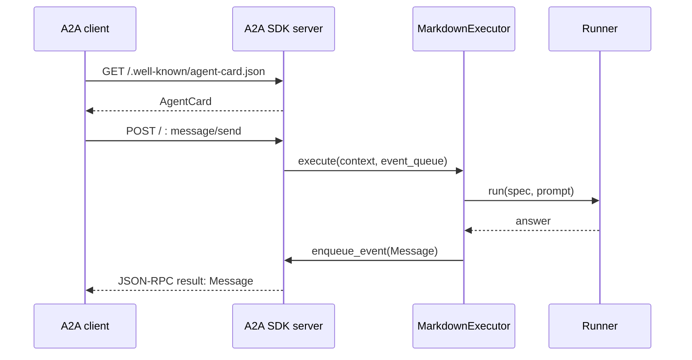

# 08 · 公式 A2A SDK から同じ runner を呼ぶ

[目次](index.md) / 前: [Sandbox](07-sandbox.md) / 次: [DAG](09-dag.md)

**この章は 01〜02 の後に直接進めます。** Echo のままで実際の A2A 通信を行えます。
初回は `bootstrap.py` を `Runner(EchoBackend())` にしておきます。
この章のコードは本体への A2A 実装提案ではなく、adapter の責務を理解する独立した練習です。

## 今回実装する範囲

公式 Python SDK **`a2a-sdk==0.3.24` / A2A protocol `0.3.0`** に固定します。
「最新版」の意味ではなく、動く API を固定するためです。
[公式タグ](https://github.com/a2aproject/a2a-python/tree/v0.3.24) と
[公開パッケージ](https://pypi.org/project/a2a-sdk/0.3.24/) を参照してください。
別バージョン、特に protocol 1.x の例と混ぜないでください。

今回は text Message → text Message の blocking 呼び出しだけです。
Task 状態管理、streaming、push notification、認証、会話履歴は未実装です。
まず Functions (7071) と A2A (8001) を **別プロセス**で起動します。
両者が共有するのは Python モジュールのコードであり、プロセス内メモリーではありません。

## ステップ 1 · wire protocol と runner の間に executor を置く

`requirements.txt` に追記:

```text
a2a-sdk[http-server]==0.3.24
uvicorn==0.35.0
```

```powershell
python -m pip install -r .\requirements.txt
```

新規: `a2a_adapter.py`

```python
from a2a.server.agent_execution import AgentExecutor, RequestContext
from a2a.server.events import EventQueue
from a2a.types import InvalidParamsError, TextPart, UnsupportedOperationError
from a2a.utils import new_agent_text_message
from a2a.utils.errors import ServerError

from models import AgentSpec
from runner import Runner


class MarkdownExecutor(AgentExecutor):
    def __init__(self, spec: AgentSpec, runner: Runner) -> None:
        self.spec = spec
        self.runner = runner

    async def execute(
        self, context: RequestContext, event_queue: EventQueue
    ) -> None:
        message = context.message
        if message is None or any(
            not isinstance(part.root, TextPart) for part in message.parts
        ):
            raise ServerError(error=InvalidParamsError(message="Text parts only"))
        prompt = context.get_user_input()
        if not prompt.strip():
            raise ServerError(error=InvalidParamsError(message="Text is required"))
        answer = await self.runner.run(self.spec, prompt)
        await event_queue.enqueue_event(
            new_agent_text_message(answer, context_id=context.context_id)
        )

    async def cancel(
        self, context: RequestContext, event_queue: EventQueue
    ) -> None:
        raise ServerError(error=UnsupportedOperationError())
```

ここでは `RequestContext → prompt` と `answer → Message` を変換するだけです。
`Runner` は A2A の import を一つも必要としません。
`UnsupportedOperationError` はエラーモデルなので、例外である `ServerError` で包みます。

## ステップ 2 · Agent Card と server を組み立てる

新規: `a2a_server.py`

```python
import os
from pathlib import Path

from a2a.server.apps import A2AStarletteApplication
from a2a.server.request_handlers import DefaultRequestHandler
from a2a.server.tasks import InMemoryTaskStore
from a2a.types import AgentCapabilities, AgentCard, AgentSkill

from a2a_adapter import MarkdownExecutor
from bootstrap import build_runtime

catalog, runner = build_runtime(Path(__file__).parent)
spec = catalog["greeter"]
card = AgentCard(
    name=spec.name,
    description="A tiny markdown-based agent.",
    url=os.environ.get("A2A_URL", "http://127.0.0.1:8001/"),
    version="0.1.0",
    protocol_version="0.3.0",
    preferred_transport="JSONRPC",
    capabilities=AgentCapabilities(streaming=False, push_notifications=False),
    default_input_modes=["text/plain"],
    default_output_modes=["text/plain"],
    skills=[
        AgentSkill(
            id=spec.slug,
            name=spec.name,
            description="Answer a text prompt.",
            tags=["tutorial"],
        )
    ],
)
handler = DefaultRequestHandler(
    agent_executor=MarkdownExecutor(spec, runner),
    task_store=InMemoryTaskStore(),
)
app = A2AStarletteApplication(agent_card=card, http_handler=handler).build()
```

Card の `AgentSkill` は **外部クライアント向けの能力説明**です。
06 の `SKILL.md` / MAF `SkillsProvider` と同じものではありません。
instructions の全文を外部公開する必要もありません。

```powershell
python -m uvicorn a2a_server:app --host 127.0.0.1 --port 8001
```

別の PowerShell で:

```powershell
Invoke-RestMethod "http://127.0.0.1:8001/.well-known/agent-card.json"
```

`protocolVersion`、`url`、`skills` が見えたら、まずここで一区切りです。

## ステップ 3 · 公式クライアントで呼ぶ

新規: `a2a_client.py`

```python
import asyncio

import httpx
from a2a.client import ClientConfig, ClientFactory, create_text_message_object
from a2a.types import Message
from a2a.utils import get_message_text


async def main() -> None:
    async with httpx.AsyncClient(timeout=70) as http:
        client = await ClientFactory.connect(
            "http://127.0.0.1:8001",
            client_config=ClientConfig(
                httpx_client=http,
                streaming=False,
                polling=False,
                accepted_output_modes=["text/plain"],
            ),
        )
        message = create_text_message_object(content="こんにちは")
        async for reply in client.send_message(message):
            if not isinstance(reply, Message):
                raise TypeError("This lesson expects a Message, not a Task")
            print(get_message_text(reply))


asyncio.run(main())
```

server を残したまま、仮想環境を有効にした別のターミナルで:

```powershell
python .\a2a_client.py
```

期待する観察: `greeter` の Echo が返ります。
`ClientFactory.connect()` が Card を取得し、SDK が JSON-RPC の送信・受信を行います。
非 streaming でも、SDK の `send_message()` は async iterator です。



HTTP path が `/message/send` なのではありません。
この SDK 構成では **`POST /` の JSON-RPC `method` が `message/send`** です。

## ステップ 4 · 本体に戻す前に境界を確認する

`bootstrap.py` を MAF に切り替えると、executor を変更せず本物のモデルを呼べます。
先に CLI で認証を確認し、A2A server も環境変数のあるターミナルから再起動してください。
これが protocol adapter を runner から切り離した効果です。

| 名前 | 今回の意味 | していないこと |
| --- | --- | --- |
| `messageId` | 各 Message の識別子 | 会話履歴の保存 |
| `contextId` | 関連する Message の関連付け | MAF session への自動対応付け |
| `Task` | 今回は返さない | 長時間処理の状態・取消管理 |
| `InMemoryTaskStore` | SDK handler へ渡す依存 | Message を自動で Task にすること |

この実装で架空の task ID に `tasks/cancel` を送ると、通常は executor に届く前に
TaskNotFound になります。`cancel()` を書いたから取消機能が完成したわけではありません。

## 任意 · Functions で ASGI をホストする

これは **別の回**に行います。02 の `function_app.py` に二つ目の app を追加しません。
独立したフォルダーに、この章が必要とする共有モジュールと `agents` をコピーし、
Functions の entrypoint を次だけにします。

```python
import azure.functions as func

from a2a_server import app as a2a_asgi

app = func.AsgiFunctionApp(
    app=a2a_asgi, http_auth_level=func.AuthLevel.ANONYMOUS
)
```

コピーする最小セットは、`models.py`、`loader.py`、`runner.py`、Echo 版 `bootstrap.py`、
`a2a_adapter.py`、`a2a_server.py`、`agents`、`requirements.txt`、
02 の `host.json` / `local.settings.json` です。UI / Timer / Queue は不要です。
独立した venv を作って requirements を入れ、`routePrefix` が空であることを確認します。

```powershell
$env:A2A_URL = "http://localhost:7072/"
func start --port 7072
```

クライアントの接続先も `http://localhost:7072` に変えて呼びます。
Card の `url` と実際の server URL が異なると、Card は取得できても後続の送信が別の場所へ行きます。
これは ASGI を Functions でホストする実験で、本体の既存 routes との統合は別の設計課題です。

## 本体への実装に向けた読書メモ

本体の `app.py` で完成した catalog を新しい registration に渡し、
`registration/endpoints.py` と同様に runner の呼び出しへ接続するのが責務上の候補です。
ただし正式導入では、どの transport / SDK version を採用するかを先に決めます。

認証・agent ごとの公開可否・context と内部 session の対応・長時間 Task の永続化・
取消・エラー変換・streaming・既存 Functions HTTP surface との共存を設計してから実装します。
本体の Entra / Function key のポリシーを、匿名 ASGI の catch-all route で迂回してはいけません。

**確認:** A2A の message 形式が変わったとき、loader / runner / adapter のどこを変更しますか。
