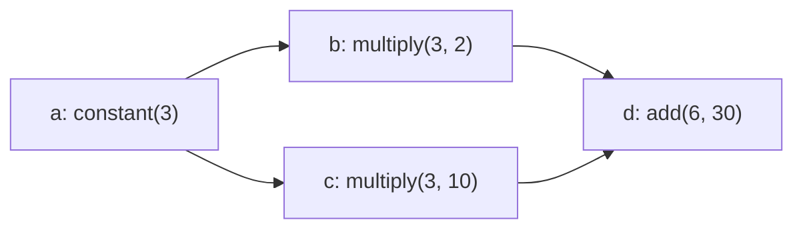

# 09 · LLM を使わず、小さな DAG を実行する

[目次](index.md) / 前: [A2A](08-a2a.md) / 次: [動的プラン](10-dynamic-plans.md)

**3 回に分ける章です。** まずデータ、次に検証、最後に実行。
この章のプログラムは Python 標準ライブラリだけで動きます。
既存の `Runner` や FunctionApp を書き換えず、同じ教材フォルダーに追加します。

Dynamic Workflow を理解するには、最初に「モデルが作った」という要素を取り除くのが近道です。
**DAG はファイルやクラスではなく、ノードと依存関係を表すデータ**です。

## ステップ 1 · グラフをデータにする

新規: `plan.json`

```json
{
  "tasks": [
    {"id": "a", "type": "tool", "tool": "constant", "args": {"value": 3}},
    {"id": "b", "type": "tool", "tool": "multiply", "args": {"value": "${a.result}", "factor": 2}, "depends_on": ["a"]},
    {"id": "c", "type": "tool", "tool": "multiply", "args": {"value": "${a.result}", "factor": 10}, "depends_on": ["a"]},
    {"id": "d", "type": "tool", "tool": "add", "args": {"a": "${b.result}", "b": "${c.result}"}, "depends_on": ["b", "c"]}
  ]
}
```



`depends_on` は実行順序、`${a.result}` はデータの参照です。
**参照を書くだけでは依存関係を自動追加しない**契約にします。
この章は整数演算の tool ノードのみ。本体の schema の小さな部分集合であり、互換 parser ではありません。

新規: `workflow_handlers.py`

```python
def constant(value: int) -> int:
    return value


def multiply(value: int, factor: int) -> int:
    return value * factor


def add(a: int, b: int) -> int:
    return a + b


TOOLS = {"constant": constant, "multiply": multiply, "add": add}


def call_tool(name: str, args: dict[str, int]) -> int:
    if name not in TOOLS:
        raise ValueError(f"Unknown tool: {name}")
    if any(type(value) is not int for value in args.values()):
        raise ValueError("This lesson accepts integer arguments only")
    return TOOLS[name](**args)
```

これは任意の関数名を import / 実行するものではなく、明示的な allowlist です。
`toolset.py` は「MAF に見せるツール」、こちらは「workflow エンジンから呼べる処理」です。

新規: `dag.py`。まずデータ型と JSON の入口を書きます。

```python
import asyncio
import inspect
import re
from dataclasses import dataclass
from graphlib import TopologicalSorter

from workflow_handlers import TOOLS, call_tool

REFERENCE = re.compile(r"\$\{([a-z][a-z0-9_]*)\.result\}")


@dataclass(frozen=True)
class Node:
    id: str
    tool: str
    args: dict[str, int | str]
    depends_on: tuple[str, ...] = ()


def parse_plan(raw: object) -> list[Node]:
    if not isinstance(raw, dict) or set(raw) != {"tasks"}:
        raise ValueError("Expected an object containing only tasks")
    tasks = raw["tasks"]
    if not isinstance(tasks, list) or not 1 <= len(tasks) <= 16:
        raise ValueError("Expected 1..16 tasks")
    nodes = []
    for task in tasks:
        if not isinstance(task, dict):
            raise ValueError("Each task must be an object")
        required = {"id", "type", "tool", "args"}
        if not required <= task.keys() or task.keys() - required - {"depends_on"}:
            raise ValueError("Invalid task fields")
        if task["type"] != "tool":
            raise ValueError("Only tool tasks are supported in this lesson")
        node_id, tool, args = task["id"], task["tool"], task["args"]
        deps = task.get("depends_on", [])
        if not isinstance(node_id, str) or not re.fullmatch(r"[a-z][a-z0-9_]*", node_id):
            raise ValueError("Invalid task id")
        if not isinstance(tool, str) or not isinstance(args, dict):
            raise ValueError("Invalid tool or args")
        if any(not isinstance(key, str) for key in args):
            raise ValueError("Argument names must be strings")
        if any(type(value) not in (int, str) for value in args.values()):
            raise ValueError("Arguments must be integers or result references")
        if not isinstance(deps, list) or any(not isinstance(dep, str) for dep in deps):
            raise ValueError("depends_on must be a list of task ids")
        nodes.append(Node(node_id, tool, args, tuple(deps)))
    return nodes
```

```powershell
python -c "import json; from pathlib import Path; from dag import parse_plan; print(parse_plan(json.loads(Path('plan.json').read_text(encoding='utf-8'))))"
```

四つの `Node` が表示されたら、この回は終了です。まだ何も実行していません。

## ステップ 2 · 実行前にグラフ全体を検証する

`dag.py` に追記:

```python
def validate_nodes(nodes: list[Node]) -> None:
    if not 1 <= len(nodes) <= 16:
        raise ValueError("Expected 1..16 tasks")
    by_id = {node.id: node for node in nodes}
    if len(by_id) != len(nodes):
        raise ValueError("Duplicate task id")
    for node in nodes:
        if node.tool not in TOOLS:
            raise ValueError(f"Unknown tool: {node.tool}")
        if node.args.keys() != inspect.signature(TOOLS[node.tool]).parameters.keys():
            raise ValueError(f"Wrong arguments for {node.tool}")
        if len(set(node.depends_on)) != len(node.depends_on):
            raise ValueError("Duplicate dependency")
        if node.id in node.depends_on or any(dep not in by_id for dep in node.depends_on):
            raise ValueError("Self or unknown dependency")

    graph = {node.id: set(node.depends_on) for node in nodes}
    order = list(TopologicalSorter(graph).static_order())
    ancestors: dict[str, set[str]] = {}
    for node_id in order:
        node = by_id[node_id]
        upstream = set(node.depends_on)
        for dep in node.depends_on:
            upstream.update(ancestors[dep])
        ancestors[node_id] = upstream
        for value in node.args.values():
            if type(value) is int:
                continue
            match = REFERENCE.fullmatch(value) if isinstance(value, str) else None
            if match is None or match.group(1) not in upstream:
                raise ValueError(f"Invalid upstream reference in {node_id}: {value}")
```

`TopologicalSorter` は循環があれば `CycleError` を出します。
全体を検証し終えるまで、`call_tool()` は呼びません。

```powershell
python -c "import json; from pathlib import Path; from dag import parse_plan, validate_nodes; validate_nodes(parse_plan(json.loads(Path('plan.json').read_text(encoding='utf-8')))); print('valid')"
```

`valid` を確認したら、`b` の `depends_on` を一時的に消してみます。
`${a.result}` の参照が不正になり、実行前に拒否されます。元に戻してください。

ここで一旦終了します。**JSON が文法的に正しいことと、実行可能なグラフであることは別**です。

## ステップ 3 · 準備ができたノードを実行する

`dag.py` に追記:

```python
def ready_nodes(pending: dict[str, Node], results: dict[str, int]) -> list[Node]:
    return [
        node for node in pending.values()
        if all(dep in results for dep in node.depends_on)
    ][:4]


def resolve_args(node: Node, results: dict[str, int]) -> dict[str, int]:
    args = {}
    for key, value in node.args.items():
        if type(value) is int:
            args[key] = value
        else:
            match = REFERENCE.fullmatch(value)
            if match is None:
                raise ValueError(f"Invalid reference: {value}")
            args[key] = results[match.group(1)]
    return args


async def run_node(node: Node, results: dict[str, int]) -> int:
    print(f"start {node.id}")
    await asyncio.sleep(0)
    result = call_tool(node.tool, resolve_args(node, results))
    print(f"done {node.id}: {result}")
    return result


async def run_dag(nodes: list[Node]) -> dict[str, int]:
    validate_nodes(nodes)
    pending = {node.id: node for node in nodes}
    results: dict[str, int] = {}
    while pending:
        ready = ready_nodes(pending, results)
        if not ready:
            raise ValueError("No runnable tasks")
        print("wave:", [node.id for node in ready])
        async with asyncio.TaskGroup() as group:
            tasks = [group.create_task(run_node(node, results)) for node in ready]
        for node, task in zip(ready, tasks, strict=True):
            results[node.id] = task.result()
            del pending[node.id]
    return results
```

新規: `run_plan.py`

```python
import asyncio
import json
from pathlib import Path

from dag import parse_plan, run_dag

raw = json.loads(Path("plan.json").read_text(encoding="utf-8"))
print(asyncio.run(run_dag(parse_plan(raw))))
```

```powershell
python .\run_plan.py
```

期待する観察:

```text
wave: ['a']
...
wave: ['b', 'c']
...
wave: ['d']
...
{'a': 3, 'b': 6, 'c': 30, 'd': 36}
```

`b` と `c` は同じ wave、`d` は両方の結果の後です。
ここでの並列性は async task の同時進行です。CPU 計算を複数コアで実行する実装ではありません。
wave 全体の終了を待つ単純な方式で、最適な scheduler を目指していません。

## 本体を読む

[workflows/schema.py](https://github.com/Azure/azure-functions-agents-runtime/blob/1351d6e7/src/azure_functions_agents/workflows/schema.py)
の `validate_plan()` / `resolve_template_value()` と、
[engine.py](https://github.com/Azure/azure-functions-agents-runtime/blob/1351d6e7/src/azure_functions_agents/workflows/engine.py)
の `_run_static_workflow()` を対応付けます。

本体は agent ごとの `WorkflowPlanPolicy` による認可、JSON 構造を保つ参照、
tool / wait / sub_agent ノード、キャンセルなどを扱います。
教材は `${id.result}` の完全一致と整数だけです。`${id.result.items}`、
文字列への埋め込み、`when` / `for_each` はこの parser では拒否します。

教材の結果はメモリー上にしかありません。プロセスが落ちれば続きから再開できません。
それを解決する境界が 11 の Durable です。

**確認:** LLM を一度も呼んでいないのに DAG を実行できるのは、なぜでしょうか。
