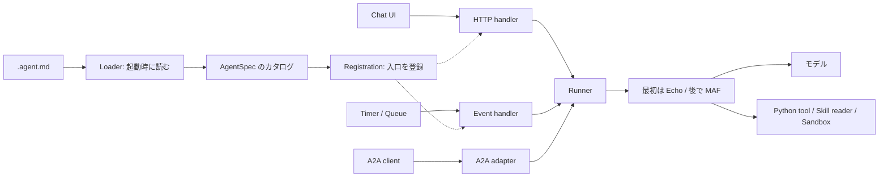

# 小さな Agent Runtime を自分で作る

この教材は、**コードを自分で入力し、動きを観察してから、元のリポジトリを読む**ためのものです。
完成済みのアプリをコピーするのではなく、毎回一つだけ責務を増やします。
ランタイム本体の改造や Azure へのデプロイは行いません。

## 最初に知っておくこと

**Markdown はプログラムとして実行されません。**
起動時に `.agent.md` を読み、本文を instructions として保持します。
呼び出し時に、入力・instructions・利用可能なツールを MAF に渡して実行します。
Azure Functions は「いつ・何をきっかけに Python ハンドラーを呼ぶか」を担当します。



ここでのクラス名は**教材用**です。本体のクラスと同名・互換であるとは限りません。
特に教材の `Runner` は、本体の `runner.py` の役割を小さく表現したものです。

## 進め方

1 回は **1 章ではなく 1 ステップ、10〜20 分程度**を目安にしてください。
コードブロックの前に「新規」「追記」「置換」を記載しています。
「観察できたら終了」で止めて構いません。先の章を全部読む必要はありません。
Python、JSON、Markdown は UTF-8 で保存します。コマンドは Windows PowerShell 用です。

| 章 | 作るもの | 新しく理解すること |
| --- | --- | --- |
| [01 · Markdown と runner](01-core.md) | コマンドラインから呼べる最小ランタイム | 設定と入力、読み込みと実行の分離 |
| [02 · HTTP API](02-http.md) | `FunctionApp` に動的に登録する API | デコレーター、closure、Functions Host |
| [03 · チャット画面](03-chat-ui.md) | HTML 1 枚 | UI は Markdown を読まず API を呼ぶ |
| [04 · 本物の MAF とツール](04-maf-tools.md) | Echo をモデルに置換、足し算ツール | 推論クライアント、tool-call loop |
| [05 · HTTP 以外のトリガー](05-triggers.md) | Timer、必要なら Queue | binding の値を prompt に変換する adapter |
| [06 · Skills](06-skills.md) | 必要になってから読む手順書 | ツールとの違い、段階的な読み込み |
| [07 · Sandbox](07-sandbox.md) | 実行境界の観察、任意で ACA 接続 | ローカル関数とリモートコード実行の違い |
| [08 · A2A](08-a2a.md) | 公式 SDK の server / client | wire protocol と runner の間の adapter |
| [09 · 小さな DAG](09-dag.md) | 手書きプランを実行するエンジン | 依存関係、検証、並列実行、結果の受け渡し |
| [10 · 動的プラン](10-dynamic-plans.md) | モデルがプランを提出するツール | LLM が計画し、エンジンが決定的に実行する |
| [11 · Durable への橋渡し](11-durable.md) | DAG の実行を永続化する別アプリ | orchestrator、Activity、replay |

**まずは 01〜03 だけで十分です。**
A2A を先に試す場合は **01 → 02 → 08** と進めます。A2A の章は Echo でも動きます。
04・06・07 の実モデル接続と 11 の Durable は、それぞれ準備が必要な別の段階です。

## 環境と作業場所

このリポジトリのソースを編集せず、別の空のフォルダーを用意します。
完成品の `azurefunctions-agents-runtime` パッケージはインストールしません。
それを使ってしまうと、今回理解したい組み立て部分が隠れるためです。

```powershell
New-Item -ItemType Directory -Path "$HOME\agent-runtime-lab"
Set-Location "$HOME\agent-runtime-lab"
py -3.13 -m venv .venv
.\.venv\Scripts\Activate.ps1
python -m pip install "python-frontmatter>=1.1.0,<2" "azure-functions>=2.1.0,<3"
New-Item -ItemType Directory -Path agents
```

作成済みのフォルダーなら `New-Item` は省略します。
PowerShell の activation が制限されていれば、`python` の代わりに
`.\.venv\Scripts\python.exe` を指定できます。Functions Host を起動する章では
仮想環境が有効なターミナルを使ってください。

| 到達点 | 必要なもの | 不要なもの |
| --- | --- | --- |
| 01 | Python 3.13、frontmatter | LLM、Functions Host、Azure |
| 02〜03 | 上記 + Core Tools v4 (`func --version`) | LLM、クラウドへのデプロイ |
| 04 / 06 | 利用できる OpenAI または Azure OpenAI のモデル | ランタイム本体 |
| 05 | Core Tools、ローカル Storage エミュレーター | 実 Azure Storage |
| 07 | 観察版はローカルのみ。実接続版は既存 ACA session pool と権限 | 新規インフラの自動作成 |
| 08 | 公式 A2A SDK、ローカル HTTP server | LLM、Azure |
| 09 | Python 標準ライブラリ | LLM、Durable |
| 10 | 04 のモデル接続 | Durable |
| 11 | Durable 対応 Core Tools、DTS 接続またはエミュレーター | 本番デプロイ |

実モデルや ACA への接続には料金が発生し得ます。キーをソース、Markdown、Git に書かないでください。
匿名 API はローカル専用です。この教材の状態で公開しないでください。

## 本体との対応地図

本教材が参照する実装は **`1351d6e7`** です。設計の正本は [architecture.md](../../architecture.md)。
章末の「本体を読む」は、その時点で読む必要がある箇所だけです。

| 教材の責務 | 本体で探すファイル・関数 |
| --- | --- |
| `loader.py` / `AgentSpec` | `config/loader.py`、`schema.py`、`merge.py:compose()` |
| `bootstrap.py` | `app.py:create_function_app()`、`registration/catalog.py` |
| `http_adapter.py` | `registration/endpoints.py`、`triggers.py`、`_handlers.py` |
| `Runner` / `MafBackend` | `runner.py:run_agent()`、`client_manager.py` |
| ツール一覧・スキル一覧 | `discovery/*` → `registration/capabilities.py` |
| Sandbox adapter | `system_tools/sandbox.py:create_sandbox_tools()` |
| 教材の A2A adapter | **この時点の本体には未実装**。追加位置を考える練習 |
| DAG validator / scheduler | `workflows/schema.py`、`engine.py` |
| プラン提出ツール | `workflows/tools.py`、`integration.py` |

## あえて作らないもの

最初の教材は単発・テキストのみです。会話履歴、SSE、認証、MCP、設定の継承、
自動ツール探索、永続ジョブ管理を一度に実装しません。
章ごとに、本体との違いを明示してから必要な境界だけ追加します。

**会話 ID を返すことと、会話履歴を保存・復元することは別です。**
また、A2A の Task、Durable の instance、MAF の session、ACA の session は異なる概念です。
同じ文字列にすれば自動的に連携するわけではありません。

準備ができたら [01 のステップ 1](01-core.md) へ進みます。
