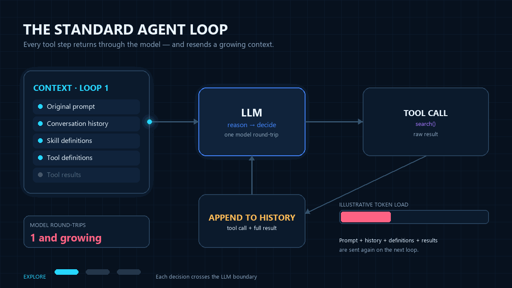
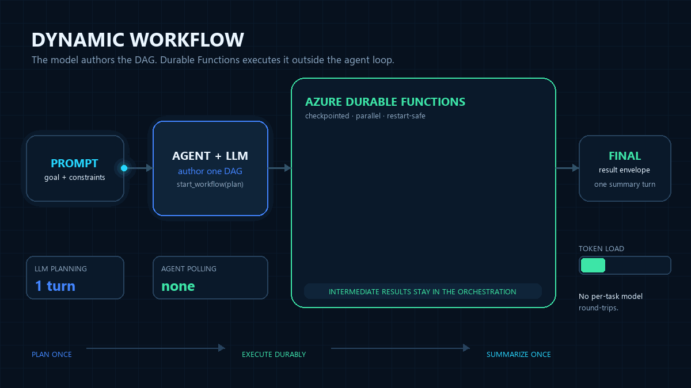

# Dynamic workflows (experimental v1)

> [!NOTE]
> **Status: public experimental v1.** The API is intentionally small and
> may change based on early feedback, but the behavior described here is
> the supported v1 surface. Run the
> [workflow-incident-triage sample](https://github.com/Azure/azure-functions-agents-runtime/blob/main/samples/workflow-incident-triage/README.md)
> for the interactive experience, or the
> [queue-trigger sample](https://github.com/Azure/azure-functions-agents-runtime/blob/main/samples/workflow-queue-p0-report/README.md) for a
> non-interactive starter. The
> [parallel PR report sample](https://github.com/Azure/azure-functions-agents-runtime/blob/main/samples/workflow-subagents-preview/README.md)
> demonstrates workflow Sub Agents. The
> [Engineering Operations Hub](https://github.com/Azure/azure-functions-agents-runtime/blob/main/samples/per-agent-workflows/README.md)
> demonstrates two non-main workflow-enabled agents with independent policies in one app.
> Larger features such as sub-orchestrations,
> blob-offloaded outputs, and MCP Tasks integration are tracked as v2
> follow-up work.

Dynamic workflows let a markdown agent author and run **distributed,
observable, durable** plans without writing orchestration code. Flip
`workflows.enabled: true` in the agent's frontmatter and the agent gains a
small set of built-in tools that author and launch
[Azure Durable Functions](https://learn.microsoft.com/azure/azure-functions/durable/)
orchestrations of workflow-safe tool calls and durable timers.

## Who this is for

Dynamic workflows are a fit when an agent needs to:

- **process large datasets** where only an aggregate or summary should
  reach the chat (e.g., scan 50 endpoints, summarize anomalies);
- **run multi-step plans** (3+ dependent tool calls) where each model
  round-trip would burn tokens and latency;
- **fan out** independent work across many parallel tool calls;
- **wait** on durable timers without holding a worker hot;
- **survive** worker restarts or long pauses (minutes to hours);
- **be observed and controlled** from outside the agent loop;

They are **not** the right tool for:

- work that fits comfortably inside a single chat turn — the
  orchestration overhead would dominate;
- tools that need an immediate user response (the workflow tool returns
  immediately with an ID; the *result* is fetched on a later turn);
- hand-authored orchestration DSLs — plans are LLM-authored only, by
  design, so there is no YAML/markdown workflow template format;
- cross-app coordination. v1 workflows live inside one Functions app; any
  agent in that app can own workflows and authorize leaf specialists.

## Why workflows (token, latency, context)

Dynamic workflows give an agent the same benefits that motivate
[programmatic tool calling][ptc] in other LLM platforms — the LLM authors
a *plan that calls tools* rather than calling them one-by-one through chat
round-trips — and add durability, observability, and cooperative control
on top.

In a **standard agent loop**, each tool result returns through the model and
becomes part of the next loop's context:



With a **Dynamic Workflow**, intermediate results stay in the orchestration;
the agent plans once and later summarizes the final envelope:



Three concrete wins versus chaining tool calls in conversation:

- **Lower token cost.** Intermediate task results stay inside the
  orchestration. The agent sees only the final completion envelope (or a
  summary task you wired in), not every fan-out result. Anthropic
  [reports][ptc] roughly a 10× reduction on multi-tool workflows; the
  shape of the saving is the same here.
- **Lower latency.** Each direct tool call is a round-trip through the
  model. A 20-step plan is one model turn to author the workflow, not 20.
  The orchestrator drives the fan-out and sequencing in pure
  infrastructure.
- **Context-window discipline.** Hundreds of kilobytes of intermediate
  data — log lines, line items, search hits — never reach the model's
  context. The agent reasons over the *summary*, which is what it would
  have produced anyway after seeing the raw data.

…and three more that PTC's container-based model can't offer:

- **Survives worker restarts and long sleeps.** Workflows that take hours
  or days are first-class — no client connection has to stay open.
- **Operable from outside the agent loop.** `list_workflows`,
  `get_workflow_status`, `cancel_workflow`, and the optional Durable Task
  Scheduler portal give operators a way to see and steer in-flight work
  without going through the chat session.

[ptc]: https://platform.claude.com/docs/en/agents-and-tools/tool-use/programmatic-tool-calling

## How it works

1. You enable workflows on an agent with a one-line frontmatter flag.
2. The agent is given five built-in tools (see [Tools](#tools)).
3. When the agent decides the work is workflow-shaped, it calls
   `start_workflow` with a DAG of tasks. The DAG is validated and scheduled
   as a Durable orchestration; the tool returns immediately with a
   `workflow_id`.
4. The orchestration runs each task as a Durable activity (tool calls) or
   a Durable timer (waits), using `task_all` to fan out parallel tasks and
   `depends_on` edges for sequencing.
5. **`start_workflow` is fire-and-forget from the agent's perspective.**
   After receiving the `workflow_id`, the agent reports or records it as its
   invocation channel allows and ends its turn. The agent does not poll
   `get_workflow_status` to wait for completion.
6. The chat client (the built-in chat UI, or any external poller) polls
   `GET /agents/{slug}/workflows` on a short interval while the session is
   visible, renders a live per-task progress card alongside the chat
   thread, and updates the card with the final result envelope when the
   workflow terminates. The user sees per-task progress live without the
   agent doing any work.
7. When the workflow reaches a terminal state, the built-in chat UI
   detects the transition and **injects a synthetic user message
   containing one or more `<workflow-notification>` envelopes into
   the conversation**, prompting the agent to call
   `get_workflow_status` once per listed `<workflow-id>` and produce
   a short natural-language summary. The user gets a final
   conversational turn that closes the loop without having to type
   anything. See [Auto-notification](#auto-notification) below.
8. If the user later asks the agent about a previously-started
   workflow ("what did the incident workflow find?"), the agent calls
   `get_workflow_status` on demand and reports back. The on-demand
   call and the auto-notification turn are the two paths by which
   workflow output enters the agent's context window.

> [!NOTE]
> **Intermediate task results never enter the agent's context window.**
> The agent receives only the `workflow_id` from `start_workflow`. Per-task
> results stay in the workflow store; the chat client renders them next
> to the conversation. The only output the agent ever ingests is the
> single final-result envelope it fetches via `get_workflow_status` —
> either when the chat client posts a synthetic
> `<workflow-notification>` user message (see
> [Auto-notification](#auto-notification)) or when the user
> explicitly asks a follow-up question. This is the same context-window
> discipline that makes [programmatic tool calling][ptc] cheap.

The design is intentionally aligned with the
[MCP Tasks SEP-2557 proposal](https://github.com/modelcontextprotocol/modelcontextprotocol/pull/2557);
future direct MCP Tasks support will be a thin protocol shim.

## Frontmatter

```yaml
---
name: Incident Triage Assistant
description: ...
workflows:
  enabled: true
  # Optional deny-list of workflow tools to withhold from this agent.
  # Defaults to every public @workflow_tool discovered from tools/.
  exclude:
    - expensive_diagnostics
  # Optional, independent, deny-by-default specialist grant:
  subagents:
    - agent: log_analyst
      when: Analyze one bounded set of logs
  # Future v2 knob (not honored by v1):
  # max_nodes: 100
  #
  # Note: the Durable execution backend (Azure Storage vs Durable Task
  # Scheduler) and the task hub name are configured in host.json's
  # `extensions.durableTask.storageProvider` block (and matching app
  # settings), NOT here — the library never reads or routes on backend.
---
```

When `workflows.enabled: true`, the framework auto-injects the five
workflow tools into the agent's schema **and** appends a short
behavioral addendum to the agent's system prompt explaining when to
prefer `start_workflow` over direct tool calls. The agent author does
not need to document the tools or the heuristics in their markdown — the
agent markdown stays focused on the domain.

Direct workflow-enabled agents also receive the runtime-owned
`data-driven-workflows` skill. Its short description is always available, but
MAF loads the detailed `when` / `for_each` grammar only when a data-driven plan
needs it. This system skill is independent of project `skills` filtering
(including `skills: false`) and is not exposed when the same agent runs as a
delegated or Workflow Sub Agent leaf.

Any agent may enable workflows by setting `workflows.enabled: true`.
Invocation remains independent: triggers and built-in endpoints determine how
the agent can be reached, and `debug_chat_ui` automatically enables its backing
chat API.

File placement does not assign these roles. See
[Agent roles and reachability](./front-matter-spec.md#agent-roles-and-reachability)
for how direct, workflow-enabled, and internal specialist agents are identified.

### App-wide engine, per-agent policy

The app discovers complete, immutable catalogs of workflow handlers and agents.
If at least one workflow-enabled agent exists, startup creates one `DFApp` and
registers one Durable orchestrator plus one copy of each Activity for the whole
app. It does **not** register a separate engine per agent.

An app with no workflow-enabled agents remains a plain `FunctionApp`.

Each workflow-enabled agent instead gets an immutable policy containing only its allowed
workflow tools (after `workflows.exclude`) and its deny-by-default
`workflows.subagents` grants. Prompt guidance, `start_workflow` validation, and
Activity dispatch all use that agent's policy. One agent's exclusion never
removes a handler another agent is allowed to use.

### Workflow tool authoring

Workflow tasks run later inside Durable Function activities, so they use
an explicit opt-in marker separate from normal MAF tools. Put workflow
handlers in the same `tools/` directory as normal tools and decorate each
Durable-activity-safe handler with `@workflow_tool`:

```python
# tools/incident_tools.py
from typing import Any

from azure_functions_agents import workflow_tool


@workflow_tool(description="Fetch recent log lines for a service.")
def fetch_logs(args: dict[str, Any]) -> dict[str, Any]:
    service = args["service"]
    return {"service": service, "lines": ["..."]}
```

The Activity runner calls the handler as `handler(args)`. v1 handlers
must be synchronous, accept a single dictionary argument, and return a
JSON-serializable value. Async handlers, reserved workflow-management
names, and duplicate workflow names are rejected or skipped during
startup.

Normal tools keep their existing behavior: a plain public function or an
`@tool`/`FunctionTool` in `tools/*.py` becomes a normal MAF tool. Use both
decorators when one callable should be available both directly in chat
and inside workflows:

```python
from azure_functions_agents import tool, workflow_tool


@tool
@workflow_tool(description="Summarize evidence collected by a workflow.")
def summarize(args: dict[str, object]) -> dict[str, object]:
    return {"summary": "..."}
```

Use `_`-prefixed helper functions for code that should be neither a
normal tool nor a workflow tool.

## Tools

Five tools are added to the agent's schema when `workflows.enabled: true`:

| Tool | Purpose |
| --- | --- |
| `start_workflow(plan)` | Validate a DAG, start an orchestration, return `{workflow_id}` immediately. |
| `get_workflow_status(workflow_id)` | Return the current status envelope (see below). |
| `list_workflows()` | List workflows owned by the current session. |
| `cancel_workflow(workflow_id, reason?)` | Cooperative cancel — raises an external event the orchestrator handles; the completion activity still runs. |
| `terminate_workflow(workflow_id, reason?)` | Hard terminate — stops the instance abruptly; final status is observable but no completion envelope is guaranteed. |

Workflow-management tools are never reachable as workflow-node targets —
a plan that tries to call `start_workflow` from inside a workflow fails
validation.

## DAG schema (v1)

A workflow plan is a list of tasks with `depends_on` edges. Task types:

- **`tool`** — call a discovered `@workflow_tool` by name with args.
- **`wait`** — durable timer. Accepts `duration` (ISO-8601, e.g. `PT30S`)
  or `until` (absolute ISO-8601 timestamp).
- **`sub_agent`** — invoke one leaf specialist authorized by
  `workflows.subagents`, using `agent` and a self-contained `task`.

A `tool` or `sub_agent` task may carry an `execution` policy with a per-attempt
`timeout`, a `retry` policy, and `continue_on_error`; see
[Task execution policy](#task-execution-policy).

```json
{
  "tasks": [
    { "id": "fetch_a", "type": "tool", "tool": "fetch_url", "args": {"url": "..."} },
    { "id": "fetch_b", "type": "tool", "tool": "fetch_url", "args": {"url": "..."} },
    { "id": "cool_down", "type": "wait", "duration": "PT30S",
      "depends_on": ["fetch_a", "fetch_b"] },
    { "id": "summarize", "type": "tool", "tool": "summarize",
      "args": {"sources": ["${fetch_a.result}", "${fetch_b.result}"]},
      "depends_on": ["cool_down"] }
  ]
}
```

Authored task ids allow letters, numbers, underscore, and hyphen only.
`item` and `index` are reserved and rejected as authored task ids because they
always identify `for_each` iteration locals.
`[` and `]` are rejected — the runtime reserves the `<id>[<index>]`
namespace for the materialized `for_each` instance ids it renders (see
below), so you can neither author them nor reference them.

### Data-driven control flow (`when` / `for_each`)

Two optional fields let a plan react to data at runtime instead of the
model enumerating every task before submission. Plans that omit both keep
their exact prior validation, scheduling, result, and status behavior; the
fields are dropped from serialized plans when unset.

The MAF skill inventory describes `data-driven-workflows` as applicable only
when submitted tasks will contain one of these fields. The shared workflow
addendum does not mention it, which avoids drawing fixed-DAG turns toward an
unnecessary load while keeping the full grammar available on demand.

- **`when`** — a constrained predicate that decides whether a logical task
  (or one materialized `for_each` instance) runs. It is available on every
  task type, including `wait` and `sub_agent`.
- **`for_each`** — a single full reference to an upstream JSON array. The
  runtime materializes one instance of the task per element. It is available
  on `tool` and `sub_agent` tasks only; `wait` tasks may use `when` but not
  `for_each`.

```json
{
  "tasks": [
    { "id": "discover", "type": "tool", "tool": "list_services" },
    {
      "id": "inspect",
      "type": "tool",
      "tool": "inspect_service",
      "args": {"service": "${item.name}", "position": "${index}"},
      "depends_on": ["discover"],
      "for_each": "${discover.result.services}",
      "when": {"ref": "${item.in_scope}", "operator": "equals", "value": true}
    },
    {
      "id": "summarize",
      "type": "tool",
      "tool": "summarize_scan",
      "args": {"findings": "${inspect.result}"},
      "depends_on": ["inspect"]
    }
  ]
}
```

**`when` contract.** `when` is `{"ref", "operator", "value"}`:

- `ref` is one full reference — an upstream `${node.result...}` or, inside a
  `for_each` task, an iteration local (`${item}`, `${item.path}`, `${index}`).
- `operator` is exactly `equals` or `not_equals`.
- `value` is a JSON scalar (`null`, boolean, number, or string).
- Comparison is **strict, type-sensitive JSON scalar equality** — no
  coercion, truthiness, ordering, regex, boolean composition, or runtime
  state access. A missing path, malformed reference, non-scalar resolved
  value, or unsupported operator is an error; it never silently evaluates
  to false.

`when` is evaluated *before* a task's executable `args` (or a Sub Agent's
`task`) template is resolved, so a skipped task never needs valid value
fields. A false predicate marks the task or instance **`skipped`**,
schedules no Activity/timer, and produces `null` for that result position.

Skip does **not** propagate. A skipped task still satisfies downstream
`depends_on` edges, and a full `${skipped.result}` reference resolves to
`null`; a descendant that should also be conditional must declare its own
`when`. Traversing *below* a skipped result (`${skipped.result.field}`)
fails deterministically because `null` has no path.

**`for_each` contract.** The value must resolve to a JSON array. The task's
target (`tool` or `agent`) stays static and is validated against the owner
policy before the workflow starts — collection data can change arguments or
a Sub Agent instruction but never selects a different tool or specialist.
Only value fields may use the iteration locals:

- `${item}` — the current element with its native JSON type.
- `${item.path.to.field}` — a field of the element, using the same dotted
  traversal rules as upstream result templates.
- `${index}` — the zero-based integer index.

Iteration locals are rejected outside a `for_each` task. The names `item` and
`index` are reserved and cannot be authored as task ids in any plan. Nested
`for_each`, aliases, cross-instance references, item-dependent `depends_on`,
and templated tool/agent names are not supported.

Materialized instance ids are runtime-owned and rendered as
`<logical-id>[<index>]` (e.g. `inspect[0]`). They appear in status and
diagnostics but cannot be authored or referenced. Scheduling always orders
by the numeric `(logical-id, index)` tuple — never by the rendered string —
so `inspect[10]` never jumps ahead of `inspect[2]`.

**Ordered aggregation.** A `for_each` logical node completes only after all
its instances complete or skip. Its result is one array aligned to the
source collection — never to completion order:

```json
[
  {"index": 0, "status": "completed", "result": {"summary": "ready"}},
  {"index": 1, "status": "skipped", "result": null},
  {"index": 2, "status": "completed", "result": {"summary": "degraded"}}
]
```

A downstream task depends on the logical id (`"depends_on": ["inspect"]`)
and consumes the whole aggregate with `${inspect.result}`, or reads a known
position with the dotted/list-index syntax. It cannot depend on or reference
an individual instance id. An empty array is valid: no instances run, the
node becomes `aggregated` immediately, and its result is `[]`. This is
aggregation of already-completed results, not a reducer language — domain
reduction stays an ordinary tool or Sub Agent task.

### Workflow Sub Agents

The workflow-enabled agent grants access in its frontmatter with
`workflows.subagents`. Each
frontmatter grant contains `agent` and optional `when`; it is not a DAG node.
The model then generates a `sub_agent` DAG node with `id`, `type`, `agent`,
`task`, optional `depends_on`, and the optional data-driven `when` /
`for_each` fields described above. A `sub_agent` node does not accept `tool`,
`args`, `duration`, or `until`.
The runtime validates every specialist slug against the workflow-enabled agent's
immutable grant before any node is scheduled and fails closed if the specialist
is unavailable.

```json
{
  "tasks": [
    {
      "id": "analyze_pr_42",
      "type": "sub_agent",
      "agent": "pr_status_analyst",
      "task": "Review https://github.com/Azure/example/pull/42."
    },
    {
      "id": "analyze_pr_43",
      "type": "sub_agent",
      "agent": "pr_status_analyst",
      "task": "Review https://github.com/Azure/example/pull/43."
    },
    {
      "id": "write_report",
      "type": "sub_agent",
      "agent": "actionable_report_writer",
      "task": "Create an HTML report from PR 42: ${analyze_pr_42.result.text}; PR 43: ${analyze_pr_43.result.text}.",
      "depends_on": ["analyze_pr_42", "analyze_pr_43"]
    }
  ]
}
```

Each invocation is stateless and receives only its resolved `task`. The
specialist uses its own model, instructions, normal tools, MCP servers, skills,
`web_request` configuration, and timeout. It does not receive the parent's
history, sandbox, workflow-management tools, or chat-time delegation tools.
Success returns `{"agent": "<slug>", "text": "<answer>"}`. A specialist error or
timeout fails the parent workflow. Timeout and missing-specialist failures have
distinct messages. Other failures expose only the stable, non-sensitive
`workflow_subagent_execution_failed` error code; provider and tool details stay
in runtime logs. Operators can correlate those logs using the Workflow ID, node
ID, and specialist slug.

Sub Agent execution can be delivered more than once after a worker failure.
Specialist tools should therefore tolerate re-execution, and terminal publishers
should overwrite a stable destination or otherwise be idempotent.

### Templating

`${node_id.result}` and `${node_id.result.path.to.field}` are resolved
**inside the orchestrator** against JSON-normalized prior outputs.
The validator checks that template references are well-formed and point
to upstream tasks. Dotted-path traversal is resolved at orchestration
time; if a key or list index is missing, the workflow fails with a
deterministic template-resolution error that identifies the task and
path segment that could not be resolved.

Inside a `for_each` task, value fields may additionally use the iteration
locals `${item}`, `${item.path.to.field}`, and `${index}` (see
[data-driven control flow](#data-driven-control-flow-when--for_each)). Every
other `${...}` shape is rejected, so an unmatched or malformed reference
fails loudly rather than passing through as a literal.

### Caps

Enforced during plan validation and at runtime:

| Cap | Default |
|---|---|
| `max_nodes` | 50 |
| `max_parallelism` | 10 |
| `max_wait_duration` | 24h |
| `max_active_workflows_per_session` | 10 |
| `max_list_workflows_results` | 25 |

`max_nodes` limits authored logical tasks *and* materialized `for_each`
instances. Every array element consumes one node — **including an element
later skipped by `when`** — so a large collection cannot bypass the limit
through a predicate. Before scheduling any instance, the runtime rejects a
whole expansion atomically if it would exceed `max_nodes`
(`workflow_node_limit_exceeded`). An empty expansion consumes no nodes. Keep
iterated arrays bounded upstream. `max_parallelism` still caps how many ready
instances run concurrently.

Future v2 hardening adds configurable frontmatter caps, per-tool timeout
caps, storage hygiene, and large-output offloading.

### Task execution policy

A tool or Sub Agent task can carry a bounded `execution` policy with three
independent controls:

| Field | Meaning |
|---|---|
| `execution.timeout` | Per-attempt deadline, ISO-8601 `PT1S`–`PT10M`. |
| `execution.retry` | Bounded Durable native retry; see [Task retry](#task-retry). |
| `execution.continue_on_error` | Let the DAG proceed past this task's final failure; see [Continuing past a failed task](#continuing-past-a-failed-task). |

`timeout` and `retry` are best declared on the tool itself, where the knowledge
of what is slow and what is safe to retry lives:

```python
@workflow_tool(description="Reserve inventory.", timeout="PT5S", retry=_RETRY)
def reserve_inventory(args: dict) -> dict:
    ...
```

A plan may author the same fields on a task, but a tool declaration wins for
`timeout` and `retry`. `continue_on_error` is deliberately task-local and never
decorator metadata: whether a workflow can proceed past a failed node is a
property of the plan, not of the tool. It always defaults to `false`.

The whole policy is frozen into the orchestration input at submission time.
Tasks that declare none of it persist nothing, so a workflow started before a
tool declared a policy keeps replaying exactly as it was scheduled.

#### Attempt deadline

An attempt that has not returned within `execution.timeout` is reported as a
**retryable** `workflow_task_timeout` failure, so Durable schedules the next
attempt under the declared backoff. With the default single attempt, the task
simply fails with that error code.

The attempt deadline and the retry schedule are bounded together: the worst
case of `max_attempts × timeout` plus the retry delays must stay inside the
internal one-hour ceiling, and a plan that exceeds it is rejected at submission.

> **The deadline bounds the wait, not the worker.** Workflow tool handlers are
> synchronous and run on a worker thread, and a thread cannot be cancelled from
> the outside. When an attempt deadline expires the delivery is reported as
> timed out immediately while the handler may still be running to completion.
> That is the same at-least-once exposure Durable already has for a redelivered
> Activity, and the mitigation is the same: key side effects on
> `current_workflow_task_context().idempotency_key`.

A Workflow Sub Agent also carries its own resolved agent `timeout`. Whichever
bound expires first wins, and both are reported as the same retryable
`workflow_task_timeout` failure.

### Task retry

A tool or Sub Agent task can opt into **Durable native retry**. Declare it on
the tool, where the knowledge of what is safe to retry actually lives:
```python
from azure_functions_agents import (
    WorkflowRetryBackoff,
    WorkflowRetryPolicy,
    WorkflowRetryableError,
    workflow_tool,
)

@workflow_tool(
    description="Reserve inventory for an order.",
    retry=WorkflowRetryPolicy(
        max_attempts=3,
        backoff=WorkflowRetryBackoff(initial="PT1S", multiplier=2.0, max="PT4S"),
    ),
)
def reserve_inventory(args: dict) -> dict:
    if _inventory_unavailable():
        raise WorkflowRetryableError(
            "inventory_temporarily_unavailable",
            "Inventory reservation is temporarily unavailable.",
        )
    ...
```

A plan may also author `execution.retry` on a task, but a tool declaration
wins so retryability is not left to what the model happened to write.

| Field | Bounds |
|---|---|
| `retry.max_attempts` | 1–5, and includes the first attempt |
| `retry.backoff` | required when `max_attempts > 1`, rejected when it is 1 |
| `backoff.initial` | ISO-8601, `PT0.001S`–`PT5M` |
| `backoff.multiplier` | 1.0–10.0 |
| `backoff.max` | ISO-8601, up to `PT15M`, not below `initial` |

**Only two things are retried.** A handler classifies its own failure:

- `WorkflowRetryableError` — transient. Durable schedules the next attempt.
- `WorkflowTerminalError`, or any other exception — terminal. The task fails
  immediately and the workflow fails with the handler's stable `error_code`;
  no exception detail reaches Durable history.

`error_code` must match `^[a-z][a-z0-9_]{0,63}$` and may not start with
`workflow_`, which is reserved for runtime-generated codes.

Retries are **at-least-once deliveries of the same task**, so a handler with
side effects needs a stable key. `current_workflow_task_context()` returns one
that is identical across every attempt of a task instance and distinct for
every other instance:

```python
from azure_functions_agents import current_workflow_task_context

context = current_workflow_task_context()
if context is not None:
    reserve_once(key=context.idempotency_key)
```

The attempt number is deliberately not exposed: Durable owns the attempt
budget, and a replayed orchestration cannot observe it. Per-attempt visibility
lives in telemetry instead — each delivery records a `workflow.task.activity`
span (see [Observability](#task-execution-spans-and-metrics)).

Retry is bounded overall by an internal one-hour ceiling passed to Durable as
`retry_timeout`.

Only tasks whose policy was frozen at submission time are dispatched with
retry. A workflow started before its tool declared a policy keeps replaying
exactly as it was scheduled, so deploying a new retry declaration never
disturbs an in-flight workflow.

### Continuing past a failed task

By default a task failure fails the workflow. `execution.continue_on_error`
lets the DAG proceed instead:

```json
{
  "id": "enrich",
  "type": "tool",
  "tool": "enrich_record",
  "args": {"record": "${load.result}"},
  "depends_on": ["load"],
  "execution": {"timeout": "PT30S", "continue_on_error": true}
}
```

Continuation applies **only after the attempt budget is spent**: a retryable
failure is retried first, and only the terminal or exhausted outcome can be
continued. That is what keeps downstream dependency handling deterministic —
a node is never continued while an attempt is still owed.

A continued node completes with a sanitized failure result, using the same
`failed` shape the orchestrator returns for
[controlled runtime failures](#controlled-runtime-failures):

```json
{
  "failed": true,
  "error_code": "inventory_rejected",
  "error": "The reservation was rejected.",
  "kind": "handler_terminal"
}
```

Downstream tasks depending on it therefore run, and a `when` predicate can
branch on `${enrich.result.failed}` to route recovery work.

`continue_on_error` cannot convert every failure into a satisfied edge. Only
application-level failures are continuable:

| `kind` | Continuable |
|---|---|
| `timeout`, `handler_transient` | ✅ after retries are exhausted |
| `handler_terminal`, `execution_unknown` | ✅ |
| `authorization` | ❌ — a denied tool or Sub Agent always fails the workflow |
| `handler_contract` | ❌ — a malformed Activity outcome always fails the workflow |

An opaque Durable failure carries no classification, so it is never continued
either.

A continued node is reported as `failed_continued` in the structured status,
with the failure's `kind` and `error_code` (see
[`custom_status` schema versions](#custom_status-schema-versions)), so a
continued failure is never mistaken for a success.

### Determinism contract

The orchestrator holds these invariants:

- Ready tasks are scheduled in a deterministic order. Non-iterated tasks
  sort by task id; `for_each` instances schedule by the numeric
  `(logical-id, index)` tuple, never by the rendered instance-id string.
- The same persisted inputs and upstream results reproduce identical
  instance ids, scheduling waves, skip decisions, and ordered aggregates on
  replay.
- Time-dependent logic uses `context.current_utc_datetime` only.
- Activity results must be JSON-serializable; non-serializable results
  cause a hard, deterministic failure.
- Templating and `when` comparisons are evaluated over JSON-normalized prior
  outputs.

### Controlled runtime failures

Four control-flow failures are **returned** by the orchestrator as a stable
flat object rather than raised, so they surface as an ordinary status
envelope. The object has `failed: true`, a human `error` message, a stable
`error_code`, bounded context (`node_id`, `path`), and the `results`
committed before the failure:

```json
{
  "failed": true,
  "error": "Task 'inspect' for_each did not resolve to an array.",
  "error_code": "workflow_iteration_not_array",
  "node_id": "inspect",
  "path": "${discover.result.services}",
  "results": {"discover": {"...": "..."}}
}
```

| `error_code` | Meaning |
|---|---|
| `workflow_task_id_reserved` | A task uses `item` or `index`, which are reserved for `for_each` iteration locals. |
| `workflow_condition_invalid` | Malformed predicate, unsupported operator, or a resolved predicate value that is not a JSON scalar. |
| `workflow_reference_unresolved` | Unknown/non-upstream reference, an iteration local outside `for_each`, a missing key/out-of-range index, or traversal through a scalar/`null`. |
| `workflow_iteration_not_array` | A `for_each` value resolved to a non-array. |
| `workflow_node_limit_exceeded` | A resolved expansion would exceed `max_nodes`. |

The shared status adapter maps `output.failed is True` to
`runtime_status: "Failed"`. Callers key on `error_code` (messages may
change) and must check `output.failed is True` before reading `output` as
this flat schema — other `Failed` instances keep Durable's native opaque
output. A per-instance failure uses the runtime-owned instance id in
`node_id` (e.g. `inspect[3]`); materialization/aggregation failures use the
logical id. Provider, model, and tool failures keep their existing sanitized
behavior and are tracked separately by issue #1278.

## Status envelope

Returned by `get_workflow_status` and (per-workflow, in an array) by
`GET /agents/{slug}/workflows`. The same shape is used everywhere a status is
read so external clients (operator dashboards, MCP Tasks bridges) can
consume a single contract:

```json
{
  "workflow_id": "...",
  "runtime_status": "Running|Completed|Failed|Terminated|Canceled|Pending",
  "custom_status": "3/7 tasks done, current=summarize",
  "output": { "...": "..." },
  "created_time": "...",
  "last_updated_time": "..."
}
```

`runtime_status` is the canonical value the chat UI cards and any
external poller render against. `output` is populated only when the
workflow has reached a terminal state and (for cooperative cancel)
includes any partial results gathered before the cancel signal landed.
For a controlled runtime failure, `output` is the flat failure object
documented under [controlled runtime failures](#controlled-runtime-failures)
and `runtime_status` is `Failed`.

### `custom_status` schema versions

`custom_status` has three accepted shapes; clients must accept **any** of them
during the experimental compatibility window:

- **Schema version 1** — a free-form string, as shown above. Static plans
  (no `when` / `for_each`) keep returning it.
- **Schema version 2** — a structured JSON object emitted by dynamically
  controlled workflows. The status tools and HTTP endpoint pass it through
  unchanged; the built-in UI renders its states rather than parsing text.
- **Schema version 3** — the same object plus task-execution reporting, emitted
  by a dynamically controlled workflow whose persisted plan froze at least one
  [task execution policy](#task-execution-policy). A plan that froze none keeps
  emitting version 2 unchanged.

```json
{
  "schema_version": 2,
  "counts": {
    "logical_total": 3,
    "materialized_total": 4,
    "completed": 2,
    "skipped": 1,
    "running": 1
  },
  "nodes": {
    "discover": {"state": "completed"},
    "inspect": {
      "state": "running",
      "expanded_count": 3,
      "instances": {
        "inspect[0]": {"state": "completed"},
        "inspect[1]": {"state": "skipped"},
        "inspect[2]": {"state": "running"}
      }
    }
  }
}
```

Logical node states are `pending`, `running`, `skipped`, `expanded`,
`aggregated`, `completed`, or `failed`; instance states omit `expanded` and
`aggregated`. A `for_each` node is `expanded` after materialization,
`running` while any instance is in flight, and `aggregated` once its ordered
result array is committed.

Version 3 keeps every version 2 field with the same meaning and adds:

| Field | Meaning |
|---|---|
| `retry_driver` | Always `"durable"` — Durable owns retry, so this runtime never publishes attempt numbers or backoff deadlines. |
| `counts.pending` | Materialized instances waiting behind `max_parallelism`. |
| `counts.failed` | Instances whose failure ended the workflow. |
| `counts.failed_continued` | Instances that failed and were continued past. |
| `nodes.<id>.max_attempts` | The attempt budget frozen for that task. |
| `nodes.<id>.last_failure_kind` / `last_error_code` | The sanitized classification and stable code of a continued failure. |

A continued node reports the state `failed_continued`. That is a *reporting*
state: the node ran to a committed result, so its entry in a `for_each`
node's ordered `{index, status, result}` aggregate stays `completed` and every
downstream dependency behaves exactly as documented under
[continuing past a failed task](#continuing-past-a-failed-task).

```json
{
  "schema_version": 3,
  "retry_driver": "durable",
  "counts": {
    "logical_total": 2,
    "materialized_total": 2,
    "completed": 1,
    "skipped": 0,
    "running": 0,
    "pending": 0,
    "failed": 0,
    "failed_continued": 1
  },
  "nodes": {
    "load": {"state": "completed"},
    "enrich": {
      "state": "failed_continued",
      "max_attempts": 3,
      "last_failure_kind": "handler_terminal",
      "last_error_code": "enrichment_rejected"
    }
  }
}
```

Two bounds keep the object safe to publish: only the stable `error_code` and
`kind` a failure already carries are included — never handler output, task
arguments, or exception text — and per-instance failure detail is capped at the
first 20 continued failures in `(node id, index)` order so a fully expanded plan
stays inside Durable's custom-status size limit.

A client that only understands version 2 is unaffected: it sees an unknown
`schema_version` and degrades, exactly as it already must for any future
version.

## Completion delivery

Completion is channel-specific. Interactive chat uses polling and a synthetic
notification turn; declared triggers use an explicit terminal result sink.

### Interactive chat completion

Completion delivery is **poll-based**, by design. There is no push
channel from the orchestrator into the agent's chat thread.

- The chat client (the built-in chat UI under `/`, or any external
  poller) calls `GET /agents/{slug}/workflows` on a 2–5 second cadence while
  the chat session is visible. It receives an array of status
  envelopes for the calling session's workflows, renders a per-workflow
  progress card next to the chat thread, and updates the card when the
  workflow reaches a terminal state.
- The agent itself never receives the completion envelope as a tool
  result. After `start_workflow` returns the `workflow_id`, the agent's
  job is done; it should report the ID and end the turn. When the chat
  client detects a terminal-state transition it posts a synthetic user
  message containing one or more `<workflow-notification>` envelopes
  (see [Auto-notification](#auto-notification) below); that message —
  and any user-driven follow-up — are the only paths by which workflow
  output enters the agent's context window via `get_workflow_status`.
- The `GET /agents/{slug}/workflows` endpoint is scoped to the calling session
  via the `x-ms-session-id` request header and the per-workflow
  isolation scheme described in
  [Agent and session isolation](#agent-and-session-isolation).

The data shape maps directly onto MCP Tasks SEP-2557 (`CreateTaskResult`,
`tasks/get`, `tasks/cancel`); future direct MCP Tasks support is a thin
protocol shim.

### Auto-notification

When the built-in chat UI's poll loop observes a workflow transition
to a terminal state (`Completed`, `Failed`, `Canceled`, `Terminated`),
it injects a synthetic user message into the conversation containing
one `<workflow-notification>` envelope per finished workflow plus a
single short reminder, of the form:

```text
<workflow-notification>
  <workflow-id>abc-123</workflow-id>
  <status>Completed</status>
  <summary>Workflow abc-123 finished with status Completed.</summary>
</workflow-notification>

Call `get_workflow_status` to retrieve the final result.
```

The injected message is deliberately data-only — modeled on the
`<task-notification>` shape used by Claude Code-style harnesses — and
carries **no prescriptive instructions** about how the agent should
respond. The agent's system prompt addendum already owns the contract
(call `get_workflow_status` once per `<workflow-id>`, summarize, no
follow-on workflows, race-handling, empty-output handling), so per
turn the model only needs the data plus a single reminder of the
relevant tool. This keeps notification turns lean and lets a future
chat-UI rendering layer parse the wrapper to display a richer
collapsed card without changing the agent contract.

This is a built-in-chat-UI convenience; it is **not** part of the
runtime contract enforced by the framework. External clients (e.g.
an MCP-Tasks-aware client) are free to adopt the same convention or
to drive completion handling some other way (e.g. a dedicated `task
completed` UI event with no synthetic prompt). The server-side
mechanics — `GET /agents/{slug}/workflows`, `get_workflow_status`, isolation
scoping — are the actual contract; the synthetic-prompt format is a
client-side detail.

The chat UI persists a per-`{baseUrl, sessionId}` set of already-
notified workflow ids in `sessionStorage`, so refreshing the page
after a summary turn has landed does not re-fire the notification.
Same-poll concurrent completions are batched into one notification
turn.

### Trigger-started workflows

Any supported Markdown-declared trigger on a workflow-enabled agent
can start a Dynamic Workflow:

1. The agent receives the trigger payload and authors a workflow plan.
2. The runtime schedules the workflow asynchronously.
3. The trigger Function returns after the agent's initial turn while the
   workflow continues independently.

For an HTTP trigger, the caller receives the agent's immediate HTTP response,
not the eventual workflow result. Its authored schema/example and response
validation are unchanged.

Non-HTTP triggers have no response channel. Applications that need the eventual
result should provide a project workflow tool that writes or sends it to an
appropriate destination, such as a queue, database, webhook, or notification
service. The trigger-specific system guidance directs the agent to use that tool
as the workflow's final step. Use Durable Functions or Durable Task Scheduler
tooling for operational monitoring and control.

Every trigger invocation uses that agent's slug, policy, and bound Durable
client. HTTP triggers use the request session (or the normal generated session).
Non-HTTP triggers generate a fresh invocation session and intentionally create
no application-level session index or reconnect API. In all cases the starter
returns after the initial model turn; orchestration continues asynchronously.

## Agent and session isolation

Each workflow is isolated by the workflow-enabled agent's canonical slug and the
invocation `session_id`. Internally, Durable payloads call this pair
`(workflow_agent_slug, session_id)`; `workflow_agent_slug` is not a frontmatter field. The instance
ID begins with a 32-hex-character (128-bit) truncated SHA-256 digest over an
unambiguous length-delimited encoding of that pair; neither raw value appears in
the ID. `get_workflow_status`,
`list_workflows`, `cancel_workflow`, and `terminate_workflow` filter
on that prefix. A workflow whose agent **or** session does not match is treated
as nonexistent (404/empty, never 403), so two agents remain isolated even when
callers deliberately reuse the same session ID.

Activities reauthorize immediately before dispatch against the **currently
deployed** agent policy. Removing a workflow-enabled agent while another remains, or
tightening a tool/Sub Agent grant, therefore revokes pending capability-bearing
nodes; they fail closed rather than continuing under a stale policy snapshot.

### Removing the final workflow-enabled agent

Removing the final workflow-enabled agent is a known deployment lifecycle edge
case. An Activity work item may already be queued in the Task Hub but not yet
executed. The resulting plain `FunctionApp` has no registered orchestrator or
Activity Function to receive that work item, so it cannot reach policy
reauthorization and fail explicitly; it may remain non-terminal in the hub.

There is currently no application environment variable or supported runtime
drain mode for this transition. Before removing the final workflow-enabled
agent, stop new starters and use Durable Functions or DTS Task Hub tooling to
let existing instances finish or terminate them. Confirm that no non-terminal
instances remain, and preserve the Task Hub name, backend connection,
`host.json` Durable settings, and extension bundle during the transition.

The runtime/Durable ownership and long-term remediation are tracked in
[the final-agent lifecycle issue](https://github.com/Azure/azure-functions-agents-runtime/issues/161).

### Migration from legacy workflow IDs

This experimental feature intentionally changes IDs from a session-only 48-bit
prefix to the agent-and-session 128-bit prefix. New agent tools and polling
routes cannot list, inspect, cancel, or terminate pre-upgrade IDs. In addition,
legacy orchestration inputs contain no `workflow_agent_slug`, so an in-flight legacy
workflow fails closed when it next dispatches a `tool` or `sub_agent` Activity;
pure `wait` nodes do not require agent authorization. Drain or terminate active
workflows before upgrading. Use Durable Functions or DTS tooling to inspect or
control any legacy instances that remain.

### Operational scaling notes

Each worker reconstructs the immutable agent-policy and handler catalogs from
the same deployed agent project during app startup. Orchestrators persist
`workflow_agent_slug` in their input and pass it to Activities, so an Activity may safely
run on a different worker. Do not share a Task Hub between applications or
deployments with different agent definitions. During a rolling deployment,
old and new workers may briefly enforce different policy versions; restrictive
changes can therefore fail pending nodes closed as soon as a new worker handles
them.

Session workflow listing currently calls Durable's task-hub status API and
filters by agent/session prefix in the application. Configure backend retention
or periodically purge completed orchestration history so polling cost does not
grow without bound. The active-workflow limit is per agent and session;
non-HTTP trigger invocations generate new session IDs, so that limit is not an
agent-wide throttle.

## Observability

- **Live-progress chat UI** — built-in poll loop renders per-node state
  in the chat session.
- **Terminal trigger sink** — non-interactive workflows publish their result
  from a final tool task chosen by the application.
- **Durable Task Scheduler portal** — when the app's
  `host.json` is configured with the DTS `storageProvider`, each
  workflow appears as a queryable instance with per-task state and retry
  history.
- **`custom_status`** — the orchestration emits a low-cost polling summary.
  Static plans return a concise string (`"3/7 tasks done, current=summarize"`);
  dynamically controlled plans return the structured `schema_version: 2` (or
  `3`, for a plan with a task execution policy) snapshot (see
  [status envelope](#custom_status-schema-versions)) with per-node and
  per-instance state.
- **Task execution spans** — every delivery of a task that froze an execution
  policy records one `workflow.task.activity` span, including the deliveries a
  policy denies before the handler runs.

### Task execution spans and metrics

The span is emitted from the **Activity**, never from the orchestrator: an
orchestrator replays from history, so a span opened there would be re-emitted on
every replay.

| Attribute | Value |
|---|---|
| `af.workflow_task.workflow_id` | The Durable instance id. |
| `af.workflow_task.task_id` | The logical task id from the plan. |
| `af.workflow_task.node_instance_id` | The runtime-owned instance id (e.g. `inspect[3]`). |
| `af.workflow_task.target_type` / `target_name` | `tool` or `sub_agent`, and which one. |
| `af.workflow_task.max_attempts` / `timeout_ms` / `continue_on_error` | The frozen policy. |
| `af.workflow_task.retry_driver` | Always `durable`. |
| `af.workflow_task.outcome_kind` | `success`, `canceled`, or the failure `kind`. |
| `af.workflow_task.error_code` | The stable code of a failed delivery. |
| `af.workflow_task.disposition` | `return_result`, `request_durable_retry`, `return_failure`, or `abort`. |

`disposition` reports what the Activity did, not what Durable decided:
`request_durable_retry` means the delivery asked for another attempt, and
whether one follows depends on the budget Durable is tracking. A failing
delivery also sets `af.fault_domain` — `app` for anything a handler produced,
`runtime` for a policy denial or a violated Activity contract.

No task arguments, handler output, or Sub Agent text are attached, and the
attempt number is deliberately absent (Durable owns the attempt budget).

Two counters accompany the span:
`azure_functions_agents.workflow_task.attempts` and
`azure_functions_agents.workflow_task.outcomes`. Their dimensions are
deliberately a low-cardinality subset — `target_type`, `max_attempts`,
`continue_on_error`, `retry_driver`, and (for outcomes) `outcome_kind` and
`disposition`. Workflow ids, node instance ids, target names, and error codes
stay on the span, where one series per task attempt is not a problem.

## Requirements

- `azure-functions-durable` (installed transitively with
  `azure-functions-agents`).
- An Azure Storage connection string in `AzureWebJobsStorage` (already
  required for non-HTTP triggers; Azurite works locally). DTS is an
  optional Durable backend when configured in `host.json`.
- The default extension bundle (`[4.*, 5.0.0)`) already ships the Durable
  Task extension — no `host.json` changes are required.

## v1 scope and v2 backlog

v1 includes:

- five built-in workflow tools;
- any agent may enable workflows, with one app-wide engine and immutable
  per-agent policies;
- DAG execution of `@workflow_tool` calls and wait tasks;
- deny-by-default `workflows.subagents` grants and stateless `sub_agent` tasks;
- fan-out/fan-in via `depends_on`;
- data-driven control flow: constrained `when` predicates and bounded
  `for_each` iteration with ordered `{index, status, result}` aggregation;
- result templating with `${node_id.result}`, dotted paths, and the
  `${item}` / `${item.path}` / `${index}` iteration locals;
- structured `schema_version: 2` status snapshots (and `schema_version: 3` for
  plans with a task execution policy) alongside legacy string
  `custom_status`;
- cooperative cancel and hard terminate;
- live progress in the built-in chat UI;
- workflow starts from supported Markdown-declared triggers;
- channel-specific chat notification and trigger terminal-sink guidance;
- Azure Storage and Durable Task Scheduler backends selected by
  `host.json`;
- fixed v1 guardrails for plan size, parallelism, wait duration, active
  workflows per session, and status-list result count;
- Durable native retry, a per-attempt task timeout, and `continue_on_error`
  declared on a workflow tool or a task.

v2 follow-up work includes sub-orchestrations and bounded nested agents,
configurable caps, HMAC-backed workflow identity,
blob-offloaded large outputs, an MCP Tasks bridge, richer error taxonomy, and
storage hygiene.
