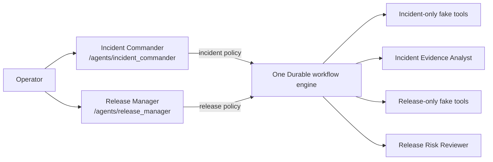
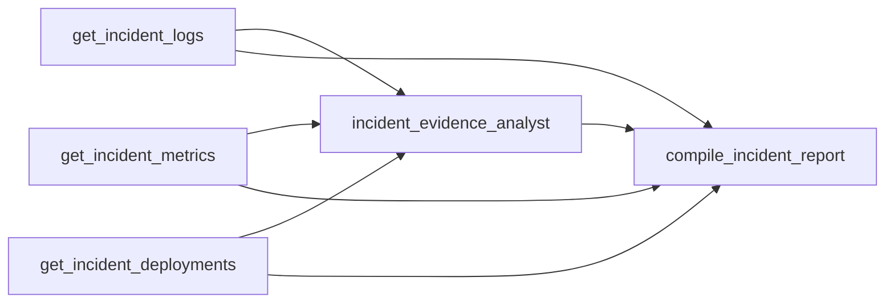
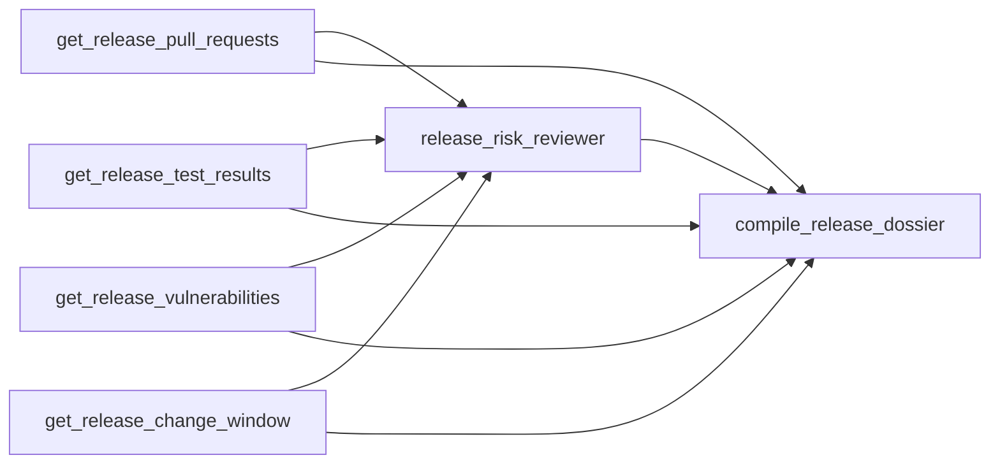

# Engineering Operations Hub

A standalone Azure Functions sample proving that two non-main agents can own
Dynamic Workflows independently in one app. The incident commander and release
manager expose built-in debug chat and `chat_api` routes, share one Durable
engine, and cannot see or invoke each other's workflow capabilities.

All operational evidence is a deterministic local fake. No GitHub, monitoring,
scanner, deployment, or other cloud API is called. A configured model provider
is still required for the two owners and their specialist agents.

## Architecture



There is intentionally no `main.agent.md`. Each owner has a distinct
`workflows.exclude` set and one distinct `workflows.subagents` grant. Specialists
are internal files without triggers or built-in endpoints.

The root-versus-`agents/` placement is only an organizational convention in this
sample. Roles come from configuration: the two root agents enable workflows and
chat starters, while the internal files are referenced through
`workflows.subagents`.

## Workflow diagrams

### Incident workflow



The terminal result is a structured report with marker
`INCIDENT_REPORT_READY`, incident and service identity, severity, evidence,
likely cause, rollback decision, recommended actions, and specialist analysis.

### Release workflow



The terminal result is a structured dossier with marker
`RELEASE_DOSSIER_READY`, release and service identity, go/no-go decision,
blocking findings, passed gates, required actions, and specialist analysis.

## Prerequisites

- Python 3.13+ with this repository installed using `pip install -e .[dev]`
- Azure Functions Core Tools v4 (`func`)
- Azurite
- One model provider:
  - Microsoft Foundry project endpoint and authenticated Azure identity;
  - Azure OpenAI endpoint, deployment, API version, and credential; or
  - OpenAI API key and chat model ID

No model provider secret belongs in source control.

`src/requirements.txt` keeps the repository's standard `-e ../../..` editable
reference, which resolves to this checkout from the committed sample directory.

## Configure and run manually

From this sample root:

```powershell
Copy-Item src\local.settings.template.json src\local.settings.json
```

Fill in one provider configuration in `src/local.settings.json`. Start Azurite,
activate the repository Python environment, then:

```powershell
Set-Location src
func start
```

Open either debug UI:

- <http://localhost:7071/agents/incident_commander/>
- <http://localhost:7071/agents/release_manager/>

### Run the incident workflow in chat

Open the Incident Commander UI, paste the following message, and send it:

> Start exactly one incident workflow now for incident INC-4821 on checkout-api.
> Use parallel task IDs incident_logs, incident_metrics, and
> incident_deployments for the three incident evidence tools. Then use a
> sub_agent task named incident_analysis with incident_evidence_analyst and
> include all three whole results. Finish with incident_report using
> compile_incident_report and pass the incident ID, service, all whole evidence
> results, and the whole specialist result. Return the workflow ID without
> polling.

The agent immediately returns a workflow ID. The chat page then displays a live
workflow card and updates it until the workflow completes.

Expected terminal output: `runtime_status` is `Completed`; the
`output.results.incident_report` object contains `INCIDENT_REPORT_READY`,
`"severity": "SEV2"`, and `"decision": "ROLLBACK"`.

### Run the release workflow in chat

Open the Release Manager UI, paste the following message, and send it:

> Start exactly one release-readiness workflow now for release REL-2026.08.11
> on checkout-api. Use parallel task IDs release_prs, release_tests,
> release_vulnerabilities, and release_window for the four release evidence
> tools. Then use a sub_agent task named release_review with
> release_risk_reviewer and include all four whole results. Finish with
> release_dossier using compile_release_dossier and pass the release ID, service,
> all whole evidence results, and the whole specialist result. Return the
> workflow ID without polling.

Expected terminal output: `runtime_status` is `Completed`; the
`output.results.release_dossier` object contains `RELEASE_DOSSIER_READY` and
`"decision": "NO_GO"` because the deterministic evidence includes an
unexcepted critical vulnerability.

## Optional DTS backend

DTS still requires Azurite for the Functions host's own storage. To use DTS,
start the emulator with ports of your choice, copy
`host.dts.json` over `host.json`, set
`DURABLE_TASK_SCHEDULER_CONNECTION_STRING`, and restart the Functions host.
Restore the default committed `host.json` to return to Azure Storage.

## Troubleshooting

- **`func` not found:** install Azure Functions Core Tools v4 and reopen the shell.
- **No model provider configured:** create `src/local.settings.json` and fill in
  one supported provider.
- **Foundry authentication fails:** run `az login` or configure the intended
  workload identity. Never paste tokens into prompts or verifier output.
- **Worker cannot import dependencies:** activate the same Python environment
  used for `pip install -e .[dev]` before launching `func`.
- **DTS provider not found:** remove stale extension-bundle caches and restart;
  the DTS host variant requires extension bundle 4.32.0 or newer.
- **A workflow times out:** inspect the Functions output and optional DTS
  dashboard.
