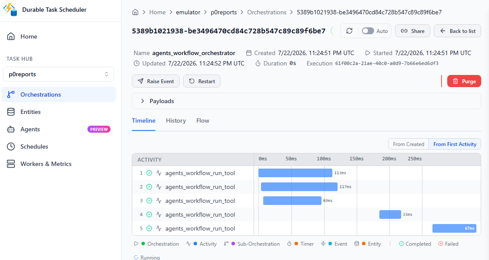
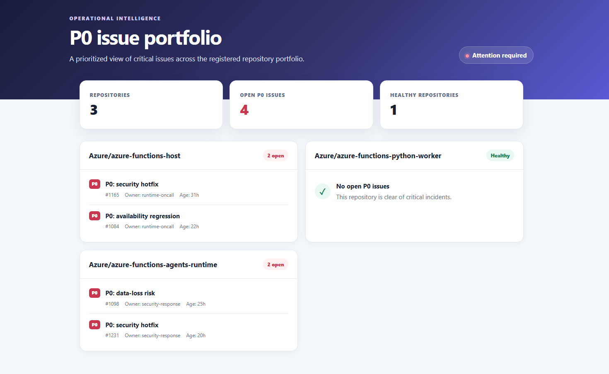

# Queue-triggered P0 issue portfolio report

This sample receives a repository portfolio from Azure Storage Queue, asks the
agent to create a Dynamic Workflow, inspects every repository in parallel,
renders one HTML summary, and uploads it to Azure Blob Storage.

The issue inspection tool is deterministic and synthetic, so the sample
needs no GitHub token. The Queue trigger and Blob terminal sink use Azurite, and
orchestration state uses the Durable Task Scheduler emulator.

## Workflow shape

```text
Queue message
  ├─ inspect repository A ─┐
  ├─ inspect repository B ─┼─ render HTML ─ publish Blob
  └─ inspect repository C ─┘
```

The independent inspection tasks have no dependencies and can execute in
parallel. The queue message is the repository registry for that report:



The final tool task publishes a responsive portfolio dashboard to Blob Storage:



```json
{
  "repositories": [
    "Azure/azure-functions-host",
    "Azure/azure-functions-python-worker",
    "Azure/azure-functions-durable-python"
  ],
  "report_blob": "reports/p0-issues.html"
}
```

## Run locally

Create the environment and local settings:

```powershell
Set-Location samples\workflow-queue-p0-report\src
python -m venv .venv
.\.venv\Scripts\Activate.ps1
python -m pip install -r requirements.txt
Copy-Item local.settings.template.json local.settings.json
```

Set `FOUNDRY_PROJECT_ENDPOINT` and `FOUNDRY_MODEL` in
`local.settings.json`, then authenticate:

```powershell
az login
```

Start the emulators in separate terminals:

```powershell
docker run --rm --name dts-emulator `
  -e DTS_TASK_HUB_NAMES=default,p0reports `
  -p 8080:8080 -p 8082:8082 `
  mcr.microsoft.com/dts/dts-emulator:latest
```

```powershell
docker run --rm --name azurite `
  -p 10000:10000 -p 10001:10001 -p 10002:10002 `
  mcr.microsoft.com/azure-storage/azurite:latest `
  azurite --silent --skipApiVersionCheck `
  --blobHost 0.0.0.0 --queueHost 0.0.0.0 --tableHost 0.0.0.0
```

Start the Functions host:

```powershell
func start
```

Create the input queue and submit the default report request:

```powershell
Set-Location samples\workflow-queue-p0-report
.\local-report.ps1 -Action Submit
```

Pass `-Repositories owner/repo,owner/another-repo` or
`-ReportBlob reports/custom.html` to customize the request.

Watch the Function logs for `workflow started` followed by
`P0_REPORT_PUBLISHED`. Inspect task parallelism and history in the DTS dashboard
at <http://localhost:8082>.

Download the generated report:

```powershell
.\local-report.ps1 -Action Download
```

## Production adaptation

Replace `inspect_repository_p0_issues` with a GitHub API implementation and use
managed identity for Azure Storage. The sample publisher currently reads the
`AzureWebJobsStorage` connection string; an identity-based adaptation should
construct `BlobServiceClient` with the storage account URL and
`DefaultAzureCredential`. Keep the same workflow shape: one inspection task per
repository, JSON-serializable results, a fan-in renderer, and a final delivery
task.
