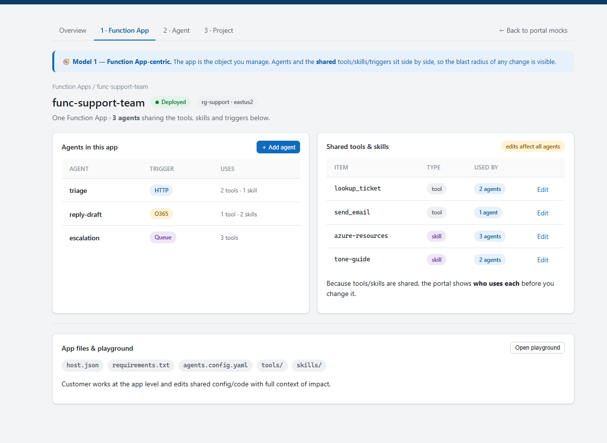
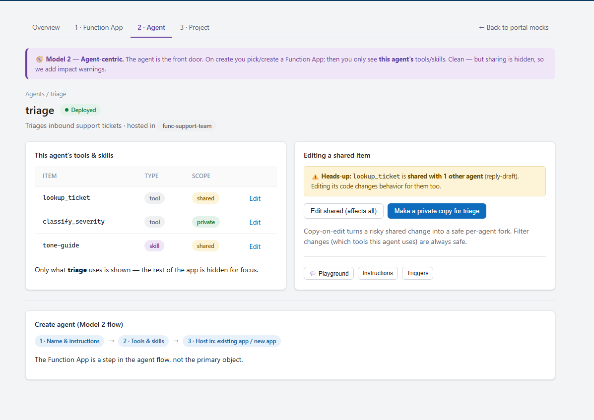
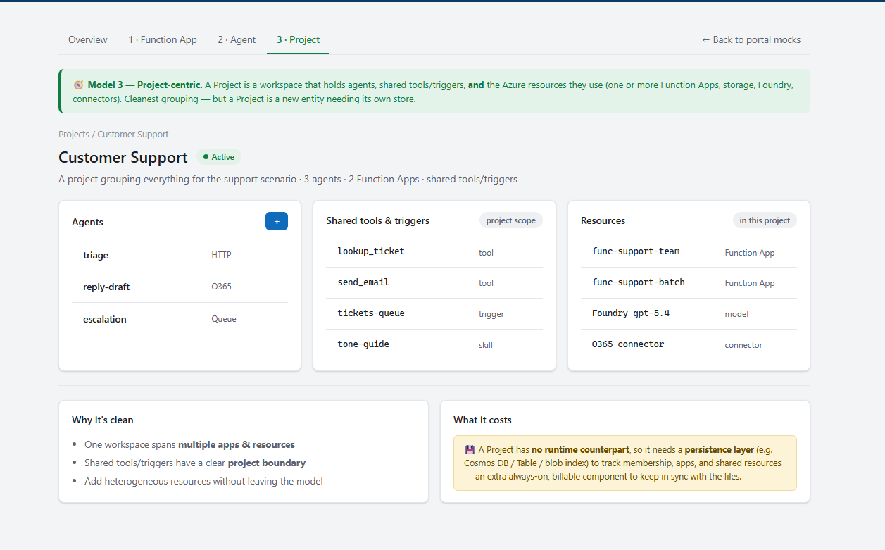

# Serverless Agent Portal — Mental Model Proposal

> **Decision:** Start **Agent-centric**. Defer the **Project** model (and its
> persistence layer) until the concept is validated.
> Concept mockups: [`../mocks/concepts/`](../mocks/concepts/index.html).

## 1. Context

We must choose the **primary object** the customer manages. One fact constrains
the choice: in the runtime, `tools/`, `skills/`, and `mcp.json` live at the
**Function App** level and are **shared** across its agents — each agent only
*filters* which ones it uses. So "shared tools/skills" is real, and editing a
shared item affects every agent that uses it.

## 2. The three approaches

- **Function App-centric** — the app is the object; agents + shared tools/skills
  sit inside it, and sharing is visible.

- **Agent-centric** — the agent is the front door; on create you pick/create a
  Function App; each agent shows only the tools/skills it uses.

- **Project-centric** — a new "Project" object groups agents, shared
  tools/triggers, and multiple Azure resources (apps, storage, Foundry,
  connectors).

## 3. Comparison

| Dimension | Why it matters | Function App | **Agent** (proposed) | Project |
| --- | --- | --- | --- | --- |
| **Primary object** | What the customer navigates and reasons about | Function App — an Azure/infra noun | **Agent — the thing customers actually want** | Project — a workspace concept |
| **Front-door intuitiveness** | How fast a new user "gets it" | Medium — must learn the app is the container | **High — "I want to create an agent"** | Medium — must learn a new grouping first |
| **Maps to runtime reality** | Risk of a leaky/again-translated abstraction | **Exact — 1:1 with the deployed app** | Indirect — agent sits one level above the app | Abstraction layered on top of apps |
| **Shared tools/skills visibility** | Tools/skills are physically shared per app | **Explicit — sharing is shown** | Hidden by default — needs "used by N agents" cues | Visible, scoped to the project |
| **Safe edits (blast radius)** | Editing a shared tool affects every agent using it | **High — impact is obvious** | Low unless we add warnings + copy-on-edit | High — bounded by the project |
| **Grouping many resources** | Real orgs span multiple apps, storage, Foundry, connectors | Weak — one app only | Weak — one app per agent-group | **Strong — many resources in one workspace** |
| **Isolation between agents** | Noisy-neighbor, scaling, quota, secrets | App-shared | App-shared | Project-scoped |
| **New persistence needed** | Extra stateful service to build + operate | No — files are the source of truth | No — same blob working copy | **Yes — a project store to track membership/resources** |
| **Added cost / moving parts** | Ongoing $$ and complexity | None | None | **High — store + sync + lifecycle + RBAC** |
| **Build effort (v1)** | Time to a working create→edit→deploy loop | Low | **Low–Med** | High |
| **Path to scale later** | Can it grow without a rewrite? | Add an agent-first face | **Add Projects on top when needed** | Already the end state |

**Reading the table:** Function App is the most *honest* (matches the runtime) but
leads with infra vocabulary. Project is the *cleanest at scale* but is the only
option needing a new, always-on persistence layer. **Agent** wins the front door
and needs **no new state** — its one weakness (hidden sharing) is fixable in the UI
with "used by N agents", edit warnings, and copy-on-edit, which is why it's the v1
proposal.

## 4. Why Project-centric is costly

Function App and Agent models ride entirely on the **existing blob working copy** —
the files are the source of truth, so there is **no new state to run**. A Project
has **no runtime counterpart**, so it forces new moving pieces:

- **A project store** (Cosmos DB / Table / a maintained blob index) — an
  always-on, billable service to track project → agents → apps → resources.
- **A consistency layer** to keep that store in sync with the files that remain
  the real source of truth (two sources of truth = drift + reconciliation).
- **Cross-resource wiring** — membership, ownership, and references spanning
  multiple Function Apps and resources.
- **Project lifecycle** — create/rename/delete, orphan cleanup, and
  project-scoped RBAC.
- **Migration/backfill** — folding existing apps and agents into projects.

That's a stateful component plus more APIs and UI to keep coherent — real cost for
value we can't yet confirm customers need.

## 5. Proposed solution

**Ship Agent-centric on the Function App reality.**

- Front door is **"create an agent"**; the customer picks or creates a Function
  App underneath. No new persistence — blob working copy stays the source of truth.
- Defuse the one risk of hiding sharing: show **"used by N agents"** on tools/
  skills, **warn before editing a shared item**, and offer **copy-on-edit** (fork
  a private copy for this agent).
- **Add Projects later** — only if customers regularly need to group multiple
  apps/resources under one workspace; that's the trigger to pay for the project
  persistence layer.
