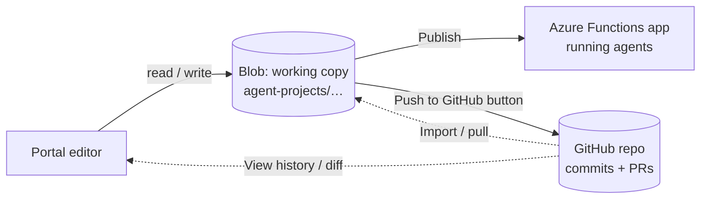

# Serverless Agent Portal — Requirements (Draft v0.1)

> **Status:** Draft for review. This is a first cut intended to gather feedback.
> Assumptions are called out inline and collected in [§12](#12-open-questions--assumptions).
> Nothing here is final.

## 1. Summary

The **Serverless Agent Portal** is a web-based control plane for agents built on
[`azurefunctions-agents-runtime`](../README.md). It lets a team **author,
configure, deploy, test, monitor, and manage** markdown-first AI agents that run
on Azure Functions — without hand-editing files and running CLI commands for
every operation.

The runtime already turns an agent project (`*.agent.md` + `agents.config.yaml` +
`mcp.json` + `tools/` + `skills/`) into an Azure Functions app. Today that
authoring and operations loop is file-and-CLI driven. The portal puts a UI on top
of the same building blocks: a catalog of agents, a visual authoring surface for
the `.agent.md` format, provider/trigger/tool configuration, a test playground,
and an observability dashboard.

## 2. Goals

- **G1 — Central catalog.** One place to see every agent, its trigger type, model
  provider, deployment status, and recent health.
- **G2 — Visual authoring.** Create and edit `.agent.md` (frontmatter +
  instructions) with validation, without leaving the browser.
- **G3 — Capability wiring.** Manage tools, MCP servers, skills, and triggers per
  agent using the same discovery/merge model the runtime uses.
- **G4 — Provider config.** Configure OpenAI / Azure OpenAI / Microsoft Foundry
  providers and models, matching the runtime's provider precedence rules.
- **G5 — Test in place.** A chat/playground surface to invoke an agent (HTTP +
  streaming) and inspect tool calls and sessions.
- **G6 — Observability.** Invocation counts, latency, errors, and traces
  surfaced from the runtime's OpenTelemetry / Azure Monitor output.
- **G7 — Deploy.** Trigger a deploy to Azure (via `azd` / Functions) and see
  status, without leaving the portal.

## 3. Non-goals (for this draft)

- **NG1** — Not replacing the file-based authoring model. The portal reads and
  writes the same files; the repo remains the source of truth.
- **NG2** — Not a general Azure management console. It manages *agents*, not
  arbitrary Azure resources.
- **NG3** — Not a model-training or fine-tuning surface.
- **NG4** — Billing/cost management is surfaced read-only at most (out of scope
  for v0.1 detail).
- **NG5** — Multi-tenant SaaS hardening (org isolation, per-tenant quotas) is out
  of scope for the first milestone.

## 4. Personas

| Persona | Needs | Primary surfaces |
| --- | --- | --- |
| **Agent Author / Developer** | Create and tune agents, wire tools/MCP/skills, test quickly | Authoring, Playground, Tools & MCP |
| **Operator / SRE** | Watch health, invocations, errors, sessions; diagnose failures | Dashboard, Monitoring, Sessions |
| **Admin** | Manage providers, credentials, environments, access | Settings, Providers |

## 5. Scope: mapping to the runtime

The portal is a thin control plane over concepts that already exist in the
runtime. Each portal feature maps to a runtime construct:

| Portal feature | Runtime construct | Reference |
| --- | --- | --- |
| Agent list & detail | `*.agent.md` → `AgentSpec` → `ResolvedAgent` | `config/loader.py`, `config/merge.py` |
| Authoring editor | YAML frontmatter + markdown body | `docs/front-matter-spec.md` |
| Triggers tab | `TriggerSpec` (HTTP, timer, queue, blob, Event Hub, Service Bus, Cosmos DB, connectors) | `docs/triggers.md` |
| Tools & MCP tab | `tools/*.py` (`@tool`), `mcp.json`, `skills/<name>/SKILL.md` | `discovery/*` |
| Built-in endpoints | `builtin_endpoints: true` (chat UI, chat API, SSE, MCP) | `registration/endpoints.py` |
| Providers/models | `AZURE_FUNCTIONS_AGENTS_PROVIDER`, provider env vars | `client_manager.py`, `README.md` |
| Playground | HTTP `/agents/<name>/chat` + `/chatstream` | `registration/endpoints.py` |
| Sessions browser | Blob-backed session history | `_blob_history.py` |
| Connectors | Connector-backed MCP + Functions Connector Extension + `mcp.json` | `discovery/mcp.py`, `docs/triggers.md` |
| Monitoring | OpenTelemetry `gen_ai` + Azure Monitor exporter | `_observability.py`, `docs/observability.md` |

### 5.1 Design inspiration: Azure SRE Agent

The portal borrows two patterns from the **Azure SRE Agent** experience:

- **A Connectors hub** — a single place to connect external services (Office 365,
  Teams, GitHub, ServiceNow, PagerDuty, Slack, SQL, Salesforce, SAP, …) and see
  their connection/auth status. In our case these map to connector-backed MCP
  servers and the Azure Functions Connector Extension rather than SRE incident
  tooling. See [`mocks/connectors.html`](mocks/connectors.html).
- **Operations-first monitoring** — health, failures, and traces surfaced up front
  with a path from a failure to its trace.

**On monitoring scope (open decision — see Q7):** Azure SRE Agent already provides
deep infrastructure/incident monitoring for the underlying Function App. To avoid
duplicating it, the portal's monitoring is scoped to **agent-specific telemetry**
the SRE Agent does not cover well: per-agent invocations, token usage, tool/MCP
call outcomes, `gen_ai` traces, and session history. Infra-level signals (CPU,
cold starts, platform incidents) can **link out** to Azure Monitor / Azure SRE
Agent instead of being re-implemented here.

### 5.2 Identifying serverless agents among Azure Functions

Because agents are hosted as ordinary Azure Functions, the portal needs a reliable
way to tell **which Function Apps (and which functions inside them) are agents**
built on this runtime, and to pull data only for those. The runtime already emits
distinguishing signals; the portal consumes them in three layers:

| Question | Signal | How the portal uses it |
| --- | --- | --- |
| **Which Function Apps are agent apps?** (fleet case) | A **resource tag** stamped by the `azd`/Bicep deploy (e.g. `azure-functions-agents-runtime: <version>`) and/or an **app-setting marker** (e.g. `AZURE_FUNCTIONS_AGENTS_RUNTIME=<version>`). | Azure Resource Graph filter — no need to invoke the app. |
| **Which agents live in an app?** (inventory) | The startup **`agent_runtime_indexed`** event (App Insights / OpenTelemetry) with `agent_count` and per-agent `source_file`, `trigger_type`, `builtin_endpoints`, capabilities. Optionally a proposed read-only **`/runtime/agents`** metadata endpoint returning the same JSON. | Read the event (or call the endpoint) to list agents without re-parsing files. |
| **Runtime data for those agents** | Runtime **naming convention**: every registered function is prefixed `agent_` (e.g. `agent_main_builtin_chat`, `agent_main_builtin_mcp`), routes under `/agents/<name>/…`, MCP at `/runtime/webhooks/mcp`; plus `gen_ai` span attributes and the blob session container. | Filter App Insights traces/metrics and blob sessions by these names/attributes. |

Reference example Resource Graph query:

```kusto
Resources
| where type =~ 'microsoft.web/sites' and kind contains 'functionapp'
| where tags['azure-functions-agents-runtime'] != ''
| project name, resourceGroup, location, tags['azure-functions-agents-runtime']
```

**Scope dependency (Q2).** This identification problem only exists in the **fleet /
multi-app** case. If the portal is **workspace/single-project scoped** (assumption
**A1**), discovery is trivial — it reads the local `*.agent.md` files directly —
and no tag/telemetry marker is required. The tag + `/runtime/agents` endpoint are
proposed as **small runtime enhancements** needed only if we go fleet-wide.

### 5.3 Persistence & storage model

Customers author agents through the portal, so those edits need a store the portal
owns and the runtime can serve. We use a **two-tier model** plus an optional third
tier for history:

1. **Working copy (blob)** — the primary authoring store. The portal reads/writes
   the agent project tree (`*.agent.md`, `agents.config.yaml`, `mcp.json`,
   `tools/`, `skills/`) in a dedicated container in the **Function App's storage
   account** — the same account the runtime already uses for `AzureWebJobsStorage`
   and blob session history ([`_blob_history.py`](../src/azure_functions_agents/_blob_history.py)).
   No extra resources, no account keys, identity-based access, multi-instance safe.
2. **Published / running** — what the deployed Function App actually serves. A
   **Publish** action promotes the working copy to the running app.
3. **Git history (future)** — a **Push to GitHub** action commits the working copy
   to a configured repo for version history, diffs, PRs, and rollback.

Blob layout:

```
<function app storage account>
└── container: agent-projects
    └── <project>/<environment>/
        ├── main.agent.md
        ├── agents/<name>.agent.md
        ├── agents.config.yaml
        ├── mcp.json
        ├── tools/*.py
        └── skills/<name>/SKILL.md
```

Flow:



**How the running app picks up changes (key decision — see Q10).** Today the
runtime loads `*.agent.md` from the local app root at startup
(`create_function_app()`), so blob edits are not live until the app reloads. Two
options:

- **A · Deploy-on-publish (minimal runtime change):** the working copy lives in
  blob; **Publish** builds a package from blob and deploys (azd/func) → the app
  restarts and serves the new files. Simple; each go-live is a deploy.
- **B · Blob-backed project loader (runtime enhancement):** teach the runtime to
  read the project tree from the storage container (mirroring the existing blob
  session pattern), with a lightweight refresh so edits go live without a full
  redeploy. More work, better authoring loop.

**Versioning without GitHub.** Enable **blob versioning + snapshots** so every save
creates a restorable version — this gives basic “view / restore previous version”
history in the portal even before GitHub is connected. Each save records author,
timestamp, and an optional message (blob metadata / a small index blob).

**Concurrency & safety.** Use **ETag / If-Match** optimistic concurrency on save to
avoid clobbering concurrent edits; enable **soft delete** for recovery; validate
`.agent.md` against the schema before Publish.

**GitHub integration (future).** Connect via a **GitHub App / OAuth** with the token
in **Key Vault** (contents:write scoped to the target repo). **Push to GitHub**
takes the working copy and creates either a direct commit or a **branch + pull
request** (recommended) with a message. **View history** reads commit/file history
and diffs via the GitHub API. Optional **Import / Pull** seeds or refreshes the blob
working copy from a repo.

**Security.** Blob access via **Managed Identity** (Storage Blob Data Contributor) —
no account keys, matching the runtime's existing storage pattern; GitHub token
least-privilege in Key Vault; never render secrets; audit Publish and Push actions.

## 6. Functional requirements

### 6.1 Dashboard
- **FR-1** Show total agents, deployed vs. draft, and 24h invocation/error counts.
- **FR-2** Show a per-agent health strip (last invocation, success rate, p95
  latency).
- **FR-3** Surface recent failures with a link to the failing session/trace.

### 6.2 Agent catalog
- **FR-4** List all agents with: name, description, trigger type, model/provider,
  built-in endpoints, status (draft / deployed / error).
- **FR-5** Filter by trigger type, provider, and status; free-text search.
- **FR-6** Actions per row: open, test, deploy, disable.

### 6.3 Agent detail (tabbed)
- **FR-7 Overview** — resolved view (name, description, instructions preview,
  trigger, model, endpoints, attached tools/MCP/skills).
- **FR-8 Authoring** — edit frontmatter + instructions with live validation
  against the schema; show unresolved `$ENV` placeholders as warnings.
- **FR-9 Tools & MCP** — list discovered `tools/`, `mcp.json` servers, and
  `skills/`; toggle per-agent allow/deny filters.
- **FR-10 Triggers** — configure trigger type and binding fields.
- **FR-11 Sessions** — browse recent sessions for this agent; open transcript.
- **FR-12 Monitoring** — per-agent invocations, latency, errors, and traces.

### 6.4 Create agent
- **FR-13** Guided create: name, description, template (chat / timer / queue /
  connector), provider, and whether to expose built-in endpoints.
- **FR-14** Produce a valid `*.agent.md` (+ scaffold config) and land in the
  Authoring tab.

### 6.5 Playground
- **FR-15** Chat with a selected agent; support streaming (SSE) responses.
- **FR-16** Show tool calls / MCP calls inline in the transcript.
- **FR-17** Show and reuse `session_id` for multi-turn conversations.

### 6.6 Connectors
- **FR-18** Browse available connectors by category and see which are connected.
- **FR-19** Show active connections with type (connector MCP / HTTP MCP / custom),
  which agents use them, auth method, and status (connected / reauth required).
- **FR-20** Add a connection (OAuth / managed identity / API key) or point to a
  custom HTTP MCP server URL; connections map to `mcp.json` + the Connector
  Extension.
- **FR-21** Never display secrets; store credentials in the platform secret store.

### 6.7 Providers
- **FR-22** Configure provider (OpenAI / Azure OpenAI / Microsoft Foundry),
  endpoints, deployment/model, and credential source (key vs.
  `DefaultAzureCredential`).
- **FR-23** Validate connectivity to the selected provider.
- **FR-24** Show the runtime's model-resolution precedence and provider
  auto-detection order so the effective choice is obvious.

### 6.8 Environments
- **FR-25** Manage named environments (e.g., local, dev, prod), each mapping to a
  Function App target, provider, connectors, and app settings.
- **FR-26** Set the active environment; view/edit per-environment app settings
  (secrets masked); diff settings between environments.
- **FR-27** Deploy to and promote between environments.

### 6.9 Settings
- **FR-28** Project settings (repo, branch, whether portal edits commit to git).
- **FR-29** Access & roles (Entra ID; Admin / Author / Operator).
- **FR-30** Observability toggles (OpenTelemetry export, sensitive-data capture,
  audit logging) and portal preferences (theme, landing page, retention).

### 6.10 Deploy
- **FR-31** Trigger a deploy (azd/Functions) and stream status/logs.
- **FR-32** Show last deploy result, timestamp, and target Function App.

### 6.11 Persistence & versioning
- **FR-33** Persist the agent project (`*.agent.md` + config + `tools/` + `skills/`)
  as a working copy in the Function App storage account (blob container).
- **FR-34** Every save creates a restorable version (blob versioning / snapshots)
  with author, timestamp, and optional message; allow viewing and restoring versions.
- **FR-35** Use optimistic concurrency (ETag) on save; validate schema before publish.
- **FR-36** **Publish** promotes the working copy to the running Function App and
  shows what changed vs. the published state.
- **FR-37** *(Future)* Connect a GitHub repo; **Push to GitHub** commits the working
  copy (direct commit or branch + PR) with a message.
- **FR-38** *(Future)* View change history and diffs from GitHub; optional import / pull.

## 7. Non-functional requirements

- **NFR-1 Security.** Never render secrets; credentials are write-only in the UI
  and stored via the platform's secret store (e.g., Key Vault / app settings).
  Follow OWASP Top 10 for the portal's own API.
- **NFR-2 AuthN/Z.** Portal sits behind Entra ID; role-based access
  (Author / Operator / Admin) — details TBD ([§12](#12-open-questions--assumptions)).
- **NFR-3 Consistency.** The portal must not diverge from the file model; writes
  produce the same files the runtime reads.
- **NFR-4 Responsiveness.** Primary surfaces usable on laptop widths (≥1280px);
  graceful down to tablet.
- **NFR-5 Accessibility.** WCAG 2.1 AA for core flows.
- **NFR-6 Observability of the portal itself.** Portal actions (deploy, edit) are
  audit-logged.

## 8. Information architecture

```
Portal
├── Dashboard
├── Monitoring (fleet-wide)
├── Agents
│   ├── (list / catalog)
│   └── Agent detail
│       ├── Overview
│       ├── Authoring
│       ├── Tools & MCP
│       ├── Triggers
│       ├── Sessions
│       └── Monitoring
├── Create agent
├── Playground
├── Source & history (working copy · versions · GitHub)
└── Configure
    ├── Connectors
    ├── Providers
    ├── Environments
    └── Settings (project · access · observability · preferences)
```

## 9. Mockups

Low-fidelity, clickable HTML mockups live in [`mocks/`](mocks/). Open
[`mocks/index.html`](mocks/index.html) in a browser and use the left nav to move
between screens. Included screens:

| Screen | File | Covers |
| --- | --- | --- |
| Dashboard | [`mocks/index.html`](mocks/index.html) | FR-1–FR-3 |
| Agents catalog | [`mocks/agents.html`](mocks/agents.html) | FR-4–FR-6 |
| Agent detail | [`mocks/agent-detail.html`](mocks/agent-detail.html) | FR-7–FR-12 |
| Create agent | [`mocks/create-agent.html`](mocks/create-agent.html) | FR-13–FR-14 |
| Playground | [`mocks/playground.html`](mocks/playground.html) | FR-15–FR-17 |
| Source & history | [`mocks/source-control.html`](mocks/source-control.html) | FR-33–FR-38 |
| Connectors | [`mocks/connectors.html`](mocks/connectors.html) | FR-18–FR-21 |
| Providers | [`mocks/providers.html`](mocks/providers.html) | FR-22–FR-24 |
| Environments | [`mocks/environments.html`](mocks/environments.html) | FR-25–FR-27 |
| Settings | [`mocks/settings.html`](mocks/settings.html) | FR-28–FR-30 |
| Monitoring | [`mocks/monitoring.html`](mocks/monitoring.html) | FR-1–FR-3, FR-12 |

> The mockups are **static and illustrative** — no real data or backend. They
> exist to align on layout, information hierarchy, and flow before any build.
> The Connectors hub and operations-first monitoring are inspired by the Azure
> SRE Agent experience (see [§5.1](#51-design-inspiration-azure-sre-agent)).

## 10. Milestones (proposed)

- **M0 — Alignment (this doc + mocks).** Agree scope, IA, and screens.
- **M1 — Read-only portal.** Catalog, agent detail (read), monitoring, sessions.
- **M2 — Authoring + playground.** Edit `.agent.md` into the **blob working copy**
  with versioning, validate, test via chat.
- **M3 — Providers + deploy.** Provider config and Publish to the running app.
- **M4 — Access + environments.** RBAC and multi-environment config.
- **M5 — GitHub history (future).** Connect a repo, Push to GitHub, view history/diffs.

## 11. Success metrics (proposed)

- Time-to-first-working-agent from portal (create → test) under a target
  threshold (TBD).
- % of agent edits done in-portal vs. file/CLI.
- Mean time to diagnose a failed invocation using the portal.

## 12. Open questions & assumptions

**Assumptions (please confirm or correct):**
- **A1** — The portal manages one repo/agent project at a time (workspace-scoped),
  not many projects across subscriptions.
- **A2** — The **blob working copy** in the Function App storage account is the
  primary authoring store; **GitHub is optional version history / backup**, not the
  always-on source of truth. **Publish** promotes the working copy to the running
  app. (See [§5.3](#53-persistence--storage-model).)
- **A3** — Deploy uses the existing `azd` flow already present in `samples/*`.
- **A4** — Monitoring data comes from the runtime's existing OpenTelemetry /
  Azure Monitor output, not a new telemetry pipeline.
- **A5** — Target look-and-feel is an Azure-portal-adjacent, clean, light theme.

**Open questions:**
- **Q1** — Hosting: is the portal itself a static SPA + API, an Azure Functions
  app, a container, or a VS Code extension surface?
- **Q2** — Single-project vs. fleet across many Function Apps / subscriptions?
- **Q3** — Who are the first users (internal dev team vs. external preview)?
- **Q4** — Editing model: does the portal commit to git, or edit a working copy?
- **Q5** — RBAC granularity for M4.
- **Q6** — Which trigger types must the visual editor support first?
- **Q7** — Monitoring scope: keep agent-specific telemetry only and link out to
  Azure Monitor / Azure SRE Agent for infra/incident signals, or build deeper
  monitoring in-portal? (See [§5.1](#51-design-inspiration-azure-sre-agent).)
- **Q8** — Connectors: which services matter first (Office 365 / GitHub /
  ServiceNow / Slack …), and is OAuth connection management in scope for M1?
- **Q9** — Agent identification (fleet case): are we willing to add a runtime
  **resource tag / app-setting marker** and a read-only **`/runtime/agents`**
  metadata endpoint to make agent apps discoverable via Azure Resource Graph?
  (See [§5.2](#52-identifying-serverless-agents-among-azure-functions).)
- **Q10** — Publish model: **deploy-on-publish** (minimal runtime change) or a
  **blob-backed project loader** with live refresh (runtime enhancement)? (See
  [§5.3](#53-persistence--storage-model).)

---

*Feedback welcome directly in this file (inline comments) or on the mockups.*
